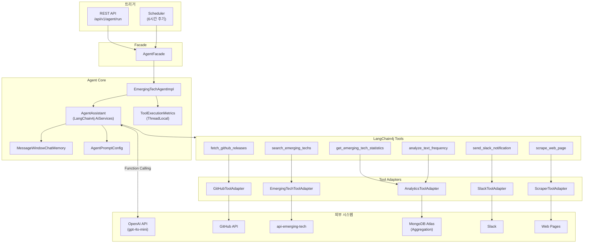

# API Agent 모듈

LangChain4j 기반 Emerging Tech 데이터 분석 및 업데이트 추적 AI Agent 서비스입니다.

## 개요

`api-agent` 모듈은 LangChain4j와 OpenAI를 활용하여 빅테크 AI 서비스(OpenAI, Anthropic, Google, Meta, xAI)의 업데이트를 자율적으로 추적하고 분석하는 AI Agent를 제공합니다. 자연어 목표(Goal)를 입력받아 GitHub Release 조회, 웹 스크래핑, 데이터 통계 집계, 키워드 빈도 분석 등의 작업을 자동으로 수행하며, 결과를 Markdown 표와 Mermaid 차트로 시각화합니다.

## 아키텍처



## 주요 기능

### Agent 기능

| 기능 | 설명 |
|------|------|
| 자율 실행 | 자연어 목표(Goal)를 입력받아 필요한 Tool을 자동으로 선택하고 실행 |
| 데이터 분석 | Provider/SourceType/UpdateType별 통계 집계, 키워드 빈도 분석 |
| 시각화 | Mermaid pie/bar 차트 및 Markdown 표로 분석 결과 시각화 |
| 데이터 수집 | GitHub Release 추적, 웹 스크래핑으로 최신 업데이트 수집 |
| 중복 방지 | 수집 전 기존 업데이트 검색으로 중복 확인 |
| 스케줄 실행 | 6시간 주기로 자동 업데이트 추적 |
| 오류 알림 | 실행 실패 시 Slack 알림 |

### LangChain4j Tools

| Tool | 설명 |
|------|------|
| `fetch_github_releases` | GitHub 저장소의 최신 릴리스 목록 조회 |
| `scrape_web_page` | 웹 페이지 크롤링 (robots.txt 준수) |
| `search_emerging_techs` | 저장된 Emerging Tech 데이터 검색 |
| `get_emerging_tech_statistics` | Provider/SourceType/UpdateType별 통계 집계 (MongoDB Aggregation) |
| `analyze_text_frequency` | title/summary 텍스트 키워드 빈도 분석 (서버사이드 집계) |
| `send_slack_notification` | Slack 알림 전송 |

## Agent 동작 흐름

### 통계 분석 요청

```
사용자 Goal: "최근 AI 업데이트 현황을 수집해주세요"

Agent 추론 과정:
1. get_emerging_tech_statistics("provider", "", "")
   → { totalCount: 179, groups: [{name:"ANTHROPIC", count:72}, {name:"OPENAI", count:45}, ...] }

2. get_emerging_tech_statistics("source_type", "", "")
   → { totalCount: 179, groups: [{name:"WEB_SCRAPING", count:115}, {name:"GITHUB_RELEASE", count:64}] }

3. fetch_github_releases("openai", "openai-python")
   → 최신 릴리스 확인

4. scrape_web_page("https://www.anthropic.com/news")
   → 최신 블로그 포스트 수집

5. send_slack_notification("데이터 수집 완료: ...")
   → Slack 알림 전송

결과: Provider별/SourceType별 통계 Markdown 표 + 신규 데이터 수집 결과 요약
```

### 키워드 빈도 분석 요청

```
사용자 Goal: "올해 수집된 데이터의 주요 키워드를 분석해줘"

Agent 추론 과정:
1. analyze_text_frequency("", "2025-01-01", "2025-12-31", 20)
   → { totalDocuments: 179, topWords: [{word:"model", count:312}, ...] }

2. Mermaid xychart-beta 바 차트 + Markdown 표 생성

결과:
| 순위 | 키워드 | 빈도 |
|------|--------|------|
| 1    | model  | 312  |
| 2    | api    | 218  |
| ...  | ...    | ...  |
```

## 현재 개발 상황

### Agent 실행 테스트 결과

EmergingTech Agent의 로컬 환경 테스트가 성공적으로 완료되었습니다. 아래는 실제 테스트 과정에서 확인된 시스템 동작 로그입니다.

#### 1. Agent 실행 요청 및 응답

자연어 목표를 입력하면 Agent가 자율적으로 Tool을 선택하여 데이터 수집 및 분석을 수행합니다.


**주요 확인 사항**:
- Agent 실행 API (`POST /api/v1/agent/run`) 정상 동작
- 데이터 수집 및 Slack 알림 자동 수행
- `toolCallCount`, `analyticsCallCount` 메트릭 정상 집계

#### 2. LLM Function Calling - 통계 분석 Tool 호출

Agent가 `get_emerging_tech_statistics` Tool을 호출하여 Provider/SourceType별 통계를 집계하는 과정입니다.


#### 3. GitHub Release 수집

`fetch_github_releases` Tool을 통한 GitHub SDK 릴리스 자동 수집 과정입니다.


#### 4. LLM 자율 추론 및 Tool 선택

OpenAI GPT-4o-mini가 Function Calling을 통해 다음 Tool을 자율적으로 선택하는 과정입니다.


#### 5. 웹 스크래핑 및 데이터 수집

`scrape_web_page` Tool을 통한 빅테크 블로그 최신 포스트 수집 과정입니다.


#### 6. 통계 결과 시각화 및 Slack 알림

Agent가 수집/분석 결과를 Markdown 표로 정리하고 Slack 알림을 전송하는 과정입니다.


#### 7. 최종 실행 결과

전체 데이터 수집 및 분석 작업의 최종 결과 응답입니다.


#### 8. MongoDB Atlas 데이터 확인

수집된 Emerging Tech 데이터가 MongoDB Atlas `emerging_techs` 컬렉션에 정상 저장된 모습입니다.


## API 엔드포인트

### Agent 실행 API

```
POST /api/v1/agent/run
X-Internal-Api-Key: {api-key}
Content-Type: application/json

{
  "goal": "최근 AI 업데이트 현황을 수집해주세요"
}
```

### Response

```json
{
  "code": "2000",
  "message": "성공",
  "data": {
    "success": true,
    "summary": "최근 AI 업데이트 데이터 수집 및 분석 완료...",
    "toolCallCount": 8,
    "analyticsCallCount": 2,
    "executionTimeMs": 48612,
    "errors": []
  }
}
```

## 디렉토리 구조

```
api/agent/
├── src/main/java/.../api/agent/
│   ├── ApiAgentApplication.java
│   ├── agent/
│   │   ├── EmergingTechAgent.java          # Agent 인터페이스
│   │   ├── EmergingTechAgentImpl.java      # Agent 구현체
│   │   ├── AgentAssistant.java             # LangChain4j AiServices 인터페이스
│   │   └── AgentExecutionResult.java       # 실행 결과 DTO
│   ├── config/
│   │   ├── AiAgentConfig.java              # OpenAI 모델 설정
│   │   ├── AgentPromptConfig.java          # System Prompt 외부 설정
│   │   ├── AnalyticsConfig.java            # 분석 설정 (불용어 등)
│   │   └── ServerConfig.java               # ComponentScan 설정
│   ├── controller/
│   │   └── AgentController.java
│   ├── dto/
│   │   └── request/
│   │       └── AgentRunRequest.java
│   ├── facade/
│   │   └── AgentFacade.java                # Controller ↔ Agent 중간 계층
│   ├── metrics/
│   │   └── ToolExecutionMetrics.java       # ThreadLocal 기반 Tool 실행 메트릭
│   ├── scheduler/
│   │   └── EmergingTechAgentScheduler.java
│   └── tool/
│       ├── EmergingTechAgentTools.java      # Tool 정의 클래스 (6개 Tool)
│       ├── adapter/
│       │   ├── AnalyticsToolAdapter.java    # 통계/빈도 분석 어댑터
│       │   ├── EmergingTechToolAdapter.java # 검색 어댑터
│       │   ├── GitHubToolAdapter.java       # GitHub API 어댑터
│       │   ├── ScraperToolAdapter.java      # 웹 스크래핑 어댑터
│       │   └── SlackToolAdapter.java        # Slack 알림 어댑터
│       ├── dto/
│       │   ├── EmergingTechDto.java
│       │   ├── GitHubReleaseDto.java
│       │   ├── ScrapedContentDto.java
│       │   ├── StatisticsDto.java           # 통계 집계 결과
│       │   ├── ToolResult.java
│       │   └── WordFrequencyDto.java        # 키워드 빈도 분석 결과
│       ├── handler/
│       │   └── ToolErrorHandlers.java       # Tool 오류 처리 전략
│       ├── util/
│       │   ├── DataCollectionProcessorUtil.java
│       │   └── TextTruncator.java
│       └── validation/
│           └── ToolInputValidator.java      # Tool 입력값 검증
└── src/main/resources/
    ├── application.yml
    └── application-agent-api.yml
```

## 설정

### application.yml

```yaml
server:
  port: 8087

spring:
  application:
    name: agent-api
  profiles:
    include:
      - common-core
      - agent-api
      - mongodb-domain
      - feign-github
      - feign-internal
      - slack
      - scraper
```

### application-agent-api.yml

```yaml
# Agent용 OpenAI 설정
langchain4j:
  open-ai:
    chat-model:
      api-key: ${OPENAI_API_KEY:}
      model-name: gpt-4o-mini
      temperature: 0.3
      max-tokens: 4096
      timeout: 120s

# Emerging Tech 내부 API 설정
internal-api:
  ai-update:
    api-key: ${AI_UPDATE_INTERNAL_API_KEY:}

# Agent 스케줄러 설정
agent:
  scheduler:
    enabled: ${AGENT_SCHEDULER_ENABLED:false}
    cron: "0 0 */6 * * *"
  analytics:
    default-top-n: 20
    max-top-n: 100
```

### 환경 변수

| 변수명 | 설명 | 필수 |
|--------|------|------|
| `OPENAI_API_KEY` | OpenAI API 키 | Yes |
| `AI_UPDATE_INTERNAL_API_KEY` | emerging-tech 및 Agent API 인증 키 | Yes |
| `AGENT_SCHEDULER_ENABLED` | 스케줄러 활성화 (true/false) | No |
| `GITHUB_TOKEN` | GitHub API 토큰 (Rate Limit 완화) | No |

## 의존성

```gradle
dependencies {
    // LangChain4j
    implementation 'dev.langchain4j:langchain4j:1.10.0'
    implementation 'dev.langchain4j:langchain4j-open-ai:1.10.0'

    // 프로젝트 모듈
    implementation project(':common-core')
    implementation project(':common-exception')
    implementation project(':datasource-mongodb')
    implementation project(':client-feign')
    implementation project(':client-slack')
    implementation project(':client-scraper')

    // HTML 파싱
    implementation 'org.jsoup:jsoup:1.17.2'

    annotationProcessor 'org.springframework.boot:spring-boot-configuration-processor'
}
```

## 실행

```bash
# 빌드
./gradlew :api-agent:build

# 실행
./gradlew :api-agent:bootRun

# 테스트
./gradlew :api-agent:test
```

## 대상 AI 서비스

| Provider | Owner | Repository |
|----------|-------|------------|
| OpenAI | openai | openai-python |
| Anthropic | anthropics | anthropic-sdk-python |
| Google | google | generative-ai-python |
| Meta | facebookresearch | llama |
| xAI | xai-org | grok-1 |

## 연동 모듈

- **api-emerging-tech**: 업데이트 검색 API 제공
- **datasource-mongodb**: MongoDB Aggregation 기반 통계/빈도 집계
- **client-feign**: GitHub API, Internal API Feign 클라이언트
- **client-slack**: Slack 알림 전송
- **client-scraper**: 웹 페이지 크롤링

## 참고 자료

- [Phase 4: AI Agent Tool 재설계 - 데이터 분석 기능 전환 설계서](../../docs/reference/automation-pipeline-to-ai-agent/phase4-analytics-tool-redesign-design.md)
- [Phase 3: AI Agent 통합 설계서](../../docs/reference/automation-pipeline-to-ai-agent/phase3-agent-integration-design.md)
- [LangChain4j Documentation](https://docs.langchain4j.dev/)
- [LangChain4j Tools Tutorial](https://docs.langchain4j.dev/tutorials/tools)
- [LangChain4j AI Services](https://docs.langchain4j.dev/tutorials/ai-services)
- [Spring Data MongoDB Aggregation](https://docs.spring.io/spring-data/mongodb/reference/mongodb/aggregation-framework.html)
- [OpenAI API Reference](https://platform.openai.com/docs/api-reference)
