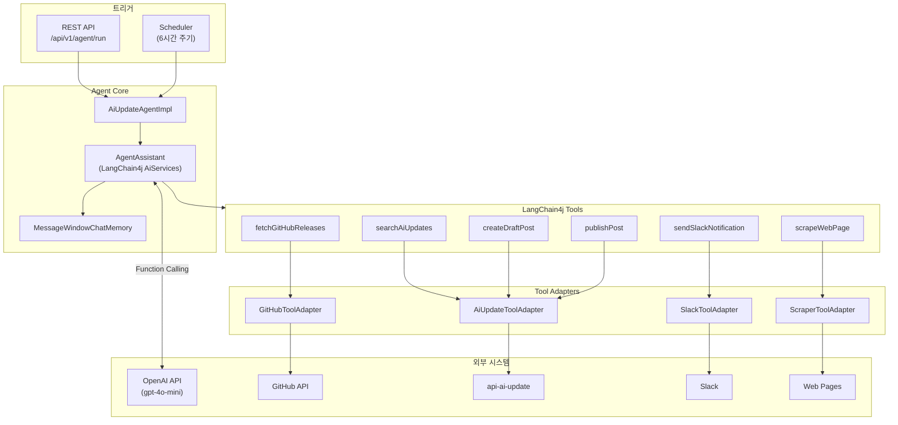

# API Agent 모듈

LangChain4j 기반 AI 업데이트 자동 추적 Agent 서비스입니다.

## 개요

`api-agent` 모듈은 LangChain4j와 OpenAI를 활용하여 빅테크 AI 서비스(OpenAI, Anthropic, Google, Meta)의 업데이트를 자율적으로 추적하는 AI Agent를 제공합니다. 자연어 목표(Goal)를 입력받아 GitHub Release 조회, 웹 스크래핑, 중복 확인, 포스트 생성 등의 작업을 자동으로 수행합니다.

## 아키텍처



## 주요 기능

### Agent 기능

| 기능 | 설명 |
|------|------|
| 자율 실행 | 자연어 목표(Goal)를 입력받아 필요한 Tool을 자동으로 선택하고 실행 |
| 중복 방지 | 포스트 생성 전 기존 업데이트 검색으로 중복 확인 |
| 스케줄 실행 | 6시간 주기로 자동 업데이트 추적 |
| 오류 알림 | 실행 실패 시 Slack 알림 |

### LangChain4j Tools

| Tool | 설명 |
|------|------|
| `fetchGitHubReleases` | GitHub 저장소의 최신 릴리스 목록 조회 |
| `scrapeWebPage` | 웹 페이지 크롤링 (robots.txt 준수) |
| `searchAiUpdates` | 저장된 AI 업데이트 검색 |
| `createDraftPost` | DRAFT 상태 포스트 생성 |
| `publishPost` | 포스트 승인 (PUBLISHED) |
| `sendSlackNotification` | Slack 알림 전송 |

## Agent 동작 흐름

```
사용자 Goal: "OpenAI와 Anthropic 최신 업데이트 확인하고 포스팅해줘"

Agent 추론 과정:
1. fetchGitHubReleases("openai", "openai-python")
   → v1.50.0 릴리스 발견

2. searchAiUpdates("openai-python v1.50.0", "OPENAI")
   → 결과 없음 (중복 아님)

3. createDraftPost(title="OpenAI Python SDK v1.50.0", ...)
   → Post ID "12345" 생성

4. sendSlackNotification("새 업데이트 초안 생성: ...")
   → 알림 전송 완료

5. fetchGitHubReleases("anthropics", "anthropic-sdk-python")
   → 새 릴리스 없음

결과: "OpenAI SDK v1.50.0 초안 포스트 생성 (ID: 12345), Anthropic은 새 릴리스 없음"
```

## API 엔드포인트

### Agent 실행 API

```
POST /api/v1/agent/run
X-Internal-Api-Key: {api-key}
Content-Type: application/json

{
  "goal": "OpenAI, Anthropic, Google, Meta의 최신 업데이트를 확인하고 중요한 것만 포스팅해줘"
}
```

### Response

```json
{
  "code": "2000",
  "message": "성공",
  "data": {
    "success": true,
    "summary": "OpenAI SDK v1.50.0 초안 포스트 생성 완료...",
    "toolCallCount": 8,
    "postsCreated": 1,
    "executionTimeMs": 15234,
    "errors": []
  }
}
```

## 디렉토리 구조

```
api/agent/
├── src/main/java/.../api/agent/
│   ├── ApiAgentApplication.java
│   ├── agent/
│   │   ├── AiUpdateAgent.java           # Agent 인터페이스
│   │   ├── AiUpdateAgentImpl.java       # Agent 구현체
│   │   ├── AgentAssistant.java          # LangChain4j AiServices 인터페이스
│   │   └── AgentExecutionResult.java    # 실행 결과 DTO
│   ├── tool/
│   │   ├── AiUpdateAgentTools.java      # Tool 정의 클래스
│   │   ├── adapter/
│   │   │   ├── GitHubToolAdapter.java
│   │   │   ├── ScraperToolAdapter.java
│   │   │   ├── AiUpdateToolAdapter.java
│   │   │   └── SlackToolAdapter.java
│   │   ├── dto/
│   │   │   ├── GitHubReleaseDto.java
│   │   │   ├── ScrapedContentDto.java
│   │   │   ├── AiUpdateDto.java
│   │   │   └── ToolResult.java
│   │   └── util/
│   │       └── TextTruncator.java
│   ├── controller/
│   │   └── AgentController.java
│   ├── scheduler/
│   │   └── AiUpdateAgentScheduler.java
│   └── config/
│       ├── AiAgentConfig.java           # OpenAI 모델 설정
│       ├── AgentConfig.java             # 프로퍼티 바인딩
│       └── ServerConfig.java
└── src/main/resources/
    ├── application.yml
    └── application-agent-api.yml
```

## 설정

### application.yml

```yaml
server:
  port: 8087

spring:
  application:
    name: agent-api
  profiles:
    include:
      - common-core
      - agent-api
      - feign-github
      - feign-internal
      - slack
      - scraper
```

### application-agent-api.yml

```yaml
# Agent용 OpenAI 설정
langchain4j:
  open-ai:
    chat-model:
      api-key: ${OPENAI_API_KEY:}
      model-name: gpt-4o-mini
      temperature: 0.3
      max-tokens: 4096
      timeout: 120s

# AI Update 내부 API 설정
internal-api:
  ai-update:
    api-key: ${AI_UPDATE_INTERNAL_API_KEY:}

# AI Update Agent 스케줄러 설정
agent:
  scheduler:
    enabled: ${AGENT_SCHEDULER_ENABLED:false}
    cron: "0 0 */6 * * *"
```

### 환경 변수

| 변수명 | 설명 | 필수 |
|--------|------|------|
| `OPENAI_API_KEY` | OpenAI API 키 | Yes |
| `AI_UPDATE_INTERNAL_API_KEY` | ai-update 및 Agent API 인증 키 | Yes |
| `AGENT_SCHEDULER_ENABLED` | 스케줄러 활성화 (true/false) | No |
| `GITHUB_TOKEN` | GitHub API 토큰 (Rate Limit 완화) | No |

## 의존성

```gradle
dependencies {
    // LangChain4j
    implementation 'dev.langchain4j:langchain4j:0.35.0'
    implementation 'dev.langchain4j:langchain4j-open-ai:0.35.0'

    // 프로젝트 모듈
    implementation project(':common-core')
    implementation project(':common-exception')
    implementation project(':client-feign')
    implementation project(':client-slack')
    implementation project(':client-scraper')

    // HTML 파싱
    implementation 'org.jsoup:jsoup:1.17.2'
}
```

## 실행

```bash
# 빌드
./gradlew :api-agent:build

# 실행
./gradlew :api-agent:bootRun

# 테스트
./gradlew :api-agent:test
```

## LangChain4j Tool 작성 패턴

### Tool 정의

```java
@Tool("GitHub 저장소의 최신 릴리스 목록을 가져옵니다.")
public List<GitHubReleaseDto> fetchGitHubReleases(
    @P("저장소 소유자 (예: openai)") String owner,
    @P("저장소 이름 (예: openai-python)") String repo
) {
    return githubAdapter.getReleases(owner, repo);
}
```

### AiServices 연결

```java
AgentAssistant assistant = AiServices.builder(AgentAssistant.class)
    .chatLanguageModel(chatModel)
    .tools(tools)
    .chatMemory(memory)
    .build();

String response = assistant.chat(buildPrompt(goal));
```

## 대상 GitHub 저장소

| Provider | Owner | Repository |
|----------|-------|------------|
| OpenAI | openai | openai-python |
| Anthropic | anthropics | anthropic-sdk-python |
| Google | google | generative-ai-python |
| Meta | facebookresearch | llama |

## 연동 모듈

- **api-ai-update**: 업데이트 검색, 생성, 승인 API 제공
- **client-feign**: GitHub API, Internal API Feign 클라이언트
- **client-slack**: Slack 알림 전송
- **client-scraper**: 웹 페이지 크롤링

## 참고 자료

- [LangChain4j Documentation](https://docs.langchain4j.dev/)
- [LangChain4j Tools Tutorial](https://docs.langchain4j.dev/tutorials/tools)
- [LangChain4j AI Services](https://docs.langchain4j.dev/tutorials/ai-services)
- [OpenAI API Reference](https://platform.openai.com/docs/api-reference)
- [GitHub REST API - Releases](https://docs.github.com/en/rest/releases/releases)
