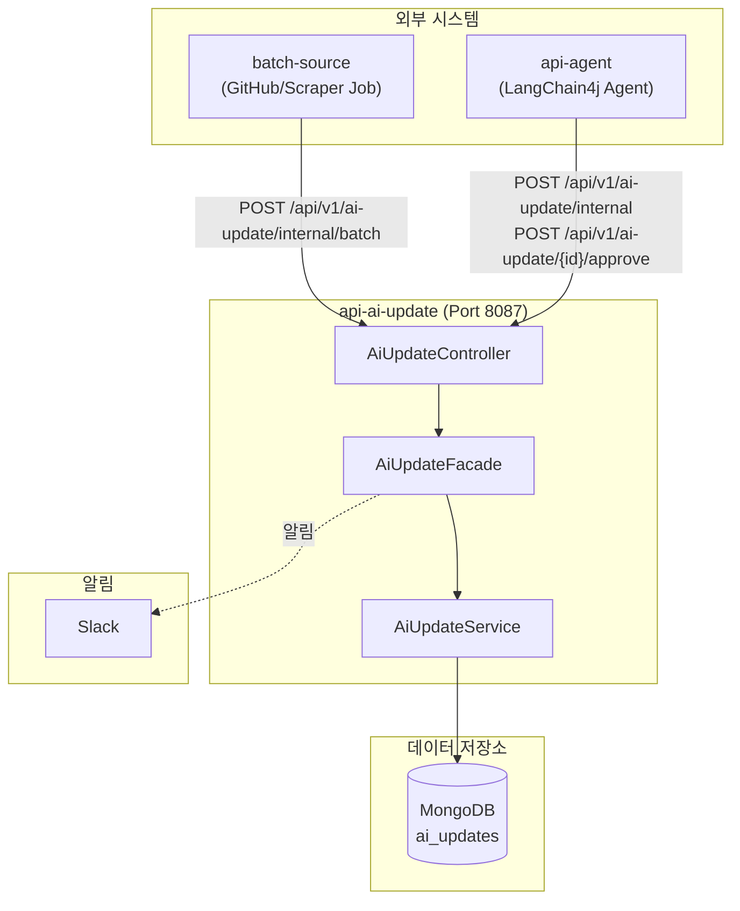

# API AI-Update 모듈

AI 프레임워크/서비스 업데이트 정보를 관리하는 REST API 서비스입니다.

## 개요

`api-ai-update` 모듈은 빅테크 AI 서비스(OpenAI, Anthropic, Google, Meta)의 업데이트 정보를 저장하고 조회하는 API를 제공합니다. MongoDB를 Read Store로 사용하며, Batch 모듈 및 Agent 모듈과 연동하여 자동화된 업데이트 추적 파이프라인의 핵심 역할을 수행합니다.

## 아키텍처



## 주요 기능

| 기능 | 설명 |
|------|------|
| 업데이트 목록 조회 | Provider, UpdateType, Status 기반 필터링 및 페이지네이션 |
| 업데이트 상세 조회 | 단일 업데이트 정보 조회 |
| 업데이트 검색 | 제목 기반 전문 검색 |
| 업데이트 생성 | 단건/배치 생성 (내부 API) |
| 상태 관리 | DRAFT → PUBLISHED/REJECTED 승인/거부 |

## 데이터 모델

### AiUpdateDocument (MongoDB)

| 필드 | 타입 | 설명 |
|------|------|------|
| `id` | ObjectId | Primary Key |
| `provider` | String | AI 제공자 (OPENAI, ANTHROPIC, GOOGLE, META) |
| `updateType` | String | 업데이트 유형 (MODEL_RELEASE, API_UPDATE, SDK_RELEASE, BLOG_POST) |
| `title` | String | 업데이트 제목 |
| `summary` | String | 요약 |
| `url` | String | 원본 URL |
| `publishedAt` | DateTime | 게시 일시 |
| `sourceType` | String | 수집 소스 (RSS, GITHUB_RELEASE, WEB_SCRAPING) |
| `status` | String | 상태 (DRAFT, PENDING, PUBLISHED, REJECTED) |
| `externalId` | String | 외부 식별자 (중복 방지) |
| `metadata` | Object | 추가 메타데이터 (version, tags, author, githubRepo) |

## API 엔드포인트

### 공개 API

| Method | Path | 설명 |
|--------|------|------|
| GET | `/api/v1/ai-update` | 목록 조회 (필터, 페이지네이션) |
| GET | `/api/v1/ai-update/{id}` | 상세 조회 |
| GET | `/api/v1/ai-update/search` | 검색 |

### 내부 API

내부 API는 `X-Internal-Api-Key` 헤더 인증이 필요합니다.

| Method | Path | 설명 |
|--------|------|------|
| POST | `/api/v1/ai-update/internal` | 단건 생성 |
| POST | `/api/v1/ai-update/internal/batch` | 배치 생성 |
| POST | `/api/v1/ai-update/{id}/approve` | 승인 (PUBLISHED) |
| POST | `/api/v1/ai-update/{id}/reject` | 거부 (REJECTED) |

### Request/Response 예시

**목록 조회 요청:**
```
GET /api/v1/ai-update?page=0&size=20&provider=OPENAI&status=PUBLISHED&sort=publishedAt,desc
```

**생성 요청:**
```json
POST /api/v1/ai-update/internal
X-Internal-Api-Key: {api-key}

{
  "provider": "OPENAI",
  "updateType": "SDK_RELEASE",
  "title": "OpenAI Python SDK v1.50.0",
  "summary": "새로운 기능 및 버그 수정 포함",
  "url": "https://github.com/openai/openai-python/releases/tag/v1.50.0",
  "publishedAt": "2024-01-15T10:00:00",
  "sourceType": "GITHUB_RELEASE",
  "status": "DRAFT",
  "externalId": "github:openai/openai-python:v1.50.0",
  "metadata": {
    "version": "v1.50.0",
    "tags": ["sdk", "python"],
    "githubRepo": "openai/openai-python"
  }
}
```

## 디렉토리 구조

```
api/ai-update/
├── src/main/java/.../api/aiupdate/
│   ├── AiUpdateApplication.java
│   ├── controller/
│   │   └── AiUpdateController.java
│   ├── facade/
│   │   └── AiUpdateFacade.java
│   ├── service/
│   │   ├── AiUpdateService.java
│   │   └── AiUpdateServiceImpl.java
│   ├── dto/
│   │   ├── request/
│   │   │   ├── AiUpdateCreateRequest.java
│   │   │   ├── AiUpdateListRequest.java
│   │   │   ├── AiUpdateSearchRequest.java
│   │   │   └── AiUpdateBatchRequest.java
│   │   └── response/
│   │       ├── AiUpdateDetailResponse.java
│   │       ├── AiUpdateListResponse.java
│   │       ├── AiUpdateSearchResponse.java
│   │       └── AiUpdateBatchResponse.java
│   ├── config/
│   │   ├── AiUpdateConfig.java
│   │   ├── ServerConfig.java
│   │   └── WebConfig.java
│   └── common/
│       └── SlackNotifier.java
└── src/main/resources/
    ├── application.yml
    └── application-ai-update-api.yml
```

## 설정

### application.yml

```yaml
server:
  port: 8087

spring:
  application:
    name: ai-update-api
  profiles:
    include:
      - common-core
      - mongodb-domain
      - ai-update-api
```

### application-ai-update-api.yml

```yaml
ai-update:
  internal:
    api-key: ${AI_UPDATE_INTERNAL_API_KEY:default-key}

slack:
  ai-update:
    enabled: false
    channel: "#ai-updates"
```

### 환경 변수

| 변수명 | 설명 | 필수 |
|--------|------|------|
| `AI_UPDATE_INTERNAL_API_KEY` | 내부 API 인증 키 | Yes |
| `MONGODB_URI` | MongoDB 연결 URI | Yes |

## 의존성

```gradle
dependencies {
    implementation project(':common-core')
    implementation project(':common-exception')
    implementation project(':domain-mongodb')
}
```

## 실행

```bash
# 빌드
./gradlew :api-ai-update:build

# 실행
./gradlew :api-ai-update:bootRun

# 테스트
./gradlew :api-ai-update:test
```

## 연동 모듈

- **batch-source**: GitHub Release, Web Scraping Job에서 수집한 데이터를 `/internal/batch`로 저장
- **api-agent**: LangChain4j Agent가 Tool을 통해 검색, 생성, 승인 API 호출
- **domain-mongodb**: `AiUpdateDocument` 엔티티 및 Repository 제공

## 참고 자료

- [Spring Data MongoDB Reference](https://docs.spring.io/spring-data/mongodb/reference/)
- [Spring Boot Reference](https://docs.spring.io/spring-boot/reference/)
