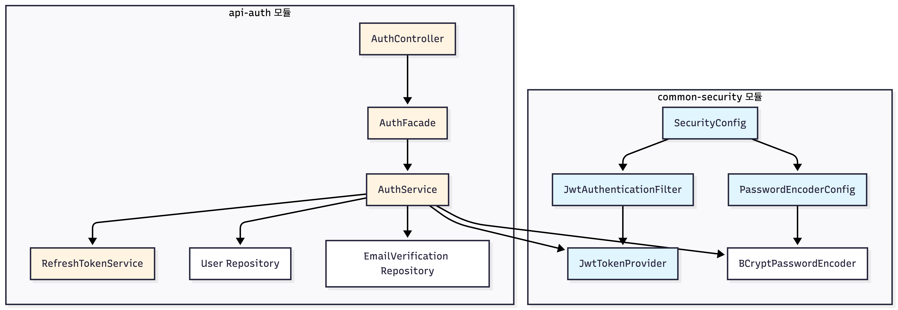
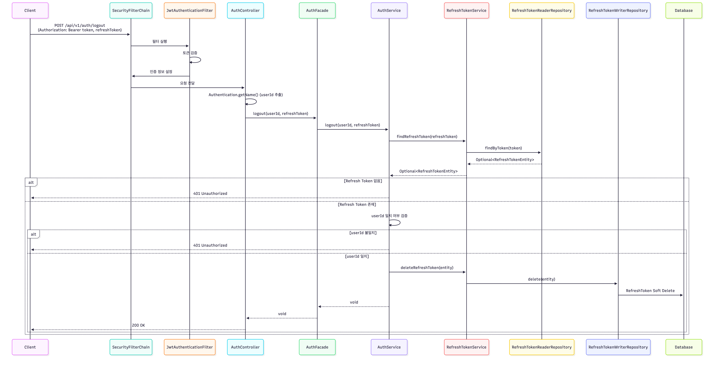
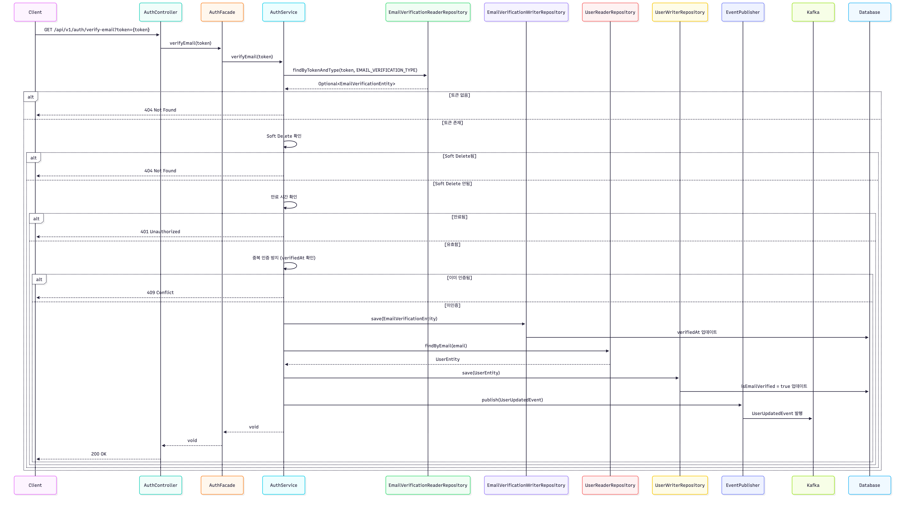
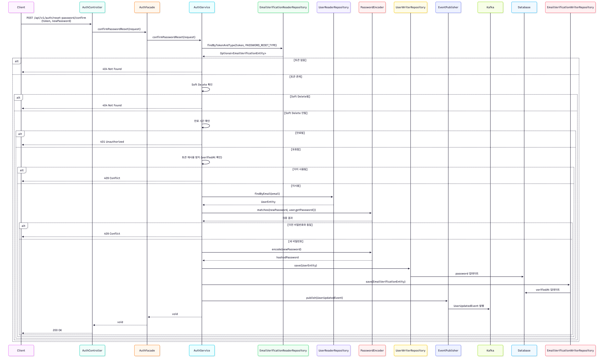
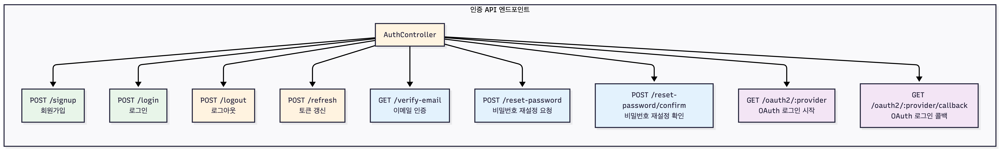

# API Auth Module

## 목차

1. [개요](#1-개요)
2. [아키텍처](#2-아키텍처)
3. [주요 기능](#3-주요-기능)
4. [API 엔드포인트](#4-api-엔드포인트)
5. [인증/인가 플로우](#5-인증인가-플로우)
6. [OAuth 로그인](#6-oauth-로그인)
7. [보안 고려사항](#7-보안-고려사항)
8. [참고 자료](#8-참고-자료)

---

## 1. 개요

### 1.1 모듈 소개

`api/auth` 모듈은 사용자 인증 및 인가를 담당하는 REST API 서버입니다. Spring Security 6.x 기반의 JWT 토큰 인증 방식을 사용하며, Stateless 아키텍처를 채택하여 서버 측 세션을 유지하지 않습니다.

### 1.2 주요 특징

- **JWT 토큰 기반 인증**: Stateless 인증 방식으로 서버 확장성 확보
- **OAuth 2.0 지원**: Google, Naver, Kakao OAuth 로그인 지원
- **이메일 인증**: 회원가입 시 이메일 인증 필수
- **비밀번호 재설정**: 이메일 기반 안전한 비밀번호 재설정
- **Refresh Token 관리**: Access Token 갱신을 위한 Refresh Token 지원
- **이벤트 기반 아키텍처**: Kafka를 통한 사용자 이벤트 발행

### 1.3 기술 스택

- **Spring Boot 4.0.1**: 애플리케이션 프레임워크
- **Spring Security 6.x**: 웹 애플리케이션 보안 프레임워크
- **JWT (JSON Web Token)**: Stateless 인증 토큰
- **jjwt**: JWT 토큰 생성/검증 라이브러리
- **BCryptPasswordEncoder**: 비밀번호 해시 인코딩
- **OpenFeign**: OAuth Provider API 호출
- **Redis**: OAuth State 파라미터 저장

---

## 2. 아키텍처

### 2.1 컴포넌트 구조



### 2.2 계층 구조

```
AuthController (Presentation Layer)
    ↓
AuthFacade (Facade Layer)
    ↓
AuthService (Business Logic Layer)
    ↓
Repository / External Services (Data Access Layer)
```

### 2.3 주요 컴포넌트

#### common/security 모듈
- **SecurityConfig**: Spring Security 필터 체인 설정
- **JwtAuthenticationFilter**: JWT 토큰 기반 인증 필터
- **JwtTokenProvider**: JWT 토큰 생성/검증/파싱
- **PasswordEncoderConfig**: BCryptPasswordEncoder 설정

#### api/auth 모듈
- **AuthController**: 인증 API 엔드포인트
- **AuthFacade**: Controller-Service 중간 계층
- **AuthService**: 인증 비즈니스 로직
- **RefreshTokenService**: Refresh Token 관리
- **OAuthProvider**: OAuth Provider 인터페이스
- **OAuthStateService**: OAuth State 파라미터 관리 (Redis)

---

## 3. 주요 기능

### 3.1 회원가입

사용자 이메일, 사용자명, 비밀번호를 입력받아 계정을 생성합니다.

**주요 처리 사항:**
- 이메일 및 사용자명 중복 검증
- BCrypt를 사용한 비밀번호 해시 저장
- 이메일 인증 토큰 생성 및 저장 (24시간 유효)
- Kafka 이벤트 발행 (`UserCreatedEvent`)

**플로우 다이어그램:**


### 3.2 로그인

이메일과 비밀번호를 사용하여 로그인합니다.

**주요 처리 사항:**
- 사용자 조회 및 Soft Delete 확인
- BCrypt 비밀번호 검증
- 이메일 인증 완료 여부 확인
- JWT Access Token 및 Refresh Token 발급
- Refresh Token 데이터베이스 저장
- 마지막 로그인 시간 업데이트

**플로우 다이어그램:**


### 3.3 로그아웃

Refresh Token을 무효화하여 로그아웃합니다.

**주요 처리 사항:**
- Refresh Token 조회 및 검증
- Refresh Token Soft Delete

**플로우 다이어그램:**



### 3.4 토큰 갱신

Refresh Token을 사용하여 새로운 Access Token 및 Refresh Token을 발급합니다.

**주요 처리 사항:**
- Refresh Token 검증 (JWT 검증 + 데이터베이스 검증)
- 기존 Refresh Token Soft Delete
- 새로운 Access Token 및 Refresh Token 발급
- 새로운 Refresh Token 저장

**플로우 다이어그램:**


### 3.5 이메일 인증

회원가입 시 발급된 이메일 인증 토큰을 검증합니다.

**주요 처리 사항:**
- 이메일 인증 토큰 조회 및 검증
- 토큰 만료 시간 확인 (24시간)
- 중복 인증 방지
- 사용자 이메일 인증 상태 업데이트
- Kafka 이벤트 발행 (`UserUpdatedEvent`)

**플로우 다이어그램:**



### 3.6 비밀번호 재설정

이메일을 통해 안전하게 비밀번호를 재설정합니다.

**주요 처리 사항:**
- 비밀번호 재설정 토큰 생성 및 이메일 발송
- 토큰 검증 및 비밀번호 변경
- 이전 비밀번호 재사용 방지
- Kafka 이벤트 발행 (`UserUpdatedEvent`)

**비밀번호 재설정 요청 플로우:**


**비밀번호 재설정 확인 플로우:**



### 3.7 OAuth 로그인

Google, Naver, Kakao OAuth 2.0을 통한 소셜 로그인을 지원합니다.

**주요 처리 사항:**
- OAuth Provider별 인증 URL 생성
- State 파라미터 생성 및 Redis 저장 (CSRF 방지)
- Authorization Code를 Access Token으로 교환
- Access Token으로 사용자 정보 조회
- 사용자 조회/생성 및 JWT 토큰 발급

**OAuth 로그인 시작 플로우:**


**OAuth 로그인 콜백 플로우:**


---

## 4. API 엔드포인트

### 4.1 엔드포인트 구조



### 4.2 엔드포인트 목록

| Method | Endpoint | 설명 | 인증 필요 |
|--------|----------|------|----------|
| POST | `/api/v1/auth/signup` | 회원가입 | ❌ |
| POST | `/api/v1/auth/login` | 로그인 | ❌ |
| POST | `/api/v1/auth/logout` | 로그아웃 | ✅ |
| POST | `/api/v1/auth/refresh` | 토큰 갱신 | ❌ |
| GET | `/api/v1/auth/verify-email` | 이메일 인증 | ❌ |
| POST | `/api/v1/auth/reset-password` | 비밀번호 재설정 요청 | ❌ |
| POST | `/api/v1/auth/reset-password/confirm` | 비밀번호 재설정 확인 | ❌ |
| GET | `/api/v1/auth/oauth2/{provider}` | OAuth 로그인 시작 | ❌ |
| GET | `/api/v1/auth/oauth2/{provider}/callback` | OAuth 로그인 콜백 | ❌ |

**지원 OAuth Provider:**
- `google`: Google OAuth 2.0
- `naver`: Naver OAuth 2.0
- `kakao`: Kakao OAuth 2.0

### 4.3 요청/응답 예시

#### 회원가입

**Request:**
```json
POST /api/v1/auth/signup
{
  "email": "user@example.com",
  "username": "user",
  "password": "password123"
}
```

**Response:**
```json
{
  "success": true,
  "data": {
    "id": 1,
    "email": "user@example.com",
    "username": "user",
    "message": "회원가입이 완료되었습니다. 이메일 인증을 완료해주세요."
  }
}
```

#### 로그인

**Request:**
```json
POST /api/v1/auth/login
{
  "email": "user@example.com",
  "password": "password123"
}
```

**Response:**
```json
{
  "success": true,
  "data": {
    "accessToken": "eyJhbGciOiJIUzI1NiIsInR5cCI6IkpXVCJ9...",
    "refreshToken": "eyJhbGciOiJIUzI1NiIsInR5cCI6IkpXVCJ9...",
    "tokenType": "Bearer",
    "accessTokenExpiresIn": 3600,
    "refreshTokenExpiresIn": 604800
  }
}
```

#### 토큰 갱신

**Request:**
```json
POST /api/v1/auth/refresh
{
  "refreshToken": "eyJhbGciOiJIUzI1NiIsInR5cCI6IkpXVCJ9..."
}
```

**Response:**
```json
{
  "success": true,
  "data": {
    "accessToken": "eyJhbGciOiJIUzI1NiIsInR5cCI6IkpXVCJ9...",
    "refreshToken": "eyJhbGciOiJIUzI1NiIsInR5cCI6IkpXVCJ9...",
    "tokenType": "Bearer",
    "accessTokenExpiresIn": 3600,
    "refreshTokenExpiresIn": 604800
  }
}
```

---

## 5. 인증/인가 플로우

### 5.1 전체 인증/인가 플로우


### 5.2 JWT 토큰 인증 메커니즘

1. **토큰 추출**: `Authorization` 헤더에서 `Bearer <token>` 형식으로 토큰 추출
2. **토큰 검증**: `JwtTokenProvider.validateToken()`으로 토큰 유효성 검증
3. **페이로드 추출**: 검증 성공 시 토큰에서 사용자 정보 추출
4. **SecurityContext 설정**: 인증 정보를 `SecurityContext`에 저장
5. **요청 처리**: 인증된 요청으로 처리

### 5.3 토큰 구성

**Access Token:**
- **유효기간**: 60분 (기본값)
- **페이로드**: userId, email, role
- **용도**: API 요청 시 인증

**Refresh Token:**
- **유효기간**: 7일 (기본값)
- **페이로드**: userId, email, role
- **용도**: Access Token 갱신
- **저장**: 데이터베이스에 저장 (무효화 가능)

---

## 6. OAuth 로그인

### 6.1 지원 Provider

- **Google OAuth 2.0**: Google 계정을 통한 로그인
- **Naver OAuth 2.0**: 네이버 계정을 통한 로그인
- **Kakao OAuth 2.0**: 카카오 계정을 통한 로그인

### 6.2 OAuth 2.0 Authorization Code Flow

1. **OAuth 로그인 시작**: 사용자가 OAuth 로그인 요청
2. **State 파라미터 생성**: CSRF 방지를 위한 State 파라미터 생성 및 Redis 저장 (TTL: 10분)
3. **인증 페이지 리다이렉트**: OAuth Provider 인증 페이지로 리다이렉트
4. **사용자 인증**: 사용자가 OAuth Provider에서 로그인 및 권한 승인
5. **Authorization Code 발급**: OAuth Provider가 Authorization Code를 콜백 URL로 전달
6. **State 검증**: Redis에서 State 파라미터 검증 및 삭제
7. **Access Token 교환**: Authorization Code를 Access Token으로 교환
8. **사용자 정보 조회**: Access Token으로 사용자 정보 조회
9. **JWT 토큰 발급**: 사용자 조회/생성 후 JWT 토큰 발급

### 6.3 State 파라미터 관리

**용도:**
- CSRF 공격 방지 (RFC 6749 Section 10.12)
- 요청 상태 유지
- 일회성 검증 (Replay Attack 방지)

**구현:**
- **저장소**: Redis
- **Key 형식**: `oauth:state:{state_value}`
- **Value**: Provider 이름 (예: "GOOGLE", "NAVER", "KAKAO")
- **TTL**: 10분 (600초)
- **검증**: 콜백 시 State 검증 후 즉시 삭제

### 6.4 OAuth Provider 구현

**인터페이스 기반 설계:**
- `OAuthProvider`: 공통 인터페이스
- `GoogleOAuthProvider`: Google OAuth 구현
- `NaverOAuthProvider`: Naver OAuth 구현
- `KakaoOAuthProvider`: Kakao OAuth 구현

**OpenFeign 통합:**
- `client/feign` 모듈의 `OAuthProviderContract` 사용
- Provider별 FeignClient를 통한 API 호출
- Contract Pattern으로 일관된 구조 유지

---

## 7. 보안 고려사항

### 7.1 JWT 토큰 보안

**Secret Key 관리:**
- 운영 환경에서는 반드시 강력한 Secret Key 사용 (최소 256비트)
- 환경 변수나 시크릿 관리 시스템 사용
- Secret Key는 절대 코드에 하드코딩하지 않음

**토큰 만료 시간:**
- Access Token: 짧은 유효기간 (1시간 이내 권장)
- Refresh Token: 긴 유효기간 (7일 이내 권장)
- 토큰 갱신 시 기존 토큰 무효화

**HTTPS 사용:**
- 프로덕션 환경에서는 반드시 HTTPS 사용
- 토큰이 네트워크를 통해 전송될 때 암호화

### 7.2 비밀번호 보안

**BCryptPasswordEncoder:**
- Salt rounds: 12 (Spring Security 권장값)
- 비밀번호는 절대 평문으로 저장하지 않음

**비밀번호 정책:**
- 최소 길이 요구사항
- 복잡도 요구사항 (대소문자, 숫자, 특수문자)
- 비밀번호 재사용 방지

### 7.3 OAuth 보안

**State 파라미터:**
- 암호학적으로 안전한 랜덤 값 생성 (최소 32바이트)
- Redis에 저장하여 CSRF 공격 방지
- 검증 완료 후 즉시 삭제 (일회성 사용)
- HTTPS를 통해서만 전송

**Client Secret 관리:**
- 환경 변수 사용
- 데이터베이스 저장 시 암호화 (향후 개선 필요)
- 운영 환경에서는 시크릿 관리 시스템 사용 권장

### 7.4 추가 보안 권장사항

**Rate Limiting:**
- 로그인 시도 횟수 제한
- API 호출 빈도 제한

**감사 로그:**
- 로그인/로그아웃 이벤트 기록
- 보안 관련 이벤트 모니터링

**에러 메시지:**
- 보안 관련 에러 메시지는 구체적인 정보를 노출하지 않음
- "이메일 또는 비밀번호가 올바르지 않습니다."와 같이 일반적인 메시지 사용

---

## 8. 참고 자료

### 8.1 프로젝트 내 설계 문서

- **`docs/step6/spring-security-auth-design-guide.md`**: Spring Security 설계 가이드
- **`docs/step6/oauth-provider-implementation-guide.md`**: OAuth Provider별 구현 가이드
- **`docs/step6/oauth-http-client-selection-analysis.md`**: HTTP Client 선택 분석
- **`docs/step6/oauth-state-storage-research-result.md`**: State 파라미터 저장 방법 연구 결과
- **`docs/step6/oauth-feign-client-migration-analysis.md`**: OpenFeign 클라이언트 전환 검토 및 구현 가이드

### 8.2 Spring Security 공식 문서

- [Spring Security Reference Documentation](https://docs.spring.io/spring-security/reference/)
- [Spring Security Servlet Configuration](https://docs.spring.io/spring-security/reference/servlet/configuration/java.html)
- [Spring Security Authentication](https://docs.spring.io/spring-security/reference/servlet/authentication/passwords/basic.html)
- [Spring Security Password Storage](https://docs.spring.io/spring-security/reference/features/authentication/password-storage.html)

### 8.3 JWT 관련 문서

- [JWT 공식 스펙 (RFC 7519)](https://tools.ietf.org/html/rfc7519)
- [jjwt 라이브러리 공식 문서](https://github.com/jwtk/jjwt)

### 8.4 OAuth 2.0 표준 문서

- [RFC 6749 (OAuth 2.0 Authorization Framework)](https://tools.ietf.org/html/rfc6749)
- [RFC 7636 (Proof Key for Code Exchange)](https://tools.ietf.org/html/rfc7636)

### 8.5 OAuth Provider 공식 문서

**Google OAuth 2.0:**
- [Google OAuth 2.0 for Web Server Applications](https://developers.google.com/identity/protocols/oauth2/web-server)
- [Google Identity Platform](https://developers.google.com/identity)

**Naver OAuth 2.0:**
- [Naver 개발자 센터](https://developers.naver.com/)
- [Naver 로그인 API 가이드](https://developers.naver.com/docs/login/api/)

**Kakao OAuth 2.0:**
- [Kakao Developers](https://developers.kakao.com/)
- [Kakao 로그인 REST API](https://developers.kakao.com/docs/latest/ko/kakaologin/rest-api)

### 8.6 프로젝트 내 코드 참조

**common/security 모듈:**
- `common/security/src/main/java/com/ebson/shrimp/tm/demo/common/security/config/SecurityConfig.java`
- `common/security/src/main/java/com/ebson/shrimp/tm/demo/common/security/filter/JwtAuthenticationFilter.java`
- `common/security/src/main/java/com/ebson/shrimp/tm/demo/common/security/jwt/JwtTokenProvider.java`

**api/auth 모듈:**
- `api/auth/src/main/java/com/ebson/shrimp/tm/demo/api/auth/controller/AuthController.java`
- `api/auth/src/main/java/com/ebson/shrimp/tm/demo/api/auth/service/AuthService.java`
- `api/auth/src/main/java/com/ebson/shrimp/tm/demo/api/auth/oauth/OAuthProvider.java`

---

**작성일**: 2025-01-27  
**버전**: 1.0  
**모듈**: api/auth

