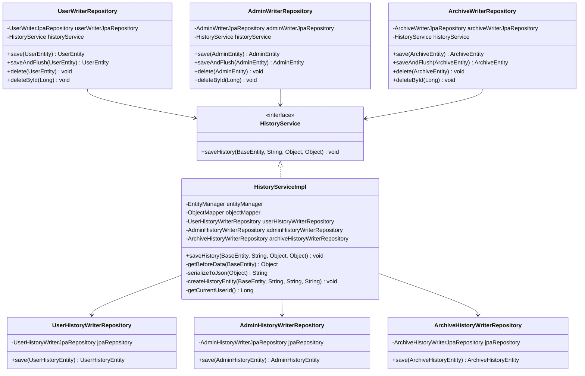

# History 관리 서비스 레이어 리팩토링 설계서

## 1. 개요

### 1.1 리팩토링 목적

현재 `HistoryEntityListener`는 JPA 스펙 권장사항을 위반하고 있습니다. JPA 2.2 Specification (JSR 338) Section 3.5에 따르면, EntityListener는 엔티티 자체의 상태 변경에만 사용되어야 하며, 다른 엔티티의 영속성 상태 변경이나 트랜잭션 제어 로직을 수행하는 것은 권장되지 않습니다.

이 리팩토링은 EntityListener에서 History 저장 로직을 제거하고, 서비스 레이어에서 명시적으로 처리하도록 변경하여 JPA 스펙을 준수하면서도 기존 기능을 모두 보존합니다.

### 1.2 현재 문제점 요약

1. **JPA 스펙 위반**
   - EntityListener 내부에서 `entityManager.persist()` 호출로 다른 엔티티의 영속성 상태 변경
   - `TransactionSynchronizationManager`를 사용한 트랜잭션 제어 로직 수행

2. **테스트 어려움**
   - EntityListener는 JPA 라이프사이클에 강하게 결합되어 단위 테스트가 어려움
   - Mock 객체 사용이 제한적

3. **명시성 부족**
   - History 저장이 암묵적으로 수행되어 코드 가독성 저하
   - History 저장 실패 시나리오 파악이 어려움

### 1.3 해결 방안 요약

1. **HistoryService 인터페이스 및 구현체 생성**
   - History 저장 로직을 독립적인 서비스로 분리
   - 인터페이스 기반 설계로 테스트 용이성 향상

2. **WriterRepository 수정**
   - `save()`, `delete()` 메서드에서 History 저장을 명시적으로 호출
   - HistoryService 의존성 주입

3. **EntityListener 제거**
   - `@EntityListeners(HistoryEntityListener.class)` 어노테이션 제거
   - HistoryEntityListener 클래스 삭제

## 2. 아키텍처 설계

### 2.1 전체 구조도



### 2.2 컴포넌트 간 의존성 관계

```
Service Layer (API)
    ↓
WriterRepository (Domain)
    ↓
HistoryService (Domain)
    ↓
HistoryWriterRepository (Domain)
    ↓
JpaRepository (Spring Data JPA)
```

### 2.3 패키지 구조

```
domain/aurora/src/main/java/com/ebson/shrimp/tm/demo/domain/mariadb/
├── entity/
│   ├── BaseEntity.java
│   ├── auth/
│   │   ├── UserEntity.java (EntityListeners 제거)
│   │   ├── AdminEntity.java (EntityListeners 제거)
│   │   ├── UserHistoryEntity.java
│   │   └── AdminHistoryEntity.java
│   └── archive/
│       ├── ArchiveEntity.java (EntityListeners 제거)
│       └── ArchiveHistoryEntity.java
├── repository/
│   ├── writer/
│   │   ├── auth/
│   │   │   ├── UserWriterRepository.java (HistoryService 의존성 추가)
│   │   │   └── AdminWriterRepository.java (HistoryService 의존성 추가)
│   │   └── archive/
│   │       └── ArchiveWriterRepository.java (HistoryService 의존성 추가)
│   └── writer/history/
│       ├── UserHistoryWriterRepository.java (신규)
│       ├── AdminHistoryWriterRepository.java (신규)
│       └── ArchiveHistoryWriterRepository.java (신규)
└── service/
    └── history/
        ├── HistoryService.java (신규 인터페이스)
        └── HistoryServiceImpl.java (신규 구현체)
```

## 3. 핵심 컴포넌트 설계

### 3.1 HistoryService 인터페이스

#### 3.1.1 메서드 시그니처

```java
public interface HistoryService {
    /**
     * 엔티티 변경 이력을 저장합니다.
     * 
     * @param entity 변경된 엔티티 (BaseEntity를 상속한 엔티티)
     * @param operationType 작업 타입 ("INSERT", "UPDATE", "DELETE")
     * @param beforeData 변경 전 데이터 (JSON 직렬화 대상)
     * @param afterData 변경 후 데이터 (JSON 직렬화 대상)
     * @throws IllegalArgumentException entity가 null이거나 지원하지 않는 타입인 경우
     * @throws RuntimeException JSON 직렬화 실패 또는 History 저장 실패 시
     */
    void saveHistory(BaseEntity entity, String operationType, Object beforeData, Object afterData);
}
```

#### 3.1.2 파라미터 및 반환값 타입

- **entity**: `BaseEntity` 타입. 실제로는 `UserEntity`, `AdminEntity`, `ArchiveEntity` 중 하나
- **operationType**: `String` 타입. "INSERT", "UPDATE", "DELETE" 중 하나
- **beforeData**: `Object` 타입. 변경 전 엔티티 데이터 (INSERT 시 null)
- **afterData**: `Object` 타입. 변경 후 엔티티 데이터
- **반환값**: `void`

#### 3.1.3 예외 처리 전략

1. **IllegalArgumentException**: 잘못된 파라미터 (null entity, 지원하지 않는 엔티티 타입)
2. **RuntimeException**: JSON 직렬화 실패, History 저장 실패
   - 예외가 발생하면 트랜잭션이 롤백되어 원본 엔티티 저장도 취소됨

### 3.2 HistoryService 구현체

#### 3.2.1 구현 로직 개요

```pseudocode
HistoryServiceImpl.saveHistory(entity, operationType, beforeData, afterData):
    1. 엔티티 타입 검증 (UserEntity, AdminEntity, ArchiveEntity 중 하나인지 확인)
    2. beforeData, afterData를 JSON 문자열로 직렬화
    3. 현재 사용자 ID 조회 (getCurrentUserId)
    4. 현재 시각 조회 (LocalDateTime.now())
    5. 엔티티 타입에 따라 적절한 History 엔티티 생성
    6. History 엔티티 저장
```

#### 3.2.2 BeforeData 조회 전략

**UPDATE/DELETE 시나리오**:
- WriterRepository의 `save()` 또는 `delete()` 메서드에서 호출 전에 `entityManager.find()`로 조회
- 조회 실패 시 (엔티티가 존재하지 않는 경우) `null` 반환
- `null`인 경우 History 저장 시 `beforeData`를 `null`로 전달

**구현 위치**:
- WriterRepository의 `save()` 메서드 내부에서 엔티티 저장 전에 조회
- `delete()` 메서드 내부에서 soft delete 전에 조회

#### 3.2.3 JSON 직렬화 처리

**ObjectMapper 설정**:
- `JavaTimeModule` 등록: `LocalDateTime` 등 Java 8 시간 타입 지원
- `SerializationFeature.WRITE_DATES_AS_TIMESTAMPS` 비활성화: ISO 8601 형식으로 직렬화

**직렬화 실패 시 처리**:
- `JsonProcessingException` 발생 시 `RuntimeException`으로 래핑하여 전파
- 트랜잭션 롤백 유도

#### 3.2.4 트랜잭션 처리

- HistoryService는 `@Transactional` 어노테이션을 사용하지 않음
- WriterRepository의 `@Transactional` 메서드 내에서 호출되므로 같은 트랜잭션에서 실행
- History 저장 실패 시 예외 전파로 인해 전체 트랜잭션이 롤백됨

### 3.3 WriterRepository 수정

#### 3.3.1 각 WriterRepository의 수정 사항

**공통 수정 사항**:
1. `HistoryService` 의존성 주입 (`@RequiredArgsConstructor` 사용)
2. `save()` 메서드 수정: History 저장 로직 추가
3. `delete()` 메서드 수정: History 저장 로직 추가
4. `saveAndFlush()` 메서드: `save()`와 동일하게 처리

#### 3.3.2 HistoryService 의존성 주입

```pseudocode
UserWriterRepository:
    - UserWriterJpaRepository userWriterJpaRepository
    - HistoryService historyService  // 신규 추가
    
    save(UserEntity entity):
        isNew = (entity.getId() == null)
        beforeData = isNew ? null : userWriterJpaRepository.findById(entity.getId()).orElse(null)
        
        saved = userWriterJpaRepository.save(entity)
        
        if (isNew):
            historyService.saveHistory(saved, "INSERT", null, saved)
        else:
            historyService.saveHistory(saved, "UPDATE", beforeData, saved)
        
        return saved
```

#### 3.3.3 save() 메서드 수정 로직

**INSERT 시나리오**:
1. `entity.getId() == null` 확인
2. `beforeData = null`
3. 엔티티 저장
4. `historyService.saveHistory(saved, "INSERT", null, saved)` 호출

**UPDATE 시나리오**:
1. `entity.getId() != null` 확인
2. `beforeData = jpaRepository.findById(entity.getId()).orElse(null)` 조회
3. 엔티티 저장
4. `historyService.saveHistory(saved, "UPDATE", beforeData, saved)` 호출

#### 3.3.4 delete() 메서드 수정 로직

**Soft Delete 시나리오**:
1. `beforeData = jpaRepository.findById(entity.getId()).orElse(null)` 조회
2. `entity.setIsDeleted(true)`, `entity.setDeletedAt(LocalDateTime.now())` 설정
3. 엔티티 저장
4. `historyService.saveHistory(saved, "DELETE", beforeData, saved)` 호출

**주의사항**:
- `beforeData` 조회 시점이 중요: soft delete 설정 전에 조회해야 함
- `beforeData`의 `isDeleted`가 `false`인 경우에만 "DELETE" operationType 사용

## 4. 데이터 흐름

### 4.1 INSERT 시나리오

```
1. Service Layer
   └─> UserWriterRepository.save(userEntity)
       
2. UserWriterRepository
   ├─> entity.getId() == null 확인 (신규 엔티티)
   ├─> beforeData = null
   ├─> userWriterJpaRepository.save(userEntity)
   │   └─> UserEntity 저장 (ID 생성)
   └─> historyService.saveHistory(saved, "INSERT", null, saved)
       
3. HistoryServiceImpl
   ├─> serializeToJson(null) → null
   ├─> serializeToJson(saved) → JSON 문자열
   ├─> createHistoryEntity(saved, "INSERT", null, JSON)
   └─> userHistoryWriterRepository.save(userHistoryEntity)
       
4. UserHistoryWriterRepository
   └─> userHistoryWriterJpaRepository.save(userHistoryEntity)
```

### 4.2 UPDATE 시나리오

```
1. Service Layer
   └─> UserWriterRepository.save(userEntity)
       
2. UserWriterRepository
   ├─> entity.getId() != null 확인 (기존 엔티티)
   ├─> beforeData = userWriterJpaRepository.findById(entity.getId()).orElse(null)
   ├─> userWriterJpaRepository.save(userEntity)
   │   └─> UserEntity 업데이트
   └─> historyService.saveHistory(saved, "UPDATE", beforeData, saved)
       
3. HistoryServiceImpl
   ├─> serializeToJson(beforeData) → JSON 문자열
   ├─> serializeToJson(saved) → JSON 문자열
   ├─> createHistoryEntity(saved, "UPDATE", beforeJson, afterJson)
   └─> userHistoryWriterRepository.save(userHistoryEntity)
       
4. UserHistoryWriterRepository
   └─> userHistoryWriterJpaRepository.save(userHistoryEntity)
```

### 4.3 DELETE (Soft Delete) 시나리오

```
1. Service Layer
   └─> UserWriterRepository.delete(userEntity)
       
2. UserWriterRepository
   ├─> beforeData = userWriterJpaRepository.findById(entity.getId()).orElse(null)
   ├─> entity.setIsDeleted(true)
   ├─> entity.setDeletedAt(LocalDateTime.now())
   ├─> userWriterJpaRepository.save(userEntity)
   │   └─> UserEntity 업데이트 (isDeleted = true)
   └─> historyService.saveHistory(saved, "DELETE", beforeData, saved)
       
3. HistoryServiceImpl
   ├─> serializeToJson(beforeData) → JSON 문자열 (isDeleted = false)
   ├─> serializeToJson(saved) → JSON 문자열 (isDeleted = true)
   ├─> createHistoryEntity(saved, "DELETE", beforeJson, afterJson)
   └─> userHistoryWriterRepository.save(userHistoryEntity)
       
4. UserHistoryWriterRepository
   └─> userHistoryWriterJpaRepository.save(userHistoryEntity)
```

## 5. 트랜잭션 처리

### 5.1 트랜잭션 경계

**트랜잭션 시작**: Service Layer의 `@Transactional` 메서드
- 예: `AuthService.signup()`, `UserAuthenticationService.login()`

**트랜잭션 내부 실행 순서**:
1. WriterRepository.save() 또는 delete() 호출
2. JpaRepository.save() 실행 (엔티티 저장)
3. HistoryService.saveHistory() 실행 (History 저장)
4. 트랜잭션 커밋

### 5.2 원자성 보장 방법

**같은 트랜잭션 내에서 처리**:
- WriterRepository와 HistoryService가 같은 `@Transactional` 메서드 내에서 실행
- History 저장 실패 시 예외 전파로 인해 전체 트랜잭션이 롤백

**예외 전파 전략**:
- HistoryService에서 발생한 모든 예외는 그대로 전파
- `@Transactional`이 선언된 메서드에서 예외가 발생하면 자동 롤백

### 5.3 실패 처리 전략

**시나리오 1: 엔티티 저장 성공, History 저장 실패**
- History 저장 시 예외 발생
- 예외 전파로 인해 트랜잭션 롤백
- 엔티티 저장도 롤백됨 (원자성 보장)

**시나리오 2: BeforeData 조회 실패**
- `jpaRepository.findById()`가 `Optional.empty()` 반환
- `beforeData = null`로 처리
- History 저장은 정상 진행 (beforeData가 null인 History 생성)

**시나리오 3: JSON 직렬화 실패**
- `JsonProcessingException` 발생
- `RuntimeException`으로 래핑하여 전파
- 트랜잭션 롤백

## 6. 마이그레이션 계획

### 6.1 EntityListener 제거 단계

**Step 1: HistoryService 생성**
1. `HistoryService` 인터페이스 생성
2. `HistoryServiceImpl` 구현체 생성
3. `UserHistoryWriterRepository`, `AdminHistoryWriterRepository`, `ArchiveHistoryWriterRepository` 생성
4. 단위 테스트 작성

**Step 2: WriterRepository 수정**
1. `UserWriterRepository`에 HistoryService 의존성 주입 및 로직 추가
2. `AdminWriterRepository`에 HistoryService 의존성 주입 및 로직 추가
3. `ArchiveWriterRepository`에 HistoryService 의존성 주입 및 로직 추가
4. 통합 테스트 작성

**Step 3: EntityListener 제거**
1. `UserEntity`, `AdminEntity`, `ArchiveEntity`에서 `@EntityListeners(HistoryEntityListener.class)` 제거
2. `HistoryEntityListener` 클래스 삭제
3. 전체 테스트 실행

### 6.2 WriterRepository 수정 단계

**공통 패턴**:
```pseudocode
// Before
public Entity save(Entity entity) {
    return jpaRepository.save(entity);
}

// After
public Entity save(Entity entity) {
    boolean isNew = entity.getId() == null;
    Entity beforeData = isNew ? null : jpaRepository.findById(entity.getId()).orElse(null);
    
    Entity saved = jpaRepository.save(entity);
    
    if (isNew) {
        historyService.saveHistory(saved, "INSERT", null, saved);
    } else {
        historyService.saveHistory(saved, "UPDATE", beforeData, saved);
    }
    
    return saved;
}
```

**delete() 메서드 패턴**:
```pseudocode
// Before
public void delete(Entity entity) {
    entity.setIsDeleted(true);
    entity.setDeletedAt(LocalDateTime.now());
    jpaRepository.save(entity);
}

// After
public void delete(Entity entity) {
    Entity beforeData = jpaRepository.findById(entity.getId()).orElse(null);
    
    entity.setIsDeleted(true);
    entity.setDeletedAt(LocalDateTime.now());
    
    Entity saved = jpaRepository.save(entity);
    
    if (beforeData != null && !Boolean.TRUE.equals(beforeData.getIsDeleted())) {
        historyService.saveHistory(saved, "DELETE", beforeData, saved);
    }
}
```

### 6.3 테스트 전략

**단위 테스트**:
1. `HistoryServiceImpl` 테스트
   - 각 엔티티 타입별 History 생성 검증
   - JSON 직렬화 검증
   - 예외 처리 검증

2. `WriterRepository` 테스트 (Mock 사용)
   - `save()` 메서드에서 History 저장 호출 검증
   - `delete()` 메서드에서 History 저장 호출 검증
   - BeforeData 조회 로직 검증

**통합 테스트**:
1. 전체 시나리오 테스트
   - INSERT → History 저장 확인
   - UPDATE → History 저장 확인 (beforeData 포함)
   - DELETE → History 저장 확인 (operationType = "DELETE")

2. 트랜잭션 롤백 테스트
   - History 저장 실패 시 원본 엔티티 저장도 롤백되는지 확인

**기존 테스트 검증**:
- 기존 API 테스트가 정상 동작하는지 확인
- History 데이터가 기존과 동일하게 저장되는지 확인

## 7. 참고 자료

- JPA 2.2 Specification (JSR 338): https://jakarta.ee/specifications/persistence/2.2/
- Spring Framework Reference Documentation - Transaction Management: https://docs.spring.io/spring-framework/reference/data-access/transaction.html
- Hibernate ORM User Guide: https://docs.jboss.org/hibernate/orm/6.6/userguide/html_single/Hibernate_User_Guide.html
