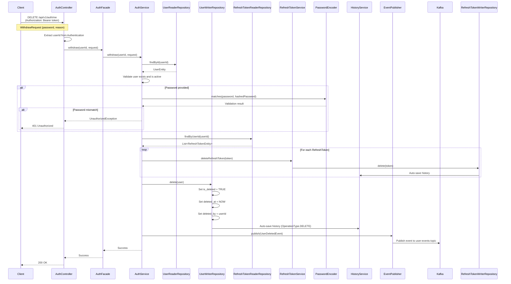

# 회원탈퇴 API 설계서

**작성 일시**: 2026-01-27  
**버전**: 1.0  
**대상 모듈**: `api/auth`  
**관련 설계서**: 
- `docs/step6/spring-security-auth-design-guide.md`
- `docs/step1/3. aurora-schema-design.md`

---

## 목차

1. [개요](#1-개요)
2. [API 엔드포인트 설계](#2-api-엔드포인트-설계)
3. [비즈니스 로직 설계](#3-비즈니스-로직-설계)
4. [데이터베이스 설계](#4-데이터베이스-설계)
5. [구현 가이드](#5-구현-가이드)
6. [보안 설계](#6-보안-설계)
7. [에러 처리](#7-에러-처리)
8. [테스트 전략](#8-테스트-전략)
9. [Kafka 이벤트 설계](#9-kafka-이벤트-설계)
10. [클린코드 및 설계 원칙](#10-클린코드-및-설계-원칙)

---

## 1. 개요

### 1.1 목적

회원탈퇴 API는 사용자가 자신의 계정을 안전하게 탈퇴할 수 있도록 하는 기능입니다. 이 API는 기존 인증/인가 시스템과 완벽하게 통합되며, Soft Delete 원칙을 준수하여 데이터 무결성과 복구 가능성을 보장합니다.

### 1.2 주요 요구사항

- **인증된 사용자만 접근 가능**: JWT 토큰 기반 인증 필수
- **자기 자신의 계정만 탈퇴 가능**: 권한 검증 필수
- **Soft Delete 원칙 준수**: 데이터 보존 및 히스토리 추적
- **관련 데이터 처리**: 모든 활성 RefreshToken 무효화
- **Kafka 이벤트 발행**: Command Side와 Query Side 간 데이터 동기화

### 1.3 기존 시스템과의 관계

회원탈퇴 API는 다음 기존 API들과 일관된 패턴을 유지합니다:

- **로그아웃 API** (`POST /api/v1/auth/logout`): RefreshToken 처리 방식 참고
- **회원가입 API** (`POST /api/v1/auth/signup`): 트랜잭션 관리 및 이벤트 발행 패턴 참고
- **비밀번호 재설정 API** (`POST /api/v1/auth/reset-password/confirm`): 사용자 검증 패턴 참고

---

## 2. API 엔드포인트 설계

### 2.1 엔드포인트 명세

#### 기본 정보

- **HTTP Method**: `DELETE`
- **URL**: `/api/v1/auth/me`
- **인증 요구사항**: 인증된 사용자만 접근 가능 (Bearer Token 필수)
- **권한 요구사항**: 자신의 계정만 탈퇴 가능

#### RESTful 원칙 준수

RESTful API 설계 원칙에 따라 리소스 중심 URL을 사용합니다:
- `/api/v1/auth/me`는 현재 인증된 사용자 자신을 나타냄
- `DELETE` 메서드는 리소스 삭제를 의미

**대안**: `/api/v1/auth/withdraw` (POST)도 가능하지만, RESTful 원칙에 따라 `DELETE /api/v1/auth/me`를 권장합니다.

### 2.2 요청/응답 DTO 설계

#### Request DTO

비밀번호 확인을 선택적으로 요구할 수 있도록 설계합니다:

```java
package com.tech.n.ai.api.auth.dto;

import jakarta.validation.constraints.Size;

/**
 * 회원탈퇴 요청 DTO
 */
public record WithdrawRequest(
    /**
     * 비밀번호 확인 (선택적)
     * 보안 강화를 위해 비밀번호 재확인을 요구할 수 있음
     */
    @Size(min = 8, max = 100, message = "비밀번호는 8자 이상 100자 이하여야 합니다.")
    String password,
    
    /**
     * 탈퇴 사유 (선택적)
     * 사용자 피드백 수집 목적
     */
    @Size(max = 500, message = "탈퇴 사유는 500자 이하여야 합니다.")
    String reason
) {
}
```

**설계 고려사항**:
- 비밀번호 필드는 선택적 (`null` 허용)
- 비밀번호 확인이 필요한 경우에만 요청에 포함
- 탈퇴 사유는 선택적이며, 사용자 피드백 수집 목적

#### Response DTO

기존 API와 일관된 응답 형식을 사용합니다:

```java
// Controller에서 반환
ResponseEntity<ApiResponse<Void>>

// 성공 응답 예시
{
  "success": true,
  "data": null,
  "message": "회원탈퇴가 완료되었습니다."
}
```

### 2.3 보안 고려사항

#### 인증 검증

- JWT 토큰에서 `userId` 추출 (`Authentication.getName()`)
- 토큰 유효성은 `JwtAuthenticationFilter`에서 이미 검증됨

#### 권한 검증

- 요청하는 사용자 ID와 탈퇴 대상 사용자 ID 일치 확인
- 다른 사용자 계정 탈퇴 시도 시 `ForbiddenException` 발생

#### 비밀번호 확인 (선택적)

- 요청에 비밀번호가 포함된 경우, `PasswordEncoder.matches()`로 검증
- 비밀번호 불일치 시 `UnauthorizedException` 발생
- OAuth 사용자는 비밀번호가 없으므로 비밀번호 확인 생략

---

## 3. 비즈니스 로직 설계

### 3.1 회원탈퇴 프로세스

다음 단계를 순차적으로 수행합니다:

#### 단계 1: 사용자 인증 확인

```java
// Controller에서
String userId = authentication.getName(); // JWT 토큰의 subject (userId)
```

#### 단계 2: 사용자 존재 및 활성 상태 확인

```java
UserEntity user = userReaderRepository.findById(Long.parseLong(userId))
    .orElseThrow(() -> new ResourceNotFoundException("사용자를 찾을 수 없습니다."));

if (!user.isActive()) {
    throw new ConflictException("이미 탈퇴된 사용자입니다.");
}
```

**검증 항목**:
- 사용자 존재 여부
- Soft Delete 상태 확인 (`is_deleted = FALSE`)
- `UserEntity.isActive()` 메서드 활용

#### 단계 3: 비밀번호 확인 (선택적)

```java
if (request.password() != null && !request.password().isBlank()) {
    if (user.getPassword() == null) {
        // OAuth 사용자는 비밀번호가 없음
        throw new UnauthorizedException("OAuth 사용자는 비밀번호 확인이 필요하지 않습니다.");
    }
    
    if (!passwordEncoder.matches(request.password(), user.getPassword())) {
        throw new UnauthorizedException("비밀번호가 일치하지 않습니다.");
    }
}
```

**설계 고려사항**:
- 비밀번호 확인은 선택적 (요청에 포함된 경우에만 검증)
- OAuth 사용자는 비밀번호가 없으므로 검증 생략
- 일반 사용자는 비밀번호 확인을 통해 보안 강화

#### 단계 4: 관련 데이터 처리

##### 4.1 RefreshToken 삭제

```java
List<RefreshTokenEntity> refreshTokens = refreshTokenReaderRepository.findByUserId(user.getId());

for (RefreshTokenEntity token : refreshTokens) {
    if (!Boolean.TRUE.equals(token.getIsDeleted())) {
        refreshTokenService.deleteRefreshToken(token);
    }
}
```

**설계 고려사항**:
- 사용자 ID로 모든 RefreshToken 조회 (`RefreshTokenReaderRepository.findByUserId()`)
- 각 RefreshToken에 대해 Soft Delete 수행
- `BaseWriterRepository.delete()`가 자동으로 히스토리 저장

##### 4.2 EmailVerification 토큰 처리

- 만료된 토큰은 자동 정리되므로 별도 처리 불필요
- 필요 시 배치 작업에서 정리 가능

##### 4.3 관련 엔티티 처리

- `archives` 테이블: 스키마 분리로 인해 별도 처리 불필요 (애플리케이션 레벨에서 처리)
- `conversation_sessions`: 스키마 분리로 인해 별도 처리 불필요

#### 단계 5: User 엔티티 Soft Delete

```java
// deleted_by는 자기 자신으로 설정
user.setDeletedBy(user.getId());
userWriterRepository.delete(user);
```

**설계 고려사항**:
- `BaseWriterRepository.delete()` 메서드가 자동으로:
  - `is_deleted = TRUE` 설정
  - `deleted_at = 현재 시간` 설정
  - `UserHistory`에 `OperationType.DELETE` 히스토리 자동 저장
- `deleted_by`는 명시적으로 설정 (자기 자신)

#### 단계 6: Kafka 이벤트 발행

```java
UserDeletedEvent.UserDeletedPayload payload = new UserDeletedEvent.UserDeletedPayload(
    String.valueOf(user.getId()),
    String.valueOf(user.getId()),
    user.getEmail(),
    user.getUsername(),
    user.getDeletedAt() != null ? user.getDeletedAt().atZone(ZoneId.systemDefault()).toInstant() : Instant.now(),
    user.getDeletedBy() != null ? String.valueOf(user.getDeletedBy()) : String.valueOf(user.getId())
);

UserDeletedEvent event = new UserDeletedEvent(payload);
eventPublisher.publish(KAFKA_TOPIC_USER_EVENTS, event, String.valueOf(user.getId()));
```

**설계 고려사항**:
- 이벤트 발행은 트랜잭션 커밋 전에 수행
- 트랜잭션 롤백 시 이벤트 미발행 (트랜잭션 범위 내에서 처리)
- Partition Key는 `userId` 사용 (이벤트 순서 보장)

#### 단계 7: 응답 반환

```java
return ResponseEntity.ok(ApiResponse.success());
```

### 3.2 시퀀스 다이어그램



### 3.3 트랜잭션 관리

모든 작업은 하나의 트랜잭션 내에서 수행됩니다:

```java
@Transactional
public void withdraw(String userId, WithdrawRequest request) {
    // 모든 작업이 하나의 트랜잭션 내에서 수행
    // 실패 시 자동 롤백
}
```

**트랜잭션 범위**:
- 사용자 조회 및 검증
- RefreshToken 삭제
- User 엔티티 Soft Delete
- 히스토리 저장 (자동)
- Kafka 이벤트 발행 (트랜잭션 커밋 전)

---

## 4. 데이터베이스 설계

### 4.1 User 테이블 변경사항

#### Soft Delete 처리

```sql
-- BaseWriterRepository.delete()가 자동으로 수행
UPDATE users
SET 
    is_deleted = TRUE,
    deleted_at = CURRENT_TIMESTAMP(6),
    deleted_by = {userId}  -- 자기 자신
WHERE id = {userId};
```

**컬럼 변경**:
- `is_deleted`: `FALSE` → `TRUE`
- `deleted_at`: `NULL` → 현재 시간
- `deleted_by`: `NULL` → 현재 사용자 ID (자기 자신)

**데이터 보존**:
- 모든 컬럼 데이터는 보존됨 (GDPR 준수)
- Soft Delete로 인해 실제 데이터는 삭제되지 않음

### 4.2 RefreshToken 테이블 처리

#### 모든 활성 RefreshToken Soft Delete

```sql
-- 사용자 ID로 모든 RefreshToken 조회
SELECT * FROM refresh_tokens
WHERE user_id = {userId} AND is_deleted = FALSE;

-- 각 RefreshToken에 대해 Soft Delete 수행
UPDATE refresh_tokens
SET 
    is_deleted = TRUE,
    deleted_at = CURRENT_TIMESTAMP(6),
    deleted_by = {userId}
WHERE id = {tokenId};
```

**처리 방식**:
- `RefreshTokenReaderRepository.findByUserId(userId)`로 모든 RefreshToken 조회
- 각 RefreshToken에 대해 `RefreshTokenService.deleteRefreshToken()` 호출
- `BaseWriterRepository.delete()`가 자동으로 히스토리 저장

### 4.3 UserHistory 테이블 자동 저장

#### 히스토리 레코드 생성

`BaseWriterRepository.delete()` 메서드가 자동으로 다음 히스토리 레코드를 생성합니다:

```sql
INSERT INTO user_history (
    history_id,
    user_id,
    operation_type,
    before_data,
    after_data,
    changed_by,
    changed_at,
    change_reason
) VALUES (
    {TSID},
    {userId},
    'DELETE',
    '{before_data_json}',  -- 삭제 전 User 엔티티 JSON
    '{after_data_json}',   -- 삭제 후 User 엔티티 JSON (is_deleted = TRUE 포함)
    {userId},              -- 자기 자신
    CURRENT_TIMESTAMP(6),
    {reason}               -- 탈퇴 사유 (요청에 포함된 경우)
);
```

**히스토리 데이터 구조**:
- `operation_type`: `DELETE` (Soft Delete 의미)
- `before_data`: 삭제 전 User 엔티티 전체 데이터 (JSON)
- `after_data`: 삭제 후 User 엔티티 전체 데이터 (JSON, `is_deleted = TRUE` 포함)
- `changed_by`: 현재 사용자 ID (자기 자신)
- `changed_at`: 현재 시간
- `change_reason`: 탈퇴 사유 (요청에 포함된 경우)

### 4.4 트랜잭션 관리

모든 데이터베이스 작업은 하나의 트랜잭션 내에서 수행됩니다:

```java
@Transactional
public void withdraw(String userId, WithdrawRequest request) {
    // 1. User 조회 및 검증
    // 2. RefreshToken 삭제 (여러 개)
    // 3. User Soft Delete
    // 4. 히스토리 자동 저장 (BaseWriterRepository가 처리)
    // 5. Kafka 이벤트 발행
}
```

**트랜잭션 특성**:
- `@Transactional` 어노테이션으로 트랜잭션 범위 명시
- 실패 시 자동 롤백
- 모든 작업이 원자적으로 수행

---

## 5. 구현 가이드

### 5.1 Controller 레이어

#### 클래스: `AuthController`

```java
package com.tech.n.ai.api.auth.controller;

import com.tech.n.ai.api.auth.dto.WithdrawRequest;
import com.tech.n.ai.api.auth.facade.AuthFacade;
import com.tech.n.ai.common.core.dto.ApiResponse;
import jakarta.validation.Valid;
import lombok.RequiredArgsConstructor;
import org.springframework.http.ResponseEntity;
import org.springframework.security.core.Authentication;
import org.springframework.web.bind.annotation.*;

@RestController
@RequestMapping("/api/v1/auth")
@RequiredArgsConstructor
public class AuthController {
    
    private final AuthFacade authFacade;
    
    /**
     * 회원탈퇴
     * 
     * @param request 탈퇴 요청 (비밀번호, 탈퇴 사유)
     * @param authentication 인증 정보
     * @return 성공 응답
     */
    @DeleteMapping("/me")
    public ResponseEntity<ApiResponse<Void>> withdraw(
            @Valid @RequestBody(required = false) WithdrawRequest request,
            Authentication authentication) {
        String userId = authentication.getName();
        authFacade.withdraw(userId, request);
        return ResponseEntity.ok(ApiResponse.success());
    }
    
    // ... 기존 메서드들
}
```

**설계 고려사항**:
- `@DeleteMapping("/me")` 사용 (RESTful 원칙)
- `Authentication` 파라미터로 현재 사용자 정보 추출
- `@Valid` 어노테이션으로 요청 검증 (필요 시)
- `@RequestBody(required = false)`로 요청 본문 선택적 허용

### 5.2 Facade 레이어

#### 클래스: `AuthFacade`

```java
package com.tech.n.ai.api.auth.facade;

import com.tech.n.ai.api.auth.dto.WithdrawRequest;
import com.tech.n.ai.api.auth.service.AuthService;
import lombok.RequiredArgsConstructor;
import org.springframework.stereotype.Service;

@Service
@RequiredArgsConstructor
public class AuthFacade {
    
    private final AuthService authService;
    
    /**
     * 회원탈퇴
     * 
     * @param userId 사용자 ID
     * @param request 탈퇴 요청
     */
    public void withdraw(String userId, WithdrawRequest request) {
        authService.withdraw(userId, request);
    }
    
    // ... 기존 메서드들
}
```

**설계 고려사항**:
- Controller와 Service 간 중간 계층
- 단순 위임 역할 (추가 로직 없음)

### 5.3 Service 레이어

#### 클래스: `AuthService`

```java
package com.tech.n.ai.api.auth.service;

import com.tech.n.ai.api.auth.dto.WithdrawRequest;
import com.tech.n.ai.common.exception.exception.ConflictException;
import com.tech.n.ai.common.exception.exception.ResourceNotFoundException;
import com.tech.n.ai.common.exception.exception.UnauthorizedException;
import com.tech.n.ai.common.kafka.event.UserDeletedEvent;
import com.tech.n.ai.common.kafka.publisher.EventPublisher;
import com.tech.n.ai.datasource.mariadb.entity.auth.RefreshTokenEntity;
import com.tech.n.ai.datasource.mariadb.entity.auth.UserEntity;
import com.tech.n.ai.datasource.mariadb.repository.reader.auth.RefreshTokenReaderRepository;
import com.tech.n.ai.datasource.mariadb.repository.reader.auth.UserReaderRepository;
import com.tech.n.ai.datasource.mariadb.repository.writer.auth.UserWriterRepository;
import lombok.RequiredArgsConstructor;
import lombok.extern.slf4j.Slf4j;
import org.springframework.security.crypto.password.PasswordEncoder;
import org.springframework.stereotype.Service;
import org.springframework.transaction.annotation.Transactional;

import java.time.Instant;
import java.time.ZoneId;
import java.util.List;

import static com.tech.n.ai.api.auth.service.TokenConstants.KAFKA_TOPIC_USER_EVENTS;

@Slf4j
@Service
@RequiredArgsConstructor
public class AuthService {
    
    private final UserReaderRepository userReaderRepository;
    private final UserWriterRepository userWriterRepository;
    private final RefreshTokenReaderRepository refreshTokenReaderRepository;
    private final RefreshTokenService refreshTokenService;
    private final PasswordEncoder passwordEncoder;
    private final EventPublisher eventPublisher;
    
    /**
     * 회원탈퇴
     * 
     * @param userId 사용자 ID
     * @param request 탈퇴 요청
     */
    @Transactional
    public void withdraw(String userId, WithdrawRequest request) {
        // 1. 사용자 조회 및 검증
        UserEntity user = findAndValidateUser(userId);
        
        // 2. 비밀번호 확인 (선택적)
        validatePasswordIfProvided(user, request);
        
        // 3. 모든 RefreshToken 삭제
        deleteAllRefreshTokens(user.getId());
        
        // 4. User 엔티티 Soft Delete
        user.setDeletedBy(user.getId());
        userWriterRepository.delete(user);
        
        // 5. Kafka 이벤트 발행
        publishUserDeletedEvent(user);
        
        log.info("User withdrawal completed: userId={}, email={}", user.getId(), user.getEmail());
    }
    
    /**
     * 사용자 조회 및 검증
     */
    private UserEntity findAndValidateUser(String userId) {
        UserEntity user = userReaderRepository.findById(Long.parseLong(userId))
            .orElseThrow(() -> new ResourceNotFoundException("사용자를 찾을 수 없습니다."));
        
        if (!user.isActive()) {
            throw new ConflictException("이미 탈퇴된 사용자입니다.");
        }
        
        return user;
    }
    
    /**
     * 비밀번호 확인 (선택적)
     */
    private void validatePasswordIfProvided(UserEntity user, WithdrawRequest request) {
        if (request == null || request.password() == null || request.password().isBlank()) {
            return; // 비밀번호 확인 생략
        }
        
        if (user.getPassword() == null) {
            throw new UnauthorizedException("OAuth 사용자는 비밀번호 확인이 필요하지 않습니다.");
        }
        
        if (!passwordEncoder.matches(request.password(), user.getPassword())) {
            throw new UnauthorizedException("비밀번호가 일치하지 않습니다.");
        }
    }
    
    /**
     * 모든 RefreshToken 삭제
     */
    private void deleteAllRefreshTokens(Long userId) {
        List<RefreshTokenEntity> refreshTokens = refreshTokenReaderRepository.findByUserId(userId);
        
        for (RefreshTokenEntity token : refreshTokens) {
            if (!Boolean.TRUE.equals(token.getIsDeleted())) {
                refreshTokenService.deleteRefreshToken(token);
            }
        }
        
        log.debug("Deleted {} refresh tokens for user: userId={}", refreshTokens.size(), userId);
    }
    
    /**
     * UserDeletedEvent 발행
     */
    private void publishUserDeletedEvent(UserEntity user) {
        UserDeletedEvent.UserDeletedPayload payload = new UserDeletedEvent.UserDeletedPayload(
            String.valueOf(user.getId()),
            String.valueOf(user.getId()),
            user.getEmail(),
            user.getUsername(),
            user.getDeletedAt() != null 
                ? user.getDeletedAt().atZone(ZoneId.systemDefault()).toInstant() 
                : Instant.now(),
            user.getDeletedBy() != null 
                ? String.valueOf(user.getDeletedBy()) 
                : String.valueOf(user.getId())
        );
        
        UserDeletedEvent event = new UserDeletedEvent(payload);
        eventPublisher.publish(KAFKA_TOPIC_USER_EVENTS, event, String.valueOf(user.getId()));
        
        log.debug("Published UserDeletedEvent: userId={}", user.getId());
    }
    
    // ... 기존 메서드들
}
```

**설계 고려사항**:
- `@Transactional` 어노테이션으로 트랜잭션 범위 명시
- 각 단계를 private 메서드로 분리 (단일 책임 원칙)
- 명확한 메서드명 사용
- 로깅 추가 (디버깅 및 모니터링)

### 5.4 Repository 레이어

#### 기존 Repository 활용

다음 Repository들을 활용합니다:

- **`UserReaderRepository`**: 사용자 조회
  - `findById(Long id)`: 사용자 ID로 조회

- **`UserWriterRepository`**: User Soft Delete
  - `delete(UserEntity entity)`: Soft Delete 수행 (자동 히스토리 저장)

- **`RefreshTokenReaderRepository`**: RefreshToken 조회
  - `findByUserId(Long userId)`: 사용자 ID로 모든 RefreshToken 조회

- **`RefreshTokenWriterRepository`**: RefreshToken Soft Delete
  - `delete(RefreshTokenEntity entity)`: Soft Delete 수행 (자동 히스토리 저장)

**새로운 Repository 불필요**: 기존 Repository로 모든 작업 수행 가능

---

## 6. 보안 설계

### 6.1 인증 및 권한

#### Spring Security 설정

`SecurityConfig`에서 `/api/v1/auth/me` 엔드포인트는 인증 필요:

```java
@Bean
public SecurityFilterChain securityFilterChain(HttpSecurity http) throws Exception {
    http
        .authorizeHttpRequests(auth -> auth
            .requestMatchers("/api/v1/auth/**").permitAll()  // 회원가입, 로그인 등
            .requestMatchers("/api/v1/auth/me").authenticated()  // 회원탈퇴는 인증 필요
            .anyRequest().authenticated()
        );
    return http.build();
}
```

**설계 고려사항**:
- `/api/v1/auth/**`는 기본적으로 `permitAll()`이지만, `/api/v1/auth/me`는 예외적으로 `authenticated()` 설정
- 더 구체적인 경로가 우선 적용됨

#### 권한 검증

Controller에서 `Authentication` 객체로 현재 사용자 정보 추출:

```java
@DeleteMapping("/me")
public ResponseEntity<ApiResponse<Void>> withdraw(
        @Valid @RequestBody(required = false) WithdrawRequest request,
        Authentication authentication) {
    String userId = authentication.getName(); // JWT 토큰의 subject (userId)
    // userId는 자동으로 현재 인증된 사용자 ID
    // 다른 사용자 계정 탈퇴 시도 불가능 (자기 자신만 가능)
}
```

**보안 보장**:
- JWT 토큰의 `subject`는 사용자 ID
- `Authentication.getName()`은 항상 현재 인증된 사용자 ID 반환
- 다른 사용자 계정 탈퇴 시도는 원천적으로 불가능

### 6.2 데이터 보안

#### 개인정보 보호

- **Soft Delete**: 데이터 보존 (GDPR 준수)
- **데이터 마스킹**: 필요 시 개인정보 마스킹 고려
- **암호화**: 민감 정보는 암호화 저장 (기존 설계 준수)

#### 토큰 보안

- **RefreshToken 무효화**: 모든 활성 RefreshToken 즉시 Soft Delete
- **Access Token**: 탈퇴 후 사용자 ID가 더 이상 유효하지 않으므로 자동 무효화
- **토큰 재사용 방지**: Soft Delete로 토큰 재사용 불가능

### 6.3 추가 보안 고려사항

#### 비밀번호 확인 (선택적)

- 일반 사용자: 비밀번호 확인으로 보안 강화
- OAuth 사용자: 비밀번호가 없으므로 확인 생략

#### 탈퇴 사유 수집

- 사용자 피드백 수집 목적
- 서비스 개선을 위한 데이터 수집

---

## 7. 에러 처리

### 7.1 예외 시나리오

다음 예외 상황에 대한 처리 방안:

#### 1. 사용자 미존재

```java
throw new ResourceNotFoundException("사용자를 찾을 수 없습니다.");
```

**HTTP 상태 코드**: `404 Not Found`

#### 2. 이미 탈퇴된 사용자

```java
throw new ConflictException("이미 탈퇴된 사용자입니다.");
```

**HTTP 상태 코드**: `409 Conflict`

#### 3. 비밀번호 불일치

```java
throw new UnauthorizedException("비밀번호가 일치하지 않습니다.");
```

**HTTP 상태 코드**: `401 Unauthorized`

#### 4. OAuth 사용자 비밀번호 확인 시도

```java
throw new UnauthorizedException("OAuth 사용자는 비밀번호 확인이 필요하지 않습니다.");
```

**HTTP 상태 코드**: `401 Unauthorized`

#### 5. 트랜잭션 실패

```java
// @Transactional 어노테이션이 자동으로 롤백 처리
// RuntimeException 발생 시 자동 롤백
```

**HTTP 상태 코드**: `500 Internal Server Error`

### 7.2 에러 응답 형식

기존 `GlobalExceptionHandler`를 활용하여 일관된 에러 응답 형식 사용:

```json
{
  "success": false,
  "data": null,
  "error": {
    "code": "RESOURCE_NOT_FOUND",
    "message": "사용자를 찾을 수 없습니다."
  }
}
```

---

## 8. 테스트 전략

### 8.1 단위 테스트

#### Service 레이어 테스트

**테스트 클래스**: `AuthServiceTest`

```java
@ExtendWith(MockitoExtension.class)
class AuthServiceTest {
    
    @Mock
    private UserReaderRepository userReaderRepository;
    
    @Mock
    private UserWriterRepository userWriterRepository;
    
    @Mock
    private RefreshTokenReaderRepository refreshTokenReaderRepository;
    
    @Mock
    private RefreshTokenService refreshTokenService;
    
    @Mock
    private PasswordEncoder passwordEncoder;
    
    @Mock
    private EventPublisher eventPublisher;
    
    @InjectMocks
    private AuthService authService;
    
    @Test
    void withdraw_정상_탈퇴() {
        // Given
        String userId = "123";
        UserEntity user = createTestUser();
        WithdrawRequest request = new WithdrawRequest(null, null);
        
        when(userReaderRepository.findById(anyLong())).thenReturn(Optional.of(user));
        when(refreshTokenReaderRepository.findByUserId(anyLong())).thenReturn(Collections.emptyList());
        
        // When
        authService.withdraw(userId, request);
        
        // Then
        verify(userWriterRepository).delete(user);
        verify(eventPublisher).publish(eq(KAFKA_TOPIC_USER_EVENTS), any(UserDeletedEvent.class), eq(userId));
    }
    
    @Test
    void withdraw_비밀번호_불일치() {
        // Given
        String userId = "123";
        UserEntity user = createTestUser();
        WithdrawRequest request = new WithdrawRequest("wrongPassword", null);
        
        when(userReaderRepository.findById(anyLong())).thenReturn(Optional.of(user));
        when(passwordEncoder.matches(anyString(), anyString())).thenReturn(false);
        
        // When & Then
        assertThrows(UnauthorizedException.class, () -> {
            authService.withdraw(userId, request);
        });
    }
    
    @Test
    void withdraw_이미_탈퇴된_사용자() {
        // Given
        String userId = "123";
        UserEntity user = createTestUser();
        user.setIsDeleted(true);
        WithdrawRequest request = new WithdrawRequest(null, null);
        
        when(userReaderRepository.findById(anyLong())).thenReturn(Optional.of(user));
        
        // When & Then
        assertThrows(ConflictException.class, () -> {
            authService.withdraw(userId, request);
        });
    }
    
    @Test
    void withdraw_RefreshToken_삭제_확인() {
        // Given
        String userId = "123";
        UserEntity user = createTestUser();
        RefreshTokenEntity token1 = createTestRefreshToken();
        RefreshTokenEntity token2 = createTestRefreshToken();
        WithdrawRequest request = new WithdrawRequest(null, null);
        
        when(userReaderRepository.findById(anyLong())).thenReturn(Optional.of(user));
        when(refreshTokenReaderRepository.findByUserId(anyLong()))
            .thenReturn(List.of(token1, token2));
        
        // When
        authService.withdraw(userId, request);
        
        // Then
        verify(refreshTokenService, times(2)).deleteRefreshToken(any(RefreshTokenEntity.class));
    }
}
```

### 8.2 통합 테스트

#### API 엔드포인트 테스트

**테스트 클래스**: `AuthControllerIntegrationTest`

```java
@SpringBootTest
@AutoConfigureMockMvc
class AuthControllerIntegrationTest {
    
    @Autowired
    private MockMvc mockMvc;
    
    @Test
    void withdraw_인증된_사용자_탈퇴() throws Exception {
        // Given
        String accessToken = obtainAccessToken();
        WithdrawRequest request = new WithdrawRequest(null, "탈퇴 사유");
        
        // When & Then
        mockMvc.perform(delete("/api/v1/auth/me")
                .header("Authorization", "Bearer " + accessToken)
                .contentType(MediaType.APPLICATION_JSON)
                .content(objectMapper.writeValueAsString(request)))
            .andExpect(status().isOk())
            .andExpect(jsonPath("$.success").value(true));
    }
    
    @Test
    void withdraw_인증되지_않은_사용자() throws Exception {
        // Given
        WithdrawRequest request = new WithdrawRequest(null, null);
        
        // When & Then
        mockMvc.perform(delete("/api/v1/auth/me")
                .contentType(MediaType.APPLICATION_JSON)
                .content(objectMapper.writeValueAsString(request)))
            .andExpect(status().isUnauthorized());
    }
}
```

### 8.3 HTTP 테스트 파일

**파일**: `api/auth/src/test/http/08-withdraw.http`

```http
### 회원탈퇴 (비밀번호 확인 없음)
DELETE {{baseUrl}}/api/v1/auth/me
Authorization: Bearer {{accessToken}}
Content-Type: application/json

{
  "reason": "서비스 불만족"
}

### 회원탈퇴 (비밀번호 확인)
DELETE {{baseUrl}}/api/v1/auth/me
Authorization: Bearer {{accessToken}}
Content-Type: application/json

{
  "password": "{{testPassword}}",
  "reason": "서비스 불만족"
}

### 회원탈퇴 (인증 없음 - 실패 예상)
DELETE {{baseUrl}}/api/v1/auth/me
Content-Type: application/json

{
  "reason": "서비스 불만족"
}
```

---

## 9. Kafka 이벤트 설계

### 9.1 UserDeletedEvent 구조

#### 이벤트 클래스

```java
package com.tech.n.ai.common.kafka.event;

import com.fasterxml.jackson.annotation.JsonProperty;
import java.time.Instant;
import java.util.UUID;

/**
 * 사용자 삭제 이벤트 (Soft Delete)
 */
public record UserDeletedEvent(
    @JsonProperty("eventId") String eventId,
    @JsonProperty("eventType") String eventType,
    @JsonProperty("timestamp") Instant timestamp,
    @JsonProperty("payload") UserDeletedPayload payload
) implements BaseEvent {
    
    public UserDeletedEvent(UserDeletedPayload payload) {
        this(
            UUID.randomUUID().toString(),
            "USER_DELETED",
            Instant.now(),
            payload
        );
    }
    
    /**
     * UserDeletedEvent 페이로드
     */
    public record UserDeletedPayload(
        @JsonProperty("userTsid") String userTsid,
        @JsonProperty("userId") String userId,
        @JsonProperty("email") String email,
        @JsonProperty("username") String username,
        @JsonProperty("deletedAt") Instant deletedAt,
        @JsonProperty("deletedBy") String deletedBy
    ) {
    }
}
```

#### 이벤트 JSON 예시

```json
{
  "eventId": "550e8400-e29b-41d4-a716-446655440000",
  "eventType": "USER_DELETED",
  "timestamp": "2026-01-27T10:00:00Z",
  "payload": {
    "userTsid": "9876543210987654321",
    "userId": "9876543210987654321",
    "email": "user@example.com",
    "username": "username",
    "deletedAt": "2026-01-27T10:00:00Z",
    "deletedBy": "9876543210987654321"
  }
}
```

### 9.2 이벤트 발행 시점

#### 발행 시점

User 엔티티 Soft Delete 성공 후, 트랜잭션 커밋 전에 발행:

```java
@Transactional
public void withdraw(String userId, WithdrawRequest request) {
    // 1. 사용자 조회 및 검증
    // 2. 비밀번호 확인
    // 3. RefreshToken 삭제
    // 4. User Soft Delete
    userWriterRepository.delete(user);
    
    // 5. Kafka 이벤트 발행 (트랜잭션 커밋 전)
    publishUserDeletedEvent(user);
}
```

**설계 고려사항**:
- 트랜잭션 커밋 전에 이벤트 발행
- 트랜잭션 롤백 시 이벤트 미발행 (트랜잭션 범위 내에서 처리)

### 9.3 이벤트 토픽 및 Partition Key

#### 토픽

- **토픽명**: `user-events` (기존 `KAFKA_TOPIC_USER_EVENTS` 상수 사용)
- **Partition Key**: `userId` (이벤트 순서 보장)

#### 이벤트 발행 코드

```java
eventPublisher.publish(KAFKA_TOPIC_USER_EVENTS, event, String.valueOf(user.getId()));
```

### 9.4 이벤트 소비 및 동기화

#### MongoDB Atlas 동기화

`UserDeletedEvent`를 소비하여 MongoDB Atlas의 `UserProfileDocument`를 삭제 또는 비활성화:

```java
@KafkaListener(topics = "user-events", groupId = "user-sync-service")
public void handleUserDeletedEvent(UserDeletedEvent event) {
    UserDeletedPayload payload = event.payload();
    
    // MongoDB Atlas에서 UserProfileDocument 삭제 또는 비활성화
    userProfileRepository.deleteByUserTsid(payload.userTsid());
    
    log.info("User profile deleted in MongoDB Atlas: userTsid={}", payload.userTsid());
}
```

**동기화 전략**:
- Command Side (Aurora)에서 Soft Delete 수행
- Kafka 이벤트 발행
- Query Side (MongoDB Atlas)에서 문서 삭제 또는 비활성화

---

## 10. 클린코드 및 설계 원칙

### 10.1 SOLID 원칙 준수

#### 단일 책임 원칙 (SRP)

각 클래스는 하나의 책임만 가집니다:

- **`AuthController`**: HTTP 요청/응답 처리
- **`AuthFacade`**: Controller와 Service 간 중간 계층
- **`AuthService`**: 회원탈퇴 비즈니스 로직
- **`RefreshTokenService`**: RefreshToken 관리
- **`EventPublisher`**: Kafka 이벤트 발행

#### 개방-폐쇄 원칙 (OCP)

기존 코드 수정 최소화:

- 기존 `AuthService`에 `withdraw()` 메서드 추가
- 기존 Repository 인터페이스 활용
- 기존 `BaseWriterRepository`의 `delete()` 메서드 활용

#### 의존성 역전 원칙 (DIP)

인터페이스에 의존:

- Repository 인터페이스에 의존
- Service 인터페이스에 의존 (필요 시)

### 10.2 객체지향 설계

#### 도메인 모델 활용

- `UserEntity.isActive()`: 비즈니스 로직을 엔티티에 캡슐화
- `UserEntity`의 상태 변경은 엔티티 내부 메서드로 처리

#### 서비스 계층 분리

- 비즈니스 로직은 Service 레이어에 집중
- Repository는 데이터 접근만 담당

### 10.3 클린코드 원칙

#### 명확한 네이밍

- 메서드명: `withdraw()`, `findAndValidateUser()`, `deleteAllRefreshTokens()`
- 변수명: `user`, `refreshTokens`, `request`

#### 작은 메서드

- 각 메서드는 하나의 책임만 수행
- 복잡한 로직은 private 메서드로 분리

#### 주석 및 문서화

- JavaDoc 주석 작성
- 복잡한 로직에 대한 설명 주석

---

## 11. 참고 자료

### 11.1 프로젝트 내 문서

- **`docs/step6/spring-security-auth-design-guide.md`**: Spring Security 인증/인가 아키텍처
- **`docs/step1/3. aurora-schema-design.md`**: Aurora MySQL 테이블 설계
- **`api/auth/docs/[bug fix 2] history-service-layer-refactoring-design.md`**: 히스토리 서비스 레이어 리팩토링 설계

### 11.2 공식 문서

- **Spring Security 공식 문서**: https://docs.spring.io/spring-security/reference/
- **Spring Data JPA 공식 문서**: https://docs.spring.io/spring-data/jpa/docs/current/reference/html/
- **JWT 공식 스펙**: https://tools.ietf.org/html/rfc7519

---

## 12. 검증 기준

설계서가 다음 기준을 모두 만족하는지 확인:

### 12.1 정합성 검증

- ✅ 기존 `spring-security-auth-design-guide.md`와의 정합성
- ✅ 기존 `aurora-schema-design.md`와의 정합성
- ✅ 기존 API 엔드포인트 패턴과의 일관성
- ✅ Soft Delete 원칙의 일관된 적용

### 12.2 완전성 검증

- ✅ 모든 필수 섹션 포함
- ✅ 시퀀스 다이어그램 포함
- ✅ 에러 처리 시나리오 명시
- ✅ 테스트 전략 포함

### 12.3 구현 가능성 검증

- ✅ 구체적인 클래스명 및 메서드명 제시
- ✅ 의존성 관계 명확히 정의
- ✅ 트랜잭션 관리 방안 명시
- ✅ Kafka 이벤트 발행 방식 명시

### 12.4 보안 검증

- ✅ 인증 및 권한 검증 로직 포함
- ✅ 토큰 무효화 처리 포함
- ✅ 데이터 보안 고려사항 포함

### 12.5 코드 품질 검증

- ✅ SOLID 원칙 준수 방안 명시
- ✅ 객체지향 설계 원칙 적용
- ✅ 클린코드 원칙 준수

---

## 13. 다음 단계

설계서 작성 완료 후 다음 단계를 수행합니다:

1. **코드 구현**: 설계서를 기반으로 실제 코드 구현
2. **단위 테스트 작성**: Service 레이어 단위 테스트 작성
3. **통합 테스트 작성**: API 엔드포인트 통합 테스트 작성
4. **HTTP 테스트 파일 작성**: `08-withdraw.http` 파일 작성
5. **코드 리뷰**: 구현 코드 리뷰 및 피드백 반영
6. **문서 업데이트**: 구현 완료 후 설계서 업데이트

---

**작성일**: 2026-01-27  
**버전**: 1.0  
**작성자**: AI Assistant  
**검토 상태**: 대기 중
