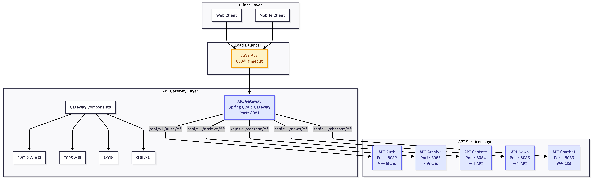

# Gateway API 모듈

## 개요

`api-gateway` 모듈은 Spring Cloud Gateway 기반의 API Gateway 서버입니다. 모든 외부 요청을 중앙에서 관리하고, 적절한 백엔드 API 서버로 라우팅하는 역할을 수행합니다. JWT 토큰 기반 인증, CORS 정책 관리, 연결 풀 최적화 등의 기능을 제공합니다.

## 주요 기능

### 1. 라우팅
- **URI 기반 라우팅**: 요청 URI 경로를 기준으로 적절한 API 서버로 요청 전달
- **5개 API 서버 라우팅**: auth, archive, contest, news, chatbot 서버로 라우팅
- **환경별 백엔드 URL 설정**: Local/Dev/Beta/Prod 환경별로 다른 백엔드 서비스 URL 사용

### 2. 인증 및 보안
- **JWT 토큰 검증**: `common-security` 모듈의 `JwtTokenProvider`를 활용한 JWT 토큰 검증
- **인증 필요/불필요 경로 구분**: 공개 API와 인증 필요 API 자동 구분
- **사용자 정보 헤더 주입**: 검증 성공 시 사용자 정보를 헤더에 주입하여 백엔드 서버로 전달

### 3. CORS 설정
- **Global CORS 설정**: 모든 경로에 대한 CORS 정책 적용
- **환경별 CORS 정책**: Local/Dev/Beta/Prod 환경별로 다른 CORS 정책 적용
- **중복 헤더 제거**: 외부 API 연동 시 중복 헤더 자동 제거

### 4. 연결 풀 및 성능 최적화
- **Reactor Netty 연결 풀 설정**: Connection reset by peer 에러 방지
- **타임아웃 설정**: 연결 타임아웃, 응답 타임아웃 최적화
- **연결 풀 모니터링**: 최대 연결 수, 유휴 연결 관리

### 5. 에러 처리
- **공통 예외 처리**: `WebExceptionHandler`를 통한 Reactive 기반 예외 처리
- **표준 에러 응답 형식**: `ApiResponse` 형식의 일관된 에러 응답
- **에러 로깅**: 환경별 로그 레벨에 따른 에러 로깅

## 아키텍처

### 인프라 아키텍처



### 전체 시스템 아키텍처

Gateway를 포함한 전체 시스템 아키텍처는 다음과 같습니다:


### 요청 처리 흐름

**인증이 필요한 요청 처리**:
1. Client → ALB → Gateway: 요청 수신
2. Gateway: 라우팅 규칙 매칭 (`/api/v1/archive/**`)
3. Gateway: JWT 인증 필터 실행
   - JWT 토큰 추출 (Authorization 헤더)
   - JWT 토큰 검증 (`JwtTokenProvider.validateToken`)
   - 사용자 정보 추출 및 헤더 주입 (`x-user-id`, `x-user-email`, `x-user-role`)
4. Gateway → Archive 서버: 인증된 요청 전달 (사용자 정보 헤더 포함)
5. Archive 서버 → Gateway: API 응답
6. Gateway → ALB → Client: 최종 응답 (CORS 헤더 포함)

**인증이 불필요한 요청 처리**:
1. Client → ALB → Gateway: 요청 수신
2. Gateway: 라우팅 규칙 매칭 (`/api/v1/contest/**`)
3. Gateway: 인증 필터 우회 (공개 API)
4. Gateway → Contest 서버: 요청 전달
5. Contest 서버 → Gateway: API 응답
6. Gateway → ALB → Client: 최종 응답

### 계층 구조

```
GatewayApplication
  ├── GatewayConfig (라우팅 설정, GlobalFilter 등록)
  ├── JwtAuthenticationGatewayFilter (JWT 인증 필터)
  ├── ApiGatewayExceptionHandler (예외 처리)
  └── application.yml (라우팅, 연결 풀, CORS 설정)
```

### 모듈 의존성 관계

```
api/gateway
├── common-core          # 공통 유틸리티, ApiResponse 등
├── common-security      # JwtTokenProvider, JWT 검증 로직
├── common-kafka         # Kafka 이벤트 (선택)
├── domain-aurora        # Aurora MySQL 도메인 (선택)
└── domain-mongodb       # MongoDB 도메인 (선택)
```

## 라우팅 규칙

### 서비스별 라우팅 매핑

| 경로 패턴 | 대상 서버 | 인증 필요 | 설명 |
|----------|---------|---------|------|
| `/api/v1/auth/**` | `@api/auth` | ❌ | 인증 서버 (회원가입, 로그인, 토큰 갱신 등) |
| `/api/v1/archive/**` | `@api/archive` | ✅ | 사용자 아카이브 관리 API |
| `/api/v1/contest/**` | `@api/contest` | ❌ | 대회 정보 조회 API (공개) |
| `/api/v1/news/**` | `@api/news` | ❌ | 뉴스 정보 조회 API (공개) |
| `/api/v1/chatbot/**` | `@api/chatbot` | ✅ | RAG 기반 챗봇 API |

### Chatbot API 라우팅

Gateway는 `/api/v1/chatbot/**` 경로의 요청을 Chatbot API 서버로 라우팅합니다. Chatbot API는 langchain4j RAG 기반 멀티턴 챗봇으로, MongoDB Atlas Vector Search와 OpenAI GPT-4o-mini를 활용합니다.

#### Chatbot LLM RAG Pipeline


#### Overall System Architecture


**주요 특징**:
- **RAG (Retrieval-Augmented Generation)**: MongoDB Atlas Vector Search를 통한 지식 검색
- **멀티턴 대화 히스토리 관리**: 세션 기반 대화 컨텍스트 유지
- **OpenAI GPT-4o-mini**: 비용 최적화된 LLM (128K 컨텍스트 윈도우)
- **사용자별 데이터 접근**: 인증된 사용자만 접근 가능 (JWT 토큰 필수)

**데이터 소스**:
- **ContestDocument**: 개발자 대회 정보
- **NewsArticleDocument**: IT 테크 뉴스 기사
- **ArchiveDocument**: 사용자 아카이브 항목 (사용자별 필터링)

자세한 Chatbot API 설계는 다음 문서를 참고하세요:
- [langchain4j RAG 기반 챗봇 설계서](../../docs/step12/rag-chatbot-design.md)

### 환경별 백엔드 서비스 URL

**Local 환경**:
- `auth`: `http://localhost:8082`
- `archive`: `http://localhost:8083`
- `contest`: `http://localhost:8084`
- `news`: `http://localhost:8085`
- `chatbot`: `http://localhost:8086`

**Dev/Beta/Prod 환경**:
- `auth`: `http://api-auth-service:8080`
- `archive`: `http://api-archive-service:8080`
- `contest`: `http://api-contest-service:8080`
- `news`: `http://api-news-service:8080`
- `chatbot`: `http://api-chatbot-service:8080`

## 인증 및 보안

### JWT 토큰 기반 인증

Gateway 서버는 `common-security` 모듈의 `JwtTokenProvider`를 활용하여 JWT 토큰을 검증합니다.

**인증 통합 방안**: `@api/auth` 모듈을 별도 서버로 유지, Gateway에서 JWT 검증만 수행
- `/api/v1/auth/**` 요청은 `@api/auth` 서버로 라우팅
- 다른 API 요청은 Gateway에서 JWT 검증 후 라우팅
- JWT는 stateless이므로 Gateway에서 직접 검증 가능

### JWT 인증 필터 동작

**인증 필요/불필요 경로 구분**:

| 경로 패턴 | 인증 필요 | 설명 |
|----------|---------|------|
| `/api/v1/auth/**` | ❌ | 인증 서버 자체 경로 |
| `/api/v1/archive/**` | ✅ | 사용자별 데이터 접근 필요 |
| `/api/v1/contest/**` | ❌ | 공개 API |
| `/api/v1/news/**` | ❌ | 공개 API |
| `/api/v1/chatbot/**` | ✅ | 사용자별 세션 관리 필요 |
| `/actuator/**` | ❌ | 헬스체크 엔드포인트 |

**JWT 토큰 추출 및 검증**:
- 헤더: `Authorization: Bearer {JWT_TOKEN}`
- 토큰이 없거나 무효한 경우: 401 Unauthorized 반환
- 응답 형식: `{"code": "4001", "messageCode": {"code": "AUTH_FAILED", "text": "인증에 실패했습니다."}}`

**사용자 정보 헤더 주입**:
검증 성공 시 다음 헤더를 추가하여 백엔드 서버로 전달:
- `x-user-id`: 사용자 ID
- `x-user-email`: 사용자 이메일
- `x-user-role`: 사용자 역할

### 토큰 갱신 흐름

Gateway는 토큰 검증만 수행하며, 토큰 갱신은 클라이언트가 처리합니다.

**시나리오 1: Access Token 만료 (클라이언트 자동 처리)**
1. Archive 요청 (만료된 토큰) → Gateway: 401 Unauthorized
2. POST `/api/v1/auth/refresh` (유효한 Refresh Token, 자동 요청) → Gateway → Auth 서버: 200 OK (새 토큰 발급)
3. Archive 요청 (새 토큰, 자동 재시도) → Gateway: JWT 검증 성공 → Archive 서버: 200 OK

**시나리오 2: Refresh Token도 만료 (사용자 개입 필요)**
1. Archive 요청 (만료된 토큰) → Gateway: 401 Unauthorized
2. POST `/api/v1/auth/refresh` (만료된 Refresh Token, 자동 시도) → Gateway → Auth 서버: 401 Unauthorized
3. 사용자 개입: 로그인 화면 표시, 이메일/비밀번호 입력
4. POST `/api/v1/auth/login` (사용자 입력 후 요청) → Gateway → Auth 서버: 200 OK (새 토큰 발급)
5. Archive 요청 (새 토큰, 자동 재시도) → Gateway: JWT 검증 성공 → Archive 서버: 200 OK

## 기술 스택

### 의존성

- **Spring Boot**: 웹 애플리케이션 프레임워크
- **Spring Cloud Gateway**: API Gateway 프레임워크 (Netty 기반)
- **Reactor Netty**: 비동기 네트워크 프레임워크
- **Common 모듈**:
  - `common-core`: 공통 DTO 및 유틸리티 (`ApiResponse`, `MessageCode`, `ErrorCodeConstants`)
  - `common-security`: JWT 토큰 검증 (`JwtTokenProvider`, `JwtTokenPayload`)
  - `common-kafka`: Kafka 이벤트 (선택)
- **Domain 모듈**:
  - `domain-aurora`: Aurora MySQL 도메인 (선택)
  - `domain-mongodb`: MongoDB 도메인 (선택)

### 버전 정보

- **Java**: 21
- **Spring Boot**: 4.0.1
- **Spring Cloud**: 2025.1.0

## 설정

### application.yml (기본 설정)

```yaml
spring:
  application:
    name: gateway-api
  profiles:
    include:
      - common-core
      - domain-api
      - mongodb-domain
  
  cloud:
    gateway:
      # 라우팅 설정
      routes:
        - id: auth-route
          uri: ${gateway.routes.auth.uri:http://localhost:8082}
          predicates:
            - Path=/api/v1/auth/**
        
        - id: archive-route
          uri: ${gateway.routes.archive.uri:http://localhost:8083}
          predicates:
            - Path=/api/v1/archive/**
        
        - id: contest-route
          uri: ${gateway.routes.contest.uri:http://localhost:8084}
          predicates:
            - Path=/api/v1/contest/**
        
        - id: news-route
          uri: ${gateway.routes.news.uri:http://localhost:8085}
          predicates:
            - Path=/api/v1/news/**
        
        - id: chatbot-route
          uri: ${gateway.routes.chatbot.uri:http://localhost:8086}
          predicates:
            - Path=/api/v1/chatbot/**
      
      # HTTP 클라이언트 연결 풀 설정
      httpclient:
        pool:
          max-idle-time: 30000        # 30초 (백엔드 keep-alive 60초보다 짧게)
          max-life-time: 300000       # 5분 (300초)
          max-connections: 500        # 최대 연결 수
          acquire-timeout: 45000      # 연결 획득 타임아웃 (45초)
          pending-acquire-timeout: 60000  # 대기 타임아웃 (60초)
        connection-timeout: 30000     # 연결 타임아웃 (30초)
        response-timeout: 60000       # 응답 타임아웃 (60초, 백엔드 타임아웃보다 길게)
      
      # Global CORS 설정
      globalcors:
        cors-configurations:
          '[/**]':
            allowCredentials: true
            allowedOriginPatterns:
              - "http://localhost:*"
              - "http://127.0.0.1:*"
            allowedHeaders: "*"
            allowedMethods: [GET, POST, PUT, PATCH, DELETE, OPTIONS, HEAD]
            maxAge: 3600
      
      # Global default-filters
      default-filters:
        - DedupeResponseHeader=Access-Control-Allow-Origin, RETAIN_LAST

server:
  port: 8081
  netty:
    connection-timeout: 3000  # 3초 (클라이언트 연결 타임아웃)
```

### application-local.yml

```yaml
spring:
  config:
    activate:
      on-profile: local

server:
  port: 8081

gateway:
  routes:
    auth:
      uri: http://localhost:8082
    archive:
      uri: http://localhost:8083
    contest:
      uri: http://localhost:8084
    news:
      uri: http://localhost:8085
    chatbot:
      uri: http://localhost:8086

spring:
  cloud:
    gateway:
      globalcors:
        cors-configurations:
          '[/**]':
            allowCredentials: true
            allowedOriginPatterns:
              - "http://localhost:*"
              - "http://127.0.0.1:*"
            allowedHeaders: "*"
            allowedMethods: [GET, POST, PUT, PATCH, DELETE, OPTIONS, HEAD]
            maxAge: 3600

logging:
  level:
    com.tech.n.ai.api.gateway: DEBUG
```

### application-dev.yml

```yaml
spring:
  config:
    activate:
      on-profile: dev

gateway:
  routes:
    auth:
      uri: http://api-auth-service:8080
    archive:
      uri: http://api-archive-service:8080
    contest:
      uri: http://api-contest-service:8080
    news:
      uri: http://api-news-service:8080
    chatbot:
      uri: http://api-chatbot-service:8080

spring:
  cloud:
    gateway:
      globalcors:
        cors-configurations:
          '[/**]':
            allowCredentials: true
            allowedOriginPatterns:
              - "http://localhost:*"
              - "http://127.0.0.1:*"
            allowedHeaders: "*"
            allowedMethods: [GET, POST, PUT, PATCH, DELETE, OPTIONS, HEAD]
            maxAge: 3600

logging:
  level:
    com.tech.n.ai.api.gateway: INFO
```

### 환경 변수

- `GATEWAY_ROUTES_AUTH_URI`: 인증 서버 URL (기본값: `http://localhost:8082`)
- `GATEWAY_ROUTES_ARCHIVE_URI`: 아카이브 서버 URL (기본값: `http://localhost:8083`)
- `GATEWAY_ROUTES_CONTEST_URI`: 대회 서버 URL (기본값: `http://localhost:8084`)
- `GATEWAY_ROUTES_NEWS_URI`: 뉴스 서버 URL (기본값: `http://localhost:8085`)
- `GATEWAY_ROUTES_CHATBOT_URI`: 챗봇 서버 URL (기본값: `http://localhost:8086`)
- `JWT_SECRET_KEY`: JWT 시크릿 키 (기본값: `default-secret-key-change-in-production-minimum-256-bits`)

## 연결 풀 및 성능 최적화

### Connection reset by peer 방지

Connection reset by peer 에러를 방지하기 위해 Reactor Netty의 연결 풀 설정을 최적화합니다.

**연결 풀 설정 근거**:
- **max-idle-time: 30초**: 백엔드 서비스의 keep-alive 시간(60초)보다 짧게 설정하여 유휴 연결을 미리 종료
- **max-life-time: 300초 (5분)**: 연결의 최대 생명주기, 오래된 연결을 주기적으로 갱신
- **max-connections: 500**: 동시 처리 가능한 최대 연결 수
- **connection-timeout: 30초**: 백엔드 서버와의 연결 시도 타임아웃
- **response-timeout: 60초**: 백엔드 서버의 응답 대기 타임아웃, 백엔드 타임아웃보다 길게 설정

## CORS 설정

### 환경별 CORS 정책

**Local 환경 (개발 편의성 우선)**:
- `allowedOriginPatterns`: `http://localhost:*`, `http://127.0.0.1:*`
- `allowCredentials: true`
- `allowedHeaders: "*"`
- `allowedMethods`: 모든 HTTP 메서드 허용

**Dev 환경 (개발 편의성 + 보안)**:
- `allowedOriginPatterns`: `http://localhost:*`, `http://127.0.0.1:*` (추가 도메인 가능)
- `allowCredentials: true`
- `allowedHeaders: "*"`
- `allowedMethods`: 모든 HTTP 메서드 허용

**Beta/Prod 환경 (보안 우선)**:
- `allowedOriginPatterns`: 구체적인 도메인 목록만 허용
- `allowCredentials: true`
- `allowedHeaders: "*"`
- `allowedMethods`: 모든 HTTP 메서드 허용

### 중복 헤더 제거

외부 API 연동 시 Global CORS와 외부 API 응답 헤더가 충돌할 수 있으므로, `DedupeResponseHeader` 필터로 중복 헤더를 제거합니다.

## 에러 처리

### 공통 예외 처리

Gateway 서버는 `WebExceptionHandler` 인터페이스를 구현하여 Reactive 기반 예외 처리를 수행합니다.

**주요 에러 코드**:

| HTTP 상태 | 에러 코드 | 설명 |
|----------|---------|------|
| 401 | `4001` | 인증 실패 (JWT 토큰 없음 또는 무효) |
| 404 | `4004` | 라우팅 실패 (경로를 찾을 수 없음) |
| 502 | `5002` | 백엔드 서버 연결 실패 |
| 504 | `5004` | 백엔드 서버 타임아웃 |
| 500 | `5000` | 내부 서버 오류 |

**에러 응답 형식**:
모든 에러 응답은 `ApiResponse` 형식을 따릅니다:

```json
{
  "code": "4001",
  "messageCode": {
    "code": "AUTH_FAILED",
    "text": "인증에 실패했습니다."
  },
  "message": null,
  "data": null
}
```

### 로깅 전략

**환경별 로그 레벨**:
- **Local/Dev**: DEBUG 레벨 상세 로깅
- **Beta**: INFO 레벨 일반 로깅
- **Prod**: WARN 레벨 에러 로깅

**로깅 항목**:
- 요청 로깅: 요청 URI, HTTP 메서드, 헤더 (민감 정보 제외)
- 인증 로깅: 인증 성공/실패, JWT 토큰 검증 결과
- 라우팅 로깅: 라우팅 규칙 매칭 결과, 백엔드 서버 URL
- 에러 로깅: 에러 발생 시 상세 스택 트레이스, 에러 코드 및 메시지

## 참고 문서

### 프로젝트 내부 문서

- **Gateway 설계서**: `docs/step14/gateway-design.md`
- **Gateway 구현 계획**: `docs/step14/gateway-implementation-plan.md`
- **API 엔드포인트 설계**: `docs/step2/1. api-endpoint-design.md`
- **Spring Security 설계 가이드**: `docs/step6/spring-security-auth-design-guide.md`
- **Contest 및 News API 설계**: `docs/step9/contest-news-api-design.md`
- **Chatbot API 설계**: `docs/step12/rag-chatbot-design.md`
- **Archive API 설계**: `docs/step13/user-archive-feature-design.md`

### 공식 문서

- [Spring Cloud Gateway 공식 문서](https://docs.spring.io/spring-cloud-gateway/docs/current/reference/html/)
- [Reactor Netty 공식 문서](https://projectreactor.io/docs/netty/release/reference/index.html)
- [Spring Boot 공식 문서](https://docs.spring.io/spring-boot/docs/current/reference/html/)

