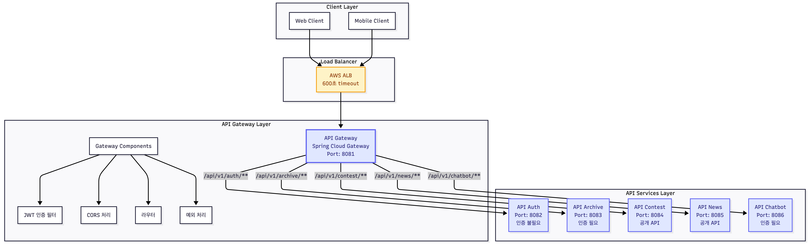

# Gateway API 모듈

## 개요

`api-gateway` 모듈은 Spring Cloud Gateway 기반의 API Gateway 서버입니다. 모든 외부 요청을 중앙에서 관리하고, 적절한 백엔드 API 서버로 라우팅하는 역할을 수행합니다. JWT 토큰 기반 인증, Rate Limiting, 헤더 보안, 요청 추적, 접근 로그, CORS 정책 관리, 연결 풀 최적화 등의 기능을 제공합니다.

## 주요 기능

### 1. 라우팅
- **URI 기반 라우팅**: 요청 URI 경로를 기준으로 적절한 API 서버로 요청 전달
- **6개 API 서버 라우팅**: auth, bookmark, emerging-tech, chatbot, agent 서버로 라우팅
- **환경별 백엔드 URL 설정**: Local/Dev/Beta/Prod 환경별로 다른 백엔드 서비스 URL 사용

### 2. 인증 및 보안
- **JWT 토큰 검증**: `common-security` 모듈의 `JwtTokenProvider`를 활용한 JWT 토큰 검증
- **인증 필요/불필요 경로 구분**: 공개 API와 인증 필요 API 자동 구분
- **사용자 정보 헤더 주입**: 검증 성공 시 사용자 정보를 헤더에 주입하여 백엔드 서버로 전달
- **헤더 보안 (Header Sanitization)**: 클라이언트가 위조한 `x-user-id`, `x-user-email`, `x-user-role` 헤더를 사전 제거하여 identity spoofing 방지

### 3. Rate Limiting
- **Redis Token Bucket 알고리즘**: Spring Cloud Gateway `RequestRateLimiter` 필터 적용
- **IP 기반 제한**: 공개 API (auth, emerging-tech)에 IP 기반 요청 제한
- **사용자 기반 제한**: 인증 API (bookmark, chatbot, agent)에 사용자 ID 기반 요청 제한
- **경로별 차등 제한**: auth(10 req/s), emerging-tech(30 req/s), 인증 경로(100 req/s)

### 4. 요청 추적 및 Access Log
- **X-Request-Id 추적**: UUID 형식의 요청 ID 자동 생성, 클라이언트 제공 시 UUID 검증 후 사용
- **분산 추적 전파**: 요청 ID를 백엔드 서비스로 전파하고, 응답 헤더에 포함
- **구조화된 Access Log**: HTTP 메서드, 경로, 상태코드, 응답시간(ms), 클라이언트 IP, 사용자 ID, 라우트 ID, User-Agent를 전용 로거(`ACCESS_LOG`)에 기록

### 5. CORS 설정
- **Global CORS 설정**: 모든 경로에 대한 CORS 정책 적용
- **환경별 CORS 정책**: Local/Dev/Beta/Prod 환경별로 다른 CORS 정책 적용
- **중복 헤더 제거**: `DedupeResponseHeader` 필터로 중복 CORS 헤더 자동 제거

### 6. 연결 풀 및 성능 최적화
- **Reactor Netty 연결 풀 설정**: Connection reset by peer 에러 방지
- **타임아웃 설정**: 연결 타임아웃, 응답 타임아웃 최적화
- **Retry**: GET 요청에 대한 자동 재시도 (2회, 지수 백오프 100ms→500ms)
- **Request Size 제한**: 최대 요청 크기 5MB 제한 (413 응답)
- **연결 풀 모니터링**: 최대 연결 수 500, 유휴 연결 관리

### 7. 에러 처리
- **공통 예외 처리**: `WebExceptionHandler`를 통한 Reactive 기반 예외 처리
- **표준 에러 응답 형식**: `ApiResponse` 형식의 일관된 에러 응답
- **에러 로깅**: 환경별 로그 레벨에 따른 에러 로깅

## 아키텍처

### 인프라 아키텍처



### 전체 시스템 아키텍처

Gateway를 포함한 전체 시스템 아키텍처는 다음과 같습니다:


### 요청 처리 흐름

**필터 실행 순서**:

| 순서 | 필터 | 역할 |
|-----|------|------|
| `HIGHEST_PRECEDENCE` | `HeaderSanitizeGlobalFilter` | 위조 identity 헤더 제거 |
| `HIGHEST_PRECEDENCE + 1` | `RequestIdGlobalFilter` | X-Request-Id 발급/전파 |
| `HIGHEST_PRECEDENCE + 2` | `JwtAuthenticationGatewayFilter` | JWT 검증, 사용자 정보 헤더 주입 |
| `LOWEST_PRECEDENCE` | `AccessLogGlobalFilter` | 요청/응답 접근 로그 기록 |

**인증이 필요한 요청 처리**:
1. Client → ALB → Gateway: 요청 수신
2. HeaderSanitizeGlobalFilter: 위조된 x-user-id, x-user-email, x-user-role 헤더 제거
3. RequestIdGlobalFilter: X-Request-Id 발급/검증
4. Gateway: 라우팅 규칙 매칭 (`/api/v1/bookmark/**`)
5. Rate Limiter: 사용자 기반 요청 제한 확인
6. Gateway: JWT 인증 필터 실행
   - JWT 토큰 추출 (Authorization 헤더)
   - JWT 토큰 검증 (`JwtTokenProvider.validateToken`)
   - 사용자 정보 추출 및 헤더 주입 (`x-user-id`, `x-user-email`, `x-user-role`)
7. Gateway → Bookmark 서버: 인증된 요청 전달 (사용자 정보 헤더 포함)
8. Bookmark 서버 → Gateway: API 응답
9. AccessLogGlobalFilter: 접근 로그 기록
10. Gateway → ALB → Client: 최종 응답 (CORS 헤더, X-Request-Id 포함)

**인증이 불필요한 요청 처리**:
1. Client → ALB → Gateway: 요청 수신
2. HeaderSanitizeGlobalFilter + RequestIdGlobalFilter 실행
3. Gateway: 라우팅 규칙 매칭 (`/api/v1/emerging-tech/**`)
4. Rate Limiter: IP 기반 요청 제한 확인
5. Gateway: 인증 필터 우회 (공개 API)
6. Gateway → Emerging Tech 서버: 요청 전달
7. Emerging Tech 서버 → Gateway: API 응답
8. AccessLogGlobalFilter: 접근 로그 기록
9. Gateway → ALB → Client: 최종 응답

### 계층 구조

```
ApiGatewayApplication
  ├── config/
  │   ├── GatewayConfig (라우팅 설정, GlobalFilter 등록)
  │   └── RateLimiterConfig (IP/User 기반 KeyResolver)
  ├── filter/
  │   ├── HeaderSanitizeGlobalFilter (위조 헤더 제거, HIGHEST_PRECEDENCE)
  │   ├── RequestIdGlobalFilter (요청 추적 ID, HIGHEST_PRECEDENCE + 1)
  │   ├── JwtAuthenticationGatewayFilter (JWT 인증, HIGHEST_PRECEDENCE + 2)
  │   └── AccessLogGlobalFilter (접근 로그, LOWEST_PRECEDENCE)
  ├── ApiGatewayExceptionHandler (예외 처리)
  └── application.yml (라우팅, Rate Limiting, 연결 풀, CORS 설정)
```

### 모듈 의존성 관계

```
api/gateway
├── common-core          # 공통 유틸리티, ApiResponse 등
├── common-security      # JwtTokenProvider, JWT 검증 로직
├── common-kafka         # Kafka 이벤트 (선택)
├── domain-aurora        # Aurora MySQL 도메인 (선택)
└── domain-mongodb       # MongoDB 도메인 (선택)
```

## 라우팅 규칙

### 서비스별 라우팅 매핑

| 경로 패턴 | 대상 서버 | 인증 필요 | Rate Limit | Key 기준 | 설명 |
|----------|---------|---------|-----------|---------|------|
| `/api/v1/auth/**` | `@api/auth` | ❌ | 10 req/s | IP | 인증 서버 (회원가입, 로그인, 토큰 갱신 등) |
| `/api/v1/bookmark/**` | `@api/bookmark` | ✅ | 100 req/s | User | 사용자 북마크 관리 API |
| `/api/v1/emerging-tech/**` | `@api/emerging-tech` | ❌ | 30 req/s | IP | AI 업데이트 정보 조회 API (공개) |
| `/api/v1/chatbot/**` | `@api/chatbot` | ✅ | 100 req/s | User | RAG 기반 챗봇 API |
| `/api/v1/agent/**` | `@api/agent` | ❌ | 100 req/s | User | AI Agent 실행 API (내부) |

### 환경별 백엔드 서비스 URL

**Local 환경**:
- `auth`: `http://localhost:8083`
- `bookmark`: `http://localhost:8085`
- `emerging-tech`: `http://localhost:8082`
- `chatbot`: `http://localhost:8084`
- `agent`: `http://localhost:8086`

**Dev/Beta/Prod 환경**:
- `auth`: `http://api-auth-service:8080`
- `bookmark`: `http://api-bookmark-service:8080`
- `emerging-tech`: `http://api-emerging-tech-service:8080`
- `chatbot`: `http://api-chatbot-service:8080`
- `agent`: `http://api-agent-service:8080`

## 인증 및 보안

### JWT 토큰 기반 인증

Gateway 서버는 `common-security` 모듈의 `JwtTokenProvider`를 활용하여 JWT 토큰을 검증합니다.

**인증 통합 방안**: `@api/auth` 모듈을 별도 서버로 유지, Gateway에서 JWT 검증만 수행
- `/api/v1/auth/**` 요청은 `@api/auth` 서버로 라우팅
- 다른 API 요청은 Gateway에서 JWT 검증 후 라우팅
- JWT는 stateless이므로 Gateway에서 직접 검증 가능

### JWT 인증 필터 동작

**인증 필요/불필요 경로 구분**:

| 경로 패턴 | 인증 필요 | 설명 |
|----------|---------|------|
| `/api/v1/auth/**` | ❌ | 인증 서버 자체 경로 |
| `/api/v1/bookmark/**` | ✅ | 사용자별 데이터 접근 필요 |
| `/api/v1/emerging-tech/**` | ❌ | 공개 API |
| `/api/v1/chatbot/**` | ✅ | 사용자별 세션 관리 필요 |
| `/api/v1/agent/**` | ❌ | 내부 API (X-Internal-Api-Key) |
| `/actuator/**` | ❌ | 헬스체크 엔드포인트 |

**JWT 토큰 추출 및 검증**:
- 헤더: `Authorization: Bearer {JWT_TOKEN}`
- 토큰이 없거나 무효한 경우: 401 Unauthorized 반환
- 응답 형식: `{"code": "4001", "messageCode": {"code": "AUTH_FAILED", "text": "인증에 실패했습니다."}}`

**사용자 정보 헤더 주입**:
검증 성공 시 다음 헤더를 추가하여 백엔드 서버로 전달:
- `x-user-id`: 사용자 ID
- `x-user-email`: 사용자 이메일
- `x-user-role`: 사용자 역할

### 토큰 갱신 흐름

Gateway는 토큰 검증만 수행하며, 토큰 갱신은 클라이언트가 처리합니다.

**시나리오 1: Access Token 만료 (클라이언트 자동 처리)**
1. Bookmark 요청 (만료된 토큰) → Gateway: 401 Unauthorized
2. POST `/api/v1/auth/refresh` (유효한 Refresh Token, 자동 요청) → Gateway → Auth 서버: 200 OK (새 토큰 발급)
3. Bookmark 요청 (새 토큰, 자동 재시도) → Gateway: JWT 검증 성공 → Bookmark 서버: 200 OK

**시나리오 2: Refresh Token도 만료 (사용자 개입 필요)**
1. Bookmark 요청 (만료된 토큰) → Gateway: 401 Unauthorized
2. POST `/api/v1/auth/refresh` (만료된 Refresh Token, 자동 시도) → Gateway → Auth 서버: 401 Unauthorized
3. 사용자 개입: 로그인 화면 표시, 이메일/비밀번호 입력
4. POST `/api/v1/auth/login` (사용자 입력 후 요청) → Gateway → Auth 서버: 200 OK (새 토큰 발급)
5. Bookmark 요청 (새 토큰, 자동 재시도) → Gateway: JWT 검증 성공 → Bookmark 서버: 200 OK

## 기술 스택

### 의존성

- **Spring Boot**: 웹 애플리케이션 프레임워크
- **Spring Cloud Gateway**: API Gateway 프레임워크 (Netty 기반)
- **Reactor Netty**: 비동기 네트워크 프레임워크
- **Common 모듈**:
  - `common-core`: 공통 DTO 및 유틸리티 (`ApiResponse`, `MessageCode`, `ErrorCodeConstants`)
  - `common-security`: JWT 토큰 검증 (`JwtTokenProvider`, `JwtTokenPayload`)
  - `common-kafka`: Kafka 이벤트 (선택)
- **Domain 모듈**:
  - `domain-aurora`: Aurora MySQL 도메인 (선택)
  - `domain-mongodb`: MongoDB 도메인 (선택)

### 버전 정보

- **Java**: 21
- **Spring Boot**: 4.0.2
- **Spring Cloud**: 2025.1.0

## 설정

### 환경 변수

- `JWT_SECRET_KEY`: JWT 시크릿 키 (기본값: `default-secret-key-change-in-production-minimum-256-bits`)
- `REDIS_HOST`: Redis 호스트 (Rate Limiting용, 기본값: `localhost`)
- `REDIS_PORT`: Redis 포트 (기본값: `6379`)

## 연결 풀 및 성능 최적화

### Connection reset by peer 방지

Connection reset by peer 에러를 방지하기 위해 Reactor Netty의 연결 풀 설정을 최적화합니다.

**연결 풀 설정 근거**:
- **max-idle-time: 30초**: 백엔드 서비스의 keep-alive 시간(60초)보다 짧게 설정하여 유휴 연결을 미리 종료
- **max-life-time: 300초 (5분)**: 연결의 최대 생명주기, 오래된 연결을 주기적으로 갱신
- **max-connections: 500**: 동시 처리 가능한 최대 연결 수
- **connection-timeout: 30초**: 백엔드 서버와의 연결 시도 타임아웃
- **response-timeout: 60초**: 백엔드 서버의 응답 대기 타임아웃, 백엔드 타임아웃보다 길게 설정

## CORS 설정

### 환경별 CORS 정책

**Local 환경 (개발 편의성 우선)**:
- `allowedOriginPatterns`: `http://localhost:*`, `http://127.0.0.1:*`
- `allowCredentials: true`
- `allowedHeaders: "*"`
- `allowedMethods`: 모든 HTTP 메서드 허용

**Dev 환경 (개발 편의성 + 보안)**:
- `allowedOriginPatterns`: `http://localhost:*`, `http://127.0.0.1:*` (추가 도메인 가능)
- `allowCredentials: true`
- `allowedHeaders: "*"`
- `allowedMethods`: 모든 HTTP 메서드 허용

**Beta/Prod 환경 (보안 우선)**:
- `allowedOriginPatterns`: 구체적인 도메인 목록만 허용
- `allowCredentials: true`
- `allowedHeaders: "*"`
- `allowedMethods`: 모든 HTTP 메서드 허용

### 중복 헤더 제거

외부 API 연동 시 Global CORS와 외부 API 응답 헤더가 충돌할 수 있으므로, `DedupeResponseHeader` 필터로 중복 헤더를 제거합니다.

## 에러 처리

### 공통 예외 처리

Gateway 서버는 `WebExceptionHandler` 인터페이스를 구현하여 Reactive 기반 예외 처리를 수행합니다.

**주요 에러 코드**:

| HTTP 상태 | 에러 코드 | 설명 |
|----------|---------|------|
| 401 | `4001` | 인증 실패 (JWT 토큰 없음 또는 무효) |
| 404 | `4004` | 라우팅 실패 (경로를 찾을 수 없음) |
| 502 | `5002` | 백엔드 서버 연결 실패 |
| 504 | `5004` | 백엔드 서버 타임아웃 |
| 500 | `5000` | 내부 서버 오류 |

**에러 응답 형식**:
모든 에러 응답은 `ApiResponse` 형식을 따릅니다:

```json
{
  "code": "4001",
  "messageCode": {
    "code": "AUTH_FAILED",
    "text": "인증에 실패했습니다."
  },
  "message": null,
  "data": null
}
```

### 로깅 전략

**환경별 로그 레벨**:
- **Local/Dev**: DEBUG 레벨 상세 로깅
- **Beta**: INFO 레벨 일반 로깅
- **Prod**: WARN 레벨 에러 로깅

**로깅 항목**:
- 요청 로깅: 요청 URI, HTTP 메서드, 헤더 (민감 정보 제외)
- 인증 로깅: 인증 성공/실패, JWT 토큰 검증 결과
- 라우팅 로깅: 라우팅 규칙 매칭 결과, 백엔드 서버 URL
- 에러 로깅: 에러 발생 시 상세 스택 트레이스, 에러 코드 및 메시지

## 참고 문서

### 프로젝트 내부 문서

- **Gateway 설계서**: `docs/step14/gateway-design.md`
- **Gateway 구현 계획**: `docs/step14/gateway-implementation-plan.md`
- **Gateway 보안·운영 강화 설계서**: `docs/reference/api-gateway-improvement-design.md`
- **API 엔드포인트 설계**: `docs/step2/1. api-endpoint-design.md`
- **Spring Security 설계 가이드**: `docs/step6/spring-security-auth-design-guide.md`
- **Chatbot API 설계**: `docs/step12/rag-chatbot-design.md`
- **Bookmark API 설계**: `docs/step13/user-bookmark-feature-design.md`

### 공식 문서

- [Spring Cloud Gateway 공식 문서](https://docs.spring.io/spring-cloud-gateway/docs/current/reference/html/)
- [Reactor Netty 공식 문서](https://projectreactor.io/docs/netty/release/reference/index.html)
- [Spring Boot 공식 문서](https://docs.spring.io/spring-boot/docs/current/reference/html/)

