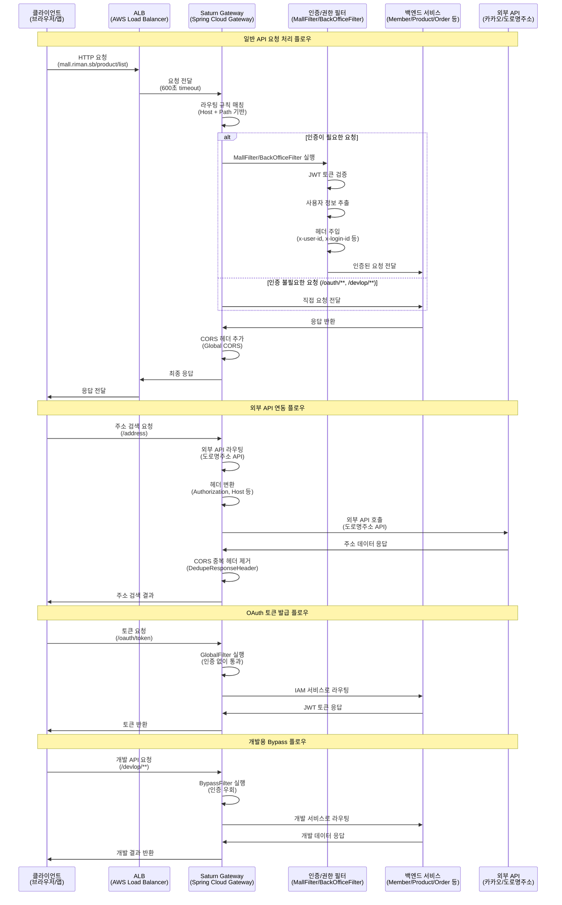
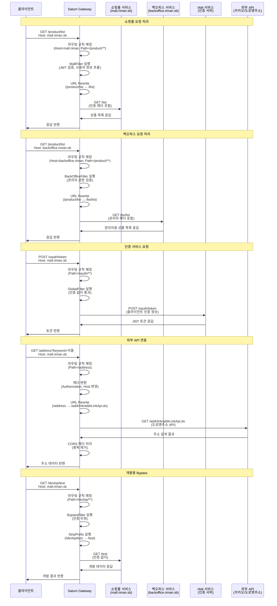
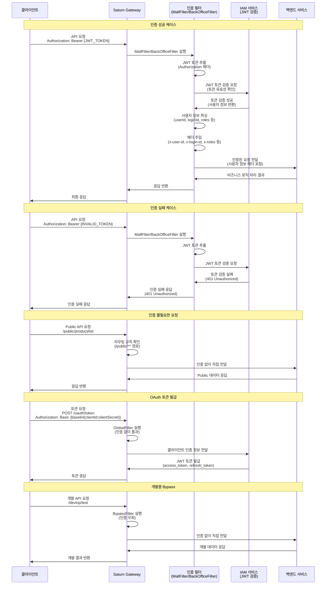
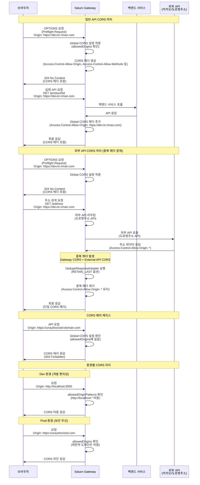

# Saturn Gateway Server 가이드

## 📋 개요

Saturn Gateway Server는 **Spring Cloud Gateway** 기반의 API Gateway로, 모든 외부 요청을 중앙에서 관리하고 백엔드 서비스로 라우팅하는 역할을 담당합니다.

## 🏗️ 아키텍처

```
Client → ALB → Gateway → Backend Services
```

- **Client**: 웹 브라우저, 모바일 앱, 외부 시스템
- **ALB**: AWS Application Load Balancer (600초 timeout)
- **Gateway**: Spring Cloud Gateway (Netty 기반)
- **Backend**: SpringBoot 서비스들 (keep-alive 60초)

### **요청 처리 시퀀스 다이어그램**



## 🔧 주요 기능

### 1. **라우팅 (Routing)**
- 요청 경로에 따른 백엔드 서비스 자동 라우팅
- 도메인별 쇼핑몰/백오피스 구분 라우팅
- URL Rewrite를 통한 경로 변환

### 2. **인증 및 권한 관리 (Authentication & Authorization)**
- JWT 토큰 기반 사용자 인증
- 쇼핑몰/백오피스 접근 권한 분리
- 사용자 정보 추출 및 헤더 주입

### 3. **보안 (Security)**
- 접근 차단 기능 (Access Block)
- IP 기반 접근 제어
- CORS 설정 관리
- 환경별 차별화된 CORS 정책 (Dev: 개발 편의성, Prod: 보안 우선)

### 4. **연결 풀 관리 (Connection Pool)**
- HTTP 클라이언트 연결 풀 최적화
- Connection reset by peer 에러 방지
- 백엔드 서비스 연결 안정성 확보

### 5. **외부 API 연동**
- 카카오 주소 검색 API 연동
- 도로명주소 API 연동 (business.juso.go.kr)

## 🛣️ 라우팅 규칙

### **서비스별 라우팅**

| 서비스 | 경로 | 쇼핑몰 | 백오피스 | 설명 |
|--------|------|--------|----------|------|
| **회원** | `/member/**` | ✅ | ✅ | 회원 관리 |
| **상품** | `/product/**` | ✅ | ✅ | 상품 관리 |
| **주문** | `/order/**` | ✅ | ✅ | 주문 관리 |
| **결제** | `/payment/**` | ✅ | ✅ | 결제 처리 |
| **보상** | `/compensation/**` | ✅ | ❌ | 쿠폰/포인트 |
| **개인몰** | `/personal/**` | ✅ | ✅ | 개인몰 관리 |
| **기타** | `/etc/**` | ✅ | ✅ | 기타 서비스 |
| **인증** | `/oauth/**` | ✅ | ✅ | 인증 서버 |

### **도메인별 구분**

| 환경 | 쇼핑몰 도메인 | 백오피스 도메인 |
|------|---------------|-----------------|
| **Local** | `mall.riman.sb` | `backoffice.riman.sb` |
| **Dev** | `saturn-gateway-api.dev.kr.riman.com` | `saturn-gateway-bo-api.dev.kr.riman.com` |
| **Beta** | `saturn-gateway-api.beta.kr.riman.com` | `saturn-gateway-bo-api.beta.kr.riman.com` |
| **Prod** | `saturn-gateway-api.kr.riman.com` | `saturn-gateway-bo-api.kr.riman.com` |

### **URL Rewrite 규칙**

#### **일반 서비스 (회원/상품/결제/개인몰)**
```
쇼핑몰: /(member|product|payment|personal)/** → /**
백오피스: /(member|product|personal)/** → /bo/**
```

#### **주문 서비스**
```
/order/** → /**
```

#### **보상 서비스**
```
/compensation/(coupon|point)/** → /(coupon|point)/**
```

#### **기타 서비스**
```
/etc/(etc|concierge)/** → /(etc|concierge)/**
```

### **라우팅 처리 시퀀스 다이어그램**



## 🔐 인증 규칙

### **인증이 필요한 요청**
- 모든 일반 API 요청
- 백오피스 전용 API (`/bo/**`)

### **인증이 불필요한 요청**
- **Public API**: `**/public/**` 경로
- **인증 서버**: `/oauth/**` 경로
- **개발용**: `/devlop/**` 경로 (local, dev 환경만)

### **인증 헤더**
```
Authorization: Bearer {JWT_TOKEN}
```

### **추가되는 헤더**
```
x-client-ip: {사용자_IP}
x-user-id: {사용자_ID}
x-login-id: {로그인_ID}
x-user-type: {사용자_타입}
x-user-rank: {사용자_등급}
x-user-join: {가입일시}
x-roles: {권한_목록}
```

### **인증 처리 시퀀스 다이어그램**



## ⚙️ 설정

### **CORS 설정**

#### **환경별 CORS 정책**

**Dev 환경 (개발 편의성 우선)**
```yaml
spring:
  config:
    activate:
      on-profile: dev
  cloud:
    gateway:
      # Global CORS 설정: 모든 경로에 CORS 헤더 자동 추가
      globalcors:
        cors-configurations:
          '[/**]':
            allowCredentials: true
            allowedOriginPatterns:  # allowCredentials: true일 때는 구체적 도메인만 허용
              - "https://dev.kr.riman.com"
              - "https://backoffice.dev.kr.riman.com"
              - "https://saturn-gateway-api.dev.kr.riman.com"
              - "https://saturn-gateway-bo-api.dev.kr.riman.com"
              - "http://mall.riman"
              - "http://backoffice.riman"
              - "http://localhost:*"        # 로컬 개발 포트 와일드카드
              - "http://127.0.0.1:*"       # 로컬 개발 포트 와일드카드
            allowedHeaders: "*"
            maxAge: 3600
            allowedMethods: [GET, POST, PATCH, DELETE, OPTIONS, PUT, HEAD]
      
      # Global default-filters: 모든 라우트에 적용되는 필터
      default-filters:
        # CORS 중복 헤더 제거 (외부 API 연동 시 필수)
        - DedupeResponseHeader=Access-Control-Allow-Origin, RETAIN_LAST  # 중복 제거 (마지막 값 유지)
        - DedupeResponseHeader=Access-Control-Request-Method Access-Control-Request-Headers Vary, RETAIN_UNIQUE  # 기타 CORS 헤더 중복 제거
```

**Prod/Beta 환경 (보안 우선)**
```yaml
# 전역 CORS 설정 (Prod, Beta에서 사용)
spring:
  cloud:
    gateway:
      globalcors:
        cors-configurations:
          '[/**]':
            allowCredentials: true
            allowedOriginPatterns: 
              - "https://saturn-gateway-api.kr.riman.com"
              - "https://saturn-gateway-bo-api.kr.riman.com"
              - "https://saturn-gateway-api.beta.kr.riman.com"
              - "https://saturn-gateway-bo-api.beta.kr.riman.com"
              - "http://mall.riman"
              - "http://backoffice.riman"
            allowedHeaders: "*"
            maxAge: 3600
            allowedMethods: [GET, POST, PATCH, DELETE, OPTIONS, PUT, HEAD]
```

#### **CORS 설정 가이드라인**

**1. allowCredentials와 allowedOrigins 조합 제한**
- `allowCredentials: true`일 때는 `allowedOrigins: "*"` 사용 불가
- 구체적인 도메인 목록 또는 `allowedOriginPatterns` 사용 필요
- **중요**: `allowedOrigins`와 `allowedOriginPatterns` 동시 사용 금지 (중복 헤더 발생)

**2. 외부 API 연동 시 중복 헤더 처리**
- **문제**: Global CORS + 외부 API CORS = 중복 `Access-Control-Allow-Origin` 헤더
- **해결**: `DedupeResponseHeader=Access-Control-Allow-Origin, RETAIN_LAST` 필터 사용
- **원리**: 마지막 값(외부 API의 `*`)을 유지하여 브라우저 호환성 확보

**3. 환경별 차별화**
- **Dev**: 개발 편의성을 위해 넓은 범위 허용 + 중복 헤더 제거 필터 적용
- **Prod**: 보안을 위해 제한적인 도메인만 허용

**4. 필수 설정 (Dev 환경)**
```yaml
# Global CORS 활성화
globalcors:
  cors-configurations:
    '[/**]':
      allowCredentials: true
      allowedOrigins: [구체적 도메인 목록]

# 중복 헤더 제거 필터 (외부 API 연동 필수)
default-filters:
  - DedupeResponseHeader=Access-Control-Allow-Origin, RETAIN_LAST
```

### **HTTP 클라이언트 연결 풀 설정 (Spring Boot 3.0 + Spring Cloud 2023.x)**
```yaml
spring:
  cloud:
    gateway:
      httpclient:
        pool:
          max-idle-time: 30000    # 백엔드 timeout보다 짧게 (밀리초 단위)
          max-life-time: 300000   # 5분 (밀리초 단위)
          acquire-timeout: 45000  # 연결 획득 타임아웃 (밀리초 단위)
          max-connections: 500  # 최대 연결 수
          pending-acquire-timeout: 60000  # 대기 타임아웃 (밀리초 단위)
        # Spring Boot 3.0에서는 hc5가 기본값으로 설정됨 (별도 enabled 설정 불필요)
        connection-timeout: 30000 # 연결 타임아웃 (밀리초 단위)
        socket-timeout: 60000     # 소켓 타임아웃 (밀리초 단위)
```

### **Netty 서버 설정 (Spring Boot 3.0)**
```yaml
server:
  netty:
    connection-timeout: 3000
    # Reactor Netty 기본 설정 사용 (Spring Boot 3.0에서 권장)
```

## 🚨 접근 제어

### **Access Block 기능**
- 특정 시간대 접근 차단
- 긴급 상황 시 전체 서비스 차단
- 데이터베이스 기반 차단 설정 관리

### **IP 기반 접근 제어**
- 클라이언트 IP 추출 및 로깅
- X-Forwarded-For 헤더 지원
- 프록시 환경 대응

## 📊 모니터링

### **로깅 레벨**
- **Local/Dev**: DEBUG 레벨 상세 로깅
- **Beta**: INFO 레벨 일반 로깅
- **Prod**: WARN 레벨 에러 로깅

### **추적 가능한 정보**
- 요청/응답 로그
- 인증 성공/실패 로그
- 연결 풀 상태
- 에러 발생 시 상세 스택 트레이스

## 🔧 개발 환경 설정

### **Local 환경 설정**
1. **Hosts 파일 수정** (관리자 권한 필요)
   ```
   127.0.0.1 mall.riman.sb
   127.0.0.1 backoffice.riman.sb
   ```

2. **Frontend 실행**
   ```bash
   # 쇼핑몰
   yarn serve-local
   
   # 백오피스
   yarn serve-local
   ```

3. **브라우저 접속**
   ```
   http://localhost:포트
   ```

### **개발용 Bypass**
- `/devlop/**` 경로는 인증 없이 통과
- 개발 중 API 테스트 용이
- Local, Dev 환경에서만 활성화

## 🚀 배포 환경

### **환경별 설정**
- **Local**: 개발자 로컬 환경
- **Dev**: 개발 서버 환경
- **Beta**: 베타 테스트 환경
- **Prod**: 운영 환경

### **백엔드 서비스 연결**
- **Dev**: `http://{service}-api-service-active.{service}.svc.cluster.local`
- **Beta**: `http://{service}-api-service-active.{service}.svc.cluster.local`
- **Prod**: `http://{service}-api-service-active.{service}.svc.cluster.local`

## 🔍 트러블슈팅

### **Connection reset by peer 에러** 
- **원인**: 백엔드 서비스 연결 타임아웃
- **해결**: 연결 풀 설정 최적화 (`max-idle-time: 30s`, `max-life-time: 300s`)
- **모니터링**: 연결 풀 상태 및 타임아웃 로그 확인

### **인증 실패**
- **원인**: JWT 토큰 만료 또는 유효하지 않음
- **해결**: 토큰 재발급 또는 갱신
- **모니터링**: 인증 실패 로그 확인

### **라우팅 실패**
- **원인**: 잘못된 경로 또는 서비스 다운
- **해결**: 경로 확인 및 서비스 상태 점검
- **모니터링**: 라우팅 로그 및 서비스 헬스체크

### **CORS 에러** 
- **원인**: 
  - `allowCredentials: true`와 `allowedOrigins: "*"` 조합 사용
  - `allowedOrigins`와 `allowedOriginPatterns` 동시 사용으로 중복 헤더 생성
  - 로컬 개발 포트가 허용 목록에 없음
  - **외부 API 연동 시 중복 헤더 문제**: Global CORS와 외부 API 응답 헤더가 충돌
- **해결**: 
  - Dev 환경: `allowedOriginPatterns`로 통합하여 와일드카드 패턴 사용
  - Prod 환경: 구체적인 도메인만 허용하는 보안 정책 적용
  - `allowCredentials: true`와 호환되는 설정으로 변경
  - **중복 헤더 제거**: `DedupeResponseHeader` 필터로 `Access-Control-Allow-Origin` 중복 제거
- **모니터링**: OPTIONS 요청 응답 헤더 확인 (`Access-Control-Allow-Origin`, `Access-Control-Allow-Credentials`)

#### **외부 API 연동 시 CORS 문제 해결**

**문제 상황**:
- 주소 검색 API (`/address`) 호출 시 `Access-Control-Allow-Origin` 헤더 중복 발생
- Global CORS에서 `https://dev.kr.riman.com` 설정
- 도로명주소 API에서 `Access-Control-Allow-Origin: *` 응답
- 브라우저에서 "multiple values" 에러 발생

**해결 방법**:
```yaml
# Global default-filters에 중복 헤더 제거 필터 추가
default-filters:
  - DedupeResponseHeader=Access-Control-Allow-Origin, RETAIN_LAST  # 중복 제거 (마지막 값 유지)
  - DedupeResponseHeader=Access-Control-Request-Method Access-Control-Request-Headers Vary, RETAIN_UNIQUE  # 기타 CORS 헤더 중복 제거
```

**핵심 원리**:
1. **Global CORS 활성화**: 모든 경로에 CORS 헤더 자동 추가
2. **외부 API 호출**: 도로명주소 API는 외부 서비스로 프록시되어 자체 CORS 헤더 응답
3. **중복 헤더 발생**: Gateway CORS + 외부 API CORS = 중복 헤더
4. **DedupeResponseHeader**: `RETAIN_LAST`로 마지막 값(`*`) 유지하여 브라우저 호환성 확보

**최종 결과**:
- ✅ `Access-Control-Allow-Origin: *` 단일 헤더로 CORS 에러 해결
- ✅ `Access-Control-Allow-Credentials: true` 유지
- ✅ 브라우저에서 주소 검색 API 정상 호출 가능

### **CORS 처리 시퀀스 다이어그램**



### **OAuth 토큰 요청 실패**
- **원인**: 
  - CORS preflight 요청 실패 (403/500 응답)
  - Authorization 헤더 형식 오류 (Base64 인코딩 문제)
  - Content-Type이 `multipart/form-data`로 전송
- **해결**: 
  - CORS 설정 수정 (위 CORS 에러 해결 방법 참조)
  - Authorization: `Basic base64(clientId:clientSecret)` 형식 사용
  - Content-Type: `application/x-www-form-urlencoded` 사용
- **모니터링**: 네트워크 탭에서 preflight 요청 상태 및 실제 요청 헤더 확인

## 🚀 Java 17 + Spring Boot 3.0 호환성

### **기술 스택 버전**
- **Java**: 17
- **Spring Boot**: 3.2.12
- **Spring Cloud**: 2023.0.4
- **Spring Cloud Gateway**: Spring Cloud 2023.x 기반

### **주요 변경사항**
1. **HTTP/2 기본 지원**: Spring Boot 3.0에서 `hc5.enabled` 설정 불필요
2. **Reactor Netty 최적화**: Spring Boot 3.0에서 성능 향상된 기본 설정
3. **Jakarta EE 9+**: Java 17과 완벽 호환
4. **GraalVM 네이티브 이미지**: 필요시 네이티브 컴파일 지원

### **설정 호환성**
- ✅ **연결 풀 설정**: Spring Cloud 2023.x에서 동일하게 지원
- ✅ **Netty 설정**: Reactor Netty 기본 설정 활용
- ✅ **성능 최적화**: Java 17의 향상된 성능과 메모리 관리

### **권장 설정**
```yaml
# Spring Boot 3.0 + Spring Cloud 2023.x 최적화된 설정
spring:
  cloud:
    gateway:
      httpclient:
        pool:
          max-idle-time: 30000      # 백엔드 timeout보다 짧게 (밀리초 단위)
          max-life-time: 300000     # 5분 (밀리초 단위)
          max-connections: 500      # 기본값 유지
          acquire-timeout: 45000    # 연결 획득 타임아웃 (밀리초 단위)
          pending-acquire-timeout: 60000  # 대기 타임아웃 (밀리초 단위)
        connection-timeout: 30000   # 연결 타임아웃 (밀리초 단위)
        socket-timeout: 60000       # 소켓 타임아웃 (밀리초 단위)

server:
  netty:
    connection-timeout: 3000       # 기본 연결 타임아웃 (밀리초 단위)
```

## 📝 참고사항

- 모든 요청은 Gateway를 통과해야 합니다
- 백엔드 서비스 직접 접근은 불가능합니다
- 인증 토큰은 IAM 서비스에서 발급받아야 합니다
- 개발 중 문제 발생 시 로그 레벨을 DEBUG로 설정하세요
- **Connection reset by peer 에러는 연결 풀 설정으로 해결되었습니다**
- **CORS 에러는 Global CORS + DedupeResponseHeader 필터로 해결되었습니다 (2025.09.05)**
- **외부 API 연동 시 중복 헤더 문제는 RETAIN_LAST 옵션으로 해결되었습니다**
- OAuth 토큰 요청 시 Authorization 헤더는 `Basic base64(clientId:clientSecret)` 형식 사용
- Content-Type은 `application/x-www-form-urlencoded` 사용 권장

### **CORS 문제 해결 히스토리**
-  주소 검색 API CORS 중복 헤더 문제 해결
  - Global CORS 활성화 + `DedupeResponseHeader=Access-Control-Allow-Origin, RETAIN_LAST` 적용
  - 도로명주소 API의 `Access-Control-Allow-Origin: *` 헤더를 최종 값으로 유지하여 브라우저 호환성 확보
