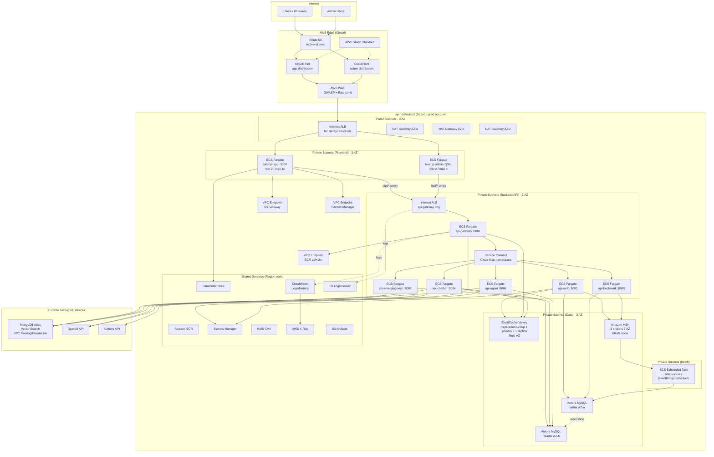

# 01. AWS 전체 아키텍처 설계

> **대상 시스템**: Spring Boot 4.0.2 기반 CQRS 마이크로서비스(6개) + Spring Batch(1개) + Next.js 16 프론트엔드(2개)
> **프라이머리 리전**: `ap-northeast-2` (서울)
> **DR 후보 리전**: `ap-northeast-1` (도쿄) — 한국 사용자 대상 RTT 안정성, 주요 AWS 리전 기능 패리티, 재해 격리 관점에서 `ap-northeast-2`와 가장 근접한 대체지
> **환경 프로파일**: `dev`, `beta`, `prod`
> **작성자 관점**: AWS Certified Solutions Architect - Professional / 시니어 DevOps 아키텍트

---

## 1. 개요 (overview)

### 1.1 설계 목표 및 비기능 요구사항(NFR)

| 항목 | 목표값 (prod) | 목표값 (beta) | 목표값 (dev) | 근거/참고 |
|----|----|----|----|----|
| **가용성 SLO** | 99.9% (월 다운타임 ≤ 43m 49s) | 99.5% | Best-effort | [Reliability Pillar - Availability](https://docs.aws.amazon.com/wellarchitected/latest/reliability-pillar/availability.html) |
| **RTO** (Recovery Time Objective) | ≤ 1시간 (Pilot Light DR) | ≤ 4시간 | ≤ 24시간 | [AWS Disaster Recovery options](https://docs.aws.amazon.com/whitepapers/latest/disaster-recovery-workloads-on-aws/disaster-recovery-options-in-the-cloud.html) |
| **RPO** (Recovery Point Objective) | ≤ 5분 (Aurora PITR, Kafka MirrorMaker2) | ≤ 30분 | ≤ 24시간 | [Aurora PITR](https://docs.aws.amazon.com/AmazonRDS/latest/AuroraUserGuide/USER_PIT.html) |
| **API P95 Latency** | Gateway 응답 ≤ 300ms (RAG 제외), RAG ≤ 3s | ≤ 500ms | N/A | [Performance Efficiency Pillar](https://docs.aws.amazon.com/wellarchitected/latest/performance-efficiency-pillar/welcome.html) |
| **수평 확장성** | 서비스별 독립 스케일, Min 2 / Max 20 Task | Min 1 / Max 4 | Min 1 / Max 2 | [ECS Service Auto Scaling](https://docs.aws.amazon.com/AmazonECS/latest/developerguide/service-auto-scaling.html) |
| **배포 모델** | Blue/Green (무중단) | Rolling | Rolling | [ECS Blue/Green with CodeDeploy](https://docs.aws.amazon.com/AmazonECS/latest/developerguide/deployment-type-bluegreen.html) |
| **보안 등급** | 개인정보 취급 + OAuth/JWT + PII 암호화(KMS) | 동일 | 완화 | [Security Pillar](https://docs.aws.amazon.com/wellarchitected/latest/security-pillar/welcome.html) |
| **관측성** | Metrics/Logs/Traces 3-pillar (CloudWatch + X-Ray + OTel) | 동일 | Metrics만 | [AWS Distro for OpenTelemetry](https://aws.amazon.com/otel/) |
| **비용 상한** | 월 $X (FinOps 대시보드 경보) | ≤ prod의 25% | ≤ prod의 10% | [Cost Optimization Pillar](https://docs.aws.amazon.com/wellarchitected/latest/cost-optimization-pillar/welcome.html) |

**주요 설계 원칙**

- **Stateless 컴퓨팅**: 모든 Spring Boot API 서비스는 세션/로컬 캐시를 배제(상태는 Redis/Aurora/MongoDB로 외부화). Paketo `bootBuildImage`로 생성된 OCI 이미지를 그대로 ECS Fargate에 배포.
- **Managed-first**: 운영 부담 최소화를 위해 가능한 경우 관리형 서비스(MSK, ElastiCache, Aurora, Secrets Manager) 우선 선택.
- **Multi-AZ by default**: 모든 데이터/메시징/로드밸런서는 최소 3 AZ 분산.
- **Defense in depth**: Edge(WAF/Shield) → Network(SG/NACL/PrivateLink) → App(IAM/OAuth/JWT) → Data(KMS/TLS) 계층 방어.
- **Everything as Code**: Terraform + GitHub Actions + CodeDeploy 기반 재현 가능한 인프라.

### 1.2 AWS 서비스 선정 — 핵심 트레이드오프

#### 1.2.1 컨테이너 오케스트레이션: ECS Fargate vs EKS vs App Runner

| 항목 | ECS Fargate | EKS (Fargate/EC2) | App Runner |
|----|----|----|----|
| **운영 복잡도** | 낮음 (제어 플레인 AWS 관리, 서버리스 데이터 플레인) | 높음 (K8s API/애드온/CRD 관리 필요) | 매우 낮음 (PaaS) |
| **학습 곡선** | AWS 고유 개념, 단기 습득 | K8s 생태계, 장기 투자 필요 | 최소 |
| **멀티서비스(6+1) 러닝코스트** | 적정 | 과도 (제어 플레인 $73/월 × 환경수) | 각 서비스마다 별도 프로비저닝, 서비스 간 프라이빗 통신 제약 |
| **서비스 디스커버리** | ECS Service Connect / Cloud Map | K8s DNS + Service Mesh | 내장 (도메인 자동 할당) |
| **배치 잡(Spring Batch)** | ECS Scheduled Task + EventBridge Scheduler 네이티브 | K8s CronJob (추가 구성) | 미지원 (항상 실행 서비스 전용) |
| **Blue/Green 배포** | CodeDeploy 네이티브 통합 | Argo Rollouts/Flagger 등 별도 도구 | 제한적(자동 롤백만) |
| **GPU/특수 하드웨어** | 제한적 | 폭넓은 지원 | 미지원 |
| **포트폴리오 적합성** | 마이크로서비스 6개 + 배치 1개 규모에 최적 | 50+ 서비스/멀티 테넌시에 적합 | 1~2개 단일 앱에 적합 |
| **공식 문서** | [ECS Fargate](https://docs.aws.amazon.com/AmazonECS/latest/developerguide/AWS_Fargate.html) | [EKS](https://docs.aws.amazon.com/eks/latest/userguide/what-is-eks.html) | [App Runner](https://docs.aws.amazon.com/apprunner/latest/dg/what-is-apprunner.html) |

**최종 선정: ECS Fargate (Blue/Green via CodeDeploy)**
- 본 프로젝트 규모(6 API + 1 Batch, 팀 규모 소)에 과하지 않고, Spring Batch를 ECS Scheduled Task로 자연스럽게 수용 가능.
- Paketo 이미지를 별도 튜닝 없이 런타임 지원.
- 장래 규모 확장 시 EKS 전환 경로는 동일 Docker 아티팩트 재사용으로 열림.

> 공식 결정 가이드: [AWS Container Services Decision Guide](https://docs.aws.amazon.com/decision-guides/latest/containers-on-aws-how-to-choose/choosing-aws-container-service.html)

#### 1.2.2 프론트엔드 호스팅: Amplify Hosting vs Vercel(외부) vs ECS/CloudFront

Next.js 16 앱은 **기본 SSR 모드**(`next.config.ts`에 `output` 미설정)이므로 정적 호스팅만으로 불가.

| 항목 | AWS Amplify Hosting | Self-hosted Next.js on ECS + CloudFront | OpenNext on Lambda@Edge/CloudFront |
|----|----|----|----|
| **SSR/ISR/Server Actions 지원** | Next.js 14+ 네이티브 지원 | 완전 지원 (Node 런타임) | 대부분 지원 (ISR는 S3+SQS) |
| **운영 부담** | 낮음 | 중간 (ECS Task 관리) | 중간 (Lambda 빌드 파이프라인) |
| **멀티앱(app+admin)** | 앱마다 분리 환경 | 하나의 ECS 클러스터에 통합 가능 | 앱마다 별도 스택 |
| **BFF 프록시(`/api/*` rewrite)** | 지원하나 ALB 백엔드 연계 번거로움 | Next.js 런타임에서 직접 ALB → Gateway로 프록시 | CloudFront Behavior로 분기 |
| **콜드 스타트** | 없음 | 없음 | 있음 |
| **공식 문서** | [Amplify Hosting Next.js SSR](https://docs.aws.amazon.com/amplify/latest/userguide/deploy-nextjs-app.html) | [Next.js Self-hosting](https://nextjs.org/docs/app/getting-started/deploying#self-hosting) | [OpenNext](https://opennext.js.org/) |

**최종 선정: AWS Amplify Hosting (`app`, `admin` 공통)**
- Next.js 16 SSR을 네이티브 지원하여 `output` 설정 추가 없이 현재 코드 그대로 배포 가능.
- Branch 환경변수(`NEXT_PUBLIC_API_BASE_URL`)로 `/api/*` rewrite destination을 환경별 Gateway URL로 치환해 localhost:8081 하드코딩 문제 해소(상세: 03 문서 §2).
- Git 연동 자동 빌드·프리뷰 배포, WAF/Cognito 연동으로 `admin` 사설화 가능.
- ECS Self-hosted는 후보로 유지하되, 운영 부담·콜드 스타트·파이프라인 일관성 관점에서 Amplify가 우세.

#### 1.2.3 Kafka: Amazon MSK vs MSK Serverless vs 자체 운영 vs Confluent Cloud

| 항목 | MSK (Provisioned) | MSK Serverless | EC2 Self-hosted | Confluent Cloud |
|----|----|----|----|----|
| **브로커 버전/커스터마이징** | 높음 | 제한적 | 최대 | 최신 |
| **토픽 수 (하드코딩 4개)** | 제약 없음 | 토픽당 처리량 제한 있음 | 제약 없음 | 제약 없음 |
| **VPC 내부 통신** | 기본 | 기본 | 기본 | PrivateLink 필요 |
| **KRaft/ZooKeeper-less** | Kafka 3.7+ 선택 가능 | 내부 구현(사용자 선택 불가) | 수동 구성 | 지원 |
| **MirrorMaker2(DR)** | 지원 | 제한적 | 지원 | Cluster Linking |
| **공식 문서** | [MSK](https://docs.aws.amazon.com/msk/latest/developerguide/what-is-msk.html) | [MSK Serverless](https://docs.aws.amazon.com/msk/latest/developerguide/serverless.html) | N/A | N/A |

**최종 선정: 환경별 분기 — `dev`/`beta`는 MSK Serverless, `prod`는 MSK Provisioned (Kafka 3.9.x KRaft, 3 AZ)**
- 현재 토픽 4개(하드코딩)로 출발하나 CQRS 확장 시 토픽/파티션 증가 예상 → prod는 Provisioned로 예측 가능한 용량·관측성 확보.
- `dev`/`beta`는 트래픽이 매우 낮으므로 Serverless로 운영 부담·고정비 최소화 (cross-cutting matrix D-6, D-11; 05 §1.1 참조). dev는 `enable_msk` 토글로 클러스터-시간 비용 회피(default off).
- `prod`는 `kafka.m7g.large` × 3 브로커(AZ당 1) — 05 §1.2 산정.

#### 1.2.4 캐시: ElastiCache for Redis vs MemoryDB vs DynamoDB

| 항목 | ElastiCache for Redis (OSS) | ElastiCache for Valkey | MemoryDB for Redis | DynamoDB |
|----|----|----|----|----|
| **내구성** | 스냅샷/AOF (데이터 유실 가능) | 동일 | 멀티 AZ 영속 로그 (내구성 보장) | 완전 내구성 |
| **지연시간** | μs~ms | μs~ms | ms | 한 자릿수 ms |
| **Redis 프로토콜 호환** | 완전 | 완전 | 완전 | 비호환 |
| **비용** | 저 | 최저 (라이선스 없음) | 중 | 요청당 과금 |
| **용도 적합성** | OAuth state, JWT 블랙리스트, 레이트리밋, 챗봇 캐시 | 동일 + 라이선스 이점 | 세션/결제 등 데이터 유실 불가 영역 | 키-값 단순 | 
| **공식 문서** | [ElastiCache Redis OSS](https://docs.aws.amazon.com/AmazonElastiCache/latest/dg/WhatIs.html) | [Valkey](https://docs.aws.amazon.com/AmazonElastiCache/latest/dg/engine-versions.html) | [MemoryDB](https://docs.aws.amazon.com/memorydb/latest/devguide/what-is-memorydb-for-redis.html) | [DynamoDB](https://docs.aws.amazon.com/amazondynamodb/latest/developerguide/Introduction.html) |

**최종 선정: ElastiCache for Valkey (prod: Replication Group 1 primary + 1 replica Multi-AZ — 환경별 사이즈는 부록 A 참조)**
- Redis 7.x와 프로토콜 호환 + 오픈소스 라이선스 리스크 제거.
- OAuth state/JWT 블랙리스트/멱등성 키/레이트리밋/RAG 캐시 모두 휘발성 허용 → MemoryDB 불필요.

#### 1.2.5 RDB: Aurora MySQL vs RDS MySQL

| 항목 | Aurora MySQL | RDS MySQL |
|----|----|----|
| **쓰기 처리량** | 최대 5배 | 기준 |
| **Read Replica** | 최대 15개, < 10ms 복제 지연 | 최대 15개, ms~s |
| **스토리지 오토스케일** | 10GB ~ 128TB 자동 | 수동 확장 |
| **Global Database** | 지원 (RPO < 1초 / RTO 일반적으로 < 1분, 관리형 Failover 사용 시) | Cross-region Read Replica (ms~s) |
| **공식 문서** | [Aurora](https://docs.aws.amazon.com/AmazonRDS/latest/AuroraUserGuide/CHAP_AuroraOverview.html) | [RDS MySQL](https://docs.aws.amazon.com/AmazonRDS/latest/UserGuide/CHAP_MySQL.html) |

**최종 선정: Amazon Aurora MySQL (prod: Provisioned `db.r7g.large` × 3 — Writer 1 + Reader 2, 3 AZ 분산; dev/beta: Serverless v2 — 환경별 사이즈는 부록 A 참조)**
- CQRS의 쓰기 경로. JPA/Flyway 호환성 동일, PITR/Backtrack/Global Database 등 운영 기능 우위.

### 1.3 환경 분리 전략 (Multi-Account)

**선정: AWS Organizations + Control Tower + 계정 분리 (dev/beta/prod 각 별도 계정)**

| 대안 | 격리도 | 비용 | 권한 경계 | 선택 |
|----|----|----|----|----|
| 단일 계정 + VPC 분리 | 약 (IAM 실수 시 환경 간 간섭) | 저 | 약 | ✗ |
| 단일 계정 + 태그 기반 | 매우 약 | 저 | 매우 약 | ✗ |
| **계정 분리 (Organizations)** | **강 (Blast radius 차단)** | **소폭 증가 (SCP 무료)** | **강 (SCP + AWS SSO)** | **✓** |

**근거 (공식)**
- [AWS Organizations Best Practices - Multiple accounts](https://docs.aws.amazon.com/whitepapers/latest/organizing-your-aws-environment/benefits-of-using-multiple-aws-accounts.html) : "보안 경계, 청구 격리, 한도 격리, 작업 부하 분리"
- [Control Tower](https://docs.aws.amazon.com/controltower/latest/userguide/what-is-control-tower.html) : Landing Zone/Guardrails 자동화.
- [AWS IAM Identity Center (SSO)](https://docs.aws.amazon.com/singlesignon/latest/userguide/what-is.html) : 개발자 단일 진입점.

**Organizations OU 구조**

```
Root
├── Security OU      : log-archive, audit (CloudTrail 중앙 집계, GuardDuty Delegated Admin)
├── Infra OU         : network (Transit Gateway, Route 53 Resolver, Shared Services)
├── Workloads OU
│   ├── dev account
│   ├── beta account
│   └── prod account
└── Sandbox OU       : 개별 개발자 실험
```

환경별 분리 강도:
- **계정**: 완전 분리
- **VPC**: 환경별로 독립 CIDR (`10.10.0.0/16` dev, `10.20.0.0/16` beta, `10.30.0.0/16` prod) + Transit Gateway로 Shared Services(ECR/Observability)만 연결
- **KMS 키**: 환경별로 개별 CMK, Cross-account 키 정책으로 CodePipeline에서만 제한 접근

### 1.4 전체 아키텍처 논리도 (prod, 3 AZ)



### 1.5 SPOF(단일 장애점) 식별 및 제거

| # | 잠재 SPOF | 제거/완화 방안 | 공식 근거 |
|---|----|----|----|
| 1 | 단일 AZ 배포 | ECS Service의 `capacityProviderStrategy` + subnet 3 AZ 분산 | [Fargate best practices](https://docs.aws.amazon.com/AmazonECS/latest/developerguide/fargate-task-defs.html) |
| 2 | Aurora Writer 1대 | Aurora는 동일 Cluster 내 Writer 장애 시 Reader 자동 승격(< 30s), Multi-AZ DB Cluster | [Aurora high availability](https://docs.aws.amazon.com/AmazonRDS/latest/AuroraUserGuide/Concepts.AuroraHighAvailability.html) |
| 3 | NAT Gateway 단일 | AZ당 NAT GW 1개씩 배치 (3 AZ = 3 NAT GW) | [NAT Gateway HA](https://docs.aws.amazon.com/vpc/latest/userguide/vpc-nat-gateway.html#nat-gateway-working-with) |
| 4 | ALB 단일 노드 | ALB는 자체 Multi-AZ, 타겟 그룹에 3 AZ Task 등록 | [ALB HA](https://docs.aws.amazon.com/elasticloadbalancing/latest/application/introduction.html) |
| 5 | ElastiCache Primary 1대 | Cluster Mode Enabled (3 shards × (1 primary + 1 replica)), Multi-AZ Auto-failover | [ElastiCache failover](https://docs.aws.amazon.com/AmazonElastiCache/latest/dg/AutoFailover.html) |
| 6 | Kafka Broker 1대 | MSK 3 broker × 3 AZ, topic RF=3, min.insync.replicas=2 | [MSK high availability](https://docs.aws.amazon.com/msk/latest/developerguide/bestpractices.html#ha-bp) |
| 7 | api-gateway가 모든 트래픽 관문 | ALB 타겟에 gateway Task 최소 2개, ECS Service 레벨 Auto Scaling, 준비/생존 프로브로 비정상 Task 조기 격리 | [ALB health checks](https://docs.aws.amazon.com/elasticloadbalancing/latest/application/target-group-health-checks.html) |
| 8 | MongoDB Atlas 외부 의존 | Atlas M10+ 3-node 복제 세트 + PrivateLink + 리전 간 글로벌 클러스터(DR) | [MongoDB Atlas HA](https://www.mongodb.com/docs/atlas/reference/faq/deployment/) |
| 9 | OpenAI/Cohere 외부 API | api-chatbot 레벨 Circuit Breaker(Resilience4j), Cohere Fallback, RAG 결과 Valkey 캐시 | [Resilience4j](https://resilience4j.readme.io/docs/circuitbreaker) |
| 10 | Route 53 단일 호스팅 존 | Route 53 Hosted Zone DNS 쿼리 응답에 대한 SLA(현재 공식 SLA: 99.99%~ 단계, Hosted Zone 의 4개 권한 네임서버가 동일 분 동안 모두 응답 실패한 경우만 'Unavailable' 산정). ALIAS 레코드 + Health Check 기반 failover | [Route 53 SLA](https://aws.amazon.com/route53/sla/) |
| 11 | Actuator liveness/readiness 미설정 (**현재 이슈**) | Spring Boot `management.endpoint.health.probes.enabled=true` + ALB HC `/actuator/health/liveness`·`/actuator/health/readiness` | [Spring Boot Kubernetes probes](https://docs.spring.io/spring-boot/reference/actuator/endpoints.html#actuator.endpoints.kubernetes-probes) |
| 12 | `.env` 전무, `localhost:8081` 하드코딩 (**현재 이슈**) | ECS Task Definition `environment` + Secrets Manager 주입, `next.config.ts`의 rewrite 대상 URL을 `process.env.API_GATEWAY_URL`로 치환 | [ECS secrets injection](https://docs.aws.amazon.com/AmazonECS/latest/developerguide/specifying-sensitive-data.html) |

### 1.6 트래픽 플로우 (시퀀스 다이어그램)

#### 1.6.1 정적 자산/SSR 페이지 요청 (app)

```mermaid
sequenceDiagram
    autonumber
    participant U as User Browser
    participant R53 as Route 53
    participant CF as CloudFront
    participant WAF as AWS WAF
    participant ALB as Internet ALB
    participant FE as ECS Fargate (Next.js app)
    participant INT as Internal ALB
    participant GW as api-gateway
    participant SVC as api-* service
    participant DB as Aurora / Redis / Mongo

    U->>R53: DNS: app.tech-n-ai.com
    R53-->>U: ALIAS to CloudFront
    U->>CF: HTTPS GET /dashboard
    CF->>CF: Cache check (_next/static hit)
    alt Cache hit (static assets)
        CF-->>U: 200 (from edge)
    else Cache miss (SSR route)
        CF->>WAF: Forward origin req
        WAF->>WAF: OWASP/BotControl/RateLimit
        WAF->>ALB: Allow
        ALB->>FE: HTTP :3000/dashboard
        FE->>FE: Next.js Server Component render
        FE->>INT: fetch('/api/bookmarks') via rewrite
        INT->>GW: :8081
        GW->>GW: JWT verify (Redis lookup)
        GW->>SVC: Service Connect DNS
        SVC->>DB: JPA / Mongo / Redis
        DB-->>SVC: data
        SVC-->>GW: JSON
        GW-->>INT-->>FE: 200
        FE-->>ALB-->>WAF-->>CF: HTML
        CF-->>U: 200 + Cache-Control
    end
```

#### 1.6.2 CQRS 쓰기 → 이벤트 → 읽기 모델 갱신

```mermaid
sequenceDiagram
    autonumber
    participant CL as Client
    participant GW as api-gateway
    participant CB as api-chatbot
    participant AUR as Aurora MySQL (Writer)
    participant MSK as Amazon MSK
    participant BATCH as batch-source (ECS Scheduled Task)
    participant MDB as MongoDB Atlas

    CL->>GW: POST /chatbot/sessions
    GW->>CB: Service Connect
    CB->>AUR: INSERT conversation_session (JPA)
    AUR-->>CB: OK
    CB->>MSK: produce tech-n-ai.conversation.session.created
    CB-->>GW-->>CL: 201 Created

    MSK->>BATCH: consume (EventBridge-triggered or long-poll)
    BATCH->>AUR: SELECT detail (read)
    BATCH->>MDB: upsert read model + vector index
    MDB-->>BATCH: ack

    CL->>GW: GET /chatbot/sessions (read)
    GW->>CB: Service Connect
    CB->>MDB: find (vector search optional)
    MDB-->>CB: docs
    CB-->>GW-->>CL: 200 (denormalized view)
```

---

## 2. 서비스 매핑 (service-mapping)

### 2.1 컴포넌트-AWS 매핑 표

| # | 현재 구성요소 | AWS 서비스 (선정) | 대체/고려 | 선정 근거 (Well-Architected 기둥) | 공식 문서 URL |
|---|---|---|---|---|---|
| 1 | 도메인/DNS | Amazon Route 53 | Cloudflare DNS | Reliability(100% SLA), Security(DNSSEC), AWS 통합 | https://docs.aws.amazon.com/Route53/latest/DeveloperGuide/Welcome.html |
| 2 | Edge CDN | Amazon CloudFront | - | Performance(전세계 엣지 600+), Cost(캐시 히트 비용↓), Security(WAF 통합) | https://docs.aws.amazon.com/AmazonCloudFront/latest/DeveloperGuide/Introduction.html |
| 3 | Edge 보안 | AWS WAF + AWS Shield Standard | AWS Shield Advanced | Security(OWASP Top10 관리형 룰, Bot Control) | https://docs.aws.amazon.com/waf/latest/developerguide/waf-chapter.html |
| 4 | DDoS | AWS Shield Standard (Free) | Shield Advanced (prod 권장 시) | Security, Reliability | https://docs.aws.amazon.com/shield/latest/developerguide/ddos-overview.html |
| 5 | TLS 인증서 | AWS Certificate Manager (ACM) | Let's Encrypt | Security(자동 갱신), OpsEx | https://docs.aws.amazon.com/acm/latest/userguide/acm-overview.html |
| 6 | L7 로드밸런서 (외부) | ALB (internet-facing) | NLB | Performance(L7 라우팅), Security(SG) | https://docs.aws.amazon.com/elasticloadbalancing/latest/application/introduction.html |
| 7 | L7 로드밸런서 (내부) | ALB (internal) | API Gateway | Performance, Cost, api-gateway 자체 구현과 중복 회피 | 동일 |
| 8 | 가상 네트워크 | Amazon VPC (3 AZ, Public+Private+Data subnets) | - | Security, Reliability | https://docs.aws.amazon.com/vpc/latest/userguide/what-is-amazon-vpc.html |
| 9 | 아웃바운드 인터넷 | NAT Gateway (AZ당 1) | NAT Instance | Reliability(관리형), Performance(45 Gbps) | https://docs.aws.amazon.com/vpc/latest/userguide/vpc-nat-gateway.html |
| 10 | VPC 엔드포인트 | VPC Gateway/Interface Endpoints (S3, ECR, SM, Logs) | NAT 통과 | Security(프라이빗 경로), Cost(NAT 트래픽↓) | https://docs.aws.amazon.com/vpc/latest/privatelink/concepts.html |
| 11 | 계정 간 네트워크 | AWS Transit Gateway | VPC Peering | Reliability, OpsEx(Hub-Spoke) | https://docs.aws.amazon.com/vpc/latest/tgw/what-is-transit-gateway.html |
| 12 | 컨테이너 오케스트레이션 | Amazon ECS + AWS Fargate | EKS, App Runner | OpsEx(제어 플레인 無관리), Cost(데이터 플레인 Per-task) | https://docs.aws.amazon.com/AmazonECS/latest/developerguide/AWS_Fargate.html |
| 13 | 컨테이너 레지스트리 | Amazon ECR (Private) | Docker Hub | Security(IAM+KMS), Performance(VPC Endpoint) | https://docs.aws.amazon.com/AmazonECR/latest/userguide/what-is-ecr.html |
| 14 | 서비스 디스커버리 | ECS Service Connect + AWS Cloud Map | Consul | OpsEx, Security(mTLS 옵션) | https://docs.aws.amazon.com/AmazonECS/latest/developerguide/service-connect.html |
| 15 | 배치 실행 (batch-source) | ECS Scheduled Task + EventBridge Scheduler | AWS Batch, Lambda(15분 제한) | OpsEx(기존 컨테이너 재사용), Cost(실행시만 과금) | https://docs.aws.amazon.com/scheduler/latest/UserGuide/what-is-scheduler.html |
| 16 | RDB (CQRS Write) | Amazon Aurora MySQL 8.0 | RDS MySQL | Reliability(Multi-AZ + PITR), Performance(5x throughput) | https://docs.aws.amazon.com/AmazonRDS/latest/AuroraUserGuide/CHAP_AuroraOverview.html |
| 17 | 문서 DB (CQRS Read) | MongoDB Atlas on AWS (외부 관리형) + PrivateLink | DocumentDB | Performance(Vector Search 네이티브), langchain4j 호환성 | https://www.mongodb.com/docs/atlas/security-private-endpoint/ |
| 18 | 캐시 | Amazon ElastiCache for Valkey (Cluster Mode) | MemoryDB, Redis OSS | Performance, Cost(Valkey 라이선스) | https://docs.aws.amazon.com/AmazonElastiCache/latest/dg/WhatIs.html |
| 19 | 메시징 | Amazon MSK (prod Provisioned KRaft / dev·beta Serverless, 3 AZ) | Kinesis | Reliability, 토픽 하드코딩 호환, 기존 카프카 클라이언트 재사용 | https://docs.aws.amazon.com/msk/latest/developerguide/what-is-msk.html |
| 20 | 객체 스토리지 | Amazon S3 (artifacts, logs, static) | - | Reliability(11 9's), Cost(Intelligent-Tiering) | https://docs.aws.amazon.com/AmazonS3/latest/userguide/Welcome.html |
| 21 | 파일 공유(배치 작업용) | Amazon EFS (필요 시) | FSx | OpsEx | https://docs.aws.amazon.com/efs/latest/ug/whatisefs.html |
| 22 | 프론트엔드 호스팅 | AWS Amplify Hosting | ECS Fargate + CloudFront, OpenNext | Next.js 16 SSR 네이티브 지원 + Branch ENV 주입으로 BFF 환경변수화 용이 | https://docs.aws.amazon.com/amplify/latest/userguide/deploy-nextjs-app.html |
| 23 | 시크릿 | AWS Secrets Manager (회전 필요 DB/외부 API 키) | Parameter Store SecureString | Security(자동 회전) | https://docs.aws.amazon.com/secretsmanager/latest/userguide/intro.html |
| 24 | 설정 파라미터 | AWS Systems Manager Parameter Store (환경변수) | Secrets Manager | Cost(무료 표준), OpsEx | https://docs.aws.amazon.com/systems-manager/latest/userguide/systems-manager-parameter-store.html |
| 25 | 암호화 키 | AWS KMS (환경별 CMK) | CloudHSM | Security(IAM 통합, 회전) | https://docs.aws.amazon.com/kms/latest/developerguide/overview.html |
| 26 | 로그 | Amazon CloudWatch Logs (+ `awslogs` 드라이버) | OpenSearch | OpsEx, Cost | https://docs.aws.amazon.com/AmazonCloudWatch/latest/logs/WhatIsCloudWatchLogs.html |
| 27 | 메트릭 | CloudWatch Metrics + CloudWatch Container Insights | Prometheus/Grafana | OpsEx, Integration | https://docs.aws.amazon.com/AmazonCloudWatch/latest/monitoring/ContainerInsights.html |
| 28 | 분산 트레이싱 | AWS X-Ray + AWS Distro for OpenTelemetry (ADOT) | Jaeger | OpsEx, Spring Cloud Sleuth 대체(Micrometer + OTLP) | https://docs.aws.amazon.com/xray/latest/devguide/aws-xray.html |
| 29 | 알림 | Amazon SNS + CloudWatch Alarms + AWS Chatbot | PagerDuty | OpsEx | https://docs.aws.amazon.com/sns/latest/dg/welcome.html |
| 30 | 비용 관리 | AWS Budgets + Cost Explorer + Cost Anomaly Detection | - | Cost Optimization | https://docs.aws.amazon.com/cost-management/latest/userguide/what-is-costmanagement.html |
| 31 | 감사/거버넌스 | AWS CloudTrail + AWS Config + AWS Security Hub + GuardDuty | - | Security, OpsEx | https://docs.aws.amazon.com/awscloudtrail/latest/userguide/cloudtrail-user-guide.html |
| 32 | 조직/계정 관리 | AWS Organizations + Control Tower + IAM Identity Center | - | Security, OpsEx, Sustainability | https://docs.aws.amazon.com/organizations/latest/userguide/orgs_introduction.html |
| 33 | CI/CD | GitHub Actions (빌드/테스트) + AWS CodeDeploy (Blue/Green) + ECR | CodePipeline | OpsEx, 기존 GitHub 워크플로 활용 | https://docs.aws.amazon.com/codedeploy/latest/userguide/deployment-groups-create-blue-green.html |
| 34 | IaC | Terraform (HashiCorp) + S3 backend + DynamoDB lock | CloudFormation, CDK | OpsEx(멀티 클라우드 일관성), 팀 학습곡선 | https://developer.hashicorp.com/terraform/docs |
| 35 | Actuator Health 엔드포인트 | Spring Boot 4 `management.endpoint.health.probes.enabled` | - | Reliability(ALB 정확한 헬스 판단) | https://docs.spring.io/spring-boot/reference/actuator/endpoints.html#actuator.endpoints.kubernetes-probes |

> 참고: AWS Architecture Center, Prescriptive Guidance, Decision Guides
> - https://aws.amazon.com/architecture/
> - https://docs.aws.amazon.com/prescriptive-guidance/
> - https://docs.aws.amazon.com/decision-guides/

---

## 3. Well-Architected Review (6 Pillars)

> 근거: [AWS Well-Architected Framework](https://docs.aws.amazon.com/wellarchitected/latest/framework/welcome.html)

### 3.1 Operational Excellence (운영 우수성)

**충족 설계 원칙**
- **Perform operations as code**: Terraform + GitHub Actions로 모든 인프라/배포 코드화. [OPS 05](https://docs.aws.amazon.com/wellarchitected/latest/operational-excellence-pillar/operational-excellence-pillar.html)
- **Make frequent, small, reversible changes**: ECS Blue/Green (CodeDeploy)로 작은 단위 배포 및 즉시 롤백.
- **Anticipate failure**: CloudWatch Alarms + Synthetics Canary로 회귀 탐지.
- **Learn from all operational events**: CloudTrail + Config + Security Hub 중앙 집계.

**현재 미흡 / 로드맵**
| # | 미흡 | 개선안 | 우선순위 |
|---|---|---|---|
| 1 | Spring Boot Actuator probes 미설정 | `application.yml`에 `management.endpoint.health.probes.enabled: true` 활성화, ALB HC path `/actuator/health/{liveness,readiness}` 설정 | P0 |
| 2 | Runbook/Playbook 부재 | `devops/runbooks/` 에 장애 시나리오별 절차 문서화, AWS Systems Manager Incident Manager 연계 | P1 |
| 3 | GameDay/Chaos Eng 미실시 | AWS Fault Injection Service 도입 (prod-like env) - https://docs.aws.amazon.com/fis/latest/userguide/what-is.html | P2 |
| 4 | 배포 파이프라인 이력 부재 | CodeDeploy + Deployment Circuit Breaker + CloudWatch dashboards | P1 |

### 3.2 Security (보안)

**충족 설계 원칙**
- **Implement a strong identity foundation**: IAM Identity Center + Organizations SCP + 최소 권한 IAM Role per ECS Task. [SEC 01](https://docs.aws.amazon.com/wellarchitected/latest/security-pillar/security-pillar.html)
- **Apply security at all layers**: WAF(Edge) → SG/NACL(Network) → JWT/OAuth(App) → KMS(Data).
- **Protect data in transit and at rest**: ACM TLS 1.2+, KMS CMK로 Aurora/EBS/S3/ECR/Secrets 암호화.
- **Automate security best practices**: Config Rules + Security Hub + GuardDuty + Macie.

**현재 미흡 / 로드맵**
| # | 미흡 | 개선안 | 우선순위 |
|---|---|---|---|
| 1 | `.env` 전무, `localhost:8081` 하드코딩 | ECS Task env 주입 + Secrets Manager, Next.js `process.env.API_BASE_URL` 치환 | P0 |
| 2 | Secrets 회전 정책 부재 | Secrets Manager 자동 회전 (Aurora 30일, OpenAI 키 수동 회전 스케줄) | P1 |
| 3 | WAF 커스텀 룰 미수립 | OWASP Top10 Managed Rules + Rate-based rule + Bot Control | P0 |
| 4 | PrivateLink 미적용(MongoDB Atlas) | Atlas Private Endpoint via PrivateLink 활성화 | P0 |
| 5 | 이미지 취약점 스캔 미설정 | ECR Enhanced Scanning(Inspector v2) 활성화 - https://docs.aws.amazon.com/AmazonECR/latest/userguide/image-scanning.html | P1 |
| 6 | CloudTrail Organization Trail 미구성 | 중앙 log-archive 계정에 Organization Trail + S3 Object Lock | P0 |
| 7 | IMDSv2 강제 미검증 | ECS/EC2 모두 IMDSv2 only - https://docs.aws.amazon.com/AWSEC2/latest/UserGuide/configuring-IMDS-existing-instances.html | P1 |

### 3.3 Reliability (신뢰성)

**충족 설계 원칙**
- **Automatically recover from failure**: ECS Service desired count 유지, Aurora Failover, ElastiCache Auto-failover.
- **Test recovery procedures**: DR 리전 Pilot Light + 분기별 failover 리허설.
- **Scale horizontally to increase aggregate workload availability**: ECS Service Auto Scaling(Target Tracking CPU 70%).
- **Stop guessing capacity**: Application Auto Scaling + Aurora Serverless v2(옵션).
- **Manage change through automation**: IaC + Blue/Green.

**근거 문서**: [Reliability Pillar](https://docs.aws.amazon.com/wellarchitected/latest/reliability-pillar/welcome.html)

**현재 미흡 / 로드맵**
| # | 미흡 | 개선안 | 우선순위 |
|---|---|---|---|
| 1 | Kafka topic RF/ISR 정책 미확정 | `replication.factor=3`, `min.insync.replicas=2`, `acks=all` 프로듀서 설정 | P0 |
| 2 | DR 사이트 부재 | `ap-northeast-1` Pilot Light (Aurora Global DB + S3 CRR + ECR replication + MSK MirrorMaker2) — **현재 단계: 설계만 유지, 미구축**(D-5, 11 §RTO/RPO 매트릭스). 마케팅·실사용자 진입 시점에 ADR로 활성화 - https://docs.aws.amazon.com/whitepapers/latest/disaster-recovery-workloads-on-aws/disaster-recovery-options-in-the-cloud.html | P1 |
| 3 | Circuit Breaker 부재 (OpenAI) | Resilience4j CircuitBreaker + Bulkhead, Cohere fallback chain | P0 |
| 4 | ALB Health Check 기본값 | HC interval 10s, unhealthy threshold 2, deregistration delay 30s로 튜닝 | P1 |
| 5 | Backup 미자동화 | AWS Backup Plan(Aurora Daily + Monthly Cold, 35일 보관) | P0 |
| 6 | 멱등성 키 저장소 SPOF | Valkey Cluster Mode + 멱등성 키 TTL 명세화 | P1 |

### 3.4 Performance Efficiency (성능 효율성)

**충족 설계 원칙**
- **Democratize advanced technologies**: 관리형 서비스(Aurora, MSK, ElastiCache) 사용.
- **Go global in minutes**: CloudFront로 전세계 엣지 캐싱.
- **Use serverless architectures**: Fargate(서버리스 컨테이너), EventBridge Scheduler.
- **Experiment more often**: A/B(CloudFront Continuous Deployment).
- **Consider mechanical sympathy**: Graviton(arm64) Fargate 활용, Paketo `BP_ARM64=true` 옵션으로 멀티아키 이미지.

**근거 문서**: [Performance Efficiency Pillar](https://docs.aws.amazon.com/wellarchitected/latest/performance-efficiency-pillar/welcome.html)

**현재 미흡 / 로드맵**
| # | 미흡 | 개선안 | 우선순위 |
|---|---|---|---|
| 1 | 아키텍처 arm64 미채택 | Fargate Graviton(`cpu_architecture=ARM64`) - 동일 성능 대비 ~20% 저렴 https://docs.aws.amazon.com/AmazonECS/latest/developerguide/task-cpu-memory-error.html | P1 |
| 2 | DB 커넥션 풀/읽기 분리 명세 없음 | HikariCP max 튜닝 + 읽기 트래픽을 Reader endpoint로 (Aurora DB Cluster endpoint 구분) | P0 |
| 3 | RAG 응답 캐싱 전략 | Valkey에 prompt-hash 기반 캐시(30분 TTL), Embedding 결과 장기 캐시 | P1 |
| 4 | CloudFront 캐시 정책 미정의 | `_next/static/*` 1년 Immutable, SSR 페이지 Stale-While-Revalidate | P0 |
| 5 | APM/프로파일링 부재 | AWS X-Ray + CloudWatch Application Signals - https://docs.aws.amazon.com/AmazonCloudWatch/latest/monitoring/CloudWatch-Application-Monitoring.html | P1 |

### 3.5 Cost Optimization (비용 최적화)

**충족 설계 원칙**
- **Implement cloud financial management**: Budgets + Cost Anomaly Detection + 태그 전략(`Environment`, `Service`, `Owner`).
- **Adopt a consumption model**: Fargate/Lambda per-second billing.
- **Measure overall efficiency**: Cost per request, Cost per tenant 대시보드.
- **Stop spending money on undifferentiated heavy lifting**: 관리형 서비스 전면 채택.
- **Analyze and attribute expenditure**: Cost Allocation Tags + AWS Cost and Usage Reports(S3 + Athena).

**근거 문서**: [Cost Optimization Pillar](https://docs.aws.amazon.com/wellarchitected/latest/cost-optimization-pillar/welcome.html)

**현재 미흡 / 로드맵**
| # | 미흡 | 개선안 | 우선순위 |
|---|---|---|---|
| 1 | Savings Plans/RI 미적용 | 6개월 사용 후 Compute Savings Plan 1Y All Upfront 검토 | P2 |
| 2 | NAT Gateway 트래픽 비용 | VPC Gateway Endpoint(S3) + Interface Endpoint(ECR/SM/Logs)로 NAT 우회 | P0 |
| 3 | dev 환경 상시 가동 | EventBridge Scheduler로 야간(19:00~09:00) + 주말 ECS Service desired=0, Aurora stop/start | P1 |
| 4 | CloudWatch Logs 장기 보관 비용 | Log Group retention 30일 + S3 Export + Glacier Deep Archive | P1 |
| 5 | Fargate Spot 미활용 | batch-source, dev/beta 환경에 Fargate Spot 80% 혼합 https://docs.aws.amazon.com/AmazonECS/latest/developerguide/fargate-capacity-providers.html | P1 |
| 6 | MongoDB Atlas 티어 검토 | Atlas Reserved Capacity 1Y 검토 | P2 |

### 3.6 Sustainability (지속가능성)

**근거 문서**: [Sustainability Pillar](https://docs.aws.amazon.com/wellarchitected/latest/sustainability-pillar/sustainability-pillar.html)

**충족 설계 원칙**
- **Understand your impact**: Customer Carbon Footprint Tool 정기 리뷰.
- **Establish sustainability goals**: 리전 전력 효율/탄소 배출 고려(Seoul은 석탄 비중 존재, Tokyo 유사) — CloudWatch 태깅으로 환경별 트래킹.
- **Maximize utilization**: Fargate right-sizing + Auto Scaling Target Tracking.
- **Anticipate and adopt new, more efficient hardware**: Graviton3 채택.
- **Use managed services**: 공유 인프라 활용으로 하드웨어 활용률 극대화.
- **Reduce the downstream impact**: CDN 캐싱으로 Origin 요청 축소, 이미지 최적화(Next.js Image).

**현재 미흡 / 로드맵**
| # | 미흡 | 개선안 | 우선순위 |
|---|---|---|---|
| 1 | arm64 Graviton 미채택 | x86_64 대비 최대 60% 에너지 효율 https://aws.amazon.com/ko/ec2/graviton/ | P1 |
| 2 | 오버프로비저닝 Task 리소스 | Compute Optimizer + CloudWatch Container Insights 분석 후 CPU/Mem 재조정 - https://docs.aws.amazon.com/compute-optimizer/latest/ug/what-is-compute-optimizer.html | P1 |
| 3 | 로그/메트릭 과수집 | 로그 레벨 조정(prod=INFO, WARN 이상만 보존), 메트릭 차원 축소 | P2 |
| 4 | 불필요한 리전 복제 | DR은 Pilot Light로 최소화, S3 CRR은 critical 버킷만 | P1 |
| 5 | 정적 자산 최적화 | Next.js Image Component + AVIF/WebP + CloudFront Brotli | P1 |

---

## 부록 A. 환경 프로파일별 리소스 매트릭스

| 리소스 | dev | beta | prod |
|---|---|---|---|
| ECS Fargate (Gateway) | 0.5 vCPU / 1GB / 1 task | 1 vCPU / 2GB / 2 task | 2 vCPU / 4GB / 2-10 task |
| ECS Fargate (api-*) | 0.5 vCPU / 1GB / 1 task | 1 vCPU / 2GB / 1-2 task | 2 vCPU / 4GB / 2-8 task |
| Aurora MySQL | Serverless v2 0.5~2 ACU (Single-AZ) | Serverless v2 0.5~4 ACU | Provisioned `db.r7g.large` × 3 (Writer 1 + Reader 2, 3 AZ) Multi-AZ + I/O-Optimized |
| MSK | Serverless (D-11: `enable_msk` 토글, default off) | Serverless | `kafka.m7g.large` 3 broker Multi-AZ (Provisioned, Kafka 3.9.x KRaft) |
| ElastiCache | `cache.t4g.micro` 1 node (replicas=0) | `cache.t4g.small` × 2 Multi-AZ (replicas=1) | `cache.t4g.small` × 2 Multi-AZ (replicas=1) |
| NAT Gateway | 1 (`single_nat_gateway=true`) | 1 (`single_nat_gateway=true`, 비용 절감) | 3 (AZ별, 격리) |
| CloudFront | 단일 distribution | 환경별 distribution | 환경별 distribution + Continuous Deployment |

## 부록 B. 현재 코드베이스 이슈 → 아키텍처 반영 체크리스트

| 이슈 | 반영 섹션 | 필수 수정 |
|---|---|---|
| Actuator liveness/readiness probe 미설정 | 3.1 / 1.5 #11 | `management.endpoints.web.exposure.include=health,info`, `management.endpoint.health.probes.enabled=true` |
| `.env` 전무, `localhost:8081` 하드코딩 | 3.2 / 1.5 #12 | ECS Task `environment` + `process.env.API_BASE_URL` 도입 |
| Paketo `bootBuildImage` (Dockerfile 없음) | 1.2.1 | ECR 푸시 파이프라인에 `./gradlew bootBuildImage --imageName=...` 단계 |
| Kafka 토픽 하드코딩 | 3.3 | `application.yml`로 이동 + Terraform `aws_msk_configuration` topic 자동 생성 |
| Kafka 토픽 RF/ISR 미명시 | 3.3 #1 | MSK 브로커 기본 `default.replication.factor=3`, `min.insync.replicas=2` |
| Next.js 기본 SSR (output 미설정) | 1.2.2 | AWS Amplify Hosting 선정 — `output` 미설정 상태를 그대로 수용(03 §2.1, 03 §2.2.1). ECS Fargate Self-hosted는 후보로 유지(Amplify 부적합 시 전환 경로) |

## 부록 C. 주요 공식 문서 인덱스

- AWS Well-Architected Framework: https://docs.aws.amazon.com/wellarchitected/latest/framework/welcome.html
- AWS Architecture Center: https://aws.amazon.com/architecture/
- AWS Prescriptive Guidance: https://docs.aws.amazon.com/prescriptive-guidance/
- AWS Decision Guides: https://docs.aws.amazon.com/decision-guides/
- AWS Organizations: https://docs.aws.amazon.com/organizations/latest/userguide/orgs_introduction.html
- AWS Control Tower: https://docs.aws.amazon.com/controltower/latest/userguide/what-is-control-tower.html
- Amazon ECS Best Practices: https://docs.aws.amazon.com/AmazonECS/latest/bestpracticesguide/intro.html
- Amazon Aurora User Guide: https://docs.aws.amazon.com/AmazonRDS/latest/AuroraUserGuide/CHAP_AuroraOverview.html
- Amazon MSK: https://docs.aws.amazon.com/msk/latest/developerguide/what-is-msk.html
- Amazon ElastiCache (Valkey): https://docs.aws.amazon.com/AmazonElastiCache/latest/dg/engine-versions.html
- Spring Boot Actuator (Kubernetes probes): https://docs.spring.io/spring-boot/reference/actuator/endpoints.html#actuator.endpoints.kubernetes-probes
- Next.js Self-Hosting: https://nextjs.org/docs/app/getting-started/deploying#self-hosting
- Apache Kafka Documentation: https://kafka.apache.org/documentation/
- MongoDB Atlas PrivateLink: https://www.mongodb.com/docs/atlas/security-private-endpoint/

---

**문서 버전**: 1.0
**작성일**: 2026-04-20
**검토 주기**: 분기별 또는 아키텍처 변경 시
