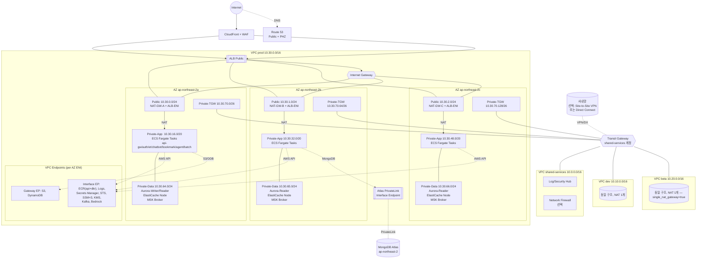

# 02. 네트워크 · VPC 설계

> 본 문서는 `01-architecture-design.md`에서 확정한 ECS Fargate 기반 마이크로서비스 아키텍처(API Gateway 8081 · Emerging-Tech 8082 · Auth 8083 · Chatbot 8084 · Bookmark 8085 · Agent 8086 + 배치 1 + Next.js app/admin 2종)를 전제로, AWS `ap-northeast-2`(서울) 리전에서 3개 AZ(`ap-northeast-2a/2b/2c`)를 사용하는 VPC 네트워크 상세 설계서이다.
> 모든 설계는 AWS VPC User Guide, AWS Security Reference Architecture(SRA), CIS AWS Foundations Benchmark v3.0.0 네트워크 섹션을 근거로 한다.

## 0. 설계 원칙 요약

| 원칙 | 적용 방식 | 근거 |
|---|---|---|
| 최소 권한(Least Privilege) | Security Group은 IP가 아닌 **SG ID 참조**, NACL은 스테이트리스 보조 방어 | AWS SRA §Network |
| 계층 격리(Tiered Subnets) | Public / Private-App / Private-Data / Private-TGW 4계층, 워크로드는 퍼블릭 금지 | AWS VPC User Guide - Subnets |
| 고가용성(Multi-AZ) | 3 AZ 배치 의무, NAT GW는 **AZ별 1개**(SPOF 회피) | AWS Well-Architected Reliability Pillar |
| 환경 격리(Account/VPC 분리) | dev / beta / prod 각각 독립 VPC (CIDR 중복 없음 → 향후 TGW·Peering 대비) | AWS Multi-Account Strategy |
| SSH 금지 | 관리 접속은 **SSM Session Manager** 전용, 22 포트 개방 금지 | CIS AWS Foundations 5.2 |
| 관측성 | 모든 VPC에 VPC Flow Logs 활성화(S3 + CloudWatch 병행) | CIS 3.9, AWS SRA |
| 암호화 전송 | 내부 구간도 TLS 1.2+ / Aurora·ElastiCache 전송 중 암호화 | AWS Foundational Security Best Practices |

### IPv6 듀얼스택 적용 여부 — **미적용(IPv4 단일 스택)** 결정

- **결정 근거 1(비용·복잡도)**: 본 서비스의 모든 내부 워크로드는 Private 서브넷이고, 외부 트래픽은 ALB(CloudFront 연동)가 종단한다. ALB는 CloudFront 배포의 오리진이므로 IPv6 엔드포인트가 필요 없다. 듀얼스택 적용 시 모든 SG/NACL/라우팅 테이블 규칙을 2배로 관리해야 한다.
- **결정 근거 2(AWS 공식 권고)**: IPv6-only 서브넷은 특정 서비스(예: EC2 Nitro)만 지원하며 Fargate Platform 1.4의 IPv6 dual-stack은 GA이지만, MSK/Aurora Writer 엔드포인트 등 일부 데이터 서비스에서 IPv6 한계가 있다. (참조: https://docs.aws.amazon.com/vpc/latest/userguide/vpc-ipv6.html)
- **확장 정책**: 향후 글로벌 사용자 직접 접근 요구가 생기면 **Egress-only Internet Gateway** + 서브넷별 IPv6 /64 할당으로 점진 도입한다. CIDR 설계 시 IPv6 대응 여지를 확보했다.

---

## 1. VPC 설계 (vpc-design)

### 1.1 CIDR 계획

#### 1.1.1 계정/환경별 VPC CIDR 할당표

| 환경 | VPC CIDR (IPv4) | 사용 가능 IP | Secondary CIDR 예약 | 비고 |
|---|---|---|---|---|
| **shared-services** (network/log 허브) | `10.0.0.0/16` | 65,536 | `10.1.0.0/16` | TGW · Inspection · 로그 집계 계정 |
| **dev** | `10.10.0.0/16` | 65,536 | `10.11.0.0/16` | 개발 |
| **beta** | `10.20.0.0/16` | 65,536 | `10.21.0.0/16` | 스테이징 / 성능 테스트 |
| **prod** | `10.30.0.0/16` | 65,536 | `10.31.0.0/16` | 운영 |
| **예약 (future)** | `10.40.0.0/16` ~ `10.90.0.0/16` | — | — | 신규 리전 · 파트너 VPC · DR |
| **MongoDB Atlas PrivateLink** | Atlas 측이 자동 할당(예: `192.168.248.0/21`) | — | — | 외부 관리 대역, AWS와 겹치지 않게 `10.0.0.0/8` 회피 |

- **RFC 1918 준수**: 모든 대역이 `10.0.0.0/8` 내부에 있어 사설 IP 요건 충족. (https://datatracker.ietf.org/doc/html/rfc1918)
- **중복 방지 수학적 근거**: 각 VPC가 /16으로 분리되고 3번째 옥텟 이상이 `0/10/20/30/40...`으로 **최소 10 단위 이격**되어 있어 어떤 두 대역도 교집합이 공집합이다. 향후 /16 추가 할당 시에도 `10.<10*N>.0.0/16` 규칙을 유지하면 TGW 라우팅 충돌이 발생하지 않는다.
- **MongoDB Atlas VPC Peering/PrivateLink**: Atlas는 내부적으로 `192.168.0.0/16` 계열을 사용하며, Peering 방식 사용 시 `10.x` 대역과 겹치지 않도록 Atlas Project Network 설정에서 반드시 확인해야 한다. 본 설계는 **PrivateLink 방식**을 채택하여 대역 충돌 리스크를 근본 제거한다. (https://www.mongodb.com/docs/atlas/security-private-endpoint/)

#### 1.1.2 서브넷 CIDR 분할 — prod VPC(`10.30.0.0/16`) 기준 상세 표

`/16 = 65,536`개 IP를 아래와 같이 분할한다. 각 AZ(a/b/c)에 대칭 배치.

| 계층 | AZ | CIDR | IP 수 | AWS 예약(-5) | 실사용 | 용도 |
|---|---|---|---|---|---|---|
| Public | 2a | `10.30.0.0/24` | 256 | 251 | ALB(ENI), NAT GW | 인터넷 경로 필요 리소스 |
| Public | 2b | `10.30.1.0/24` | 256 | 251 | ALB(ENI), NAT GW | — |
| Public | 2c | `10.30.2.0/24` | 256 | 251 | ALB(ENI), NAT GW | — |
| **Private-App** | 2a | `10.30.16.0/20` | 4,096 | 4,091 | ECS Fargate Task ENI · VPC Endpoint ENI · Lambda(옵션) | /20 = 4096 IP, Fargate ENI 당 1 IP |
| **Private-App** | 2b | `10.30.32.0/20` | 4,096 | 4,091 | 동상 | — |
| **Private-App** | 2c | `10.30.48.0/20` | 4,096 | 4,091 | 동상 | — |
| Private-Data | 2a | `10.30.64.0/24` | 256 | 251 | Aurora, ElastiCache, MSK Broker | — |
| Private-Data | 2b | `10.30.65.0/24` | 256 | 251 | Aurora, ElastiCache, MSK Broker | — |
| Private-Data | 2c | `10.30.66.0/24` | 256 | 251 | Aurora, ElastiCache, MSK Broker | — |
| Private-TGW | 2a | `10.30.70.0/26` | 64 | 59 | TGW ENI | TGW attachment subnet (/26, AWS 권고 /28 보다 여유) |
| Private-TGW | 2b | `10.30.70.64/26` | 64 | 59 | TGW ENI | — |
| Private-TGW | 2c | `10.30.70.128/26` | 64 | 59 | TGW ENI | — |
| **Reserved** | — | `10.30.128.0/17` 등 잔여 영역 | — | — | 확장(추가 서비스, IPv6 듀얼스택 시 IPv4 재분할 대비) | 절대 배포 금지 |

**CIDR 산술 검증**
- 위 CIDR 은 모듈(`modules/network/main.tf`)의 `cidrsubnet()` 결정적 분할 결과와 일치한다(public: newbits=8 netnum 0..2, private-app: newbits=4 netnum 1..3, private-data: newbits=8 netnum 64..66, private-tgw: newbits=10 netnum 280..282).
- Private-App이 /20인 이유: ECS Fargate는 **Task 당 ENI 1개**를 사용하여 서브넷 IP를 직접 소비한다. 마이크로서비스 6개 + 배치 + deploy 중 Blue/Green 이중 실행을 감안하면 Task 수가 수백 단위로 확장될 수 있으므로 /24(251 IP)로는 부족하다. /20은 4,091 IP로 16배 여유 확보. (참조: https://docs.aws.amazon.com/AmazonECS/latest/developerguide/fargate-task-networking.html)

#### 1.1.3 dev / beta VPC 서브넷 매핑(동일 구조, 2번째 옥텟만 상이)

dev/beta는 prod와 **동일한 3번째/4번째 옥텟 오프셋**을 재사용하여 IaC 모듈화를 쉽게 한다.

| 환경 | Public a/b/c | Private-App a/b/c | Private-Data a/b/c | Private-TGW a/b/c |
|---|---|---|---|---|
| dev | `10.10.0.0/24` · `10.10.1.0/24` · `10.10.2.0/24` | `10.10.16.0/20` · `10.10.32.0/20` · `10.10.48.0/20` | `10.10.64.0/24` · `10.10.65.0/24` · `10.10.66.0/24` | `10.10.70.0/26` · `10.10.70.64/26` · `10.10.70.128/26` |
| beta | `10.20.0.0/24` · `10.20.1.0/24` · `10.20.2.0/24` | `10.20.16.0/20` · `10.20.32.0/20` · `10.20.48.0/20` | `10.20.64.0/24` · `10.20.65.0/24` · `10.20.66.0/24` | `10.20.70.0/26` · `10.20.70.64/26` · `10.20.70.128/26` |
| prod | `10.30.0.0/24` · `10.30.1.0/24` · `10.30.2.0/24` | `10.30.16.0/20` · `10.30.32.0/20` · `10.30.48.0/20` | `10.30.64.0/24` · `10.30.65.0/24` · `10.30.66.0/24` | `10.30.70.0/26` · `10.30.70.64/26` · `10.30.70.128/26` |

### 1.2 서브넷 설계 상세

#### 1.2.1 Public 서브넷
- **배치 리소스**: Application Load Balancer(ALB) ENI, NAT Gateway(AZ별 1개), (선택) Bastion 대체용 SSM VPC Endpoint는 Private-App에 둔다.
- **워크로드 배치 금지**: 모든 Fargate Task, RDS, Cache, MSK는 Public 서브넷 배치를 **NACL 및 IAM Service Control Policy**로 차단한다. (근거: CIS AWS Benchmark 5.5 — "Ensure no security groups allow ingress from 0.0.0.0/0 to port 22", AWS SRA §Network Isolation)
- **Auto-assign Public IPv4**: Off. Public 리소스(ALB, NAT)는 별도 EIP를 부여한다.

#### 1.2.2 Private-App 서브넷
- **배치 리소스**: ECS Fargate Task(API Gateway 8081, Emerging-Tech 8082, Auth 8083, Chatbot 8084, Bookmark 8085, Agent 8086, Batch), Lambda VPC 어태치, 모든 Interface VPC Endpoint의 ENI.
- **아웃바운드**: 같은 AZ의 NAT Gateway로 라우팅(AZ 간 트래픽 비용 방지). VPC Endpoint가 있는 AWS 서비스는 NAT를 우회한다.
- **장기 확장 여지**: 현재 /20 × 3 = 12,288 IP. 1 서비스당 평균 10 Task로 가정 시(6 서비스×10=60 Task×3 replica×3 AZ=540 Task) 실사용은 1,000 IP 미만이며, 약 **12배 헤드룸**을 확보.

#### 1.2.3 Private-Data 서브넷
- **배치 리소스**: Aurora MySQL Writer/Reader, ElastiCache(Valkey/Redis OSS), MSK Broker.
- **인바운드**: Private-App 서브넷의 SG ID만 허용. 퍼블릭/NAT 경유 인바운드 차단.
- **아웃바운드**: 원칙적으로 NAT 불필요. Aurora·MSK가 AWS API 호출이 필요할 때만 VPC Endpoint를 경유. (참조: https://docs.aws.amazon.com/AmazonRDS/latest/UserGuide/USER_VPC.html)

#### 1.2.4 Private-TGW 서브넷
- **목적**: Transit Gateway attachment ENI 전용. 코드 모듈은 /26(64 IP) 로 분할(AWS 권고 최소 /28 보다 여유). 향후 추가 ENI 대비.
- **근거**: https://docs.aws.amazon.com/vpc/latest/tgw/tgw-best-design-practices.html — "dedicate a small subnet (e.g., /28) in each AZ for TGW attachments".

### 1.3 라우팅 테이블 & 인터넷 경로

#### 1.3.1 라우팅 테이블 세트(prod 기준, dev/beta 동일 구조)

| 라우팅 테이블 | 연결 서브넷 | 경로 항목 |
|---|---|---|
| `rt-public-prod` | Public-2a/b/c | `10.30.0.0/16` → local · `0.0.0.0/0` → IGW |
| `rt-private-app-prod-2a` | Private-App-2a | `10.30.0.0/16` → local · `0.0.0.0/0` → NAT-GW-2a · AWS 서비스 → VPC Endpoint |
| `rt-private-app-prod-2b` | Private-App-2b | 동일(NAT-GW-2b) |
| `rt-private-app-prod-2c` | Private-App-2c | 동일(NAT-GW-2c) |
| `rt-private-data-prod` | Private-Data-2a/b/c | `10.30.0.0/16` → local · VPC Endpoint만 허용(기본 라우트 없음) |
| `rt-private-tgw-prod` | Private-TGW-2a/b/c | `10.30.0.0/16` → local · `10.0.0.0/8` → TGW(다른 VPC) |

#### 1.3.2 Internet Gateway · NAT Gateway

- **IGW**: VPC당 1개. Public 서브넷의 기본 경로.
- **NAT Gateway**: **AZ별 1개(총 3개)**. 단일 NAT SPOF 회피(AWS Well-Architected REL-2). 각 AZ의 Private-App 서브넷은 동일 AZ의 NAT만 사용하여 **AZ 간 데이터 전송 비용**을 차단한다. (참조: https://docs.aws.amazon.com/vpc/latest/userguide/vpc-nat-gateway.html, https://docs.aws.amazon.com/AmazonECS/latest/bestpracticesguide/networking-outbound.html)
- **dev/beta 환경 비용 절감 예외**: dev·beta VPC는 **NAT GW 1개(AZ-2a)만** 운용하여 월 비용을 1/3로 절감한다(`single_nat_gateway = true` — `envs/dev/terraform.tfvars`, `envs/beta/terraform.tfvars`). prod 만 AZ별 3개 (`single_nat_gateway = false` — `envs/prod/terraform.tfvars`).
- **Egress-only IGW**: IPv6 미적용 결정에 따라 현재 비활성. IPv6 도입 시 IPv6 전용 아웃바운드 경로로 추가.

### 1.4 VPC Endpoint (PrivateLink)

모든 Private-App 서브넷 3 AZ에 ENI를 배치하여 AWS API 호출이 NAT GW를 경유하지 않도록 한다. **NAT GW 처리 비용 + 데이터 전송 비용**을 절감하고, 트래픽이 AWS 백본을 벗어나지 않아 보안도 향상된다. (근거: https://docs.aws.amazon.com/vpc/latest/privatelink/privatelink-access-aws-services.html)

| 서비스 | Endpoint 유형 | 이유 | Endpoint Policy |
|---|---|---|---|
| **S3** | **Gateway** (무료) | 라우팅 테이블에 `pl-xxxx` 추가만으로 사용, 트래픽 무료 | `aws:PrincipalOrgID` 로 본 조직만 허용 |
| **DynamoDB** (사용 시) | **Gateway** (무료) | 동상 | 동상 |
| **ECR (api + dkr)** | Interface | Fargate 이미지 pull. `ecr.api` + `ecr.dkr` 2종 필수 | Condition `aws:SourceVpce` |
| **CloudWatch Logs** (`logs`) | Interface | ECS 로그 드라이버가 직접 전송 | — |
| **Secrets Manager** (`secretsmanager`) | Interface | DB/Kafka 자격증명 로드(Spring Boot `spring.cloud.aws.secretsmanager`) | — |
| **STS** (`sts`) | Interface | IAM Roles for Tasks(IRSA 동급) 토큰 교환 | — |
| **SSM** (`ssm`, `ssmmessages`, `ec2messages`) | Interface | **Session Manager**(SSH 대체) · Parameter Store | — |
| **KMS** (`kms`) | Interface | Aurora/EBS/S3 객체 복호화, Secrets Manager 복호화 | — |
| **MSK (Kafka)** (`kafka`) | Interface | 관리 API 호출용(데이터 플레인은 MSK 자체 PrivateLink/브로커 경유) | — |
| **Bedrock / OpenAI 대체 모델** (`bedrock-runtime`) | Interface (선택) | Agent 서비스가 Bedrock 사용 시 | — |
| **MongoDB Atlas PrivateLink** | 외부 Provider Interface Endpoint | Atlas에서 제공, `ap-northeast-2` 리전 엔드포인트 서비스명 등록 | Atlas Project 측 IP Access List 관리 |

- **Private DNS 활성화**: 모든 Interface Endpoint는 `Enable Private DNS` 옵션 ON → 클라이언트가 공식 DNS(`s3.ap-northeast-2.amazonaws.com` 등)만 써도 자동 라우팅.
- **Endpoint 보안**: Endpoint 전용 SG(`sg-vpce`)를 두어 Private-App SG에서 TCP 443만 허용.

### 1.5 DNS — Route 53 Private Hosted Zone & AWS Cloud Map

#### 1.5.1 Zone 구조
- **Public Zone (Route 53)**: `techn-ai.example.com` — ALB 대상 A/AAAA ALIAS.
- **Private Hosted Zone**(PHZ): 환경별 독립
  - `dev.internal.techn-ai` (dev VPC 연결)
  - `beta.internal.techn-ai` (beta VPC 연결)
  - `prod.internal.techn-ai` (prod VPC 연결)
- **환경별 VPC만 Associate** → 환경 간 네임 충돌 및 크로스 리졸브 방지.

#### 1.5.2 서비스 디스커버리(AWS Cloud Map)
- ECS Service마다 Cloud Map Namespace `<env>.internal.techn-ai`에 등록.
- 네이밍: `api-gateway.prod.internal.techn-ai` (8081), `api-auth.prod.internal.techn-ai` (8083), … `api-agent` (8086), `batch-source` (배치, 코드 모듈명 일치).
- DNS SRV 레코드로 포트 포함 조회(Spring Boot `spring.cloud.discovery` 연동) 또는 A 레코드 + 고정 포트.
- 참조: https://docs.aws.amazon.com/cloud-map/latest/dg/what-is-cloud-map.html, https://docs.aws.amazon.com/Route53/latest/DeveloperGuide/hosted-zones-private.html

#### 1.5.3 Inbound/Outbound Resolver(Route 53 Resolver Endpoints)
- 향후 on-prem 연동 또는 멀티 계정 DNS 포워딩 시 Private-App 서브넷에 Resolver Endpoint 배치 준비. 현재는 비활성.

---

## 2. Security Group 매트릭스 (security-groups)

**규칙**
- 소스는 CIDR 대신 **SG ID**를 우선 참조 → Fargate 스케일링 시 IP 변동에도 자동 적용.
- 기본 아웃바운드 `0.0.0.0/0 allow` 는 **제거**하고 필요한 목적지(SG 또는 VPC Endpoint Prefix List)만 허용(최소 권한).
- 모든 SG 이름 규칙: `sg-<env>-<resource>` (예: `sg-prod-alb-public`).
- SG 제한: VPC당 SG 2,500개 / SG당 Rule 60개 한도를 모니터링. (https://docs.aws.amazon.com/AmazonVPC/latest/UserGuide/amazon-vpc-limits.html)

### 2.1 SG 정의 및 매트릭스

| SG 이름 | 인바운드 (소스 → 포트/프로토콜) | 아웃바운드 (목적지 → 포트/프로토콜) | 적용 리소스 |
|---|---|---|---|
| `sg-prod-alb-public` | `0.0.0.0/0` → 443/TCP `0.0.0.0/0` → 80/TCP(HTTPS 리다이렉트 용) | `sg-prod-api-gateway` → 8081/TCP | 퍼블릭 ALB (외부 API/웹 진입) |
| `sg-prod-alb-internal` | `sg-prod-api-gateway` → 443/TCP(내부 서비스→서비스 호출) | `sg-prod-api-*` → 8082~8086/TCP | 내부 ALB(선택, Cloud Map 우선이면 미사용) |
| `sg-prod-api-gateway` | `sg-prod-alb-public` → 8081/TCP | `sg-prod-api-auth` → 8083 · `sg-prod-api-et` → 8082 · `sg-prod-api-chatbot` → 8084 · `sg-prod-api-bookmark` → 8085 · `sg-prod-api-agent` → 8086 · `sg-prod-vpce` → 443 · `pl-s3` → 443 | API Gateway 서비스 (8081) |
| `sg-prod-api-auth` | `sg-prod-api-gateway` → 8083 `sg-prod-api-bookmark` → 8083(토큰 검증) `sg-prod-api-chatbot` → 8083 | `sg-prod-aurora` → 3306 · `sg-prod-elasticache` → 6379 · `sg-prod-vpce` → 443 | Auth 서비스 (8083) |
| `sg-prod-api-et` | `sg-prod-api-gateway` → 8082 | `sg-prod-aurora` → 3306 · `sg-prod-mongodb-atlas-vpce` → 27017 · `sg-prod-msk` → 9098 · `sg-prod-vpce` → 443 | Emerging-Tech (8082) |
| `sg-prod-api-chatbot` | `sg-prod-api-gateway` → 8084 | `sg-prod-mongodb-atlas-vpce` → 27017 · `sg-prod-vpce` → 443(Bedrock/OpenAI) · `sg-prod-elasticache` → 6379 | Chatbot RAG (8084) |
| `sg-prod-api-bookmark` | `sg-prod-api-gateway` → 8085 | `sg-prod-aurora` → 3306 · `sg-prod-msk` → 9098 · `sg-prod-vpce` → 443 | Bookmark (8085) |
| `sg-prod-api-agent` | `sg-prod-api-gateway` → 8086 | `sg-prod-aurora` → 3306 · `sg-prod-vpce` → 443 · `sg-prod-mongodb-atlas-vpce` → 27017 | Agent (8086) |
| `sg-prod-api-batch` | (없음) | `sg-prod-aurora` → 3306 · `sg-prod-msk` → 9098 · `sg-prod-vpce` → 443 | Batch 워커(EventBridge Scheduler 트리거) |
| `sg-prod-aurora` | `sg-prod-api-auth`·`sg-prod-api-et`·`sg-prod-api-bookmark`·`sg-prod-api-agent`·`sg-prod-api-batch` → 3306/TCP | (제거, 데이터 평면은 outbound 불필요) | Aurora MySQL Writer/Reader |
| `sg-prod-elasticache` | `sg-prod-api-auth`·`sg-prod-api-chatbot` → 6379/TCP(TLS) | (없음) | ElastiCache (Valkey/Redis OSS) |
| `sg-prod-msk` | `sg-prod-api-et`·`sg-prod-api-bookmark`·`sg-prod-api-batch` → 9098/TCP (IAM SASL) · 9094(TLS) | (없음) | MSK Broker |
| `sg-prod-vpce` | `sg-prod-api-*` → 443/TCP | (없음) | 모든 Interface VPC Endpoint ENI |
| `sg-prod-mongodb-atlas-vpce` | `sg-prod-api-et`·`sg-prod-api-chatbot`·`sg-prod-api-agent` → 27017/TCP (Replica Set; sharded cluster 도입 시 27015–27017) | (없음) | MongoDB Atlas PrivateLink Interface Endpoint (Atlas 공식: *Set Up a Private Endpoint*) |
| `sg-prod-ecs-fargate-common` | (없음, 각 서비스 SG가 구체 규칙을 가짐) | `sg-prod-vpce` → 443 · `pl-s3` Prefix List → 443 · 외부 API(OpenAI 등) NAT 경유 시 도메인 단위 egress 제어는 §3.4 Network Firewall에 위임(SG 0.0.0.0/0 직접 허용 지양) | 공통(ECR Pull, Logs, KMS) |
| `sg-prod-admin-ssm` | (없음 — SSM은 역방향 ENI 없음) | `sg-prod-vpce` → 443 (ssm/ssmmessages/ec2messages) | SSM Session Manager 접속용 Task/Host (관리자 진입, **SSH 22 금지**) |

### 2.2 접근(관리) 정책
- **Bastion 없음**: EC2 Bastion Host 대신 **AWS Systems Manager Session Manager**를 통한 `ecs execute-command`(Fargate) 및 Session Manager 전용 콘솔 접근. 포트 22는 **어떤 SG에도 개방하지 않는다**. (근거: AWS SRA §Identity & Access, CIS 5.2 — "Ensure no security groups allow ingress from 0.0.0.0/0 to remote server administration ports")
- **IAM Condition**: 관리자 역할(AssumeRole)은 `aws:SourceIp = 회사 VPN CIDR`, `aws:MultiFactorAuthPresent = true` 조건을 강제.

### 2.3 SG 변경 관리
- 모든 SG는 Terraform으로 관리(09 문서 참조). 콘솔 수동 수정 금지(CloudTrail + AWS Config Rule `restricted-common-ports` 로 탐지).

---

## 3. NACL & Flow Logs (network-acl-and-flow-logs)

### 3.1 Network ACL(스테이트리스 방어 레이어)

- **원칙**: SG(스테이트풀)와 별도로 **서브넷 계층 차단**을 둔다. NACL은 주로 **Public→Private-Data 직통 금지**, **악성 IP 차단** 역할로 사용하고, 세밀 정책은 SG가 담당.
- **기본 전략**: Default NACL은 그대로 두지 않고, 명시적 커스텀 NACL을 서브넷 그룹별로 부여.

| NACL | 연결 서브넷 | 인바운드 (Rule#) | 아웃바운드 (Rule#) |
|---|---|---|---|
| `nacl-prod-public` | Public-2a/b/c | 100 ALLOW 443/TCP 0.0.0.0/0 110 ALLOW 80/TCP 0.0.0.0/0 120 ALLOW 1024-65535/TCP 0.0.0.0/0 (리턴) * DENY | 100 ALLOW ALL to 10.30.0.0/16 (내부) 110 ALLOW 443/TCP 0.0.0.0/0 (NAT 아웃) 120 ALLOW 1024-65535/TCP 0.0.0.0/0 (리턴) |
| `nacl-prod-private-app` | Private-App-2a/b/c | 100 ALLOW ALL from 10.30.0.0/16 110 ALLOW 1024-65535/TCP from 0.0.0.0/0 (NAT 리턴) * DENY | 100 ALLOW ALL to 10.30.0.0/16 110 ALLOW 443/TCP to 0.0.0.0/0 120 ALLOW 80/TCP to 0.0.0.0/0 (ECR 일부) 130 ALLOW 1024-65535/TCP to 0.0.0.0/0 |
| `nacl-prod-private-data` | Private-Data-2a/b/c | 100 ALLOW 3306/6379/9094/9098 from `10.30.16.0/20`·`10.30.32.0/20`·`10.30.48.0/20` (Private-App 3 AZ) 110 ALLOW 1024-65535/TCP from 10.30.0.0/16 (리턴) * DENY | 100 ALLOW 1024-65535/TCP to 10.30.0.0/16 (리턴) * DENY (인터넷 절대 금지) |
| `nacl-prod-private-tgw` | Private-TGW-2a/b/c | 100 ALLOW ALL from 10.0.0.0/8 | 100 ALLOW ALL to 10.0.0.0/8 |

- **핵심 방어**: `nacl-prod-private-data`의 아웃바운드에서 **인터넷(0.0.0.0/0) 완전 차단** → 데이터 계층이 외부로 나가는 어떤 경로도 없음(데이터 유출 방어 심층 방어 레이어).
- **CIS 근거**: CIS AWS Foundations 3.1 — "Ensure a log metric filter and alarm exist for unauthorized API calls" / 3.10 — "Ensure VPC flow logging is enabled in all VPCs".

### 3.2 VPC Flow Logs

| 항목 | 구성 |
|---|---|
| 대상 | 모든 VPC(dev/beta/prod/shared)의 **VPC 레벨** Flow Log |
| 형식 | Parquet + AWS Custom Format (`${version} ${account-id} ${interface-id} ${srcaddr} ${dstaddr} ${srcport} ${dstport} ${protocol} ${packets} ${bytes} ${start} ${end} ${action} ${log-status} ${vpc-id} ${subnet-id} ${instance-id} ${tcp-flags} ${type} ${pkt-srcaddr} ${pkt-dstaddr} ${region} ${az-id} ${sublocation-type} ${sublocation-id} ${flow-direction} ${traffic-path}`) |
| 목적지 1 — **실시간 분석** | CloudWatch Logs `/aws/vpc/flowlogs/<env>` (7일 보존, 메트릭 필터로 `REJECT` 카운트 알람) |
| 목적지 2 — **장기 보관** | S3 `s3://techn-ai-logs-prod/vpcflowlogs/AWSLogs/…` (Glacier Deep Archive 전환 정책, 최소 **13개월** 보존 — CIS 3.1 준수) |
| 집계/쿼리 | Athena + Glue Table (Parquet) 으로 악성 IP, Top Talker 분석 |
| Aggregation Interval | 1분(운영), 10분(dev 비용 절감) |

- 근거: https://docs.aws.amazon.com/vpc/latest/userguide/flow-logs.html, CIS 3.10.

### 3.3 GuardDuty

- **적용**: 모든 계정/리전에서 **활성화**. GuardDuty는 VPC Flow Logs, DNS Logs, CloudTrail 이벤트를 자동 분석하여 C2 통신·비트코인 마이닝·비정상 IAM 행위 탐지.
- **GuardDuty Malware Protection(EBS)**: Fargate는 EBS를 사용하지 않으므로 미적용.
- **GuardDuty EKS/ECS Runtime Monitoring**: **ECS Runtime Monitoring 활성화**(2024-02 GA). Fargate 컨테이너 런타임 침해 탐지.
- **Findings 전송**: EventBridge → SNS → Slack, 동시에 Security Hub 통합.
- 근거: https://docs.aws.amazon.com/guardduty/latest/ug/what-is-guardduty.html

### 3.4 AWS Network Firewall

- **적용 여부**: **prod 환경만 선택적 적용** (dev/beta는 비용 대비 효과 낮음).
- **근거**
  - 적용 이유: Egress 제어 강화. 예: 허용된 도메인(ECR, S3, OpenAI API 등)만 NAT 경유를 허용하여 Data Exfiltration 방어.
  - 미적용 이유 검토: VPC Endpoint + NACL + SG 조합만으로도 대부분 경로를 제어 가능. Network Firewall은 엔드포인트당 월 $395/년 수준의 추가 비용.
- **배치**: prod VPC의 **중앙 방화벽 서브넷**(잔여 영역에서 할당 — 현 코드 사용 영역(Public 0-2, Private-App 16-63, Private-Data 64-66, Private-TGW 70.0-70.255)과 겹치지 않는 `10.30.128.0/17` 이상의 Reserved 구역에서 /24 발췌) 에 배치하고, NAT GW 앞단에 Inspection 서브넷으로 삽입.
- 근거: https://docs.aws.amazon.com/network-firewall/latest/developerguide/what-is-aws-network-firewall.html, AWS SRA §Network Security.

### 3.5 DDoS/WAF 보강
- **AWS Shield Standard**: 전 VPC 자동 적용(무료).
- **AWS Shield Advanced**: prod ALB/CloudFront 대상 적용 검토(월 $3,000, 24×7 SRT 지원 필요 시).
- **AWS WAF**: ALB + CloudFront 앞단, OWASP Top 10 룰셋(AWSManagedRulesCommonRuleSet) + Bot Control + Rate-based rule(IP당 2000 req/5min). (근거: https://docs.aws.amazon.com/waf/latest/developerguide/)

---

## 4. 토폴로지 다이어그램 (diagram)

### 4.1 3 AZ 전체 네트워크 토폴로지 (prod 기준)

### 4.2 트래픽 플로우 요약

1. **외부 사용자 → Next.js 앱**: `Internet → CloudFront(WAF) → ALB(Public SG) → api-gateway(8081, Private-App SG)`
2. **서비스 간 호출**: `api-gateway → Cloud Map DNS(<svc>.prod.internal.techn-ai) → 각 백엔드 (동일 AZ 우선)`
3. **데이터 접근**: `백엔드 → Aurora(3306) / ElastiCache(6379) / MSK(9098 IAM SASL)` — Private-App SG → Private-Data SG 만 허용.
4. **MongoDB Atlas**: `백엔드 → Atlas PrivateLink ENI → Atlas VPC(ap-northeast-2)` — 인터넷 경유 없음.
5. **AWS API 호출**: `백엔드 → VPC Endpoint(443) → AWS 서비스` — NAT GW 우회.
6. **아웃바운드(외부 API, 미등록 엔드포인트)**: `백엔드 → NAT GW(동일 AZ) → IGW → 외부`
7. **관리 접속**: `관리자 → IAM Identity Center → SSM Session Manager → Fargate Task/EC2(없음)` — SSH 포트 미개방.

---

## 5. 베스트 프랙티스 체크리스트 검증

| 체크 항목 | 충족 여부 | 근거 섹션 |
|---|---|---|
| NAT Gateway는 AZ별 배치 | prod 3개 (충족), dev·beta 1개 — 비용 절감 예외(`single_nat_gateway=true`) | §1.3.2 |
| 퍼블릭 서브넷에 애플리케이션 워크로드 금지 | 충족 (NACL + IAM SCP) | §1.2.1, §3.1 |
| RDS/MSK/Cache는 Private-Data만 | 충족 (Private-Data 서브넷 전용 SG) | §1.2.3, §2.1 |
| SG는 SG ID를 소스로 참조 | 충족 (매트릭스 전 항목 SG ID 기반) | §2.1 |
| 모든 VPC Flow Logs 활성화 | 충족 (S3 + CloudWatch 병행, 13개월 보존) | §3.2 |
| SSH 22 대신 SSM Session Manager | 충족 (Bastion 없음, 22 전면 금지) | §2.2 |
| IPv6 듀얼스택 적용 여부 결정 | 결정: 미적용(근거 명시, 향후 전환 경로 확보) | §0 |
| CIDR 중복 없음(산술 검증) | 충족 (환경별 /16 10 단위 분리, 내부 서브넷 합계 검증) | §1.1.1, §1.1.2 |

---

## 6. 참고 자료 (공식 출처)

- AWS VPC 사용자 가이드: https://docs.aws.amazon.com/vpc/latest/userguide/
- AWS PrivateLink (VPC Endpoints) 개념: https://docs.aws.amazon.com/vpc/latest/privatelink/concepts.html
- AWS VPC Connectivity Options 백서: https://docs.aws.amazon.com/whitepapers/latest/aws-vpc-connectivity-options/
- AWS Security Reference Architecture: https://docs.aws.amazon.com/prescriptive-guidance/latest/security-reference-architecture/
- AWS Transit Gateway Best Practices: https://docs.aws.amazon.com/vpc/latest/tgw/tgw-best-design-practices.html
- Amazon ECS Fargate Task Networking: https://docs.aws.amazon.com/AmazonECS/latest/developerguide/fargate-task-networking.html
- Amazon RDS VPC 배치: https://docs.aws.amazon.com/AmazonRDS/latest/UserGuide/USER_VPC.html
- VPC Flow Logs: https://docs.aws.amazon.com/vpc/latest/userguide/flow-logs.html
- AWS GuardDuty: https://docs.aws.amazon.com/guardduty/latest/ug/what-is-guardduty.html
- AWS Network Firewall: https://docs.aws.amazon.com/network-firewall/latest/developerguide/what-is-aws-network-firewall.html
- AWS WAF: https://docs.aws.amazon.com/waf/latest/developerguide/
- Route 53 Private Hosted Zones: https://docs.aws.amazon.com/Route53/latest/DeveloperGuide/hosted-zones-private.html
- AWS Cloud Map: https://docs.aws.amazon.com/cloud-map/latest/dg/what-is-cloud-map.html
- MongoDB Atlas Private Endpoint (AWS PrivateLink): https://www.mongodb.com/docs/atlas/security-private-endpoint/
- CIS AWS Foundations Benchmark: https://www.cisecurity.org/benchmark/amazon_web_services
- RFC 1918 (사설 IP 주소 공간): https://datatracker.ietf.org/doc/html/rfc1918
- AWS Well-Architected Reliability Pillar: https://docs.aws.amazon.com/wellarchitected/latest/reliability-pillar/
