# 07. CI/CD 파이프라인 — 개요·공통 정책

> **문서 목적**: Tech-N-AI 프로젝트의 백엔드(Spring Boot 멀티모듈)·프론트엔드(Next.js 16 × 2)·인프라(Terraform)를 포괄하는 **엔드-투-엔드 CI/CD**의 공통 원칙과 품질 게이트를 정의한다.
> **성공 지표 (DORA 4 metrics)**: 배포 빈도 주 5회 이상, 리드 타임 1일 이내, 변경 실패율 15% 이하, MTTR 1시간 이내.
> **전제**: 01에서 ECS Fargate + CodeDeploy Blue/Green, 03에서 프론트 AWS Amplify Hosting, 백엔드 이미지는 Dockerfile 없이 Spring Boot Paketo `bootBuildImage`로 생성.
> ⚠️ **현재 상태 (2026-04 기준)**: 본 문서의 워크플로 정의(07a/07b/07c)는 **목표 설계**이며, `.github/workflows/` 디렉토리는 아직 리포에 미생성 상태이다. **ECR 리포는 이미 `devops/terraform/bootstrap/ecr.tf` 에서 7개(`api-gateway`, `api-emerging-tech`, `api-auth`, `api-chatbot`, `api-bookmark`, `api-agent`, `batch-source`) 생성됨** — 워크플로 채택 시 본 문서의 YAML을 그대로 커밋하면 된다.

## 분할 구조

본 문서는 **개요·공통 정책**만을 다루고, 실행 가능한 파이프라인 정의는 역할별 sub-doc으로 분리되어 있다.

| 파일 | 범위 | 주요 산출물 |
|---|---|---|
| **07-cicd-overview.md** (본 문서) | 도구·브랜치·승격·품질 게이트 | 의사결정 표, 브랜치 보호 규칙 |
| [07a-cicd-backend.md](07a-cicd-backend.md) | 백엔드 빌드·이미지·배포 | `backend-ci.yml`, `backend-cd.yml`, `bootBuildImage`, Notation 서명, CodeDeploy 배포 |
| [07b-cicd-frontend.md](07b-cicd-frontend.md) | 프론트 빌드·배포 | `frontend-ci-cd.yml`, Amplify 배포, Lighthouse·번들 분석 |
| [07c-cicd-infra.md](07c-cicd-infra.md) | Terraform plan·apply·드리프트·정책 | `terraform-plan.yml`, `terraform-apply.yml`, `security-scan.yml`, OPA |

문서 간 참조는 본문에 [07a §2.4]와 같이 **앵커 형태**로 표기한다.

---

## 1. CI/CD 도구 선정 — GitHub Actions + AWS OIDC

| 비교 항목 | GitHub Actions + OIDC | AWS CodePipeline + CodeBuild/CodeDeploy |
|---|---|---|
| 소스 저장소 통합 | 네이티브(저장소 = 실행 환경) | GitHub App Webhook 필요 |
| 장기 크레덴셜 | **불필요** (OIDC로 STS 임시 발급) | CodeStar Connection 또는 액세스 키 |
| 외부 기여자 PR | Fork PR도 `pull_request_target`/필터로 안전 처리 용이 | Fork PR 지원 제한 |
| 러너 비용 | GitHub-hosted 기본 무료(Public)/Private 분당 과금 | CodeBuild 분당 과금($0.005/분 small) |
| 워크플로 문법 | YAML + JS 액션 마켓플레이스 | buildspec.yml + IaC 리소스 |
| 승격 제어 | Environments + Required reviewers 내장 | 수동 승인 Action 리소스 |
| 로컬 재현성 | `act`로 로컬 실행 가능 | 불가 |
| 멀티 리전 | 러너 위치 자유 | AWS 리전 고정 |

**결정**: **GitHub Actions + AWS OIDC**.
- 코드와 파이프라인이 같은 UI에 통합되어 리드 타임이 짧다.
- OIDC로 장기 IAM 액세스 키를 리포에 두지 않아 [06 §2.4 GitHub OIDC]의 최소 권한 원칙과 일관된다.
- CodeDeploy는 **배포 단계 도구로만** 사용한다(ECS Blue/Green). CodePipeline은 도입하지 않는다.

공식 문서: [Configuring OpenID Connect in Amazon Web Services](https://docs.github.com/en/actions/deployment/security-hardening-your-deployments/configuring-openid-connect-in-amazon-web-services)

---

## 2. 브랜치 전략 — Trunk-based with `develop` integration

- `main` → **prod** (보호됨, force-push 금지, 리뷰 2명 필수)
- `develop` → **beta** (통합 브랜치, 리뷰 1명 필수)
- `feature/<ticket>-<slug>` → `develop` PR
- `hotfix/<ticket>-<slug>` → `main`, 머지 후 즉시 `develop` 백머지
- 릴리즈 태깅: **SemVer + Git SHA**
  - Git 태그: `v1.4.2+g7a9f3c1` (빌드 메타데이터는 `+` 이후)
  - 이미지 태그: `{semver}-{short-sha}` 예) `1.4.2-7a9f3c1` — **환경에 무관한 단일 태그**

> **이미지 태그 정책 (단일 ECR 리포 전제)**: 이전 설계에서는 `{env}/{module}:tag` 3-리포 분리였으나, 본 설계는 **단일 리포 + 환경 무관 태그**로 단순화한다 (07a §2.4 참조). 이유:
> - Notation 서명의 OCI referrer가 **원본 리포에 종속**되어 환경 간 promote 시 SIGNATURE_NOT_FOUND가 발생하는 구조적 문제 회피.
> - "한 번 빌드, 여러 환경 재사용" 원칙(불변 아티팩트)이 자연스럽게 강제됨.
> - 환경별 차이는 ECS Task Definition의 환경변수·Secrets ARN으로만 표현.

---

## 3. 전체 파이프라인 플로우

```mermaid
flowchart LR
    A[Commit/PR] --> B[Build]
    B --> C[Test + Coverage]
    C --> D[Static Analysis]
    D --> E[Security Scan]
    E --> F{PR or Merge?}
    F -->|PR| G[Checks Pass Required]
    F -->|main/develop| H[Image Build<br/>bootBuildImage]
    H --> I[Image Sign<br/>Notation+AWS Signer]
    I --> J[Push to ECR<br/>techai/&lt;module&gt;:tag]
    J --> K[Deploy dev<br/>CodeDeploy Blue/Green]
    K --> L[Smoke Test]
    L --> M[Promote beta<br/>same digest]
    M --> N[Integration Test]
    N --> O{Manual Approval}
    O -->|approved| P[Deploy prod<br/>same digest]
    P --> Q[Post-deploy Verification]
    Q --> R[Tag Release]
```

자동 롤백은 별도 Hook 람다 없이 **CloudWatch 알람 → CodeDeploy auto-rollback**으로만 처리한다(상세 [07a §2.6]). ALB Target Group의 health check가 `/actuator/health/readiness`(200)를 검증하므로 비정상 태스크는 트래픽을 받지 않는다.

---

## 4. 환경 승격(Promotion) 전략 — 불변 아티팩트

- **단 한 번 빌드, 여러 환경 재사용**(Build once, deploy many).
- dev 빌드에서 생성된 ECR 이미지 digest(`sha256:...`)를 metadata로 저장하고, beta/prod 승격 시 **재빌드·재태그 없이 동일 digest로 참조**한다.
- 환경별 차이는 ECS Task Definition의 환경변수 / SSM Parameter Store / Secrets Manager ARN만으로 주입한다.
- 태스크 정의 파일은 환경별 분리: `infra/ecs/taskdef-{env}-{module}.json`. 파이프라인은 `imageUri` 필드만 디지스트로 주입한다.

승격 표:

| 트리거 | 빌드 | 배포 대상 | 승인 |
|---|---|---|---|
| `develop` push | 새 이미지 빌드 | dev | 자동 |
| dev smoke 통과 | (재사용) | beta | 자동 |
| beta integration 통과 | (재사용) | prod 승인 대기 | **GitHub Environments — Required reviewers 2명** |
| `main` push | (재사용, 같은 digest) | prod | 위 승인 후 |

공식 참고: [DORA — Deployment Automation](https://dora.dev/capabilities/deployment-automation/)

---

## 5. 품질 게이트 (quality-gates)

### 5.1 GitHub Branch Protection — Required Status Checks

| 대상 브랜치 | 필수 Checks | 리뷰 |
|---|---|---|
| `develop` | `backend-ci / build-test (*)`, `backend-ci / static-analysis`, `backend-ci / codeql`, `frontend-ci-cd / ci (app)`, `frontend-ci-cd / ci (admin)`, `terraform-plan / plan (dev)` | 1명 이상 |
| `main` | 좌측 + `terraform-plan / plan (beta)`, `terraform-plan / plan (prod)`, `security-scan` 최근 7일 내 성공 | **2명 이상** (CODEOWNERS) |

부가 설정:
- `Require linear history` ON
- `Require signed commits` ON
- `Require deployments to succeed before merging` — `dev` 환경 선택
- `Restrict who can push` — GitHub Apps 및 관리자만

### 5.2 통과 기준

| 카테고리 | 임계값 | 실패 정책 |
|---|---|---|
| Backend 빌드/테스트 | 100% 성공 | 머지 차단 |
| Jacoco 커버리지 (LINE) | ≥ 70% | 머지 차단 |
| Jacoco 커버리지 (BRANCH) | ≥ 60% | 머지 차단 |
| ESLint / Checkstyle | 0 error | 머지 차단 |
| SpotBugs | High 0건 | 머지 차단 |
| CodeQL (SAST) | **Critical 0건** | 머지 차단 |
| Dependabot / SCA | **Critical 0건** | 머지 차단 |
| Trivy (컨테이너) | **Critical 0, High ≤ 5** | Critical 시 머지 차단 |
| tfsec / Checkov / KICS | **High 이상 0건** | 머지 차단 |
| Lighthouse CI | Performance ≥ 90, LCP ≤ 2.5s | PR 경고(prod 배포 차단) |
| Bundle size 증가 | +10% 이내 | PR 경고 |
| PR 리뷰 | develop 1명, main 2명 | 머지 차단 |

### 5.3 베스트 프랙티스 체크리스트

| 항목 | 달성 방법 |
|---|---|
| 장기 AWS 액세스 키 0개 | 모든 워크플로 OIDC + `aws-actions/configure-aws-credentials@v4` |
| 빌드 재현성 | `package-lock.json`, `gradle/wrapper/gradle-wrapper.properties`, Paketo builder 이미지 버전 고정 |
| 캐시 극대화 | Gradle Build Cache + Remote Cache, npm cache, Next.js `.next/cache`, Docker layer, Terraform plugin dir |
| 자동 배포 + 수동 승격 | dev 자동 → beta 자동 → prod GitHub Environments Required reviewers 수동 |
| 롤백 자동화 | CodeDeploy auto-rollback (CloudWatch 알람 트리거) + 이전 task-definition revision 재배포 워크플로 |
| 불변 아티팩트 | ECR digest 기반 참조, 태그 `{semver}-{sha}` 불변, **단일 리포** |

---

## 6. 관련 문서

- [01 §6 환경 분리](01-architecture-design.md) — dev/beta/prod 환경 정의
- [03 §2 백엔드 컴퓨팅](03-compute-and-frontend-hosting.md) — Task Definition 구성
- [06 §2.4 GitHub OIDC](06-security-and-iam.md) — IAM Trust Policy 단일 정의처
- [09 §모듈 카탈로그](09-iac-terraform.md) — Terraform 모듈 (apply 워크플로 입력)
- [10 §배포 절차](10-deployment-runbook.md) — 운영 관점 런북

---

## 7. 공식 출처

- GitHub Actions Documentation — <https://docs.github.com/en/actions>
- Configuring OpenID Connect in Amazon Web Services — <https://docs.github.com/en/actions/deployment/security-hardening-your-deployments/configuring-openid-connect-in-amazon-web-services>
- AWS CodeDeploy ECS Deployments — <https://docs.aws.amazon.com/codedeploy/latest/userguide/deployment-steps-ecs.html>
- Amazon ECR User Guide — <https://docs.aws.amazon.com/AmazonECR/latest/userguide/>
- AWS Signer Developer Guide (Container Images) — <https://docs.aws.amazon.com/signer/latest/developerguide/sig-container-workflow.html>
- DORA State of DevOps — <https://dora.dev/research/>

---

**문서 끝.**
