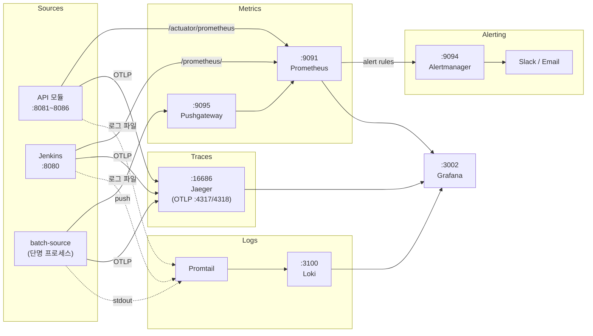

# Jenkins 및 Spring Batch APM 모니터링 설계서

## 1. 모니터링 아키텍처 개요

### 1.1 Observability 3축 + Alerting 스택 선정


| 축            | 선정 도구                              | 선정 근거                                                                                                            |
| ------------ | ---------------------------------- | ---------------------------------------------------------------------------------------------------------------- |
| **Metrics**  | Prometheus + Pushgateway + Grafana | 프로젝트에 `micrometer-registry-prometheus`와 `/actuator/prometheus` 엔드포인트가 이미 활성화 상태. Prometheus Pull 모델과 자연스럽게 연결됨   |
| **Traces**   | Jaeger (all-in-one)                | 프로젝트에 `spring-boot-starter-opentelemetry` 의존성이 이미 존재. Jaeger는 OTLP 프로토콜을 네이티브 지원하며, all-in-one 모드로 단일 컨테이너 실행 가능 |
| **Logs**     | Loki + Promtail                    | ELK 대비 리소스 사용량이 현저히 낮음 (인덱싱 대신 라벨 기반 검색). Grafana 네이티브 데이터 소스로 별도 UI 불필요                                         |
| **Alerting** | Alertmanager                       | Prometheus alert rules 네��티브 연동. 그룹핑, 디듀플리케이션, 라우팅 기본 지원                                                         |


**Pushgateway 필요 이유:**

batch-source는 `spring.main.web-application-type=none`으로 설정된 단명(short-lived) 프로세스입니다. Job 실행 완료 후 프로세스가 종료되므로 Prometheus의 Pull 방식으로는 메트릭을 수집할 수 없습니다. Prometheus 공식 문서에서 권장���는 표준 해결책이 Pushgateway입니다.

```
[단명 프로세스] --push→ [Pushgateway] ←pull-- [Prometheus]
```

> 참고: Prometheus 공식 문서 — "The Pushgateway is an intermediary service which allows you to push metrics from jobs which cannot be scraped." ([https://prometheus.io/docs/practices/pushing/](https://prometheus.io/docs/practices/pushing/))

### 1.2 데이터 흐름



> 다이어그램 렌더링: [mermaid.live](https://mermaid.live)에 위 코드를 붙여넣어 확인할 수 있습니다.

### 1.3 포트 할당 계획

기존 서비스와 충돌하지 않도록 모니터링 포트를 할당합니다.

**기존 사용 포트:**


| 포트        | 서비스                                    | 출처                           |
| --------- | -------------------------------------- | ---------------------------- |
| 3000      | Frontend app (Next.js)                 | tech-n-ai-frontend/app       |
| 3001      | Frontend admin (Next.js)               | tech-n-ai-frontend/admin     |
| 3307~3310 | MySQL (batch, auth, bookmark, chatbot) | docker-compose.yml           |
| 8080      | Jenkins                                | Homebrew jenkins-lts         |
| 8081~8086 | API 모듈 6개 (gateway~agent)              | tmux-backend.sh              |
| 9090      | Kafka UI                               | docker-compose.yml           |
| 9092      | Kafka (external listener)              | docker-compose.yml           |
| 9093      | Kafka (controller)                     | docker-compose.yml (호스트 매핑됨) |


**모니터링 포트 할당:**


| 서비스                | 포트    | 용도                    |
| ------------------ | ----- | --------------------- |
| Prometheus         | 9091  | 메트릭 저장/쿼리             |
| Grafana            | 3002  | 통합 시각화 대시보드           |
| Pushgateway        | 9095  | 단명 프로세스 메트릭 수신        |
| Jaeger UI          | 16686 | 트레이스 조회 UI            |
| Jaeger OTLP (gRPC) | 4317  | OpenTelemetry 트레이스 수신 |
| Jaeger OTLP (HTTP) | 4318  | OpenTelemetry 트레이스 수신 |
| Loki               | 3100  | 로그 수신/쿼리              |
| Alertmanager       | 9094  | 알림 관리                 |


> Grafana는 3000(Frontend app), 3001(Frontend admin)과의 충돌을 피해 **3002**를 사용합니다. Alertmanager는 9093(Kafka controller 호스트 매핑)과의 충돌을 피해 **9094**를 사용합니다.

---

## 2. 모니터링 인프라 구축

### 2.1 디렉토리 구조

프로젝트 루트 기준 모니터링 ���정 파일 위치:

```
tech-n-ai-backend/
├── docker-compose.yml                    # 기존 파일에 모니터링 서비스 추가
└── monitoring/
    ├── prometheus/
    │   ├── prometheus.yml                # Prometheus 메인 설정
    │   └── alert-rules.yml              # 알림 규칙
    ├── alertmanager/
    │   └── alertmanager.yml             # Alertmanager 설정
    ├── grafana/
    │   └── provisioning/
    │       ├── datasources/
    │       │   └── datasources.yml      # 데이터 소스 자동 등록
    │       └── dashboards/
    │           └── dashboards.yml        # 대시보드 프로비저닝
    ├── jaeger/
    │   └── jaeger-config.yml            # Jaeger 2.x 설정 (OTLP 수신, 인메모리 저장)
    ├── loki/
    │   └── loki-config.yml              # Loki 설정
    └── promtail/
        └── promtail-config.yml          # Promtail 설정
```

### 2.2 docker-compose 모니터링 서비스 추가

기존 `docker-compose.yml`의 `services:` 섹션 하단에 다음을 추가합니다.

> 기존 Kafka, MySQL 서비스는 그대로 유지합니다. 아래는 추가분만 표시합니다.

`docker-compose.yml` — 추가 서비스:

```yaml
  # ============================================================
  # Monitoring Stack
  # ============================================================

  prometheus:
    image: prom/prometheus:v3.4.0
    container_name: prometheus
    ports:
      - "9091:9090"                          # 호스트 9091 → 컨테이너 9090 (Kafka UI가 9090 사용)
    volumes:
      - ./monitoring/prometheus/prometheus.yml:/etc/prometheus/prometheus.yml:ro
      - ./monitoring/prometheus/alert-rules.yml:/etc/prometheus/alert-rules.yml:ro
      - prometheus-data:/prometheus
    command:
      - '--config.file=/etc/prometheus/prometheus.yml'
      - '--storage.tsdb.retention.time=7d'   # 로컬 환경: 7일 보존
      - '--web.enable-lifecycle'              # /-/reload API 활성화
    extra_hosts:
      - "host.docker.internal:host-gateway"  # ���테이너에서 호스트 접근 (macOS)
    networks:
      - monitoring-network
    restart: unless-stopped

  pushgateway:
    image: prom/pushgateway:v1.11.0
    container_name: pushgateway
    ports:
      - "9095:9091"                          # 호스트 9095 → 컨테이너 9091
    networks:
      - monitoring-network
    restart: unless-stopped

  alertmanager:
    image: prom/alertmanager:v0.28.1
    container_name: alertmanager
    ports:
      - "9094:9093"
    volumes:
      - ./monitoring/alertmanager/alertmanager.yml:/etc/alertmanager/alertmanager.yml:ro
    command:
      - '--config.file=/etc/alertmanager/alertmanager.yml'
    networks:
      - monitoring-network
    restart: unless-stopped

  jaeger:
    image: jaegertracing/jaeger:2.6.0
    container_name: jaeger
    ports:
      - "16686:16686"                        # Jaeger UI
      - "4317:4317"                          # OTLP gRPC
      - "4318:4318"                          # OTLP HTTP
    volumes:
      - ./monitoring/jaeger/jaeger-config.yml:/etc/jaeger/config.yaml:ro
    command: ["--config-file=/etc/jaeger/config.yaml"]
    networks:
      - monitoring-network
    restart: unless-stopped

  loki:
    image: grafana/loki:3.5.0
    container_name: loki
    ports:
      - "3100:3100"
    volumes:
      - ./monitoring/loki/loki-config.yml:/etc/loki/local-config.yaml:ro
      - loki-data:/loki
    command: -config.file=/etc/loki/local-config.yaml
    networks:
      - monitoring-network
    restart: unless-stopped

  promtail:
    image: grafana/promtail:3.5.0
    container_name: promtail
    volumes:
      - ./monitoring/promtail/promtail-config.yml:/etc/promtail/config.yml:ro
      - /var/log:/var/log:ro                                       # 시스템 로그
      - ${HOME}/.jenkins:/jenkins-home:ro                          # Jenkins 로그
      - ${HOME}/workspace/tech-n-ai/tech-n-ai-backend/logs:/app-logs:ro  # 앱 로그 (설정 시)
    command: -config.file=/etc/promtail/config.yml
    extra_hosts:
      - "host.docker.internal:host-gateway"
    networks:
      - monitoring-network
    restart: unless-stopped

  grafana:
    image: grafana/grafana:11.6.0
    container_name: grafana
    ports:
      - "3002:3000"                          # 호스트 3002 → 컨테이너 3000 (3000=Frontend app, 3001=admin)
    environment:
      GF_SECURITY_ADMIN_USER: admin
      GF_SECURITY_ADMIN_PASSWORD: admin
      GF_USERS_ALLOW_SIGN_UP: "false"
    volumes:
      - ./monitoring/grafana/provisioning:/etc/grafana/provisioning:ro
      - grafana-data:/var/lib/grafana
    depends_on:
      - prometheus
      - loki
      - jaeger
    networks:
      - monitoring-network
    restart: unless-stopped
```

`docker-compose.yml` — `networks:` 섹션에 추가:

```yaml
  monitoring-network:
    driver: bridge
```

`docker-compose.yml` — `volumes:` 섹션에 추가:

```yaml
  prometheus-data:
    driver: local
  loki-data:
    driver: local
  grafana-data:
    driver: local
```

### 2.3 Prometheus 설정

`monitoring/prometheus/prometheus.yml`:

```yaml
global:
  scrape_interval: 15s          # 기본 수집 주기
  evaluation_interval: 15s      # 알림 규칙 평가 주기

# Alertmanager 연동
alerting:
  alertmanagers:
    - static_configs:
        - targets:
            - alertmanager:9093       # 컨테이너 내부 포트 (Prometheus → Alertmanager 간 통신)

# 알림 규칙 파일
rule_files:
  - /etc/prometheus/alert-rules.yml

scrape_configs:
  # ─── Jenkins ───
  # Jenkins Prometheus Metrics Plugin이 노출하는 엔드포인트
  - job_name: 'jenkins'
    metrics_path: /prometheus/
    scheme: http
    static_configs:
      - targets: ['host.docker.internal:8080']
        labels:
          instance: 'jenkins-master'

  # ─── API 모듈 (Spring Boot Actuator) ───
  - job_name: 'spring-boot-api'
    metrics_path: /actuator/prometheus
    scrape_interval: 15s
    static_configs:
      - targets:
          - 'host.docker.internal:8081'   # gateway
          - 'host.docker.internal:8082'   # emerging-tech
          - 'host.docker.internal:8083'   # auth
          - 'host.docker.internal:8084'   # chatbot
          - 'host.docker.internal:8085'   # bookmark
          - 'host.docker.internal:8086'   # agent

  # ─── Pushgateway (batch-source 메트릭) ───
  - job_name: 'pushgateway'
    honor_labels: true           # push된 메트릭의 job/instance 라벨 ���존
    static_configs:
      - targets: ['pushgateway:9091']

  # ─── Prometheus 자체 메트릭 ───
  - job_name: 'prometheus'
    static_configs:
      - targets: ['localhost:9090']
```


| 설정                     | 값    | 설명                                                                            |
| ---------------------- | ---- | ----------------------------------------------------------------------------- |
| `scrape_interval`      | 15s  | Prometheus 기본 권장값. 로컬 환경에서 충분한 해상도                                            |
| `honor_labels`         | true | Pushgateway 전용. batch-source가 push한 `job`, `instance` 라벨을 Prometheus가 덮어쓰지 않음 |
| `host.docker.internal` | —    | Docker 컨테이너에서 macOS 호스트에 접근하기 위�� 특수 DNS                                      |


### 2.4 Jaeger 2.x 설정

Jaeger 2.x는 OpenTelemetry Collector 기반으로 아키텍처가 전면 변경되었습니다. v1의 `COLLECTOR_OTLP_ENABLED` 등 환경변수 방식은 더 이상 지원되지 않으며, YAML 설정 파일을 사용해야 합니다.

> 참고: Jaeger 공식 문서 — Configuration (https://www.jaegertracing.io/docs/2.6/configuration/)

`monitoring/jaeger/jaeger-config.yml`:

```yaml
receivers:
  otlp:
    protocols:
      grpc:
        endpoint: 0.0.0.0:4317
      http:
        endpoint: 0.0.0.0:4318

exporters:
  jaeger_storage_exporter:
    trace_storage: memstore

extensions:
  jaeger_storage:
    backends:
      memstore:
        memory:
          max_traces: 100000
  jaeger_query:
    storage:
      traces: memstore

service:
  extensions: [jaeger_storage, jaeger_query]
  pipelines:
    traces:
      receivers: [otlp]
      exporters: [jaeger_storage_exporter]
```

| 설정 | 설명 |
|---|---|
| `receivers.otlp` | gRPC(:4317)와 HTTP(:4318)로 OTLP 트레이스 수신 |
| `memstore` | 인메모리 저장. 로컬 테스트용으로 충분하며 재시작 시 데이터 소실 |
| `max_traces` | 보존할 최대 트레이스 수. 로컬 환경에서 100,000건이면 충분 |

### 2.5 Loki 설정

`monitoring/loki/loki-config.yml`:

```yaml
auth_enabled: false

server:
  http_listen_port: 3100

common:
  path_prefix: /loki
  storage:
    filesystem:
      chunks_directory: /loki/chunks
      rules_directory: /loki/rules
  replication_factor: 1
  ring:
    kvstore:
      store: inmemory

schema_config:
  configs:
    - from: "2024-01-01"
      store: tsdb
      object_store: filesystem
      schema: v13
      index:
        prefix: index_
        period: 24h

limits_config:
  retention_period: 168h         # 7일 보존
  allow_structured_metadata: true  # Promtail structured_metadata 스테이지 허용

compactor:
  working_directory: /loki/compactor
  compaction_interval: 10m
  retention_enabled: true
  delete_request_cancel_period: 10m
```

### 2.6 Promtail 설정

`monitoring/promtail/promtail-config.yml`:

```yaml
server:
  http_listen_port: 9080
  grpc_listen_port: 0

positions:
  filename: /tmp/positions.yaml

clients:
  - url: http://loki:3100/loki/api/v1/push

scrape_configs:
  # ─── Jenkins 로그 ───
  - job_name: jenkins
    static_configs:
      - targets:
          - localhost
        labels:
          job: jenkins
          __path__: /jenkins-home/logs/*.log

  # ─── 애플리케이션 로그 (파일 출력 활성화 시) ───
  - job_name: spring-boot-app
    static_configs:
      - targets:
          - localhost
        labels:
          job: spring-boot
          __path__: /app-logs/**/*.log
    pipeline_stages:
      # JSON 로그 파싱 (섹션 5에서 JSON 로그 포맷 설정 후 활성화)
      - json:
          expressions:
            level: level
            traceId: traceId
            spanId: spanId
            service: service
      - labels:
          level:
          service:
      # Trace ID를 derived field로 사���하기 위해 라벨이 아닌 structured metadata로 보존
      - structured_metadata:
          traceId:
          spanId:
```

### 2.7 Grafana 데이터 소스 프로비저닝

`monitoring/grafana/provisioning/datasources/datasources.yml`:

```yaml
apiVersion: 1

datasources:
  # ─── Metrics ───
  - name: Prometheus
    type: prometheus
    access: proxy
    url: http://prometheus:9090
    isDefault: true
    jsonData:
      timeInterval: '15s'

  # ─── Traces ───
  - name: Jaeger
    type: jaeger
    access: proxy
    url: http://jaeger:16686
    uid: jaeger
    jsonData:
      tracesToLogsV2:
        datasourceUid: loki
        filterByTraceID: true
        filterBySpanID: true

  # ─── Logs ───
  - name: Loki
    type: loki
    access: proxy
    url: http://loki:3100
    uid: loki
    jsonData:
      derivedFields:
        # 로그의 traceId 필드 → Jaeger 트레이스로 링크
        - datasourceUid: jaeger
          matcherRegex: '"traceId"\s*:\s*"(\w+)"'
          name: TraceID
          url: '$${__value.raw}'
```

> `tracesToLogsV2`와 `derivedFields` 설정으로 Grafana에서 Traces ↔ Logs 간 상관관계 탐색이 가능합니다.

### 2.8 Grafana 대시보드 프로비저닝

`monitoring/grafana/provisioning/dashboards/dashboards.yml`:

```yaml
apiVersion: 1

providers:
  - name: 'default'
    orgId: 1
    folder: ''
    type: file
    disableDeletion: false
    editable: true
    options:
      path: /var/lib/grafana/dashboards
      foldersFromFilesStructure: false
```

> 대시���드 JSON 파일은 섹션 7에서 설계한 후, 필요 시 Grafana에서 수동 생성하거나 JSON export 후 이 경로에 배치합니다.

---

## 3. 메트릭 수집 설정

### 3.1 Jenkins 메트릭

#### 플러그인 설치

경로: `Jenkins 관리` > `Plugins` > **Available plugins**


| 플러그인명                  | Plugin ID    | 용도                                                    |
| ---------------------- | ------------ | ----------------------------------------------------- |
| **Prometheus metrics** | `prometheus` | Jenkins 메트릭을 Prometheus 형식으로 `/prometheus/` 엔드포인트에 노출 |


설치 후 Jenkins 재시작: `brew services restart jenkins-lts`

#### 플러그인 설정

경로: `Jenkins 관리` > `System` > **Prometheus** 섹션


| 설정                                                  | 값     | 설명                                             |
| --------------------------------------------------- | ----- | ---------------------------------------------- |
| Collecting metrics period in seconds                | `15`  | 메트릭 수집 주기. Prometheus scrape_interval과 동일하게 설정 |
| Collect disk usage                                  | 체크    | Jenkins Home 디스크 사용량 수집                        |
| Count all successful/unstable/failed/aborted builds | 모두 체크 | 빌드 상태별 카운트 활성화                                 |
| Per build metrics                                   | 체크    | 빌드별 상세 메트릭 활성화                                 |


#### 설치 확인

```bash
curl -s http://localhost:8080/prometheus/ | head -20
```

`jenkins_` 접두사 메트릭이 출력되면 정상입니다.

#### 수집 가능 Jenkins 지표

Jenkins Prometheus Plugin이 노출하�� 주요 메트릭:


| 카테고리   | 메트릭명                                                      | 타입      | 설명                   |
| ------ | --------------------------------------------------------- | ------- | -------------------- |
| Job 성능 | `default_jenkins_builds_duration_milliseconds_summary`    | Summary | 빌드 소요 시간 (Job별)      |
| Job 성능 | `default_jenkins_builds_success_build_count`              | Counter | 성공 빌드 누적 수           |
| Job 성능 | `default_jenkins_builds_failed_build_count`               | Counter | 실패 빌드 누적 수           |
| Job 성능 | `default_jenkins_builds_last_build_duration_milliseconds` | Gauge   | 마지막 빌드 소요 시간         |
| 큐      | `default_jenkins_queue_size_value`                        | Gauge   | 현재 빌드 큐 대기 수         |
| 리소스    | `default_jenkins_vm_memory_heap_usage`                    | Gauge   | JVM Heap 사용률         |
| 리소스    | `default_jenkins_vm_memory_non_heap_usage`                | Gauge   | JVM Non-Heap 사용률     |
| 리소스    | `default_jenkins_vm_cpu_load`                             | Gauge   | CPU 사용률              |
| 시스템    | `default_jenkins_executors_available`                     | Gauge   | 가용 Executor 수        |
| 시스템    | `default_jenkins_executors_busy`                          | Gauge   | 활성 Executor 수        |
| 시스템    | `default_jenkins_up`                                      | Gauge   | Jenkins 가동 상태 (1=up) |


### 3.2 Spring Batch 메트릭

#### Micrometer 자동 계측

Spring Batch 5.0+ (현재 프로젝트: 6.0.2)은 Micrometer `ObservationRegistry`를 통해 다음 메트릭을 자동 노출합니다:


| 메트릭명                        | 타입            | 설명                                                                 |
| --------------------------- | ------------- | ------------------------------------------------------------------ |
| `spring.batch.job` (Timer)  | Timer         | Job 실행 시간. 태그: `spring.batch.job.name`, `status` (SUCCESS/FAILURE) |
| `spring.batch.job.active`   | LongTaskTimer | 현재 실행 중인 Job                                                       |
| `spring.batch.step` (Timer) | Timer         | Step 실행 시간. 태그: `spring.batch.step.name`, `status`                 |
| `spring.batch.item.read`    | Timer         | ItemReader 처리 시간                                                   |
| `spring.batch.item.process` | Timer         | ItemProcessor 처리 시간                                                |
| `spring.batch.chunk.write`  | Timer         | Chunk write 시간                                                     |


> 참고: Spring Batch 공�� 문서 — Monitoring and Metrics ([https://docs.spring.io/spring-batch/reference/monitoring-and-metrics.html](https://docs.spring.io/spring-batch/reference/monitoring-and-metrics.html))

**Read/Write/Skip 카운트**: Spring Batch의 Micrometer 자동 ��측에는 Step별 read/write/skip **카운트** 메트릭이 포함되지 않습니다. 이 카운트는 `StepExecution` 객체에 존재하지만 Micrometer로 자동 노출되지 않으므로, 필요 시 커스텀 `StepExecutionListener`로 Pushgateway에 push해야 합니다. 초기 구축에서는 자동 계측 메트릭만 사용하고, 운영 중 필요성이 확인되면 추가합니다.

#### JVM 메트릭 (자동 노출)

Spring Boot Actuator + Micrometer가 자동으로 노출하는 JVM 메트릭:


| 메트릭명                         | 설명                |
| ---------------------------- | ----------------- |
| `jvm_memory_used_bytes`      | JVM 메모리 사용량 (영역별) |
| `jvm_memory_max_bytes`       | JVM 최대 메모리 (영역별)  |
| `jvm_gc_pause_seconds`       | GC 일시정지 시간        |
| `jvm_gc_pause_seconds_count` | GC 발생 횟수          |
| `process_cpu_usage`          | 프로세스 CPU 사용률      |
| `system_cpu_usage`           | 시스템 전체 CPU 사용률    |


#### Pushgateway를 통한 단명 프로세스 메트릭 Push

batch-source는 `web-application-type=none`이므로 HTTP 서버가 기동되지 않습니다. Prometheus가 `/actuator/prometheus`를 Pull할 수 없으므로, 프로세스 종료 전에 Pushgateway로 메트릭을 Push해야 합니다.

**추가 의존성:**

`micrometer-registry-prometheus`만으로는 Pushgateway Push 기능이 제공되지 않습니다. Spring Boot 4.x에서는 Prometheus 새 클라이언트 라이브러리의 Pushgateway exporter가 필요합니다.

`batch/source/build.gradle`에 추가:

```groovy
runtimeOnly 'io.prometheus:prometheus-metrics-exporter-pushgateway'
```

> `io.prometheus:simpleclient_pushgateway`는 deprecated입니다. Spring Boot 4.x는 새 Prometheus 클라이언트(`io.prometheus:prometheus-metrics-*`)를 사용합니다.

**설정 추가:**

`batch/source/src/main/resources/application-local.yml`에 추가:

```yaml
management:
  prometheus:
    metrics:
      export:
        pushgateway:
          enabled: true
          address: localhost:9095             # host:port 형식 (http:// 접두사 없음)
          push-rate: 10s                      # Push 주기
          job: batch-source                   # Pushgateway에 표시될 Job명
          shutdown-operation: push            # 프로세스 종료 시 마지막 메트릭 Push
```

| 설정 | 값 | 설명 |
|---|---|---|
| `enabled` | `true` | Pushgateway Push 활성화 |
| `address` | `localhost:9095` | Pushgateway 주소. Spring Boot 4.x에서는 `base-url` 대신 `address` (host:port 형식) 사용 |
| `push-rate` | `10s` | 실행 중 메트릭 Push 주기 |
| `job` | `batch-source` | Pushgateway의 grouping key. Prometheus에서 `job="batch-source"` 라벨로 조회 |
| `shutdown-operation` | `push` | 종료 시 `push` (기존 메트릭 유지) 또는 `delete` (정리). 마지막 실행 결과를 보존하기 위해 `push` 선택 |


> `shutdown-operation: push`를 설정하면 Spring Boot의 Shutdown Hook에서 자동으로 마지막 메트릭을 Pushgateway에 push합니다. `System.exit()` 기반 종료에서도 동작합니다.

---

## 4. 분산 트레이싱 설정

### 4.1 Spring Boot OpenTelemetry 트���이스 export 활성화

프로젝트�� `spring-boot-starter-opentelemetry` 의존성이 이미 존재하므로, application 설정만 추가하면 트레이스가 자동 수집됩니다.

`common/core/src/main/resources/application-common-core.yml`에 추가:

```yaml
management:
  opentelemetry:
    tracing:
      export:
        otlp:
          endpoint: ${OTLP_TRACING_ENDPOINT:http://localhost:4318/v1/traces}
  tracing:
    sampling:
      probability: ${TRACING_SAMPLING_PROBABILITY:1.0}   # 로컬: 전수 수집
```

| 설정 | 값 | 설명 |
|---|---|---|
| `opentelemetry.tracing.export.otlp.endpoint` | `http://localhost:4318/v1/traces` | Jaeger OTLP HTTP 수신 엔드포인트 |
| `tracing.sampling.probability` | `1.0` | 1.0 = 100% 전수 수집. 프로덕션에서는 0.1~0.3 권장 |

> Spring Boot 4.0의 `spring-boot-starter-opentelemetry`는 `io.opentelemetry` SDK를 내장하며, `management.opentelemetry.tracing.export.otlp.endpoint` 설정만으로 OTLP HTTP exporter가 활성화됩니다. 별도의 `-javaagent` 설정이 불필요합니다.

**batch-source 추가 설정:**

batch-source는 `web-application-type=none`이지만 OpenTelemetry SDK는 HTTP 서버 ���무와 무관하게 동작합니다. Feign Client를 통한 내부 API 호출 시 자동으로 Span이 생성됩니다. 별도 추가 설정은 불필요합니다.

### 4.2 Jenkins Pipeline 트레이스 설정

Jenkins OpenTelemetry Plugin을 설치하면 Pipeline Stage별 Span이 자동 생성되어 Jaeger로 전송됩니다.

#### 플러그인 설치

경로: `Jenkins 관리` > `Plugins` > **Available plugins**


| 플러그인명             | Plugin ID       | 용도                                   |
| ----------------- | --------------- | ------------------------------------ |
| **OpenTelemetry** | `opentelemetry` | Pipeline 실행을 OpenTelemetry Trace로 변환 |


설치 후 Jenkins 재시작.

#### 플러그인 설정

경로: `Jenkins 관리` > `System` > **OpenTelemetry** 섹션


| 설정                                                          | 값                       | 설명                        |
| ----------------------------------------------------------- | ----------------------- | ------------------------- |
| OTLP Endpoint                                               | `http://localhost:4317` | Jaeger OTLP gRPC 엔드포인트    |
| Authentication                                              | No Authentication       | 로컬 환경이므로 인증 불필요           |
| Export OpenTelemetry configuration as environment variables | 체크                      | 빌드 프로세스에서 OTEL 환경변수 사용 가능 |
| Service name                                                | `jenkins`               | 트레이스에 표시될 서비스명            |


#### 자동 생성되는 트레이스 구조

```
Pipeline Run (Root Span)
├── Stage: Prepare Workspace
├── Stage: Git Checkout
├── Stage: Build JAR
└── Stage: Archive & Link
```

각 Stage가 독립적인 Span으로 생성되며, Jenkins Build URL, 파라미터, 결과가 Span attribute에 자동 포함됩니다.

### 4.3 수집되는 트레이스 범위


| 소스           | 자동 계측 범위                                            | 설정                                |
| ------------ | --------------------------------------------------- | --------------------------------- |
| API 모듈       | 수신 HTTP 요청, Feign Client 호출, JPA/JDBC, Redis, Kafka | OpenTelemetry 자동 계측 (starter에 포함) |
| batch-source | Feign Client → API 모듈 호출, JDBC, Kafka               | 동일                                |
| Jenkins      | Pipeline Stage별 Span                                | OpenTelemetry Plugin              |


---

## 5. 로그 집계 설정

### 5.1 로그 수집 전략


| 소스           | 현재 상태                           | 수집 방법                          |
| ------------ | ------------------------------- | ------------------------------ |
| API 모듈 (6개)  | tmux pane stdout                | **파일 로그 추가 출력** → Promtail이 수집 |
| batch-source | Jenkins Console Output (stdout) | **파일 로그 추가 출력** → Promtail이 수집 |
| Jenkins      | `~/.jenkins/logs/`              | Promtail이 직접 수집 (2.5 설정 완료)    |


API 모듈과 batch-source의 콘솔 출력은 유지하면서, Loki 수집을 위해 **파일 로그를 병행 출력**합니다.

### 5.2 Logback 설정 추가

현재 프로젝트에는 logback 설정 파일이 없으므로 (Spring Boot 기본 설정 사용 중), `common/core` 모듈에 logback 설정을 추가합니다.

`common/core/src/main/resources/logback-spring.xml`:

```xml
<?xml version="1.0" encoding="UTF-8"?>
<configuration>

    <springProperty scope="context" name="APP_NAME" source="spring.application.name" defaultValue="unknown"/>

    <!-- 콘솔 출력 (기존 동작 유지) -->
    <appender name="CONSOLE" class="ch.qos.logback.core.ConsoleAppender">
        <encoder>
            <pattern>%d{yyyy-MM-dd HH:mm:ss.SSS} [%thread] %-5level %logger{36} - %msg%n</pattern>
        </encoder>
    </appender>

    <!-- JSON 파일 출력 (Loki ���집용) -->
    <appender name="JSON_FILE" class="ch.qos.logback.core.rolling.RollingFileAppender">
        <file>${LOG_PATH:-logs}/${APP_NAME}.log</file>
        <rollingPolicy class="ch.qos.logback.core.rolling.TimeBasedRollingPolicy">
            <fileNamePattern>${LOG_PATH:-logs}/${APP_NAME}.%d{yyyy-MM-dd}.log</fileNamePattern>
            <maxHistory>7</maxHistory>
        </rollingPolicy>
        <encoder class="ch.qos.logback.classic.encoder.JsonEncoder"/>
    </appender>

    <!-- local 프로파일: 콘솔 + JSON 파일 -->
    <springProfile name="local">
        <root level="INFO">
            <appender-ref ref="CONSOLE"/>
            <appender-ref ref="JSON_FILE"/>
        </root>
    </springProfile>

    <!-- 그 외 프로파일: 콘솔만 (향후 환경별 조정) -->
    <springProfile name="!local">
        <root level="INFO">
            <appender-ref ref="CONSOLE"/>
        </root>
    </springProfile>

</configuration>
```


| 설정            | 설명                                                                                                 |
| ------------- | -------------------------------------------------------------------------------------------------- |
| `JsonEncoder` | Logback 1.5+에서 기본 제공하는 JSON 인코더. 별도 의존성 불필요                                                        |
| `LOG_PATH`    | Spring Boot의 `logging.file.path` 프로퍼티와 연동. 미설정 시 `logs/` 디렉��리 사용                                  |
| Trace ID 포함   | `spring-boot-starter-opentelemetry`가 MDC에 `traceId`, `spanId`를 자동 주입. `JsonEncoder`가 MDC 필드를 자동 포함 |


**로그 출력 경로 설정:**

`application-local.yml` (각 모듈 공통 또는 `common-core`):

```yaml
logging:
  file:
    path: ${user.home}/workspace/tech-n-ai/tech-n-ai-backend/logs
```

이 경로가 Promtail 볼륨 마운트(`/app-logs`)와 일치해야 합니다.

### 5.3 Traces ↔ Logs 상관관계

OpenTelemetry SDK가 MDC에 주입하는 `traceId`가 JSON 로그에 자동 포함됩니다:

```json
{
  "timestamp": "2026-04-12T10:30:00.123",
  "level": "INFO",
  "logger": "c.t.n.a.batch.source.job.RssJobConfig",
  "message": "RSS feed processing completed",
  "mdc": {
    "traceId": "abc123def456...",
    "spanId": "789ghi..."
  }
}
```

Grafana Loki 데이터 소스의 `derivedFields` 설정(2.7에서 구성)을 통해, 로그의 `traceId` �� Jaeger 트레이스 조회로 한 번의 클릭으로 이동할 수 있습니다.

---

## 6. 알림(Alerting) 설정

### 6.1 알림 규칙

`monitoring/prometheus/alert-rules.yml`:

```yaml
groups:
  - name: batch-source-alerts
    rules:
      # ─── Batch Job 실패 ───
      - alert: BatchJobFailed
        expr: increase(spring_batch_job_seconds_count{status="FAILURE"}[5m]) > 0
        for: 0m                              # 즉시 알림
        labels:
          severity: critical
        annotations:
          summary: "Batch Job 실패: {{ $labels.spring_batch_job_name }}"
          description: "Job {{ $labels.spring_batch_job_name }}이 FAILURE ��태로 종료. Pushgateway에서 수집된 메트릭 기준."

      # ─── Batch Job 장시간 실행 ───
      - alert: BatchJobSlowExecution
        expr: spring_batch_job_active_seconds_active_count > 0 and spring_batch_job_active_seconds_duration_sum > 1800
        for: 5m
        labels:
          severity: warning
        annotations:
          summary: "Batch Job 장시간 실행: {{ $labels.spring_batch_job_name }}"
          description: "Job {{ $labels.spring_batch_job_name }}이 30분 이상 실행 중."

  - name: jenkins-alerts
    rules:
      # ─── Jenkins 다운 ───
      - alert: JenkinsDown
        expr: up{job="jenkins"} == 0
        for: 2m                              # 2분간 지속 시 알림 (일시적 재시작 제외)
        labels:
          severity: critical
        annotations:
          summary: "Jenkins 프로세스 다운"
          description: "Jenkins 메트릭 수집이 2분 이상 실패. 프로���스 상태를 확인하세요."

      # ─── Jenkins 빌드 연속 실패 ───
      - alert: JenkinsBuildConsecutiveFailures
        expr: increase(default_jenkins_builds_failed_build_count{jenkins_job=~"batch-source.*"}[1h]) >= 3
        for: 0m
        labels:
          severity: warning
        annotations:
          summary: "Jenkins 빌드 연��� 실패: {{ $labels.jenkins_job }}"
          description: "{{ $labels.jenkins_job }}이 최근 1시간 내 3회 이상 실패."

  - name: resource-alerts
    rules:
      # ─── JVM 메모리 부족 ───
      - alert: HighJvmMemoryUsage
        expr: default_jenkins_vm_memory_heap_usage > 0.85
        for: 5m
        labels:
          severity: warning
        annotations:
          summary: "Jenkins JVM Heap 사용률 높음"
          description: "Jenkins Heap 사용률이 85%를 초과하여 5분간 지속. 현재: {{ $value | humanizePercentage }}"

      # ─── API 모듈 JVM 메모리 ───
      - alert: HighAppMemoryUsage
        expr: jvm_memory_used_bytes{area="heap"} / jvm_memory_max_bytes{area="heap"} > 0.85
        for: 5m
        labels:
          severity: warning
        annotations:
          summary: "{{ $labels.application }} Heap 사용률 높음"
          description: "{{ $labels.application }}의 Heap 사용률이 85% 초과. 현재: {{ $value | humanizePercentage }}"
```


| 알림                              | for | 근거                                                  |
| ------------------------------- | --- | --------------------------------------------------- |
| BatchJobFailed                  | 0m  | Batch Job 실패는 즉시 인지 필요                              |
| BatchJobSlowExecution           | 5m  | 일시적 지연과 구분하기 위한 대기                                  |
| JenkinsDown                     | 2m  | `brew services restart` 등 정상 재시작을 오탐으로 보내지 않기 위한 대기 |
| JenkinsBuildConsecutiveFailures | 0m  | 1시간 윈도우 내 집계이므로 추가 대기 불필요                           |
| HighJvmMemoryUsage              | 5m  | GC 후 회복 가능한 일시적 증가 제외                               |


### 6.2 Alertmanager 설정

`monitoring/alertmanager/alertmanager.yml`:

```yaml
global:
  resolve_timeout: 5m

route:
  receiver: 'default'
  group_by: ['alertname', 'severity']
  group_wait: 30s                # 같은 그룹의 알림을 30초간 모아서 발송
  group_interval: 5m             # 같은 그룹 재발송 간격
  repeat_interval: 4h            # 미해결 알림 반복 간격
  routes:
    # critical → 즉시 발송
    - matchers:
        - severity = "critical"
      receiver: 'slack-critical'
      group_wait: 10s
      repeat_interval: 1h

    # warning → 집계 후 발송
    - matchers:
        - severity = "warning"
      receiver: 'slack-warning'
      group_wait: 1m
      repeat_interval: 4h

receivers:
  - name: 'default'
    webhook_configs: []

  # Slack Incoming Webhook 사용 (로컬 테스트)
  - name: 'slack-critical'
    slack_configs:
      - api_url: '${SLACK_WEBHOOK_URL}'      # 환경변수로 주입
        channel: '#alerts-critical'
        title: '[CRITICAL] {{ .GroupLabels.alertname }}'
        text: '{{ range .Alerts }}{{ .Annotations.description }}{{ end }}'
        send_resolved: true

  - name: 'slack-warning'
    slack_configs:
      - api_url: '${SLACK_WEBHOOK_URL}'
        channel: '#alerts-warning'
        title: '[WARNING] {{ .GroupLabels.alertname }}'
        text: '{{ range .Alerts }}{{ .Annotations.description }}{{ end }}'
        send_resolved: true

# 동일 원인의 중복 알림 억제
inhibit_rules:
  - source_matchers:
      - severity = "critical"
    target_matchers:
      - severity = "warning"
    equal: ['alertname']
```

> **Slack Webhook URL 설정**: Alertmanager 컨테이너에 `SLACK_WEBHOOK_URL` 환경변수를 주입하거나, docker-compose에서 `.env` 파일로 관리합니다. Slack Incoming Webhook은 무료이며, 워크스페이스 > 앱 추가 > Incoming Webhooks에서 생성합니다.

> **Slack 없이 테스트**: Slack 미설정 시에도 Alertmanager UI(`http://localhost:9094`)에서 발생한 알림을 확인할 수 있습니다. `receivers`의 `slack_configs`를 제거하고 빈 `webhook_configs: []`로 두면 됩니다.

---

## 7. Grafana 대시보드 설계

### 7.1 Jenkins 대시보드


| 패널                 | 시각화 타입      | 쿼리                                                                                                                       |
| ------------------ | ----------- | ------------------------------------------------------------------------------------------------------------------------ |
| **Jenkins 상태**     | Stat        | `default_jenkins_up`                                                                                                     |
| **빌드 성공/실패 (24h)** | Stat        | `increase(default_jenkins_builds_success_build_count[24h])` / `increase(default_jenkins_builds_failed_build_count[24h])` |
| **빌드 소요 시간 추이**    | Time Series | `default_jenkins_builds_last_build_duration_milliseconds{jenkins_job=~"batch-source.*"} / 1000`                          |
| **빌드 큐 대기**        | Gauge       | `default_jenkins_queue_size_value`                                                                                       |
| **Executor 사용률**   | Gauge       | `default_jenkins_executors_busy / (default_jenkins_executors_busy + default_jenkins_executors_available)`                |
| **JVM Heap 사용률**   | Time Series | `default_jenkins_vm_memory_heap_usage`                                                                                   |
| **CPU 사용률**        | Time Series | `default_jenkins_vm_cpu_load`                                                                                            |


**Community 대시보드 참고**: Grafana Dashboard ID **9964** (Jenkins: Performance and Health Overview) — Jenkins Prometheus Plugin 기반. Import 후 프로젝트에 맞게 패널을 조정합니다.

### 7.2 Spring Batch 대시보드


| 패널               | 시각화 타입      | 쿼리                                                                                                      |
| ---------------- | ----------- | ------------------------------------------------------------------------------------------------------- |
| **최근 Job 실행 결과** | Stat        | `spring_batch_job_seconds_count{status="SUCCESS"}` / `spring_batch_job_seconds_count{status="FAILURE"}` |
| **Job 실행 시간 추이** | Time Series | `spring_batch_job_seconds_sum{spring_batch_job_name=~".+"}`                                             |
| **Step 실행 시간**   | Bar Gauge   | `spring_batch_step_seconds_sum` (Step별 그룹핑)                                                             |
| **JVM Heap 사용량** | Time Series | `jvm_memory_used_bytes{area="heap", job="batch-source"}`                                                 |
| **GC 일시정지**      | Time Series | `rate(jvm_gc_pause_seconds_sum{job="batch-source"}[5m])`                                                 |
| **GC 발생 횟수**     | Time Series | `rate(jvm_gc_pause_seconds_count{job="batch-source"}[5m])`                                               |
| **프로세스 CPU**     | Time Series | `process_cpu_usage{job="batch-source"}`                                                                  |


> Pushgateway를 통해 수집된 메트릭은 `job="batch-source"` 라벨로 필터링합니다 (`honor_labels: true` 설정으로 batch-source가 push한 라벨이 보존됨).

### 7.3 통합 Observability 뷰

Grafana에서 Metrics → Traces → Logs를 연결하는 탐색 흐름:

```
1. 대시보드에서 이상 감지
   └── Spring Batch 대시보드에서 Job 실행 시간 급증 확인

2. Explore > Jaeger 데이터 소스
   └── Service: batch-source, Operation: 해당 Job
   └── 해당 시점의 Trace 목록 조회
   └── 느린 Span 식별 (예: Feign Client → API 호출 지연)

3. Trace 상세 → Logs 탭 (또는 Span의 Logs 링크)
   └── traceId로 Loki 자동 쿼리
   └── 해당 요청의 전체 로그 확인 (에러 스택트���이스 등)
```

**Grafana 데이터 소스 간 상관관계 설정**은 2.7의 프로비저닝 파일에서 이미 구성되어 있습니다:


| 연결               | 설정 위치                           | 동작                                    |
| ---------------- | ------------------------------- | ------------------------------------- |
| Traces → Logs    | Jaeger 데이터 소스의 `tracesToLogsV2` | Jaeger에서 트레이스 조회 시 Loki 로그 자동 연결      |
| Logs → Traces    | Loki 데이터 소스의 `derivedFields`    | 로그의 traceId 클릭 시 Jaeger 트레이스로 이동      |
| Metrics → Traces | Grafana Explore에서 수동 탐색         | 대시보드에서 시간 범위 선택 → Explore에서 Jaeger 조회 |


---

## 부록. 실행 가이드

### 전체 스택 기동 순서

```bash
# 1. 모니터링 설정 파일 디렉토리 생성
mkdir -p monitoring/{prometheus,alertmanager,jaeger,grafana/provisioning/{datasources,dashboards},loki,promtail}

# 2. 위 섹션들의 설정 파일을 각 경로에 생성 (또는 Git에서 pull)

# 3. 로그 출력 디렉토리 생성
mkdir -p logs

# 4. docker-compose 전체 기동 (기존 Kafka, MySQL + 모니터링 스택)
docker-compose up -d

# 5. 서비스 상태 확인
docker-compose ps
```

### 접속 URL 목록


| 서비스          | URL                                              | 인증            |
| ------------ | ------------------------------------------------ | ------------- |
| Grafana      | http://localhost:3002   | admin / admin |
| Prometheus   | http://localhost:9091   | 없음            |
| Jaeger UI    | http://localhost:16686  | 없음            |
| Pushgateway  | http://localhost:9095   | 없음            |
| Alertmanager | http://localhost:9094   | 없음            |


### 확인 체크리스트


| 확인 항목                   | 방법                                                                               |
| ----------------------- | -------------------------------------------------------------------------------- |
| Prometheus target 수집 상태 | [http://localhost:9091/targets](http://localhost:9091/targets) — 모든 target이 `UP` |
| Jenkins 메트릭 노출          | `curl http://localhost:8080/prometheus/`                                         |
| API 모듈 메트�� 노출          | `curl http://localhost:8081/actuator/prometheus`                                 |
| Pushgateway 메트릭 존재      | [http://localhost:9095](http://localhost:9095) — batch-source 실행 후 메트릭 확인        |
| Jaeger 트레이스 수신          | [http://localhost:16686](http://localhost:16686) — Service 목록에 서비스 표시            |
| Loki 로그 수신              | Grafana > Explore > Loki > `{job="spring-boot"}` 쿼리                              |
| Alertmanager 연동         | Prometheus UI > Alerts 탭에서 규칙 상태 확인                                              |


