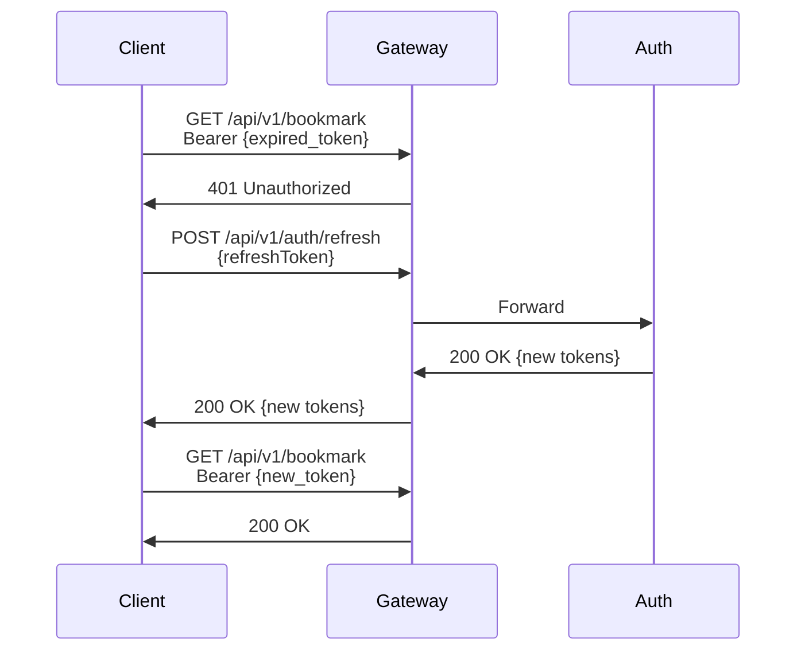
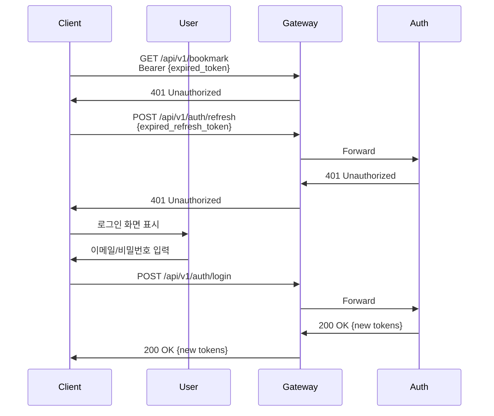

# API 정의서

**작성일**: 2026-01-21
**최종 업데이트**: 2026-01-29
**대상**: 웹/모바일 클라이언트 개발자
**버전**: v1

---

## 1. 개요

### Base URL

| 환경 | URL |
|-----|-----|
| Local | `http://localhost:8081` |
| Dev | `http://api-gateway-service:8081` |
| Beta | `http://api-gateway-service:8081` |
| Prod | `http://api-gateway-service:8081` |

### 인증

- **Type**: Bearer Token (JWT)
- **Header**: `Authorization: Bearer {access_token}`
- **Access Token 만료**: 3600초 (1시간)
- **Refresh Token 만료**: 1209600초 (14일)

### 공통 응답 형식

#### 성공 응답
```json
{
  "code": "2000",
  "messageCode": {
    "code": "SUCCESS",
    "text": "성공"
  },
  "message": "success",
  "data": {...}
}
```

#### 에러 응답
```json
{
  "code": "4001",
  "messageCode": {
    "code": "AUTH_FAILED",
    "text": "인증에 실패했습니다."
  }
}
```

> `message`와 `data` 필드는 `@JsonInclude(NON_NULL)`로 null일 경우 응답에서 제외됩니다.

### 공통 페이징 응답 형식

페이징이 필요한 목록 API는 `PageData<T>` 형식을 사용합니다.

```json
{
  "pageSize": 10,
  "pageNumber": 1,
  "totalPageNumber": 5,
  "totalSize": 50,
  "list": [...]
}
```

| 필드 | 타입 | 설명 |
|-----|------|------|
| `pageSize` | Integer | 페이지 크기 |
| `pageNumber` | Integer | 현재 페이지 번호 (1부터 시작) |
| `totalPageNumber` | Integer | 전체 페이지 수 |
| `totalSize` | Integer | 전체 데이터 수 |
| `list` | Array | 데이터 리스트 |

---

## 2. Gateway 정보

### 라우팅 규칙

| 경로 패턴 | 대상 서버 | 포트 | 인증 필요 |
|----------|---------|------|---------|
| `/api/v1/auth/**` | api-auth | 8082 | 불필요 |
| `/api/v1/bookmark/**` | api-bookmark | 8083 | **필요** |
| `/api/v1/chatbot/**` | api-chatbot | 8086 | **필요** |

### CORS 정책

#### Local 환경
- **Allowed Origins**: `http://localhost:*`, `http://127.0.0.1:*`
- **Allowed Methods**: `GET, POST, PUT, PATCH, DELETE, OPTIONS, HEAD`
- **Allowed Headers**: `*`
- **Allow Credentials**: `true`
- **Max Age**: `3600`

### 타임아웃 설정

- **Connection Timeout**: 30초
- **Response Timeout**: 60초

### 인증된 요청 시 추가 헤더

Gateway는 JWT 검증 성공 시 다음 헤더를 추가하여 백엔드 서버로 전달:

```
x-user-id: {userId}
x-user-email: {email}
x-user-role: {role}
Authorization: Bearer {token}
```

---

## 3. 인증 API (`/api/v1/auth`)

### 3.1 회원가입

**POST** `/api/v1/auth/signup`

**인증**: 불필요

**Request Body**

| 필드 | 타입 | 필수 | 검증 | 설명 |
|-----|------|------|------|------|
| `email` | String | O | 이메일 형식 | 이메일 주소 |
| `username` | String | O | 3~50자 | 사용자명 |
| `password` | String | O | 8자 이상, 대소문자/숫자/특수문자 중 2가지 이상 | 비밀번호 |

```json
{
  "email": "user@example.com",
  "username": "john_doe",
  "password": "securePassword123"
}
```

**Response** (200 OK) `ApiResponse<AuthResponse>`
```json
{
  "code": "2000",
  "messageCode": { "code": "SUCCESS", "text": "성공" },
  "message": "success",
  "data": {
    "userId": 1234567890123456789,
    "email": "user@example.com",
    "username": "john_doe",
    "message": "회원가입이 완료되었습니다. 이메일 인증을 완료해주세요."
  }
}
```

**Errors**
- `409` - 이메일 중복, 사용자명 중복
- `400` - 비밀번호 정책 위반, 유효성 검증 실패

---

### 3.2 로그인

**POST** `/api/v1/auth/login`

**인증**: 불필요

**Request Body**

| 필드 | 타입 | 필수 | 검증 | 설명 |
|-----|------|------|------|------|
| `email` | String | O | 이메일 형식 | 이메일 주소 |
| `password` | String | O | - | 비밀번호 |

```json
{
  "email": "user@example.com",
  "password": "securePassword123"
}
```

**Response** (200 OK) `ApiResponse<TokenResponse>`
```json
{
  "code": "2000",
  "messageCode": { "code": "SUCCESS", "text": "성공" },
  "message": "success",
  "data": {
    "accessToken": "eyJhbGciOiJIUzI1NiIs...",
    "refreshToken": "eyJhbGciOiJIUzI1NiIs...",
    "tokenType": "Bearer",
    "expiresIn": 3600,
    "refreshTokenExpiresIn": 1209600
  }
}
```

**Errors**
- `401` - 이메일 또는 비밀번호 불일치, 이메일 미인증

---

### 3.3 로그아웃

**POST** `/api/v1/auth/logout`

**인증**: 필요

**Request Body**

| 필드 | 타입 | 필수 | 설명 |
|-----|------|------|------|
| `refreshToken` | String | O | Refresh Token |

```json
{
  "refreshToken": "eyJhbGciOiJIUzI1NiIs..."
}
```

**Response** (200 OK) `ApiResponse<Void>`
```json
{
  "code": "2000",
  "messageCode": { "code": "SUCCESS", "text": "성공" },
  "message": "success"
}
```

**Errors**
- `401` - 인증 실패, Refresh Token 불일치

---

### 3.4 토큰 갱신

**POST** `/api/v1/auth/refresh`

**인증**: 불필요

**Request Body**

| 필드 | 타입 | 필수 | 설명 |
|-----|------|------|------|
| `refreshToken` | String | O | Refresh Token |

```json
{
  "refreshToken": "eyJhbGciOiJIUzI1NiIs..."
}
```

**Response** (200 OK) `ApiResponse<TokenResponse>`
```json
{
  "code": "2000",
  "messageCode": { "code": "SUCCESS", "text": "성공" },
  "message": "success",
  "data": {
    "accessToken": "eyJhbGciOiJIUzI1NiIs...",
    "refreshToken": "eyJhbGciOiJIUzI1NiIs...",
    "tokenType": "Bearer",
    "expiresIn": 3600,
    "refreshTokenExpiresIn": 1209600
  }
}
```

**Errors**
- `401` - Refresh Token 만료 또는 무효

---

### 3.5 이메일 인증

**GET** `/api/v1/auth/verify-email`

**인증**: 불필요

**Query Parameters**

| 파라미터 | 타입 | 필수 | 설명 |
|---------|------|------|------|
| `token` | String | O | 이메일 인증 토큰 |

```
GET /api/v1/auth/verify-email?token=abc123xyz
```

**Response** (200 OK) `ApiResponse<Void>`
```json
{
  "code": "2000",
  "messageCode": { "code": "SUCCESS", "text": "성공" },
  "message": "success"
}
```

**Errors**
- `400` - 토큰 만료, 토큰 무효, 중복 인증

---

### 3.6 비밀번호 재설정 요청

**POST** `/api/v1/auth/reset-password`

**인증**: 불필요

**Request Body**

| 필드 | 타입 | 필수 | 검증 | 설명 |
|-----|------|------|------|------|
| `email` | String | O | 이메일 형식 | 이메일 주소 |

```json
{
  "email": "user@example.com"
}
```

**Response** (200 OK) `ApiResponse<Void>`
```json
{
  "code": "2000",
  "messageCode": { "code": "SUCCESS", "text": "성공" },
  "message": "success"
}
```

> 보안상 존재하지 않는 이메일도 동일한 성공 응답을 반환합니다.

---

### 3.7 비밀번호 재설정 확인

**POST** `/api/v1/auth/reset-password/confirm`

**인증**: 불필요

**Request Body**

| 필드 | 타입 | 필수 | 검증 | 설명 |
|-----|------|------|------|------|
| `token` | String | O | - | 비밀번호 재설정 토큰 |
| `newPassword` | String | O | 8자 이상, 대소문자/숫자/특수문자 중 2가지 이상 | 새 비밀번호 |

```json
{
  "token": "reset-token-123",
  "newPassword": "newSecurePassword123"
}
```

**Response** (200 OK) `ApiResponse<Void>`
```json
{
  "code": "2000",
  "messageCode": { "code": "SUCCESS", "text": "성공" },
  "message": "success"
}
```

**Errors**
- `400` - 토큰 만료, 토큰 무효, 비밀번호 정책 위반, 이전 비밀번호와 동일

---

### 3.8 OAuth 로그인 시작

**GET** `/api/v1/auth/oauth2/{provider}`

**인증**: 불필요

**Path Parameters**

| 파라미터 | 타입 | 설명 |
|---------|------|------|
| `provider` | String | OAuth 제공자 (`google`, `naver`, `kakao`) |

```
GET /api/v1/auth/oauth2/google
```

**Response** (302 Redirect)

OAuth 제공자 인증 페이지로 리다이렉트합니다.

**Errors**
- `400` - 지원하지 않는 OAuth 제공자

---

### 3.9 OAuth 로그인 콜백

**GET** `/api/v1/auth/oauth2/{provider}/callback`

**인증**: 불필요

**Path Parameters**

| 파라미터 | 타입 | 설명 |
|---------|------|------|
| `provider` | String | OAuth 제공자 (`google`, `naver`, `kakao`) |

**Query Parameters**

| 파라미터 | 타입 | 필수 | 설명 |
|---------|------|------|------|
| `code` | String | O | OAuth 인증 코드 |
| `state` | String | X | CSRF 방지 상태 토큰 |

```
GET /api/v1/auth/oauth2/google/callback?code=auth_code_123&state=state_token_456
```

**Response** (200 OK) `ApiResponse<TokenResponse>`
```json
{
  "code": "2000",
  "messageCode": { "code": "SUCCESS", "text": "성공" },
  "message": "success",
  "data": {
    "accessToken": "eyJhbGciOiJIUzI1NiIs...",
    "refreshToken": "eyJhbGciOiJIUzI1NiIs...",
    "tokenType": "Bearer",
    "expiresIn": 3600,
    "refreshTokenExpiresIn": 1209600
  }
}
```

**Errors**
- `401` - State 토큰 불일치, OAuth 인증 실패

---

### 3.10 회원 탈퇴

**DELETE** `/api/v1/auth/me`

**인증**: 필요

**Request Body** (선택)

| 필드 | 타입 | 필수 | 검증 | 설명 |
|-----|------|------|------|------|
| `password` | String | X | 8~100자 | 비밀번호 확인 (보안 강화용) |
| `reason` | String | X | 500자 이하 | 탈퇴 사유 |

```json
{
  "password": "securePassword123",
  "reason": "서비스 불만족"
}
```

> Request Body는 선택적입니다. 본문 없이 호출 가능합니다.

**Response** (200 OK) `ApiResponse<Void>`
```json
{
  "code": "2000",
  "messageCode": { "code": "SUCCESS", "text": "성공" },
  "message": "success"
}
```

**Errors**
- `401` - 인증 실패
- `404` - 사용자 없음
- `409` - 이미 탈퇴한 사용자

---

> Contest/News 수집 기능 폐기로 Contest API (Section 4) 및 News API (Section 5) 삭제됨

---

## 4. Chatbot API (`/api/v1/chatbot`)

> 모든 Chatbot API는 **JWT 인증이 필요**합니다. Gateway에서 JWT 검증 후 `x-user-id` 헤더를 주입합니다.

### 4.1 채팅 메시지 전송

**POST** `/api/v1/chatbot`

**인증**: 필요

**Request Body**

| 필드 | 타입 | 필수 | 검증 | 설명 |
|-----|------|------|------|------|
| `message` | String | O | NotBlank, 최대 500자 | 사용자 메시지 |
| `conversationId` | String | X | - | 세션 ID (없으면 새 세션 생성) |

```json
{
  "message": "최근 AI 관련 대회는 뭐가 있어?",
  "conversationId": "507f1f77bcf86cd799439011"
}
```

**Response** (200 OK) `ApiResponse<ChatResponse>`
```json
{
  "code": "2000",
  "messageCode": { "code": "SUCCESS", "text": "성공" },
  "message": "success",
  "data": {
    "response": "최근 AI 관련 대회로는 Kaggle Competition 2026...",
    "conversationId": "507f1f77bcf86cd799439011",
    "sources": [
      {
        "documentId": "507f1f77bcf86cd799439012",
        "collectionType": "contests",
        "score": 0.92,
        "title": "Kaggle Competition 2026",
        "url": "https://kaggle.com/c/competition-2026"
      }
    ]
  }
}
```

**ChatResponse 필드**

| 필드 | 타입 | 설명 |
|-----|------|------|
| `response` | String | 챗봇 응답 텍스트 |
| `conversationId` | String | 대화 세션 ID |
| `sources` | SourceResponse[] | 참조 소스 목록 |

**SourceResponse 필드**

| 필드 | 타입 | 설명 |
|-----|------|------|
| `documentId` | String | 문서 ID |
| `collectionType` | String | 컬렉션 타입 (contests, news 등) |
| `score` | Double | 관련도 점수 |
| `title` | String | 문서 제목 (웹 검색 결과용) |
| `url` | String | 문서 URL (웹 검색 결과용) |

---

### 4.2 대화 세션 목록 조회

**GET** `/api/v1/chatbot/sessions`

**인증**: 필요

**Query Parameters**

| 파라미터 | 타입 | 필수 | 기본값 | 검증 | 설명 |
|---------|------|------|-------|------|------|
| `page` | Integer | X | 1 | min: 1 | 페이지 번호 |
| `size` | Integer | X | 20 | min: 1, max: 100 | 페이지 크기 |

```
GET /api/v1/chatbot/sessions?page=1&size=20
```

**Response** (200 OK) `ApiResponse<Page<SessionResponse>>`
```json
{
  "code": "2000",
  "messageCode": { "code": "SUCCESS", "text": "성공" },
  "message": "success",
  "data": {
    "content": [
      {
        "sessionId": "507f1f77bcf86cd799439011",
        "title": "AI 대회 관련 질문",
        "createdAt": "2026-01-29T10:00:00",
        "lastMessageAt": "2026-01-29T10:05:00",
        "isActive": true
      }
    ],
    "pageable": { ... },
    "totalPages": 3,
    "totalElements": 25,
    "size": 20,
    "number": 0,
    "first": true,
    "last": false,
    "empty": false
  }
}
```

> 정렬: `lastMessageAt` 내림차순 (최근 활동 순)

**SessionResponse 필드**

| 필드 | 타입 | 설명 |
|-----|------|------|
| `sessionId` | String | 세션 ID |
| `title` | String | 대화 제목 |
| `createdAt` | LocalDateTime | 생성일시 |
| `lastMessageAt` | LocalDateTime | 마지막 메시지 일시 |
| `isActive` | Boolean | 활성 여부 |

---

### 4.3 대화 세션 상세 조회

**GET** `/api/v1/chatbot/sessions/{sessionId}`

**인증**: 필요

**Path Parameters**

| 파라미터 | 타입 | 설명 |
|---------|------|------|
| `sessionId` | String | 세션 ID |

```
GET /api/v1/chatbot/sessions/507f1f77bcf86cd799439011
```

**Response** (200 OK) `ApiResponse<SessionResponse>`
```json
{
  "code": "2000",
  "messageCode": { "code": "SUCCESS", "text": "성공" },
  "message": "success",
  "data": {
    "sessionId": "507f1f77bcf86cd799439011",
    "title": "AI 대회 관련 질문",
    "createdAt": "2026-01-29T10:00:00",
    "lastMessageAt": "2026-01-29T10:05:00",
    "isActive": true
  }
}
```

**Errors**
- `404` - 세션 없음

---

### 4.4 대화 메시지 목록 조회

**GET** `/api/v1/chatbot/sessions/{sessionId}/messages`

**인증**: 필요

**Path Parameters**

| 파라미터 | 타입 | 설명 |
|---------|------|------|
| `sessionId` | String | 세션 ID |

**Query Parameters**

| 파라미터 | 타입 | 필수 | 기본값 | 검증 | 설명 |
|---------|------|------|-------|------|------|
| `page` | Integer | X | 1 | min: 1 | 페이지 번호 |
| `size` | Integer | X | 50 | min: 1, max: 100 | 페이지 크기 |

```
GET /api/v1/chatbot/sessions/507f1f77bcf86cd799439011/messages?page=1&size=50
```

**Response** (200 OK) `ApiResponse<Page<MessageResponse>>`
```json
{
  "code": "2000",
  "messageCode": { "code": "SUCCESS", "text": "성공" },
  "message": "success",
  "data": {
    "content": [
      {
        "messageId": "507f1f77bcf86cd799439013",
        "sessionId": "507f1f77bcf86cd799439011",
        "role": "USER",
        "content": "최근 AI 관련 대회는 뭐가 있어?",
        "tokenCount": 15,
        "sequenceNumber": 1,
        "createdAt": "2026-01-29T10:00:00"
      },
      {
        "messageId": "507f1f77bcf86cd799439014",
        "sessionId": "507f1f77bcf86cd799439011",
        "role": "ASSISTANT",
        "content": "최근 AI 관련 대회로는...",
        "tokenCount": 120,
        "sequenceNumber": 2,
        "createdAt": "2026-01-29T10:00:05"
      }
    ],
    "pageable": { ... },
    "totalPages": 1,
    "totalElements": 2,
    "size": 50,
    "number": 0,
    "first": true,
    "last": true,
    "empty": false
  }
}
```

> 정렬: `sequenceNumber` 오름차순 (시간순)

**MessageResponse 필드**

| 필드 | 타입 | 설명 |
|-----|------|------|
| `messageId` | String | 메시지 ID |
| `sessionId` | String | 세션 ID |
| `role` | String | 역할 (`USER`, `ASSISTANT`) |
| `content` | String | 메시지 내용 |
| `tokenCount` | Integer | 토큰 수 |
| `sequenceNumber` | Integer | 메시지 순번 |
| `createdAt` | LocalDateTime | 생성일시 |

**Errors**
- `404` - 세션 없음

---

### 4.5 대화 세션 삭제

**DELETE** `/api/v1/chatbot/sessions/{sessionId}`

**인증**: 필요

**Path Parameters**

| 파라미터 | 타입 | 설명 |
|---------|------|------|
| `sessionId` | String | 세션 ID |

```
DELETE /api/v1/chatbot/sessions/507f1f77bcf86cd799439011
```

**Response** (200 OK) `ApiResponse<Void>`
```json
{
  "code": "2000",
  "messageCode": { "code": "SUCCESS", "text": "성공" },
  "message": "success"
}
```

**Errors**
- `404` - 세션 없음

---

## 5. 토큰 갱신 플로우

### 시나리오 1: Access Token 만료



### 시나리오 2: Refresh Token도 만료



---

## 6. 에러 코드

### HTTP 상태 코드

| 상태 코드 | 에러 코드 | 설명 |
|---------|---------|------|
| 400 | `4000` | 잘못된 요청 |
| 401 | `4001` | 인증 실패 |
| 403 | `4003` | 권한 없음 |
| 404 | `4004` | 리소스 없음 |
| 409 | `4009` | 리소스 충돌 |
| 500 | `5000` | 서버 내부 오류 |
| 502 | `5002` | 백엔드 서버 연결 실패 |
| 504 | `5004` | 백엔드 서버 타임아웃 |

### 인증 관련 에러 메시지

| 에러 코드 | 메시지 |
|---------|--------|
| `AUTH_FAILED` | 인증에 실패했습니다. |
| `INVALID_TOKEN` | 유효하지 않은 토큰입니다. |
| `TOKEN_EXPIRED` | 토큰이 만료되었습니다. |
| `EMAIL_NOT_VERIFIED` | 이메일 인증이 필요합니다. |
| `EMAIL_ALREADY_EXISTS` | 이미 존재하는 이메일입니다. |
| `USERNAME_ALREADY_EXISTS` | 이미 존재하는 사용자명입니다. |
| `PASSWORD_POLICY_VIOLATION` | 비밀번호 정책을 충족하지 않습니다. |
| `INVALID_CREDENTIALS` | 이메일 또는 비밀번호가 일치하지 않습니다. |

---

## 부록 A. 비밀번호 정책

- **최소 길이**: 8자
- **필수 포함**: 대소문자/숫자/특수문자 중 2가지 이상

---

## 부록 B. 전체 엔드포인트 요약

| Method | Endpoint | 인증 | 설명 |
|--------|----------|------|------|
| POST | `/api/v1/auth/signup` | X | 회원가입 |
| POST | `/api/v1/auth/login` | X | 로그인 |
| POST | `/api/v1/auth/logout` | O | 로그아웃 |
| POST | `/api/v1/auth/refresh` | X | 토큰 갱신 |
| GET | `/api/v1/auth/verify-email` | X | 이메일 인증 |
| POST | `/api/v1/auth/reset-password` | X | 비밀번호 재설정 요청 |
| POST | `/api/v1/auth/reset-password/confirm` | X | 비밀번호 재설정 확인 |
| GET | `/api/v1/auth/oauth2/{provider}` | X | OAuth 로그인 시작 |
| GET | `/api/v1/auth/oauth2/{provider}/callback` | X | OAuth 콜백 |
| DELETE | `/api/v1/auth/me` | O | 회원 탈퇴 |
| POST | `/api/v1/chatbot` | O | 채팅 메시지 전송 |
| GET | `/api/v1/chatbot/sessions` | O | 세션 목록 |
| GET | `/api/v1/chatbot/sessions/{sessionId}` | O | 세션 상세 |
| GET | `/api/v1/chatbot/sessions/{sessionId}/messages` | O | 메시지 목록 |
| DELETE | `/api/v1/chatbot/sessions/{sessionId}` | O | 세션 삭제 |

---

**문서 버전**: 2.0
**최종 업데이트**: 2026-01-29
