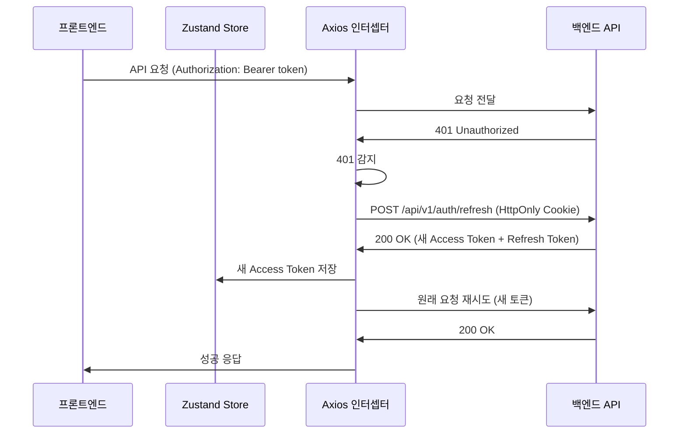

# 프론트엔드 웹앱 개발 설계서

**작성 일시**: 2026-01-21  
**대상**: 프론트엔드 개발팀  
**버전**: v1

## 목차

1. [개요](#1-개요)
2. [프레임워크 선택 및 기술 스택](#2-프레임워크-선택-및-기술-스택)
3. [프로토타입 설계 (9개 인증 API 우선 연동)](#3-프로토타입-설계-9개-인증-api-우선-연동)
4. [JWT 토큰 관리](#4-jwt-토큰-관리)
5. [API 클라이언트 구현](#5-api-클라이언트-구현)
6. [폴더 구조 및 파일 구성](#6-폴더-구조-및-파일-구성)
7. [라우팅 설계](#7-라우팅-설계)
8. [에러 처리 전략](#8-에러-처리-전략)
9. [보안 고려사항](#9-보안-고려사항)
10. [구현 가이드](#10-구현-가이드)
11. [참고 자료](#11-참고-자료)

---

## 1. 개요

### 1.1 프로젝트 배경

현재 프로젝트는 Java 21 + Spring Boot 4.0.1 기반의 백엔드 API 서버가 완성되어 있습니다. Spring Security + JWT 기반 인증 시스템, API Gateway, CQRS 패턴이 모두 구축된 상태입니다.

**백엔드 기술 스택**:
- Java 21, Spring Boot 4.0.1, Spring Security 6.x
- Aurora MySQL (Command Side), MongoDB Atlas (Query Side)
- JWT 인증 (Access Token 1시간, Refresh Token 7일)
- Spring Cloud Gateway (포트 8081)

### 1.2 설계서 목적

이 설계서는 백엔드 API와 연동할 프론트엔드 웹 애플리케이션의 기술 스택 선정, 아키텍처 설계, 구현 가이드를 제공합니다.

**주요 목적**:
1. 프레임워크 선정 (Next.js, React, Vue 중 선택)
2. 9개 인증 API 엔드포인트 우선 연동 프로토타입 설계
3. 클린코드, SOLID 원칙, 프론트엔드 베스트프랙티스 준수

### 1.3 참고 문서

- `docs/API-SPECIFICATION.md`: 백엔드 API 명세
- `docs/step6/spring-security-auth-design-guide.md`: Spring Security 인증 설계
- `docs/step14/gateway-design.md`: API Gateway 설계
- `docs/step2/1. api-endpoint-design.md`: API 엔드포인트 설계

---

## 2. 프레임워크 선택 및 기술 스택

### 2.1 프레임워크 비교

| 항목 | Next.js 15 | React 19 | Vue 3 |
|-----|-----------|----------|-------|
| **SSR/SSG 지원** | ✅ App Router | ❌ (별도 프레임워크 필요) | ❌ (Nuxt.js 필요) |
| **TypeScript 지원** | ✅ 공식 지원 | ✅ 공식 지원 | ✅ 공식 지원 |
| **REST API 연동** | ✅ 우수 | ✅ 우수 | ✅ 우수 |
| **JWT 인증 지원** | ✅ Middleware 지원 | ✅ Context API | ✅ Composables |
| **라우팅** | ✅ 파일 기반 (App Router) | ❌ React Router 별도 설치 | ❌ Vue Router 별도 설치 |
| **개발 생산성** | ⭐⭐⭐⭐⭐ | ⭐⭐⭐⭐ | ⭐⭐⭐⭐ |
| **커뮤니티** | ⭐⭐⭐⭐⭐ (React 생태계) | ⭐⭐⭐⭐⭐ | ⭐⭐⭐⭐ |
| **학습 곡선** | 중간 | 중간 | 낮음 |
| **Docker 컨테이너화** | ✅ 우수 | ✅ 우수 | ✅ 우수 |
| **번들 크기** | 중간 | 작음 | 작음 |

### 2.2 선정된 프레임워크: Next.js 15

**선정 근거**:

1. **SSR/SSG 지원**: SEO 최적화 및 초기 로딩 속도 개선 가능
2. **파일 기반 라우팅**: 별도 라우터 설정 없이 폴더 구조로 라우팅 자동 생성
3. **Middleware 지원**: JWT 토큰 검증을 위한 라우트 가드 구현 용이
4. **TypeScript 기본 지원**: 타입 안전성 확보
5. **React 생태계**: 풍부한 라이브러리 생태계 활용 가능
6. **공식 문서 우수**: Next.js 공식 문서(https://nextjs.org/docs)가 매우 상세하고 최신

**선정 버전**: Next.js 15.1.0 (2026년 1월 기준 최신 안정 버전)

### 2.3 핵심 라이브러리

#### 2.3.1 필수 라이브러리

| 분류 | 라이브러리 | 버전 | 용도 |
|-----|----------|------|------|
| **API 클라이언트** | Axios | ^1.7.0 | HTTP 요청, 인터셉터 지원 |
| **API 요청 관리** | TanStack Query v5 | ^5.60.0 | 서버 상태 관리, 캐싱, 자동 재시도 |
| **상태 관리** | Zustand | ^5.0.0 | 전역 상태 관리 (인증 상태, 사용자 정보) |
| **폼 관리** | React Hook Form | ^7.53.0 | 폼 유효성 검증, 에러 처리 |
| **UI 프레임워크** | Tailwind CSS | ^3.4.0 | 유틸리티 기반 CSS |
| **아이콘** | Lucide React | ^0.460.0 | 경량 아이콘 라이브러리 |
| **토스트 알림** | React Hot Toast | ^2.4.0 | 에러/성공 메시지 표시 |

#### 2.3.2 선정 근거

1. **Axios**: Fetch API 대비 인터셉터, 자동 JSON 변환, 타임아웃 지원 우수
2. **TanStack Query**: API 요청 캐싱, 자동 재시도, 낙관적 업데이트 지원
3. **Zustand**: Redux보다 단순한 API, TypeScript 타입 안전성 우수
4. **React Hook Form**: 비제어 컴포넌트 방식으로 성능 우수
5. **Tailwind CSS**: 빠른 개발 속도, 일관된 디자인 시스템

### 2.4 TypeScript 설정

**tsconfig.json**:
```json
{
  "compilerOptions": {
    "target": "ES2022",
    "lib": ["ES2022", "DOM", "DOM.Iterable"],
    "jsx": "preserve",
    "module": "ESNext",
    "moduleResolution": "bundler",
    "strict": true,
    "noUncheckedIndexedAccess": true,
    "esModuleInterop": true,
    "skipLibCheck": true,
    "forceConsistentCasingInFileNames": true,
    "paths": {
      "@/*": ["./src/*"]
    }
  }
}
```

**타입 안전성 확보 방안**:
- `strict: true`: 엄격한 타입 검사
- `noUncheckedIndexedAccess: true`: 배열/객체 접근 시 undefined 체크 강제
- API 응답 타입 정의: `ApiResponse<T>` 제네릭 타입 활용

---

## 3. 프로토타입 설계 (9개 인증 API 우선 연동)

### 3.1 페이지 목록

| 경로 | 컴포넌트 | 인증 필요 | 설명 |
|-----|---------|---------|------|
| `/` | `page.tsx` | ✅ | 메인 페이지 (로그인 후 접근) |
| `/login` | `login/page.tsx` | ❌ | 로그인 페이지 |
| `/signup` | `signup/page.tsx` | ❌ | 회원가입 페이지 |
| `/verify-email` | `verify-email/page.tsx` | ❌ | 이메일 인증 페이지 |
| `/reset-password` | `reset-password/page.tsx` | ❌ | 비밀번호 재설정 요청 |
| `/reset-password/confirm` | `reset-password/confirm/page.tsx` | ❌ | 비밀번호 재설정 확인 |
| `/auth/callback/[provider]` | `auth/callback/[provider]/page.tsx` | ❌ | OAuth 콜백 페이지 |

### 3.2 회원가입 페이지

**API 엔드포인트**: `POST /api/v1/auth/signup`

**UI 구성**:
```
┌────────────────────────────────┐
│      회원가입                    │
├────────────────────────────────┤
│ 이메일: [_________________]      │
│ 사용자명: [_________________]    │
│ 비밀번호: [_________________]    │
│                                │
│ [회원가입]                       │
│                                │
│ 이미 계정이 있으신가요? [로그인]      │
└───────────────────────────────┘
```

**유효성 검증**:
- 이메일: RFC 5322 형식 검증
- 비밀번호: 최소 8자, 대소문자/숫자/특수문자 중 2가지 이상

**에러 처리**:
- `400`: 이메일 중복, 사용자명 중복, 비밀번호 정책 위반
- `500`: 서버 오류

**성공 처리**:
- 토스트 메시지: "회원가입이 완료되었습니다. 이메일 인증을 완료해주세요."
- 로그인 페이지로 이동

### 3.3 로그인 페이지

**API 엔드포인트**: `POST /api/v1/auth/login`

**UI 구성**:
```
┌─────────────────────────────────┐
│      로그인                      │
├─────────────────────────────────┤
│ 이메일: [_________________]     │
│ 비밀번호: [_________________]   │
│                                 │
│ [로그인]                        │
│                                 │
│ ─────── 또는 ───────           │
│                                 │
│ [Google로 로그인]               │
│ [GitHub로 로그인]               │
│ [Kakao로 로그인]                │
│ [Naver로 로그인]                │
│                                 │
│ [비밀번호를 잊으셨나요?]         │
│ [회원가입]                      │
└─────────────────────────────────┘
```

**에러 처리**:
- `401`: 이메일/비밀번호 불일치, 이메일 미인증

**성공 처리**:
- Access Token, Refresh Token 저장
- 메인 페이지(`/`)로 리다이렉트

### 3.4 이메일 인증 페이지

**API 엔드포인트**: `GET /api/v1/auth/verify-email?token=xxx`

**동작 흐름**:
1. URL 쿼리 파라미터에서 `token` 추출
2. 페이지 로드 시 자동으로 인증 API 호출
3. Loading 스피너 표시
4. 성공/실패 메시지 표시

**UI 구성** (성공):
```
┌─────────────────────────────────┐
│      이메일 인증 완료            │
├─────────────────────────────────┤
│ ✅ 이메일 인증이 완료되었습니다. │
│                                 │
│ [로그인하기]                    │
└─────────────────────────────────┘
```

**UI 구성** (실패):
```
┌─────────────────────────────────┐
│      이메일 인증 실패            │
├─────────────────────────────────┤
│ ❌ 유효하지 않거나 만료된       │
│    토큰입니다.                  │
│                                 │
│ [홈으로 돌아가기]               │
└─────────────────────────────────┘
```

### 3.5 비밀번호 재설정 요청 페이지

**API 엔드포인트**: `POST /api/v1/auth/reset-password`

**UI 구성**:
```
┌─────────────────────────────────┐
│   비밀번호 재설정 요청           │
├─────────────────────────────────┤
│ 이메일: [_________________]     │
│                                 │
│ [재설정 이메일 발송]            │
│                                 │
│ [로그인으로 돌아가기]           │
└─────────────────────────────────┘
```

**성공 처리**:
- 토스트 메시지: "비밀번호 재설정 이메일이 발송되었습니다."
- 로그인 페이지로 이동

### 3.6 비밀번호 재설정 확인 페이지

**API 엔드포인트**: `POST /api/v1/auth/reset-password/confirm`

**동작 흐름**:
1. URL 쿼리 파라미터에서 `token` 추출
2. 새 비밀번호 입력 폼 표시
3. 비밀번호 정책 검증
4. API 호출

**UI 구성**:
```
┌─────────────────────────────────┐
│   비밀번호 재설정                │
├─────────────────────────────────┤
│ 새 비밀번호: [_________________]│
│ 비밀번호 확인: [_______________]│
│                                 │
│ [비밀번호 변경]                 │
└─────────────────────────────────┘
```

**유효성 검증**:
- 비밀번호 정책: 최소 8자, 대소문자/숫자/특수문자 중 2가지 이상
- 비밀번호 확인: 두 입력 값 일치 여부

**성공 처리**:
- 토스트 메시지: "비밀번호가 성공적으로 변경되었습니다."
- 로그인 페이지로 이동

### 3.7 OAuth 로그인 흐름

**OAuth 로그인 시작**:
- 로그인 페이지의 OAuth 버튼 클릭
- 백엔드 OAuth 엔드포인트로 리다이렉트: `GET /api/v1/auth/oauth2/{provider}`
- State 파라미터는 백엔드에서 자동 생성 및 검증 (프론트엔드는 신경 쓰지 않음)

**OAuth 콜백 처리** (`/auth/callback/[provider]`):
```typescript
// URL: /auth/callback/google?code=xxx&state=yyy
// 백엔드가 OAuth 콜백 처리 후 토큰 반환
```

**동작 흐름**:
1. 백엔드 OAuth 콜백 엔드포인트로 자동 리다이렉트
2. 백엔드가 Access Token + Refresh Token 반환
3. 프론트엔드에서 토큰 저장
4. 메인 페이지로 리다이렉트

---

## 4. JWT 토큰 관리

### 4.1 토큰 저장 전략

#### 4.1.1 저장 위치 비교

| 저장 위치 | Access Token | Refresh Token | 장점 | 단점 |
|---------|-------------|---------------|-----|-----|
| **LocalStorage** | ⚠️ 가능 (비권장) | ❌ 불가 | 구현 간단 | XSS 취약 |
| **SessionStorage** | ⚠️ 가능 (비권장) | ❌ 불가 | 탭 종료 시 삭제 | XSS 취약 |
| **HttpOnly Cookie** | ✅ 권장 | ✅ 필수 | XSS 방지 | CSRF 대응 필요 |
| **Memory (State)** | ✅ 권장 | ❌ 불가 | 가장 안전 | 새로고침 시 손실 |

#### 4.1.2 선정된 전략

**Access Token**: Memory (Zustand Store) + LocalStorage Fallback
- 기본적으로 메모리(Zustand)에 저장
- 페이지 새로고침 시 LocalStorage에서 복원
- XSS 위험 최소화

**Refresh Token**: HttpOnly Cookie
- 백엔드에서 HttpOnly, Secure, SameSite=Strict 속성 설정
- 프론트엔드에서 접근 불가 (XSS 완전 방지)
- CSRF는 SameSite=Strict로 방어

### 4.2 토큰 저장소 구현 (Zustand)

**src/stores/auth.store.ts**:
```typescript
import { create } from 'zustand';
import { persist } from 'zustand/middleware';

interface User {
  userId: string;
  email: string;
  username: string;
}

interface AuthState {
  accessToken: string | null;
  user: User | null;
  setAccessToken: (token: string) => void;
  setUser: (user: User) => void;
  clearAuth: () => void;
}

export const useAuthStore = create<AuthState>()(
  persist(
    (set) => ({
      accessToken: null,
      user: null,
      setAccessToken: (token) => set({ accessToken: token }),
      setUser: (user) => set({ user }),
      clearAuth: () => set({ accessToken: null, user: null }),
    }),
    {
      name: 'auth-storage',
      partialize: (state) => ({
        accessToken: state.accessToken,
        user: state.user,
      }),
    }
  )
);
```

### 4.3 토큰 자동 갱신 로직

**동작 흐름**:


**구현** (Axios 응답 인터셉터):
```typescript
// src/lib/axios.ts
import axios from 'axios';
import { useAuthStore } from '@/stores/auth.store';

const api = axios.create({
  baseURL: process.env.NEXT_PUBLIC_API_BASE_URL || 'http://localhost:8081',
  timeout: 30000,
  withCredentials: true, // HttpOnly Cookie 전송
});

let isRefreshing = false;
let refreshQueue: Array<(token: string) => void> = [];

api.interceptors.request.use((config) => {
  const token = useAuthStore.getState().accessToken;
  if (token) {
    config.headers.Authorization = `Bearer ${token}`;
  }
  return config;
});

api.interceptors.response.use(
  (response) => response,
  async (error) => {
    const originalRequest = error.config;

    if (error.response?.status === 401 && !originalRequest._retry) {
      if (isRefreshing) {
        return new Promise((resolve) => {
          refreshQueue.push((token: string) => {
            originalRequest.headers.Authorization = `Bearer ${token}`;
            resolve(api(originalRequest));
          });
        });
      }

      originalRequest._retry = true;
      isRefreshing = true;

      try {
        const { data } = await api.post('/api/v1/auth/refresh');
        const newAccessToken = data.data.accessToken;

        useAuthStore.getState().setAccessToken(newAccessToken);

        refreshQueue.forEach((callback) => callback(newAccessToken));
        refreshQueue = [];

        originalRequest.headers.Authorization = `Bearer ${newAccessToken}`;
        return api(originalRequest);
      } catch (refreshError) {
        useAuthStore.getState().clearAuth();
        window.location.href = '/login';
        return Promise.reject(refreshError);
      } finally {
        isRefreshing = false;
      }
    }

    return Promise.reject(error);
  }
);

export default api;
```

---

## 5. API 클라이언트 구현

### 5.1 API 응답 타입 정의

**src/types/api.types.ts**:
```typescript
export interface MessageCode {
  code: string;
  text: string;
}

export interface ApiResponse<T> {
  code: string;
  messageCode: MessageCode;
  message: string;
  data: T;
}

export interface ApiError {
  code: string;
  messageCode: MessageCode;
  message: string;
  data: null;
}

// 인증 관련 타입
export interface SignupRequest {
  email: string;
  username: string;
  password: string;
}

export interface SignupResponse {
  userId: string;
  email: string;
  username: string;
  message: string;
}

export interface LoginRequest {
  email: string;
  password: string;
}

export interface TokenResponse {
  accessToken: string;
  refreshToken: string;
  tokenType: string;
  expiresIn: number;
  refreshTokenExpiresIn: number;
}

export interface LogoutRequest {
  refreshToken: string;
}

export interface RefreshTokenRequest {
  refreshToken: string;
}

export interface VerifyEmailRequest {
  token: string;
}

export interface ResetPasswordRequest {
  email: string;
}

export interface ResetPasswordConfirmRequest {
  token: string;
  newPassword: string;
}
```

### 5.2 인증 API 서비스

**src/services/auth.service.ts**:
```typescript
import api from '@/lib/axios';
import type {
  ApiResponse,
  SignupRequest,
  SignupResponse,
  LoginRequest,
  TokenResponse,
  LogoutRequest,
  RefreshTokenRequest,
  VerifyEmailRequest,
  ResetPasswordRequest,
  ResetPasswordConfirmRequest,
} from '@/types/api.types';

export const authService = {
  signup: async (data: SignupRequest) => {
    const response = await api.post<ApiResponse<SignupResponse>>(
      '/api/v1/auth/signup',
      data
    );
    return response.data;
  },

  login: async (data: LoginRequest) => {
    const response = await api.post<ApiResponse<TokenResponse>>(
      '/api/v1/auth/login',
      data
    );
    return response.data;
  },

  logout: async (data: LogoutRequest) => {
    const response = await api.post<ApiResponse<null>>(
      '/api/v1/auth/logout',
      data
    );
    return response.data;
  },

  refresh: async (data: RefreshTokenRequest) => {
    const response = await api.post<ApiResponse<TokenResponse>>(
      '/api/v1/auth/refresh',
      data
    );
    return response.data;
  },

  verifyEmail: async (token: string) => {
    const response = await api.get<ApiResponse<{ message: string }>>(
      `/api/v1/auth/verify-email?token=${token}`
    );
    return response.data;
  },

  resetPassword: async (data: ResetPasswordRequest) => {
    const response = await api.post<ApiResponse<{ message: string }>>(
      '/api/v1/auth/reset-password',
      data
    );
    return response.data;
  },

  resetPasswordConfirm: async (data: ResetPasswordConfirmRequest) => {
    const response = await api.post<ApiResponse<{ message: string }>>(
      '/api/v1/auth/reset-password/confirm',
      data
    );
    return response.data;
  },

  oauthLogin: (provider: string) => {
    window.location.href = `${process.env.NEXT_PUBLIC_API_BASE_URL}/api/v1/auth/oauth2/${provider}`;
  },
};
```

### 5.3 TanStack Query Hooks

**src/hooks/use-auth.ts**:
```typescript
import { useMutation } from '@tanstack/react-query';
import { useRouter } from 'next/navigation';
import { useAuthStore } from '@/stores/auth.store';
import { authService } from '@/services/auth.service';
import toast from 'react-hot-toast';

export const useSignup = () => {
  const router = useRouter();

  return useMutation({
    mutationFn: authService.signup,
    onSuccess: () => {
      toast.success('회원가입이 완료되었습니다. 이메일 인증을 완료해주세요.');
      router.push('/login');
    },
    onError: (error: any) => {
      const message = error.response?.data?.message || '회원가입에 실패했습니다.';
      toast.error(message);
    },
  });
};

export const useLogin = () => {
  const router = useRouter();
  const { setAccessToken, setUser } = useAuthStore();

  return useMutation({
    mutationFn: authService.login,
    onSuccess: (response) => {
      setAccessToken(response.data.accessToken);
      // 사용자 정보는 JWT 디코딩 또는 별도 API로 가져옴
      toast.success('로그인에 성공했습니다.');
      router.push('/');
    },
    onError: (error: any) => {
      const message = error.response?.data?.message || '로그인에 실패했습니다.';
      toast.error(message);
    },
  });
};

export const useLogout = () => {
  const router = useRouter();
  const { clearAuth } = useAuthStore();

  return useMutation({
    mutationFn: authService.logout,
    onSuccess: () => {
      clearAuth();
      toast.success('로그아웃되었습니다.');
      router.push('/login');
    },
  });
};
```

---

## 6. 폴더 구조 및 파일 구성

```
shrimp-frontend/
├── src/
│   ├── app/                          # Next.js App Router
│   │   ├── layout.tsx                # 루트 레이아웃
│   │   ├── page.tsx                  # 메인 페이지 (인증 필요)
│   │   ├── login/
│   │   │   └── page.tsx              # 로그인 페이지
│   │   ├── signup/
│   │   │   └── page.tsx              # 회원가입 페이지
│   │   ├── verify-email/
│   │   │   └── page.tsx              # 이메일 인증 페이지
│   │   ├── reset-password/
│   │   │   ├── page.tsx              # 비밀번호 재설정 요청
│   │   │   └── confirm/
│   │   │       └── page.tsx          # 비밀번호 재설정 확인
│   │   ├── auth/
│   │   │   └── callback/
│   │   │       └── [provider]/
│   │   │           └── page.tsx      # OAuth 콜백
│   │   └── (protected)/              # 인증 필요 라우트 그룹
│   │       └── dashboard/
│   │           └── page.tsx
│   ├── components/                   # 재사용 가능한 컴포넌트
│   │   ├── ui/                       # 기본 UI 컴포넌트
│   │   │   ├── button.tsx
│   │   │   ├── input.tsx
│   │   │   ├── form.tsx
│   │   │   └── toast.tsx
│   │   ├── auth/                     # 인증 관련 컴포넌트
│   │   │   ├── login-form.tsx
│   │   │   ├── signup-form.tsx
│   │   │   └── oauth-buttons.tsx
│   │   └── layout/                   # 레이아웃 컴포넌트
│   │       ├── header.tsx
│   │       └── footer.tsx
│   ├── hooks/                        # Custom Hooks
│   │   ├── use-auth.ts               # 인증 관련 hooks
│   │   └── use-form-validation.ts    # 폼 유효성 검증 hooks
│   ├── lib/                          # 라이브러리 설정
│   │   ├── axios.ts                  # Axios 설정
│   │   └── query-client.ts           # TanStack Query 설정
│   ├── services/                     # API 서비스
│   │   └── auth.service.ts           # 인증 API
│   ├── stores/                       # Zustand 스토어
│   │   └── auth.store.ts             # 인증 상태 관리
│   ├── types/                        # TypeScript 타입
│   │   └── api.types.ts              # API 타입 정의
│   ├── utils/                        # 유틸리티 함수
│   │   ├── validation.ts             # 유효성 검증 함수
│   │   └── token.ts                  # 토큰 관련 유틸리티
│   └── middleware.ts                 # Next.js Middleware (라우트 가드)
├── public/                           # 정적 파일
├── .env.local                        # 환경 변수 (로컬)
├── .env.development                  # 환경 변수 (개발)
├── .env.production                   # 환경 변수 (운영)
├── next.config.js                    # Next.js 설정
├── tailwind.config.js                # Tailwind CSS 설정
├── tsconfig.json                     # TypeScript 설정
└── package.json                      # 의존성 관리
```

---

## 7. 라우팅 설계

### 7.1 라우트 목록

| 경로 | 인증 필요 | 설명 |
|-----|---------|------|
| `/` | ✅ | 메인 페이지 |
| `/login` | ❌ | 로그인 페이지 |
| `/signup` | ❌ | 회원가입 페이지 |
| `/verify-email` | ❌ | 이메일 인증 페이지 |
| `/reset-password` | ❌ | 비밀번호 재설정 요청 |
| `/reset-password/confirm` | ❌ | 비밀번호 재설정 확인 |
| `/auth/callback/[provider]` | ❌ | OAuth 콜백 |
| `/(protected)/*` | ✅ | 인증 필요 페이지 그룹 |

### 7.2 라우트 가드 (Middleware)

**src/middleware.ts**:
```typescript
import { NextResponse } from 'next/server';
import type { NextRequest } from 'next/server';

const publicPaths = [
  '/login',
  '/signup',
  '/verify-email',
  '/reset-password',
  '/auth/callback',
];

export function middleware(request: NextRequest) {
  const token = request.cookies.get('access_token')?.value;
  const pathname = request.nextUrl.pathname;

  // 인증 필요 없는 경로
  const isPublicPath = publicPaths.some((path) => pathname.startsWith(path));

  if (!isPublicPath && !token) {
    // 인증 필요한 페이지인데 토큰이 없으면 로그인 페이지로 리다이렉트
    return NextResponse.redirect(new URL('/login', request.url));
  }

  if (isPublicPath && token && (pathname === '/login' || pathname === '/signup')) {
    // 이미 로그인한 사용자가 로그인/회원가입 페이지 접근 시 메인으로 리다이렉트
    return NextResponse.redirect(new URL('/', request.url));
  }

  return NextResponse.next();
}

export const config = {
  matcher: [
    '/((?!api|_next/static|_next/image|favicon.ico).*)',
  ],
};
```

---

## 8. 에러 처리 전략

### 8.1 HTTP 상태 코드별 처리

| 상태 코드 | 에러 코드 | 처리 방법 |
|---------|---------|---------|
| **400** | `4000` | Toast 에러 메시지 표시 |
| **401** | `4001` | 토큰 자동 갱신 → 실패 시 로그인 페이지 이동 |
| **403** | `4003` | "권한이 없습니다." 메시지 표시 |
| **404** | `4004` | "요청한 리소스를 찾을 수 없습니다." |
| **500** | `5000` | "서버 오류가 발생했습니다." |
| **502** | `5002` | "서버 연결에 실패했습니다." |
| **504** | `5004` | "요청 시간이 초과되었습니다." |

### 8.2 에러 처리 유틸리티

**src/utils/error-handler.ts**:
```typescript
import toast from 'react-hot-toast';
import type { ApiError } from '@/types/api.types';

export const handleApiError = (error: any) => {
  if (error.response) {
    const apiError: ApiError = error.response.data;
    const message = apiError.message || '알 수 없는 오류가 발생했습니다.';

    switch (error.response.status) {
      case 400:
        toast.error(message);
        break;
      case 401:
        // Axios 인터셉터에서 자동 처리
        break;
      case 403:
        toast.error('권한이 없습니다.');
        break;
      case 404:
        toast.error('요청한 리소스를 찾을 수 없습니다.');
        break;
      case 500:
        toast.error('서버 오류가 발생했습니다.');
        break;
      case 502:
        toast.error('서버 연결에 실패했습니다.');
        break;
      case 504:
        toast.error('요청 시간이 초과되었습니다.');
        break;
      default:
        toast.error(message);
    }
  } else if (error.request) {
    toast.error('네트워크 연결을 확인해주세요.');
  } else {
    toast.error('알 수 없는 오류가 발생했습니다.');
  }
};
```

### 8.3 폼 유효성 검증 에러

**src/utils/validation.ts**:
```typescript
export const validateEmail = (email: string): string | true => {
  const emailRegex = /^[^\s@]+@[^\s@]+\.[^\s@]+$/;
  if (!email) return '이메일을 입력해주세요.';
  if (!emailRegex.test(email)) return '올바른 이메일 형식이 아닙니다.';
  return true;
};

export const validatePassword = (password: string): string | true => {
  if (!password) return '비밀번호를 입력해주세요.';
  if (password.length < 8) return '비밀번호는 최소 8자 이상이어야 합니다.';

  let validCount = 0;
  if (/[a-z]/.test(password)) validCount++;
  if (/[A-Z]/.test(password)) validCount++;
  if (/[0-9]/.test(password)) validCount++;
  if (/[^a-zA-Z0-9]/.test(password)) validCount++;

  if (validCount < 2) {
    return '비밀번호는 대소문자, 숫자, 특수문자 중 2가지 이상 포함해야 합니다.';
  }

  return true;
};
```

---

## 9. 보안 고려사항

### 9.1 XSS 방지

1. **HttpOnly Cookie 사용**:
   - Refresh Token은 HttpOnly Cookie에 저장
   - JavaScript에서 접근 불가

2. **React의 자동 이스케이프**:
   - React는 기본적으로 XSS 방지를 위해 자동 이스케이프
   - `dangerouslySetInnerHTML` 사용 금지

3. **Content Security Policy (CSP)**:
```typescript
// next.config.js
const nextConfig = {
  async headers() {
    return [
      {
        source: '/:path*',
        headers: [
          {
            key: 'Content-Security-Policy',
            value: "default-src 'self'; script-src 'self' 'unsafe-eval'; style-src 'self' 'unsafe-inline';",
          },
        ],
      },
    ];
  },
};
```

### 9.2 CSRF 방지

1. **SameSite Cookie 속성**:
   - 백엔드에서 `SameSite=Strict` 또는 `SameSite=Lax` 설정
   - 크로스 사이트 요청 차단

2. **Origin 검증**:
   - 백엔드 API Gateway에서 CORS Origin 검증
   - Local: `http://localhost:*`
   - Production: `https://example.com`

### 9.3 기타 보안 고려사항

1. **HTTPS 사용** (운영 환경):
   - 모든 통신을 HTTPS로 암호화

2. **토큰 만료 시간**:
   - Access Token: 1시간 (짧은 만료 시간)
   - Refresh Token: 7일

3. **Refresh Token Rotation**:
   - 토큰 갱신 시 기존 Refresh Token 무효화
   - 백엔드에서 자동 처리

4. **비밀번호 정책**:
   - 최소 8자, 대소문자/숫자/특수문자 중 2가지 이상
   - 백엔드에서 BCrypt 해시 (salt rounds: 12)

---

## 10. 구현 가이드

### 10.1 개발 환경 설정

**1단계: 프로젝트 초기화**
```bash
npx create-next-app@latest shrimp-frontend --typescript --tailwind --app
cd shrimp-frontend
```

**2단계: 의존성 설치**
```bash
npm install axios @tanstack/react-query zustand react-hook-form react-hot-toast lucide-react
npm install -D @types/node
```

**3단계: 환경 변수 설정**
```bash
# .env.local
NEXT_PUBLIC_API_BASE_URL=http://localhost:8081
```

### 10.2 구현 단계

**Phase 1: 기본 설정 (1일)**
1. ✅ Next.js 프로젝트 초기화
2. ✅ Axios 설정 및 인터셉터 구현
3. ✅ Zustand 인증 스토어 구현
4. ✅ TypeScript 타입 정의

**Phase 2: 인증 UI (2일)**
1. ✅ 로그인 페이지 구현
2. ✅ 회원가입 페이지 구현
3. ✅ 이메일 인증 페이지 구현
4. ✅ 비밀번호 재설정 페이지 구현

**Phase 3: OAuth 로그인 (1일)**
1. ✅ OAuth 버튼 컴포넌트 구현
2. ✅ OAuth 콜백 페이지 구현

**Phase 4: 라우트 가드 (0.5일)**
1. ✅ Next.js Middleware 구현
2. ✅ 인증 필요 페이지 보호

**Phase 5: 에러 처리 (0.5일)**
1. ✅ 에러 처리 유틸리티 구현
2. ✅ Toast 알림 통합

**Phase 6: 테스트 및 최적화 (1일)**
1. ✅ 통합 테스트
2. ✅ 성능 최적화
3. ✅ 보안 검토

**총 예상 기간**: 6일

### 10.3 패키지 버전

**package.json**:
```json
{
  "name": "shrimp-frontend",
  "version": "0.1.0",
  "private": true,
  "scripts": {
    "dev": "next dev",
    "build": "next build",
    "start": "next start",
    "lint": "next lint"
  },
  "dependencies": {
    "next": "^15.1.0",
    "react": "^19.0.0",
    "react-dom": "^19.0.0",
    "axios": "^1.7.0",
    "@tanstack/react-query": "^5.60.0",
    "zustand": "^5.0.0",
    "react-hook-form": "^7.53.0",
    "react-hot-toast": "^2.4.0",
    "lucide-react": "^0.460.0"
  },
  "devDependencies": {
    "typescript": "^5.6.0",
    "@types/node": "^22.0.0",
    "@types/react": "^19.0.0",
    "@types/react-dom": "^19.0.0",
    "tailwindcss": "^3.4.0",
    "postcss": "^8.4.0",
    "autoprefixer": "^10.4.0"
  }
}
```

### 10.4 Docker 컨테이너화

**Dockerfile**:
```dockerfile
FROM node:22-alpine AS base

# 의존성 설치
FROM base AS deps
WORKDIR /app
COPY package.json package-lock.json ./
RUN npm ci

# 빌드
FROM base AS builder
WORKDIR /app
COPY --from=deps /app/node_modules ./node_modules
COPY . .
RUN npm run build

# 운영
FROM base AS runner
WORKDIR /app
ENV NODE_ENV=production

RUN addgroup --system --gid 1001 nodejs
RUN adduser --system --uid 1001 nextjs

COPY --from=builder /app/public ./public
COPY --from=builder --chown=nextjs:nodejs /app/.next/standalone ./
COPY --from=builder --chown=nextjs:nodejs /app/.next/static ./.next/static

USER nextjs
EXPOSE 3000
ENV PORT=3000

CMD ["node", "server.js"]
```

**docker-compose.yml**:
```yaml
version: '3.8'

services:
  frontend:
    build:
      context: .
      dockerfile: Dockerfile
    ports:
      - "3000:3000"
    environment:
      - NEXT_PUBLIC_API_BASE_URL=http://localhost:8081
    restart: unless-stopped
```

---

## 11. 참고 자료

### 11.1 공식 문서

1. **Next.js 공식 문서**: https://nextjs.org/docs
   - App Router: https://nextjs.org/docs/app
   - Middleware: https://nextjs.org/docs/app/building-your-application/routing/middleware

2. **React 공식 문서**: https://react.dev/
   - Hooks: https://react.dev/reference/react/hooks

3. **TypeScript 공식 문서**: https://www.typescriptlang.org/docs/

4. **Axios 공식 문서**: https://axios-http.com/docs/intro
   - Interceptors: https://axios-http.com/docs/interceptors

5. **TanStack Query 공식 문서**: https://tanstack.com/query/latest
   - React Query: https://tanstack.com/query/latest/docs/framework/react/overview

6. **Zustand 공식 문서**: https://zustand-demo.pmnd.rs/
   - Persist Middleware: https://docs.pmnd.rs/zustand/integrations/persisting-store-data

7. **React Hook Form 공식 문서**: https://react-hook-form.com/
   - Get Started: https://react-hook-form.com/get-started

8. **Tailwind CSS 공식 문서**: https://tailwindcss.com/docs

### 11.2 프로젝트 내 참고 문서

- **API 명세**: `docs/API-SPECIFICATION.md`
- **Spring Security 인증 설계**: `docs/step6/spring-security-auth-design-guide.md`
- **API Gateway 설계**: `docs/step14/gateway-design.md`
- **API 엔드포인트 설계**: `docs/step2/1. api-endpoint-design.md`

### 11.3 참고한 핵심 정보

1. **API-SPECIFICATION.md**:
   - Base URL: `http://localhost:8081`
   - 9개 인증 API 엔드포인트 명세
   - JWT 토큰 인증 헤더: `Authorization: Bearer {access_token}`
   - 공통 응답 형식: `ApiResponse<T>`

2. **spring-security-auth-design-guide.md**:
   - JWT 토큰 생성/검증/갱신 메커니즘
   - Refresh Token Rotation 전략
   - OAuth 2.0 로그인 흐름 (State 파라미터 Redis 저장)

3. **gateway-design.md**:
   - API Gateway 라우팅 규칙
   - JWT 토큰 검증 필터
   - 토큰 만료 시 401 Unauthorized 반환
   - CORS 정책 (Local: `http://localhost:*`)

---

**작성 완료일**: 2026-01-21  
**검토 필요**: 프레임워크 선택, JWT 토큰 관리, API 클라이언트 구현, 보안 전략

**다음 단계**:
1. Phase 1 구현 시작 (기본 설정)
2. 백엔드 API 연동 테스트
3. OAuth 2.0 로그인 테스트
4. 보안 검토 및 최적화
