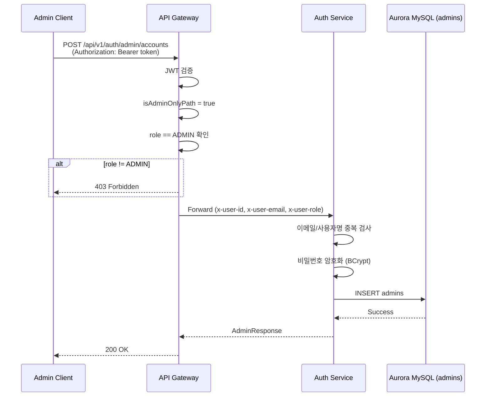
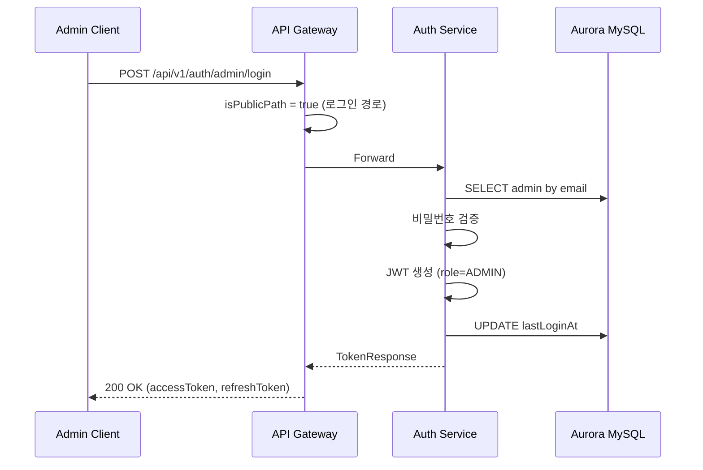
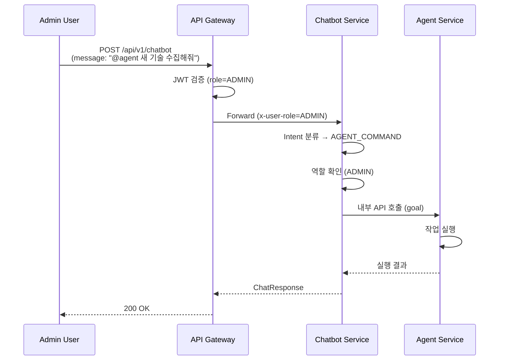

# 관리자 권한 기반 인증/인가 시스템 설계서

## 1. 개요 (Overview)

### 1.1 목적

Shrimp Task Manager 시스템에 **역할 기반 접근 제어(RBAC)**를 활성화하여, 기존 `admins` 테이블의 관리자와 `users` 테이블의 일반 회원을 구분하고 각 역할에 따른 API 접근 권한을 제어합니다.

### 1.2 범위

- 기존 `AdminEntity`(`admins` 테이블)를 활용한 관리자 계정 CRUD API 구현
- API Gateway에서 역할 기반 라우팅 검증 추가
- chatbot/agent 모듈의 역할 기반 접근 제어
- 일반 채팅과 AI Agent 작업 지시 구분

### 1.3 기존 시스템 현황

#### 이미 존재하는 인프라 (수정 불필요)

| 컴포넌트 | 현황 |
|----------|------|
| `AdminEntity` | `admins` 테이블, role(String), isActive 필드 포함 |
| `AdminReaderRepository` | JpaRepository 상속, 조회 기능 |
| `AdminWriterRepository` | BaseWriterRepository 상속, 히스토리 자동 추적 |
| `AdminHistoryEntity` / `AdminHistoryEntityFactory` | 관리자 변경 이력 추적 |
| `JwtTokenPayload` | `userId`, `email`, `role` 필드 포함 |
| `JwtAuthenticationGatewayFilter` | `x-user-id`, `x-user-email`, `x-user-role` 헤더 주입 |
| `UserPrincipal` | `userId`, `email`, `role` 필드 포함 |
| `JwtAuthenticationFilter` | `ROLE_` 접두사로 Spring Security 권한 부여 |
| `ForbiddenException` | BaseException 상속, 403/4003 코드 |
| `ErrorCodeConstants.FORBIDDEN` / `MESSAGE_CODE_FORBIDDEN` | 상수 정의 완료 |
| `GlobalExceptionHandler` | ForbiddenException 핸들러 존재 |

#### 수정이 필요한 부분

| 컴포넌트 | 현황 | 변경 필요 |
|----------|------|-----------|
| `TokenService.generateTokens()` | role을 `USER_ROLE` 상수로 하드코딩 | 관리자 로그인 시 `ADMIN` role 전달 |
| `JwtAuthenticationGatewayFilter.isPublicPath()` | `/api/v1/agent`를 공개 경로로 처리 | 관리자 전용으로 변경 |
| `SecurityConfig` | `/api/v1/auth/**` 전체 permitAll | `/api/v1/auth/admin/**` 인증 필요로 변경 |
| `AgentController` | `X-Internal-Api-Key` 인증 | JWT 역할 기반으로 변경 |
| `RefreshTokenEntity` / `RefreshTokenService` | `user_id` NOT NULL, UserEntity만 지원 | `admin_id` 컬럼 추가, 관리자 토큰 저장 지원 |

### 1.4 주요 요구사항

| 요구사항 | 설명 |
|----------|------|
| 역할 구분 | `users` 테이블 = USER, `admins` 테이블 = ADMIN |
| 관리자 API | 관리자 계정 추가/수정/삭제 (ADMIN 권한 필요) |
| Chatbot 접근 | USER, ADMIN 모두 가능 |
| Agent 접근 | ADMIN만 가능 |
| Agent 명령 구분 | Chatbot에서 `@agent` 프리픽스로 Agent 작업 지시 구분 |

### 1.5 초기 관리자 계정 (Bootstrap)

관리자 계정 생성 API(`POST /api/v1/auth/admin/accounts`)는 ADMIN 역할의 JWT 토큰이 필요합니다. 이로 인해 **최초 관리자 계정**은 API가 아닌 별도 방법으로 생성해야 합니다.

#### 초기 시드 관리자 생성 방법

Flyway 마이그레이션 스크립트를 통해 시스템 배포 시 최초 관리자를 `admins` 테이블에 직접 삽입합니다.

```sql
-- Flyway migration: V{version}__seed_initial_admin.sql
INSERT INTO admins (email, username, password, role, is_active, created_at, updated_at)
VALUES (
    'admin@shrimp-tm.com',
    'system-admin',
    '{bcrypt 해시값}',  -- BCryptPasswordEncoder로 사전 인코딩한 비밀번호
    'ADMIN',
    true,
    NOW(),
    NOW()
);
```

#### 운영 절차

1. **초기 배포**: Flyway 마이그레이션으로 시드 관리자 생성
2. **관리자 로그인**: `POST /api/v1/auth/admin/login` → JWT 토큰(accessToken) 발급
3. **추가 관리자 생성**: 발급받은 JWT 토큰을 `Authorization: Bearer {accessToken}` 헤더에 포함하여 `POST /api/v1/auth/admin/accounts` 호출

> **참고**: 테스트 파일에서 사용하는 `{{adminAccessToken}}`은 관리자 로그인(`POST /api/v1/auth/admin/login`) 후 발급받은 JWT accessToken을 의미합니다. 별도의 시크릿 키가 아닙니다.

---

## 2. 관리자 계정 관리 API 설계

### 2.1 엔드포인트 명세

| HTTP Method | URL | 설명 | 권한 |
|-------------|-----|------|------|
| POST | `/api/v1/auth/admin/accounts` | 관리자 계정 생성 | ADMIN |
| GET | `/api/v1/auth/admin/accounts` | 관리자 목록 조회 | ADMIN |
| GET | `/api/v1/auth/admin/accounts/{adminId}` | 관리자 상세 조회 | ADMIN |
| PUT | `/api/v1/auth/admin/accounts/{adminId}` | 관리자 정보 수정 | ADMIN |
| DELETE | `/api/v1/auth/admin/accounts/{adminId}` | 관리자 계정 삭제 | ADMIN |

### 2.2 요청/응답 DTO

#### AdminCreateRequest

파일: `api/auth/src/main/java/com/ebson/shrimp/tm/demo/api/auth/dto/admin/AdminCreateRequest.java`

```java
public record AdminCreateRequest(
    @NotBlank(message = "이메일은 필수입니다.")
    @Email(message = "올바른 이메일 형식이 아닙니다.")
    String email,

    @NotBlank(message = "사용자명은 필수입니다.")
    @Size(min = 2, max = 50, message = "사용자명은 2-50자 사이여야 합니다.")
    String username,

    @NotBlank(message = "비밀번호는 필수입니다.")
    @Size(min = 8, message = "비밀번호는 최소 8자 이상이어야 합니다.")
    String password
) {}
```

#### AdminUpdateRequest

파일: `api/auth/src/main/java/com/ebson/shrimp/tm/demo/api/auth/dto/admin/AdminUpdateRequest.java`

```java
public record AdminUpdateRequest(
    @Size(min = 2, max = 50, message = "사용자명은 2-50자 사이여야 합니다.")
    String username,

    @Size(min = 8, message = "비밀번호는 최소 8자 이상이어야 합니다.")
    String password
) {}
```

#### AdminResponse

파일: `api/auth/src/main/java/com/ebson/shrimp/tm/demo/api/auth/dto/admin/AdminResponse.java`

```java
public record AdminResponse(
    Long id,
    String email,
    String username,
    String role,
    Boolean isActive,
    LocalDateTime createdAt,
    LocalDateTime lastLoginAt
) {
    public static AdminResponse from(AdminEntity entity) {
        return new AdminResponse(
            entity.getId(),
            entity.getEmail(),
            entity.getUsername(),
            entity.getRole(),
            entity.getIsActive(),
            entity.getCreatedAt(),
            entity.getLastLoginAt()
        );
    }
}
```

### 2.3 Controller

파일: `api/auth/src/main/java/com/ebson/shrimp/tm/demo/api/auth/controller/AdminController.java`

```java
@RestController
@RequestMapping("/api/v1/auth/admin")
@RequiredArgsConstructor
public class AdminController {

    private final AdminFacade adminFacade;

    @PostMapping("/accounts")
    public ResponseEntity<ApiResponse<AdminResponse>> createAdmin(
            @Valid @RequestBody AdminCreateRequest request,
            @AuthenticationPrincipal UserPrincipal principal) {
        return ResponseEntity.ok(ApiResponse.success(adminFacade.createAdmin(request)));
    }

    @GetMapping("/accounts")
    public ResponseEntity<ApiResponse<List<AdminResponse>>> listAdmins(
            @AuthenticationPrincipal UserPrincipal principal) {
        return ResponseEntity.ok(ApiResponse.success(adminFacade.listAdmins()));
    }

    @GetMapping("/accounts/{adminId}")
    public ResponseEntity<ApiResponse<AdminResponse>> getAdmin(
            @PathVariable Long adminId,
            @AuthenticationPrincipal UserPrincipal principal) {
        return ResponseEntity.ok(ApiResponse.success(adminFacade.getAdmin(adminId)));
    }

    @PutMapping("/accounts/{adminId}")
    public ResponseEntity<ApiResponse<AdminResponse>> updateAdmin(
            @PathVariable Long adminId,
            @Valid @RequestBody AdminUpdateRequest request,
            @AuthenticationPrincipal UserPrincipal principal) {
        return ResponseEntity.ok(ApiResponse.success(adminFacade.updateAdmin(adminId, request)));
    }

    @DeleteMapping("/accounts/{adminId}")
    public ResponseEntity<ApiResponse<Void>> deleteAdmin(
            @PathVariable Long adminId,
            @AuthenticationPrincipal UserPrincipal principal) {
        adminFacade.deleteAdmin(adminId, principal.userId());
        return ResponseEntity.ok(ApiResponse.success());
    }
}
```

> **설계 결정**: Gateway에서 `/api/v1/auth/admin` 경로에 대해 ADMIN 역할을 이미 검증하므로, Controller에서 별도 역할 검사를 중복하지 않습니다. `@AuthenticationPrincipal`로 현재 사용자 정보만 추출합니다.

### 2.4 Facade

파일: `api/auth/src/main/java/com/ebson/shrimp/tm/demo/api/auth/facade/AdminFacade.java`

```java
@Component
@RequiredArgsConstructor
public class AdminFacade {

    private final AdminService adminService;

    public AdminResponse createAdmin(AdminCreateRequest request) {
        return adminService.createAdmin(request);
    }

    public List<AdminResponse> listAdmins() {
        return adminService.listAdmins();
    }

    public AdminResponse getAdmin(Long adminId) {
        return adminService.getAdmin(adminId);
    }

    public AdminResponse updateAdmin(Long adminId, AdminUpdateRequest request) {
        return adminService.updateAdmin(adminId, request);
    }

    public void deleteAdmin(Long adminId, Long currentAdminId) {
        adminService.deleteAdmin(adminId, currentAdminId);
    }
}
```

### 2.5 Service

파일: `api/auth/src/main/java/com/ebson/shrimp/tm/demo/api/auth/service/AdminService.java`

```java
@Slf4j
@Service
@RequiredArgsConstructor
public class AdminService {

    private static final String ADMIN_ROLE = "ADMIN";

    private final AdminReaderRepository adminReaderRepository;
    private final AdminWriterRepository adminWriterRepository;
    private final PasswordEncoder passwordEncoder;

    @Transactional
    public AdminResponse createAdmin(AdminCreateRequest request) {
        // 이메일 중복 검사
        adminReaderRepository.findByEmail(request.email())
            .ifPresent(a -> { throw new ConflictException("email", "이미 등록된 이메일입니다."); });

        // 사용자명 중복 검사
        adminReaderRepository.findByUsername(request.username())
            .ifPresent(a -> { throw new ConflictException("username", "이미 등록된 사용자명입니다."); });

        AdminEntity admin = new AdminEntity();
        admin.setEmail(request.email());
        admin.setUsername(request.username());
        admin.setPassword(passwordEncoder.encode(request.password()));
        admin.setRole(ADMIN_ROLE);
        admin.setIsActive(true);

        adminWriterRepository.save(admin);
        log.info("Admin created: email={}", request.email());
        return AdminResponse.from(admin);
    }

    @Transactional(readOnly = true)
    public List<AdminResponse> listAdmins() {
        return adminReaderRepository.findByIsActiveTrue().stream()
            .map(AdminResponse::from)
            .toList();
    }

    @Transactional(readOnly = true)
    public AdminResponse getAdmin(Long adminId) {
        AdminEntity admin = findActiveAdmin(adminId);
        return AdminResponse.from(admin);
    }

    @Transactional
    public AdminResponse updateAdmin(Long adminId, AdminUpdateRequest request) {
        AdminEntity admin = findActiveAdmin(adminId);

        if (request.username() != null && !request.username().isBlank()
                && !admin.getUsername().equals(request.username())) {
            adminReaderRepository.findByUsername(request.username())
                .ifPresent(a -> { throw new ConflictException("username", "이미 등록된 사용자명입니다."); });
            admin.setUsername(request.username());
        }

        if (request.password() != null && !request.password().isBlank()) {
            admin.setPassword(passwordEncoder.encode(request.password()));
        }

        adminWriterRepository.save(admin);
        log.info("Admin updated: adminId={}", adminId);
        return AdminResponse.from(admin);
    }

    @Transactional
    public void deleteAdmin(Long adminId, Long currentAdminId) {
        if (adminId.equals(currentAdminId)) {
            throw new ForbiddenException("자기 자신은 삭제할 수 없습니다.");
        }

        AdminEntity admin = findActiveAdmin(adminId);
        admin.setDeletedBy(currentAdminId);
        adminWriterRepository.delete(admin);

        log.info("Admin deleted: adminId={}, deletedBy={}", adminId, currentAdminId);
    }

    private AdminEntity findActiveAdmin(Long adminId) {
        AdminEntity admin = adminReaderRepository.findById(adminId)
            .orElseThrow(() -> new ResourceNotFoundException("관리자를 찾을 수 없습니다."));

        if (Boolean.TRUE.equals(admin.getIsDeleted())) {
            throw new ResourceNotFoundException("관리자를 찾을 수 없습니다.");
        }

        return admin;
    }
}
```

### 2.6 AdminReaderRepository 확장

파일: `domain/aurora/src/main/java/com/ebson/shrimp/tm/demo/domain/mariadb/repository/reader/auth/AdminReaderRepository.java`

```java
@Repository
public interface AdminReaderRepository extends JpaRepository<AdminEntity, Long> {
    // 기존 메서드에 추가
    Optional<AdminEntity> findByEmail(String email);
    Optional<AdminEntity> findByUsername(String username);
    List<AdminEntity> findByIsActiveTrue();
    Optional<AdminEntity> findByEmailAndIsActiveTrue(String email);
}
```

---

## 3. 관리자 로그인 설계

### 3.1 현재 문제

`TokenService.generateTokens()`가 role을 `USER_ROLE` 상수("USER")로 하드코딩하고 있어, 관리자 로그인 시에도 JWT에 `role=USER`가 설정됩니다.

### 3.2 TokenService 수정

파일: `api/auth/src/main/java/com/ebson/shrimp/tm/demo/api/auth/service/TokenService.java`

```java
// 기존: role 하드코딩
public TokenResponse generateTokens(Long userId, String email) {
    JwtTokenPayload payload = new JwtTokenPayload(
        String.valueOf(userId),
        email,
        USER_ROLE  // 항상 "USER"
    );
    // ...
}

// 수정: role 파라미터 추가
public TokenResponse generateTokens(Long userId, String email, String role) {
    JwtTokenPayload payload = new JwtTokenPayload(
        String.valueOf(userId),
        email,
        role
    );

    String accessToken = jwtTokenProvider.generateAccessToken(payload);
    String refreshToken = jwtTokenProvider.generateRefreshToken(payload);

    refreshTokenService.saveRefreshToken(
        userId,
        refreshToken,
        jwtTokenProvider.getRefreshTokenExpiresAt()
    );

    return new TokenResponse(
        accessToken,
        refreshToken,
        TOKEN_TYPE,
        ACCESS_TOKEN_EXPIRY_SECONDS,
        REFRESH_TOKEN_EXPIRY_SECONDS
    );
}
```

### 3.3 관리자 로그인 엔드포인트

파일: `api/auth/src/main/java/com/ebson/shrimp/tm/demo/api/auth/controller/AdminController.java`

```java
// AdminController에 로그인 엔드포인트 추가
@PostMapping("/login")
public ResponseEntity<ApiResponse<TokenResponse>> adminLogin(
        @Valid @RequestBody LoginRequest request) {
    return ResponseEntity.ok(ApiResponse.success(adminFacade.login(request)));
}
```

파일: `api/auth/src/main/java/com/ebson/shrimp/tm/demo/api/auth/service/AdminService.java`

```java
// AdminService에 로그인 메서드 추가
public TokenResponse login(LoginRequest request) {
    AdminEntity admin = adminReaderRepository.findByEmailAndIsActiveTrue(request.email())
        .orElseThrow(() -> new UnauthorizedException("이메일 또는 비밀번호가 올바르지 않습니다."));

    if (!passwordEncoder.matches(request.password(), admin.getPassword())) {
        throw new UnauthorizedException("이메일 또는 비밀번호가 올바르지 않습니다.");
    }

    admin.setLastLoginAt(LocalDateTime.now());
    adminWriterRepository.save(admin);

    return tokenService.generateTokens(admin.getId(), admin.getEmail(), admin.getRole());
}
```

### 3.4 RefreshToken 관리자 지원

#### 3.4.1 문제

현재 `refresh_tokens` 테이블의 `user_id` 컬럼은 `NOT NULL`이며, `RefreshTokenEntity`가 `UserEntity`에 `@ManyToOne`으로 매핑되어 있습니다. 관리자 로그인 시 `TokenService.generateTokens()`가 호출되면 `RefreshTokenService.saveRefreshToken()`에서 admin ID로 `users` 테이블을 조회하여 `User not found` 예외가 발생합니다.

#### 3.4.2 refresh_tokens 테이블 스키마 변경

```sql
ALTER TABLE refresh_tokens
    MODIFY COLUMN user_id BIGINT UNSIGNED NULL COMMENT '사용자 ID (일반 회원)',
    ADD COLUMN admin_id BIGINT UNSIGNED NULL COMMENT '관리자 ID' AFTER user_id,
    ADD INDEX idx_refresh_token_admin_id (admin_id);
```

- `user_id`: `NOT NULL` → `NULL`로 변경 (관리자 토큰은 user_id가 없음)
- `admin_id`: 신규 컬럼 추가 (일반 회원 토큰은 admin_id가 없음)
- 토큰 1개당 `user_id` 또는 `admin_id` 중 하나만 값이 존재

#### 3.4.3 RefreshTokenEntity 수정

파일: `domain/aurora/src/main/java/com/ebson/shrimp/tm/demo/domain/mariadb/entity/auth/RefreshTokenEntity.java`

```java
@Entity
@Table(name = "refresh_tokens")
@Getter
@Setter
public class RefreshTokenEntity extends BaseEntity {

    @ManyToOne(fetch = FetchType.LAZY)
    @JoinColumn(name = "user_id")
    private UserEntity user;

    @Column(name = "user_id", insertable = false, updatable = false)
    private Long userId;

    @ManyToOne(fetch = FetchType.LAZY)
    @JoinColumn(name = "admin_id")
    private AdminEntity admin;

    @Column(name = "admin_id", insertable = false, updatable = false)
    private Long adminId;

    @Column(name = "token", length = 500, nullable = false, unique = true)
    private String token;

    @Column(name = "expires_at", nullable = false, precision = 6)
    private LocalDateTime expiresAt;

    public static RefreshTokenEntity createForUser(Long userId, String token, LocalDateTime expiresAt) {
        RefreshTokenEntity entity = new RefreshTokenEntity();
        entity.userId = userId;
        entity.token = token;
        entity.expiresAt = expiresAt;
        return entity;
    }

    public static RefreshTokenEntity createForAdmin(Long adminId, String token, LocalDateTime expiresAt) {
        RefreshTokenEntity entity = new RefreshTokenEntity();
        entity.adminId = adminId;
        entity.token = token;
        entity.expiresAt = expiresAt;
        return entity;
    }
}
```

#### 3.4.4 RefreshTokenService 수정

파일: `api/auth/src/main/java/com/ebson/shrimp/tm/demo/api/auth/service/RefreshTokenService.java`

```java
@Transactional
public RefreshTokenEntity saveRefreshToken(Long userId, String token, LocalDateTime expiresAt) {
    UserEntity user = userReaderRepository.findById(userId)
        .orElseThrow(() -> new IllegalArgumentException("User not found with id: " + userId));

    RefreshTokenEntity refreshTokenEntity = RefreshTokenEntity.createForUser(userId, token, expiresAt);
    refreshTokenEntity.setUser(user);
    return refreshTokenWriterRepository.save(refreshTokenEntity);
}

@Transactional
public RefreshTokenEntity saveAdminRefreshToken(Long adminId, String token, LocalDateTime expiresAt) {
    AdminEntity admin = adminReaderRepository.findById(adminId)
        .orElseThrow(() -> new IllegalArgumentException("Admin not found with id: " + adminId));

    RefreshTokenEntity refreshTokenEntity = RefreshTokenEntity.createForAdmin(adminId, token, expiresAt);
    refreshTokenEntity.setAdmin(admin);
    return refreshTokenWriterRepository.save(refreshTokenEntity);
}
```

#### 3.4.5 TokenService 수정

파일: `api/auth/src/main/java/com/ebson/shrimp/tm/demo/api/auth/service/TokenService.java`

```java
public TokenResponse generateTokens(Long userId, String email, String role) {
    JwtTokenPayload payload = new JwtTokenPayload(
        String.valueOf(userId),
        email,
        role
    );

    String accessToken = jwtTokenProvider.generateAccessToken(payload);
    String refreshToken = jwtTokenProvider.generateRefreshToken(payload);

    if ("ADMIN".equals(role)) {
        refreshTokenService.saveAdminRefreshToken(
            userId, refreshToken, jwtTokenProvider.getRefreshTokenExpiresAt()
        );
    } else {
        refreshTokenService.saveRefreshToken(
            userId, refreshToken, jwtTokenProvider.getRefreshTokenExpiresAt()
        );
    }

    return new TokenResponse(
        accessToken, refreshToken, TOKEN_TYPE,
        ACCESS_TOKEN_EXPIRY_SECONDS, REFRESH_TOKEN_EXPIRY_SECONDS
    );
}
```

### 3.5 기존 UserAuthenticationService 수정

기존 일반 회원 로그인도 role 파라미터를 전달하도록 수정:

```java
// 기존 호출부
tokenService.generateTokens(user.getId(), user.getEmail());

// 수정
tokenService.generateTokens(user.getId(), user.getEmail(), TokenConstants.USER_ROLE);
```

---

## 4. API Gateway 역할 검증 설계

### 4.1 JwtAuthenticationGatewayFilter 수정

파일: `api/gateway/src/main/java/com/ebson/shrimp/tm/demo/api/gateway/filter/JwtAuthenticationGatewayFilter.java`

#### 4.1.1 isPublicPath 수정

```java
// 변경 전
private boolean isPublicPath(String path) {
    return path.startsWith("/api/v1/auth") ||
           path.startsWith("/api/v1/agent") ||          // 내부 API Key 인증 사용
           path.startsWith("/api/v1/emerging-tech") ||
           path.startsWith("/actuator");
}

// 변경 후
private boolean isPublicPath(String path) {
    // /api/v1/auth/admin은 인증 필요
    if (path.startsWith("/api/v1/auth/admin")) {
        return false;
    }
    // /api/v1/auth/admin/login은 공개 (관리자 로그인)
    if (path.equals("/api/v1/auth/admin/login")) {
        return true;
    }
    return path.startsWith("/api/v1/auth") ||
           path.startsWith("/api/v1/emerging-tech") ||
           path.startsWith("/actuator");
}
```

#### 4.1.2 역할 검증 추가

```java
@Override
public Mono<Void> filter(ServerWebExchange exchange, GatewayFilterChain chain) {
    ServerHttpRequest request = exchange.getRequest();
    String path = request.getURI().getPath();

    if (isPublicPath(path)) {
        return chain.filter(exchange);
    }

    String token = extractToken(request);
    if (token == null || !jwtTokenProvider.validateToken(token)) {
        return handleUnauthorized(exchange);
    }

    try {
        JwtTokenPayload payload = jwtTokenProvider.getPayloadFromToken(token);

        // 관리자 전용 경로 검증
        if (isAdminOnlyPath(path) && !"ADMIN".equals(payload.role())) {
            return handleForbidden(exchange);
        }

        ServerHttpRequest modifiedRequest = request.mutate()
            .header(USER_ID_HEADER, payload.userId())
            .header(USER_EMAIL_HEADER, payload.email())
            .header(USER_ROLE_HEADER, payload.role())
            .header(AUTHORIZATION_HEADER, BEARER_PREFIX + token)
            .build();

        return chain.filter(exchange.mutate().request(modifiedRequest).build());
    } catch (Exception e) {
        return handleUnauthorized(exchange);
    }
}

/**
 * 관리자 전용 경로 확인
 */
private boolean isAdminOnlyPath(String path) {
    return path.startsWith("/api/v1/agent") ||
           path.startsWith("/api/v1/auth/admin");
}
```

#### 4.1.3 handleForbidden 메서드 추가

```java
private Mono<Void> handleForbidden(ServerWebExchange exchange) {
    ServerHttpResponse response = exchange.getResponse();
    response.setStatusCode(HttpStatus.FORBIDDEN);
    response.getHeaders().add(HttpHeaders.CONTENT_TYPE, MediaType.APPLICATION_JSON_VALUE);

    MessageCode messageCode = new MessageCode(
        ErrorCodeConstants.MESSAGE_CODE_FORBIDDEN,
        "권한이 없습니다."
    );
    ApiResponse<Void> errorResponse = ApiResponse.error(
        ErrorCodeConstants.FORBIDDEN,
        messageCode
    );

    DataBufferFactory bufferFactory = response.bufferFactory();
    try {
        String jsonResponse = objectMapper.writeValueAsString(errorResponse);
        DataBuffer buffer = bufferFactory.wrap(jsonResponse.getBytes(StandardCharsets.UTF_8));
        return response.writeWith(Mono.just(buffer));
    } catch (Exception e) {
        return response.setComplete();
    }
}
```

### 4.2 SecurityConfig 수정

파일: `common/security/src/main/java/com/ebson/shrimp/tm/demo/common/security/config/SecurityConfig.java`

```java
// 변경 전
.authorizeHttpRequests(auth -> auth
    .requestMatchers("/api/v1/auth/me").authenticated()
    .requestMatchers("/api/v1/auth/**").permitAll()
    .requestMatchers("/actuator/health").permitAll()
    .anyRequest().authenticated()
)

// 변경 후
.authorizeHttpRequests(auth -> auth
    .requestMatchers("/api/v1/auth/me").authenticated()
    .requestMatchers("/api/v1/auth/admin/login").permitAll()
    .requestMatchers("/api/v1/auth/admin/**").hasRole("ADMIN")
    .requestMatchers("/api/v1/auth/**").permitAll()
    .requestMatchers("/actuator/health").permitAll()
    .anyRequest().authenticated()
)
```

> **참고**: `JwtAuthenticationFilter`가 `ROLE_` + role로 권한을 부여하므로(`new SimpleGrantedAuthority("ROLE_" + payload.role())`), `hasRole("ADMIN")`은 `ROLE_ADMIN` 권한을 확인합니다. (Spring Security 공식 문서: [Authorize HttpServletRequests](https://docs.spring.io/spring-security/reference/servlet/authorization/authorize-http-requests.html))

---

## 5. Agent 모듈 접근 제어 설계

### 5.1 접근 권한 변경

| 변경 전 | 변경 후 |
|---------|---------|
| `X-Internal-Api-Key` 헤더 인증 | JWT 기반 ADMIN 역할 검증 (Gateway) |

### 5.2 AgentController 수정

파일: `api/agent/src/main/java/com/ebson/shrimp/tm/demo/api/agent/controller/AgentController.java`

```java
// 변경 전
@PostMapping("/run")
public ResponseEntity<ApiResponse<AgentExecutionResult>> runAgent(
        @Valid @RequestBody AgentRunRequest request,
        @RequestHeader("X-Internal-Api-Key") String requestApiKey) {
    validateApiKey(requestApiKey);
    // ...
}

// 변경 후
@PostMapping("/run")
public ResponseEntity<ApiResponse<AgentExecutionResult>> runAgent(
        @Valid @RequestBody AgentRunRequest request,
        @RequestHeader("x-user-id") String userId) {

    String sessionId = (request.sessionId() != null && !request.sessionId().isBlank())
            ? request.sessionId()
            : "admin-" + userId + "-" + UUID.randomUUID().toString().substring(0, 8);

    log.info("Agent 실행 요청: userId={}, goal={}", userId, request.goal());

    AgentExecutionResult result;
    if (agent instanceof EmergingTechAgentImpl agentImpl) {
        result = agentImpl.execute(request.goal(), sessionId);
    } else {
        result = agent.execute(request.goal());
    }

    return ResponseEntity.ok(ApiResponse.success(result));
}
```

### 5.3 스케줄러 유지

`EmergingTechAgentScheduler`의 자동 실행은 내부 호출이므로 별도 인증 불필요. 변경 없음.

---

## 6. Chatbot 모듈 접근 제어 설계

### 6.1 Chatbot 접근 권한

USER, ADMIN 모두 접근 가능. 현재 구현 유지. 변경 없음.

### 6.2 Intent 확장

파일: `api/chatbot/src/main/java/com/ebson/shrimp/tm/demo/api/chatbot/service/dto/Intent.java`

```java
public enum Intent {
    LLM_DIRECT,
    RAG_REQUIRED,
    WEB_SEARCH_REQUIRED,
    /** AI Agent 작업 지시 */
    AGENT_COMMAND
}
```

### 6.3 IntentClassificationServiceImpl 수정

파일: `api/chatbot/src/main/java/com/ebson/shrimp/tm/demo/api/chatbot/service/IntentClassificationServiceImpl.java`

```java
// Agent 명령 프리픽스
private static final String AGENT_COMMAND_PREFIX = "@agent";

@Override
public Intent classifyIntent(String preprocessedInput) {
    String lowerInput = preprocessedInput.toLowerCase().trim();

    // 0. @agent 프리픽스 감지 (명시적 명령만)
    if (lowerInput.startsWith(AGENT_COMMAND_PREFIX)) {
        log.info("Intent: AGENT_COMMAND - {}", truncateForLog(preprocessedInput));
        return Intent.AGENT_COMMAND;
    }

    // 이하 기존 로직 유지
    // ...
}
```

> **설계 결정**: Agent 명령 감지는 `@agent` 프리픽스만 사용합니다. "에이전트", "수집해줘" 등 일반적인 키워드로 Agent 명령을 감지하면 일반 대화가 Agent 호출로 오분류될 위험이 큽니다. 명시적 프리픽스 방식이 오분류를 방지하고 사용자 의도를 정확히 반영합니다.

### 6.4 ChatbotServiceImpl 수정

파일: `api/chatbot/src/main/java/com/ebson/shrimp/tm/demo/api/chatbot/service/ChatbotServiceImpl.java`

```java
// 의존성 추가
private final AgentDelegationService agentDelegationService;
private final UserPrincipalProvider userPrincipalProvider;  // x-user-role 헤더에서 역할 추출

// switch 문에 AGENT_COMMAND 케이스 추가
case AGENT_COMMAND -> {
    response = handleAgentCommand(request, userId);
    sources = Collections.emptyList();
}

/**
 * Agent 명령 처리
 */
private String handleAgentCommand(ChatRequest request, Long userId) {
    String userRole = userPrincipalProvider.getCurrentRole();
    if (!"ADMIN".equals(userRole)) {
        return "Agent 명령은 관리자만 사용할 수 있습니다. 일반 질문은 '@agent' 없이 메시지를 보내주세요.";
    }

    String goal = request.message().substring("@agent".length()).trim();
    return agentDelegationService.delegateToAgent(goal, userId);
}
```

> **설계 결정**: 일반 사용자가 `@agent` 명령을 보내면 403 에러 대신 안내 메시지를 반환합니다. 채팅 UX에서 에러 응답보다 자연스러운 안내가 적합합니다.

### 6.5 AgentDelegationService

파일: `api/chatbot/src/main/java/com/ebson/shrimp/tm/demo/api/chatbot/service/AgentDelegationService.java`

> **주의**: Chatbot 모듈에서 Agent 모듈로의 내부 호출에는 Feign Client를 사용합니다. Agent 모듈의 인증이 JWT 기반으로 변경되므로, 내부 호출 시 관리자 JWT 토큰을 전달해야 합니다. Gateway를 경유하는 경우 `x-user-id`, `x-user-role` 헤더가 이미 주입되어 있으므로, 이를 Feign 요청 헤더에 전파합니다.

```java
@Slf4j
@Service
@RequiredArgsConstructor
public class AgentDelegationService {

    private final EmergingTechInternalApi agentApi;  // 기존 Feign 패턴 활용

    /**
     * Agent에게 작업 위임
     */
    public String delegateToAgent(String goal, Long userId) {
        try {
            String sessionId = "chatbot-" + userId + "-" + System.currentTimeMillis();
            // 기존 EmergingTechInternalApi 패턴 참고하여 Agent API 호출
            // 구체적인 Feign Client 구현은 client/feign 모듈에 추가
            var result = agentApi.runAgent(goal, sessionId);
            return formatResult(result);
        } catch (Exception e) {
            log.error("Agent delegation failed", e);
            return "Agent 작업 요청에 실패했습니다. 잠시 후 다시 시도해주세요.";
        }
    }

    private String formatResult(Object result) {
        // Agent 실행 결과 포맷팅
        return "Agent 작업이 완료되었습니다. 결과: " + result.toString();
    }
}
```

---

## 7. 시퀀스 다이어그램

### 7.1 관리자 계정 생성



### 7.2 관리자 로그인



### 7.3 Agent 명령 처리 (Chatbot 경유)



---

## 8. 에러 처리

### 8.1 예외 시나리오

| 상황 | 예외 클래스 | HTTP 상태 | 에러 코드 | 비고 |
|------|------------|-----------|-----------|------|
| 권한 없음 | `ForbiddenException` | 403 | 4003 | 이미 존재 |
| 이메일/사용자명 중복 | `ConflictException` | 400 | 4006 | 기존 동작: 유효성 검증 형식으로 반환 |
| 관리자 미존재 | `ResourceNotFoundException` | 404 | 4004 | 이미 존재 |
| 인증 실패 | `UnauthorizedException` | 401 | 4001 | 이미 존재 |
| 자기 자신 삭제 | `ForbiddenException` | 403 | 4003 | |

> **주의**: 현재 `ConflictException`은 `GlobalExceptionHandler`에서 HTTP 400 (BAD_REQUEST) + 에러코드 4006 (VALIDATION_ERROR) 형식으로 반환됩니다. 409가 아닙니다. 테스트 작성 시 이를 반영해야 합니다.

---

## 9. 테스트 전략

### 9.1 HTTP 테스트 파일

#### 관리자 로그인 및 계정 생성 테스트

파일: `api/bookmark/src/test/http/12-admin-create.http`

```http
###
# 관리자 로그인 및 계정 생성 API 테스트
# Description: 관리자 로그인 후 토큰을 발급받고, 새 관리자 계정을 생성합니다.
# @no-cookie-jar
###

### 0. 관리자 로그인 (시드 관리자 계정으로 토큰 발급)
POST {{gatewayUrl}}/api/v1/auth/admin/login
Content-Type: application/json

{
  "email": "admin@shrimp-tm.com",
  "password": "초기비밀번호"
}

> 

### 1. 관리자 계정 생성 성공
POST {{gatewayUrl}}/api/v1/auth/admin/accounts
Content-Type: application/json
Authorization: Bearer {{adminAccessToken}}

{
  "email": "newadmin@example.com",
  "username": "newadmin",
  "password": "Admin123!"
}

> {%
    client.test("관리자 생성 성공", function() {
        client.assert(response.status === 200, "응답 상태 코드가 200이어야 합니다");
        client.assert(response.body.code === "2000", "code 필드가 2000이어야 합니다");
    });

    client.test("관리자 데이터 확인", function() {
        var data = response.body.data;
        client.assert(data.email === "newadmin@example.com", "email이 일치해야 합니다");
        client.assert(data.role === "ADMIN", "role이 ADMIN이어야 합니다");
        client.assert(data.isActive === true, "isActive가 true여야 합니다");
        client.global.set("testAdminId", data.id);
    });
%}

### 2. 실패 케이스 - 일반 사용자 권한으로 시도
POST {{gatewayUrl}}/api/v1/auth/admin/accounts
Content-Type: application/json
Authorization: Bearer {{userAccessToken}}

{
  "email": "test@example.com",
  "username": "test",
  "password": "Test123!"
}

> 

### 3. 실패 케이스 - 이메일 중복
POST {{gatewayUrl}}/api/v1/auth/admin/accounts
Content-Type: application/json
Authorization: Bearer {{adminAccessToken}}

{
  "email": "newadmin@example.com",
  "username": "newadmin2",
  "password": "Admin123!"
}

> 

### 4. 실패 케이스 - 인증 없이 요청
POST {{gatewayUrl}}/api/v1/auth/admin/accounts
Content-Type: application/json

{
  "email": "test@example.com",
  "username": "test",
  "password": "Test123!"
}

> 

### 5. 실패 케이스 - 유효성 검증 실패 (짧은 비밀번호)
POST {{gatewayUrl}}/api/v1/auth/admin/accounts
Content-Type: application/json
Authorization: Bearer {{adminAccessToken}}

{
  "email": "test2@example.com",
  "username": "test2",
  "password": "short"
}

> 
```

#### 관리자 목록/상세/수정/삭제 테스트

파일: `api/bookmark/src/test/http/13-admin-manage.http`

```http
###
# 관리자 계정 관리 API 테스트
# Description: 목록 조회, 상세 조회, 수정, 삭제
# Authentication: Required (Bearer Token, ADMIN role)
# @no-cookie-jar
###

### 1. 관리자 목록 조회 성공
GET {{gatewayUrl}}/api/v1/auth/admin/accounts
Authorization: Bearer {{adminAccessToken}}

> 

### 2. 관리자 상세 조회 성공
GET {{gatewayUrl}}/api/v1/auth/admin/accounts/{{testAdminId}}
Authorization: Bearer {{adminAccessToken}}

> 

### 3. 관리자 정보 수정 성공
PUT {{gatewayUrl}}/api/v1/auth/admin/accounts/{{testAdminId}}
Content-Type: application/json
Authorization: Bearer {{adminAccessToken}}

{
  "username": "updatedadmin"
}

> 

### 4. 관리자 삭제 성공
DELETE {{gatewayUrl}}/api/v1/auth/admin/accounts/{{testAdminId}}
Authorization: Bearer {{adminAccessToken}}

> 

### 5. 실패 케이스 - 일반 사용자로 목록 조회
GET {{gatewayUrl}}/api/v1/auth/admin/accounts
Authorization: Bearer {{userAccessToken}}

> 

### 6. 실패 케이스 - 존재하지 않는 관리자 조회
GET {{gatewayUrl}}/api/v1/auth/admin/accounts/999999
Authorization: Bearer {{adminAccessToken}}

> 
```

#### Agent 명령 테스트 (Chatbot 경유)

파일: `api/bookmark/src/test/http/14-agent-command.http`

```http
###
# POST /api/v1/chatbot - Agent 명령 테스트
# Description: Chatbot을 통한 Agent 명령 실행
# Authentication: Required (Bearer Token)
# @no-cookie-jar
###

### 1. Agent 명령 - 관리자 권한으로 성공
POST {{gatewayUrl}}/api/v1/chatbot
Content-Type: application/json
Authorization: Bearer {{adminAccessToken}}

{
  "message": "@agent 최신 GitHub 릴리즈 확인해줘"
}

> 

### 2. Agent 명령 - 일반 사용자 (안내 메시지)
POST {{gatewayUrl}}/api/v1/chatbot
Content-Type: application/json
Authorization: Bearer {{userAccessToken}}

{
  "message": "@agent 새 기술 수집해줘"
}

> 

### 3. 일반 채팅 - 일반 사용자 (Agent 명령이 아닌 경우)
POST {{gatewayUrl}}/api/v1/chatbot
Content-Type: application/json
Authorization: Bearer {{userAccessToken}}

{
  "message": "안녕하세요, 최근 AI 뉴스 알려줘"
}

> 
```

---

## 10. 구현 순서

### Phase 0: 초기 관리자 시드 데이터
1. Flyway 마이그레이션 스크립트로 최초 관리자 계정 `admins` 테이블에 삽입
2. BCrypt 인코딩된 비밀번호 사용

### Phase 1: RefreshToken 관리자 지원
1. `refresh_tokens` 테이블에 `admin_id` 컬럼 추가, `user_id`를 `NULL` 허용으로 변경
2. `RefreshTokenEntity`에 `AdminEntity` 관계 추가, `createForUser`/`createForAdmin` 팩토리 메서드
3. `RefreshTokenService`에 `saveAdminRefreshToken()` 메서드 추가

### Phase 2: TokenService 수정
1. `TokenService.generateTokens()` 에 role 파라미터 추가
2. role 기반으로 `saveRefreshToken` / `saveAdminRefreshToken` 분기
3. 기존 호출부 (`UserAuthenticationService`, `OAuthService`) 수정 - `USER_ROLE` 전달

### Phase 3: AdminReaderRepository 확장
1. `findByEmail`, `findByUsername`, `findByIsActiveTrue`, `findByEmailAndIsActiveTrue` 메서드 추가

### Phase 4: 관리자 관리 API 구현
1. DTO 생성 (AdminCreateRequest, AdminUpdateRequest, AdminResponse)
2. AdminService 구현
3. AdminFacade 구현
4. AdminController 구현

### Phase 5: Gateway 역할 검증
1. `isPublicPath()` 수정 - `/api/v1/auth/admin` 분리, `/api/v1/agent` 제거
2. `isAdminOnlyPath()` 추가
3. `handleForbidden()` 추가

### Phase 6: SecurityConfig 수정
1. `/api/v1/auth/admin/login` permitAll 추가
2. `/api/v1/auth/admin/**` hasRole("ADMIN") 추가

### Phase 7: Agent 모듈 수정
1. `AgentController`에서 `X-Internal-Api-Key` 인증 제거
2. `x-user-id` 헤더 활용으로 변경

### Phase 8: Chatbot Intent 확장
1. `Intent.AGENT_COMMAND` 추가
2. `IntentClassificationServiceImpl`에 `@agent` 프리픽스 감지 추가
3. `AgentDelegationService` 생성
4. `ChatbotServiceImpl`에 `AGENT_COMMAND` 처리 추가

### Phase 9: 테스트 작성
1. HTTP 테스트 파일 작성 (12, 13, 14)
2. 단위 테스트 작성

---

## 11. 검증 체크리스트

### 정합성 검증
- [x] 기존 `AdminEntity` (`admins` 테이블) 활용
- [x] 기존 `AdminReaderRepository`, `AdminWriterRepository` 활용
- [x] 기존 `ForbiddenException`, `ErrorCodeConstants` 활용
- [x] 기존 `GlobalExceptionHandler` 핸들러 활용
- [x] JWT 토큰 페이로드 구조 유지 (userId, email, role)
- [x] Gateway 필터 로직과의 일관성
- [x] Soft Delete 원칙 준수 (BaseWriterRepository + HistoryService)
- [x] `ConflictException`이 400/4006 반환하는 기존 동작 반영

### 완전성 검증
- [x] 모든 API 엔드포인트 명세 포함
- [x] 관리자 로그인 설계 포함
- [x] 시퀀스 다이어그램 포함
- [x] 에러 처리 시나리오 명시
- [x] 테스트 전략 포함

### 오버엔지니어링 방지
- [x] 기존 `AdminEntity` 활용 (UserEntity에 role 컬럼 추가 불필요)
- [x] 기존 예외 클래스 재사용 (새로 만들지 않음)
- [x] 기존 Repository 패턴 재사용
- [x] Agent 명령 감지는 `@agent` 프리픽스만 사용 (과도한 키워드 감지 제거)
- [x] 불필요한 Role enum 생성 제거 (AdminEntity.role은 String)

---

## 12. 참고 자료

### 공식 문서
- Spring Security Authorization: https://docs.spring.io/spring-security/reference/servlet/authorization/authorize-http-requests.html
- Spring Cloud Gateway Filters: https://docs.spring.io/spring-cloud-gateway/reference/spring-cloud-gateway/global-filters.html
- JWT (RFC 7519): https://tools.ietf.org/html/rfc7519

---

**작성일**: 2026-02-04
**버전**: 2.0 (v1.0 대비 기존 코드베이스 정합성 전면 개정)
**대상 모듈**: api/auth, api/gateway, api/chatbot, api/agent
