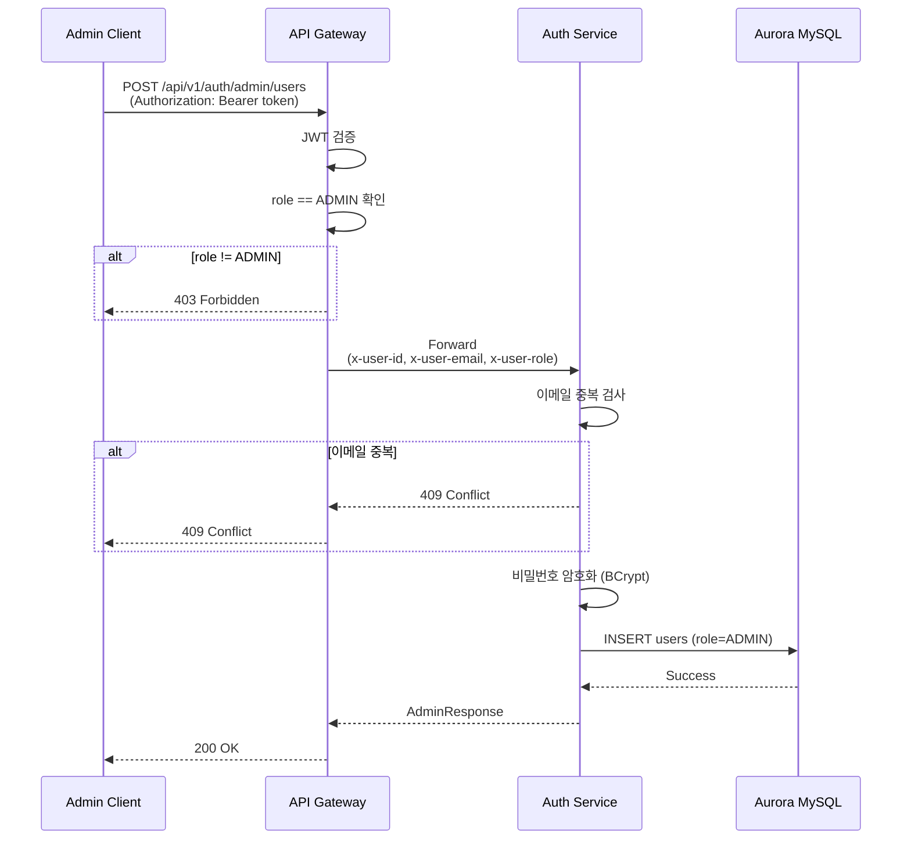
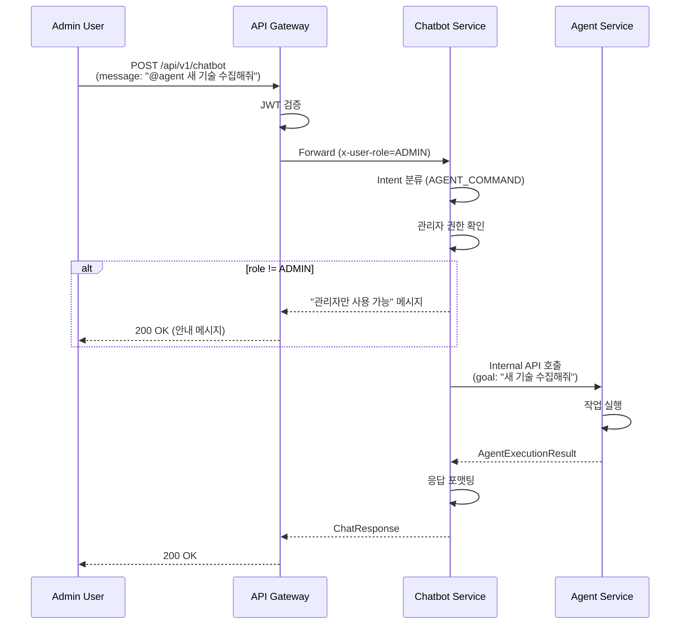
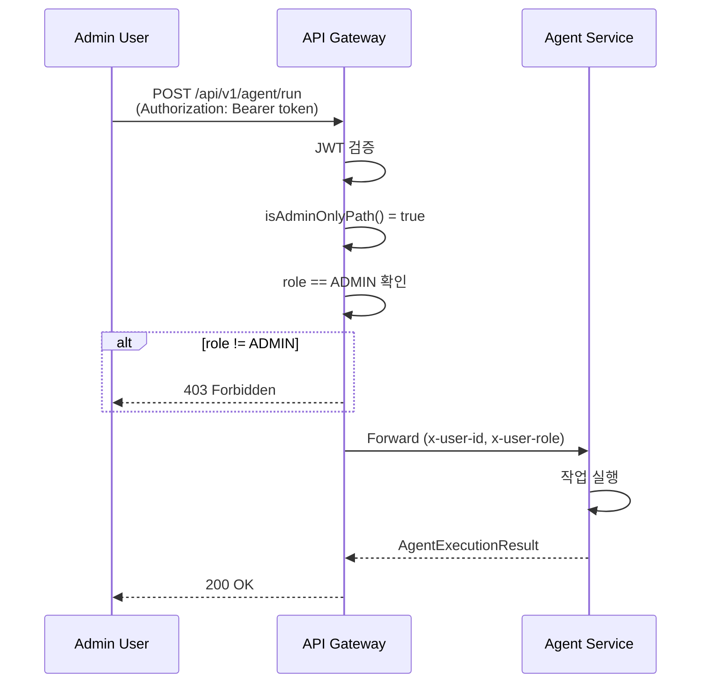

# 관리자 권한 기반 인증/인가 시스템 설계서

## 1. 개요 (Overview)

### 1.1 목적

본 설계서는 Shrimp Task Manager 시스템에 **역할 기반 접근 제어(RBAC, Role-Based Access Control)**를 도입하여 일반 회원과 관리자를 구분하고, 각 역할에 따른 API 접근 권한을 제어하기 위한 상세 설계를 제공합니다.

### 1.2 범위

- users 테이블에 role 컬럼 추가
- 관리자 계정 CRUD API 설계 및 구현
- API Gateway에서 역할 정보 전달 메커니즘
- chatbot/agent 모듈의 역할 기반 접근 제어
- 일반 채팅과 AI Agent 작업 지시 구분

### 1.3 기존 시스템과의 관계

현재 시스템은 JWT 기반 인증을 사용하며, `JwtTokenPayload`에 이미 `role` 필드가 포함되어 있습니다. Gateway의 `JwtAuthenticationGatewayFilter`는 `x-user-role` 헤더를 주입하지만, 실제 역할 기반 접근 제어는 구현되어 있지 않습니다.

### 1.4 주요 요구사항 요약

| 요구사항 | 설명 |
|----------|------|
| 역할 구분 | USER(일반 회원), ADMIN(관리자) |
| 관리자 API | 관리자 계정 추가/수정/삭제 (ADMIN 권한 필요) |
| Chatbot 접근 | USER, ADMIN 모두 가능 |
| Agent 접근 | ADMIN만 가능 |
| Agent 명령 구분 | Chatbot에서 일반 채팅과 Agent 작업 지시 구분 |

---

## 2. 역할(Role) 설계

### 2.1 역할 정의

| 역할 | 코드 | 설명 | 권한 범위 |
|------|------|------|-----------|
| 일반 회원 | `USER` | 기본 회원 | chatbot API 접근 가능 |
| 관리자 | `ADMIN` | 시스템 관리자 | chatbot, agent API 접근 + 관리자 계정 관리 |

### 2.2 데이터베이스 스키마 변경

#### 2.2.1 Flyway 마이그레이션 스크립트

파일: `domain/aurora/src/main/resources/db/migration/V{version}__add_role_column_to_users.sql`

```sql
-- users 테이블에 role 컬럼 추가
ALTER TABLE users
ADD COLUMN role VARCHAR(20) NOT NULL DEFAULT 'USER'
AFTER provider_user_id;

-- role 값 제약조건
ALTER TABLE users
ADD CONSTRAINT chk_users_role CHECK (role IN ('USER', 'ADMIN'));

-- role 컬럼 인덱스 추가 (역할별 조회 성능 향상)
CREATE INDEX idx_users_role ON users(role);

-- 기존 사용자는 모두 USER 역할 유지 (DEFAULT 'USER')
```

### 2.3 Role Enum 생성

파일: `domain/aurora/src/main/java/com/tech/n/ai/domain/mariadb/entity/auth/Role.java`

```java
package com.tech.n.ai.domain.mariadb.entity.auth;

/**
 * 사용자 역할
 */
public enum Role {
    /** 일반 회원 */
    USER,
    /** 관리자 */
    ADMIN
}
```

### 2.4 UserEntity 수정

파일: `domain/aurora/src/main/java/com/tech/n/ai/domain/mariadb/entity/auth/UserEntity.java`

```java
// 기존 필드 아래에 추가
@Column(name = "role", length = 20, nullable = false)
@Enumerated(EnumType.STRING)
private Role role = Role.USER;

// 팩토리 메서드 수정
public static UserEntity createNewUser(String email, String username, String encodedPassword) {
    UserEntity user = new UserEntity();
    user.email = email;
    user.username = username;
    user.password = encodedPassword;
    user.role = Role.USER;  // 기본값
    user.isEmailVerified = false;
    return user;
}

// 관리자 생성 팩토리 메서드 추가
public static UserEntity createAdmin(String email, String username, String encodedPassword) {
    UserEntity user = new UserEntity();
    user.email = email;
    user.username = username;
    user.password = encodedPassword;
    user.role = Role.ADMIN;
    user.isEmailVerified = true;  // 관리자는 이메일 인증 불필요
    return user;
}

// 역할 확인 메서드
public boolean isAdmin() {
    return this.role == Role.ADMIN;
}
```

---

## 3. 관리자 계정 관리 API 설계

### 3.1 엔드포인트 명세

| HTTP Method | URL | 설명 | 권한 |
|-------------|-----|------|------|
| POST | `/api/v1/auth/admin/users` | 관리자 계정 생성 | ADMIN |
| GET | `/api/v1/auth/admin/users` | 관리자 목록 조회 | ADMIN |
| GET | `/api/v1/auth/admin/users/{userId}` | 관리자 상세 조회 | ADMIN |
| PUT | `/api/v1/auth/admin/users/{userId}` | 관리자 정보 수정 | ADMIN |
| DELETE | `/api/v1/auth/admin/users/{userId}` | 관리자 계정 삭제 | ADMIN |

### 3.2 요청/응답 DTO 설계

#### 3.2.1 AdminCreateRequest

파일: `api/auth/src/main/java/com/tech/n/ai/api/auth/dto/admin/AdminCreateRequest.java`

```java
package com.tech.n.ai.api.auth.dto.admin;

import jakarta.validation.constraints.Email;
import jakarta.validation.constraints.NotBlank;
import jakarta.validation.constraints.Size;

/**
 * 관리자 계정 생성 요청
 */
public record AdminCreateRequest(
    @NotBlank(message = "이메일은 필수입니다.")
    @Email(message = "올바른 이메일 형식이 아닙니다.")
    String email,

    @NotBlank(message = "사용자명은 필수입니다.")
    @Size(min = 2, max = 50, message = "사용자명은 2-50자 사이여야 합니다.")
    String username,

    @NotBlank(message = "비밀번호는 필수입니다.")
    @Size(min = 8, message = "비밀번호는 최소 8자 이상이어야 합니다.")
    String password
) {}
```

#### 3.2.2 AdminUpdateRequest

파일: `api/auth/src/main/java/com/tech/n/ai/api/auth/dto/admin/AdminUpdateRequest.java`

```java
package com.tech.n.ai.api.auth.dto.admin;

import jakarta.validation.constraints.Size;

/**
 * 관리자 정보 수정 요청
 */
public record AdminUpdateRequest(
    @Size(min = 2, max = 50, message = "사용자명은 2-50자 사이여야 합니다.")
    String username,

    @Size(min = 8, message = "비밀번호는 최소 8자 이상이어야 합니다.")
    String password
) {}
```

#### 3.2.3 AdminResponse

파일: `api/auth/src/main/java/com/tech/n/ai/api/auth/dto/admin/AdminResponse.java`

```java
package com.tech.n.ai.api.auth.dto.admin;

import com.tech.n.ai.domain.mariadb.entity.auth.UserEntity;

import java.time.LocalDateTime;

/**
 * 관리자 정보 응답
 */
public record AdminResponse(
    Long id,
    String email,
    String username,
    String role,
    LocalDateTime createdAt,
    LocalDateTime lastLoginAt
) {
    public static AdminResponse from(UserEntity entity) {
        return new AdminResponse(
            entity.getId(),
            entity.getEmail(),
            entity.getUsername(),
            entity.getRole().name(),
            entity.getCreatedAt(),
            entity.getLastLoginAt()
        );
    }
}
```

#### 3.2.4 AdminListResponse

파일: `api/auth/src/main/java/com/tech/n/ai/api/auth/dto/admin/AdminListResponse.java`

```java
package com.tech.n.ai.api.auth.dto.admin;

import java.util.List;

/**
 * 관리자 목록 응답
 */
public record AdminListResponse(
    List<AdminResponse> admins,
    int totalCount
) {}
```

### 3.3 Controller 설계

파일: `api/auth/src/main/java/com/tech/n/ai/api/auth/controller/AdminController.java`

```java
package com.tech.n.ai.api.auth.controller;

import com.tech.n.ai.api.auth.dto.admin.*;
import com.tech.n.ai.api.auth.facade.AdminFacade;
import com.tech.n.ai.common.core.dto.ApiResponse;
import com.tech.n.ai.common.exception.exception.ForbiddenException;
import jakarta.validation.Valid;
import lombok.RequiredArgsConstructor;
import org.springframework.http.ResponseEntity;
import org.springframework.web.bind.annotation.*;

@RestController
@RequestMapping("/api/v1/auth/admin")
@RequiredArgsConstructor
public class AdminController {

    private final AdminFacade adminFacade;

    @PostMapping("/users")
    public ResponseEntity<ApiResponse<AdminResponse>> createAdmin(
            @Valid @RequestBody AdminCreateRequest request,
            @RequestHeader("x-user-role") String role) {
        validateAdminRole(role);
        return ResponseEntity.ok(ApiResponse.success(adminFacade.createAdmin(request)));
    }

    @GetMapping("/users")
    public ResponseEntity<ApiResponse<AdminListResponse>> listAdmins(
            @RequestHeader("x-user-role") String role) {
        validateAdminRole(role);
        return ResponseEntity.ok(ApiResponse.success(adminFacade.listAdmins()));
    }

    @GetMapping("/users/{userId}")
    public ResponseEntity<ApiResponse<AdminResponse>> getAdmin(
            @PathVariable Long userId,
            @RequestHeader("x-user-role") String role) {
        validateAdminRole(role);
        return ResponseEntity.ok(ApiResponse.success(adminFacade.getAdmin(userId)));
    }

    @PutMapping("/users/{userId}")
    public ResponseEntity<ApiResponse<AdminResponse>> updateAdmin(
            @PathVariable Long userId,
            @Valid @RequestBody AdminUpdateRequest request,
            @RequestHeader("x-user-role") String role) {
        validateAdminRole(role);
        return ResponseEntity.ok(ApiResponse.success(adminFacade.updateAdmin(userId, request)));
    }

    @DeleteMapping("/users/{userId}")
    public ResponseEntity<ApiResponse<Void>> deleteAdmin(
            @PathVariable Long userId,
            @RequestHeader("x-user-role") String role,
            @RequestHeader("x-user-id") String currentUserId) {
        validateAdminRole(role);
        adminFacade.deleteAdmin(userId, Long.parseLong(currentUserId));
        return ResponseEntity.ok(ApiResponse.success());
    }

    private void validateAdminRole(String role) {
        if (!"ADMIN".equals(role)) {
            throw new ForbiddenException("관리자 권한이 필요합니다.");
        }
    }
}
```

### 3.4 Facade 설계

파일: `api/auth/src/main/java/com/tech/n/ai/api/auth/facade/AdminFacade.java`

```java
package com.tech.n.ai.api.auth.facade;

import com.tech.n.ai.api.auth.dto.admin.*;
import com.tech.n.ai.api.auth.service.AdminService;
import lombok.RequiredArgsConstructor;
import org.springframework.stereotype.Component;

@Component
@RequiredArgsConstructor
public class AdminFacade {

    private final AdminService adminService;

    public AdminResponse createAdmin(AdminCreateRequest request) {
        return adminService.createAdmin(request);
    }

    public AdminListResponse listAdmins() {
        return adminService.listAdmins();
    }

    public AdminResponse getAdmin(Long userId) {
        return adminService.getAdmin(userId);
    }

    public AdminResponse updateAdmin(Long userId, AdminUpdateRequest request) {
        return adminService.updateAdmin(userId, request);
    }

    public void deleteAdmin(Long userId, Long currentUserId) {
        adminService.deleteAdmin(userId, currentUserId);
    }
}
```

### 3.5 Service 설계

파일: `api/auth/src/main/java/com/tech/n/ai/api/auth/service/AdminService.java`

```java
package com.tech.n.ai.api.auth.service;

import com.tech.n.ai.api.auth.dto.admin.*;
import com.tech.n.ai.common.exception.exception.ConflictException;
import com.tech.n.ai.common.exception.exception.ForbiddenException;
import com.tech.n.ai.common.exception.exception.ResourceNotFoundException;
import com.tech.n.ai.domain.mariadb.entity.auth.Role;
import com.tech.n.ai.domain.mariadb.entity.auth.UserEntity;
import com.tech.n.ai.domain.mariadb.repository.reader.auth.UserReaderRepository;
import com.tech.n.ai.domain.mariadb.repository.writer.auth.UserWriterRepository;
import lombok.RequiredArgsConstructor;
import lombok.extern.slf4j.Slf4j;
import org.springframework.security.crypto.password.PasswordEncoder;
import org.springframework.stereotype.Service;
import org.springframework.transaction.annotation.Transactional;

import java.util.List;

@Slf4j
@Service
@RequiredArgsConstructor
public class AdminService {

    private final UserReaderRepository userReaderRepository;
    private final UserWriterRepository userWriterRepository;
    private final PasswordEncoder passwordEncoder;
    private final UserValidator userValidator;
    private final RefreshTokenService refreshTokenService;

    @Transactional
    public AdminResponse createAdmin(AdminCreateRequest request) {
        userValidator.validateEmailNotExists(request.email());
        userValidator.validateUsernameNotExists(request.username());

        UserEntity admin = UserEntity.createAdmin(
            request.email(),
            request.username(),
            passwordEncoder.encode(request.password())
        );
        userWriterRepository.save(admin);

        log.info("Admin created: email={}", request.email());
        return AdminResponse.from(admin);
    }

    @Transactional(readOnly = true)
    public AdminListResponse listAdmins() {
        List<UserEntity> admins = userReaderRepository.findByRole(Role.ADMIN);
        List<AdminResponse> responses = admins.stream()
            .map(AdminResponse::from)
            .toList();
        return new AdminListResponse(responses, responses.size());
    }

    @Transactional(readOnly = true)
    public AdminResponse getAdmin(Long userId) {
        UserEntity admin = findAdminById(userId);
        return AdminResponse.from(admin);
    }

    @Transactional
    public AdminResponse updateAdmin(Long userId, AdminUpdateRequest request) {
        UserEntity admin = findAdminById(userId);

        if (request.username() != null && !request.username().isBlank()) {
            if (!admin.getUsername().equals(request.username())) {
                userValidator.validateUsernameNotExists(request.username());
                admin.setUsername(request.username());
            }
        }

        if (request.password() != null && !request.password().isBlank()) {
            admin.setPassword(passwordEncoder.encode(request.password()));
        }

        userWriterRepository.save(admin);
        log.info("Admin updated: userId={}", userId);
        return AdminResponse.from(admin);
    }

    @Transactional
    public void deleteAdmin(Long userId, Long currentUserId) {
        if (userId.equals(currentUserId)) {
            throw new ForbiddenException("자기 자신은 삭제할 수 없습니다.");
        }

        UserEntity admin = findAdminById(userId);

        // RefreshToken 삭제
        refreshTokenService.deleteAllByUserId(userId);

        // Soft Delete
        admin.setDeletedBy(currentUserId);
        userWriterRepository.delete(admin);

        log.info("Admin deleted: userId={}, deletedBy={}", userId, currentUserId);
    }

    private UserEntity findAdminById(Long userId) {
        UserEntity user = userReaderRepository.findById(userId)
            .orElseThrow(() -> new ResourceNotFoundException("관리자를 찾을 수 없습니다."));

        if (!user.isAdmin()) {
            throw new ResourceNotFoundException("관리자를 찾을 수 없습니다.");
        }

        if (!user.isActive()) {
            throw new ConflictException("이미 삭제된 관리자입니다.");
        }

        return user;
    }
}
```

### 3.6 Repository 수정

파일: `domain/aurora/src/main/java/com/tech/n/ai/domain/mariadb/repository/reader/auth/UserReaderRepository.java`

```java
// 기존 메서드에 추가
List<UserEntity> findByRole(Role role);
```

---

## 4. API Gateway 역할 정보 전달 설계

### 4.1 현재 구현 분석

현재 `JwtAuthenticationGatewayFilter`는 이미 다음 헤더를 주입하고 있습니다:
- `x-user-id`: 사용자 ID
- `x-user-email`: 사용자 이메일
- `x-user-role`: 사용자 역할

`JwtTokenPayload` record도 이미 `userId`, `email`, `role` 필드를 포함하고 있어 추가 수정이 불필요합니다.

### 4.2 Gateway 역할 검증 추가

파일: `api/gateway/src/main/java/com/tech/n/ai/api/gateway/filter/JwtAuthenticationGatewayFilter.java`

```java
// 기존 filter 메서드에서 사용자 정보 추출 및 헤더 주입 후, 역할 검증 추가

@Override
public Mono<Void> filter(ServerWebExchange exchange, GatewayFilterChain chain) {
    ServerHttpRequest request = exchange.getRequest();
    String path = request.getURI().getPath();

    // 인증 불필요 경로 확인
    if (isPublicPath(path)) {
        return chain.filter(exchange);
    }

    // JWT 토큰 추출 및 검증 (기존 로직)
    String token = extractToken(request);
    if (token == null || !jwtTokenProvider.validateToken(token)) {
        return handleUnauthorized(exchange);
    }

    try {
        JwtTokenPayload payload = jwtTokenProvider.getPayloadFromToken(token);

        // 관리자 전용 경로 검증
        if (isAdminOnlyPath(path) && !"ADMIN".equals(payload.role())) {
            return handleForbidden(exchange);
        }

        // 헤더 주입 (기존 로직)
        ServerHttpRequest modifiedRequest = request.mutate()
            .header(USER_ID_HEADER, payload.userId())
            .header(USER_EMAIL_HEADER, payload.email())
            .header(USER_ROLE_HEADER, payload.role())
            .header(AUTHORIZATION_HEADER, BEARER_PREFIX + token)
            .build();

        return chain.filter(exchange.mutate().request(modifiedRequest).build());
    } catch (Exception e) {
        return handleUnauthorized(exchange);
    }
}

/**
 * 관리자 전용 경로 확인
 */
private boolean isAdminOnlyPath(String path) {
    return path.startsWith("/api/v1/agent") ||
           path.startsWith("/api/v1/auth/admin");
}

/**
 * 인증 불필요 경로 확인 (수정)
 */
private boolean isPublicPath(String path) {
    // /api/v1/auth/admin은 인증 필요 (관리자 API)
    if (path.startsWith("/api/v1/auth/admin")) {
        return false;
    }
    return path.startsWith("/api/v1/auth") ||
           path.startsWith("/api/v1/emerging-tech") ||
           path.startsWith("/actuator");
}

/**
 * 권한 없음 시 403 Forbidden 응답 반환
 */
private Mono<Void> handleForbidden(ServerWebExchange exchange) {
    ServerHttpResponse response = exchange.getResponse();
    response.setStatusCode(HttpStatus.FORBIDDEN);
    response.getHeaders().add(HttpHeaders.CONTENT_TYPE, MediaType.APPLICATION_JSON_VALUE);

    MessageCode messageCode = new MessageCode(
        ErrorCodeConstants.MESSAGE_CODE_FORBIDDEN,
        "권한이 없습니다."
    );
    ApiResponse<Void> errorResponse = ApiResponse.error(
        ErrorCodeConstants.FORBIDDEN,
        messageCode
    );

    DataBufferFactory bufferFactory = response.bufferFactory();
    try {
        String jsonResponse = objectMapper.writeValueAsString(errorResponse);
        DataBuffer buffer = bufferFactory.wrap(jsonResponse.getBytes(StandardCharsets.UTF_8));
        return response.writeWith(Mono.just(buffer));
    } catch (Exception e) {
        return response.setComplete();
    }
}
```

### 4.3 ErrorCodeConstants 추가

파일: `common/core/src/main/java/com/tech/n/ai/common/core/constants/ErrorCodeConstants.java`

```java
// 기존 상수에 추가
public static final String FORBIDDEN = "4003";
public static final String MESSAGE_CODE_FORBIDDEN = "E4003";
```

---

## 5. Chatbot 모듈 접근 제어 설계

### 5.1 접근 권한

| 역할 | 접근 가능 여부 |
|------|---------------|
| USER | O |
| ADMIN | O |

### 5.2 구현 방식

현재 `/api/v1/chatbot` 경로는 Gateway의 `isPublicPath()`에 포함되지 않으므로 JWT 인증이 필요합니다. USER와 ADMIN 모두 접근 가능해야 하므로 별도의 역할 검사는 불필요합니다.

---

## 6. Agent 모듈 접근 제어 설계

### 6.1 현재 구현 분석

현재 `AgentController`는 내부 API Key (`X-Internal-Api-Key`) 인증을 사용합니다. 이를 역할 기반 인증으로 변경합니다.

### 6.2 접근 권한

| 역할 | 접근 가능 여부 |
|------|---------------|
| USER | X |
| ADMIN | O |

### 6.3 구현 방식

Gateway 레벨에서 `/api/v1/agent` 경로에 대해 ADMIN 역할을 검증합니다. (4.2절 참조)

### 6.4 AgentController 수정

파일: `api/agent/src/main/java/com/tech/n/ai/api/agent/controller/AgentController.java`

```java
// 기존 X-Internal-Api-Key 인증 제거, Gateway에서 역할 검증됨

@PostMapping("/run")
public ResponseEntity<ApiResponse<AgentExecutionResult>> runAgent(
        @Valid @RequestBody AgentRunRequest request,
        @RequestHeader("x-user-id") String userId) {

    String sessionId = (request.sessionId() != null && !request.sessionId().isBlank())
            ? request.sessionId()
            : "admin-" + userId + "-" + UUID.randomUUID().toString().substring(0, 8);

    log.info("Agent 실행 요청: userId={}, goal={}", userId, request.goal());

    AgentExecutionResult result;
    if (agent instanceof EmergingTechAgentImpl agentImpl) {
        result = agentImpl.execute(request.goal(), sessionId);
    } else {
        result = agent.execute(request.goal());
    }

    return ResponseEntity.ok(ApiResponse.success(result));
}
```

---

## 7. 채팅 유형 구분 설계

### 7.1 요구사항

일반 채팅과 AI Agent 작업 지시를 구분해야 합니다.

### 7.2 Intent 확장

파일: `api/chatbot/src/main/java/com/tech/n/ai/api/chatbot/service/dto/Intent.java`

```java
package com.tech.n.ai.api.chatbot.service.dto;

/**
 * 의도 분류 결과
 */
public enum Intent {
    /** LLM 직접 요청 (일반 대화, 창작, 번역 등) */
    LLM_DIRECT,

    /** RAG 요청 (내부 데이터 검색 필요) */
    RAG_REQUIRED,

    /** Web 검색 요청 (최신/실시간 정보 필요) */
    WEB_SEARCH_REQUIRED,

    /** AI Agent 작업 지시 */
    AGENT_COMMAND
}
```

### 7.3 IntentClassificationService 수정

파일: `api/chatbot/src/main/java/com/tech/n/ai/api/chatbot/service/IntentClassificationServiceImpl.java`

```java
// Agent 명령 키워드 추가
private static final Set<String> AGENT_COMMAND_KEYWORDS = Set.of(
    "@agent", "에이전트", "agent",
    "작업 지시", "작업 실행", "수집해줘", "크롤링해줘",
    "github 확인", "릴리즈 확인", "새 기술 수집"
);

// Agent 명령 프리픽스
private static final String AGENT_COMMAND_PREFIX = "@agent";

@Override
public Intent classifyIntent(String preprocessedInput) {
    String lowerInput = preprocessedInput.toLowerCase();

    // 0. Agent 명령 체크 (최우선)
    if (isAgentCommand(lowerInput)) {
        log.info("Intent: AGENT_COMMAND - {}", truncateForLog(preprocessedInput));
        return Intent.AGENT_COMMAND;
    }

    // 1. Web 검색 키워드 체크
    if (containsWebSearchKeywords(lowerInput)) {
        log.info("Intent: WEB_SEARCH_REQUIRED - {}", truncateForLog(preprocessedInput));
        return Intent.WEB_SEARCH_REQUIRED;
    }

    // 2. RAG 키워드 체크
    if (containsRagKeywords(lowerInput)) {
        log.info("Intent: RAG_REQUIRED - {}", truncateForLog(preprocessedInput));
        return Intent.RAG_REQUIRED;
    }

    // 3. 질문 형태 체크
    if (isQuestion(lowerInput) && !containsLlmDirectKeywords(lowerInput)) {
        log.info("Intent: RAG_REQUIRED (question) - {}", truncateForLog(preprocessedInput));
        return Intent.RAG_REQUIRED;
    }

    // 4. 기본값: LLM 직접 처리
    log.info("Intent: LLM_DIRECT - {}", truncateForLog(preprocessedInput));
    return Intent.LLM_DIRECT;
}

/**
 * Agent 명령 여부 확인
 */
private boolean isAgentCommand(String input) {
    // @agent 프리픽스로 시작하는 경우
    if (input.trim().startsWith(AGENT_COMMAND_PREFIX)) {
        return true;
    }
    // Agent 관련 키워드 포함 여부
    return AGENT_COMMAND_KEYWORDS.stream().anyMatch(input::contains);
}
```

### 7.4 ChatbotServiceImpl 수정

파일: `api/chatbot/src/main/java/com/tech/n/ai/api/chatbot/service/ChatbotServiceImpl.java`

```java
// 의존성 추가
private final AgentDelegationService agentDelegationService;

@Override
public ChatResponse generateResponse(ChatRequest request, Long userId) {
    String sessionId = getOrCreateSession(request, userId);
    ChatMemory chatMemory = memoryProvider.get(sessionId);

    boolean isExistingSession = request.conversationId() != null && !request.conversationId().isBlank();
    if (isExistingSession) {
        loadHistoryToMemory(sessionId, chatMemory);
    }

    Intent intent = intentService.classifyIntent(request.message());
    log.info("Intent classified: {} for message: {}", intent, request.message());

    String response;
    List<SourceResponse> sources;

    switch (intent) {
        case LLM_DIRECT -> {
            response = handleGeneralConversation(request, sessionId, chatMemory);
            sources = Collections.emptyList();
        }
        case WEB_SEARCH_REQUIRED -> {
            WebSearchResult webResult = handleWebSearchPipeline(request);
            response = webResult.response();
            sources = webResult.sources();
        }
        case RAG_REQUIRED -> {
            RAGResult ragResult = handleRAGPipeline(request, sessionId, userId);
            response = ragResult.response();
            sources = ragResult.sources();
        }
        case AGENT_COMMAND -> {
            response = handleAgentCommand(request, userId);
            sources = Collections.emptyList();
        }
        default -> {
            response = handleGeneralConversation(request, sessionId, chatMemory);
            sources = Collections.emptyList();
        }
    }

    saveCurrentMessages(sessionId, chatMemory, request.message(), response);
    sessionService.updateLastMessageAt(sessionId);
    trackTokenUsage(sessionId, userId, request.message(), response);

    return ChatResponse.builder()
        .response(response)
        .conversationId(sessionId)
        .sources(sources)
        .build();
}

/**
 * Agent 명령 처리
 */
private String handleAgentCommand(ChatRequest request, Long userId) {
    // 관리자 권한 확인
    if (!isAdmin(userId)) {
        return "Agent 명령은 관리자만 사용할 수 있습니다. 일반 질문이나 검색을 원하시면 '@agent' 없이 메시지를 보내주세요.";
    }

    // Agent에게 작업 위임
    String goal = extractAgentGoal(request.message());
    return agentDelegationService.delegateToAgent(goal, userId);
}

/**
 * 관리자 여부 확인
 */
private boolean isAdmin(Long userId) {
    return userReaderRepository.findById(userId)
        .map(UserEntity::isAdmin)
        .orElse(false);
}

/**
 * Agent 명령에서 목표 추출
 */
private String extractAgentGoal(String message) {
    String lowerMessage = message.toLowerCase();
    if (lowerMessage.startsWith("@agent")) {
        return message.substring("@agent".length()).trim();
    }
    return message;
}
```

### 7.5 AgentDelegationService 생성

파일: `api/chatbot/src/main/java/com/tech/n/ai/api/chatbot/service/AgentDelegationService.java`

```java
package com.tech.n.ai.api.chatbot.service;

import com.tech.n.ai.client.feign.domain.internal.agent.AgentInternalClient;
import com.tech.n.ai.client.feign.domain.internal.agent.AgentRunRequest;
import com.tech.n.ai.client.feign.domain.internal.agent.AgentRunResponse;
import lombok.RequiredArgsConstructor;
import lombok.extern.slf4j.Slf4j;
import org.springframework.stereotype.Service;

@Slf4j
@Service
@RequiredArgsConstructor
public class AgentDelegationService {

    private final AgentInternalClient agentClient;

    /**
     * Agent에게 작업 위임
     */
    public String delegateToAgent(String goal, Long userId) {
        try {
            String sessionId = "chatbot-" + userId + "-" + System.currentTimeMillis();
            AgentRunRequest request = new AgentRunRequest(goal, sessionId);
            AgentRunResponse response = agentClient.runAgent(request);

            if (response.success()) {
                return formatAgentResponse(response);
            } else {
                return "Agent 작업 실행 중 오류가 발생했습니다: " + response.summary();
            }
        } catch (Exception e) {
            log.error("Agent delegation failed", e);
            return "Agent 작업 요청에 실패했습니다. 잠시 후 다시 시도해주세요.";
        }
    }

    private String formatAgentResponse(AgentRunResponse response) {
        StringBuilder sb = new StringBuilder();
        sb.append("Agent 작업이 완료되었습니다.\n\n");
        sb.append("📊 실행 결과:\n");
        sb.append("- ").append(response.summary()).append("\n");
        sb.append("- 도구 호출 횟수: ").append(response.toolCallCount()).append("\n");
        sb.append("- 생성된 포스트: ").append(response.postsCreated()).append("개\n");
        sb.append("- 실행 시간: ").append(response.executionTimeMs()).append("ms");
        return sb.toString();
    }
}
```

---

## 8. 시퀀스 다이어그램

### 8.1 관리자 계정 생성 흐름



### 8.2 Agent 명령 처리 흐름 (Chatbot 경유)



### 8.3 Agent 직접 호출 흐름



---

## 9. 에러 처리

### 9.1 예외 시나리오

| 상황 | 예외 클래스 | HTTP 상태 | 에러 코드 |
|------|------------|-----------|-----------|
| 권한 없음 (ADMIN 필요) | `ForbiddenException` | 403 | 4003 |
| 이메일 중복 | `ConflictException` | 409 | 4005 |
| 사용자 미존재 | `ResourceNotFoundException` | 404 | 4004 |
| 인증 실패 | `UnauthorizedException` | 401 | 4001 |
| 자기 자신 삭제 시도 | `ForbiddenException` | 403 | 4003 |
| 이미 삭제된 관리자 | `ConflictException` | 409 | 4005 |

### 9.2 ForbiddenException 추가

파일: `common/exception/src/main/java/com/tech/n/ai/common/exception/exception/ForbiddenException.java`

```java
package com.tech.n.ai.common.exception.exception;

/**
 * 권한 없음 예외 (403 Forbidden)
 */
public class ForbiddenException extends RuntimeException {

    public ForbiddenException(String message) {
        super(message);
    }
}
```

### 9.3 GlobalExceptionHandler 수정

파일: `common/exception/src/main/java/com/tech/n/ai/common/exception/handler/GlobalExceptionHandler.java`

```java
// 기존 핸들러에 추가
@ExceptionHandler(ForbiddenException.class)
public ResponseEntity<ApiResponse<Void>> handleForbiddenException(ForbiddenException e) {
    log.warn("Forbidden: {}", e.getMessage());
    MessageCode messageCode = new MessageCode(
        ErrorCodeConstants.MESSAGE_CODE_FORBIDDEN,
        e.getMessage()
    );
    return ResponseEntity.status(HttpStatus.FORBIDDEN)
        .body(ApiResponse.error(ErrorCodeConstants.FORBIDDEN, messageCode));
}
```

---

## 10. 테스트 전략

### 10.1 HTTP 테스트 파일

#### 10.1.1 관리자 계정 생성 테스트

파일: `api/bookmark/src/test/http/12-admin-create.http`

```http
###
# POST /api/v1/auth/admin/users - 관리자 계정 생성 API 테스트
# Description: 새 관리자 계정을 생성합니다.
# Authentication: Required (Bearer Token, ADMIN role)
# @no-cookie-jar
###

### 1. 관리자 계정 생성 성공
POST {{gatewayUrl}}/api/v1/auth/admin/users
Content-Type: application/json
Authorization: Bearer {{adminAccessToken}}

{
  "email": "newadmin@example.com",
  "username": "newadmin",
  "password": "Admin123!"
}

> 

### 2. 실패 케이스 - 일반 사용자 권한으로 시도
POST {{gatewayUrl}}/api/v1/auth/admin/users
Content-Type: application/json
Authorization: Bearer {{userAccessToken}}

{
  "email": "test@example.com",
  "username": "test",
  "password": "Test123!"
}

> 

### 3. 실패 케이스 - 이메일 중복
POST {{gatewayUrl}}/api/v1/auth/admin/users
Content-Type: application/json
Authorization: Bearer {{adminAccessToken}}

{
  "email": "newadmin@example.com",
  "username": "newadmin2",
  "password": "Admin123!"
}

> 

### 4. 실패 케이스 - 인증 없이 요청
POST {{gatewayUrl}}/api/v1/auth/admin/users
Content-Type: application/json

{
  "email": "test@example.com",
  "username": "test",
  "password": "Test123!"
}

> 

### 5. 실패 케이스 - 유효성 검증 실패 (짧은 비밀번호)
POST {{gatewayUrl}}/api/v1/auth/admin/users
Content-Type: application/json
Authorization: Bearer {{adminAccessToken}}

{
  "email": "test2@example.com",
  "username": "test2",
  "password": "short"
}

> 
```

#### 10.1.2 관리자 목록 조회 테스트

파일: `api/bookmark/src/test/http/13-admin-list.http`

```http
###
# GET /api/v1/auth/admin/users - 관리자 목록 조회 API 테스트
# Description: 관리자 목록을 조회합니다.
# Authentication: Required (Bearer Token, ADMIN role)
# @no-cookie-jar
###

### 1. 관리자 목록 조회 성공
GET {{gatewayUrl}}/api/v1/auth/admin/users
Authorization: Bearer {{adminAccessToken}}

> 

### 2. 실패 케이스 - 일반 사용자 권한으로 시도
GET {{gatewayUrl}}/api/v1/auth/admin/users
Authorization: Bearer {{userAccessToken}}

> 
```

#### 10.1.3 Agent 명령 테스트 (Chatbot 경유)

파일: `api/bookmark/src/test/http/14-agent-command.http`

```http
###
# POST /api/v1/chatbot - Agent 명령 테스트
# Description: Chatbot을 통한 Agent 명령 실행
# Authentication: Required (Bearer Token)
# @no-cookie-jar
###

### 1. Agent 명령 - 관리자 권한으로 성공
POST {{gatewayUrl}}/api/v1/chatbot
Content-Type: application/json
Authorization: Bearer {{adminAccessToken}}

{
  "message": "@agent 최신 GitHub 릴리즈 확인해줘"
}

> 

### 2. Agent 명령 - 일반 사용자 권한으로 시도 (권한 안내 메시지)
POST {{gatewayUrl}}/api/v1/chatbot
Content-Type: application/json
Authorization: Bearer {{userAccessToken}}

{
  "message": "@agent 새 기술 수집해줘"
}

> 

### 3. 일반 채팅 - 일반 사용자 (정상 동작)
POST {{gatewayUrl}}/api/v1/chatbot
Content-Type: application/json
Authorization: Bearer {{userAccessToken}}

{
  "message": "안녕하세요, 최근 AI 뉴스 알려줘"
}

> 
```

### 10.2 단위 테스트

#### 10.2.1 AdminServiceTest

```java
@ExtendWith(MockitoExtension.class)
class AdminServiceTest {

    @Mock private UserReaderRepository userReaderRepository;
    @Mock private UserWriterRepository userWriterRepository;
    @Mock private PasswordEncoder passwordEncoder;
    @Mock private UserValidator userValidator;
    @Mock private RefreshTokenService refreshTokenService;

    @InjectMocks private AdminService adminService;

    @Test
    void createAdmin_Success() {
        // given
        AdminCreateRequest request = new AdminCreateRequest(
            "admin@example.com", "admin", "password123"
        );
        when(passwordEncoder.encode(any())).thenReturn("encoded");

        // when
        AdminResponse response = adminService.createAdmin(request);

        // then
        assertThat(response.email()).isEqualTo("admin@example.com");
        assertThat(response.role()).isEqualTo("ADMIN");
        verify(userWriterRepository).save(any(UserEntity.class));
    }

    @Test
    void deleteAdmin_SelfDelete_ThrowsForbidden() {
        // given
        Long userId = 1L;
        Long currentUserId = 1L;

        // when & then
        assertThatThrownBy(() -> adminService.deleteAdmin(userId, currentUserId))
            .isInstanceOf(ForbiddenException.class)
            .hasMessage("자기 자신은 삭제할 수 없습니다.");
    }
}
```

#### 10.2.2 IntentClassificationServiceTest

```java
@ExtendWith(MockitoExtension.class)
class IntentClassificationServiceTest {

    @InjectMocks private IntentClassificationServiceImpl service;

    @Test
    void classifyIntent_AgentCommand_WithPrefix() {
        // given
        String message = "@agent 새 기술 수집해줘";

        // when
        Intent intent = service.classifyIntent(message);

        // then
        assertThat(intent).isEqualTo(Intent.AGENT_COMMAND);
    }

    @Test
    void classifyIntent_AgentCommand_WithKeyword() {
        // given
        String message = "에이전트에게 작업 지시할게";

        // when
        Intent intent = service.classifyIntent(message);

        // then
        assertThat(intent).isEqualTo(Intent.AGENT_COMMAND);
    }

    @Test
    void classifyIntent_LlmDirect_GeneralConversation() {
        // given
        String message = "안녕하세요";

        // when
        Intent intent = service.classifyIntent(message);

        // then
        assertThat(intent).isEqualTo(Intent.LLM_DIRECT);
    }
}
```

---

## 11. 구현 순서

### Phase 1: 데이터베이스 스키마 변경
1. Flyway 마이그레이션 스크립트 작성 (V{version}__add_role_column_to_users.sql)
2. 로컬 환경에서 마이그레이션 테스트

### Phase 2: 엔티티 및 DTO 수정
1. Role enum 생성
2. UserEntity에 role 필드 및 관련 메서드 추가
3. 관리자 관련 DTO 생성 (AdminCreateRequest, AdminUpdateRequest, AdminResponse, AdminListResponse)

### Phase 3: 에러 처리 추가
1. ForbiddenException 생성
2. ErrorCodeConstants에 FORBIDDEN 상수 추가
3. GlobalExceptionHandler에 ForbiddenException 핸들러 추가

### Phase 4: 관리자 관리 API 구현
1. UserReaderRepository에 findByRole 메서드 추가
2. AdminService 구현
3. AdminFacade 구현
4. AdminController 구현

### Phase 5: Gateway 역할 검증 구현
1. JwtAuthenticationGatewayFilter에 isAdminOnlyPath 메서드 추가
2. handleForbidden 메서드 추가
3. isPublicPath 메서드 수정 (/api/v1/auth/admin 제외)

### Phase 6: Agent 모듈 수정
1. AgentController에서 X-Internal-Api-Key 인증 제거
2. x-user-id 헤더 활용으로 변경

### Phase 7: Intent 분류 확장
1. Intent enum에 AGENT_COMMAND 추가
2. IntentClassificationServiceImpl에 Agent 명령 감지 로직 추가
3. AgentDelegationService 생성
4. ChatbotServiceImpl에 AGENT_COMMAND 처리 로직 추가

### Phase 8: 테스트 작성
1. HTTP 테스트 파일 작성
2. 단위 테스트 작성
3. 통합 테스트 실행

---

## 12. 검증 체크리스트

### 12.1 정합성 검증
- [x] 기존 인증 시스템과의 정합성
- [x] JWT 토큰 페이로드 구조 유지 (userId, email, role)
- [x] Gateway 필터 로직과의 일관성
- [x] Soft Delete 원칙 준수

### 12.2 완전성 검증
- [x] 모든 API 엔드포인트 명세 포함
- [x] 시퀀스 다이어그램 포함
- [x] 에러 처리 시나리오 명시
- [x] 테스트 전략 포함

### 12.3 설계 원칙 준수
- [x] SOLID 원칙 적용
  - SRP: AdminService, AgentDelegationService 분리
  - OCP: Intent enum 확장 가능
  - DIP: Repository 인터페이스 의존
- [x] 객체지향 설계 기법 적용
- [x] 클린코드 원칙 준수
- [x] 최소한의 한글 주석

### 12.4 보안 검증
- [x] 역할 기반 접근 제어 구현
- [x] Gateway 레벨 권한 검증
- [x] Controller 레벨 이중 검증
- [x] 관리자 전용 API 보호

---

## 13. 참고 자료

### 13.1 공식 문서
- Spring Security: https://docs.spring.io/spring-security/reference/
- Spring Cloud Gateway: https://docs.spring.io/spring-cloud-gateway/docs/current/reference/html/
- JWT (RFC 7519): https://tools.ietf.org/html/rfc7519

### 13.2 프로젝트 내 참고 문서
- `docs/step6/spring-security-auth-design-guide.md`
- `docs/step1/3. aurora-schema-design.md`

---

**작성일**: 2026-02-03
**버전**: 1.0
**대상 모듈**: api/auth, api/gateway, api/chatbot, api/agent
