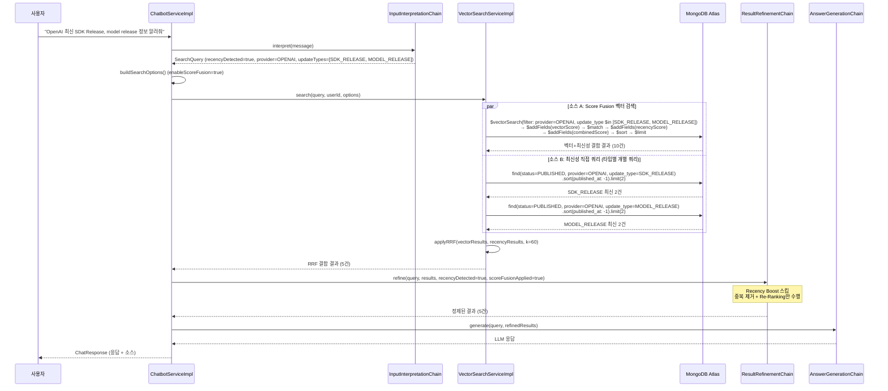
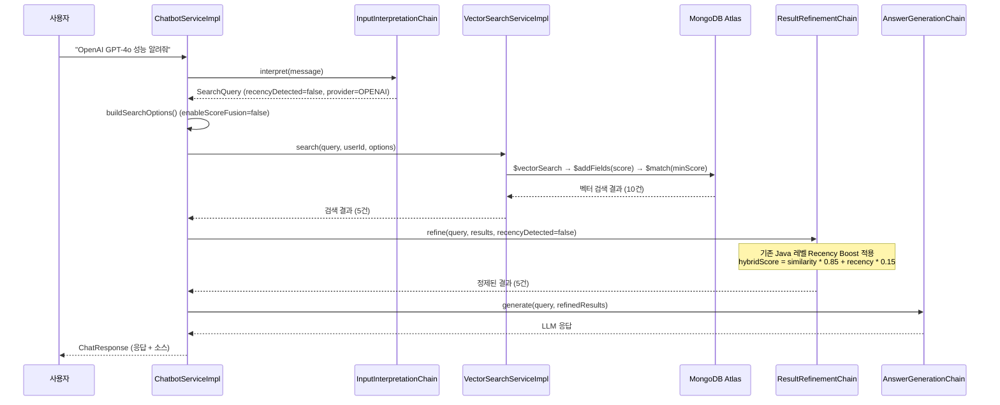
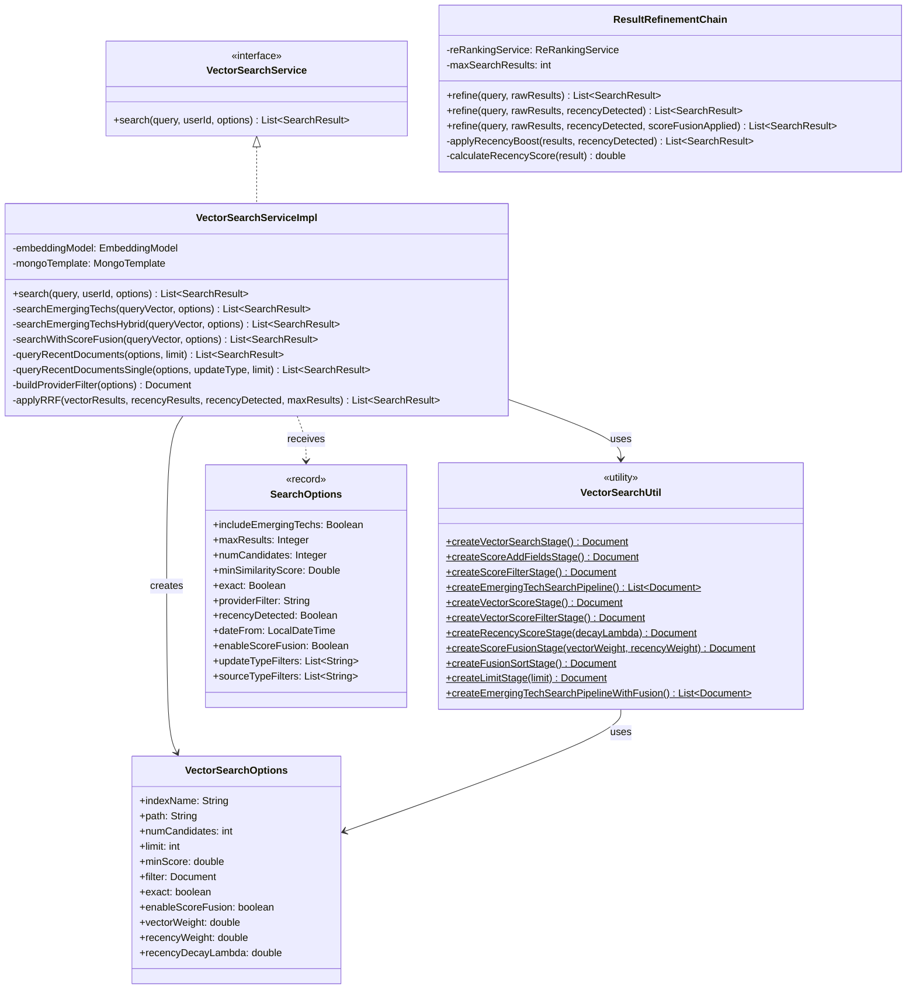

# api-chatbot 하이브리드 검색 Score Fusion 설계서

## 1. 개요

### 1.1 배경 및 목적

현재 `api-chatbot` 모듈의 RAG 파이프라인은 **순수 벡터 유사도(`$vectorSearch`)만으로 상위 결과를 결정**한 후, Java 애플리케이션 레벨에서 Recency Boost를 적용하는 구조이다. 이 방식은 다음과 같은 **최신 문서 누락 문제**를 발생시킨다:

**문제 시나리오**: "최신 OpenAI 업데이트 알려줘" 요청 시, 가장 최근 문서가 아닌 두 번째 최신 문서를 반환

**원인 분석**:
1. `$vectorSearch`는 코사인 유사도 기준으로 `limit` 수만큼 결과를 잘라냄
2. 가장 최신 문서와 이전 문서의 벡터 유사도 차이가 미세할 때, 유사도가 근소하게 높은 이전 문서가 선택됨
3. Java 레벨 Recency Boost는 `$vectorSearch`의 `limit`에서 이미 잘린 이후에 적용되므로, 애초에 결과에 포함되지 않은 최신 문서를 복원할 수 없음

**근본적 한계**: 벡터 검색만으로는 "최신"이라는 의미를 완전히 포착할 수 없다. **시간 기반 직접 쿼리와 벡터 검색을 결합하는 하이브리드 접근**이 필요하다.

본 설계서는 MongoDB 8.2/8.3에서 도입된 `$rankFusion`과 `$scoreFusion` 연산자의 효과를 **MongoDB 8.0 환경**에서 재현하여, 벡터 검색 + 최신성 정렬을 개선하는 하이브리드 검색 아키텍처를 설계한다.

### 1.2 범위

| 구분 | 내용 |
|------|------|
| 대상 모듈 | `api-chatbot`, `domain-mongodb` |
| 변경 범위 | VectorSearchUtil, VectorSearchOptions, VectorSearchServiceImpl, ResultRefinementChain, SearchOptions, ChatbotServiceImpl, InputInterpretationChain, SearchContext |
| 제외 범위 | AnswerGenerationChain, 세션/메시지 관련 Service |

### 1.3 MongoDB `$rankFusion` / `$scoreFusion`과의 관계

| 항목 | MongoDB 네이티브 연산자 | 본 설계 |
|------|----------------------|---------|
| `$rankFusion` (위치 기반) | MongoDB 8.0+ 에서 사용 가능, 단 `$vectorSearch` 입력 파이프라인은 v8.1+ 필요 | 애플리케이션 사이드 RRF 알고리즘으로 재현 |
| `$scoreFusion` (점수 기반) | MongoDB 8.2+ Public Preview | MongoDB 파이프라인 내 `$addFields` + `$exp` + `$dateDiff`로 재현 |

---

## 2. `$rankFusion` / `$scoreFusion` 분석

### 2.1 `$rankFusion` (위치 기반 결합)

#### 정의

`$rankFusion`은 MongoDB Aggregation Pipeline stage로, **Reciprocal Rank Fusion (RRF)** 알고리즘에 따라 여러 입력 파이프라인의 결과를 결합하여 통합 순위를 생성한다.

> 공식 문서: https://www.mongodb.com/docs/manual/reference/operator/aggregation/rankfusion/

#### RRF 알고리즘 공식

```
RRF_score(d) = Σ w_r × (1 / (k + rank_r(d)))
```

- `d`: 문서
- `r`: 각 입력 파이프라인
- `w_r`: 파이프라인 r의 가중치 (기본값: 1.0)
- `rank_r(d)`: 파이프라인 r에서의 문서 d의 순위 (1부터 시작)
- `k`: 민감도 상수 = **60** (MongoDB 공식 기본값, 변경 불가)

#### 동작 방식

1. 각 입력 파이프라인을 독립적으로 실행
2. 각 파이프라인 결과에서 문서의 순위(rank)를 기반으로 RRF 점수 계산
3. 여러 파이프라인에 등장하는 문서는 점수가 합산됨
4. 최종 결과를 RRF 점수 내림차순으로 정렬
5. 중복 제거: 동일 문서가 여러 파이프라인에 등장하더라도 최종 결과에 한 번만 포함

#### 핵심 속성

- **위치 기반**: 원본 점수(score)가 아닌 순위(rank)를 사용하므로, 서로 다른 스케일의 점수를 가진 검색 결과를 자연스럽게 결합
- **k=60의 의미**: 상위 순위에 과도한 가중치가 집중되는 것을 방지하는 smoothing factor. 순위 1인 문서의 점수는 `1/(60+1) ≈ 0.0164`, 순위 60인 문서의 점수는 `1/(60+60) ≈ 0.0083`으로, 상위와 하위의 점수 차이가 완만함
- **가중치 지원**: 각 입력 파이프라인에 가중치를 부여하여 특정 검색 소스의 중요도를 조절 가능

#### MongoDB 버전 요구사항

- `$rankFusion`: MongoDB 8.0+
- `$vectorSearch`를 입력 파이프라인으로 사용: MongoDB 8.1+

> 참고: Cormack, G.V., Clarke, C.L.A., Buettcher, S. (2009). "Reciprocal rank fusion outperforms condorcet and individual rank learning methods." SIGIR '09, pp. 758-759.
> https://dl.acm.org/doi/10.1145/1571941.1572114

### 2.2 `$scoreFusion` (점수 기반 결합)

#### 정의

`$scoreFusion`은 여러 입력 파이프라인의 **점수(score)를 정규화**한 후 가중 평균으로 결합하는 Aggregation Pipeline stage이다. `$rankFusion`과 달리 원본 점수의 크기 정보를 보존하여 더 정밀한 결합이 가능하다.

> 공식 문서: https://www.mongodb.com/docs/manual/reference/operator/aggregation/scorefusion/

#### 점수 정규화 방식

| 방식 | 설명 | 수식 |
|------|------|------|
| `none` | 정규화 없이 원본 점수 사용 | `score_norm = score_raw` |
| `sigmoid` | 시그모이드 함수 적용 (정규분포의 백분위수 계산) | `score_norm = sigmoid(score_raw)` |
| `minMaxScaler` | 결과 집합 내 최소-최대 스케일링 (0~1 범위) | `score_norm = (score - min) / (max - min)` |

#### 결합 방식

- 기본: 정규화된 점수들의 **가중 평균(weighted average)**
- 커스텀: 산술 표현식(arithmetic expression)으로 점수 계산 가능

#### 동작 방식

1. 각 입력 파이프라인을 독립적으로 실행
2. 각 파이프라인 결과의 점수를 선택된 방식으로 정규화
3. 정규화된 점수에 가중치를 적용
4. 가중 평균 또는 커스텀 표현식으로 최종 점수 계산
5. 중복 제거 및 최종 점수 기준 정렬

#### MongoDB 버전 요구사항

- `$scoreFusion`: **MongoDB 8.2+ (Public Preview)**

### 2.3 비교 및 MongoDB 8.0 제약

| 비교 항목 | `$rankFusion` | `$scoreFusion` |
|-----------|--------------|----------------|
| 결합 기준 | 순위(rank) | 점수(score) |
| 점수 정보 보존 | X (순위만 사용) | O (정규화 후 보존) |
| 정규화 필요성 | 불필요 (순위 기반) | 필요 (점수 스케일 통일) |
| 사용 편의성 | 간단 (파라미터 적음) | 유연 (정규화/결합 옵션) |
| 적합한 시나리오 | 이종 검색 소스 결합 | 동종 검색 소스의 정밀 결합 |
| MongoDB 버전 | 8.0+ (8.1+ for $vectorSearch) | 8.2+ |

**MongoDB 8.0 제약**:
- `$rankFusion`은 8.0에서 사용 가능하나, `$vectorSearch`를 입력 파이프라인으로 사용하려면 8.1+ 필요
- `$scoreFusion`은 8.2+ 에서만 사용 가능
- 따라서 **MongoDB Atlas 8.0 환경에서는 두 연산자 모두 `$vectorSearch`와의 결합에 제약**이 있음
- 본 프로젝트는 MongoDB Atlas 8.0.x를 사용하므로, 애플리케이션 사이드에서 동등한 효과를 재현해야 함

---

## 3. 하이브리드 검색 아키텍처 설계

### 3.1 검색 전략 비교 분석

#### 방식 A: 애플리케이션 사이드 RRF

```
벡터 검색 (의미적 관련성) ──┐
                            ├──▶ Java 레벨 RRF 결합 ──▶ 최종 결과
최신성 직접 쿼리 (시간 기반) ─┘
```

| 항목 | 평가 |
|------|------|
| 장점 | 구현이 단순, `$rankFusion`과 동등한 알고리즘, 두 검색 소스의 독립적 실행 보장 |
| 단점 | 벡터 검색 내부에서 이미 최신 문서가 잘리는 문제를 직접 해결하지 못함, 네트워크 왕복 2회 |
| 문제 해결 적합성 | **높음** - 벡터 검색과 독립적인 최신성 쿼리를 결합하여 누락 문서를 보완 |

#### 방식 B: 파이프라인 내 Score Fusion

```
$vectorSearch ──▶ $addFields(recencyScore) ──▶ $addFields(combinedScore) ──▶ $sort ──▶ $limit
```

| 항목 | 평가 |
|------|------|
| 장점 | 단일 파이프라인, `$scoreFusion`과 유사한 효과, 네트워크 효율적, DB 레벨 정렬 |
| 단점 | `$vectorSearch`의 `limit`으로 이미 잘린 결과에만 적용 가능, 근본 문제 부분 해결 |
| 문제 해결 적합성 | **중간** - `numCandidates`와 `limit`을 증가시켜 더 넓은 후보군에 적용 가능하나, 완전한 해결은 아님 |

#### 방식 C: 하이브리드 (A+B)

```
파이프라인 내 Score Fusion ──┐
                              ├──▶ Java 레벨 RRF 결합 ──▶ 최종 결과
최신성 직접 쿼리 (시간 기반) ───┘
```

| 항목 | 평가 |
|------|------|
| 장점 | 두 연산자 모두 활용, 벡터 검색 내에서 최신성 반영 + 독립적 최신 문서 보장 |
| 단점 | 구현 복잡도 증가, 가중치 튜닝 포인트 증가 |
| 문제 해결 적합성 | **매우 높음** - 벡터 검색 파이프라인 내에서 최신성을 고려하면서, 별도 직접 쿼리로 최신 문서 누락을 완전히 방지 |

#### 선택: 방식 C (하이브리드)

**선택 근거**:
1. **문제의 근본 원인 해결**: 벡터 검색 파이프라인 내 Score Fusion으로 `$vectorSearch` → `$sort(combinedScore)` 시 최신성이 반영된 순서로 결과 제한
2. **최신 문서 보장**: 별도 최신성 직접 쿼리(published_at DESC)로 벡터 검색에서 누락된 최신 문서를 반드시 결과에 포함
3. **점진적 적용 가능**: `enableScoreFusion=false`로 기존 동작 유지 (하위 호환성)

### 3.2 MongoDB 파이프라인 Score Fusion 설계

#### 파이프라인 stage 상세 설계

기존 파이프라인에 4개의 stage를 추가하여 Score Fusion을 구현한다:

**기존 파이프라인 (Score Fusion 비활성화 시)**:
```
$vectorSearch → $addFields(score) → $match(minScore)
```

**Score Fusion 파이프라인 (Score Fusion 활성화 시)**:
```
$vectorSearch → $addFields(vectorScore) → $match(minScore) → $addFields(recencyScore) → $addFields(combinedScore) → $sort(combinedScore) → $limit(maxResults)
```

#### Stage 1: `$addFields` - vectorScore 추출 (기존 createScoreAddFieldsStage() 재사용)

```javascript
// MongoDB JSON
{ "$addFields": { "vectorScore": { "$meta": "vectorSearchScore" } } }
```

```java
// Java - 기존 메서드의 필드명만 변경
public static Document createVectorScoreStage() {
    return new Document("$addFields",
        new Document("vectorScore", new Document("$meta", "vectorSearchScore")));
}
```

> 기존 `createScoreAddFieldsStage()`의 `"score"` 필드와 구분하기 위해 `"vectorScore"` 필드명 사용.
> Score Fusion 비활성화 시에는 기존 `createScoreAddFieldsStage()`가 `"score"` 필드를 계속 사용.

#### Stage 2: `$addFields` - recencyScore 계산 (Exponential Decay)

```javascript
// MongoDB JSON
{
  "$addFields": {
    "recencyScore": {
      "$cond": {
        "if": { "$ifNull": ["$published_at", false] },
        "then": {
          "$exp": {
            "$multiply": [
              -0.00274,  // -λ = -1.0/365.0
              {
                "$dateDiff": {
                  "startDate": "$published_at",
                  "endDate": "$$NOW",
                  "unit": "day"
                }
              }
            ]
          }
        },
        "else": 0.5  // published_at이 null이면 중간값
      }
    }
  }
}
```

> `$dateDiff`: MongoDB 5.0+ 지원. `startDate`부터 `endDate`까지의 정수 차이를 반환.
> 공식 문서: https://www.mongodb.com/docs/manual/reference/operator/aggregation/dateDiff/

> `$exp`: MongoDB 4.2+ 지원. `e^x`를 반환. Exponential Decay 계산에 사용.
> 공식 문서: https://www.mongodb.com/docs/manual/reference/operator/aggregation/exp/

```java
// Java
public static Document createRecencyScoreStage(double decayLambda) {
    // daysSincePublished = $dateDiff(published_at, $$NOW, "day")
    Document dateDiff = new Document("$dateDiff", new Document()
        .append("startDate", "$published_at")
        .append("endDate", "$$NOW")
        .append("unit", "day"));

    // recencyScore = exp(-λ * daysSincePublished)
    Document exponentialDecay = new Document("$exp",
        new Document("$multiply", List.of(-decayLambda, dateDiff)));

    // null 안전 처리: published_at이 null이면 0.5
    Document recencyScore = new Document("$cond", new Document()
        .append("if", new Document("$ifNull", List.of("$published_at", false)))
        .append("then", exponentialDecay)
        .append("else", 0.5));

    return new Document("$addFields", new Document("recencyScore", recencyScore));
}
```

#### Exponential Decay 함수 설계

**선택한 함수**: Exponential Decay

```
recencyScore = e^(-λ × daysSincePublished)
```

| Decay 함수 | 수식 | 특성 | 선택 여부 |
|------------|------|------|----------|
| **Exponential** | `e^(-λ × t)` | 최근 시간에 빠르게 감소, 오래된 문서는 거의 0에 수렴 | **선택** |
| Hyperbolic | `1 / (1 + t/T)` | 감소가 완만, 오래된 문서도 유의미한 점수 유지 | 기존 방식 |
| Gaussian | `e^(-(t/σ)²)` | 특정 시점 주변에 집중, 너무 빠르게 감소 | 미적용 |

**Exponential Decay 선택 근거**:
- `$scoreFusion`의 점수 정규화와 유사하게 0~1 범위의 점수 생성
- 최근 문서에 대한 명확한 선호도 표현 (7일 이내 문서: 0.98+)
- Hyperbolic 방식(현재)보다 최신 문서와 오래된 문서 간 점수 차이가 뚜렷
- MongoDB `$exp` 연산자로 직접 계산 가능 (DB 레벨 처리)

**λ 값 비교** (λ = 1.0/365.0 ≈ 0.00274):

| 경과 일수 | Exponential `e^(-t/365)` | Hyperbolic `1/(1+t/365)` |
|-----------|--------------------------|--------------------------|
| 0일 (오늘) | 1.000 | 1.000 |
| 7일 | 0.981 | 0.981 |
| 30일 | 0.921 | 0.924 |
| 90일 | 0.781 | 0.802 |
| 180일 | 0.610 | 0.670 |
| 365일 | 0.368 | 0.500 |

#### Stage 3: `$addFields` - combinedScore 계산

```javascript
// MongoDB JSON - 일반 쿼리 (vectorWeight=0.85, recencyWeight=0.15)
{
  "$addFields": {
    "combinedScore": {
      "$add": [
        { "$multiply": ["$vectorScore", 0.85] },
        { "$multiply": ["$recencyScore", 0.15] }
      ]
    }
  }
}
```

```java
// Java
public static Document createScoreFusionStage(double vectorWeight, double recencyWeight) {
    Document combinedScore = new Document("$add", List.of(
        new Document("$multiply", List.of("$vectorScore", vectorWeight)),
        new Document("$multiply", List.of("$recencyScore", recencyWeight))
    ));

    return new Document("$addFields", new Document("combinedScore", combinedScore));
}
```

#### 가중치 전략

| 쿼리 유형 | vectorWeight | recencyWeight | 근거 |
|-----------|-------------|---------------|------|
| 일반 쿼리 | 0.85 | 0.15 | 의미적 관련성이 우선, 최신성은 보조 |
| 최신성 쿼리 | 0.5 | 0.5 | "최신", "최근" 키워드 감지 시 최신성 동등 반영 |

> 현재 Java 레벨 Recency Boost와 동일한 가중치를 사용하여 일관성 유지.

#### Stage 4: `$sort` + `$limit` - 최종 정렬

```javascript
// MongoDB JSON
{ "$sort": { "combinedScore": -1 } }
{ "$limit": 10 }
```

```java
// Java
public static Document createFusionSortStage() {
    return new Document("$sort", new Document("combinedScore", -1));
}

public static Document createLimitStage(int limit) {
    return new Document("$limit", limit);
}
```

#### 전체 Score Fusion 파이프라인

```javascript
// MongoDB Aggregation Pipeline (Score Fusion 활성화)
[
  // 1. $vectorSearch - 벡터 유사도 검색 (numCandidates 증가)
  { "$vectorSearch": {
      "index": "vector_index_emerging_techs",
      "path": "embedding_vector",
      "queryVector": [/* 1536 floats */],
      "numCandidates": 200,
      "limit": 20,
      "filter": { "$and": [{ "status": "PUBLISHED" }, /* provider, update_type filter */] }
  }},
  // 2. vectorScore 추출
  { "$addFields": { "vectorScore": { "$meta": "vectorSearchScore" } } },
  // 3. 최소 점수 필터링
  { "$match": { "vectorScore": { "$gte": 0.7 } } },
  // 4. recencyScore 계산 (Exponential Decay)
  { "$addFields": {
      "recencyScore": {
        "$cond": {
          "if": { "$ifNull": ["$published_at", false] },
          "then": { "$exp": { "$multiply": [-0.00274, { "$dateDiff": { "startDate": "$published_at", "endDate": "$$NOW", "unit": "day" } }] } },
          "else": 0.5
        }
      }
  }},
  // 5. combinedScore 계산
  { "$addFields": {
      "combinedScore": { "$add": [
        { "$multiply": ["$vectorScore", 0.85] },
        { "$multiply": ["$recencyScore", 0.15] }
      ]}
  }},
  // 6. combinedScore 기준 정렬
  { "$sort": { "combinedScore": -1 } },
  // 7. 최종 결과 수 제한
  { "$limit": 10 }
]
```

### 3.3 최신성 직접 쿼리 설계

벡터 검색과 독립적으로 최신 문서를 직접 조회하여, 벡터 검색에서 누락될 수 있는 최신 문서를 보장한다.

#### 쿼리 조건

소스 B는 일반 MongoDB `find()` 쿼리이므로 Vector Search Index의 filter 필드 제약과 무관하게 어떤 필드든 필터링할 수 있다. `provider`, `update_type`, `source_type` 필터를 모두 지원한다.

#### 다중 provider / update_type 쿼리 전략: 차원별 개별 쿼리

다중 `provider`나 `update_type`을 단일 `$in` 쿼리로 처리하면, 특정 값의 문서가 최근에 집중된 경우 다른 값의 최신 문서가 `limit`에 의해 제외될 수 있다.

**문제 시나리오** (`$in` + 글로벌 정렬):
```
OPENAI: 1/20, 1/19, 1/18, 1/17, 1/16  ← limit(5)에 모두 포함
ANTHROPIC: 1/15  ← 제외됨
```

이를 방지하기 위해, **다중 값일 때는 차원별로 개별 쿼리**하여 각 값의 최신 문서를 보장한다.

#### 전략 매트릭스

| Providers | UpdateTypes | 전략 | 쿼리 수 |
|-----------|-------------|------|---------|
| 0/1 | 0/1 | 단일 쿼리 | 1 |
| N(>1) | 0/1 | provider별 개별 쿼리 | N |
| 0/1 | M(>1) | updateType별 개별 쿼리 | M |
| N(>1) | M(>1), N×M≤20 | **교차 개별 쿼리** | N×M |
| N(>1) | M(>1), N×M>20 | `$in` fallback 쿼리 | 1 |

#### 다중 provider 쿼리 예시

```javascript
// 단일 provider: 단일 쿼리
db.emerging_techs.find({ "status": "PUBLISHED", "provider": "OPENAI" })
  .sort({ "published_at": -1 }).limit(5)

// 다중 provider: provider별 개별 쿼리 후 합산
// 쿼리 1: OPENAI 최신 2건
db.emerging_techs.find({ "status": "PUBLISHED", "provider": "OPENAI" })
  .sort({ "published_at": -1 }).limit(2)
// 쿼리 2: ANTHROPIC 최신 2건
db.emerging_techs.find({ "status": "PUBLISHED", "provider": "ANTHROPIC" })
  .sort({ "published_at": -1 }).limit(2)
// → 합산: 최대 4건을 RRF에 투입
```

#### 교차 쿼리 예시 (provider × update_type)

```javascript
// "OpenAI, Anthropic 최신 SDK, Model release 비교해줘"
// → providers=[OPENAI, ANTHROPIC], updateTypes=[SDK_RELEASE, MODEL_RELEASE]
// → 2×2 = 4 교차 쿼리

// 쿼리 1: (OPENAI, SDK_RELEASE) 최신 2건
db.emerging_techs.find({ "status": "PUBLISHED", "provider": "OPENAI", "update_type": "SDK_RELEASE" })
  .sort({ "published_at": -1 }).limit(2)
// 쿼리 2: (OPENAI, MODEL_RELEASE) 최신 2건
db.emerging_techs.find({ "status": "PUBLISHED", "provider": "OPENAI", "update_type": "MODEL_RELEASE" })
  .sort({ "published_at": -1 }).limit(2)
// 쿼리 3: (ANTHROPIC, SDK_RELEASE) 최신 2건
db.emerging_techs.find({ "status": "PUBLISHED", "provider": "ANTHROPIC", "update_type": "SDK_RELEASE" })
  .sort({ "published_at": -1 }).limit(2)
// 쿼리 4: (ANTHROPIC, MODEL_RELEASE) 최신 2건
db.emerging_techs.find({ "status": "PUBLISHED", "provider": "ANTHROPIC", "update_type": "MODEL_RELEASE" })
  .sort({ "published_at": -1 }).limit(2)
// → 합산: 최대 8건을 RRF에 투입
```

```java
// Java - VectorSearchServiceImpl
private static final int MAX_CROSS_PRODUCT_COMBINATIONS = 20;
private static final int MIN_RESULTS_PER_COMBINATION = 2;

private List<SearchResult> queryRecentDocuments(SearchOptions options, int limit) {
    List<String> providers = options.providerFilters();
    List<String> updateTypes = options.updateTypeFilters();
    boolean multiProvider = providers != null && providers.size() > 1;
    boolean multiUpdateType = updateTypes != null && updateTypes.size() > 1;

    // 다중 provider + 다중 updateType: 교차 쿼리 또는 $in fallback
    if (multiProvider && multiUpdateType) {
        int totalCombinations = providers.size() * updateTypes.size();
        if (totalCombinations > MAX_CROSS_PRODUCT_COMBINATIONS) {
            return queryRecentDocumentsSingle(options, null, null, limit); // $in fallback
        }
        int perCombinationLimit = Math.max(MIN_RESULTS_PER_COMBINATION,
            limit / totalCombinations);
        List<SearchResult> allResults = new ArrayList<>();
        for (String provider : providers) {
            for (String updateType : updateTypes) {
                allResults.addAll(queryRecentDocumentsSingle(
                    options, provider, updateType, perCombinationLimit));
            }
        }
        return allResults;
    }

    // 다중 provider only
    if (multiProvider) {
        String singleType = (updateTypes != null && updateTypes.size() == 1)
            ? updateTypes.get(0) : null;
        int perProviderLimit = Math.max(MIN_RESULTS_PER_COMBINATION,
            limit / providers.size());
        List<SearchResult> allResults = new ArrayList<>();
        for (String provider : providers) {
            allResults.addAll(queryRecentDocumentsSingle(
                options, provider, singleType, perProviderLimit));
        }
        return allResults;
    }

    // 다중 updateType only (기존 로직)
    if (multiUpdateType) {
        String singleProvider = (providers != null && providers.size() == 1)
            ? providers.get(0) : null;
        int perTypeLimit = Math.max(MIN_RESULTS_PER_COMBINATION,
            limit / updateTypes.size());
        List<SearchResult> allResults = new ArrayList<>();
        for (String updateType : updateTypes) {
            allResults.addAll(queryRecentDocumentsSingle(
                options, singleProvider, updateType, perTypeLimit));
        }
        return allResults;
    }

    // 단일 또는 필터 없음
    String singleProvider = (providers != null && providers.size() == 1)
        ? providers.get(0) : null;
    String singleType = (updateTypes != null && updateTypes.size() == 1)
        ? updateTypes.get(0) : null;
    return queryRecentDocumentsSingle(options, singleProvider, singleType, limit);
}

private List<SearchResult> queryRecentDocumentsSingle(
        SearchOptions options, String provider, String updateType, int limit) {
    Query query = new Query();
    query.addCriteria(Criteria.where("status").is("PUBLISHED"));

    // provider 필터: 명시적 단일 값 > options의 다중 값 ($in)
    if (provider != null && !provider.isBlank()) {
        query.addCriteria(Criteria.where("provider").is(provider));
    } else if (options.providerFilters() != null && !options.providerFilters().isEmpty()) {
        if (options.providerFilters().size() == 1) {
            query.addCriteria(Criteria.where("provider").is(options.providerFilters().get(0)));
        } else {
            query.addCriteria(Criteria.where("provider").in(options.providerFilters()));
        }
    }

    // update_type 필터: 명시적 단일 값 > options의 다중 값 ($in)
    if (updateType != null) {
        query.addCriteria(Criteria.where("update_type").is(updateType));
    } else if (options.updateTypeFilters() != null && !options.updateTypeFilters().isEmpty()) {
        if (options.updateTypeFilters().size() == 1) {
            query.addCriteria(Criteria.where("update_type").is(options.updateTypeFilters().get(0)));
        } else {
            query.addCriteria(Criteria.where("update_type").in(options.updateTypeFilters()));
        }
    }

    // source_type, dateFrom 필터 (기존)
    if (options.sourceTypeFilters() != null && !options.sourceTypeFilters().isEmpty()) {
        if (options.sourceTypeFilters().size() == 1) {
            query.addCriteria(Criteria.where("source_type").is(options.sourceTypeFilters().get(0)));
        } else {
            query.addCriteria(Criteria.where("source_type").in(options.sourceTypeFilters()));
        }
    }
    if (options.dateFrom() != null) {
        query.addCriteria(Criteria.where("published_at").gte(options.dateFrom()));
    }

    query.with(Sort.by(Sort.Direction.DESC, "published_at"));
    query.limit(limit);

    List<Document> docs = mongoTemplate.find(query, Document.class,
        VectorSearchUtil.COLLECTION_EMERGING_TECHS);
    return docs.stream()
        .map(doc -> convertToSearchResult(doc, "EMERGING_TECH"))
        .collect(Collectors.toList());
}
```

#### 직접 쿼리 결과 크기

| 쿼리 유형 | 직접 쿼리 limit | 근거 |
|-----------|----------------|------|
| 일반 쿼리 | 3 | 벡터 검색 결과 보충용 |
| 최신성 쿼리 | 5 | 최신 문서 우선 확보 |

### 3.4 결과 결합 알고리즘

#### Reciprocal Rank Fusion (RRF) 구현

벡터 검색(Score Fusion 적용)과 직접 쿼리 결과를 RRF 알고리즘으로 결합한다.

```
RRF_score(d) = Σ w_r × (1 / (k + rank_r(d)))
```

- `k = 60` (MongoDB 공식 기본값)
- `w_vector = 1.0` (벡터 검색 소스 가중치)
- `w_recency = 1.0` (최신성 쿼리 소스 가중치, 최신성 쿼리 시 1.5)

```java
// Java - RRF 결합 알고리즘
private List<SearchResult> applyRRF(
        List<SearchResult> vectorResults,
        List<SearchResult> recencyResults,
        boolean recencyDetected,
        int maxResults) {

    final int k = 60;
    double vectorWeight = 1.0;
    double recencyWeight = recencyDetected ? 1.5 : 1.0;

    Map<String, Double> rrfScores = new LinkedHashMap<>();
    Map<String, SearchResult> documentMap = new LinkedHashMap<>();

    // 벡터 검색 결과 RRF 점수 계산
    for (int rank = 0; rank < vectorResults.size(); rank++) {
        SearchResult result = vectorResults.get(rank);
        String docId = result.documentId();
        double score = vectorWeight * (1.0 / (k + rank + 1));
        rrfScores.merge(docId, score, Double::sum);
        documentMap.putIfAbsent(docId, result);
    }

    // 최신성 직접 쿼리 결과 RRF 점수 계산
    for (int rank = 0; rank < recencyResults.size(); rank++) {
        SearchResult result = recencyResults.get(rank);
        String docId = result.documentId();
        double score = recencyWeight * (1.0 / (k + rank + 1));
        rrfScores.merge(docId, score, Double::sum);
        documentMap.putIfAbsent(docId, result);
    }

    // RRF 점수 기준 정렬 및 반환
    return rrfScores.entrySet().stream()
        .sorted(Map.Entry.<String, Double>comparingByValue().reversed())
        .limit(maxResults)
        .map(entry -> SearchResult.builder()
            .documentId(entry.getKey())
            .text(documentMap.get(entry.getKey()).text())
            .score(entry.getValue())
            .collectionType(documentMap.get(entry.getKey()).collectionType())
            .metadata(documentMap.get(entry.getKey()).metadata())
            .build())
        .collect(Collectors.toList());
}
```

#### 중복 제거

- RRF 알고리즘 자체에서 `documentId` 기준 자동 중복 제거 (같은 문서가 두 소스에서 등장하면 점수 합산)
- `$rankFusion`의 네이티브 중복 제거와 동일한 동작

---

## 4. 컴포넌트 설계

### 4.1 VectorSearchOptions 확장

**파일**: `domain/mongodb/src/main/java/.../util/VectorSearchOptions.java`

Score Fusion을 위한 새로운 필드를 추가한다:

```java
@Value
@Builder
public class VectorSearchOptions {

    // === 기존 필드 (변경 없음) ===
    String indexName;
    String path;
    int numCandidates;
    int limit;
    double minScore;
    Document filter;
    boolean exact;

    // === Score Fusion 신규 필드 ===

    /**
     * 파이프라인 내 Score Fusion 활성화 여부
     * false이면 기존 파이프라인 동작 유지
     */
    boolean enableScoreFusion;

    /**
     * 벡터 유사도 가중치 (Score Fusion용)
     * 기본값: 0.85 (일반 쿼리), 0.5 (최신성 쿼리)
     */
    double vectorWeight;

    /**
     * 최신성 가중치 (Score Fusion용)
     * 기본값: 0.15 (일반 쿼리), 0.5 (최신성 쿼리)
     */
    double recencyWeight;

    /**
     * Exponential Decay 계수 (λ)
     * recencyScore = e^(-λ × daysSincePublished)
     * 기본값: 1.0/365.0 ≈ 0.00274 (1년 기준)
     */
    double recencyDecayLambda;

    public static class VectorSearchOptionsBuilder {
        private String path = "embedding_vector";
        private int numCandidates = 100;
        private int limit = 5;
        private double minScore = 0.7;
        private boolean exact = false;
        // Score Fusion 기본값
        private boolean enableScoreFusion = false;
        private double vectorWeight = 0.85;
        private double recencyWeight = 0.15;
        private double recencyDecayLambda = 1.0 / 365.0;
    }

    public static VectorSearchOptions defaults(String indexName) {
        return VectorSearchOptions.builder()
            .indexName(indexName)
            .build();
    }
}
```

### 4.2 VectorSearchUtil 확장

**파일**: `domain/mongodb/src/main/java/.../util/VectorSearchUtil.java`

기존 메서드는 **수정하지 않고**, Score Fusion용 새 메서드를 추가한다:

```java
public final class VectorSearchUtil {

    // === 기존 메서드 (변경 없음) ===
    // createVectorSearchStage()
    // createScoreAddFieldsStage()
    // createScoreFilterStage()
    // createProjectionStage()
    // createEmergingTechSearchPipeline()
    // createBookmarkSearchPipeline()

    // === Score Fusion 신규 메서드 ===

    /**
     * Score Fusion용 vectorScore 추출 stage
     * 기존 createScoreAddFieldsStage()의 "score" 대신 "vectorScore" 사용
     */
    public static Document createVectorScoreStage() {
        return new Document("$addFields",
            new Document("vectorScore", new Document("$meta", "vectorSearchScore")));
    }

    /**
     * Score Fusion용 vectorScore 필터링 stage
     */
    public static Document createVectorScoreFilterStage(double minScore) {
        return new Document("$match",
            new Document("vectorScore", new Document("$gte", minScore)));
    }

    /**
     * Recency Score 계산 stage (Exponential Decay)
     * recencyScore = e^(-λ × daysSincePublished)
     * published_at이 null이면 기본값 0.5
     *
     * @param decayLambda Exponential Decay 계수 (기본값: 1.0/365.0)
     */
    public static Document createRecencyScoreStage(double decayLambda) {
        Document dateDiff = new Document("$dateDiff", new Document()
            .append("startDate", "$published_at")
            .append("endDate", "$$NOW")
            .append("unit", "day"));

        Document exponentialDecay = new Document("$exp",
            new Document("$multiply", List.of(-decayLambda, dateDiff)));

        Document recencyScore = new Document("$cond", new Document()
            .append("if", new Document("$ifNull", List.of("$published_at", false)))
            .append("then", exponentialDecay)
            .append("else", 0.5));

        return new Document("$addFields", new Document("recencyScore", recencyScore));
    }

    /**
     * Score Fusion stage (가중 결합)
     * combinedScore = vectorScore × vectorWeight + recencyScore × recencyWeight
     *
     * @param vectorWeight 벡터 유사도 가중치
     * @param recencyWeight 최신성 가중치
     */
    public static Document createScoreFusionStage(double vectorWeight, double recencyWeight) {
        Document combinedScore = new Document("$add", List.of(
            new Document("$multiply", List.of("$vectorScore", vectorWeight)),
            new Document("$multiply", List.of("$recencyScore", recencyWeight))
        ));

        return new Document("$addFields", new Document("combinedScore", combinedScore));
    }

    /**
     * Score Fusion 결과 정렬 stage
     */
    public static Document createFusionSortStage() {
        return new Document("$sort", new Document("combinedScore", -1));
    }

    /**
     * 결과 수 제한 stage
     */
    public static Document createLimitStage(int limit) {
        return new Document("$limit", limit);
    }

    /**
     * Emerging Tech 컬렉션 Score Fusion 파이프라인 생성
     * 기존 createEmergingTechSearchPipeline()을 확장하여 Score Fusion stage 추가
     *
     * @param queryVector 쿼리 벡터
     * @param options 검색 옵션 (enableScoreFusion=true 필요)
     * @return aggregation pipeline
     */
    public static List<Document> createEmergingTechSearchPipelineWithFusion(
            List<Float> queryVector,
            VectorSearchOptions options) {

        List<Document> pipeline = new ArrayList<>();

        // status: "PUBLISHED" pre-filter 생성 (기존 로직 재사용)
        Document statusFilter = new Document("status", "PUBLISHED");
        Document combinedFilter;

        if (options.getFilter() != null && !options.getFilter().isEmpty()) {
            combinedFilter = new Document("$and", List.of(statusFilter, options.getFilter()));
        } else {
            combinedFilter = statusFilter;
        }

        VectorSearchOptions fusionOptions = VectorSearchOptions.builder()
            .indexName(options.getIndexName() != null ? options.getIndexName() : INDEX_EMERGING_TECHS)
            .path(options.getPath())
            .numCandidates(options.getNumCandidates())
            .limit(options.getLimit())
            .minScore(options.getMinScore())
            .filter(combinedFilter)
            .exact(options.isExact())
            .build();

        // 1. $vectorSearch stage
        pipeline.add(createVectorSearchStage(queryVector, fusionOptions));

        // 2. vectorScore 추출 (Score Fusion용 필드명)
        pipeline.add(createVectorScoreStage());

        // 3. 최소 점수 필터링
        if (options.getMinScore() > 0) {
            pipeline.add(createVectorScoreFilterStage(options.getMinScore()));
        }

        // 4. recencyScore 계산
        pipeline.add(createRecencyScoreStage(options.getRecencyDecayLambda()));

        // 5. combinedScore 계산
        pipeline.add(createScoreFusionStage(options.getVectorWeight(), options.getRecencyWeight()));

        // 6. combinedScore 기준 정렬
        pipeline.add(createFusionSortStage());

        // 7. 최종 결과 수 제한
        pipeline.add(createLimitStage(options.getLimit()));

        return pipeline;
    }
}
```

### 4.3 VectorSearchServiceImpl 변경

**파일**: `api/chatbot/src/main/java/.../service/VectorSearchServiceImpl.java`

`searchEmergingTechs()` 메서드에 하이브리드 검색 로직을 추가한다:

```java
@Slf4j
@Service
@RequiredArgsConstructor
public class VectorSearchServiceImpl implements VectorSearchService {

    private final EmbeddingModel embeddingModel;
    private final MongoTemplate mongoTemplate;

    @Override
    public List<SearchResult> search(String query, Long userId, SearchOptions options) {
        Embedding embedding = embeddingModel.embed(query).content();
        List<Float> queryVector = embedding.vectorAsList();

        List<SearchResult> results;

        if (Boolean.TRUE.equals(options.enableScoreFusion())) {
            // 하이브리드 검색: Score Fusion + 최신성 직접 쿼리 + RRF 결합
            results = searchEmergingTechsHybrid(queryVector, options);
        } else {
            // 기존 검색: 벡터 검색만
            results = searchEmergingTechs(queryVector, options);
        }

        return results.stream()
            .sorted((a, b) -> Double.compare(b.score(), a.score()))
            .limit(options.maxResults())
            .collect(Collectors.toList());
    }

    /**
     * 하이브리드 검색: Score Fusion 파이프라인 + 최신성 직접 쿼리 + RRF 결합
     */
    private List<SearchResult> searchEmergingTechsHybrid(
            List<Float> queryVector, SearchOptions options) {
        try {
            // 소스 A: Score Fusion 벡터 검색
            List<SearchResult> vectorResults = searchWithScoreFusion(queryVector, options);
            log.info("Score Fusion vector search completed: {} results", vectorResults.size());

            // 소스 B: 최신성 직접 쿼리
            boolean isRecency = Boolean.TRUE.equals(options.recencyDetected());
            int recencyLimit = isRecency ? 5 : 3;
            List<SearchResult> recencyResults;
            try {
                recencyResults = queryRecentDocuments(options, recencyLimit);
                log.info("Recency query completed: {} results", recencyResults.size());
            } catch (Exception e) {
                log.warn("Recency query failed, using vector results only: {}", e.getMessage());
                recencyResults = Collections.emptyList();
            }

            // RRF 결합
            int maxResults = options.maxResults() != null ? options.maxResults() : 5;
            List<SearchResult> combined = applyRRF(vectorResults, recencyResults, isRecency, maxResults);
            log.info("RRF combination completed: {} results (recencyDetected={})", combined.size(), isRecency);

            return combined;

        } catch (Exception e) {
            log.error("Hybrid search failed, falling back to standard search: {}",
                e.getMessage(), e);
            return searchEmergingTechs(queryVector, options);
        }
    }

    /**
     * Score Fusion 벡터 검색 (파이프라인 내 recency + vector 결합)
     */
    private List<SearchResult> searchWithScoreFusion(
            List<Float> queryVector, SearchOptions options) {
        // 기존보다 넓은 후보군 확보
        boolean isRecency = Boolean.TRUE.equals(options.recencyDetected());
        int searchLimit = (options.maxResults() != null ? options.maxResults() : 5) * 3;

        VectorSearchOptions vectorOptions = VectorSearchOptions.builder()
            .indexName(VectorSearchUtil.INDEX_EMERGING_TECHS)
            .numCandidates(isRecency ? 200 : 150)
            .limit(searchLimit)
            .minScore(options.minSimilarityScore() != null ? options.minSimilarityScore() : 0.7)
            .exact(Boolean.TRUE.equals(options.exact()))
            .filter(buildProviderFilter(options))
            .enableScoreFusion(true)
            .vectorWeight(isRecency ? 0.5 : 0.85)
            .recencyWeight(isRecency ? 0.5 : 0.15)
            .build();

        List<Document> pipeline =
            VectorSearchUtil.createEmergingTechSearchPipelineWithFusion(queryVector, vectorOptions);

        List<Document> results = mongoTemplate
            .getCollection(VectorSearchUtil.COLLECTION_EMERGING_TECHS)
            .aggregate(pipeline)
            .into(new ArrayList<>());

        return results.stream()
            .map(doc -> convertToSearchResult(doc, "EMERGING_TECH"))
            .collect(Collectors.toList());
    }

    // queryRecentDocuments(), queryRecentDocumentsSingle() - 3.3절 참조
    // applyRRF() - 3.4절 참조
    // searchEmergingTechs() - 기존 메서드 유지 (변경 없음)
    // convertToSearchResult() - 기존 메서드 유지 (변경 없음)
    // buildProviderFilter() - provider + update_type + 날짜 pre-filter 생성 (4.3.1절 참조)
}
```

### 4.3.1 buildProviderFilter() - provider + update_type + 날짜 pre-filter 생성

`$vectorSearch`의 pre-filter에 사용할 필터 Document를 생성한다. Vector Search Index에 등록된 필드(`provider`, `update_type`, `published_at`)만 사용한다.

> 주의: `source_type`은 Vector Search Index에 미등록이므로 `$vectorSearch` pre-filter에 포함하지 않는다.
> `source_type` 필터는 소스 B(`queryRecentDocumentsSingle()`)에서만 적용된다.

다중 `provider` 필터는 `update_type`과 동일한 패턴으로 처리한다:
- 단일 값: 직접 equality 매칭 (`{provider: "OPENAI"}`)
- 다중 값: `$in` 연산자 사용 (`{provider: {$in: ["OPENAI", "ANTHROPIC"]}}`)

```java
private Document buildProviderFilter(SearchOptions options) {
    List<Document> filters = new ArrayList<>();

    if (options.providerFilters() != null && !options.providerFilters().isEmpty()) {
        if (options.providerFilters().size() == 1) {
            filters.add(new Document("provider", options.providerFilters().get(0)));
        } else {
            filters.add(new Document("provider",
                new Document("$in", options.providerFilters())));
        }
    }

    if (options.updateTypeFilters() != null && !options.updateTypeFilters().isEmpty()) {
        if (options.updateTypeFilters().size() == 1) {
            filters.add(new Document("update_type", options.updateTypeFilters().get(0)));
        } else {
            filters.add(new Document("update_type",
                new Document("$in", options.updateTypeFilters())));
        }
    }

    if (options.dateFrom() != null) {
        java.util.Date dateFromAsDate = java.sql.Timestamp.valueOf(options.dateFrom());
        filters.add(new Document("published_at",
            new Document("$gte", dateFromAsDate)));
    }

    if (filters.size() == 1) {
        return filters.get(0);
    } else if (filters.size() > 1) {
        return new Document("$and", filters);
    }
    return null;
}
```

### 4.4 ResultRefinementChain 변경

**파일**: `api/chatbot/src/main/java/.../chain/ResultRefinementChain.java`

Score Fusion이 파이프라인에서 이미 적용된 경우, Java 레벨 Recency Boost를 스킵한다:

```java
public List<SearchResult> refine(String query, List<SearchResult> rawResults,
                                  boolean recencyDetected) {
    return refine(query, rawResults, recencyDetected, false);
}

/**
 * 검색 결과 정제 (Score Fusion 적용 여부에 따라 분기)
 *
 * @param query 원본 쿼리
 * @param rawResults 원본 검색 결과
 * @param recencyDetected 최신성 키워드 감지 여부
 * @param scoreFusionApplied Score Fusion이 파이프라인에서 이미 적용되었는지 여부
 */
public List<SearchResult> refine(String query, List<SearchResult> rawResults,
                                  boolean recencyDetected, boolean scoreFusionApplied) {
    // 1. 중복 제거
    List<SearchResult> deduplicated = removeDuplicates(rawResults);

    // 2. Re-Ranking 적용 (활성화된 경우)
    if (reRankingService.isEnabled()) {
        log.info("Applying Re-Ranking for query: {}", query);
        deduplicated = reRankingService.rerank(query, deduplicated, maxSearchResults * 2);
    }

    // 3. Score Fusion이 파이프라인에서 이미 적용된 경우 Recency Boost 스킵
    if (scoreFusionApplied) {
        log.info("Score Fusion already applied in pipeline, skipping Java-level recency boost");
        return deduplicated.stream()
            .sorted(Comparator.comparing(SearchResult::score).reversed())
            .limit(maxSearchResults)
            .collect(Collectors.toList());
    }

    // 4. 기존 Recency Boost 적용 (fallback)
    return applyRecencyBoost(deduplicated, recencyDetected);
}
```

### 4.5 SearchOptions 확장

**파일**: `api/chatbot/src/main/java/.../service/dto/SearchOptions.java`

Score Fusion 활성화 필드를 추가한다:

```java
@Builder
public record SearchOptions(
    Boolean includeEmergingTechs,
    Integer maxResults,
    Integer numCandidates,
    Double minSimilarityScore,
    Boolean exact,
    List<String> providerFilters,  // provider pre-filter (TechProvider enum values, 다중 provider 지원)
    Boolean recencyDetected,
    LocalDateTime dateFrom,
    // === Score Fusion 신규 필드 ===
    Boolean enableScoreFusion,  // Score Fusion 활성화 여부 (기본값: null → false)
    // === update_type / source_type 다중 필터 필드 ===
    List<String> updateTypeFilters,  // EmergingTechType enum values (예: [SDK_RELEASE, MODEL_RELEASE])
    List<String> sourceTypeFilters   // SourceType enum values (예: [GITHUB_RELEASE, RSS])
) {
    public static SearchOptions defaults() {
        return SearchOptions.builder()
            .includeEmergingTechs(true)
            .maxResults(5)
            .numCandidates(100)
            .minSimilarityScore(0.7)
            .exact(false)
            .build();
    }
}
```

---

## 5. 데이터 흐름도

### 5.1 Score Fusion 활성화 시 흐름



### 5.2 Score Fusion 비활성화 시 흐름 (기존 방식)



### 5.3 컴포넌트 관계 다이어그램



---

## 6. 에러 처리 및 복원력

### 6.1 `published_at` null 처리

| 위치 | 처리 방식 |
|------|----------|
| 파이프라인 내 `createRecencyScoreStage()` | `$cond` + `$ifNull`로 null 감지 → `recencyScore = 0.5` 기본값 |
| Java 레벨 `calculateRecencyScore()` (기존) | `publishedAt == null` → `return 0.5` (기존 동작 유지) |

### 6.2 파이프라인 실행 실패 시 fallback

```java
private List<SearchResult> searchEmergingTechsHybrid(...) {
    try {
        // Score Fusion + RRF 하이브리드 검색
        ...
    } catch (Exception e) {
        log.error("Hybrid search failed, falling back to standard search: {}",
            e.getMessage(), e);
        // 기존 벡터 검색으로 자동 전환
        return searchEmergingTechs(queryVector, options);
    }
}
```

### 6.3 직접 쿼리 실패 시 벡터 검색 결과만 반환

```java
private List<SearchResult> searchEmergingTechsHybrid(...) {
    List<SearchResult> vectorResults = searchWithScoreFusion(queryVector, options);

    List<SearchResult> recencyResults;
    try {
        recencyResults = queryRecentDocuments(options, recencyLimit);
    } catch (Exception e) {
        log.warn("Recency query failed, using vector results only: {}", e.getMessage());
        recencyResults = Collections.emptyList();
    }

    // recencyResults가 비어있어도 RRF는 벡터 검색 결과만으로 정상 동작
    return applyRRF(vectorResults, recencyResults, isRecency, maxResults);
}
```

### 6.4 `$dateDiff` 음수 방지

`published_at`이 미래 날짜인 경우(데이터 오류) `$dateDiff` 결과가 음수가 되어 `$exp`의 결과가 1을 초과할 수 있다. 이 경우 `recencyScore`가 1.0을 초과하여 `combinedScore`가 왜곡될 수 있으나, 실질적인 문서 수가 적어 영향이 미미하다. 필요시 `$max`로 0 이상으로 클램핑 가능:

```java
// 선택적 적용: daysSincePublished = max(0, dateDiff)
Document clampedDiff = new Document("$max", List.of(0, dateDiff));
```

---

## 7. 성능 고려사항

### 7.1 파이프라인 내 Score Fusion vs 애플리케이션 레벨 처리 비교

| 항목 | 파이프라인 내 (DB) | 애플리케이션 레벨 (Java) |
|------|-------------------|------------------------|
| 네트워크 오버헤드 | 낮음 (DB에서 정렬/제한 후 전송) | 높음 (더 많은 문서 전송 필요) |
| DB 서버 부하 | `$dateDiff`, `$exp` 연산 추가 | 없음 |
| 구현 복잡도 | 파이프라인 stage 추가 | Java 로직 추가 |
| 디버깅 | MongoDB Aggregation 프로파일링 필요 | Java 디버거로 직접 확인 |

### 7.2 `$dateDiff`, `$exp` 연산의 MongoDB 서버 부하

- `$dateDiff`: 두 날짜 간 정수 차이 계산, **O(1)** 연산
- `$exp`: 지수 함수 계산, **O(1)** 연산
- `$vectorSearch`의 `limit` 이후에 적용되므로, 최대 20건의 문서에만 계산 (부하 무시 가능)

### 7.3 직접 쿼리 성능

- `status + published_at` 복합 인덱스 활용 (MongoIndexConfig에서 자동 생성)
- `provider + published_at` 복합 인덱스 활용
- `update_type + published_at` 복합 인덱스 활용 (update_type 필터 지원용)
- 쿼리 패턴: 인덱스를 통한 정렬된 스캔 → **O(log N + limit)** 성능

### 7.4 RRF 결합 성능

- 입력 크기: 벡터 결과 10~15건 + 직접 쿼리 3~5건
- Map 기반 O(N) 처리, 총 15~20건이므로 사실상 상수 시간

---

## 8. 테스트 전략

### 8.1 파이프라인 stage 생성 단위 테스트

```java
class VectorSearchUtilFusionTest {

    @Test
    void createRecencyScoreStage_shouldGenerateCorrectPipeline() {
        Document stage = VectorSearchUtil.createRecencyScoreStage(1.0 / 365.0);

        assertThat(stage).containsKey("$addFields");
        Document addFields = stage.get("$addFields", Document.class);
        assertThat(addFields).containsKey("recencyScore");
    }

    @Test
    void createScoreFusionStage_shouldApplyWeights() {
        Document stage = VectorSearchUtil.createScoreFusionStage(0.85, 0.15);

        assertThat(stage).containsKey("$addFields");
        Document addFields = stage.get("$addFields", Document.class);
        assertThat(addFields).containsKey("combinedScore");
    }

    @Test
    void createEmergingTechSearchPipelineWithFusion_shouldHaveAllStages() {
        VectorSearchOptions options = VectorSearchOptions.builder()
            .indexName("test_index")
            .enableScoreFusion(true)
            .vectorWeight(0.85)
            .recencyWeight(0.15)
            .limit(10)
            .build();

        List<Document> pipeline = VectorSearchUtil
            .createEmergingTechSearchPipelineWithFusion(List.of(0.1f), options);

        // 7 stages: $vectorSearch, $addFields(vectorScore), $match,
        //           $addFields(recencyScore), $addFields(combinedScore), $sort, $limit
        assertThat(pipeline).hasSize(7);
        assertThat(pipeline.get(0)).containsKey("$vectorSearch");
        assertThat(pipeline.get(5)).containsKey("$sort");
        assertThat(pipeline.get(6)).containsKey("$limit");
    }
}
```

### 8.2 Score Fusion enabled/disabled 비교 테스트

```java
@Test
void searchEmergingTechs_withScoreFusionDisabled_shouldUseLegacyPipeline() {
    SearchOptions options = SearchOptions.builder()
        .enableScoreFusion(false)
        .maxResults(5)
        .build();

    // 기존 3-stage 파이프라인 사용 확인
}

@Test
void searchEmergingTechs_withScoreFusionEnabled_shouldUseHybridSearch() {
    SearchOptions options = SearchOptions.builder()
        .enableScoreFusion(true)
        .maxResults(5)
        .recencyDetected(true)
        .build();

    // 7-stage 파이프라인 + 직접 쿼리 + RRF 결합 확인
}
```

### 8.3 "최신 문서 누락" 시나리오 재현 및 해결 검증 테스트

```java
@Test
void hybridSearch_shouldIncludeLatestDocument_whenRecencyDetected() {
    // Given: 두 문서의 벡터 유사도가 거의 동일하지만 발행일이 다름
    // docA: similarity=0.92, published_at=2025-01-15 (이전 문서)
    // docB: similarity=0.91, published_at=2025-01-20 (최신 문서)

    // When: "최신 OpenAI 업데이트" 검색 (recencyDetected=true)

    // Then: 기존 방식에서는 docA가 1위 (유사도 높음)
    //       Score Fusion에서는 docB가 1위 (combinedScore가 높음)
    //       + 직접 쿼리에서 docB가 반드시 포함
    //       → RRF 결합 후 docB가 최종 1위
}

@Test
void applyRRF_shouldCombineAndDeduplicateResults() {
    // Given
    List<SearchResult> vectorResults = List.of(
        result("doc1", 0.92), result("doc2", 0.91), result("doc3", 0.88));
    List<SearchResult> recencyResults = List.of(
        result("doc2", 0.0), result("doc4", 0.0), result("doc1", 0.0));

    // When
    List<SearchResult> combined = applyRRF(vectorResults, recencyResults, true, 5);

    // Then
    // doc1: vector rank 1 + recency rank 3 → RRF = 1/(61) + 1.5/(63)
    // doc2: vector rank 2 + recency rank 1 → RRF = 1/(62) + 1.5/(61) ← 최고점
    // doc3: vector rank 3 → RRF = 1/(63)
    // doc4: recency rank 2 → RRF = 1.5/(62)
    assertThat(combined.get(0).documentId()).isEqualTo("doc2");
    assertThat(combined).hasSize(4); // 중복 제거됨
}
```

---

## 9. 수정 파일 목록 및 변경 요약

| # | 파일 | 변경 유형 | 변경 내용 |
|---|------|----------|----------|
| 1 | `domain/mongodb/.../util/VectorSearchOptions.java` | 수정 | 4개 필드 추가 (`enableScoreFusion`, `vectorWeight`, `recencyWeight`, `recencyDecayLambda`) |
| 2 | `domain/mongodb/.../util/VectorSearchUtil.java` | 수정 | 7개 메서드 추가 (`createVectorScoreStage`, `createVectorScoreFilterStage`, `createRecencyScoreStage`, `createScoreFusionStage`, `createFusionSortStage`, `createLimitStage`, `createEmergingTechSearchPipelineWithFusion`) |
| 3 | `api/chatbot/.../service/VectorSearchServiceImpl.java` | 수정 | `searchEmergingTechsHybrid()`, `searchWithScoreFusion()`, `queryRecentDocuments()`, `queryRecentDocumentsSingle()`, `applyRRF()` 메서드 추가. 다중 `update_type`일 때 타입별 개별 쿼리로 각 타입 최신 문서 보장. `source_type`은 `$in` 필터 적용. `buildProviderFilter()`에 `update_type` 다중값 pre-filter 추가 |
| 4 | `api/chatbot/.../chain/ResultRefinementChain.java` | 수정 | `refine()` 오버로드 추가 (`scoreFusionApplied` 파라미터) |
| 5 | `api/chatbot/.../service/dto/SearchOptions.java` | 수정 | `enableScoreFusion`, `updateTypeFilters` (List), `sourceTypeFilters` (List) 필드 추가 |
| 6 | `api/chatbot/.../service/ChatbotServiceImpl.java` | 수정 | `buildSearchOptions()`에서 `enableScoreFusion`, `updateTypeFilters` 설정 |
| 7 | `api/chatbot/.../chain/InputInterpretationChain.java` | 수정 | 다중 `update_type` 키워드 감지 로직 추가, 다중 `provider` 감지 로직 변경 (복수 매칭 지원) |
| 8 | `api/chatbot/.../service/dto/SearchContext.java` | 수정 | `detectedProviders` (List) 필드로 변경, `detectedUpdateTypes` (List) 필드 추가 |
| 9 | `domain/mongodb/.../config/MongoIndexConfig.java` | 수정 | `update_type + published_at` 복합 인덱스 추가 |
| 10 | `domain/mongodb/.../config/VectorSearchIndexConfig.java` | 수정 | Vector Search Index 정의에 `update_type` filter 필드 추가 |

---

## 10. 구현 체크리스트

### 단계 1: VectorSearchOptions 확장 (domain-mongodb)
- [ ] `enableScoreFusion`, `vectorWeight`, `recencyWeight`, `recencyDecayLambda` 필드 추가
- [ ] Builder 기본값 설정

### 단계 2: VectorSearchUtil 확장 (domain-mongodb)
- [ ] `createVectorScoreStage()` 추가
- [ ] `createVectorScoreFilterStage()` 추가
- [ ] `createRecencyScoreStage()` 추가
- [ ] `createScoreFusionStage()` 추가
- [ ] `createFusionSortStage()` 추가
- [ ] `createLimitStage()` 추가
- [ ] `createEmergingTechSearchPipelineWithFusion()` 추가
- [ ] 단위 테스트 작성

### 단계 3: SearchOptions 확장 (api-chatbot)
- [ ] `enableScoreFusion` 필드 추가
- [ ] `updateTypeFilters` (List\<String\>) 필드 추가
- [ ] `sourceTypeFilters` (List\<String\>) 필드 추가

### 단계 3.5: InputInterpretationChain provider/update_type 감지 (api-chatbot)
- [x] `UPDATE_TYPE_KEYWORD_MAP` 추가 (5개 타입: MODEL_RELEASE, SDK_RELEASE, PRODUCT_LAUNCH, PLATFORM_UPDATE, BLOG_POST)
- [x] `detectUpdateType()` 메서드 추가 (다중 매칭 지원, 모든 패턴 순회)
- [x] `detectProvider()` 메서드 변경 (다중 매칭 지원, early return 제거)
- [x] `SearchContext`에 `detectedProviders` (List\<String\>) 필드 및 `addDetectedProvider()` 추가
- [x] `SearchContext`에 `detectedUpdateTypes` (List\<String\>) 필드 및 `addDetectedUpdateType()` 추가

### 단계 4: VectorSearchServiceImpl 변경 (api-chatbot)
- [x] `searchEmergingTechsHybrid()` 구현
- [x] `searchWithScoreFusion()` 구현
- [x] `queryRecentDocuments()` 구현 (다중 `provider`/`update_type` 차원별 개별 쿼리 + 교차 쿼리 디스패치)
- [x] `queryRecentDocumentsSingle()` 구현 (provider, updateType 개별 파라미터 + `$in` fallback)
- [x] `applyRRF()` 구현
- [x] `search()` 분기 로직 추가
- [x] `buildProviderFilter()`에 다중 `provider` `$in` pre-filter + `update_type` pre-filter 추가

### 단계 5: ResultRefinementChain 변경 (api-chatbot)
- [ ] `refine()` 오버로드 추가 (`scoreFusionApplied`)
- [ ] Score Fusion 적용 시 Recency Boost 스킵 로직

### 단계 6: ChatbotServiceImpl 변경 (api-chatbot)
- [ ] `buildSearchOptions()`에서 `enableScoreFusion`, `updateTypeFilters` 설정
- [ ] `handleRAGPipeline()`에서 `scoreFusionApplied` 전달

### 단계 6.5: MongoDB 인덱스 추가 (domain-mongodb)
- [ ] `MongoIndexConfig`에 `update_type + published_at` 복합 인덱스 추가
- [ ] `VectorSearchIndexConfig`에 `update_type` filter 필드 추가
- [ ] `MongoIndexConfig`의 Vector Search Index 정의에 `update_type` filter 반영

### 단계 7: 통합 테스트
- [ ] "최신 문서 누락" 시나리오 재현 테스트
- [ ] Score Fusion enabled/disabled 비교 테스트
- [ ] RRF 결합 테스트
- [ ] update_type 필터 적용 테스트
- [ ] fallback 동작 테스트

---

## 11. 참고 자료 (공식 문서)

### MongoDB 공식 문서

| 주제 | URL |
|------|-----|
| `$rankFusion` 연산자 | https://www.mongodb.com/docs/manual/reference/operator/aggregation/rankfusion/ |
| `$scoreFusion` 연산자 | https://www.mongodb.com/docs/manual/reference/operator/aggregation/scorefusion/ |
| 하이브리드 검색 가이드 | https://www.mongodb.com/docs/atlas/atlas-vector-search/hybrid-search/ |
| `$vectorSearch` Stage | https://www.mongodb.com/docs/atlas/atlas-vector-search/vector-search-stage/ |
| `$dateDiff` 연산자 | https://www.mongodb.com/docs/manual/reference/operator/aggregation/dateDiff/ |
| `$exp` 연산자 | https://www.mongodb.com/docs/manual/reference/operator/aggregation/exp/ |
| Vector Search 성능 튜닝 | https://www.mongodb.com/docs/atlas/atlas-vector-search/tune-vector-search/ |
| MongoDB Aggregation Pipeline | https://www.mongodb.com/docs/manual/reference/operator/aggregation/ |

### MongoDB 공식 블로그/리소스

| 주제 | URL |
|------|-----|
| RRF 기반 RAG 품질 향상 | https://www.mongodb.com/resources/basics/reciprocal-rank-fusion |
| `$rankFusion` 활용 가이드 | https://www.mongodb.com/company/blog/technical/harness-power-atlas-search-vector-search-with-rankfusion |
| `$scoreFusion` 네이티브 하이브리드 검색 | https://www.mongodb.com/company/blog/product-release-announcements/boost-search-relevance-mongodb-atlas-native-hybrid-search |

### 학술 논문

| 주제 | 출처 |
|------|------|
| RRF 알고리즘 원문 | Cormack, G.V., Clarke, C.L.A., Buettcher, S. (2009). "Reciprocal rank fusion outperforms condorcet and individual rank learning methods." SIGIR '09, pp. 758-759. https://dl.acm.org/doi/10.1145/1571941.1572114 |

### LangChain4j / OpenAI

| 주제 | URL |
|------|-----|
| LangChain4j RAG 가이드 | https://docs.langchain4j.dev/tutorials/rag/ |
| LangChain4j MongoDB Atlas | https://docs.langchain4j.dev/integrations/embedding-stores/mongodb-atlas/ |
| OpenAI Embeddings Guide | https://platform.openai.com/docs/guides/embeddings |
