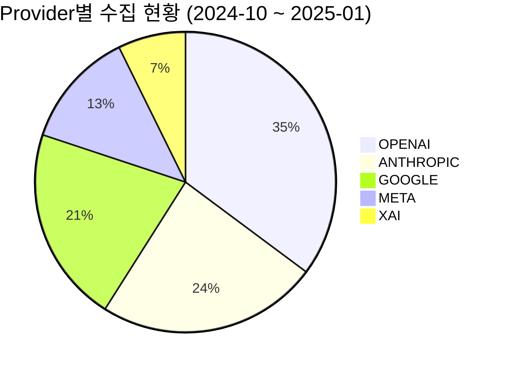
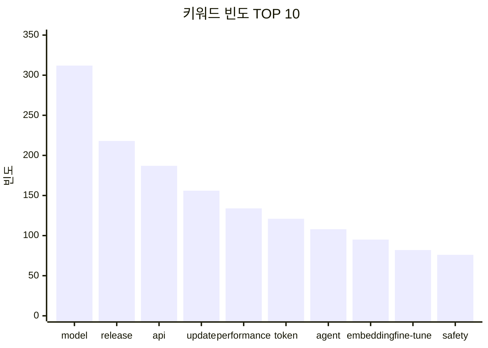

# Phase 4: AI Agent Tool 재설계 - 데이터 분석 기능 전환 설계서

## 1. 개요

### 1.1 목적
기존 `api-agent` 모듈의 Tool 구성을 재설계한다. 의미가 낮은 `create_draft_post`, `publish_post` Tool을 제거하고, MongoDB Atlas `emerging_techs` 컬렉션의 데이터를 분석하여 통계/빈도 정보를 채팅 응답으로 제공하는 Tool로 대체한다.

### 1.2 전제 조건
- Phase 1~3 완료: 데이터 수집 파이프라인, LangChain4j Tool 래퍼, Agent 통합
- `api-agent` 모듈에 LangChain4j 1.10.0 + OpenAI GPT-4o-mini 설정 완료
- MongoDB Atlas `emerging_techs` 컬렉션에 데이터 수집 완료
- Phase 3 리팩토링 완료: ThreadLocal 메트릭, AgentPromptConfig, AgentFacade 적용

### 1.3 변경 요약

| 구분 | Tool Name | 상태 |
|------|-----------|------|
| 제거 | `create_draft_post` | Agent의 자율 포스트 생성보다 데이터 분석 제공이 유의미 |
| 제거 | `publish_post` | 게시 승인은 수동 관리가 적절 |
| 신규 | `get_emerging_tech_statistics` | Provider/SourceType/UpdateType별 통계 집계 |
| 신규 | `analyze_text_frequency` | title/summary 텍스트 키워드 빈도 분석 |
| 유지 | `fetch_github_releases` | 실시간 GitHub 릴리스 조회 |
| 유지 | `scrape_web_page` | 웹 페이지 크롤링 |
| 유지 | `search_emerging_techs` | 기존 데이터 검색 |
| 유지 | `send_slack_notification` | 분석 결과 알림 전송 |

---

## 2. MongoDB Aggregation 서비스 설계

`domain-mongodb` 모듈에 EmergingTech 집계 전용 서비스를 추가한다. 기존 `EmergingTechQueryServiceImpl`의 동적 Criteria 패턴을 확장하여 Aggregation Pipeline을 사용한다.

### 2.1 서비스 클래스

```java
package com.tech.n.ai.domain.mongodb.service;

import lombok.RequiredArgsConstructor;
import org.springframework.data.domain.Sort;
import org.springframework.data.mongodb.core.MongoTemplate;
import org.springframework.data.mongodb.core.aggregation.Aggregation;
import org.springframework.data.mongodb.core.aggregation.AggregationResults;
import org.springframework.data.mongodb.core.query.Criteria;
import org.springframework.data.mongodb.core.query.Query;
import org.springframework.stereotype.Service;

import java.time.LocalDateTime;
import java.util.List;

/**
 * EmergingTech 데이터 집계 서비스
 */
@Service
@RequiredArgsConstructor
public class EmergingTechAggregationService {

    private final MongoTemplate mongoTemplate;

    private static final String COLLECTION = "emerging_techs";

    /**
     * 그룹별 도큐먼트 수 집계
     *
     * <p>countTotal() 별도 쿼리 없이 그룹 결과의 count 합산으로 totalCount를 계산할 수 있으나,
     * 그룹 필드가 null인 도큐먼트가 집계에서 누락될 수 있으므로 호출 측에서 판단한다.
     *
     * @param groupField 그룹 기준 필드 (provider, source_type, update_type)
     * @param startDate 조회 시작일 (nullable)
     * @param endDate 조회 종료일 (nullable)
     * @return 그룹별 집계 결과
     */
    public List<GroupCountResult> countByGroup(String groupField, LocalDateTime startDate, LocalDateTime endDate) {
        Criteria criteria = buildDateCriteria(startDate, endDate);

        Aggregation aggregation = Aggregation.newAggregation(
            Aggregation.match(criteria),
            Aggregation.group(groupField).count().as("count"),
            Aggregation.sort(Sort.Direction.DESC, "count")
        );

        return mongoTemplate.aggregate(aggregation, COLLECTION, GroupCountResult.class)
            .getMappedResults();
    }

    /**
     * 서버사이드 텍스트 빈도 집계 (MongoDB Aggregation Pipeline)
     *
     * <p>전체 도큐먼트를 Java로 가져오지 않고 MongoDB 내에서 토큰화 + 빈도 집계를 수행한다.
     * $project + $split + $unwind + $group 파이프라인으로 네트워크 전송량을 최소화하고
     * MongoDB의 분산 처리를 활용한다.
     *
     * <p>Aggregation Pipeline:
     * <pre>
     * 1. $match: 기간 필터 + provider 필터
     * 2. $project: title + summary를 하나의 텍스트로 결합, 소문자 변환, 공백 기준 분리
     * 3. $unwind: 단어 배열을 개별 도큐먼트로 전개
     * 4. $match: 불용어 제외, 2글자 미만 제외
     * 5. $group: 단어별 빈도 집계
     * 6. $sort: 빈도 내림차순
     * 7. $limit: 상위 N개
     * </pre>
     *
     * @param provider provider 필터 (nullable)
     * @param startDate 조회 시작일 (nullable)
     * @param endDate 조회 종료일 (nullable)
     * @param stopWords 불용어 목록 (외부 설정에서 주입)
     * @param topN 상위 키워드 개수
     * @return 단어별 빈도 집계 결과
     */
    public List<WordFrequencyResult> aggregateWordFrequency(
            String provider, LocalDateTime startDate, LocalDateTime endDate,
            List<String> stopWords, int topN) {

        Criteria criteria = buildDateCriteria(startDate, endDate);
        if (provider != null && !provider.isBlank()) {
            criteria = criteria.and("provider").is(provider);
        }

        Aggregation aggregation = Aggregation.newAggregation(
            Aggregation.match(criteria),
            // title과 summary를 결합하여 단어 배열로 분리
            Aggregation.project()
                .and(context -> new org.bson.Document("$split",
                    List.of(new org.bson.Document("$toLower",
                        new org.bson.Document("$concat",
                            List.of(
                                new org.bson.Document("$ifNull", List.of("$title", "")),
                                " ",
                                new org.bson.Document("$ifNull", List.of("$summary", ""))
                            )
                        )
                    ), " ")
                )).as("words"),
            Aggregation.unwind("words"),
            // 불용어, 빈 문자열, 2글자 미만, 숫자만으로 구성된 토큰 제외
            Aggregation.match(Criteria.where("words").nin(stopWords)
                .and("words").regex("^[a-z][a-z0-9._-]+$")),
            Aggregation.group("words").count().as("count"),
            Aggregation.sort(Sort.Direction.DESC, "count"),
            Aggregation.limit(topN)
        );

        return mongoTemplate.aggregate(aggregation, COLLECTION, WordFrequencyResult.class)
            .getMappedResults();
    }

    /**
     * 기간 내 전체 도큐먼트 수 조회
     *
     * @param provider provider 필터 (nullable)
     * @param startDate 조회 시작일 (nullable)
     * @param endDate 조회 종료일 (nullable)
     * @return 도큐먼트 수
     */
    public long countDocuments(String provider, LocalDateTime startDate, LocalDateTime endDate) {
        Criteria criteria = buildDateCriteria(startDate, endDate);
        if (provider != null && !provider.isBlank()) {
            criteria = criteria.and("provider").is(provider);
        }
        Query query = new Query(criteria);
        return mongoTemplate.count(query, COLLECTION);
    }

    /**
     * 날짜 범위 Criteria 생성
     *
     * <p>published_at이 null인 도큐먼트도 포함하기 위해 $or 조건을 사용한다.
     * 데이터 수집 과정에서 published_at이 설정되지 않은 도큐먼트가 존재할 수 있으며,
     * 이를 통계에서 누락하지 않기 위함이다.
     */
    private Criteria buildDateCriteria(LocalDateTime startDate, LocalDateTime endDate) {
        if (startDate == null && endDate == null) {
            return new Criteria();
        }

        Criteria dateCriteria = new Criteria();
        if (startDate != null && endDate != null) {
            dateCriteria = Criteria.where("published_at").gte(startDate).lte(endDate);
        } else if (startDate != null) {
            dateCriteria = Criteria.where("published_at").gte(startDate);
        } else {
            dateCriteria = Criteria.where("published_at").lte(endDate);
        }

        // published_at이 null인 도큐먼트도 포함
        return new Criteria().orOperator(
            dateCriteria,
            Criteria.where("published_at").is(null)
        );
    }
}
```

### 2.2 집계 결과 DTO

```java
package com.tech.n.ai.domain.mongodb.service;

import lombok.Getter;
import lombok.Setter;
import org.springframework.data.annotation.Id;

/**
 * 그룹별 집계 결과 projection DTO
 */
@Getter
@Setter
public class GroupCountResult {

    @Id
    private String id;  // 그룹 필드 값 (Aggregation $group의 _id)
    private long count;
}
```

```java
package com.tech.n.ai.domain.mongodb.service;

import lombok.Getter;
import lombok.Setter;
import org.springframework.data.annotation.Id;

/**
 * 서버사이드 단어 빈도 집계 결과 projection DTO
 * aggregateWordFrequency()의 Aggregation Pipeline에서 $group → $sort → $limit 결과를 매핑
 */
@Getter
@Setter
public class WordFrequencyResult {

    @Id
    private String id;  // 단어 ($group의 _id)
    private long count;
}
```

### 2.3 설계 포인트
- `MongoTemplate`의 `Aggregation` API 사용 (Spring Data MongoDB 공식 지원)
- 기존 `EmergingTechQueryServiceImpl`의 동적 Criteria 패턴과 일관성 유지
- 날짜 범위 필터는 `published_at` 필드 기준 (기존 인덱스 `provider + published_at DESC` 활용)
- `published_at`이 null인 도큐먼트도 `$or` 조건으로 포함하여 데이터 누락 방지
- **텍스트 빈도 집계는 MongoDB 서버사이드에서 수행** ($split + $unwind + $group)
  - 전체 도큐먼트를 Java로 전송하지 않아 네트워크 부하 최소화
  - MongoDB의 분산 처리 능력 활용으로 대량 데이터에서도 성능 유지
  - `TextContentResult` DTO 대신 `WordFrequencyResult` DTO로 집계 완료된 결과만 수신
- `GroupCountResult`, `WordFrequencyResult`는 단순 projection DTO로 정의

---

## 3. 신규 Tool DTO 설계

LangChain4j Tool이 반환하는 DTO를 정의한다. LangChain4j 1.10.0은 Gson으로 자동 JSON 직렬화하여 LLM에게 전달한다.

### 3.1 StatisticsDto

```java
package com.tech.n.ai.api.agent.tool.dto;

import java.util.List;

/**
 * 통계 집계 결과 DTO
 * LangChain4j가 JSON 직렬화하여 LLM에게 전달
 */
public record StatisticsDto(
    String groupBy,
    String startDate,
    String endDate,
    long totalCount,
    List<GroupCount> groups
) {
    public record GroupCount(
        String name,
        long count
    ) {}
}
```

### 3.2 WordFrequencyDto

```java
package com.tech.n.ai.api.agent.tool.dto;

import java.util.List;

/**
 * 텍스트 빈도 분석 결과 DTO
 *
 * <p>topWords: 단일 키워드(unigram) 빈도 상위 N개
 * <p>topBigrams: 2-gram 키워드 빈도 상위 N개 (기술 트렌드 분석에서 "language model",
 *    "function calling" 등 복합 용어가 중요하므로 단일 키워드와 함께 제공)
 */
public record WordFrequencyDto(
    int totalDocuments,
    String period,
    List<WordCount> topWords,
    List<WordCount> topBigrams
) {
    public record WordCount(
        String word,
        long count
    ) {}
}
```

### 3.3 LangChain4j 호환성

| 검증 항목 | 결과 | 근거 |
|-----------|------|------|
| Tool에서 record DTO 반환 가능? | **가능** | LangChain4j 1.10.0은 `void`→"Success", `String`→그대로, 그 외→JSON 자동 직렬화 ([공식 docs](https://docs.langchain4j.dev/tutorials/tools/), 기존 `GitHubReleaseDto`로 검증 완료) |
| LLM이 JSON 데이터를 Markdown 표로 변환? | **가능** | GPT-4o-mini는 구조화 데이터 포맷팅에 우수 |
| LLM이 Mermaid 다이어그램 문법 생성? | **가능** | GPT-4o-mini는 Mermaid pie, xychart-beta 문법 생성에 우수 |
| LLM이 ASCII 차트 생성? | **가능** | Unicode 블록 문자(█, ░) 활용 막대 차트 생성 가능 (Mermaid 미지원 환경의 폴백) |
| Tool에서 이미지/바이너리 반환? | **불가** | `ToolExecutionResultMessage`는 `text` 필드만 지원, 이미지 반환 불가 ([소스](https://github.com/langchain4j/langchain4j/blob/main/langchain4j-core/src/main/java/dev/langchain4j/data/message/ToolExecutionResultMessage.java)) |
| LangChain4j ImageModel 존재? | **존재 (별도)** | `OpenAiImageModel`로 DALL-E 사용 가능하나, Tool 결과와 독립적. 데이터 차트 용도에는 부적합 |
| MongoDB Aggregation 결과 → DTO 변환? | **가능** | Tool이 Spring Data MongoDB Aggregation 호출 후 DTO 반환 |

---

## 4. 신규 Tool 설계

### 4.1 get_emerging_tech_statistics

```java
/**
 * Provider/SourceType/UpdateType별 통계 집계
 */
@Tool(name = "get_emerging_tech_statistics",
      value = "조회 기간 기준으로 EmergingTech 데이터를 Provider, SourceType, UpdateType별로 집계합니다. "
            + "결과를 Markdown 표와 Mermaid 차트로 정리하여 보여줄 수 있습니다.")
public StatisticsDto getStatistics(
    @P("집계 기준 필드: provider, source_type, update_type") String groupBy,
    @P("조회 시작일 (YYYY-MM-DD 형식, 빈 문자열이면 전체 기간)") String startDate,
    @P("조회 종료일 (YYYY-MM-DD 형식, 빈 문자열이면 전체 기간)") String endDate
) {
    metrics().incrementToolCall();
    log.info("Tool 호출: get_emerging_tech_statistics(groupBy={}, startDate={}, endDate={})",
            groupBy, startDate, endDate);

    // 입력 검증
    String groupByError = ToolInputValidator.validateGroupByField(groupBy);
    if (groupByError != null) {
        metrics().incrementValidationError();
        log.warn("Tool 입력값 검증 실패: {}", groupByError);
        return new StatisticsDto(groupBy, startDate, endDate, 0, List.of());
    }

    String startDateError = ToolInputValidator.validateDateOptional(startDate, "startDate");
    if (startDateError != null) {
        metrics().incrementValidationError();
        log.warn("Tool 입력값 검증 실패: {}", startDateError);
        return new StatisticsDto(groupBy, startDate, endDate, 0, List.of());
    }

    String endDateError = ToolInputValidator.validateDateOptional(endDate, "endDate");
    if (endDateError != null) {
        metrics().incrementValidationError();
        log.warn("Tool 입력값 검증 실패: {}", endDateError);
        return new StatisticsDto(groupBy, startDate, endDate, 0, List.of());
    }

    // groupBy를 MongoDB 필드명으로 정규화
    String resolvedGroupBy = ToolInputValidator.resolveGroupByField(groupBy);
    return analyticsAdapter.getStatistics(resolvedGroupBy, startDate, endDate);
}
```

### 4.2 analyze_text_frequency

```java
/**
 * title/summary 텍스트 키워드 빈도 분석
 */
@Tool(name = "analyze_text_frequency",
      value = "EmergingTech 도큐먼트의 title, summary에서 주요 키워드 빈도를 분석합니다. "
            + "Mermaid 차트나 Word Cloud 형태로 결과를 정리할 수 있습니다.")
public WordFrequencyDto analyzeTextFrequency(
    @P("Provider 필터 (OPENAI, ANTHROPIC 등, 빈 문자열이면 전체)") String provider,
    @P("조회 시작일 (YYYY-MM-DD 형식, 빈 문자열이면 전체 기간)") String startDate,
    @P("조회 종료일 (YYYY-MM-DD 형식, 빈 문자열이면 전체 기간)") String endDate,
    @P("상위 키워드 개수 (기본값 20)") int topN
) {
    metrics().incrementToolCall();
    log.info("Tool 호출: analyze_text_frequency(provider={}, startDate={}, endDate={}, topN={})",
            provider, startDate, endDate, topN);

    String providerError = ToolInputValidator.validateProviderOptional(provider);
    if (providerError != null) {
        metrics().incrementValidationError();
        log.warn("Tool 입력값 검증 실패: {}", providerError);
        return new WordFrequencyDto(0, "", List.of(), List.of());
    }

    String startDateError = ToolInputValidator.validateDateOptional(startDate, "startDate");
    if (startDateError != null) {
        metrics().incrementValidationError();
        log.warn("Tool 입력값 검증 실패: {}", startDateError);
        return new WordFrequencyDto(0, "", List.of(), List.of());
    }

    String endDateError = ToolInputValidator.validateDateOptional(endDate, "endDate");
    if (endDateError != null) {
        metrics().incrementValidationError();
        log.warn("Tool 입력값 검증 실패: {}", endDateError);
        return new WordFrequencyDto(0, "", List.of(), List.of());
    }

    int effectiveTopN = (topN > 0 && topN <= 100) ? topN : 20;
    return analyticsAdapter.analyzeTextFrequency(provider, startDate, endDate, effectiveTopN);
}
```

---

## 5. AnalyticsToolAdapter 설계

기존 Adapter 패턴(`EmergingTechToolAdapter`, `GitHubToolAdapter`, `ScraperToolAdapter`)을 따라 신규 Adapter를 추가한다.

### 5.1 호출 흐름

```
EmergingTechAgentTools (Tool Method)
    → AnalyticsToolAdapter (변환 + 에러 처리)
        → EmergingTechAggregationService (MongoDB Aggregation 실행)
```

### 5.2 Adapter 구현

```java
package com.tech.n.ai.api.agent.tool.adapter;

import com.tech.n.ai.api.agent.config.AnalyticsConfig;
import com.tech.n.ai.api.agent.tool.dto.StatisticsDto;
import com.tech.n.ai.api.agent.tool.dto.WordFrequencyDto;
import com.tech.n.ai.domain.mongodb.service.EmergingTechAggregationService;
import com.tech.n.ai.domain.mongodb.service.GroupCountResult;
import com.tech.n.ai.domain.mongodb.service.WordFrequencyResult;
import lombok.RequiredArgsConstructor;
import lombok.extern.slf4j.Slf4j;
import org.springframework.stereotype.Component;

import java.time.LocalDate;
import java.time.LocalDateTime;
import java.time.format.DateTimeFormatter;
import java.time.format.DateTimeParseException;
import java.util.*;

/**
 * 분석 기능을 LangChain4j Tool 형식으로 래핑하는 어댑터
 *
 * <p>설계 포인트:
 * <ul>
 *   <li>텍스트 빈도 집계는 MongoDB 서버사이드 Aggregation으로 수행 (네트워크/메모리 최적화)</li>
 *   <li>불용어 목록은 AnalyticsConfig를 통해 외부 설정에서 주입 (운영 중 튜닝 가능)</li>
 *   <li>totalCount는 countByGroup 결과의 합산으로 계산 (별도 쿼리 제거)</li>
 *   <li>2-gram(bigram) 분석을 함께 제공하여 복합 기술 용어 추출 지원</li>
 * </ul>
 */
@Slf4j
@Component
@RequiredArgsConstructor
public class AnalyticsToolAdapter {

    private final EmergingTechAggregationService aggregationService;
    private final AnalyticsConfig analyticsConfig;

    private static final DateTimeFormatter DATE_FORMAT = DateTimeFormatter.ofPattern("yyyy-MM-dd");

    /**
     * 그룹별 통계 집계
     *
     * <p>totalCount는 그룹별 count 합산으로 계산하여 별도 쿼리를 제거한다.
     * 단, groupBy 필드가 null인 도큐먼트는 합산에서 누락될 수 있으므로,
     * 데이터 품질이 보장되지 않는 경우 countDocuments()를 별도 호출한다.
     */
    public StatisticsDto getStatistics(String groupBy, String startDate, String endDate) {
        try {
            LocalDateTime start = parseDate(startDate, true);
            LocalDateTime end = parseDate(endDate, false);

            List<GroupCountResult> results = aggregationService.countByGroup(groupBy, start, end);

            // 그룹 결과의 count 합산으로 totalCount 계산 (별도 쿼리 제거)
            long totalCount = results.stream().mapToLong(GroupCountResult::getCount).sum();

            List<StatisticsDto.GroupCount> groups = results.stream()
                .map(r -> new StatisticsDto.GroupCount(r.getId(), r.getCount()))
                .toList();

            return new StatisticsDto(groupBy, startDate, endDate, totalCount, groups);
        } catch (Exception e) {
            log.error("통계 집계 실패: groupBy={}", groupBy, e);
            return new StatisticsDto(groupBy, startDate, endDate, 0, List.of());
        }
    }

    /**
     * 텍스트 빈도 분석 (MongoDB 서버사이드 집계)
     *
     * <p>개선된 설계:
     * <ol>
     *   <li>MongoDB Aggregation Pipeline에서 $split + $unwind + $group으로 서버사이드 토큰화/집계</li>
     *   <li>불용어 목록을 AnalyticsConfig에서 외부 설정으로 주입</li>
     *   <li>단일 키워드(unigram)와 2-gram(bigram)을 함께 제공</li>
     *   <li>전체 도큐먼트를 Java로 전송하지 않아 대량 데이터에서도 성능 유지</li>
     * </ol>
     */
    public WordFrequencyDto analyzeTextFrequency(String provider, String startDate, String endDate, int topN) {
        try {
            LocalDateTime start = parseDate(startDate, true);
            LocalDateTime end = parseDate(endDate, false);

            // 불용어 목록을 외부 설정에서 가져옴
            List<String> stopWords = analyticsConfig.getStopWords();

            // 서버사이드 단어 빈도 집계 (unigram)
            List<WordFrequencyResult> wordResults = aggregationService.aggregateWordFrequency(
                provider, start, end, stopWords, topN);

            List<WordFrequencyDto.WordCount> topWords = wordResults.stream()
                .map(r -> new WordFrequencyDto.WordCount(r.getId(), r.getCount()))
                .toList();

            // 2-gram 빈도 집계 (향후 MongoDB $reduce + $zip으로 서버사이드 구현 가능)
            // 현재는 topN/2개만 제공하여 응답 크기 제한
            List<WordFrequencyDto.WordCount> topBigrams = List.of();
            // TODO: 2-gram 서버사이드 Aggregation 구현 시 활성화

            // 전체 도큐먼트 수
            long totalDocs = aggregationService.countDocuments(provider, start, end);

            String period = buildPeriodString(startDate, endDate);
            return new WordFrequencyDto((int) totalDocs, period, topWords, topBigrams);
        } catch (Exception e) {
            log.error("텍스트 빈도 분석 실패: provider={}", provider, e);
            return new WordFrequencyDto(0, "", List.of(), List.of());
        }
    }

    private LocalDateTime parseDate(String dateStr, boolean startOfDay) {
        if (dateStr == null || dateStr.isBlank()) {
            return null;
        }
        try {
            LocalDate date = LocalDate.parse(dateStr, DATE_FORMAT);
            return startOfDay ? date.atStartOfDay() : date.atTime(23, 59, 59);
        } catch (DateTimeParseException e) {
            log.warn("날짜 파싱 실패: {}", dateStr);
            return null;
        }
    }

    private String buildPeriodString(String startDate, String endDate) {
        if ((startDate == null || startDate.isBlank()) && (endDate == null || endDate.isBlank())) {
            return "전체 기간";
        }
        String start = (startDate != null && !startDate.isBlank()) ? startDate : "~";
        String end = (endDate != null && !endDate.isBlank()) ? endDate : "~";
        return start + " ~ " + end;
    }
}
```

---

## 5-1. AnalyticsConfig 설계 (불용어 외부 설정)

불용어 목록을 Java 코드에서 하드코딩하지 않고 `application.yml`을 통해 외부 설정으로 관리한다.
운영 중 분석 도메인에 맞게 불용어를 추가/제거할 수 있으며, 프로필별로 다른 불용어 세트를 적용할 수 있다.

### 5-1.1 설정 클래스

```java
package com.tech.n.ai.api.agent.config;

import lombok.Data;
import org.springframework.boot.context.properties.ConfigurationProperties;
import org.springframework.stereotype.Component;

import java.util.List;

/**
 * 분석 기능 설정
 * 불용어, 분석 파라미터 등을 외부 설정으로 관리
 */
@Data
@Component
@ConfigurationProperties(prefix = "agent.analytics")
public class AnalyticsConfig {

    /**
     * 영문 불용어 목록
     * application-agent-api.yml에서 오버라이드 가능
     */
    private List<String> stopWords = List.of(
        "the", "a", "an", "is", "are", "was", "were", "be", "been", "being",
        "have", "has", "had", "do", "does", "did", "will", "would", "could",
        "should", "may", "might", "can", "shall", "must",
        "in", "on", "at", "to", "for", "of", "with", "by", "from", "as",
        "into", "through", "during", "before", "after", "above", "below",
        "between", "out", "off", "over", "under", "again", "further",
        "and", "but", "or", "nor", "not", "no", "so", "if", "than", "too",
        "very", "just", "about", "also", "now", "here", "there",
        "this", "that", "these", "those", "it", "its", "we", "our",
        "they", "them", "their", "he", "she", "his", "her", "you", "your",
        "all", "each", "every", "both", "few", "more", "most", "other",
        "some", "such", "only", "own", "same", "which", "while", "what",
        "when", "where", "who", "how", "why",
        "up", "down", "then", "once", "any", "new", "been", "being"
    );

    /**
     * 기본 상위 키워드 개수
     */
    private int defaultTopN = 20;

    /**
     * 최대 상위 키워드 개수
     */
    private int maxTopN = 100;
}
```

### 5-1.2 application-agent-api.yml 설정

```yaml
agent:
  analytics:
    default-top-n: 20
    max-top-n: 100
    stop-words:
      - the
      - a
      - an
      - is
      - are
      # ... (기본값은 Java 코드에 정의, yml에서 오버라이드 가능)
```

### 5-1.3 설계 포인트
- `@ConfigurationProperties`를 통해 Spring Boot의 외부화 설정 패턴 활용
- 기존 `AgentPromptConfig`와 동일한 패턴으로 일관성 유지
- Java 코드에 기본값을 두고, `application-agent-api.yml`에서 필요시 오버라이드
- 프로필별(`local`, `dev`, `prod`) 불용어 세트를 다르게 구성 가능

---

## 6. 입력 검증 추가

`ToolInputValidator`에 신규 검증 메서드를 추가한다. 기존 패턴(검증 성공 시 `null`, 실패 시 에러 메시지 `String` 반환)을 유지한다.

### 6.1 추가 메서드

```java
// ToolInputValidator.java에 추가

/**
 * LLM이 "Provider", "SOURCE_TYPE" 등 다양한 케이스로 입력할 수 있으므로
 * 대소문자 정규화 매핑을 사용하여 MongoDB 필드명으로 변환한다.
 */
private static final Map<String, String> GROUP_FIELD_MAP = Map.of(
    "provider", "provider",
    "source_type", "source_type",
    "update_type", "update_type"
);
private static final Pattern DATE_PATTERN = Pattern.compile("^\\d{4}-\\d{2}-\\d{2}$");

/**
 * 집계 기준 필드 검증 및 정규화
 *
 * <p>LLM이 "Provider", "SOURCE_TYPE", "sourceType" 등으로 입력할 수 있으므로
 * toLowerCase()로 정규화 후 매핑한다.
 *
 * @param groupBy 집계 기준 필드
 * @return 에러 메시지 또는 null (검증 성공)
 */
public static String validateGroupByField(String groupBy) {
    String requiredError = validateRequired(groupBy, "groupBy");
    if (requiredError != null) {
        return requiredError;
    }
    if (!GROUP_FIELD_MAP.containsKey(groupBy.toLowerCase())) {
        return String.format("Error: groupBy는 다음 값 중 하나여야 합니다: %s (입력값: %s)",
                String.join(", ", GROUP_FIELD_MAP.keySet()), groupBy);
    }
    return null;
}

/**
 * groupBy 필드를 MongoDB 필드명으로 변환
 *
 * @param groupBy 입력값
 * @return MongoDB 필드명 또는 null (매핑 실패)
 */
public static String resolveGroupByField(String groupBy) {
    if (groupBy == null || groupBy.isBlank()) {
        return null;
    }
    return GROUP_FIELD_MAP.get(groupBy.toLowerCase());
}

/**
 * 날짜 형식 검증 (YYYY-MM-DD, 빈 문자열 허용)
 *
 * @param date 검증할 날짜 문자열
 * @param fieldName 필드명 (에러 메시지용)
 * @return 에러 메시지 또는 null (검증 성공)
 */
public static String validateDateOptional(String date, String fieldName) {
    if (date == null || date.isBlank()) {
        return null;
    }
    if (!DATE_PATTERN.matcher(date).matches()) {
        return String.format("Error: %s는 YYYY-MM-DD 형식이어야 합니다 (입력값: %s)", fieldName, date);
    }
    try {
        java.time.LocalDate.parse(date);
        return null;
    } catch (java.time.format.DateTimeParseException e) {
        return String.format("Error: %s는 유효한 날짜가 아닙니다 (입력값: %s)", fieldName, date);
    }
}
```

---

## 7. EmergingTechAgentTools 변경

### 7.1 제거 대상 메서드

| 메서드 | 제거 사유 |
|--------|-----------|
| `createDraftPost()` | `create_draft_post` Tool 제거 |
| `publishPost()` | `publish_post` Tool 제거 |

### 7.2 추가 대상

| 항목 | 내용 |
|------|------|
| 의존성 필드 | `AnalyticsToolAdapter analyticsAdapter` |
| Tool 메서드 | `getStatistics()` → `get_emerging_tech_statistics` |
| Tool 메서드 | `analyzeTextFrequency()` → `analyze_text_frequency` |

### 7.3 변경 후 EmergingTechAgentTools 구조

```java
@Slf4j
@Component
@RequiredArgsConstructor
public class EmergingTechAgentTools {

    private final GitHubToolAdapter githubAdapter;
    private final ScraperToolAdapter scraperAdapter;
    private final SlackToolAdapter slackAdapter;
    private final EmergingTechToolAdapter emergingTechAdapter;
    private final AnalyticsToolAdapter analyticsAdapter;  // 추가

    private final ThreadLocal<ToolExecutionMetrics> currentMetrics = new ThreadLocal<>();

    // bindMetrics / unbindMetrics / metrics() - 변경 없음

    // 유지 Tool: fetchGitHubReleases, scrapeWebPage, searchEmergingTechs, sendSlackNotification
    // 추가 Tool: getStatistics, analyzeTextFrequency
    // 제거 Tool: createDraftPost, publishPost
}
```

---

## 8. EmergingTechToolAdapter 변경

### 8.1 제거 대상 메서드

| 메서드 | 제거 사유 |
|--------|-----------|
| `createDraft()` | `create_draft_post` Tool 제거에 따른 연쇄 삭제 |
| `publish()` | `publish_post` Tool 제거에 따른 연쇄 삭제 |

### 8.2 유지 메서드

| 메서드 | 유지 사유 |
|--------|-----------|
| `search()` | `search_emerging_techs` Tool에서 계속 사용 |

---

## 9. ToolErrorHandlers 변경

### 9.1 hallucinatedToolNameStrategy Tool 목록 업데이트

```java
// 변경 전
String errorMessage = String.format("Error: Tool '%s'은(는) 존재하지 않습니다. " +
        "사용 가능한 Tool: fetch_github_releases, scrape_web_page, search_emerging_techs, " +
        "create_draft_post, publish_post, send_slack_notification",
        toolName);

// 변경 후
String errorMessage = String.format("Error: Tool '%s'은(는) 존재하지 않습니다. " +
        "사용 가능한 Tool: fetch_github_releases, scrape_web_page, search_emerging_techs, " +
        "get_emerging_tech_statistics, analyze_text_frequency, send_slack_notification",
        toolName);
```

---

## 10. System Prompt 수정

### 10.1 AgentPromptConfig 변경

```java
@Data
@Component
@ConfigurationProperties(prefix = "agent.prompt")
public class AgentPromptConfig {

    private String role = "당신은 Emerging Tech 데이터 분석 및 업데이트 추적 전문가입니다.";

    private String tools = """
        - fetch_github_releases: GitHub 저장소 릴리스 조회
        - scrape_web_page: 웹 페이지 크롤링
        - search_emerging_techs: 기존 업데이트 검색
        - get_emerging_tech_statistics: Provider/SourceType/기간별 통계 집계
        - analyze_text_frequency: 키워드 빈도 분석 (Word Cloud)
        - send_slack_notification: Slack 알림 전송""";

    private String repositories = """
        - OpenAI: openai/openai-python
        - Anthropic: anthropics/anthropic-sdk-python
        - Google: google/generative-ai-python
        - Meta: facebookresearch/llama
        - xAI: xai-org/grok-1""";

    private String rules = """
        1. 통계 요청 시 get_emerging_tech_statistics로 데이터를 집계하고, Markdown 표와 Mermaid 차트로 보기 쉽게 정리
        2. 키워드 분석 요청 시 analyze_text_frequency로 빈도를 집계하고, Mermaid 차트와 해석을 함께 제공
        3. 데이터 수집 요청 시 fetch_github_releases, scrape_web_page 활용
        4. 중복 확인은 search_emerging_techs 사용
        5. 결과 공유 시 send_slack_notification 활용
        6. 작업 완료 후 결과 요약 제공""";

    private String visualization = """
        ## 시각화 가이드
        통계 결과를 시각화할 때 Mermaid 다이어그램 문법을 사용하세요.
        프론트엔드에서 자동으로 렌더링됩니다.

        ### 파이 차트 (비율 표시에 적합)
        ```mermaid
        pie title Provider별 수집 현황
            "OPENAI" : 145
            "ANTHROPIC" : 98
            "GOOGLE" : 87
        ```

        ### 바 차트 (빈도/수량 비교에 적합)
        ```mermaid
        xychart-beta
            title "키워드 빈도 TOP 10"
            x-axis ["model", "release", "api", "update"]
            y-axis "빈도" 0 --> 350
            bar [312, 218, 187, 156]
        ```

        ### 사용 규칙
        - 비율 분석: pie 차트 사용
        - 빈도 비교: xychart-beta의 bar 사용
        - Markdown 표도 함께 제공하여 정확한 수치 확인 가능하게 함
        - Mermaid 코드 블록은 반드시 ```mermaid로 시작""";

    /**
     * System Prompt 생성 (시각화 가이드 섹션 추가)
     *
     * @param goal 사용자 요청 목표
     * @return 완성된 프롬프트
     */
    public String buildPrompt(String goal) {
        return """
            %s

            ## 역할
            - 빅테크 IT 기업(OpenAI, Anthropic, Google, Meta, xAI)의 최신 업데이트 추적
            - 데이터 분석 결과를 도표와 차트로 시각화하여 제공

            ## 사용 가능한 도구
            %s

            ## 주요 저장소 정보
            %s

            ## 규칙
            %s

            %s

            ## 사용자 요청
            %s
            """.formatted(role, tools, repositories, rules, visualization, goal);
    }
}
```

### 10.2 application-agent-api.yml 오버라이드 (선택)

```yaml
agent:
  prompt:
    role: "당신은 Emerging Tech 데이터 분석 및 업데이트 추적 전문가입니다."
    tools: |
      - fetch_github_releases: GitHub 저장소 릴리스 조회
      - scrape_web_page: 웹 페이지 크롤링
      - search_emerging_techs: 기존 업데이트 검색
      - get_emerging_tech_statistics: Provider/SourceType/기간별 통계 집계
      - analyze_text_frequency: 키워드 빈도 분석 (Word Cloud)
      - send_slack_notification: Slack 알림 전송
    rules: |
      1. 통계 요청 시 get_emerging_tech_statistics로 데이터를 집계하고, Markdown 표와 Mermaid 차트로 보기 쉽게 정리
      2. 키워드 분석 요청 시 analyze_text_frequency로 빈도를 집계하고, Mermaid 차트와 해석을 함께 제공
      3. 데이터 수집 요청 시 fetch_github_releases, scrape_web_page 활용
      4. 중복 확인은 search_emerging_techs 사용
      5. 결과 공유 시 send_slack_notification 활용
      6. 작업 완료 후 결과 요약 제공
    visualization: |
      ## 시각화 가이드
      통계 결과를 시각화할 때 Mermaid 다이어그램 문법을 사용하세요.

      ### 파이 차트
      ```mermaid
      pie title Provider별 수집 현황
          "OPENAI" : 145
          "ANTHROPIC" : 98
      ```

      ### 바 차트
      ```mermaid
      xychart-beta
          title "키워드 빈도 TOP 10"
          x-axis ["model", "release", "api"]
          y-axis "빈도" 0 --> 350
          bar [312, 218, 187]
      ```
```

---

## 11. 모듈 의존성 변경

### 11.1 build.gradle 변경

```gradle
// api/agent/build.gradle
dependencies {
    // 프로젝트 모듈 의존성
    implementation project(':common-core')
    implementation project(':common-exception')
    implementation project(':domain-mongodb')  // 추가: MongoDB Aggregation 서비스 사용

    // langchain4j Core + OpenAI
    implementation 'dev.langchain4j:langchain4j:1.10.0'
    implementation 'dev.langchain4j:langchain4j-open-ai:1.10.0'

    // Agent Tool용 클라이언트 모듈
    implementation project(':client-feign')
    implementation project(':client-slack')
    implementation project(':client-scraper')

    // Jsoup
    implementation 'org.jsoup:jsoup:1.17.2'

    annotationProcessor 'org.springframework.boot:spring-boot-configuration-processor'
}
```

### 11.2 ServerConfig 변경

```java
@Configuration
@ComponentScan(basePackages = {
    "com.tech.n.ai.api.agent",
    "com.tech.n.ai.domain.mongodb",  // 추가
    "com.tech.n.ai.client.feign",
    "com.tech.n.ai.client.slack",
    "com.tech.n.ai.client.scraper",
    "com.tech.n.ai.common.core",
    "com.tech.n.ai.common.exception"
})
public class ServerConfig {
}
```

### 11.3 application.yml 변경

```yaml
server:
  port: 8087

spring:
  application:
    name: agent-api
  profiles:
    include:
      - common-core
      - agent-api
      - mongodb-domain  # 추가
      - feign-github
      - feign-internal
      - slack
      - scraper
```

---

## 12. ToolExecutionMetrics 변경

`postsCreatedCount` 필드는 `create_draft_post` 삭제로 인해 더 이상 사용되지 않는다. `analyticsCallCount`로 대체한다.

### 12.1 변경 내용

```java
public class ToolExecutionMetrics {

    private final AtomicInteger toolCallCount = new AtomicInteger(0);
    private final AtomicInteger analyticsCallCount = new AtomicInteger(0);  // 변경: postsCreatedCount → analyticsCallCount
    private final AtomicInteger validationErrorCount = new AtomicInteger(0);

    public void incrementToolCall() { toolCallCount.incrementAndGet(); }
    public void incrementAnalyticsCall() { analyticsCallCount.incrementAndGet(); }  // 변경
    public void incrementValidationError() { validationErrorCount.incrementAndGet(); }

    public int getToolCallCount() { return toolCallCount.get(); }
    public int getAnalyticsCallCount() { return analyticsCallCount.get(); }  // 변경
    public int getValidationErrorCount() { return validationErrorCount.get(); }
}
```

### 12.2 AgentExecutionResult 변경

```java
public record AgentExecutionResult(
    boolean success,
    String summary,
    int toolCallCount,
    int analyticsCallCount,  // 변경: postsCreated → analyticsCallCount
    long executionTimeMs,
    List<String> errors
) {
    public static AgentExecutionResult success(String summary, int toolCallCount, int analyticsCallCount, long executionTimeMs) {
        return new AgentExecutionResult(true, summary, toolCallCount, analyticsCallCount, executionTimeMs, List.of());
    }

    public static AgentExecutionResult failure(String summary, List<String> errors) {
        return new AgentExecutionResult(false, summary, 0, 0, 0, errors);
    }
}
```

---

## 13. 삭제 대상 코드 목록

| 파일/위치 | 삭제 내용 | 사유 |
|-----------|-----------|------|
| `EmergingTechAgentTools.java` | `createDraftPost()` 메서드 | Tool 제거 |
| `EmergingTechAgentTools.java` | `publishPost()` 메서드 | Tool 제거 |
| `EmergingTechToolAdapter.java` | `createDraft()` 메서드 | 연쇄 삭제 |
| `EmergingTechToolAdapter.java` | `publish()` 메서드 | 연쇄 삭제 |
| `ToolErrorHandlers.java` | Tool 목록 문자열 업데이트 | Tool 이름 변경 반영 |
| `ToolExecutionMetrics.java` | `postsCreatedCount` 필드 | `analyticsCallCount`로 대체 |
| `AgentExecutionResult.java` | `postsCreated` 필드 | `analyticsCallCount`로 대체 |

---

## 14. 디렉토리 구조 (변경 후)

```
api/agent/src/main/java/.../api/agent/
├── agent/
│   ├── EmergingTechAgent.java
│   ├── EmergingTechAgentImpl.java
│   ├── AgentExecutionResult.java          // postsCreated → analyticsCallCount
│   └── AgentAssistant.java
├── config/
│   ├── AgentPromptConfig.java             // 프롬프트 변경 + visualization 섹션 추가
│   ├── AnalyticsConfig.java               // 신규: 불용어 외부 설정
│   └── ServerConfig.java                  // ComponentScan 추가
├── controller/
│   └── AgentController.java
├── dto/
│   └── request/
│       └── AgentRunRequest.java
├── facade/
│   └── AgentFacade.java
├── metrics/
│   └── ToolExecutionMetrics.java          // analyticsCallCount 추가
├── scheduler/
│   └── EmergingTechAgentScheduler.java
└── tool/
    ├── EmergingTechAgentTools.java         // 2개 제거, 2개 추가
    ├── adapter/
    │   ├── AnalyticsToolAdapter.java       // 신규 (서버사이드 집계 + 불용어 외부 설정)
    │   ├── EmergingTechToolAdapter.java    // createDraft, publish 제거
    │   ├── GitHubToolAdapter.java
    │   ├── ScraperToolAdapter.java
    │   └── SlackToolAdapter.java
    ├── dto/
    │   ├── EmergingTechDto.java
    │   ├── GitHubReleaseDto.java
    │   ├── ScrapedContentDto.java
    │   ├── StatisticsDto.java             // 신규
    │   ├── ToolResult.java
    │   └── WordFrequencyDto.java          // 신규 (unigram + bigram)
    ├── handler/
    │   └── ToolErrorHandlers.java          // Tool 목록 업데이트
    └── validation/
        └── ToolInputValidator.java         // 3개 메서드 추가 (validateGroupByField, resolveGroupByField, validateDateOptional)

domain/mongodb/src/main/java/.../domain/mongodb/
├── service/
│   ├── EmergingTechAggregationService.java  // 신규 (서버사이드 텍스트 빈도 집계)
│   ├── GroupCountResult.java                // 신규
│   └── WordFrequencyResult.java             // 신규 (서버사이드 집계 결과)
└── (기존 파일 변경 없음)
```

---

## 15. 시퀀스 다이어그램

### 15.1 통계 분석 흐름

```
User → AgentController → AgentFacade → EmergingTechAgentImpl
                                              │
                                              ▼
                                         AiServices.chat()
                                              │
                                              ▼
                                     LLM (GPT-4o-mini)
                                              │
                                              │ Tool Call: get_emerging_tech_statistics
                                              ▼
                                    EmergingTechAgentTools
                                         .getStatistics()
                                              │
                                              ▼
                                       ToolInputValidator
                                    .validateGroupByField()
                                    .resolveGroupByField()  ← 대소문자 정규화
                                    .validateDateOptional()
                                              │
                                              ▼
                                     AnalyticsToolAdapter
                                        .getStatistics()
                                              │
                                              ▼
                              EmergingTechAggregationService
                                       .countByGroup()
                                              │
                                              ▼
                                        MongoTemplate
                                    Aggregation Pipeline
                                    ($match → $group → $sort)
                                              │
                                              ▼
                                     AnalyticsToolAdapter
                                   그룹 결과 합산 → totalCount
                                   (별도 쿼리 없음)
                                              │
                                              ▼ StatisticsDto (JSON)
                                     LLM (GPT-4o-mini)
                                              │
                                              ▼ Markdown 표 + Mermaid pie/bar 차트
                                           User
```

### 15.2 텍스트 빈도 분석 흐름

```
User → AgentController → AgentFacade → EmergingTechAgentImpl
                                              │
                                              ▼
                                         AiServices.chat()
                                              │
                                              ▼
                                     LLM (GPT-4o-mini)
                                              │
                                              │ Tool Call: analyze_text_frequency
                                              ▼
                                    EmergingTechAgentTools
                                   .analyzeTextFrequency()
                                              │
                                              ▼
                                       ToolInputValidator
                                   .validateProviderOptional()
                                    .validateDateOptional()
                                              │
                                              ▼
                                     AnalyticsToolAdapter
                                  .analyzeTextFrequency()
                                              │
                                              ▼
                                       AnalyticsConfig
                                    .getStopWords()  ← 외부 설정에서 불용어 로드
                                              │
                                              ▼
                              EmergingTechAggregationService
                                  .aggregateWordFrequency()
                                              │
                                              ▼
                                        MongoTemplate
                                  Aggregation Pipeline
                                  ($match → $project → $split
                                   → $unwind → $match(불용어)
                                   → $group → $sort → $limit)
                                   ※ 서버사이드 토큰화/집계
                                              │
                                              ▼ WordFrequencyDto (JSON)
                                     LLM (GPT-4o-mini)
                                              │
                                              ▼ Mermaid xychart-beta 바 차트
                                              + Markdown 표 + 분석 코멘트
                                           User
```

---

## 16. Agent 행동 흐름 예시

### 16.1 통계 분석 요청

```
User: "최근 3개월간 Provider별 수집 현황을 분석해줘"

Agent 추론:
1. "통계 데이터를 집계해야 해"
   → Tool: get_emerging_tech_statistics("provider", "2024-10-01", "2025-01-01")
   → 결과: { totalCount: 412, groups: [{name:"OPENAI", count:145}, {name:"ANTHROPIC", count:98}, ...] }

2. "결과를 보기 쉽게 표와 Mermaid 차트로 정리할게"
   → Markdown 표 + Mermaid pie 차트 생성

Agent 응답:
"## Provider별 수집 현황 (2024-10-01 ~ 2025-01-01)

| Provider   | 수집 건수 | 비율    |
|------------|----------|---------|
| OPENAI     | 145      | 35.2%   |
| ANTHROPIC  | 98       | 23.8%   |
| GOOGLE     | 87       | 21.1%   |
| META       | 52       | 12.6%   |
| XAI        | 30       | 7.3%    |



**분석**: OpenAI가 전체의 35.2%로 가장 높은 비중을 차지합니다.
Anthropic(23.8%)과 Google(21.1%)이 그 뒤를 잇고 있습니다."
```

### 16.2 키워드 빈도 분석 요청

```
User: "올해 수집된 데이터의 주요 키워드를 Word Cloud로 보여줘"

Agent 추론:
1. "키워드 빈도 분석이 필요해"
   → Tool: analyze_text_frequency("", "2025-01-01", "2025-12-31", 20)
   → 결과: { totalDocuments: 412, period: "2025-01-01 ~ 2025-12-31",
             topWords: [{word:"model", count:312}, ...],
             topBigrams: [{word:"language model", count:89}, ...] }

2. "Mermaid 차트와 분석 코멘트로 보여줄게"
   → Mermaid xychart-beta 바 차트 + Markdown 표 생성

Agent 응답:
"## 키워드 빈도 분석 (2025-01-01 ~ 2025-12-31)

총 분석 도큐먼트: 412건

### TOP 10 키워드

| 순위 | 키워드      | 빈도 |
|------|-----------|------|
| 1    | model     | 312  |
| 2    | release   | 218  |
| 3    | api       | 187  |
| 4    | update    | 156  |
| 5    | performance | 134 |



**분석**: 'model', 'release', 'api'가 상위를 차지하며,
최근 AI 모델 출시와 API 업데이트에 대한 콘텐츠가 집중되어 있습니다.
'agent'와 'embedding' 키워드의 빈도가 높아지고 있어 AI Agent 및 임베딩 기반 검색 트렌드를 반영합니다."
```

### 16.3 복합 분석 요청

```
User: "Anthropic의 최신 GitHub 릴리스를 확인하고, 전체 Provider 통계도 보여줘"

Agent 추론:
1. "먼저 Anthropic GitHub 릴리스 확인"
   → Tool: fetch_github_releases("anthropics", "anthropic-sdk-python")
   → 결과: [v0.40.0, v0.39.0, ...]

2. "이미 등록된 것인지 확인"
   → Tool: search_emerging_techs("anthropic-sdk-python v0.40.0", "ANTHROPIC")
   → 결과: 없음

3. "Provider별 통계 집계"
   → Tool: get_emerging_tech_statistics("provider", "", "")
   → 결과: { totalCount: 520, groups: [...] }

4. "결과를 종합 정리"

Agent 응답:
"## 분석 결과

### 1. Anthropic SDK 최신 릴리스
- v0.40.0 (미등록, 신규 발견)
- 주요 변경: ...

### 2. Provider별 전체 통계
| Provider | 건수 | 비율 |
|----------|------|------|
| ...      | ...  | ...  |

Slack으로 신규 릴리스 발견 알림을 보낼까요?"
```

---

## 17. 구현 순서

| 순서 | 작업 | 파일 |
|------|------|------|
| 1 | MongoDB Aggregation 서비스 생성 | `domain-mongodb`: `EmergingTechAggregationService`, `GroupCountResult`, `WordFrequencyResult` |
| 2 | 신규 Tool DTO 생성 | `api-agent`: `StatisticsDto`, `WordFrequencyDto` |
| 3 | AnalyticsConfig 생성 (불용어 외부 설정) | `api-agent`: `AnalyticsConfig` |
| 4 | AnalyticsToolAdapter 생성 | `api-agent`: `AnalyticsToolAdapter` |
| 5 | ToolInputValidator 확장 | `api-agent`: `validateGroupByField`, `resolveGroupByField`, `validateDateOptional` |
| 6 | EmergingTechAgentTools 변경 | 제거: `createDraftPost`, `publishPost` / 추가: `getStatistics`, `analyzeTextFrequency` |
| 7 | EmergingTechToolAdapter 변경 | 제거: `createDraft`, `publish` |
| 8 | ToolErrorHandlers 변경 | Tool 목록 문자열 업데이트 |
| 9 | ToolExecutionMetrics 변경 | `postsCreatedCount` → `analyticsCallCount` |
| 10 | AgentExecutionResult 변경 | `postsCreated` → `analyticsCallCount` |
| 11 | AgentPromptConfig 변경 | role, tools, rules 수정 + visualization 섹션 추가 + buildPrompt() 수정 |
| 12 | 모듈 의존성 변경 | `build.gradle`, `ServerConfig`, `application.yml` |
| 13 | 빌드 검증 | `./gradlew :api-agent:compileJava` |

---

## 18. 향후 확장 가능 사항

### 18.1 서버사이드 차트 이미지 생성 (선택적)

Mermaid 텍스트 기반 시각화로 충분하지 않은 경우, 서버사이드에서 고품질 차트 이미지를 생성하여 URL 참조 방식으로 제공할 수 있다.

| 라이브러리 | 용도 | Gradle 의존성 | 특징 |
|-----------|------|--------------|------|
| **XChart** | 바/라인/파이 차트 | `org.knowm.xchart:xchart:3.8.8` | 경량, `BitmapEncoder.getBitmapBytes()` 직접 byte[] 반환 |
| **Kumo** | Word Cloud 이미지 | `com.kennycason:kumo-core:1.28` | Java 네이티브 워드클라우드, `BufferedImage` 출력 |

구현 패턴 (URL 참조 방식):
1. Tool 메서드가 차트를 생성하고 임시 저장 (Redis/임시파일)
2. 별도 엔드포인트(`/api/v1/agent/charts/{chartId}`)에서 이미지 서빙
3. `ToolExecutionResultMessage`는 텍스트만 지원하므로, URL을 반환하고 LLM이 `` 마크다운으로 포함

> **주의**: Base64 인라인 인코딩은 LLM 토큰을 대량 소비하므로 URL 참조 방식을 사용한다.

### 18.2 교차 분석 (Cross-Dimension Aggregation)

현재 단일 차원(`provider` OR `source_type` OR `update_type`)별 집계만 지원한다.
향후 "provider별 update_type 분포"와 같은 2차원 교차 분석이 필요할 경우:

```java
public List<CrossGroupResult> countByCrossGroup(
    String primaryField, String secondaryField,
    LocalDateTime startDate, LocalDateTime endDate) {

    Aggregation aggregation = Aggregation.newAggregation(
        Aggregation.match(buildDateCriteria(startDate, endDate)),
        Aggregation.group(primaryField, secondaryField).count().as("count"),
        Aggregation.sort(Sort.Direction.DESC, "count")
    );
    ...
}
```

### 18.3 2-gram 서버사이드 Aggregation

현재 2-gram 분석은 TODO로 남겨두었다. MongoDB Aggregation에서 `$reduce` + `$zip`을 활용하면
서버사이드에서 인접 단어 쌍을 추출하여 빈도 집계할 수 있다.

---

## 19. 참고 자료

### 핵심 기술 문서
- LangChain4j Tools: https://docs.langchain4j.dev/tutorials/tools
- LangChain4j AI Services: https://docs.langchain4j.dev/tutorials/ai-services
- LangChain4j Image Models: https://docs.langchain4j.dev/tutorials/image-models
- LangChain4j OpenAI: https://docs.langchain4j.dev/integrations/language-models/open-ai
- ToolExecutionResultMessage 소스: https://github.com/langchain4j/langchain4j/blob/main/langchain4j-core/src/main/java/dev/langchain4j/data/message/ToolExecutionResultMessage.java

### MongoDB
- Spring Data MongoDB Aggregation: https://docs.spring.io/spring-data/mongodb/reference/mongodb/aggregation-framework.html
- MongoDB Aggregation Pipeline: https://www.mongodb.com/docs/manual/core/aggregation-pipeline/

### 시각화
- Mermaid.js 공식 사이트: https://mermaid.js.org/
- Mermaid Pie Chart: https://mermaid.js.org/syntax/pie.html
- Mermaid XY Chart (Beta): https://mermaid.js.org/syntax/xyChart.html
- GitHub Markdown Mermaid 지원: https://github.blog/developer-skills/github/include-diagrams-markdown-files-mermaid/

### 차트/Word Cloud 라이브러리 (향후 확장용)
- XChart: https://github.com/knowm/XChart
- Kumo Word Cloud: https://github.com/kennycason/kumo
- JFreeChart: https://www.jfree.org/jfreechart/
