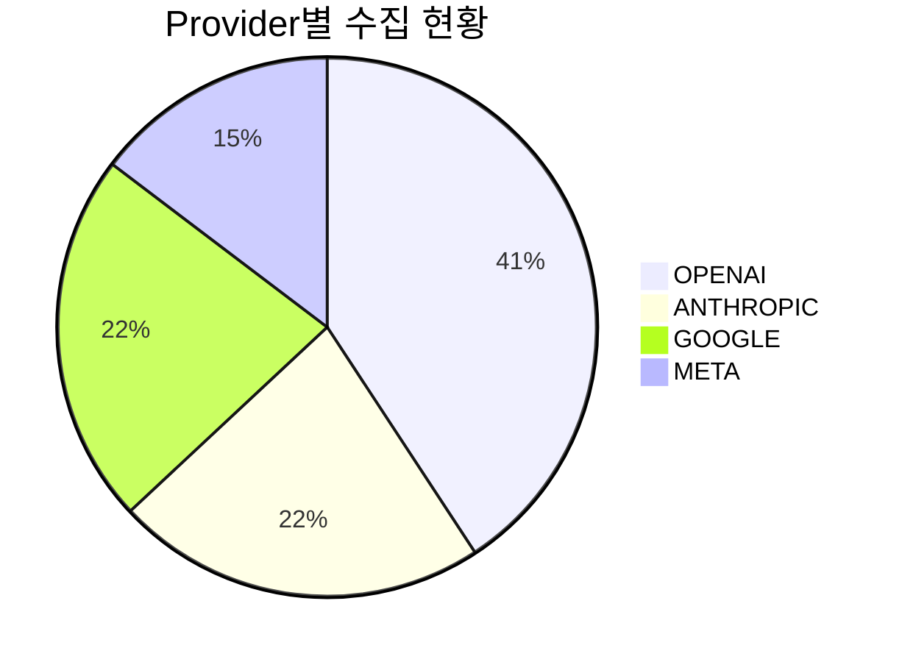
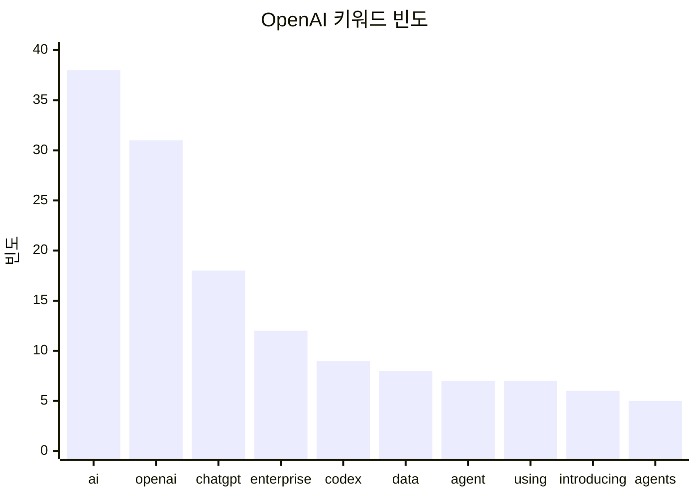
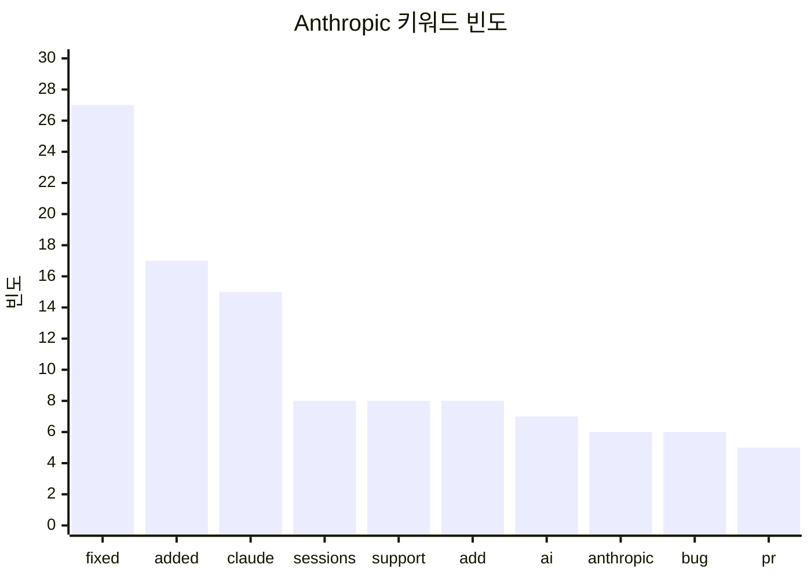
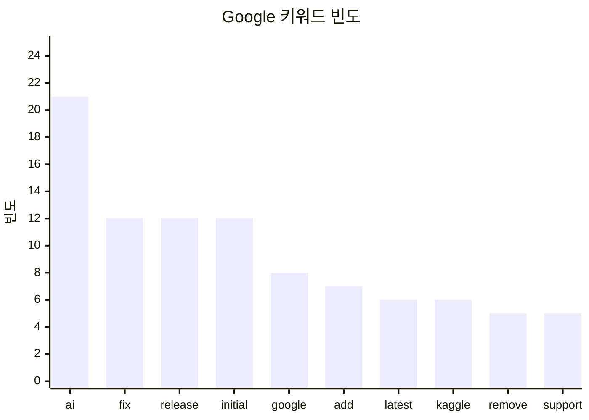
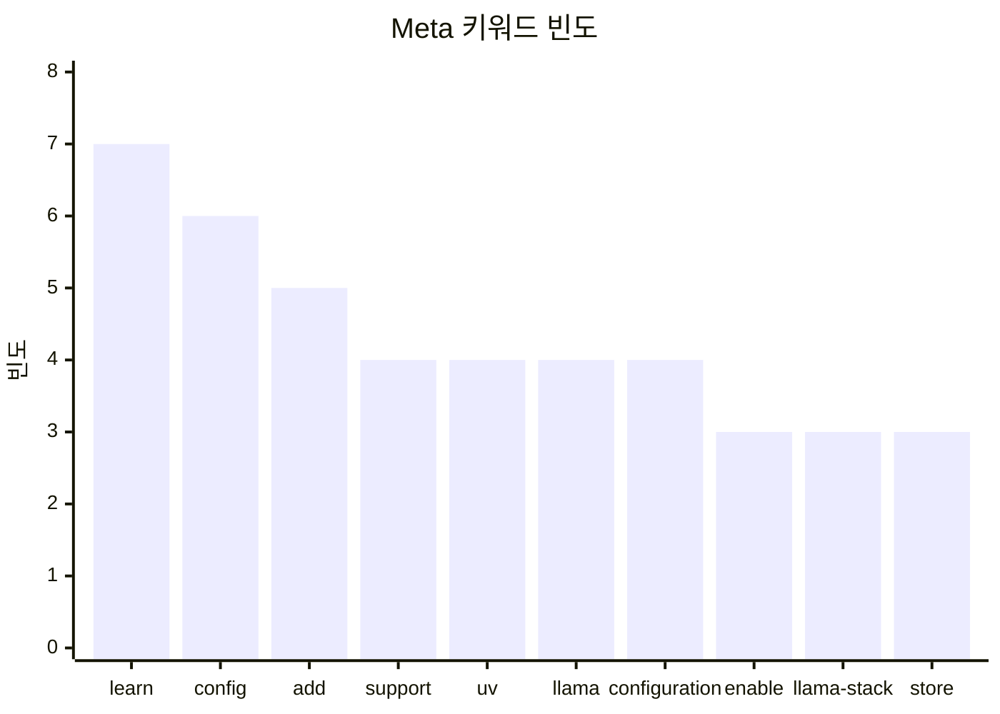
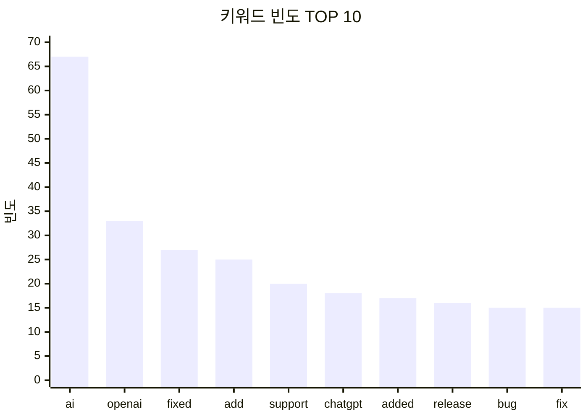

# 02-agent-analytics.http 테스트 결과

> 테스트 실행일: 2026-02-05

## 테스트 개요

Agent의 통계 집계(`get_emerging_tech_statistics`) 및 키워드 빈도 분석(`analyze_text_frequency`) Tool 테스트 결과입니다.

---

## 통계 분석 기능 테스트

### 1. Provider별 통계 집계 요청

**Request:**
```json
{
  "goal": "Provider별 수집 현황을 통계로 보여주세요."
}
```

**Response Summary:**

Provider별 수집 현황 통계는 다음과 같습니다:

| Provider   | 수집 건수 |
|------------|-----------|
| OPENAI     | 75        |
| ANTHROPIC  | 41        |
| GOOGLE     | 41        |
| META       | 27        |

### Mermaid 차트


이 통계는 각 Provider에 대한 최신 업데이트 수집 현황을 나타냅니다. 추가적인 정보가 필요하시면 말씀해 주세요!

**실행 정보:**
- toolCallCount: 1
- analyticsCallCount: 1
- executionTimeMs: 4567

---

## 키워드 빈도 분석 기능 테스트

### 5. 전체 키워드 분석 요청

**Request:**
```json
{
  "goal": "수집된 데이터의 주요 키워드를 빈도 분석해주세요."
}
```

**Response Summary:**

다섯 개의 주요 빅테크 IT 기업(OpenAI, Anthropic, Google, Meta, xAI)의 최신 업데이트에 대한 키워드 빈도 분석 결과는 다음과 같습니다.

### 1. OpenAI
- **총 문서 수**: 75
- **주요 키워드**:
  | 키워드       | 빈도 |
  |--------------|------|
  | ai           | 38   |
  | openai       | 31   |
  | chatgpt      | 18   |
  | enterprise    | 12   |
  | codex        | 9    |
  | data         | 8    |
  | agent        | 7    |
  | using        | 7    |
  | introducing   | 6    |
  | agents       | 5    |



### 2. Anthropic
- **총 문서 수**: 41
- **주요 키워드**:
  | 키워드       | 빈도 |
  |--------------|------|
  | fixed        | 27   |
  | added        | 17   |
  | claude       | 15   |
  | sessions     | 8    |
  | support      | 8    |
  | add          | 8    |
  | ai           | 7    |
  | anthropic    | 6    |
  | bug          | 6    |
  | pr           | 5    |



### 3. Google
- **총 문서 수**: 41
- **주요 키워드**:
  | 키워드       | 빈도 |
  |--------------|------|
  | ai           | 21   |
  | fix          | 12   |
  | release      | 12   |
  | initial      | 12   |
  | google       | 8    |
  | add          | 7    |
  | latest       | 6    |
  | kaggle       | 6    |
  | remove       | 5    |
  | support      | 5    |



### 4. Meta
- **총 문서 수**: 27
- **주요 키워드**:
  | 키워드       | 빈도 |
  |--------------|------|
  | learn        | 7    |
  | config       | 6    |
  | add          | 5    |
  | support      | 4    |
  | uv           | 4    |
  | llama        | 4    |
  | configuration | 4    |
  | enable       | 3    |
  | llama-stack  | 3    |
  | store        | 3    |



### 5. xAI
- **총 문서 수**: 0
- **주요 키워드**: 없음

---

이 분석 결과는 각 Provider의 최신 업데이트와 관련된 주요 키워드를 시각적으로 표현한 것입니다. 추가적인 정보가 필요하시면 말씀해 주세요!

**실행 정보:**
- toolCallCount: 5
- analyticsCallCount: 5
- executionTimeMs: 31541

---

## 복합 분석 테스트

### 10. 통계와 키워드 동시 요청

**Request:**
```json
{
  "goal": "Provider별 수집 통계를 보여주고, 전체 키워드 빈도 TOP 10도 함께 분석해주세요."
}
```

**Response Summary:**

### Provider별 수집 현황

다음은 각 Provider별로 수집된 Emerging Tech 데이터의 통계입니다.

| Provider   | 수집 건수 |
|------------|-----------|
| OPENAI     | 75        |
| ANTHROPIC  | 41        |
| GOOGLE     | 41        |
| META       | 27        |
| **합계**   | **184**   |


---

### 전체 키워드 빈도 TOP 10

다음은 전체 데이터에서 분석된 키워드 빈도 TOP 10입니다.

| 키워드     | 빈도 |
|------------|------|
| ai         | 67   |
| openai     | 33   |
| fixed      | 27   |
| add        | 25   |
| support     | 20   |
| chatgpt    | 18   |
| added      | 17   |
| release    | 16   |
| bug        | 15   |
| fix        | 15   |



---

### 요약
- 총 184개의 Emerging Tech 데이터가 수집되었으며, OpenAI가 가장 많은 수를 차지하고 있습니다.
- 키워드 분석 결과, "ai"가 가장 높은 빈도를 기록하였습니다.

**실행 정보:**
- toolCallCount: 2
- analyticsCallCount: 2
- executionTimeMs: 12133
