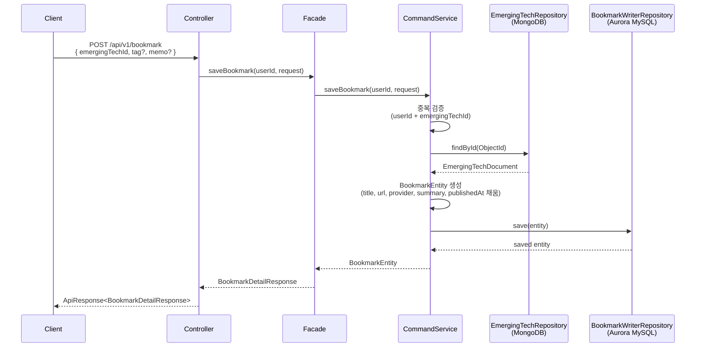
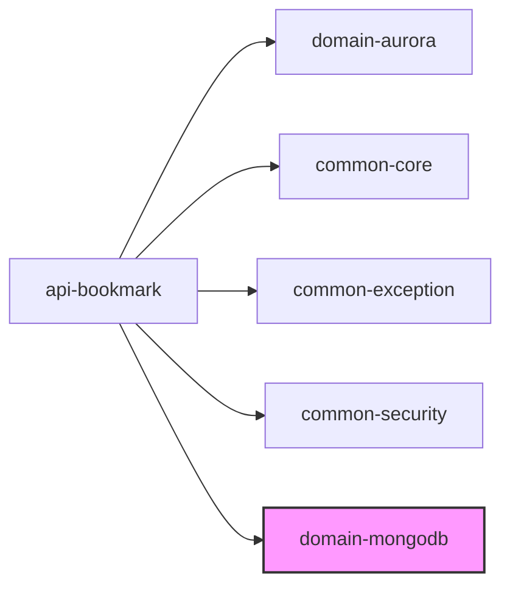

# 북마크 API EmergingTech 전용 재설계서

**작성 일시**: 2026-02-03
**대상 모듈**: `domain-aurora`, `api-bookmark`
**목적**: 북마크 기능을 EmergingTech 전용으로 재설계. 범용 `itemType`/`itemId` 구조를 제거하고 `EmergingTechDocument` 데이터를 직접 저장하는 구조로 변경.

---

## 목차

1. [개요](#1-개요)
2. [현재 구조 분석](#2-현재-구조-분석)
3. [변경 설계](#3-변경-설계)
4. [상세 변경 사항](#4-상세-변경-사항)
5. [구현 가이드](#5-구현-가이드)
6. [검증 기준](#6-검증-기준)

---

## 1. 개요

### 1.1 변경 배경

현재 `BookmarkEntity`는 `itemType` + `itemId`로 Contest, News 등 다양한 항목을 범용적으로 참조하는 구조이다. 이를 **EmergingTech 전용**으로 변경하여, `EmergingTechDocument`의 핵심 데이터(ObjectId, title, url, provider, summary, publishedAt)를 Aurora MySQL에 비정규화 저장한다.

### 1.2 변경 범위

| 모듈 | 변경 내용 |
|------|----------|
| `domain/aurora` | `BookmarkEntity` 컬럼 변경, `BookmarkReaderRepository` 쿼리 변경, Flyway 마이그레이션 |
| `api/bookmark` | DTO, Service, Facade, Controller, build.gradle 수정 |
| `docs` | 관련 설계서 업데이트 |

### 1.3 설계 원칙

- SOLID 원칙 준수 (단일 책임, 의존성 역전)
- 기존 계층 구조 유지: Controller → Facade → Service → Repository
- History, Soft Delete, 복구 기능 그대로 보존
- 오버엔지니어링 금지: 요구된 변경만 수행

---

## 2. 현재 구조 분석

### 2.1 BookmarkEntity (변경 전)

```java
@Entity
@Table(name = "bookmarks")
public class BookmarkEntity extends BaseEntity {
    private Long userId;        // 사용자 ID
    private String itemType;    // "CONTEST", "NEWS_ARTICLE" 등 (삭제 대상)
    private String itemId;      // MongoDB ObjectId 문자열 (삭제 대상)
    private String tag;         // 사용자 태그
    private String memo;        // 사용자 메모
}
```

### 2.2 현재 UNIQUE 제약조건

```sql
UNIQUE KEY uk_bookmark_user_item (user_id, item_type, item_id)
```

### 2.3 현재 BookmarkReaderRepository 주요 메서드

```java
// 중복 검증
Optional<BookmarkEntity> findByUserIdAndItemTypeAndItemIdAndIsDeletedFalse(
    Long userId, String itemType, String itemId);
```

### 2.4 현재 BookmarkCreateRequest

```java
public record BookmarkCreateRequest(
    @NotBlank String itemType,
    @NotBlank String itemId,
    String tag,
    String memo
) {}
```

### 2.5 현재 build.gradle 의존성

```gradle
dependencies {
    implementation project(':common-core')
    implementation project(':common-exception')
    implementation project(':common-security')
    implementation project(':domain-aurora')
}
```

### 2.6 EmergingTechDocument 참조 필드

```java
@Document(collection = "emerging_techs")
public class EmergingTechDocument {
    private ObjectId id;                    // MongoDB ObjectId
    private String provider;                // TechProvider: OPENAI, ANTHROPIC, GOOGLE, META, XAI
    private String title;                   // 제목
    private String summary;                 // 요약
    private String url;                     // 원본 URL (unique index)
    private LocalDateTime publishedAt;      // 게시일
    // ... 기타 필드 생략
}
```

---

## 3. 변경 설계

### 3.1 BookmarkEntity (변경 후)

```java
@Entity
@Table(name = "bookmarks")
public class BookmarkEntity extends BaseEntity {
    private Long userId;                    // 사용자 ID (유지)

    // --- 삭제 ---
    // private String itemType;
    // private String itemId;

    // --- 추가: EmergingTech 비정규화 데이터 ---
    private String emergingTechId;          // EmergingTechDocument ObjectId 문자열
    private String title;                   // EmergingTech 제목
    private String url;                     // EmergingTech 원본 URL
    private String provider;                // TechProvider (OPENAI, ANTHROPIC 등)
    private String summary;                 // EmergingTech 요약
    private LocalDateTime publishedAt;      // EmergingTech 게시일

    private String tag;                     // 사용자 태그 (유지)
    private String memo;                    // 사용자 메모 (유지)
}
```

### 3.2 UNIQUE 제약조건 변경

```sql
-- 변경 전
UNIQUE KEY uk_bookmark_user_item (user_id, item_type, item_id)

-- 변경 후 (url 제외 - utf8mb4 환경에서 VARCHAR(2048) 포함 시 인덱스 키 길이 3072바이트 초과)
UNIQUE KEY uk_bookmark_user_emerging_tech (user_id, emerging_tech_id)
```

### 3.3 데이터 흐름 (북마크 생성)



### 3.4 의존성 변경



`domain-mongodb` 의존성을 추가하여 `EmergingTechRepository`에 접근한다.

---

## 4. 상세 변경 사항

### 4.1 domain/aurora 변경

#### 4.1.1 BookmarkEntity.java

**파일**: `domain/aurora/src/main/java/com/ebson/shrimp/tm/demo/domain/mariadb/entity/bookmark/BookmarkEntity.java`

**변경 내용**:

```java
@Entity
@Table(name = "bookmarks")
@Getter
@Setter
public class BookmarkEntity extends BaseEntity {

    @Column(name = "user_id", nullable = false)
    private Long userId;

    // EmergingTechDocument 비정규화 필드
    @Column(name = "emerging_tech_id", nullable = false, length = 24)
    private String emergingTechId;

    @Column(name = "title", nullable = false, length = 500)
    private String title;

    @Column(name = "url", nullable = false, length = 2048)
    private String url;

    @Column(name = "provider", length = 50)
    private String provider;

    @Column(name = "summary", columnDefinition = "TEXT")
    private String summary;

    @Column(name = "published_at", precision = 6)
    private LocalDateTime publishedAt;

    @Column(name = "tag", length = 100)
    private String tag;

    @Column(name = "memo", columnDefinition = "TEXT")
    private String memo;

    // 기존 비즈니스 메서드 유지
    public boolean isOwnedBy(Long userId) {
        return this.userId.equals(userId);
    }

    public boolean canBeRestored(int daysLimit) {
        if (getDeletedAt() == null) {
            return false;
        }
        return getDeletedAt().isAfter(java.time.LocalDateTime.now().minusDays(daysLimit));
    }

    public void restore() {
        setIsDeleted(false);
        setDeletedAt(null);
        setDeletedBy(null);
    }

    // tag, memo만 수정 가능 (비정규화 데이터는 수정 불가)
    public void updateContent(String tag, String memo) {
        this.tag = tag;
        this.memo = memo;
    }
}
```

**변경 요약**:
- `itemType`, `itemId` 필드 삭제
- `emergingTechId`, `title`, `url`, `provider`, `summary`, `publishedAt` 필드 추가
- `url`은 `length = 2048`로 설정 (URL 길이 고려)
- 기존 비즈니스 메서드(`isOwnedBy`, `canBeRestored`, `restore`, `updateContent`) 그대로 유지

#### 4.1.2 BookmarkReaderRepository.java

**파일**: `domain/aurora/src/main/java/com/ebson/shrimp/tm/demo/domain/mariadb/repository/reader/bookmark/BookmarkReaderRepository.java`

**변경 내용**:

```java
@Repository
public interface BookmarkReaderRepository
        extends JpaRepository<BookmarkEntity, Long>, JpaSpecificationExecutor<BookmarkEntity> {

    // 중복 검증 (emergingTechId 기준으로 변경)
    Optional<BookmarkEntity> findByUserIdAndEmergingTechIdAndIsDeletedFalse(
        Long userId, String emergingTechId);

    // 삭제된 북마크 조회 (변경 없음)
    Page<BookmarkEntity> findByUserIdAndIsDeletedTrue(Long userId, Pageable pageable);

    // 복구 가능 기간 필터링 (변경 없음)
    @Query("SELECT a FROM BookmarkEntity a WHERE a.userId = :userId AND a.isDeleted = true " +
           "AND a.deletedAt >= :cutoffDate")
    Page<BookmarkEntity> findDeletedBookmarksWithinDays(
        @Param("userId") Long userId,
        @Param("cutoffDate") LocalDateTime cutoffDate,
        Pageable pageable);
}
```

**변경 요약**:
- `findByUserIdAndItemTypeAndItemIdAndIsDeletedFalse` → `findByUserIdAndEmergingTechIdAndIsDeletedFalse`
- 나머지 메서드는 변경 없음

#### 4.1.3 Flyway 마이그레이션 스크립트

**파일**: `domain/aurora/src/main/resources/db/migration/V{next}__{description}.sql` (신규)

```sql
-- 북마크 테이블 EmergingTech 전용 재설계

-- 1. 기존 UNIQUE 제약조건 삭제
ALTER TABLE bookmarks DROP INDEX uk_bookmark_user_item;

-- 2. 기존 컬럼 삭제
ALTER TABLE bookmarks DROP COLUMN item_type;
ALTER TABLE bookmarks DROP COLUMN item_id;

-- 3. 새 컬럼 추가
ALTER TABLE bookmarks ADD COLUMN emerging_tech_id VARCHAR(24) NOT NULL COMMENT 'EmergingTech ObjectId (24자 hex)' AFTER user_id;
ALTER TABLE bookmarks ADD COLUMN title VARCHAR(500) NOT NULL COMMENT 'EmergingTech 제목' AFTER emerging_tech_id;
ALTER TABLE bookmarks ADD COLUMN url VARCHAR(2048) NOT NULL COMMENT 'EmergingTech 원본 URL' AFTER title;
ALTER TABLE bookmarks ADD COLUMN provider VARCHAR(50) NULL COMMENT 'TechProvider (OPENAI, ANTHROPIC 등)' AFTER url;
ALTER TABLE bookmarks ADD COLUMN summary TEXT NULL COMMENT 'EmergingTech 요약' AFTER provider;
ALTER TABLE bookmarks ADD COLUMN published_at TIMESTAMP(6) NULL COMMENT 'EmergingTech 게시일' AFTER summary;

-- 4. 새 UNIQUE 제약조건 추가
ALTER TABLE bookmarks ADD UNIQUE KEY uk_bookmark_user_emerging_tech (user_id, emerging_tech_id);

-- 5. 인덱스 추가
ALTER TABLE bookmarks ADD INDEX idx_bookmark_emerging_tech_id (emerging_tech_id);
ALTER TABLE bookmarks ADD INDEX idx_bookmark_provider (provider);
```

> **참고**: UNIQUE KEY에서 `url`을 제외한 이유: `url VARCHAR(2048)`은 utf8mb4 기준 최대 8,192바이트로, InnoDB 인덱스 키 최대 길이 3,072바이트를 초과한다. `emerging_tech_id`는 MongoDB ObjectId의 hex 표현으로 항상 24자이므로, `(user_id, emerging_tech_id)` 조합만으로 중복 방지가 충분하다.

---

### 4.2 api/bookmark 변경

#### 4.2.1 build.gradle

**파일**: `api/bookmark/build.gradle`

**변경 내용**: `domain-mongodb` 의존성 추가

```gradle
dependencies {
    implementation project(':common-core')
    implementation project(':common-exception')
    implementation project(':common-security')
    implementation project(':domain-aurora')
    implementation project(':domain-mongodb')   // 추가
    annotationProcessor 'org.springframework.boot:spring-boot-configuration-processor'
}
```

#### 4.2.2 BookmarkCreateRequest.java

**파일**: `api/bookmark/src/main/java/com/ebson/shrimp/tm/demo/api/bookmark/dto/request/BookmarkCreateRequest.java`

**변경 내용**:

```java
public record BookmarkCreateRequest(
    @NotBlank(message = "EmergingTech ID는 필수입니다.")
    String emergingTechId,  // EmergingTechDocument ObjectId 문자열

    String tag,
    String memo
) {}
```

**변경 요약**:
- `itemType`, `itemId` → `emergingTechId`로 변경
- 클라이언트는 `emergingTechId`만 전달하면, 서버가 MongoDB 조회하여 나머지 데이터를 채움

#### 4.2.3 BookmarkDetailResponse.java

**파일**: `api/bookmark/src/main/java/com/ebson/shrimp/tm/demo/api/bookmark/dto/response/BookmarkDetailResponse.java`

**변경 내용**:

```java
public record BookmarkDetailResponse(
    String bookmarkTsid,
    String userId,
    String emergingTechId,
    String title,
    String url,
    String provider,
    String summary,
    LocalDateTime publishedAt,
    String tag,
    String memo,
    LocalDateTime createdAt,
    String createdBy,
    LocalDateTime updatedAt,
    String updatedBy
) {
    public static BookmarkDetailResponse from(BookmarkEntity entity) {
        if (entity == null) {
            return null;
        }

        return new BookmarkDetailResponse(
            entity.getId() != null ? entity.getId().toString() : null,
            entity.getUserId() != null ? entity.getUserId().toString() : null,
            entity.getEmergingTechId(),
            entity.getTitle(),
            entity.getUrl(),
            entity.getProvider(),
            entity.getSummary(),
            entity.getPublishedAt(),
            entity.getTag(),
            entity.getMemo(),
            entity.getCreatedAt(),
            entity.getCreatedBy() != null ? entity.getCreatedBy().toString() : null,
            entity.getUpdatedAt(),
            entity.getUpdatedBy() != null ? entity.getUpdatedBy().toString() : null
        );
    }
}
```

**변경 요약**:
- `itemType`, `itemId` → `emergingTechId`, `title`, `url`, `provider`, `summary`, `publishedAt`
- `from()` 메서드 매핑 업데이트

#### 4.2.4 BookmarkListRequest.java

**파일**: `api/bookmark/src/main/java/com/ebson/shrimp/tm/demo/api/bookmark/dto/request/BookmarkListRequest.java`

**변경 내용**:

```java
public record BookmarkListRequest(
    @Min(1) Integer page,
    @Min(1) @Max(100) Integer size,
    String sort,
    String provider  // itemType 대신 provider로 필터링
) {
    public BookmarkListRequest {
        if (page == null) page = 1;
        if (size == null) size = 10;
        if (sort == null) sort = "createdAt,desc";  // bookmarkedAt → createdAt으로 변경
    }
}
```

**변경 요약**:
- `itemType` → `provider`로 필터 변경 (TechProvider: OPENAI, ANTHROPIC 등)

#### 4.2.5 BookmarkCommandServiceImpl.java

**파일**: `api/bookmark/src/main/java/com/ebson/shrimp/tm/demo/api/bookmark/service/BookmarkCommandServiceImpl.java`

**변경 내용**:

```java
@Slf4j
@Service
@RequiredArgsConstructor
public class BookmarkCommandServiceImpl implements BookmarkCommandService {

    private static final int RESTORE_DAYS_LIMIT = 30;

    private final BookmarkReaderRepository bookmarkReaderRepository;
    private final BookmarkWriterRepository bookmarkWriterRepository;
    private final EmergingTechRepository emergingTechRepository;  // 추가

    @Transactional
    @Override
    public BookmarkEntity saveBookmark(Long userId, BookmarkCreateRequest request) {
        validateDuplicateBookmark(userId, request.emergingTechId());

        // MongoDB에서 EmergingTechDocument 조회
        EmergingTechDocument emergingTech = findEmergingTech(request.emergingTechId());

        BookmarkEntity bookmark = createBookmark(userId, request, emergingTech);
        BookmarkEntity savedBookmark = bookmarkWriterRepository.save(bookmark);

        log.debug("Bookmark created: id={}, userId={}, emergingTechId={}",
            savedBookmark.getId(), userId, request.emergingTechId());

        return savedBookmark;
    }

    private void validateDuplicateBookmark(Long userId, String emergingTechId) {
        bookmarkReaderRepository.findByUserIdAndEmergingTechIdAndIsDeletedFalse(
            userId, emergingTechId
        ).ifPresent(bookmark -> {
            throw new BookmarkDuplicateException("이미 존재하는 북마크입니다.");
        });
    }

    // MongoDB 조회 (import org.bson.types.ObjectId 필요)
    private EmergingTechDocument findEmergingTech(String emergingTechId) {
        try {
            ObjectId objectId = new ObjectId(emergingTechId);
            return emergingTechRepository.findById(objectId)
                .orElseThrow(() -> new BookmarkItemNotFoundException(
                    "EmergingTech를 찾을 수 없습니다: " + emergingTechId));
        } catch (IllegalArgumentException e) {
            throw new BookmarkValidationException("유효하지 않은 EmergingTech ID 형식입니다: " + emergingTechId);
        }
    }

    private BookmarkEntity createBookmark(Long userId, BookmarkCreateRequest request,
                                          EmergingTechDocument emergingTech) {
        BookmarkEntity bookmark = new BookmarkEntity();
        bookmark.setUserId(userId);
        bookmark.setEmergingTechId(request.emergingTechId());
        bookmark.setTitle(emergingTech.getTitle());
        bookmark.setUrl(emergingTech.getUrl());
        bookmark.setProvider(emergingTech.getProvider());
        bookmark.setSummary(emergingTech.getSummary());
        bookmark.setPublishedAt(emergingTech.getPublishedAt());
        bookmark.setTag(request.tag());
        bookmark.setMemo(request.memo());
        return bookmark;
    }

    // updateBookmark, deleteBookmark, restoreBookmark은 기존 로직 유지
    // (tag, memo만 수정하므로 변경 불필요)

    @Transactional
    @Override
    public BookmarkEntity updateBookmark(Long userId, String bookmarkTsid, BookmarkUpdateRequest request) {
        Long bookmarkId = Long.parseLong(bookmarkTsid);
        BookmarkEntity bookmark = findAndValidateBookmark(userId, bookmarkId);

        bookmark.updateContent(request.tag(), request.memo());
        BookmarkEntity updatedBookmark = bookmarkWriterRepository.save(bookmark);

        log.debug("Bookmark updated: id={}, userId={}", bookmarkId, userId);
        return updatedBookmark;
    }

    // deleteBookmark, restoreBookmark: 변경 없음 (기존 코드 그대로)
    // findAndValidateBookmark, findDeletedBookmark, validateRestorePeriod: 변경 없음
}
```

**변경 요약**:
- `EmergingTechRepository` 의존성 추가
- `saveBookmark()`: EmergingTechDocument 조회 후 비정규화 데이터 저장
- `validateDuplicateBookmark()`: `emergingTechId` 기준으로 중복 검증
- `findEmergingTech()`: MongoDB 조회 메서드 추가
- `createBookmark()`: 새 필드 매핑
- `updateBookmark`, `deleteBookmark`, `restoreBookmark`: **변경 없음**

#### 4.2.6 BookmarkQueryServiceImpl.java

**파일**: `api/bookmark/src/main/java/com/ebson/shrimp/tm/demo/api/bookmark/service/BookmarkQueryServiceImpl.java`

**변경 내용**:

```java
@Override
public Page<BookmarkEntity> findBookmarks(Long userId, BookmarkListRequest request) {
    Pageable pageable = PageRequest.of(
        request.page() - 1,
        request.size(),
        parseSort(request.sort())
    );

    Specification<BookmarkEntity> spec = Specification.where(null);
    spec = spec.and((root, query, cb) -> cb.equal(root.get("userId"), userId));
    spec = spec.and((root, query, cb) -> cb.equal(root.get("isDeleted"), false));

    // itemType 필터 → provider 필터로 변경
    if (request.provider() != null && !request.provider().isBlank()) {
        spec = spec.and((root, query, cb) -> cb.equal(root.get("provider"), request.provider()));
    }

    return bookmarkReaderRepository.findAll(spec, pageable);
}
```

**변경 요약**:
- `request.itemType()` → `request.provider()` 필터 변경
- `root.get("itemType")` → `root.get("provider")`
- 검색 기능(`searchBookmarks`)은 현재 tag, memo 검색만 유지
  - `title`, `summary`, `provider` 필드 검색은 본 설계 범위 외 (향후 필요 시 `searchField` 옵션 확장)
  - `BookmarkSearchRequest`의 `searchField` 옵션에 `"title"`, `"provider"` 등 추가 가능하나, 현재는 변경하지 않음

#### 4.2.7 BookmarkHistoryServiceImpl.java

**파일**: `api/bookmark/src/main/java/com/ebson/shrimp/tm/demo/api/bookmark/service/BookmarkHistoryServiceImpl.java`

**변경 내용**: `updateBookmarkFromHistory()` 메서드 수정

```java
private void updateBookmarkFromHistory(BookmarkEntity bookmark, Map<String, Object> afterDataMap) {
    // tag, memo 복구 (기존)
    String tag = afterDataMap.containsKey("tag") ? (String) afterDataMap.get("tag") : bookmark.getTag();
    String memo = afterDataMap.containsKey("memo") ? (String) afterDataMap.get("memo") : bookmark.getMemo();
    bookmark.updateContent(tag, memo);

    // EmergingTech 비정규화 데이터 복구
    if (afterDataMap.containsKey("emergingTechId")) {
        bookmark.setEmergingTechId((String) afterDataMap.get("emergingTechId"));
    }
    if (afterDataMap.containsKey("title")) {
        bookmark.setTitle((String) afterDataMap.get("title"));
    }
    if (afterDataMap.containsKey("url")) {
        bookmark.setUrl((String) afterDataMap.get("url"));
    }
    if (afterDataMap.containsKey("provider")) {
        bookmark.setProvider((String) afterDataMap.get("provider"));
    }
    if (afterDataMap.containsKey("summary")) {
        bookmark.setSummary((String) afterDataMap.get("summary"));
    }
    // publishedAt은 JSON에서 문자열로 저장되므로 파싱 필요
    if (afterDataMap.containsKey("publishedAt") && afterDataMap.get("publishedAt") != null) {
        try {
            bookmark.setPublishedAt(
                LocalDateTime.parse(afterDataMap.get("publishedAt").toString(), ISO_FORMATTER));
        } catch (DateTimeParseException e) {
            log.warn("History publishedAt 파싱 실패: {}", afterDataMap.get("publishedAt"), e);
        }
    }
}
```

**변경 요약**:
- History 복구 시 새 필드들도 afterData에서 복원
- `publishedAt`은 JSON 문자열 파싱 처리

#### 4.2.8 BookmarkController.java

**변경 없음**. 컨트롤러는 Facade에 위임하므로, DTO 변경이 자동 반영된다. 엔드포인트 경로와 HTTP 메서드는 동일하게 유지.

#### 4.2.9 BookmarkFacade.java

**변경 없음**. Facade는 Service에 위임하고 `BookmarkDetailResponse.from(entity)` 팩토리 메서드로 변환하므로, Entity와 Response DTO 변경이 자동 반영된다.

#### 4.2.10 ServerConfig.java (또는 Application 설정)

`domain-mongodb` 의존성 추가에 따라, `api-bookmark` 모듈에서 MongoDB 관련 설정이 필요하다.

**방법**: `application.yml`의 `spring.profiles.include`에 `mongodb-domain` 프로필 추가

```yaml
spring:
  profiles:
    include:
      - common-core
      - kafka
      - api-domain
      - mongodb-domain    # 추가
      - bookmark-api
```

또는 `ServerConfig.java`에서 `MongoClientConfig` import:

```java
@Configuration
@Import({ApiDomainConfig.class, SecurityConfig.class, MongoClientConfig.class})
// ...
public class ServerConfig {
}
```

> 기존 `api-emerging-tech` 모듈의 설정 방식을 따른다.

---

### 4.3 docs 업데이트

#### 4.3.1 `docs/step13/user-bookmark-feature-design.md`

다음 섹션 업데이트:

1. **개요 > 주요 기능**: "ContestDocument, NewsArticleDocument를 개인 북마크에 저장" → "EmergingTechDocument를 개인 북마크에 저장"
2. **아키텍처 설계 > Command Side**:
   - `item_type`, `item_id` 필드 → `emerging_tech_id`, `title`, `url`, `provider`, `summary`, `published_at` 필드
   - UNIQUE 제약조건: `(user_id, item_type, item_id)` → `(user_id, emerging_tech_id)`
3. **API 엔드포인트 설계**:
   - `POST /api/v1/bookmark`: Request에서 `itemType`/`itemId` → `emergingTechId`
   - `GET /api/v1/bookmark`: `itemType` 필터 → `provider` 필터
4. **북마크 저장 기능 설계**: EmergingTechDocument 조회 로직 추가
5. **프로젝트 구조 통합 > 의존성**: `domain-mongodb` 추가

#### 4.3.2 `docs/step1/3. aurora-schema-design.md`

bookmarks 테이블 DDL 섹션 업데이트:

```sql
CREATE TABLE bookmarks (
    id BIGINT UNSIGNED NOT NULL PRIMARY KEY COMMENT 'TSID',
    user_id BIGINT UNSIGNED NOT NULL COMMENT '사용자 ID',
    emerging_tech_id VARCHAR(24) NOT NULL COMMENT 'EmergingTech ObjectId (24자 hex)',
    title VARCHAR(500) NOT NULL COMMENT 'EmergingTech 제목',
    url VARCHAR(2048) NOT NULL COMMENT 'EmergingTech 원본 URL',
    provider VARCHAR(50) NULL COMMENT 'TechProvider',
    summary TEXT NULL COMMENT 'EmergingTech 요약',
    published_at TIMESTAMP(6) NULL COMMENT 'EmergingTech 게시일',
    tag VARCHAR(100) NULL COMMENT '태그',
    memo TEXT NULL COMMENT '메모',
    is_deleted BOOLEAN NOT NULL DEFAULT FALSE COMMENT '삭제 여부',
    deleted_at TIMESTAMP(6) NULL COMMENT '삭제 일시',
    deleted_by BIGINT UNSIGNED NULL COMMENT '삭제한 사용자 ID',
    created_at TIMESTAMP(6) NOT NULL DEFAULT CURRENT_TIMESTAMP(6) COMMENT '생성 일시',
    created_by BIGINT UNSIGNED NULL COMMENT '생성한 사용자 ID',
    updated_at TIMESTAMP(6) NOT NULL DEFAULT CURRENT_TIMESTAMP(6) ON UPDATE CURRENT_TIMESTAMP(6) COMMENT '수정 일시',
    updated_by BIGINT UNSIGNED NULL COMMENT '수정한 사용자 ID',
    INDEX idx_bookmark_user_id (user_id),
    INDEX idx_bookmark_user_is_deleted (user_id, is_deleted),
    INDEX idx_bookmark_emerging_tech_id (emerging_tech_id),
    INDEX idx_bookmark_provider (provider),
    UNIQUE KEY uk_bookmark_user_emerging_tech (user_id, emerging_tech_id)
) ENGINE=InnoDB
DEFAULT CHARSET=utf8mb4
COLLATE=utf8mb4_unicode_ci
COMMENT='북마크 테이블 (EmergingTech 전용)';
```

#### 4.3.3 `docs/step2/2. data-model-design.md`

Bookmark 데이터 모델 섹션 업데이트:

| 필드 | 타입 | 설명 | 비고 |
|------|------|------|------|
| `id` | BIGINT UNSIGNED | TSID Primary Key | BaseEntity 상속 |
| `user_id` | BIGINT UNSIGNED | 사용자 ID | NOT NULL, cross-schema FK |
| `emerging_tech_id` | VARCHAR(24) | EmergingTech ObjectId (24자 hex) | NOT NULL |
| `title` | VARCHAR(500) | EmergingTech 제목 | NOT NULL, 비정규화 |
| `url` | VARCHAR(2048) | EmergingTech 원본 URL | NOT NULL, 비정규화 |
| `provider` | VARCHAR(50) | TechProvider | 비정규화 |
| `summary` | TEXT | EmergingTech 요약 | 비정규화 |
| `published_at` | TIMESTAMP(6) | EmergingTech 게시일 | 비정규화 |
| `tag` | VARCHAR(100) | 사용자 태그 | 선택 |
| `memo` | TEXT | 사용자 메모 | 선택 |

---

## 5. 구현 가이드

### 5.1 구현 순서

```
Step 1: domain/aurora - BookmarkEntity 컬럼 변경
Step 2: domain/aurora - BookmarkReaderRepository 쿼리 변경
Step 3: domain/aurora - Flyway 마이그레이션 스크립트 작성
Step 4: api/bookmark  - build.gradle에 domain-mongodb 의존성 추가
Step 5: api/bookmark  - application.yml에 mongodb-domain 프로필 추가
Step 6: api/bookmark  - BookmarkCreateRequest DTO 변경
Step 7: api/bookmark  - BookmarkDetailResponse DTO 변경
Step 8: api/bookmark  - BookmarkListRequest DTO 변경 (itemType → provider)
Step 9: api/bookmark  - BookmarkCommandServiceImpl 변경
Step 10: api/bookmark - BookmarkQueryServiceImpl 변경 (필터 조건)
Step 11: api/bookmark - BookmarkHistoryServiceImpl 변경 (history 복구 로직)
Step 12: docs         - 관련 설계서 업데이트
Step 13: 검증         - 빌드 및 컴파일 확인
```

### 5.2 영향도 분석

| 파일 | 변경 수준 | 설명 |
|------|----------|------|
| `BookmarkEntity.java` | **Major** | 컬럼 구조 전면 변경 |
| `BookmarkReaderRepository.java` | **Minor** | 중복 검증 메서드명 변경 |
| `BookmarkCreateRequest.java` | **Major** | 요청 필드 전면 변경 |
| `BookmarkDetailResponse.java` | **Major** | 응답 필드 전면 변경 |
| `BookmarkListRequest.java` | **Minor** | `itemType` → `provider` 필터 변경 |
| `BookmarkCommandServiceImpl.java` | **Major** | MongoDB 조회 로직 추가, 생성 로직 변경 |
| `BookmarkQueryServiceImpl.java` | **Minor** | 필터 조건 1곳 변경 |
| `BookmarkHistoryServiceImpl.java` | **Minor** | History 복구 시 새 필드 반영 |
| `BookmarkFacade.java` | **None** | 변경 불필요 |
| `BookmarkController.java` | **None** | 변경 불필요 |
| `build.gradle` | **Minor** | 의존성 1줄 추가 |
| `application.yml` | **Minor** | 프로필 1줄 추가 |

### 5.3 주의 사항

1. **ObjectId import**: `BookmarkCommandServiceImpl`에 `import org.bson.types.ObjectId` 추가 필요. `new ObjectId(emergingTechId)` 변환 시 `IllegalArgumentException` 처리 필요
2. **MongoDB 연결**: `api-bookmark` 모듈이 MongoDB에 연결해야 하므로, `application-local.yml`에 MongoDB 연결 정보가 있는지 확인
3. **History 데이터 호환**: 기존 History 레코드의 `afterData` JSON에는 `itemType`/`itemId` 필드가 있으므로, History 복구 시 이전 데이터와의 호환성 고려 (기존 History 복구는 실패할 수 있음)
4. **기존 데이터 마이그레이션**: Flyway 스크립트 실행 전 기존 북마크 데이터가 있다면 데이터 마이그레이션 필요 (NOT NULL 컬럼 추가 시)
5. **기본 정렬 변경**: `BookmarkListRequest`의 기본 정렬이 `bookmarkedAt,desc` → `createdAt,desc`로 변경됨. `BookmarkEntity`에 `bookmarkedAt` 필드가 없으므로 `createdAt` 사용
6. **DateTimeParseException import**: `BookmarkHistoryServiceImpl`에 `import java.time.format.DateTimeParseException` 추가 필요

---

## 6. 검증 기준

### 6.1 컴파일 검증

```bash
./gradlew :api-bookmark:build
```

### 6.2 기능 검증 체크리스트

- [ ] `BookmarkEntity`에서 `itemType`, `itemId` 컬럼이 완전히 제거됨
- [ ] `emergingTechId`, `title`, `url`, `provider`, `summary`, `publishedAt` 컬럼이 추가됨
- [ ] UNIQUE 제약조건이 `(user_id, emerging_tech_id)`로 변경됨
- [ ] `BookmarkCreateRequest`에서 `emergingTechId`만 받고, 나머지는 MongoDB 조회로 채움
- [ ] `BookmarkDetailResponse`에 새 컬럼이 반영됨
- [ ] `BookmarkCommandServiceImpl`에서 `EmergingTechRepository.findById()` 호출 로직이 추가됨
- [ ] `BookmarkReaderRepository`의 중복 검증 쿼리가 `emergingTechId` 기준으로 변경됨
- [ ] `api/bookmark`의 `build.gradle`에 `domain-mongodb` 의존성이 추가됨
- [ ] 기존 History, Soft Delete, 복구 기능이 정상 동작함
- [ ] 모든 코드에서 `itemType`, `itemId` 참조가 완전히 제거됨
- [ ] 관련 설계서가 업데이트됨
- [ ] Flyway 마이그레이션 스크립트가 작성됨
- [ ] 최소한의 한글 주석이 추가됨
- [ ] SOLID 원칙과 클린코드 원칙이 준수됨

### 6.3 코드 검색 검증

```bash
# itemType/itemId 참조가 남아있지 않은지 확인
grep -rn "itemType\|itemId\|item_type\|item_id" api/bookmark/src/
grep -rn "itemType\|itemId\|item_type\|item_id" domain/aurora/src/main/java/com/ebson/shrimp/tm/demo/domain/mariadb/entity/bookmark/
grep -rn "itemType\|itemId\|item_type\|item_id" domain/aurora/src/main/java/com/ebson/shrimp/tm/demo/domain/mariadb/repository/reader/bookmark/
```

---

## 참고 자료

- `docs/step13/user-bookmark-feature-design.md` - 현재 북마크 기능 설계서
- `docs/step11/cqrs-kafka-sync-design.md` - CQRS Kafka 동기화 설계
- `docs/step1/3. aurora-schema-design.md` - Aurora 스키마 설계
- `docs/step2/2. data-model-design.md` - 데이터 모델 설계
- Spring Data JPA 공식 문서 (https://spring.io/projects/spring-data-jpa)
- Spring Data MongoDB 공식 문서 (https://spring.io/projects/spring-data-mongodb)
