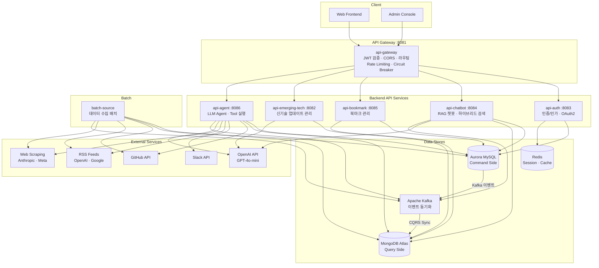
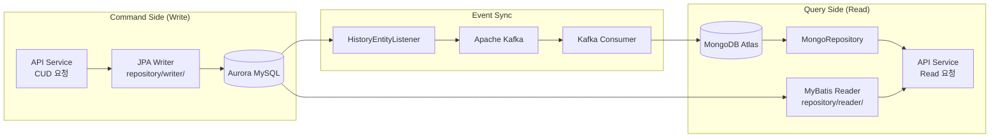
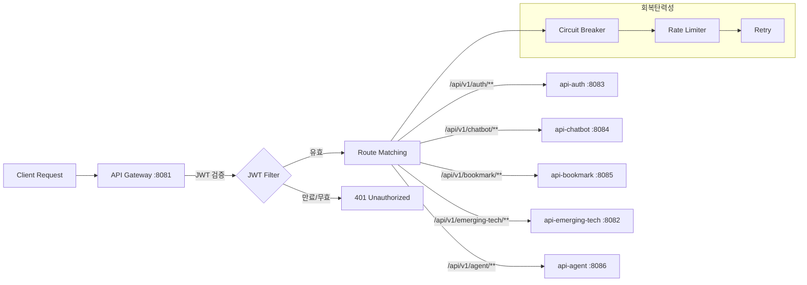
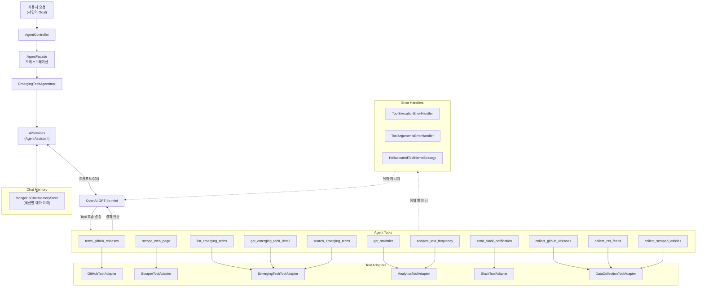
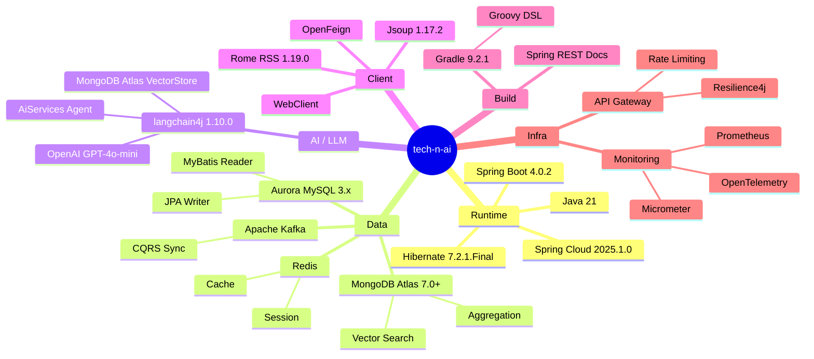

# 프로젝트 전체 아키텍처 다이어그램

> 이 문서는 tech-n-ai 프로젝트의 전체 모듈 구조, 의존성 관계, 데이터 흐름을 Mermaid 다이어그램으로 정리합니다.

## 1. 시스템 전체 구조

클라이언트 → API Gateway → 백엔드 서비스 → 데이터 저장소 흐름을 보여줍니다.

## 2. 멀티 모듈 의존성 그래프

모듈 간 `project(':xxx')` 의존성 관계를 계층별로 보여줍니다.

```mermaid
graph TD
    subgraph API["API Layer (Runnable Applications)"]
        api-gateway["api-gateway<br/>:8081"]
        api-auth["api-auth<br/>:8083"]
        api-chatbot["api-chatbot<br/>:8084"]
        api-bookmark["api-bookmark<br/>:8085"]
        api-emerging-tech["api-emerging-tech<br/>:8082"]
        api-agent["api-agent<br/>:8086"]
    end

    subgraph BATCH["Batch Layer"]
        batch-source["batch-source"]
    end

    subgraph CLIENT["Client Layer (외부 연동)"]
        client-feign["client-feign<br/>Feign · Internal API"]
        client-mail["client-mail<br/>메일 발송"]
        client-rss["client-rss<br/>RSS 파싱"]
        client-scraper["client-scraper<br/>웹 스크래핑"]
        client-slack["client-slack<br/>Slack 알림"]
    end

    subgraph COMMON["Common Layer (공유 라이브러리)"]
        common-core["common-core<br/>기반 유틸리티"]
        common-exception["common-exception<br/>전역 예외 처리"]
        common-security["common-security<br/>JWT · OAuth2"]
        common-kafka["common-kafka<br/>Kafka 이벤트"]
        common-conversation["common-conversation<br/>대화 세션/메시지"]
    end

    subgraph DS["Datasource Layer (데이터 접근)"]
        datasource-aurora["datasource-aurora<br/>Aurora MySQL · JPA/MyBatis"]
        datasource-mongodb["datasource-mongodb<br/>MongoDB Atlas"]
    end

    %% API → Client
    api-auth --> client-feign
    api-auth --> client-mail
    api-chatbot --> client-feign
    api-agent --> client-feign
    api-agent --> client-slack
    api-agent --> client-scraper
    api-agent --> client-rss

    %% API → Common
    api-gateway --> common-core
    api-gateway --> common-security
    api-auth --> common-core
    api-auth --> common-security
    api-auth --> common-exception
    api-bookmark --> common-core
    api-bookmark --> common-exception
    api-bookmark --> common-security
    api-chatbot --> common-core
    api-chatbot --> common-exception
    api-chatbot --> common-security
    api-chatbot --> common-conversation
    api-chatbot --> common-kafka
    api-emerging-tech --> common-core
    api-emerging-tech --> common-exception
    api-agent --> common-core
    api-agent --> common-exception
    api-agent --> common-conversation
    api-agent --> common-kafka

    %% API → Datasource
    api-auth --> datasource-aurora
    api-bookmark --> datasource-aurora
    api-bookmark --> datasource-mongodb
    api-chatbot --> datasource-aurora
    api-chatbot --> datasource-mongodb
    api-emerging-tech --> datasource-mongodb
    api-agent --> datasource-aurora
    api-agent --> datasource-mongodb

    %% Batch → others
    batch-source --> common-core
    batch-source --> common-security
    batch-source --> common-kafka
    batch-source --> datasource-aurora
    batch-source --> datasource-mongodb
    batch-source --> client-feign
    batch-source --> client-rss
    batch-source --> client-scraper

    %% Client → Common
    client-feign --> common-core
    client-feign --> common-exception
    client-feign --> common-kafka
    client-feign --> datasource-aurora
    client-feign --> datasource-mongodb
    client-mail --> common-core
    client-mail --> common-exception
    client-rss --> common-core
    client-rss --> common-exception
    client-scraper --> common-core
    client-scraper --> common-exception
    client-slack --> common-core
    client-slack --> common-exception

    %% Common → Datasource
    common-exception --> common-core
    common-exception --> datasource-mongodb
    common-kafka --> common-core
    common-kafka --> datasource-mongodb
    common-conversation --> common-core
    common-conversation --> common-exception
    common-conversation --> common-kafka
    common-conversation --> datasource-aurora
    common-conversation --> datasource-mongodb
    common-security --> common-core

    %% Datasource → Common
    datasource-aurora --> common-core
    datasource-mongodb --> common-core
```

## 3. CQRS 데이터 흐름

Command/Query 분리 패턴과 Kafka 기반 동기화 흐름입니다.

## 4. API Gateway 라우팅

Gateway에서 각 백엔드 서비스로의 라우팅 구조입니다.

## 5. Agent 모듈 Tool 실행 흐름

LangChain4j AiServices 기반 Agent의 Tool 호출 흐름입니다.

## 6. 기술 스택 요약

