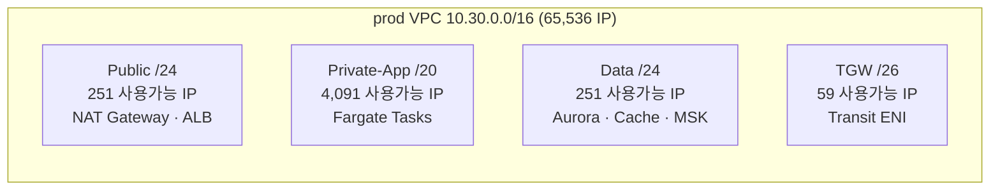

# 왜 Private-App 서브넷을 /20으로 잡았는가 — Fargate ENI 한 개의 무게로 본 CIDR 회계

> 시리즈: VPC 설계 다이어리 — 결정의 근거와 가역성에 대하여

---

## SEO 제목 후보

- **왜 Private-App 서브넷을 /20으로 잡았는가 — Fargate ENI 한 개의 무게로 본 CIDR 회계** — "/24가 아니라 /20인 이유"의 산술적 근거를 찾는 독자에게
- **AWS VPC CIDR 설계의 산술 — /20과 12배 헤드룸이 막아주는 운영 사고** — 헤드룸 산정 기준을 고민하는 인프라 엔지니어에게
- **Fargate Task당 ENI 1개라는 한 줄이 서브넷 사이즈를 결정한 이야기** — ECS Fargate를 새로 운영하기 시작한 SRE에게

---

## 들어가며

새 VPC를 설계할 때 자주 마주치는 질문이 있습니다. "서브넷은 그냥 /24면 되지 않나요." 250개 정도면 충분해 보인다는 직감은 사내 데이터센터 시절의 IP 계획에 깊이 뿌리내리고 있고, 한동안은 클라우드 위에서도 그 직감이 어느 정도 통하던 시기가 있었습니다. 그러나 ECS Fargate 위에 마이크로서비스를 올리고, 그 위에 Blue/Green 배포 전략을 얹는다고 가정하는 순간 이 직감은 조금 다른 결로 흔들립니다. 본 글에서 정리하려는 것은 개인 프로젝트로 VPC를 설계하면서 "Private-App 서브넷을 왜 /24가 아니라 /20으로 잡았는가"라는 하나의 결정을 산술적으로 풀어 보는 일입니다. 실제 트래픽이 흐르는 운영 단계의 회고가 아니라, 설계와 IaC 구축 단계에서 검토한 가정과 산술을 정리하는 글이라는 점을 먼저 밝혀 둡니다.

결정 자체는 짧습니다. AWS 공식 문서가 안내하는 ECS Fargate의 네트워킹 모델을 그대로 옮기자면, awsvpc 네트워크 모드를 쓰는 Fargate Task는 자신만의 ENI를 갖고 그 ENI에 사설 IPv4 주소가 할당됩니다. Task 하나가 늘어날 때마다 서브넷의 IP가 한 개씩 소비됩니다. 이 한 줄이 Private-App 서브넷의 사이즈를 정하는 출발점이 되고, 그 위에 워크로드의 패턴이 곱해지는 방향에 따라 사이즈가 /24인지 /20인지가 갈립니다. 본 글에서는 그 곱셈을 가능한 한 천천히 풀어 보려 합니다. 사실관계는 가능한 한 AWS 공식 문서와 RFC 1918에서 확인되는 범위 안에서만 다루겠습니다.

> **출발점.** Fargate Task당 ENI 1개. 이 한 줄이 IP 소비의 기본 단위가 됩니다.
>
> **결과.** 마이크로서비스 6개, 배치 1개, Blue/Green 동시 실행이라는 가정된 워크로드 위에서 /24는 빠르게 부족해지는 사이즈가 됩니다. /20은 이 프로젝트에서 가정한 워크로드를 약 12배 헤드룸으로 받아내도록 설계된 사이즈입니다.

---

## /24가 부족해지는 지점을 사고 실험으로 짚어 보기

상상해 보겠습니다. 한 환경에 마이크로서비스가 6개 있고, 각 서비스는 평소 트래픽 기준으로 Task 10개씩을 실행한다고 가정합니다. 운영 안정성을 위해 동일 서비스의 Task가 두 개 가용 영역에 분산된다고 가정하고, 평균적으로 각 Task가 ENI 한 개씩을 소비합니다. 단순 계산하면 정상 상태에서만 6 × 10 = 60개의 ENI가 사설망 위에 떠 있게 됩니다. 야간 배치 워크로드가 한두 개 더해지면 70 정도의 ENI 풋프린트가 자연스럽게 만들어집니다.

이 상태에서 Blue/Green 배포가 시작된다고 해 보겠습니다. AWS 공식 문서가 안내하는 Blue/Green 모델에서는, 배포가 진행되는 동안 새 버전(Green)의 Task 집합과 기존 버전(Blue)의 Task 집합이 일정 시간 동시에 떠 있게 됩니다. 단순화해서 모든 서비스가 같은 시간에 Blue/Green을 진행한다고 가정하면 ENI 풋프린트는 그 시간 동안 두 배 가까이 부풀어 오릅니다. 70 정도였던 풋프린트가 140 근처로 잠깐 올라가는 셈입니다.

여기까지는 /24도 견딜 수 있을 것처럼 보입니다. AWS 공식 문서에 따르면 /24의 사용 가능 IP는 256에서 AWS가 예약하는 IP 5개를 뺀 251개입니다. 140은 분명 251보다 작고 여유가 있어 보입니다. 그러나 실제 운영의 부피를 마저 더해 봐야 합니다. 오토스케일링이 발화한 순간, 데이터베이스 마이그레이션 Task가 잠시 같이 떠 있는 순간, 장애 복구 절차에서 Task가 두 AZ에서 동시에 재시작되는 순간, 그리고 무엇보다 회사가 성장해 마이크로서비스의 수가 8개, 10개로 늘어나는 순간 — 이 순간들이 한꺼번에 겹칠 가능성은 0이 아닙니다.

겹쳤을 때 어떤 종류의 사고가 발생하는지가 중요합니다. ECS Task가 ENI를 만들 IP를 서브넷에서 찾지 못하면 Task가 시작에 실패합니다. 이 사고는 자원 부족 사고이면서 동시에 배포가 멈추는 사고이기 때문에, 일반적인 자원 부족보다 한 단계 더 무겁게 다가옵니다. 더 까다로운 점은, 한 번 빠진 IP가 즉시 회수되지 않을 수 있다는 사실입니다. ENI가 분리되어도 사설 IP가 잠시 holding 상태에 머무는 시간이 있고, 그 시간 동안 새 Task가 같은 서브넷에서 IP를 잡지 못하는 상황이 펼쳐질 수 있습니다.

이 사고 실험의 결론은, "지금 당장은 /24가 충분해 보일지 몰라도, 운영 정점이 겹치는 순간을 방어하기에는 빠듯한 사이즈"라는 정도입니다. 251이라는 숫자는 평균 트래픽을 받아내는 데에는 충분하지만, 운영 단계에서 발생할 수 있는 사고를 받아내는 데에는 마진이 좁습니다. 이 프로젝트의 설계 결정은 그 마진을 산술적으로 12배 정도까지 넓혀 두자는 쪽이었고, 그 사이즈가 /20이었습니다.

---

## /20은 왜 4,096이 아니라 4,091인가

CIDR 산술을 차분히 짚어 보겠습니다. /20은 호스트 비트를 12개 갖는 네트워크입니다. 산술적으로는 2^12 = 4,096개의 주소를 표현할 수 있고, 이 중 사용 가능한 IP는 AWS가 정의한 예약 규칙에 따라 5개가 깎인 4,091개로 안내됩니다. AWS 공식 문서는 모든 서브넷마다 다섯 개의 IP가 예약된다고 명시합니다. 첫 번째 주소는 네트워크 주소, 두 번째는 VPC 라우터, 세 번째는 AWS가 제공하는 DNS, 네 번째는 미래 사용을 위한 예약, 마지막은 브로드캐스트입니다. AWS의 사설 네트워크에서 브로드캐스트가 실제로 동작하지 않더라도, 표기와 산술의 일관성을 위해 같은 규칙이 적용됩니다.

이 규칙은 서브넷의 사이즈와 무관하게 항상 5개입니다. /28 같은 작은 서브넷에서는 5개가 큰 비중을 차지하지만, /20에서는 거의 무시할 수 있는 수준입니다. 서브넷이 작아질수록 예약 IP의 비율이 크게 다가오고, 서브넷이 커질수록 그 비율이 빠르게 줄어든다는 점은 사이즈 결정의 보조적인 단서로 받아들이고 있습니다.

CIDR 분할은 Terraform의 `cidrsubnet(base, newbits, netnum)` 함수로 표현되곤 합니다. 이 프로젝트의 인프라 코드에서도 이 함수를 사용해 VPC CIDR을 결정적으로 잘랐고, 그 결정성 덕분에 같은 코드가 항상 같은 분할을 만들어 줍니다. 예를 들어 `cidrsubnet("10.30.0.0/16", 4, 0)`는 /20 사이즈의 첫 번째 조각인 `10.30.0.0/20`을 돌려주고, `cidrsubnet("10.30.0.0/16", 8, 0)`는 /24 사이즈의 첫 번째 조각인 `10.30.0.0/24`를 돌려줍니다. 함수가 갖는 결정성은 사람의 실수를 줄이는 안전장치로 작동합니다. 서브넷 사이즈를 손으로 계산해 IP 범위를 직접 적는 일은 한 번씩 0과 1을 헷갈리는 사고로 이어지기 쉽습니다.

CIDR 산술을 정리하다 보면, 사이즈 결정의 본질이 "몇 개의 호스트가 필요한가"에서 한 단계 더 내려간 "어떤 비트 폭의 헤드룸이 필요한가"로 옮겨 간다는 점이 보입니다. 본 글의 시작에서 언급한 12배 헤드룸이라는 표현도 이 비트 폭에서 출발합니다. /24는 8비트, /20은 12비트의 호스트 비트를 가지므로 단순 비트 차이만으로 16배의 IP 풍부성을 갖습니다. AWS 예약 IP 5개를 빼고 나면 251 대 4,091의 비율로 약 16.3배가 되고, 이 중 운영 정점에서 흔히 부풀어 오를 것으로 예상되는 비율을 보수적으로 계산해 12배 정도를 안전 마진으로 환산해 두는 것이, 이 프로젝트가 택한 회계 방식이었습니다.

---

## 한 VPC 안에서 서브넷 사이즈가 4계층으로 나뉘는 이유

이 프로젝트의 prod 환경 VPC 설계는 같은 /16 위에 네 종류의 서브넷이 사이즈를 달리해 그려져 있습니다. Public 서브넷은 /24, Private-App 서브넷은 /20, Data 서브넷은 /24, TGW 부착 서브넷은 /26입니다. 같은 VPC인데도 서브넷 사이즈가 다른 이유는 단순합니다. 각 계층이 소비할 것으로 예상되는 ENI의 패턴이 서로 다르기 때문입니다.

Public 서브넷이 받는 자원은 주로 NAT Gateway, ALB, 그리고 일부 통과형 자원입니다. 이 자원들은 워크로드의 수에 비례해 늘어나는 종류가 아니라, 운영 정책상 한 자릿수에서 두 자릿수 초반의 고정된 자원에 가깝습니다. 따라서 /24의 251개 IP는 헤드룸 측면에서도 충분히 여유가 있고, 너무 큰 서브넷을 잡으면 오히려 다른 계층의 사이즈를 줄이는 결과를 만듭니다.

Private-App 서브넷은 사정이 다릅니다. 앞서 사고 실험에서 본 것처럼 Fargate Task가 직접 IP를 소비하고, 배포 정책과 오토스케일링과 신규 서비스 추가가 모두 IP 풋프린트를 키우는 방향으로 작동할 것으로 예상됩니다. 이 계층은 가장 큰 헤드룸을 부여받아야 마땅한 곳이고, 그래서 /20 사이즈를 배정했습니다. prod 환경 설계에서는 두 개의 가용 영역에 각각 /20을 할당해 두어, 향후 단일 AZ 장애가 발생하더라도 Task를 다른 AZ로 옮겨 띄울 수 있는 마진이 함께 잡혀 있습니다.

Data 서브넷은 다시 다른 결입니다. RDS Aurora 클러스터, ElastiCache, MSK 같은 자원은 노드 수가 많아도 두 자릿수에서 멈추는 경우가 대부분이라고 알려져 있습니다. 의도적으로 노드 수를 늘리지 않는 한 IP 풋프린트가 갑자기 폭증할 가능성이 낮은 워크로드이기 때문에 /24로도 충분하다고 판단했습니다. Data 계층은 설계상 외부 자원이 거의 침입하지 않는 영역이라, 헤드룸을 무리하게 잡아 두는 일이 다른 계층의 자유도를 깎는 일보다 가치가 낮다고 봤습니다.

TGW 부착 서브넷은 가장 작은 /26으로 잡았습니다. AWS 공식 문서가 안내하는 Transit Gateway 부착 모델에서는 한 VPC당 가용 영역마다 ENI가 한 자릿수 단위로 사용됩니다. /26 사이즈로도 두 자릿수 헤드룸이 남기 때문에 향후 운영 단계에서도 무리가 없고, 좁게 잡는 편이 라우팅 테이블의 의도를 더 명료하게 만듭니다. 작게 잡힌 서브넷은 그 자체로 "이 영역은 트랜짓을 위한 곳"이라는 의도를 라우팅 테이블 위에서 분명하게 보여 줍니다.

서브넷의 사이즈를 한 장에 그려 보면 다음과 같습니다.

같은 VPC 안에서도 트래픽 패턴과 자원의 동적성이 다를 것으로 예상되는 만큼, 서브넷 사이즈를 한 가지로 통일하기보다 계층별로 차등화하는 편이 향후 운영의 자유도를 더 길게 가져가는 길이라고 봤습니다.

---

## 환경 간 10 단위 이격이라는 결정의 산술적 근거

이 프로젝트의 VPC CIDR은 환경별로 `10.10.0.0/16`, `10.20.0.0/16`, `10.30.0.0/16`이라는 세 대역으로 나뉘도록 설계했습니다. dev, beta, prod가 각각 10 단위로 이격되어 있는데, 이 결정은 단순히 보기 좋아서가 아니라 향후 Transit Gateway 라우팅과 VPC Peering의 충돌 회피를 함께 염두에 둔 결과였습니다.

세 대역이 서로 겹치지 않는다는 사실은 비트마스크로 즉시 확인됩니다. /16 마스크는 상위 16비트가 곧 네트워크 식별자이기 때문에, 두 대역이 같은 네트워크가 되려면 상위 16비트가 정확히 일치해야 합니다. `10.10.0.0`과 `10.20.0.0`은 상위 16비트가 서로 다르므로 두 네트워크의 교집합은 공집합입니다. 같은 논리로 `10.20`과 `10.30`도 겹치지 않고, `10.10`과 `10.30`도 겹치지 않습니다. 이 단순한 사실이, 향후 Transit Gateway 위에서 dev·beta·prod의 라우팅 테이블을 한 곳에 합칠 때 "어떤 대역이 어디로 가야 하는가"에 대한 모호함을 만들지 않습니다.

10 단위 이격을 굳이 두는 이유는 이 사이에 새로운 환경이 끼어들 자리를 비워 두기 위함이기도 합니다. 예를 들어 staging 환경을 추가로 만들고자 한다면 `10.40` 같은 새로운 10 단위 자리를 부여할 수 있고, 임시 실험 환경이라면 `10.11`과 `10.19` 사이의 자리를 빌려 쓸 수 있습니다. 한 단위 차이로 묶인 환경은 옆으로 확장할 수 있는 자리가 좁고, 10 단위로 이격된 환경은 그 사이에 두세 개 자리의 임시 대역을 자유롭게 끼워 넣을 수 있는 여유를 갖습니다.

이 결정이 오버엔지니어링처럼 보일 수도 있습니다. 환경 두세 개로 시작하는 시점에서는 `10.0.0.0/16`, `10.1.0.0/16`, `10.2.0.0/16` 같은 인접 대역도 별 문제 없이 동작합니다. 그러나 시간이 지나 신규 환경이 추가되거나, 외부 회사의 VPC와 Peering을 검토해야 하거나, 서드파티 SaaS의 사설 대역을 끌어와야 하는 시점이 오면, 환경 사이의 빈자리가 곧 결정의 자유도가 됩니다. 설계 노트를 공유할 때 자주 따라오는 질문, "왜 굳이 10이라는 숫자였느냐"에 대한 답은 결국 "지금 당장의 효율보다 미래의 결정 자유도를 산 것"이라는 정도로 정리됩니다.

---

## 외부 시스템과의 IP 충돌 — Atlas 기본 대역과 PrivateLink

CIDR 결정에서 의외로 많은 시간이 들어간 항목이 외부 시스템과의 충돌 회피였습니다. RFC 1918이 정의하는 사설 대역은 `10.0.0.0/8`, `172.16.0.0/12`, `192.168.0.0/16` 세 가지입니다. AWS 위에 새 VPC를 그릴 때 가장 먼저 검토되는 대역은 보통 `10/8` 또는 `172.16/12`이고, 이 프로젝트가 `10.10`, `10.20`, `10.30`을 선택한 배경에는 외부 시스템이 자주 점유하는 대역과 겹치지 않도록 하려는 의도가 함께 있었습니다.

분명한 사례 하나가 MongoDB Atlas였습니다. Atlas 클러스터가 자체 VPC 안에서 사용하는 기본 사설 대역이 `192.168.0.0/16` 근처에서 시작되는 구성이 있다는 점을 사전에 검토하면서, 이 프로젝트에서는 Atlas와의 통신을 VPC Peering이 아니라 PrivateLink로 묶기로 설계했습니다. 이 결정은 단순히 IP 충돌만의 문제가 아니라, 종단 간 트래픽이 Atlas의 VPC를 거치지 않도록 분리해 두는 보안 측면의 결정이기도 했습니다. AWS 공식 문서가 안내하는 PrivateLink는 컨슈머 VPC 안에 생성된 ENI가 서비스 종단을 직접 호출하는 모델이라, IP 대역 자체가 컨슈머 VPC 쪽에서만 결정되고 외부 IP 대역에 종속되지 않습니다.

이 결정의 부작용으로 PrivateLink 비용이라는 항목이 따라온다는 점도 알고 있었습니다. VPC Peering이 갖는 단순함, 즉 라우팅 테이블 한 줄로 두 VPC를 잇는 자유는 PrivateLink가 제공하지 않습니다. 그러나 향후 운영 단계에서 외부 사설 대역의 변경이나 충돌이 일으킬 영향을 설계 단계에서 차단해 둘 수 있다는 가치가, 향후 발생할 PrivateLink 시간당 비용을 충분히 상쇄할 만하다고 판단했습니다. 이 부분은 본 시리즈의 다른 글에서 더 자세히 다뤄질 예정이라, 여기서는 "외부 대역과의 충돌은 사고가 난 뒤에 풀기보다 설계 단계에서 분리해 두는 편이 저렴하다"는 정도로 정리해 두려 합니다.

---

## 12배 헤드룸이 운영에서 만들어내는 정적 안정감

산술적으로 12배 헤드룸이라는 표현이 향후 어떤 운영 안정감으로 환원될 수 있을지 조금 더 풀어 보겠습니다. 이 프로젝트의 마이크로서비스 수가 향후 두 배로 늘어난다고 가정해도, Private-App 서브넷의 IP 풋프린트가 8배까지 늘어날 가능성은 제한적입니다. 그래도 산술적으로 8배까지의 변화를 받아낼 수 있도록 설계해 두는 일은, 향후 일상적인 운영 결정에서 "지금 이 변경이 IP 사이즈에 미치는 영향이 어떤지"를 매번 확인하지 않아도 된다는 자유로 이어집니다.

이 자유는 작아 보여도 시간이 지날수록 누적되는 효과가 있을 것으로 보입니다. 마이크로서비스를 하나 더 추가하는 PR을 검토할 때, 배치 작업의 동시성을 잠시 두 배로 올려 보는 임시 실험을 진행할 때, 데이터 마이그레이션을 위해 Task 수를 일시적으로 부풀려야 할 때 — 매번 IP 가용량을 확인하고 손익을 따져야 한다면 결정 비용이 누적적으로 무거워집니다. 12배 헤드룸은 이 결정 비용을 설계 단계에서 한 번에 낮춰 두는, 일종의 무인화된 안전장치로 작동하도록 의도된 결정인 셈입니다.

물론 헤드룸을 무한히 잡아 둘 수는 없습니다. /20을 넘어 /18, /17 같은 더 큰 사이즈를 잡으면 같은 VPC 안에서 다른 계층의 사이즈가 줄어들고, 환경 간 이격에 사용할 자리도 좁아집니다. AWS 공식 문서가 안내하는 VPC당 IP 한도, 서브넷 한도, ENI 한도 같은 별도의 quota도 함께 점검되어야 합니다. /20이라는 사이즈는 계층 간 균형, 환경 간 이격, 서비스 quota를 동시에 만족하는 한가운데 지점에 가깝다고 봤습니다. 한 가지 정답이 있다는 의미보다는, 이 프로젝트가 가정한 워크로드 위에서 합계가 가장 가벼웠던 지점이라는 정도의 표현이 더 정확할 것 같습니다.

---

## 새 VPC를 그리기 전에 던져 보면 좋은 다섯 가지 산술 질문

이 프로젝트의 설계 과정을 돌아보면서 정리해 둔 다섯 가지 질문이 있습니다. 이 질문들은 새 VPC를 그릴 때 처음부터 마지막까지 들고 다닐 수 있는 짧은 체크리스트가 되어 줍니다.

- 워크로드의 IP 소비 단위는 무엇인가. EC2인가, Fargate Task인가, EKS Pod인가, Lambda ENI인가. 이 단위에 따라 한 워크로드가 만들어내는 IP 풋프린트의 곱셈 패턴이 달라집니다.
- 운영 정점에서 IP 풋프린트가 몇 배까지 부풀어 오를 수 있는가. Blue/Green 동시 실행, 오토스케일링 정점, 장애 복구 시 동시 재시작이 모두 같은 시간에 겹쳤을 때를 산술적으로 미리 계산해 두는 편이 안전합니다.
- 같은 VPC 안에서 서브넷 사이즈를 차등화할 자유가 있는가. Public, Private-App, Data, TGW가 모두 다른 사이즈를 가져갈 자리가 충분한가를 미리 확인하면, 한 계층이 다른 계층의 자유도를 깎는 사고를 피할 수 있습니다.
- 환경 간 CIDR 이격이 향후 Transit Gateway나 Peering에서 충돌을 만들 가능성은 없는가. 비트마스크로 두 대역의 교집합이 공집합인지 손으로 한 번 확인해 두는 편이 좋습니다.
- 외부 시스템의 사설 대역과 겹치지 않는가. 협력하는 SaaS, 인수 가능성이 있는 회사의 VPC, 자주 사용되는 사설 대역이 어디인지 미리 점검해 두면, 사후에 PrivateLink 같은 분리 결정이 강제되는 일을 줄일 수 있습니다.

이 다섯 가지는 이 프로젝트를 설계하면서 한 번씩 검토했던 항목들이고, 그래서 따로 기록해 두기로 했습니다. 같은 결정을 내려야 할 다른 자리에서는 다섯 가지 중 한두 가지 항목이 다른 무게를 가질 수도 있다고 생각합니다.

---

## 마무리 — '딱 맞게'보다 '잘 비워 두기'

이 글을 정리하면서 가장 크게 남은 인상은, 클라우드 위의 IP 회계가 사내 데이터센터의 IP 계획과 분명히 다른 사고방식 위에 서 있다는 점이었습니다. 사내망에서는 코어 스위치의 인터페이스 수와 VLAN 수, DHCP 풀의 크기가 IP 계획의 출발점이 되고, "딱 맞게 자르는" 사상이 효율의 표지처럼 받아들여집니다. 클라우드에서는 그 사상이 한 번 깊게 흔들립니다. ECS Task와 EKS Pod가 ENI를 직접 소비하기 때문에, IP 소비의 패턴이 워크로드의 모양과 더 밀접하게 묶이고, 그 모양은 시간이 지나면서 빠르게 변할 수 있습니다.

그래서 클라우드 위의 IP 계획에는 "딱 맞게"보다 "잘 비워 두기"라는 사상이 더 잘 어울린다고 봤습니다. 12배 헤드룸은 그 자체로는 자원 낭비처럼 보일 수도 있지만, 향후 운영 단계에서의 결정 비용을 낮추고 미래의 자유도를 사 두는 일종의 보험에 가깝다고 정리해 두려 합니다. 그리고 이 보험은 설계 단계에서 한 번 지불하면 되고, 이후 운영 단계 내내 같은 회계를 반복하지 않아도 된다는 점이 매력적이었습니다.

또 한 가지 남는 인상은, "왜 /20인가"라는 질문에 끝까지 숫자로 답할 수 있는 설계가 그렇지 않은 설계보다 후속 결정에서 훨씬 단단해진다는 점이었습니다. 산술적으로 출발해 산술적으로 도착한 결정은 공유하기 쉽고, 검토하기 쉽고, 시간이 지나서 다시 의심받았을 때 같은 산술로 다시 답할 수 있습니다. 본 시리즈의 다음 글에서는 이 결정과 맞물린 후속 결정들 — Blue/Green 자유도, Atlas PrivateLink, IPv6 가역성, SG 매트릭스 단순화 — 을 이어서 다뤄 보려 합니다. 같은 산술 위에서 어떤 결정들이 서로를 떠받치고 있는지가, "한 줄의 결정이 어떻게 다섯 개의 후속 결정을 만들어 가는가"를 드러내는 가장 자연스러운 방식이 되리라 생각합니다. 이 글이 비슷한 자리에서 같은 종류의 회계를 해 보려는 분들께 작은 참고가 된다면 좋겠습니다.

---

## 참고한 공식 문서

- ECS Fargate Task Networking: https://docs.aws.amazon.com/AmazonECS/latest/developerguide/fargate-task-networking.html
- RFC 1918 — Address Allocation for Private Internets: https://datatracker.ietf.org/doc/html/rfc1918
- AWS VPC User Guide: https://docs.aws.amazon.com/vpc/latest/userguide/
- AWS VPC Subnets and Reserved IPs: https://docs.aws.amazon.com/vpc/latest/userguide/subnet-sizing.html
- AWS Transit Gateway User Guide: https://docs.aws.amazon.com/vpc/latest/tgw/
- AWS PrivateLink Concepts: https://docs.aws.amazon.com/vpc/latest/privatelink/concepts.html
