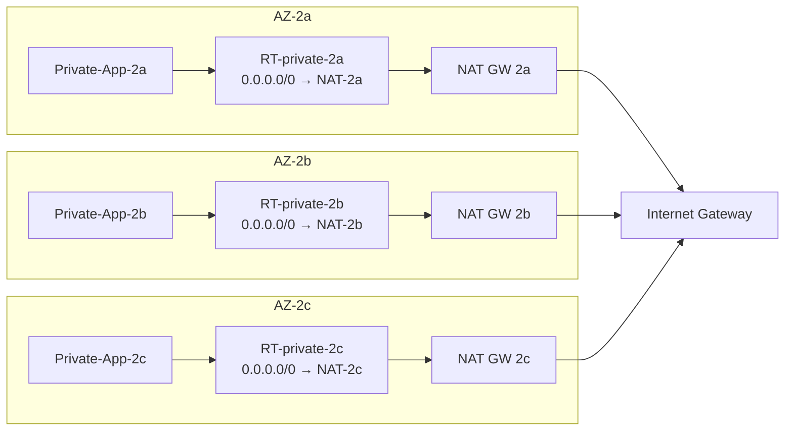
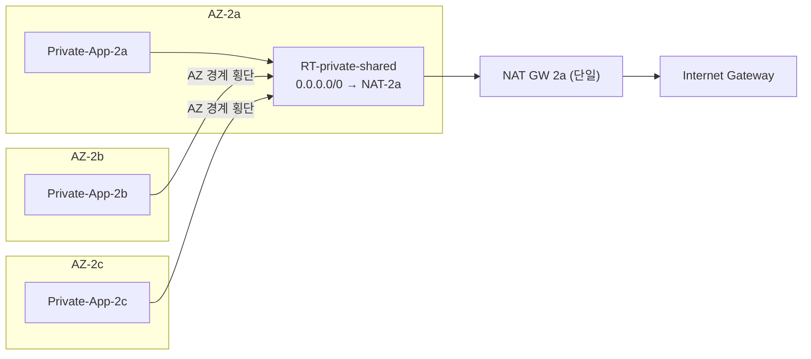

# 왜 prod에는 NAT Gateway 3개를, dev/beta에는 1개를 두었는가 — 환경별 회계의 한 줄 변수

> 시리즈: VPC 설계 다이어리 — 결정의 근거와 가역성에 대하여

---

## SEO 제목 후보

- **왜 prod에는 NAT Gateway 3개를, dev/beta에는 1개를 두었는가 — 환경별 회계의 한 줄 변수** — 환경별 가용성 분기를 고민하는 SRE/DevOps 엔지니어에게
- **AZ별 NAT Gateway 3개 vs 단일 NAT Gateway — SPOF와 비용 사이의 환경별 균형** — FinOps와 가용성을 함께 저울질하려는 인프라 엔지니어에게
- **`single_nat_gateway` 한 줄이 드러내는 환경별 가용성 회계** — IaC 모듈에서 환경 분기를 어떻게 표현할지 찾는 독자에게

---

## 들어가며

VPC 설계에서 NAT Gateway는 흔히 "그냥 하나 두면 되는 것"으로 다뤄집니다. 외부로 나가는 사설망의 트래픽에 공인 IP를 입혀 주는 한 컴포넌트라는 정의 자체는 단순하고, AWS의 매니지드 자원이라 운영 부담도 크지 않다는 인상이 따라옵니다. 그래서 "AZ마다 하나씩 둔다"는 권고가 처음 보이면 살짝 과해 보이기도 합니다. 비용이 그대로 곱해지기 때문입니다. 본 글에서 정리하려는 것은 이 권고를 마주한 자리에서 "prod에서는 AZ별로 3개를 두고 dev/beta에서는 단일 NAT 하나로 좁힌다"는 환경별 토폴로지 결정을 내리기까지의 산술적 회계입니다.

이 글은 실제 트래픽이 흐르는 운영 단계의 회고가 아니라, 개인 프로젝트로 VPC를 설계하고 IaC로 구축하는 단계에서 검토한 가정과 합계를 적은 글이라는 점을 먼저 밝혀 둡니다. 사실관계는 가능한 한 AWS 공식 문서와 Well-Architected Framework에서 확인되는 범위 안에서만 다루겠습니다. 글의 척추는 단순합니다. NAT Gateway 토폴로지가 한 줄짜리 IaC 변수(`single_nat_gateway`) 위에서 전혀 다른 두 그림으로 갈리고, 이 한 줄의 차이가 곧 환경별 가용성 회계의 가장 솔직한 표현이라는 점입니다.

> **핵심 정리.** prod에서는 가용성이 비싸지만 그만한 가치가 있습니다. dev/beta에서는 같은 가용성이 사치에 가깝습니다. NAT Gateway 토폴로지를 환경마다 다르게 두는 결정은 이 비대칭을 그대로 받아들이는 솔직한 회계에 가깝습니다.

---

## 3개와 1개의 차이는 어디서 갈리는가

같은 NAT라는 단어가 붙어 있어도, AZ별 3개와 단일 1개가 만들어 내는 가용성과 비용의 곱은 서로 다른 차원에서 작동합니다. 출발점은 단순한 사실 하나입니다. AWS 공식 문서가 안내하는 NAT Gateway는 가용 영역 단위 자원이고, 한 NAT Gateway는 자신이 배치된 AZ 안에서만 동작합니다. AZ 단위 장애가 발생하면 해당 AZ에 묶인 NAT Gateway도 함께 사용 불가가 되며, 다른 AZ의 자원이 자동으로 그 자리를 메워 주는 구조가 아닙니다.

여기서 SPOF의 정의가 분명해집니다. 단일 NAT 토폴로지에서는 NAT Gateway 한 개가 외부로 나가는 모든 사설 트래픽의 경로를 책임지므로, 그 한 자원이 사용 불가가 되면 모든 AZ의 사설 워크로드가 외부로 나가는 길을 잃습니다. 본 글에서 SPOF라는 단어는 "한 자원의 장애가 시스템 전체의 한 가지 기능을 멈춰 세울 수 있는 자리"라는 의미로 사용합니다. AWS Well-Architected Framework의 Reliability Pillar는 이런 자리를 줄이는 일을 핵심 권고 중 하나로 안내하고 있습니다.

AZ별 3개 토폴로지는 이 자리를 셋으로 분산합니다. AZ-2a의 NAT가 사용 불가가 되어도 AZ-2c와 AZ-2d의 NAT는 그대로 동작하며, 각 AZ의 라우팅 테이블이 동일 AZ 안의 NAT를 가리키도록 설정되어 있다면 다른 AZ의 사설 트래픽은 영향을 받지 않습니다. 같은 사건이 단일 NAT 토폴로지에서는 모든 AZ의 외부 통신을 묶어 세우는 사고가 되고, 멀티 NAT 토폴로지에서는 한 AZ의 외부 통신만 멈추는 국지적 사고가 됩니다. 같은 단어로 묶이는 사건이라도 그 사건이 만들어 내는 영향 반경이 토폴로지에 따라 한 자릿수와 두 자릿수의 차이로 갈립니다.

가용성의 차이만 있는 것이 아닙니다. 비용의 차이도 함께 갈립니다. NAT Gateway 한 개가 한 시간 동안 점유되는 비용은 자원 수에 비례해 곱해지므로, 토폴로지에 NAT가 셋이 되면 시간당 점유 비용도 산술적으로 셋이 됩니다. 데이터 처리 요금은 같은 양의 트래픽이라면 NAT 개수와 무관하게 한 번만 부과되지만, 시간당 점유 요금은 자원 수만큼 곱해진다는 점이 환경별 회계의 출발점이 됩니다. 가용성을 사면 비용이 곱해진다는 표현은 이 산술에서 출발합니다.

---

## NAT 비용은 시간과 처리량 두 축으로 갈라진다

NAT Gateway의 요금 구조를 한 번에 이해하기 위해서는 비용을 두 축으로 나누어 보는 편이 깔끔합니다. AWS 공식 문서는 NAT Gateway의 요금을 시간당 점유 요금과 데이터 처리 요금의 합으로 안내합니다. 시간당 점유 요금은 자원이 살아 있는 동안 발생하고 트래픽 양과 무관합니다. 데이터 처리 요금은 NAT를 통과하는 데이터 1GB마다 부과됩니다. 이 두 축은 서로 다른 동기로 움직이기 때문에, 비용을 줄이는 방향도 두 축에서 따로따로 결정됩니다.

시간당 점유 요금은 자원 수에 비례해 곱해집니다. AZ별 3개 토폴로지는 단일 NAT 토폴로지에 비해 시간당 점유 요금이 산술적으로 약 세 배가 됩니다. 데이터 처리 요금은 같은 양의 트래픽이라면 토폴로지와 무관하게 같은 합계로 수렴합니다. 따라서 환경별 비용 비교의 차이는 거의 시간당 점유 요금에서 갈리고, 그 차이가 본 글에서 말하는 "약 1/3 수준"이라는 비교의 근거가 됩니다. 절대 금액은 시점과 리전에 따라 달라지므로 본 글에서는 적지 않으며, 이 1/3 수준이라는 표현도 동일 트래픽 가정 아래 시간당 점유 요금 부분에 한정한 비교라는 점만 짚어 두려 합니다.

비용을 두 축으로 보는 시각이 유용한 이유는, 어느 축의 비용을 줄이는 결정인지에 따라 토폴로지가 다르게 답을 내기 때문입니다. 시간당 점유 요금을 줄이고 싶다면 NAT 개수를 줄이는 방향이 맞고, 데이터 처리 요금을 줄이고 싶다면 NAT 개수와 무관하게 트래픽 자체를 줄이거나 VPC Endpoint와 PrivateLink를 활용해 NAT를 거치지 않는 경로를 만드는 방향이 맞습니다. 환경별 회계가 시간당 점유 요금에 집중되는 이유는, dev/beta 환경의 트래픽 자체가 prod 대비 작을 것으로 예상되기 때문에 데이터 처리 요금의 합계가 이미 작고, 줄여서 의미 있는 절감이 나오는 자리는 시간당 점유 요금 쪽이라는 단순한 산술입니다.

ECS Outbound Networking Best Practices가 권고하는 방향도 큰 결에서 같은 자리를 가리킵니다. 외부로 나가는 트래픽이 NAT Gateway를 거치는 비중이 클수록 데이터 처리 요금이 비례해서 누적되므로, S3나 ECR 같은 자주 쓰는 AWS 서비스에 대해서는 VPC Endpoint를 두어 NAT를 우회하라는 권고가 들어 있습니다. 이 권고는 NAT 토폴로지를 바꾸는 결정과 별개의 축에서 동작하지만, 환경별 회계를 종합해 볼 때 두 결정이 함께 들여다봐야 하는 자리에 놓여 있다는 점을 보여 줍니다.

---

## 숨은 항목 — AZ 간 데이터 전송 비용

NAT 비용을 두 축으로 나눈 표 옆에, 잘 보이지 않지만 한 번씩 무겁게 작용하는 세 번째 항목이 있습니다. AZ 간 데이터 전송 비용입니다. AWS는 같은 리전 안이라도 가용 영역을 가로지르는 트래픽에 대해 별도의 데이터 전송 요금을 부과합니다. 이 요금은 NAT Gateway의 요금표에는 직접 등장하지 않지만, NAT를 통과하는 트래픽이 AZ를 가로지르는 순간 함께 부과되기 시작합니다.

문제가 발생하는 자리는 단일 NAT 토폴로지입니다. 단일 NAT 토폴로지에서는 NAT Gateway가 한 AZ에만 존재하므로, 다른 AZ에 있는 사설 워크로드가 외부로 나가려면 AZ-2b의 워크로드가 AZ-2a의 NAT를 거쳐야 합니다. 이 한 흐름 안에서 워크로드 → NAT 구간이 AZ를 가로지르고, AZ 간 데이터 전송 요금이 트래픽 양에 비례해 발생합니다. 시간당 점유 요금을 줄이려고 NAT를 하나로 좁혔는데, 그 절감이 AZ 간 데이터 전송 요금으로 다시 빠져나가는 형태가 됩니다. 트래픽이 많을수록 이 빠져나가는 비율이 커진다는 점도 함께 짚어 두려 합니다.

AZ별 3개 토폴로지는 이 흐름을 차단하는 구조를 함께 갖습니다. 핵심은 라우팅 테이블의 분리입니다. AZ별로 별도의 라우팅 테이블을 두고, 각 라우팅 테이블의 디폴트 게이트웨이가 자기 AZ 안의 NAT Gateway를 가리키도록 설계해 두면, 사설 워크로드의 외부 트래픽이 AZ 경계를 가로지르지 않고 같은 AZ 안에서 NAT를 만나 IGW로 나갑니다. AZ 간 데이터 전송 비용이 발생하지 않는 경로가 됩니다.

prod 환경의 라우팅 구조를 한 장에 그려 보면 다음과 같습니다.

dev/beta 환경의 라우팅 구조를 같은 시점에서 그려 보면 결이 분명히 달라집니다. 같은 변수 한 줄이 만들어 내는 그림이라는 점이 두 다이어그램을 나란히 두면 더 쉽게 보입니다.

두 그림을 같은 자리에서 보면, 같은 NAT라는 단어가 붙어 있어도 데이터 흐름의 형태가 다른 그림으로 그려진다는 점이 분명해집니다. AZ 경계를 가로지르는 화살표의 유무가 곧 비용 누수의 유무이고, 그 누수의 크기는 트래픽 양에 비례합니다.

---

## `single_nat_gateway` 한 변수의 무게

이 두 토폴로지는 IaC에서 단 한 줄의 변수로 갈립니다. 잘 알려진 Terraform 모듈 패턴에서는 `single_nat_gateway`라는 변수가 그 갈림길을 표현합니다. `false`이면 AZ 수만큼 NAT Gateway가 만들어지고, `true`이면 단일 NAT Gateway 하나만 만들어집니다. 환경별로 같은 모듈을 호출하되 이 한 변수만 달리 두는 호출 패턴이, 환경별 분기를 IaC 모듈 구조와 어긋나지 않도록 깔끔하게 표현해 줍니다.

이 프로젝트의 환경 분기 결정도 같은 결을 따릅니다. prod 환경은 `single_nat_gateway = false`로 호출되어 가용성을 우선하고, dev/beta 환경은 `single_nat_gateway = true`로 호출되어 시간당 점유 요금을 prod 대비 약 1/3 수준으로 좁힙니다. 두 호출은 같은 모듈을 가리키며, 모듈 내부에 환경별 분기 로직이 흩어져 있지 않습니다. 호출자가 변수를 달리 줄 뿐, 모듈은 한 가지 의미의 토폴로지를 변수의 값에 따라 다르게 그리는 일만 담당합니다.

이 분기 패턴이 가져다 주는 가장 큰 가치는, 환경별 토폴로지 결정이 가시화된다는 점입니다. 어느 환경이 어떤 토폴로지를 쓰는지가 코드 한 줄로 드러나고, 환경 간 차이를 의도적으로 둔 자리와 의도하지 않은 차이를 구분하기가 쉬워집니다. 환경별 분기를 모듈 내부에 숨겨 두면 "왜 dev에서만 이렇게 동작하는가"라는 질문에 답하기 위해 모듈 코드를 길게 읽어야 하지만, 분기를 호출 변수로 끌어 올려 두면 그 답이 변수 한 줄로 보입니다.

같은 변수가 가용성에 대한 결정과 비용에 대한 결정을 동시에 표현한다는 사실도 짚어 둘 만합니다. 가용성을 비싸게 사느냐, 비용을 좁게 두느냐의 갈림길이 한 변수에 묶여 있다는 점은 우연이 아니라, NAT Gateway라는 자원의 본질적 단위(AZ 단위 자원)가 그렇게 만든 자연스러운 결과로 보입니다. 자원의 단위를 그대로 받아들이면 변수도 그렇게 자연스럽게 줄어든다는 인상을 받았습니다.

---

## 같은 사건의 영향 반경이 달라지는 자리

환경별 토폴로지의 차이를 가장 분명하게 느낄 수 있는 자리는 가상의 장애 시나리오입니다. 같은 사건을 두 토폴로지 위에서 따로 따라가 보면 차이가 깨끗하게 드러납니다.

먼저 단일 NAT 토폴로지를 가정해 보겠습니다. dev 환경의 단일 NAT가 AZ-2a에 배치되어 있고, AZ-2a 단위 장애가 발생해 NAT Gateway가 사용 불가가 되었다고 해 보겠습니다. 라우팅 테이블이 모든 AZ의 사설 워크로드를 AZ-2a의 NAT로 가리키고 있으므로, AZ-2a뿐 아니라 AZ-2b와 AZ-2c의 워크로드도 외부로 나가는 길을 잃습니다. 영향 반경은 환경 전체입니다. dev 환경이 외부 의존성에 닿지 못하는 상태가 되면 외부 API 콜이 모두 실패하고, 새로 시작되는 컨테이너가 외부에서 패키지를 끌어오지 못해 부팅에 실패하는 형태로 사고가 번질 수 있습니다.

같은 사건을 AZ별 3개 토폴로지 위에서 따라가 보면 결이 다릅니다. AZ-2a의 NAT만 사용 불가가 되고, AZ-2c와 AZ-2b의 NAT는 그대로 동작합니다. AZ별 라우팅 테이블 덕분에 AZ-2c와 AZ-2b의 사설 워크로드는 자기 AZ 안의 NAT를 통해 외부로 나갈 수 있습니다. 영향 반경은 AZ-2a 한 곳으로 제한됩니다. 더 나아가 AZ-2a 단위 장애 자체가 ALB와 ECS Service의 다중 AZ 배치 덕분에 다른 AZ의 워크로드 인스턴스에 의해 흡수된다면, 외부에서 본 시스템의 상태는 일부 지연이 늘어나는 정도로 머물 수 있습니다.

장애 시나리오가 드러내는 핵심은, 토폴로지의 선택이 단순히 비용을 줄이는 결정이 아니라 "어느 정도의 영향 반경을 받아들일 것인가"에 대한 결정이기도 하다는 점입니다. dev/beta 환경에서 단일 NAT 토폴로지를 받아들이는 일은 "AZ 단위 사고가 환경 전체의 외부 통신을 멈출 수 있다"는 시나리오를 받아들이는 일이고, prod 환경에서 멀티 NAT 토폴로지를 받아들이는 일은 그 시나리오를 받아들이지 않겠다는 결정입니다. 환경별 회계의 가장 솔직한 표현이 한 변수라는 사실이 이 결정의 무게를 가볍게 만들지는 않습니다.

---

## 온프레의 NAT 이중화와 비교해 보면

온프레미스 환경에서 NAT는 보통 방화벽이나 라우터에 통합되어 있고, 이중화는 HSRP나 VRRP로 액티브-스탠바이 구성을 두는 형태가 일반적입니다. 박스를 두 대 사 둔 뒤 한 대를 액티브로, 나머지 한 대를 스탠바이로 두면 평소에는 비용이 박스 두 대 값으로 고정되고, 스위치오버가 일어나는 사건이 있을 때 스탠바이가 자리를 받아 줍니다. 이중화의 단가가 박스 구입 시점에 한 번 결정되고 그 뒤로는 거의 고정 비용처럼 다뤄집니다.

클라우드의 이중화는 결이 다릅니다. NAT Gateway는 시간 단위로 비용이 발생하고, 자원 수가 늘어날 때마다 시간당 비용이 그대로 곱해집니다. 이중화의 단가가 명시적이고, 그 명시성이 환경별로 다른 토폴로지를 쓰는 결정을 자연스럽게 만들어 줍니다. 온프레에서는 dev 환경에 박스를 한 대만 두는 결정이 박스 한 대 값을 추가로 사야 하는 결정이라 뻑뻑하지만, 클라우드에서는 dev 환경의 NAT를 하나로 좁히는 결정이 그저 변수 한 줄로 표현되고 시간당 비용이 그만큼 줄어드는 결과로 곧장 이어집니다.

이 비교는 클라우드가 더 우월하다는 이야기가 아니라, 비용의 가시성과 변경의 단가가 두 환경에서 다르게 작동한다는 정도의 관찰입니다. 같은 이중화라는 단어가 두 자리에서 다른 결정 비용을 갖는다는 점을 인지하고 있는 편이, 클라우드 위에서 환경별 분기를 그릴 때 더 솔직한 회계로 이어진다고 봤습니다.

---

## 가용성을 환경별로 회계하는 일

이 글을 정리하면서 가장 크게 남은 인상은, 가용성이 환경마다 다른 가격을 가지고 있다는 단순한 사실이었습니다. prod 환경의 가용성은 외부 사용자가 보는 시스템의 신뢰도와 직결되므로 비싸게 사도 그 가치가 분명합니다. dev/beta 환경의 가용성은 같은 시간만큼 비용을 지불해도 외부 사용자에게 직접 닿지 않으므로, 그만한 가치가 발현되는 자리가 좁습니다. 두 환경에 같은 토폴로지를 적용하는 일은 가용성의 가격을 환경 구분 없이 똑같이 지불하는 결정이고, 환경별로 토폴로지를 분기하는 일은 그 가격을 환경의 가치에 맞춰 다르게 지불하는 결정입니다.

`single_nat_gateway` 한 줄의 변수가 가지는 무게는 그래서 가볍지 않습니다. 한 줄의 코드가 환경별 가용성과 환경별 비용을 동시에 결정하고, 그 결정의 근거를 호출 변수의 값으로 드러냅니다. 한 줄에 모든 결정 회계가 압축되어 있는 자리는, 그 자리를 만드는 데에 들인 사고의 양에 비해 코드가 너무 가벼워 보일 정도입니다. 좋은 IaC 모듈의 표지 중 하나는 결정의 무게를 가벼운 코드 한 줄로 드러낼 수 있게 만드는 일이라고 봤습니다.

또 한 가지 남는 인상은, 환경별 토폴로지의 분기가 가져다 주는 가장 큰 이점이 "환경마다 다른 결정의 자유"를 보존해 주는 일이라는 점이었습니다. prod의 가용성을 의식해 토폴로지를 짜 두면서 dev/beta의 비용을 의식해 같은 변수의 다른 값으로 호출해 두면, 한 환경의 결정이 다른 환경의 결정 자유를 깎지 않습니다. 같은 모듈로 묶여 있어 일관성도 보존되고, 변수로 분기되어 있어 환경별 자유도도 보존됩니다. 이 두 가지가 함께 가는 모듈 구조가, 환경 분기가 흩어진 모듈보다 시간이 흐르며 길게 유지·확장되기에 더 나은 구조라는 인상을 받았습니다.

---

## 다음 글에서 이어서 다뤄 보고 싶은 것

본 시리즈의 다음 글에서는 이 글이 짧게 짚은 두 가지 자리를 한 단계 더 내려가 다뤄 볼 예정입니다. 첫째로는 NAT를 거치지 않는 경로를 만드는 VPC Endpoint와 PrivateLink의 자리, 둘째로는 환경별 분기가 NAT 한 컴포넌트를 넘어 Flow Logs와 Network Firewall, WAF 같은 다른 컴포넌트로 확장될 때 IaC 모듈이 어떻게 깔끔하게 묶이는지에 대한 자리입니다. 두 자리는 모두 본 글이 정리한 "환경별 회계의 가장 솔직한 표현"이라는 결을 한 단계 더 펼쳐 보는 글이 될 것으로 보입니다. 이 글이 비슷한 자리에서 같은 종류의 회계를 해 보려는 분들께 작은 참고가 된다면 좋겠습니다.

---

## 참고한 공식 문서

- AWS NAT Gateway: https://docs.aws.amazon.com/vpc/latest/userguide/vpc-nat-gateway.html
- ECS Outbound Networking Best Practices: https://docs.aws.amazon.com/AmazonECS/latest/bestpracticesguide/networking-outbound.html
- AWS Well-Architected — Reliability Pillar: https://docs.aws.amazon.com/wellarchitected/latest/reliability-pillar/
