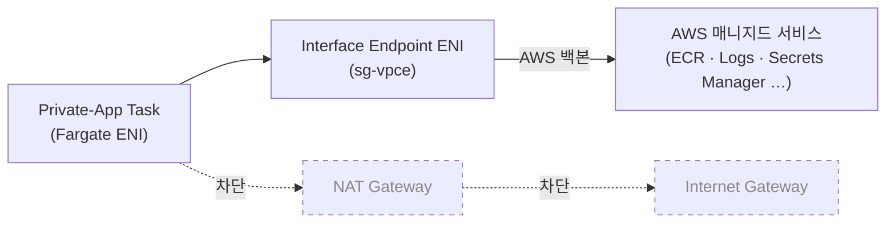

# 왜 PrivateLink는 비용 도구가 아니라 신뢰 경계 도구인가 — Gateway/Interface 선택의 진짜 이유

> 시리즈: VPC 설계 다이어리 — 결정의 근거와 가역성에 대하여

---

## SEO 제목 후보

- **왜 PrivateLink는 비용 도구가 아니라 신뢰 경계 도구인가 — Gateway/Interface 선택의 진짜 이유** — PrivateLink를 처음 설계하는 SRE/DevOps 엔지니어에게
- **Gateway Endpoint와 Interface Endpoint의 결정적 차이 — Endpoint Policy로 Data Exfiltration을 끊는 법** — 보안 관점으로 VPC Endpoint를 다시 보고 싶은 백엔드 엔지니어에게
- **NAT 절감 도구로 시작했다가 신뢰 경계 도구로 끝나는 PrivateLink — MongoDB Atlas Private Endpoint까지** — 외부 SaaS와의 통신 모델을 고민하는 인프라 엔지니어에게

---

## 들어가며

VPC Endpoint, 혹은 PrivateLink라는 이름을 처음 마주한 자리에서 가장 자주 듣는 설명은 "NAT 비용을 줄여 주는 도구"입니다. 사설 워크로드가 S3, ECR, CloudWatch Logs 같은 AWS 매니지드 서비스에 접근할 때 NAT Gateway를 거치지 않도록 해 주어, NAT 처리 비용과 AZ 간 데이터 전송 비용을 함께 줄여 준다는 식의 소개가 따라옵니다. 이 설명은 틀리지 않습니다. 다만 본 글에서 정리하려는 것은, 비용 절감이라는 첫인상으로 시작했다가 막상 IaC로 PrivateLink를 그려 두면서 오히려 보안 도구의 결로 다가왔던 한 결정의 회계입니다.

이 글은 실제 트래픽이 흐르는 운영 단계의 회고가 아니라, 개인 프로젝트로 VPC를 설계하고 IaC로 구축하는 과정에서 검토한 가정과 합계를 적은 글이라는 점을 먼저 밝혀 둡니다. 사실관계는 가능한 한 AWS PrivateLink의 공식 문서와 MongoDB Atlas의 공식 문서에서 확인되는 범위 안에서만 다루겠습니다. 글의 척추는 단순합니다. PrivateLink가 절감하는 비용의 정체를 한 번 짚어 보고, 그 절감이 의외로 작거나 커지는 자리를 정직하게 적어 본 다음, 그보다 훨씬 무거운 가치가 다른 자리(Endpoint Policy로 데이터 유출 경로를 끊는 일)에 있다는 점을 따라가 보려 합니다.

> **핵심 정리.** PrivateLink는 NAT 우회를 위한 가장 가벼운 도구이지만, 그 본질은 트래픽이 AWS 백본을 떠나지 않도록 묶어 두는 신뢰 경계 도구에 가깝습니다. Endpoint Policy의 `aws:PrincipalOrgID` 한 줄이 이 글의 진짜 결론입니다.

---

## 두 가지 PrivateLink — Gateway와 Interface의 본질

PrivateLink는 두 가지 형태로 갈립니다. AWS 공식 문서가 안내하는 분류를 그대로 옮기자면, 하나는 Gateway Endpoint이고 다른 하나는 Interface Endpoint입니다. 같은 PrivateLink라는 단어로 묶여 있어도 두 형태는 자원의 성격, 비용의 구조, 라우팅의 표현이 모두 다릅니다.

Gateway Endpoint는 라우팅 테이블에 한 줄을 추가하는 형태로 동작합니다. AWS가 관리하는 Prefix List(`pl-xxxx`) 한 개가 라우팅 테이블의 목적지로 등록되고, 해당 목적지로 가는 트래픽이 NAT Gateway나 IGW를 거치지 않고 AWS 백본 안에서 곧장 서비스 종단으로 향합니다. ENI를 새로 만들거나 별도의 자원을 추가로 띄우지 않으며, AWS 공식 문서가 안내하는 바에 따르면 Gateway Endpoint 자체에는 별도의 사용 요금이 부과되지 않습니다. 단, AWS가 Gateway Endpoint로 지원하는 서비스는 S3와 DynamoDB 두 가지입니다. 이 한정된 지원 범위가 Gateway Endpoint를 단순하면서도 좁은 도구로 만들어 주고 있습니다.

Interface Endpoint는 결이 다릅니다. 사설 서브넷 안에 ENI(Elastic Network Interface)가 한 개씩 생성되고, 그 ENI에 사설 IPv4 주소가 부여됩니다. 클라이언트는 그 ENI를 통해 AWS 매니지드 서비스의 종단을 호출하게 되며, ENI라는 물리적 자원이 만들어지는 만큼 시간당 점유 요금과 처리 데이터량당 요금이 함께 부과됩니다. 같은 PrivateLink라도 Interface Endpoint는 NAT Gateway와 비슷한 비용 구조를 가지며, 가용성을 위해 여러 가용 영역에 걸쳐 ENI를 두는 구성이 권장됩니다. AWS가 Interface Endpoint로 지원하는 서비스는 매우 많고, ECR, CloudWatch Logs, Secrets Manager, STS, SSM 계열, KMS, MSK 같은 자주 쓰는 서비스가 모두 이 형태로 지원됩니다.

두 형태의 본질을 한 줄로 줄이면 다음과 같이 정리됩니다. Gateway Endpoint는 "라우팅 테이블의 한 줄"이고, Interface Endpoint는 "서브넷 안의 ENI 한 개"입니다. 이 본질의 차이가 비용, 가용성, 보안 정책의 표현 방식에 모두 영향을 줍니다.

---

## 어느 서비스가 어느 형태인가 — 선택 매트릭스

자주 쓰는 AWS 서비스를 두 형태에 매핑해 보면 의사결정이 한 번에 정리됩니다. 아래 표는 이 프로젝트의 VPC 설계 단계에서 정리한 매핑이며, AWS 공식 문서가 안내하는 분류를 그대로 옮긴 것입니다.

| AWS 서비스 | Endpoint 형태 | 비고 |
| --- | --- | --- |
| S3 | Gateway | 라우팅 테이블에 Prefix List 한 줄, 자체 사용 요금 없음 |
| DynamoDB | Gateway | 라우팅 테이블에 Prefix List 한 줄, 자체 사용 요금 없음 |
| ECR (api) | Interface | `com.amazonaws.<region>.ecr.api` |
| ECR (dkr) | Interface | `com.amazonaws.<region>.ecr.dkr` |
| CloudWatch Logs | Interface | `logs` |
| Secrets Manager | Interface | `secretsmanager` |
| STS | Interface | `sts` |
| SSM (3종) | Interface | `ssm`, `ssmmessages`, `ec2messages` |
| KMS | Interface | `kms` |
| MSK | Interface | Kafka 부트스트랩 ENI |

이 표가 보여 주는 가장 큰 사실은, AWS가 Gateway Endpoint로 지원하는 서비스가 S3와 DynamoDB 두 가지로 한정된다는 점입니다. 그 외의 자주 쓰는 매니지드 서비스는 모두 Interface Endpoint 형태로 가져와야 합니다. 따라서 PrivateLink 도입을 검토하는 자리에서 가장 먼저 해야 하는 일은 "어느 서비스를 Endpoint로 가져올 것인가"가 아니라 "어느 서비스가 어느 형태를 가져야 하는가"를 정리하는 일이 됩니다.

표를 한 번에 그려 두면, 비용 회계도 곧장 따라옵니다. S3와 DynamoDB는 Gateway Endpoint이므로 자체 사용 요금 없이 NAT 우회 효과를 가져올 수 있고, 나머지 Interface Endpoint들은 ENI를 띄우는 만큼의 시간당·데이터당 비용이 발생합니다. 자주 쓰는 만큼 얻는 절감이 큰 자리(예: ECR, CloudWatch Logs)에서는 Interface Endpoint의 비용보다 NAT 절감이 더 크고, 거의 쓰지 않는 자리에서는 Interface Endpoint를 두는 비용이 NAT 절감보다 클 수도 있습니다. 어느 서비스에 Interface Endpoint를 둘지를 결정하는 회계는 결국 그 서비스가 호출되는 빈도와 트래픽 규모에 달려 있다는 점이, 글의 척추를 다음 단락으로 이어 줍니다.

---

## NAT 비용 절감의 진짜 정체

PrivateLink가 줄여 주는 NAT 비용의 정체는 두 항목의 합으로 나뉩니다. 첫째는 NAT Gateway의 데이터 처리 요금입니다. NAT Gateway는 자체 시간당 점유 요금 외에 통과하는 데이터량 1GB마다 별도의 처리 요금을 부과하며, 사설 워크로드가 S3나 ECR 같은 AWS 매니지드 서비스에 접근할 때 모든 트래픽이 이 NAT를 통과하면 처리 요금이 그대로 누적됩니다. PrivateLink는 이 트래픽을 NAT Gateway가 아닌 Endpoint(Gateway Endpoint의 경우 라우팅 테이블의 한 줄, Interface Endpoint의 경우 ENI)를 통해 보내므로, NAT Gateway 데이터 처리 요금이 그만큼 줄어듭니다.

둘째는 AZ 간 데이터 전송 요금입니다. 단일 NAT 토폴로지에서는 사설 워크로드의 외부 트래픽이 한 AZ의 NAT Gateway로 모이는데, 이 과정에서 AZ를 가로지르는 트래픽이 별도의 데이터 전송 요금을 발생시킵니다. PrivateLink Gateway Endpoint는 라우팅 테이블의 한 줄로 동작하므로 AZ를 가로지를 일이 없고, Interface Endpoint도 동일 AZ의 ENI를 통해 트래픽을 받도록 설계해 두면 AZ 경계를 넘지 않습니다. NAT 자체의 처리 요금에 더해, 이 AZ 간 데이터 전송 요금까지 함께 줄어드는 것이 PrivateLink가 절감하는 비용의 두 축입니다.

이 두 축의 절감이 얼마나 클지는 트래픽의 양과 패턴에 따라 갈립니다. ECR pull이 자주 발생하는 자리, CloudWatch Logs로 보내는 로그량이 많은 자리, S3에 객체를 자주 적재하는 자리에서는 절감이 의미 있는 크기로 누적될 가능성이 큽니다. 반대로 트래픽이 적은 자리에서는 Interface Endpoint의 ENI 시간당 점유 비용이 절감 합계보다 클 수도 있습니다. 절대 금액은 시점·리전·트래픽에 따라 달라지므로 본 글에서는 따로 적지 않으며, "어느 자리에서 절감이 크고 어느 자리에서 작은가"라는 결을 정성적으로 따라가는 정도로만 두려 합니다.

여기까지의 정리는 PrivateLink를 비용 도구로 보는 첫인상에 충실한 회계입니다. 막상 IaC로 Endpoint를 그려 두면서 받은 인상은, 이 첫인상이 끝이 아니라 출발점이라는 것이었습니다. 두 축의 비용 절감보다 훨씬 무거운 가치가 같은 도구의 다른 자리에 들어 있다는 점이 도리어 강하게 다가왔습니다.

---

## 절감보다 더 무거운 효과 — 데이터의 행선지를 통제하는 자리

PrivateLink가 가져다 주는 가장 무거운 효과는, 트래픽을 AWS 백본 안에 가두는 일이 곧 데이터의 행선지를 통제할 수 있는 자리를 만들어 준다는 점입니다. AWS PrivateLink의 공식 문서가 안내하는 Endpoint Policy는 IAM 정책과 같은 문법으로 작성되며, Endpoint를 통과하는 요청에 대해 어떤 자원·어떤 보안 주체·어떤 조건으로만 허용할지를 한 자리에서 정의할 수 있게 해 줍니다.

가장 인상적인 자리는 `aws:PrincipalOrgID` 조건 키입니다. 이 조건 키를 Endpoint Policy에 박아 두면, Endpoint를 통과하는 모든 요청이 본 조직의 AWS Organizations OrgID에 속한 보안 주체에서 발생한 요청으로 한정됩니다. 같은 결로 `aws:SourceVpce` 조건 키를 활용하면, 특정 Endpoint를 통과하는 요청만 허용하도록 자원 측 정책을 작성할 수도 있습니다. 두 조건 키를 함께 묶어 두면, 사설 워크로드 안의 자격 증명이 어떤 사고로 외부에 유출되더라도 그 자격 증명으로 외부 조직의 S3 버킷에 객체를 쓰거나 외부 DynamoDB 테이블에 항목을 넣는 일이 차단됩니다. 자격 증명의 유출과 데이터의 유출이 별개의 사건이 되도록 설계해 두는 자리입니다.

이 효과가 무거운 이유는 단순합니다. 비용 절감은 트래픽이 늘어날수록 누적되는 가치이고, 데이터 유출 경로의 차단은 사고가 한 번이라도 일어나면 누적 가치가 사고 한 건의 크기를 넘어 갑니다. 컴플라이언스 관점에서도 같은 결로 작동합니다. 개인정보보호나 GDPR이 요구하는 "허용된 행선지로만 데이터가 흘러야 한다"는 원칙은, 자격 증명 단계에서만 차단하는 것보다 네트워크 경계에서 한 번 더 차단해 두는 편이 더 단단한 보장을 만들어 줍니다. PrivateLink는 그 두 번째 차단이 일어나는 자리를 IaC로 표현할 수 있게 해 주는 도구라는 점에서, 비용 도구의 외피를 가지고 있을 뿐 본질은 신뢰 경계 도구에 가깝다고 느꼈습니다.

PrivateLink가 트래픽을 AWS 백본 안에 가두는 흐름을 한 장에 그려 보면 다음과 같습니다.

점선으로 표시한 NAT와 IGW 경로가 PrivateLink 도입 전의 기본 경로이고, 굵은 화살표가 PrivateLink 도입 후의 새 경로입니다. 트래픽이 AWS 백본을 떠나지 않는다는 사실이 그림으로 보면 한 줄의 화살표 차이로 드러납니다.

---

## 클라이언트 코드를 바꾸지 않아도 되는 자리 — Private DNS

PrivateLink가 IaC 설계에 잘 어울리는 또 한 가지 이유는, 클라이언트 코드 쪽에 변경을 거의 요구하지 않는다는 점입니다. AWS 공식 문서가 안내하는 Private DNS 옵션을 켜 두면, `s3.ap-northeast-2.amazonaws.com` 같은 표준 서비스 도메인을 클라이언트 코드에서 그대로 쓰더라도 VPC 내부의 Resolver가 그 도메인을 Endpoint의 사설 IP로 해석해 줍니다. SDK나 Spring Boot의 설정에서 별도 엔드포인트 URL을 박아 둘 필요가 없고, 표준 도메인을 그대로 쓴 코드가 자동으로 PrivateLink 경로를 타게 됩니다.

이 점이 결정 회계에서 가지는 무게는 작아 보여도 적지 않습니다. PrivateLink 도입이 클라이언트 코드 변경을 요구한다면 도입의 부담이 응용 계층까지 번지게 되고, 도입과 폐지의 자유도가 함께 좁아집니다. Private DNS가 그 자유도를 보존해 주는 덕분에, 환경별로 PrivateLink를 켜고 끄는 결정이 IaC 한 자리에서 끝나고 응용 코드는 변경되지 않습니다. 이 분리는 본 시리즈 002·003 글이 따라간 "환경마다 다른 결정의 자유를 보존한다"는 결과 같은 자리에 놓여 있다고 봤습니다.

---

## 한 보안 그룹과 두 개의 ECR — 설계 단계의 디테일

Interface Endpoint를 그릴 때 마주치는 디테일 중 한 가지는, 별도의 보안 그룹을 두는 일이었습니다. AWS PrivateLink의 공식 문서가 안내하는 바에 따르면, Interface Endpoint의 ENI에는 보안 그룹을 부착할 수 있고, 이 보안 그룹이 Endpoint로 들어오는 트래픽을 제어합니다. 이 프로젝트에서는 `sg-vpce`라는 이름의 전용 보안 그룹을 두고, Endpoint를 호출해야 하는 사설 워크로드의 보안 그룹을 인바운드 소스로 등록하는 방식으로 화이트리스트를 관리하기로 설계했습니다. Endpoint별로 보안 그룹을 따로 두지 않고 한 보안 그룹에 묶어 둔 이유는, 어떤 서비스가 어떤 워크로드의 호출을 허용하는지에 대한 정책 일관성을 한 자리에서 보장하기 위해서였습니다.

또 한 가지 디테일은 ECR이 두 개의 Endpoint를 요구한다는 점입니다. AWS 공식 문서가 안내하는 바에 따르면 ECR의 사설 접근에는 `com.amazonaws.<region>.ecr.api`와 `com.amazonaws.<region>.ecr.dkr` 두 종류의 Interface Endpoint가 모두 필요합니다. `ecr.api`는 ECR API 호출(예: `DescribeImages`, `GetAuthorizationToken`)에 사용되고, `ecr.dkr`는 실제 컨테이너 이미지 레이어를 가져올 때 사용되는 Docker Registry API에 사용됩니다. 둘 중 하나만 만들어 두면 ECR 호출이 부분적으로만 동작하고, 둘 다 만들어 두어야 사설망에서 ECR pull이 정상적으로 동작하는 구조입니다. 한 서비스 이름(ECR)에 두 개의 Endpoint가 필요하다는 사실은, 처음 PrivateLink를 그릴 때 한 번씩 빠뜨리기 쉬운 자리이기도 합니다.

이런 디테일이 글의 분량을 늘리는 이유는, PrivateLink가 한 번 결정으로 끝나는 도구가 아니라 여러 자리에서 짧은 결정을 연속으로 요구하는 도구라는 점을 보여 주기 위해서입니다. 결정의 무게는 한 곳에 모여 있지 않고, 여러 자리에 흩어진 작은 결정들이 합쳐져서 만들어 내는 누적 효과 위에 서 있다는 정도로 정리해 두려 합니다.

---

## 외부 SaaS와도 같은 모델 — MongoDB Atlas Private Endpoint

PrivateLink의 결정이 AWS 매니지드 서비스 안에서만 머무는 것은 아닙니다. AWS 외부의 SaaS 중 일부는 자체 PrivateLink Service를 제공해, 컨슈머 측 VPC가 사설 ENI를 통해 그 서비스의 종단을 호출할 수 있게 해 줍니다. MongoDB Atlas는 그 대표적인 자리입니다. MongoDB의 공식 문서가 안내하는 Private Endpoint 모델은 AWS 측의 Interface Endpoint와 거의 같은 형태로 동작합니다. 컨슈머 VPC 안에 ENI가 만들어지고, 그 ENI를 통해 Atlas 클러스터에 접근하는 구조입니다.

본 시리즈 002 글에서도 짧게 짚었지만, 이 프로젝트에서는 Atlas와의 통신을 VPC Peering이 아니라 PrivateLink로 묶기로 설계했습니다. 가장 큰 이유는 IP 대역 충돌의 가능성입니다. Atlas가 자체 VPC 안에서 사용하는 기본 사설 대역이 `192.168.0.0/16` 근처에서 시작되는 구성이 있고, 이 프로젝트의 사설 대역(`10.10`, `10.20`, `10.30`)과 Atlas 측 대역이 우연히 같은 자리를 점유할 가능성을 사전에 차단해야 했기 때문입니다. PrivateLink 모델은 컨슈머 VPC 측 ENI 한 개로 통신이 종결되므로, Atlas 측의 사설 대역이 컨슈머 VPC의 라우팅 테이블에 등장하지 않습니다. 대역 충돌이라는 문제 자체가 라우팅 결정에서 사라지는 셈입니다.

또 한 가지 가치는 Atlas 측의 보안 모델과의 정합성이었습니다. Atlas는 자체 IP Access List를 통해 어떤 IP에서의 접근을 허용할지를 제어하는데, PrivateLink를 사용하면 컨슈머 VPC의 ENI에 부여되는 사설 IP를 Access List에 등록하는 형태로 화이트리스트를 깔끔하게 관리할 수 있습니다. 외부 SaaS 측의 보안 정책과 컨슈머 VPC 측의 보안 정책이 같은 자리에서 만나도록 설계할 수 있다는 점이, AWS 매니지드 서비스에 대한 PrivateLink와 같은 결의 가치라고 느꼈습니다. 외부 SaaS와의 통신을 "VPC를 떠나지 않는 호출"로 옮겨 두는 결정은 비용보다 신뢰 경계의 결정에 가깝다고 다시 한 번 정리해 두고 싶습니다.

---

## 사내 Forward Proxy와의 결정적 차이

온프레미스 환경에서 외부 SaaS 호출은 보통 Forward Proxy를 거쳐 통제됩니다. Squid나 Zscaler 같은 프록시 자원이 사내 네트워크의 출구에 자리 잡고, 어떤 도메인·어떤 사용자·어떤 시간대에 외부로 나가는 호출을 허용할지를 한 자리에서 정의합니다. 사내에서 외부 SaaS의 호출을 한 점에서 통제할 수 있다는 점이 Forward Proxy의 가장 큰 가치였습니다.

PrivateLink Interface Endpoint와 Forward Proxy는 자리의 위치만 보면 비슷합니다. 사설망에서 외부로 나가는 호출이 한 자리(ENI 또는 프록시)를 통과하고, 그 자리에 보안 정책이 박혀 있다는 점이 거의 같은 결입니다. 차이는 통제의 단위에 있습니다. Forward Proxy는 도메인 단위로 화이트리스트를 작성하는 경우가 일반적이고, PrivateLink Endpoint Policy는 IAM 보안 주체와 자원 ARN, 조건 키 단위로 화이트리스트를 작성합니다. Forward Proxy의 통제가 "어디로 나가느냐"에 가깝다면, PrivateLink Endpoint Policy의 통제는 "누가 어떤 자원에 무엇을 하느냐"에 더 가까운 단위로 들어갑니다.

서비스 메시의 Egress Gateway도 비슷한 자리입니다. 다만 PrivateLink는 AWS API와 PrivateLink Service를 제공하는 SaaS 호출에 한해 백본을 떠나지 않는다는 점이 결정적 차이입니다. 임의의 외부 도메인을 모두 받아 주는 도구가 아니라, AWS 서비스와 일부 SaaS에 한정된 도구라는 점은 분명히 짚어 두는 편이 좋겠습니다. 온프레의 "내부망에서 끝나는 호출"이라는 문장이 클라우드에서는 "VPC를 떠나지 않는 호출"이라는 문장으로 옮겨지는 자리가 PrivateLink라고 정리할 수 있을 것 같습니다.

---

## PrivateLink는 신뢰 경계 도구다

이 글을 정리하면서 가장 크게 남은 인상은, PrivateLink의 첫인상과 마지막 인상이 분명히 달랐다는 점이었습니다. 첫인상은 NAT 비용을 줄여 주는 도구였고, 마지막 인상은 트래픽이 AWS 백본을 떠나지 않도록 묶어 두면서 데이터의 행선지를 통제할 수 있는 자리를 만들어 주는 도구였습니다. 같은 도구를 두 가지 결로 보는 일이 가능한 이유는, 도구가 한 자리에서 두 가지 가치를 동시에 만들어 주기 때문입니다.

비용 절감은 트래픽 양에 비례해 누적되는 정량적 가치이고, 신뢰 경계는 사고 한 건의 크기를 줄여 주는 비대칭적 가치입니다. 두 가치를 같은 표 위에 올려놓고 더해 보면, 트래픽이 작은 자리에서도 신뢰 경계의 가치는 그대로 유지된다는 점이 보입니다. 그래서 PrivateLink를 도입하는 결정의 회계는 "절감되는 비용이 Endpoint 자체 비용을 넘느냐"라는 한 줄의 비교만으로 끝나지 않고, "Endpoint Policy가 만들어 주는 데이터 행선지 통제의 가치를 어떻게 인정할 것인가"라는 두 번째 줄을 함께 써 두어야 더 정직한 회계가 됩니다.

체크리스트로 정리해 두면 다음 다섯 가지를 새 PrivateLink를 도입하기 전에 한 번씩 점검해 두는 편이 좋겠습니다.

- 도입하려는 AWS 서비스가 Gateway 형태인지 Interface 형태인지 확인되었는가. S3와 DynamoDB는 Gateway, 그 외는 대부분 Interface입니다.
- ECR처럼 한 서비스에 두 종류의 Endpoint가 필요한 자리가 있는지 빠뜨리지 않았는가. ECR은 `ecr.api`와 `ecr.dkr`을 모두 요구합니다.
- Endpoint Policy에 `aws:PrincipalOrgID`나 `aws:SourceVpce` 같은 조건 키가 박혀 있는가. 신뢰 경계로서의 PrivateLink의 본질은 이 한 줄에 들어 있습니다.
- 전용 보안 그룹(`sg-vpce` 같은 이름)을 두어 인바운드 소스를 한 자리에서 관리하고 있는가.
- Private DNS를 켜 두어 클라이언트 코드 변경 없이 표준 도메인이 PrivateLink 경로로 해석되도록 했는가.

체크리스트의 항목들은 운영 단계가 아닌 IaC 설계 단계에서 한 번 결정하면 그 뒤로는 거의 바뀌지 않는 자리들입니다. 처음 결정해 두는 자리에서 약간의 시간을 들이면 그 결정의 비용이 길게 분할 결제되는 셈이고, 처음에 빠뜨리면 응용 계층까지 영향을 주는 사고로 번질 수 있는 자리이기도 합니다. 이런 자리에서 PrivateLink가 가지는 도구의 결을 "비용 절감"이 아니라 "신뢰 경계"로 다시 정의해 두는 일이, 본 시리즈의 글들이 함께 따라가는 하나의 결을 더 분명하게 만들어 준다고 봤습니다.

---

## 다음 글에서 이어서 다뤄 보고 싶은 것

본 시리즈의 다음 글에서는 이 글이 짚은 신뢰 경계 도구의 자리를 한 단계 더 내려가 다뤄 볼 예정입니다. PrivateLink가 만들어 주는 신뢰 경계는 SG와 NACL이라는 또 다른 도구와 함께 묶였을 때만 누적 효과를 만들어 내며, "데이터 유출 경로 0"이라는 표현이 한 도구의 결과가 아니라 여러 도구가 합쳐진 결과라는 점이 다음 글의 척추가 될 것 같습니다. 이 글이 비슷한 자리에서 같은 종류의 회계를 해 보려는 분들께 작은 참고가 된다면 좋겠습니다.

---

## 참고한 공식 문서

- AWS PrivateLink 개념: https://docs.aws.amazon.com/vpc/latest/privatelink/concepts.html
- AWS PrivateLink로 AWS 서비스 접근: https://docs.aws.amazon.com/vpc/latest/privatelink/privatelink-access-aws-services.html
- MongoDB Atlas Private Endpoint: https://www.mongodb.com/docs/atlas/security-private-endpoint/
