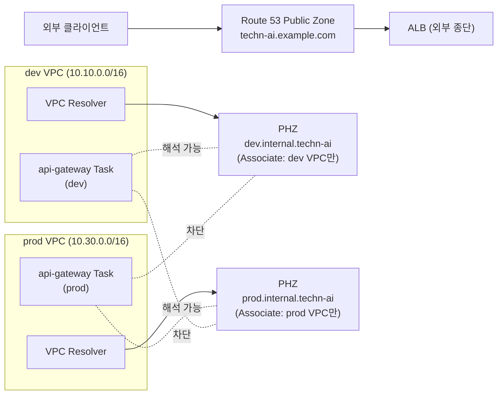

# 왜 환경별 PHZ와 Cloud Map이 토폴로지 분리의 마지막 한 겹인가 — 같은 도메인을 환경마다 다른 IP로 해석하는 결정

> 시리즈: VPC 설계 다이어리 — 결정의 근거와 가역성에 대하여

---

## SEO 제목 후보

- **왜 환경별 PHZ와 Cloud Map이 토폴로지 분리의 마지막 한 겹인가 — 같은 도메인을 환경마다 다른 IP로 해석하는 결정** — DNS 분리를 환경별로 어떻게 강제할지 고민하는 백엔드·DevOps 엔지니어에게
- **Route 53 Private Hosted Zone과 AWS Cloud Map — Split-horizon DNS를 Zone 자체의 분리로 다시 쓰는 법** — 사내 BIND/AD 모델에서 클라우드로 옮겨 오는 인프라 엔지니어에게
- **환경별 도메인 분리는 IaC의 한 줄로 끝난다 — PHZ Association과 Cloud Map의 ECS 라이프사이클 결합** — 서비스 디스커버리와 환경 격리를 함께 그리고 싶은 SRE에게

---

## 들어가며

운영 자리에서 가장 마주치기 싫은 한 문장은 "dev에서 prod 도메인을 호출하고 있었어요"입니다. 자주 일어나는 사고는 아니지만, 한 번 일어났을 때의 결과가 무겁기 때문에 단순한 확률 게임으로 다룰 수 있는 자리가 아닙니다. 환경 설정 파일의 한 줄이 잘못 복사되거나, 임시 디버깅을 위해 들고 다니던 도메인 한 줄이 PR로 함께 들어가거나, 셸이 dev 환경인 줄 알았는데 prod였던 자리에서, 같은 도메인이 환경마다 다르게 해석되어야 할 자리에 한 IP만 응답하는 결의 사고가 일어날 수 있습니다. DNS 단에서 같은 도메인이 환경마다 다른 자리로 해석되도록 분리해 두는 결정은, 그 사고의 확률을 환경 분리의 마지막 한 겹에서 0에 가깝게 만들어 두는 결정입니다.

이 글은 실제 트래픽이 흐르는 운영 단계의 회고가 아니라, 개인 프로젝트로 VPC를 설계하고 IaC로 구축하는 단계에서 검토한 가정과 합계를 적은 글이라는 점을 먼저 밝혀 둡니다. 사실관계는 가능한 한 AWS Route 53과 Cloud Map의 공식 문서에서 확인되는 범위 안에서만 다루겠습니다. 글의 척추는 두 점이 만나는 자리에 있습니다. 첫 점은 환경별 Private Hosted Zone(이하 PHZ)과 환경별 VPC Association이라는 두 자리가 만났을 때 비로소 "환경 간 네임 충돌이 구조적으로 불가능"해진다는 점입니다. 둘째 점은 Cloud Map이 단순한 DNS 자동 등록기가 아니라, ECS 서비스 라이프사이클과 결합된 DNS라는 점입니다. 두 점이 만나는 자리에서 본 시리즈가 따라간 토폴로지 분리의 마지막 한 겹이 그어진다고 봤습니다.

> **핵심 정리.** PHZ를 환경별로 두고 해당 환경 VPC에만 Associate해 두면, 같은 도메인이 환경마다 다른 IP로 해석됩니다. Cloud Map은 그 PHZ 위에서 ECS Task의 라이프사이클과 DNS 레코드의 라이프사이클을 한 자리로 묶어 줍니다.

---

## 두 종류의 Zone — Public Zone과 Private Hosted Zone

Route 53의 호스팅 영역은 두 가지 결로 나뉩니다. 하나는 인터넷의 권위 있는 응답을 책임지는 Public Hosted Zone이고, 다른 하나는 특정 VPC들 안에서만 의미를 갖는 Private Hosted Zone입니다. 두 Zone은 같은 도메인 이름 공간 위에 그려질 수도, 서로 다른 이름 공간 위에 그려질 수도 있고, 같은 이름 공간 위에 둘이 동시에 떠 있는 경우에는 Split-horizon DNS라 부르는 결의 구조가 만들어집니다.

이 프로젝트의 설계는 같은 이름 공간 위에 두 Zone을 함께 두기보다, 이름 공간 자체를 외부용과 내부용으로 분리하는 결을 택했습니다. Public Zone은 `techn-ai.example.com` 같은 외부 도메인을 책임지고 ALB의 ALIAS 레코드를 가리키며, Private 쪽은 `<env>.internal.techn-ai` 같은 내부 전용 이름 공간 위에 환경별 PHZ를 따로 그려 두는 결입니다. 두 이름 공간이 절단되어 있다는 점이 이후의 모든 결정을 가볍게 만들어 줍니다. 내부 트래픽은 내부 이름 공간만 해석되도록 두고, 외부 트래픽은 Public Zone의 한 곳에서만 응답이 권위 있게 나가는 결이 자연스럽게 따라옵니다.

이 자리에서 한 가지 짚어 두자면, 같은 도메인을 Public과 Private에 동시에 두는 Split-horizon 구조도 충분히 합리적인 자리입니다. 다만 그 구조는 내부와 외부의 응답을 같은 Zone 인스턴스가 view 분기로 처리하던 사내 BIND 모델의 결을 그대로 빌려 오는 결정이고, AWS에서는 PHZ가 어차피 별도 Zone 인스턴스이므로 이름 공간을 분리해 두는 편이 운영 의도를 IaC 위에서 더 분명하게 드러내 줍니다. 이 결정 자체는 절대적 정답이 있는 자리는 아니라고 봤습니다.

---

## 환경 간 네임 충돌이 구조적으로 불가능해지는 자리

같은 이름 공간(`<env>.internal.techn-ai`) 위에 환경별 PHZ를 따로 그리고, 각 PHZ를 해당 환경의 VPC에만 Associate해 두는 결정이 본 글의 가장 무거운 한 점입니다. AWS Route 53의 공식 문서가 안내하는 PHZ의 가시성 모델을 그대로 옮기자면, PHZ는 자신과 Associate된 VPC 안에서만 권위 있는 응답을 내놓고, Associate되지 않은 VPC에서 같은 도메인을 조회하면 그 질의는 PHZ로 떨어지지 않고 공식 문서의 표현 그대로 "인터넷의 권위 있는 응답으로 재귀적으로 해석"됩니다. 즉 prod 환경의 VPC 안에서 `api-gateway.prod.internal.techn-ai`를 조회하면 prod의 PHZ에서 응답이 돌아오지만, dev 환경의 VPC 안에서 같은 도메인을 조회하면 그 PHZ는 보이지 않고 질의는 공인 DNS 쪽으로 빠져나갑니다. 본 프로젝트의 내부 이름 공간(`.internal.techn-ai`)은 공인 DNS에 등록되어 있지 않은 자리이므로 그 재귀 해석의 결과는 NXDOMAIN으로 떨어지고, dev에서 prod의 내부 도메인을 해석할 수 있는 길은 결과적으로 남지 않습니다. 다시 말해 구조적 보호의 결은 두 자리에서 함께 성립합니다 — Associate되지 않은 VPC에서 PHZ가 보이지 않는다는 가시성의 결, 그리고 내부 이름 공간이 공인 DNS에 존재하지 않는다는 네이밍 규칙의 결입니다.

이 가시성 모델 덕분에 환경 간 네임 충돌은 "가능성이 작다"가 아니라 "구조적으로 불가능하다"는 결로 정리됩니다. dev 환경의 VPC가 prod의 PHZ와 Associate되어 있지 않은 한, dev의 어떤 워크로드도 prod의 내부 이름을 해석할 길이 없습니다. 오타가 한 번 일어났을 때 사고가 어떻게 번지느냐가 아니라, 오타가 일어났을 때 그 오타가 만들 수 있는 사고의 길 자체가 막혀 있는 결이라고 정리해 두면 결이 잘 맞습니다. 이 결을 IaC에 박아 두는 비용도 가벼운 자리입니다. 새 환경을 추가할 때 같은 모듈을 같은 변수의 새 값으로 호출하면 새 PHZ와 새 VPC Association이 함께 따라오는 결이라, 환경 추가 한 번의 결정 비용이 토폴로지의 다른 자리들과 결을 맞추어 가게 됩니다.

다만 한 가지 자리는 IaC가 책임져야 합니다. 환경별 PHZ가 두 자리로 그려져 있어도, 사람이 콘솔에서 한 PHZ를 다른 환경의 VPC에 실수로 Associate하면 위의 구조적 보호가 깨집니다. 사내 BIND가 단일 Zone 파일의 진실 공급원 위에서 view 분기를 했다면, AWS의 환경별 Zone 인스턴스 모델은 두 인스턴스를 함께 편집할 위험을 IaC가 막아 두어야 같은 보호가 성립합니다. 본 시리즈가 따라온 "환경별 분기는 호출 변수 한 줄로 표현한다"는 결과 같은 자리이며, IaC가 환경 분기의 진실 공급원을 차지하고 있는 한 사람의 손이 두 Zone을 동시에 건드릴 자리 자체가 좁아진다고 봤습니다.

이 자리의 분리 구조를 한 장에 그려 보면 결이 더 분명해집니다.

dev VPC 안의 워크로드는 dev PHZ만 해석할 수 있고, prod VPC 안의 워크로드는 prod PHZ만 해석할 수 있습니다. 두 점선이 교차하지 않는다는 사실이 그림으로 보면 한 줄의 화살표 차이로 드러납니다.

---

## 같은 서비스 이름이 환경마다 다른 자리를 가리키는 표

내부 이름 공간 위의 서비스 도메인을 환경별로 한 표에 그려 보면 같은 이름의 자리가 환경마다 다르다는 결이 한눈에 보입니다. 이 프로젝트가 설계한 네이밍 규칙은 `<service>.<env>.internal.techn-ai` 형태이며, 같은 서비스 이름이 환경별 PHZ 위에서 별도의 레코드로 떠 있도록 설계되어 있습니다.

| 서비스 | dev | beta | prod |
| --- | --- | --- | --- |
| api-gateway | `api-gateway.dev.internal.techn-ai` | `api-gateway.beta.internal.techn-ai` | `api-gateway.prod.internal.techn-ai` |
| api-auth | `api-auth.dev.internal.techn-ai` | `api-auth.beta.internal.techn-ai` | `api-auth.prod.internal.techn-ai` |
| api-bookmark | `api-bookmark.dev.internal.techn-ai` | `api-bookmark.beta.internal.techn-ai` | `api-bookmark.prod.internal.techn-ai` |
| api-chatbot | `api-chatbot.dev.internal.techn-ai` | `api-chatbot.beta.internal.techn-ai` | `api-chatbot.prod.internal.techn-ai` |
| api-agent | `api-agent.dev.internal.techn-ai` | `api-agent.beta.internal.techn-ai` | `api-agent.prod.internal.techn-ai` |

같은 표를 한 번 그려 두면, 코드에서 환경별 도메인을 일관된 패턴으로 조립할 수 있다는 결이 따라옵니다. 환경 변수 한 자리로 `<env>` 부분만 바꾸어 끼우면 같은 코드가 환경에 맞는 도메인을 자동으로 해석하게 되며, 응용 코드가 환경 분기 로직을 따로 들고 있을 필요가 없는 자리로 정리됩니다. 환경 분기의 무게가 IaC와 환경 변수 두 자리에서만 떠받쳐지고, 응용 코드 쪽은 그저 표준 도메인을 호출하는 결로 단순해진다고 봤습니다.

---

## Cloud Map은 ECS 라이프사이클과 결합된 DNS다

Route 53 PHZ가 환경별 이름 공간을 분리해 주었다면, 그 이름 공간 위에 실제 서비스 레코드를 만들어 넣고 지워 주는 도구가 AWS Cloud Map입니다. AWS Cloud Map의 공식 문서가 안내하는 모델을 그대로 옮기자면, Cloud Map은 네임스페이스를 PHZ 형태로 만들어 두고 그 안에 서비스 등록 단위를 정의해, 워크로드가 시작될 때 자동으로 DNS 레코드를 등록하고 종료될 때 자동으로 해제하는 결의 도구입니다.

Cloud Map의 결을 다른 서비스 디스커버리 도구들과 비교해 보면, 한 줄로 정리되는 차이가 보입니다. **Cloud Map은 ECS 서비스 라이프사이클과 결합된 DNS입니다.** ECS Service Discovery 통합을 켜 두면 ECS Service가 Task를 새로 띄울 때 Cloud Map의 서비스 등록 단위에 Task의 ENI 주소가 자동으로 등록되고, Task가 종료되거나 Health Check에서 떨어질 때 등록이 자동으로 해제됩니다. ECS 서비스의 상태와 DNS 레코드의 상태가 한 자리에서 묶이는 결이라, Consul이나 Eureka가 별도 헬스체크 프로토콜로 관리하던 자리가 ECS 자체의 라이프사이클로 자연스럽게 흡수됩니다.

이 결합이 가져다 주는 가치는 운영 결정의 무게를 가볍게 만드는 일이고, 절충이 따라오는 자리는 ECS 외의 워크로드에 대해서는 별도 등록 로직이 필요하다는 점입니다. Lambda나 EC2처럼 ECS 라이프사이클을 따르지 않는 워크로드를 같은 네임스페이스 안에 두려면, Cloud Map API를 직접 호출해 서비스 등록과 해제를 관리하는 결의 로직이 따로 필요합니다. Consul이나 Eureka가 워크로드 종류와 무관하게 같은 모델로 디스커버리를 묶어 주는 결을 가졌다면, Cloud Map은 그 결의 일부를 ECS에 한정하고 그 대신 ECS와의 결합을 강하게 가져가는 결정입니다. 어떤 결이 더 나은가는 워크로드 구성에 따라 갈리는 자리라고 봤습니다.

이 프로젝트의 워크로드는 거의 모두 ECS Fargate Task로 떠 있고, Lambda는 보조적인 자리에서 사용되며, EC2는 직접 띄우는 자리가 없는 구성이라 Cloud Map의 ECS 결합 모델이 결정 회계의 합계를 가볍게 만들어 주는 자리에 들어왔습니다. ECS 외 워크로드가 늘어나는 자리에서는 같은 결정이 다른 합계로 떨어질 수 있다는 점은 함께 짚어 두려 합니다.

---

## A 레코드와 SRV 레코드 사이의 선택

같은 Cloud Map 위에서도 두 가지 레코드 형식을 선택할 수 있습니다. 흔히 쓰이는 결은 두 가지인데, A 레코드와 고정 포트 조합, 그리고 SRV 레코드입니다. AWS Cloud Map의 공식 문서가 안내하는 바에 따르면 두 형식은 같은 서비스 등록 단위에서 골라 쓸 수 있고, 어느 쪽을 고르느냐가 응용 코드의 디스커버리 로직과 곧장 맞물립니다.

A 레코드와 고정 포트 조합은 가장 가벼운 결입니다. 서비스가 정해진 포트에서만 응답한다는 가정 아래, DNS 응답에서 받은 IP에 미리 약속된 포트를 붙여 호출하는 결의 방식입니다. Spring Boot의 `spring.cloud.discovery` 통합처럼 클라이언트가 IP만 받고 포트는 설정에서 가져가는 구조와 잘 맞물립니다. 응답이 단순하고 캐싱이 깔끔해, 호출의 결정 회계가 가벼운 자리입니다.

SRV 레코드는 포트까지 DNS 응답 안에 담아 주는 결이고, 동일 서비스의 인스턴스들이 서로 다른 포트에서 응답해야 하는 자리에서 가치가 더 분명해집니다. 컨테이너가 ECS의 동적 포트 매핑 위에 떠 있는 자리, 또는 한 호스트에 여러 인스턴스가 함께 떠 있어 포트가 서로 다른 자리에서는 SRV 레코드가 자연스럽습니다. 다만 클라이언트 라이브러리가 SRV 응답을 해석하고 인스턴스를 고르는 결의 로직을 가지고 있어야 하므로, 응용 코드 쪽의 디스커버리 구현이 한 단계 더 무거워지는 절충이 따라옵니다.

이 프로젝트의 워크로드는 Fargate Task가 `awsvpc` 모드에서 ENI를 직접 받고 컨테이너가 일정한 포트에서 응답하는 결이라, A 레코드와 고정 포트 조합이 결정 회계의 합계를 더 가볍게 만드는 자리에 들어왔습니다. SRV 레코드의 가치가 가장 크게 발현되는 자리(동적 포트 매핑)와 결이 다르기 때문입니다. 어느 쪽을 고르든 잘못된 결정이 되는 자리는 아니지만, 워크로드의 결합 패턴과 클라이언트 라이브러리의 결을 함께 보는 편이 정직한 회계로 이어진다고 봤습니다.

---

## Resolver Endpoint를 지금은 비활성으로 두는 자리

Route 53의 Resolver Endpoint는 사내망과 VPC 사이에서 DNS 질의를 양방향으로 흐르게 해 주는 도구입니다. 사내 BIND가 VPC 안의 워크로드를 해석해야 하는 자리, 또는 VPC 안의 워크로드가 사내 도메인을 해석해야 하는 자리에서 이 Endpoint가 다리 역할을 합니다. 이 프로젝트의 설계는 현재 단계에서 사내망 연동을 가정하지 않으므로, Resolver Endpoint는 IaC 정의에는 위치만 잡아 두고 활성화하지는 않은 자리로 두기로 했습니다.

이 결정의 결이 가지는 가치는 가역성에 있습니다. 향후 사내망과의 연동이 결정되는 자리에서는 같은 IaC 정의에 한 변수만 켜 두는 결로 Resolver Endpoint를 활성화할 수 있고, 활성화된 그 시점에 VPC 내부의 워크로드가 사내 도메인을 해석하기 시작하는 결이 자연스럽게 이어집니다. 지금 당장의 코드를 늘리지 않으면서 미래의 결정 비용을 줄여 두는 자리이며, 본 시리즈의 다른 단편들이 따라간 "결정을 잘 보류하는 자리"의 결과 같은 자리에 놓여 있다고 봤습니다.

또 한 가지 짚어 두자면, Resolver Endpoint는 인바운드와 아웃바운드 두 방향이 별도의 자원으로 분리되어 있다는 점입니다. AWS Route 53의 공식 문서가 안내하는 바에 따르면 인바운드 Endpoint는 사내망에서 VPC의 PHZ를 해석하기 위한 자리이고, 아웃바운드 Endpoint는 VPC에서 사내 도메인을 해석하기 위한 자리입니다. 두 방향이 분리되어 있다는 사실은, 사내망 연동을 한 방향만 켜 두는 결정이 가능해진다는 결과 같은 자리에 놓여 있습니다. 사내망이 VPC 안의 워크로드를 알 필요는 없지만 VPC가 사내 도메인을 알아야 하는 자리, 또는 그 반대의 자리에서, 어느 방향만 활성화할지를 분리된 자원으로 결정할 수 있다는 점이 가역성의 폭을 한 단계 더 넓혀 줍니다.

---

## 사내 BIND/AD와의 비교 — Zone 자체를 분리하는 결

사내 데이터센터에서 같은 도메인이 내부와 외부에서 다르게 해석되도록 분기시키는 방법은, 보통 BIND나 Active Directory DNS의 Split-horizon view를 거치는 결이었습니다. 한 Zone 인스턴스가 단일 진실 공급원으로 자리 잡고, 그 인스턴스 안에서 내부 응답과 외부 응답이 view 분기로 갈라지는 모델입니다. 같은 도메인이 자리에 따라 다른 응답을 내놓아야 한다는 요구를 한 인스턴스 안에서 해결한다는 결의 장점이 있고, Zone 파일의 단일성이 변경 추적을 단순하게 만들어 주는 결이 따라옵니다.

AWS의 결은 이 자리에서 한 번 갈립니다. PHZ는 어차피 별도 Zone 인스턴스로 만들어지므로, 같은 도메인의 view 분기보다 이름 공간 자체를 분리해 두는 편이 더 자연스럽습니다. 이 프로젝트의 설계는 외부 이름 공간(`techn-ai.example.com`)과 내부 이름 공간(`<env>.internal.techn-ai`)을 절단해 두는 결로 갔고, 같은 자리에서 내부 이름 공간 안의 환경별 PHZ도 별도 인스턴스로 분리해 두었습니다. Zone 파일의 단일성을 포기하는 대신, 환경별 인스턴스라는 결을 통해 환경 간 네임 충돌이 구조적으로 불가능해지는 자리를 얻어 왔다고 정리할 수 있습니다.

이 갈림길에서 짚어 두고 싶은 결은, 어느 쪽이 더 우월하다는 이야기가 아니라 운영 모델의 단위가 다르다는 점입니다. 사내 BIND의 단일 진실 공급원은 변경 추적의 단순성을 가져다 주는 결이고, AWS의 환경별 Zone 인스턴스는 환경 격리의 단단함을 가져다 주는 결입니다. 같은 도구가 두 환경에서 다른 가치를 만들어 주는 자리이며, 어느 결이 더 정직한 합계를 가져다 주느냐는 운영하는 환경의 결합 패턴에 따라 갈리는 자리라고 봤습니다. 단지 사내 BIND의 결을 클라우드에 그대로 옮겨 오는 결정이 자연스러워 보이지 않는다는 점은 분명히 짚어 두려 합니다.

---

## DNS 분리는 토폴로지 분리의 마지막 한 겹

이 글을 정리하면서 가장 크게 남은 인상은, DNS 분리가 토폴로지 분리의 가장 마지막 한 겹에 놓여 있다는 점이었습니다. CIDR로 IP 대역을 분리하고, NAT 토폴로지로 외부 통신을 환경별로 다르게 묶고, SG와 NACL로 진입과 진출의 두 자물쇠를 걸고, PrivateLink로 트래픽을 AWS 백본 안에 가둔 다음, 마지막으로 DNS의 이름 공간 자체를 환경별로 분리하는 결이 합쳐졌을 때 비로소 환경 간 분리가 단단해진다는 결로 다가왔습니다. 한 겹 한 겹의 결정이 다른 결정의 부족함을 메워 주는 결이고, 마지막 한 겹이 빠져 있으면 그 위의 여러 자리가 보호하던 결정이 한 줄의 도메인 호출로 우회될 자리가 생긴다는 점이 인상 깊었습니다.

이 마지막 한 겹의 가치는 IaC 위에서 가장 가볍게 표현된다는 점에서도 인상적이었습니다. 환경별 PHZ를 환경별 VPC에 Associate하는 결정은 호출 변수 한 줄로 표현되고, Cloud Map의 서비스 등록 단위는 ECS Service의 정의 안에 함께 박혀 들어갑니다. 결정의 무게는 가볍지 않지만 코드의 무게는 가벼운 자리이며, 본 시리즈가 따라온 "결정의 무게와 코드의 무게는 비례하지 않는다"는 결의 가장 마지막 표지가 되어 주었다고 봤습니다. 좋은 IaC 모듈은 무거운 결정을 가벼운 코드 한 줄로 드러낼 수 있게 만들어 주는 자리에 놓여 있고, 환경별 DNS 분리는 그 결의 단순한 한 사례라고 정리해 두려 합니다.

체크리스트로 정리해 두면 다음 다섯 자리는 새 환경에 DNS 분리를 도입하기 전에 한 번씩 점검해 두는 편이 좋겠습니다. 외부 이름 공간과 내부 이름 공간을 절단해 두었는가, 환경별 PHZ가 별도 인스턴스로 그려져 있는가, 각 PHZ가 해당 환경의 VPC에만 Associate되어 있는가, Cloud Map의 서비스 등록 단위가 ECS Service의 정의와 같은 자리에 박혀 있는가, 그리고 Resolver Endpoint의 자리가 IaC에 미리 잡혀 있어 향후 사내망 연동 결정의 비용이 가벼워지도록 준비되어 있는가. 다섯 자리는 모두 설계 단계에서 한 번 결정해 두면 그 뒤로는 거의 바뀌지 않는 자리이기도 합니다.

---

## 시리즈를 마무리하며

이 글은 본 시리즈의 단편 일곱 편을 마무리하는 자리에 놓여 있습니다. IPv6 듀얼스택 보류, /20 CIDR 헤드룸, 환경별 NAT 토폴로지 분기, PrivateLink의 신뢰 경계, SG·NACL의 심층 방어, Bastion 없는 운영 모델, 그리고 환경별 PHZ와 Cloud Map. 일곱 자리의 결정이 따라간 결은 모두 "한 결정의 무게를 가볍게 만들기 위해 다른 결정과 함께 짜여 있다"는 한 줄로 묶을 수 있을 것 같습니다. CIDR의 산술이 NAT 토폴로지를 떠받치고, NAT 토폴로지가 PrivateLink의 회계를 단단하게 만들고, PrivateLink의 신뢰 경계가 SG/NACL의 두 자물쇠 위에서 안정되며, 그 위에 Bastion 없는 운영 모델과 환경별 DNS 분리가 마지막 두 겹으로 얹히는 결이라고 정리할 수 있을 것 같습니다.

같은 시리즈가 다른 자리에서 다른 결로 이어질 자리는 분명히 남아 있습니다. Transit Gateway의 환경 간 라우팅, Network Firewall의 도메인 단위 화이트리스트, 다중 리전 토폴로지의 가역성 같은 자리가 다음 시리즈의 결정 회계에 자연스럽게 들어올 수 있는 자리라고 봤습니다. 그러나 이번 시리즈의 일곱 자리는 한 사람이 개인 프로젝트로 VPC 한 장을 설계하면서 마주칠 수 있는 결정의 결을 한 번에 짚어 보는 정도에서 의도적으로 마무리해 두려 합니다. 비슷한 자리에서 같은 종류의 회계를 해 보려는 분들께, 이 일곱 단편이 작은 참고가 된다면 좋겠습니다.

---

## 참고한 공식 문서

- Route 53 Private Hosted Zones: https://docs.aws.amazon.com/Route53/latest/DeveloperGuide/hosted-zones-private.html
- AWS Cloud Map: https://docs.aws.amazon.com/cloud-map/latest/dg/what-is-cloud-map.html
