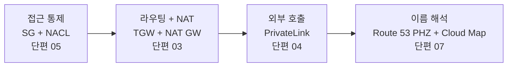

# 온프레미스 네트워크 엔지니어를 위한 VPC 번역 사전 — 익숙한 도구를 다른 이름으로 부르는 동네의 운영 모델

> 시리즈: VPC 설계 다이어리 — 결정의 근거와 가역성에 대하여

---

## SEO 제목 후보

- **온프레미스 네트워크 엔지니어를 위한 VPC 번역 사전 — 익숙한 도구를 다른 이름으로 부르는 동네의 운영 모델** — 사내 데이터센터 운영 경험을 가진 채로 AWS VPC를 처음 그리는 백엔드·인프라 엔지니어에게
- **온프레 ACL·코어 스위치·Forward Proxy·BIND를 AWS VPC로 옮긴다면 — 1:1 매핑이 깨지는 네 자리** — 마이그레이션 전 운영 모델 변화를 미리 점검하려는 SRE/DevOps 엔지니어에게
- **Security Group·Transit Gateway·PrivateLink·Route 53 PHZ — 온프레 네 박스가 클라우드에서 어떻게 나뉘는가** — 사내망 정책 매트릭스를 AWS 구성으로 옮기는 일을 앞둔 네트워크·보안 엔지니어에게

---

## 들어가며

사내 데이터센터에서 ACL·방화벽·코어 스위치·NAT 라우터·Forward Proxy·Split-horizon DNS를 한 번이라도 다뤄 본 사람에게 VPC는 새로운 세계라기보다 익숙한 도구를 다른 이름으로 부르는 동네에 가깝다고 느꼈습니다. 패킷이 한 인터페이스로 들어와 다른 인터페이스로 나가는 결, 그 사이에 정책이 한 겹씩 걸리는 결, 같은 도메인이 자리마다 다르게 해석되는 결 같은 것들은 어느 동네에서나 같은 모양으로 떠 있습니다. 다만 이름이 달라진 만큼 운영 모델도 같이 달라졌다는 점이, 1:1로 옮겨 그릴 때마다 작게 발목을 잡곤 했습니다.

이 글은 실제 운영 단계의 회고가 아니라, 개인 프로젝트로 VPC를 IaC로 그려 두는 과정에서 정리한 메모를 한자리에 모아 둔 글이라는 점을 먼저 밝혀 둡니다. 사실관계는 가능한 한 AWS 공식 문서에서 확인되는 범위 안에서만 다루고, 그 밖의 결은 결정의 근거로 짧게 짚어 두는 정도로만 두려 합니다. 글의 척추는 네 자리에 있습니다. ACL과 방화벽이 Security Group과 NACL로, 코어 스위치와 NAT 라우터가 Transit Gateway와 NAT Gateway로, Forward Proxy와 서비스 메시 Egress가 VPC Endpoint와 PrivateLink로, 사내 BIND와 Split-horizon DNS가 Route 53 Public Zone과 Private Hosted Zone, Cloud Map으로 갈라지는 자리들입니다. 네 자리 모두 1:1로 매핑되어 보이지만, 한 발짝만 더 들어가면 운영의 무게가 다른 자리로 옮겨 가 있다는 점이 보입니다.

> **핵심 정리.** 1:1 매핑은 도구의 이름을 옮기는 작업입니다. 정작 옮겨야 하는 것은 도구가 짊어지던 운영 책임의 자리입니다. 이 글은 네 자리에서 그 책임이 어디로 옮겨 가는지를 한 줄로 정리해 두려는 메모입니다.

---

## 한 장으로 본 매핑 표

먼저 한 장에 매핑을 풀어 두면, 이 글이 뒤에서 어디를 다시 짚을지 결이 잡힙니다. 매핑의 결은 단순합니다. 박스 한 대가 책임지던 자리가 여러 매니지드 컴포넌트로 분해되거나, 반대로 별도 솔루션이 필요하던 자리가 한 도구의 내장 기능 한 줄로 흡수되거나 하는 두 가지 결로 갈립니다.

| 온프레의 자리 | AWS의 대응 | 운영 책임이 옮겨 간 자리 |
| --- | --- | --- |
| 라우터/스위치의 ACL | Network ACL (서브넷 단위 스테이트리스) | 룰 평가가 번호 오름차순, 임시 포트까지 명시 필요 |
| 체크포인트/팔로알토 스테이트풀 방화벽 | Security Group (ENI 단위 스테이트풀) | 인바운드만 적어도 응답은 자동 통과, 거부 표현은 없음 |
| 호스트 방화벽(iptables) | Security Group (역할별 부착) | ENI 한 장에 SG가 여러 개 붙는 결 |
| 마이크로세그멘테이션 솔루션(NSX/Illumio) | SG ID 참조 | 별도 솔루션 없이 SG 자체에 내장 |
| 코어 스위치/라우터 | Transit Gateway + Route Table | TGW attachment subnet이라는 별도 자리가 필요 |
| NAT 라우터 | NAT Gateway (AZ 단위) | 이중화의 단가가 명시적, 환경별 토폴로지 분기가 자연스러움 |
| VLAN | Subnet + Route Table + NACL 조합 | 한 박스 안의 가상 분리가 별도 자원으로 분해 |
| HSRP/VRRP | AZ 다중화 | 이미 사 둔 박스의 이중화가 아니라 새로 사는 자원의 이중화 |
| Forward Proxy (Squid/Zscaler) | Interface Endpoint + Endpoint Policy | 화이트리스트의 단위가 도메인에서 AWS 서비스/SaaS로 |
| 서비스 메시 Egress Gateway | `aws:PrincipalOrgID` 등 IAM 조건 | 메시 사이드카가 아닌 IAM 정책으로 표현 |
| Proxy 로그(접근 기록) | VPC Flow Logs + CloudTrail | 감사 모델이 두 자리로 분산 |
| 사내 BIND/AD DNS | Route 53 Public Zone + PHZ | view 분기가 Zone 자체의 분리로 |
| Consul/Eureka | AWS Cloud Map | 워크로드 라이프사이클과 DNS의 결합이 ECS 쪽으로 |

표를 한 번 그려 두면, 어디가 한 줄짜리 이름 교체이고 어디가 운영 모델 자체의 이동인지가 비교적 분명하게 보입니다. 이름 교체가 1:1로 잘 떨어지는 자리에서는 글이 짧아도 되지만, 운영 모델 자체가 옮겨 가는 자리에서는 같은 한 줄의 매핑 뒤에 한 단락씩 부연이 필요해집니다.

---

## ACL과 방화벽이 SG와 NACL로 갈라지는 자리

가장 먼저 마주치는 자리는 사내의 ACL과 방화벽이 AWS에서 Security Group과 Network ACL이라는 두 도구로 갈라진다는 점입니다. 라우터의 ACL은 인터페이스를 지나는 패킷을 평가하는 자리이고, 스테이트풀 방화벽은 세션을 따라가며 응답까지 자동으로 허용하는 자리였습니다. AWS의 공식 문서가 안내하는 정의에 따르면 Security Group은 ENI 단위에서 동작하는 스테이트풀 방화벽이고, Network ACL은 서브넷 단위에서 동작하는 스테이트리스 방화벽입니다. 두 도구의 책임이 다르다는 사실은 단편 05에서 자세히 다뤘으므로 본 글에서는 매핑 자체에 무게를 두려 합니다.

매핑이 잘 떨어지는 자리는 분명히 있습니다. 라우터 ACL의 결은 NACL에 가깝고, 호스트 방화벽이 가지던 결은 ENI에 직접 붙는 SG에 더 가깝게 옮겨 갑니다. 스테이트풀 방화벽 박스가 책임지던 세션 추적은 SG가 그대로 이어받고, 임시 포트 범위에 대한 응답 룰을 별도로 적어 두지 않아도 된다는 점도 동일합니다. 같은 결의 도구가 두 자리에 나뉘어 떠 있는 것일 뿐, 책임의 합계가 크게 늘어나거나 줄어들지는 않은 자리입니다.

매핑이 깨지는 자리는 한 곳에 있습니다. SG의 룰 소스에 다른 SG의 ID를 적을 수 있다는 점은, 온프레의 어떤 박스에도 정확히 대응되는 자리가 없는 표현입니다. AWS 공식 문서에 따르면 SG 룰의 소스에는 CIDR 블록뿐 아니라 다른 SG의 ID를 적을 수 있고, 그 의미는 "그 SG가 부착된 ENI에서 오는 트래픽을 허용한다"가 됩니다. 온프레 환경에서 이 결을 흉내내려면 NSX나 Illumio 같은 마이크로세그멘테이션 솔루션을 별도로 도입하고, 그 위에 정책 라벨을 그려 두는 결정이 따라붙곤 했습니다. AWS는 그 결을 SG 자체에 내장해 두었고, IP가 아니라 역할 그래프를 룰로 표현할 수 있는 자리가 도구 안에서 한 줄로 떨어집니다.

이 차이가 운영 자동화에서 가지는 무게가 작지 않다고 느꼈습니다. Fargate처럼 Task의 사설 IP가 끊임없이 바뀌는 환경에서, CIDR 기반 룰은 새 Task가 띄워질 때마다 운영자의 손이 룰에 닿아야 하는 결을 만들지만, SG ID 기반 룰은 같은 SG가 새 Task에 자동으로 붙는 한 별도의 손이 닿을 자리가 없습니다. 사내 환경에서 호스트 IP를 추적해 방화벽 룰을 갱신하던 결정 회계가, AWS에서는 "어떤 역할의 워크로드가 어떤 역할의 워크로드를 호출하는가"라는 호출 그래프 위로 한 단계 추상화 위로 옮겨 갔다고 정리해 두면 결이 맞습니다.

---

## 코어 스위치와 NAT 라우터가 Transit Gateway와 NAT Gateway로 분해되는 자리

다음 자리는 코어 스위치와 NAT 라우터가 클라우드로 옮겨 갈 때입니다. 사내 데이터센터의 코어 스위치는 VLAN을 가르고, 라우터는 그 사이의 라우팅을 책임지고, NAT 라우터는 외부로 나가는 트래픽의 출발 주소를 공인 IP로 바꿔 주는 자리에 있었습니다. AWS는 같은 결을 Transit Gateway와 NAT Gateway, 그리고 Subnet과 Route Table의 조합으로 분해해 두었습니다.

VLAN의 결은 한 박스 안에서 가상의 분리를 만들어 두는 자리였습니다. 같은 물리 스위치 위에서 다른 브로드캐스트 도메인을 그려 두면, 트래픽은 같은 박스를 통과하면서도 서로 다른 자리로 흘러가는 결입니다. AWS에서 같은 결을 만들려면 Subnet과 Route Table, 그리고 NACL의 조합이 필요합니다. 서브넷이 IP 대역을 가르고, 라우트 테이블이 외부로 나가는 길을 정하고, NACL이 들어오고 나가는 트래픽을 서브넷 단위로 한 번 더 검사하는 결입니다. 한 박스 안의 가상 분리가 세 자원의 조합으로 분해되었다고 보면 결이 잡힙니다.

코어 스위치 자체가 책임지던 라우팅은 VPC의 라우트 테이블이 받아 가고, 여러 VPC 사이나 온프레와 VPC 사이의 코어 라우팅은 Transit Gateway가 받아 갑니다. AWS Transit Gateway Best Design Practices 문서가 안내하는 모델을 그대로 옮기자면, TGW는 자체 라우팅 테이블을 가지고 여러 VPC와 온프레 회선을 한 자리에서 묶어 주는 자리에 있습니다. 사내 코어 스위치가 책임지던 "여러 망 사이의 가운데 자리"가 그대로 옮겨 와 있다고 봐도 큰 무리는 없는 결입니다.

매핑이 깨지는 자리는 두 곳에 있습니다. 첫 자리는 NAT의 이중화입니다. 사내 환경의 HSRP나 VRRP는 이미 사 둔 두 박스 사이에서 가상 IP의 주인을 바꿔 가는 결의 프로토콜이라, 이중화의 단가가 거의 무료에 가까웠습니다. AWS의 NAT Gateway는 AZ 단위 자원이고, AZ별로 하나씩 두는 결정과 단일 NAT 하나만 두는 결정이 시간당 요금에서 직접 곱해집니다. 이 비대칭이 환경별 토폴로지 분기로 자연스럽게 이어지는 자리이고, 그 회계 자체는 단편 03이 자세히 다뤘습니다. 단편 03의 결이 시리즈 위에서 가지는 의미는, 이중화의 단가가 명시적이라는 사실이 환경별 결정 분기를 IaC의 한 줄짜리 변수로 떠받칠 수 있게 만들어 준다는 점입니다.

둘째 자리는 TGW의 attachment subnet입니다. 사내 코어 스위치는 자기 자신을 위한 별도의 망 자리를 가지지 않고, 가운데 자리에 그냥 박혀 있는 결이었습니다. AWS의 TGW는 각 VPC와 연결되는 attachment를 위한 별도의 서브넷이 필요한 자리에 있고, 본 프로젝트에서는 Private-TGW 서브넷을 `/26` 크기로 따로 그려 두었습니다. 운영 모델로 보면 코어 스위치의 가운데 자리가 AWS에서는 작은 전용 서브넷의 형태로 드러나는 결이고, 사내망의 토폴로지 그림에서는 보이지 않던 자리가 한 칸 더 그려져야 한다는 차이가 있습니다.

---

## Forward Proxy와 서비스 메시 Egress가 PrivateLink로 옮겨 가는 자리

세 번째 자리는 사내 환경의 Forward Proxy와 서비스 메시 Egress Gateway가 AWS의 VPC Endpoint와 PrivateLink로 옮겨 가는 결입니다. 단편 04가 이 결의 설계 근거를 자세히 다뤘으므로 본 글에서는 매핑이 깨지는 자리에만 무게를 두려 합니다.

사내 환경의 Forward Proxy는 보통 도메인 화이트리스트라는 모델 위에 서 있었습니다. Squid나 Zscaler 같은 도구가 사내 클라이언트의 외부 호출을 받아, 허용 도메인 목록에 없는 자리로는 트래픽을 보내지 않는 결의 작업을 했습니다. 화이트리스트의 단위는 도메인 이름이었고, 새 외부 서비스를 추가하려면 보안팀이 도메인 한 줄을 화이트리스트에 더해 주는 결정 회계가 따라붙었습니다.

AWS의 PrivateLink는 결이 다른 자리에 있습니다. AWS PrivateLink Concepts 문서가 안내하는 모델을 그대로 옮기자면, Interface Endpoint는 VPC 안에 ENI를 한 장 만들어 두고 그 ENI를 통해 AWS 서비스나 SaaS 서비스에 접근하게 해 주는 자리입니다. 화이트리스트의 단위는 도메인이 아니라 "허용된 AWS 서비스 혹은 SaaS"이고, 호출 경로는 인터넷을 거치지 않고 AWS 백본 안에서 끝나는 결입니다. Endpoint Policy를 한 겹 더 얹으면 "그중에서도 어떤 액션만, 어느 리소스에 대해서만"이라는 결의 좁힘이 한 자리 더 가능해집니다.

매핑이 깨지는 자리는 두 곳에 있습니다. 첫째, 화이트리스트의 단위 자체가 다릅니다. 사내 Proxy의 화이트리스트는 "이 도메인은 허용한다"는 결의 표현이고, PrivateLink는 "이 서비스의 엔드포인트를 VPC 안에 둔다"는 결의 표현입니다. 사내 환경에서 다섯 개의 SaaS 도메인을 허용했다면, AWS로 옮길 때는 그중 PrivateLink를 지원하는 SaaS에 한해 Endpoint를 만들고, 그 외의 서비스는 별도의 결정이 필요해집니다. PrivateLink를 지원하지 않는 외부 서비스는 결국 NAT Gateway 경로를 거쳐야 하고, 그 자리에는 SG와 Endpoint Policy가 닿지 않으므로 다른 도구로 통제를 채워야 하는 자리가 남습니다.

둘째, 감사 모델의 위치가 다릅니다. 사내 Proxy는 자기 자신이 접근 로그의 진실 공급원이었습니다. 어떤 호출이 언제 어디서 들어와 어디로 나갔는지가 Proxy 한 자리에 모이는 결의 모델이었습니다. AWS에서는 같은 정보가 두 자리로 분산됩니다. 트래픽 자체의 메타데이터는 VPC Flow Logs가, API 호출의 의미적 정보는 CloudTrail이 보관하는 결이라, 감사 질의를 위해서는 두 로그를 함께 결합해야 비로소 사내 Proxy 로그의 한 자리가 채워집니다. 감사 도구를 그릴 때 이 분산을 미리 받아들이고 두 자리의 로그를 같은 쿼리 자리로 모아 두는 결정이, 운영 부담을 한 자리에 모아 두는 결로 이어진다고 봤습니다.

---

## 사내 BIND와 Split-horizon DNS가 Route 53 PHZ와 Cloud Map으로 옮겨 가는 자리

네 번째 자리는 DNS입니다. 사내 환경의 BIND나 AD DNS는 같은 도메인 인스턴스 위에서 view 분기를 통해 내부망과 외부망에 다른 응답을 내놓는 결의 도구였습니다. 같은 Zone 파일이 진실 공급원이고, view라는 결의 표현으로 같은 이름을 자리마다 다르게 해석해 주는 결의 모델이었습니다. AWS는 같은 결을 Public Zone과 Private Hosted Zone이라는 두 개의 별도 Zone으로 분리해 두었습니다. 단편 07이 이 결을 자세히 다뤘으므로 본 글에서는 매핑이 깨지는 자리에만 무게를 두려 합니다.

매핑이 깨지는 가장 큰 자리는 정책 변경의 비용 모델입니다. 사내 BIND의 view 분기는 한 Zone 파일 안에서 조건문을 한 줄 바꾸는 결의 작업이었고, 정책 변경의 비용이 한 자리에 모여 있는 결이었습니다. AWS의 PHZ는 환경마다 Zone 인스턴스 자체가 별도로 떠 있는 결이라, 같은 도메인의 응답을 환경별로 다르게 두려면 Zone 자체가 환경 수만큼 그려져야 합니다. 정책 변경의 비용이 한 자리에서 여러 자리로 분산된다는 점이 처음에는 살짝 무겁게 느껴지는 자리이지만, IaC의 모듈 호출 변수 한 줄로 그 분산이 자동으로 따라오는 자리이기도 해서, 사람이 두 Zone을 동시에 손대지 않는 결만 IaC가 떠받쳐 주면 운영 부담의 합계는 비슷한 자리로 떨어진다고 봤습니다.

서비스 디스커버리의 결도 함께 옮겨 갑니다. 사내 환경에서 Consul이나 Eureka가 책임지던 자리는 워크로드의 라이프사이클과 DNS 레코드의 라이프사이클을 한 자리에 묶어 주는 일이었습니다. AWS Cloud Map은 같은 결을 ECS Service Discovery 통합 위에서 풀어 줍니다. AWS Cloud Map Developer Guide가 안내하는 모델을 그대로 옮기자면, Cloud Map의 private DNS 네임스페이스가 PHZ를 자동으로 만들어 두고 그 안에 서비스 등록 단위를 정의해, ECS Task가 시작될 때 자동으로 DNS 레코드를 등록하고 종료될 때 자동으로 해제하는 결의 도구입니다. Consul이 별도 헬스체크 프로토콜과 별도 에이전트를 가졌다면, Cloud Map은 그 자리를 ECS 서비스의 라이프사이클로 흡수해 두는 결의 결정입니다. ECS 외의 워크로드를 같은 결로 묶기 위해서는 Cloud Map API를 직접 호출하는 별도 로직이 필요한 자리가 남고, 워크로드 구성에 따라 이 결정 회계가 다르게 떨어집니다.

---

## 내려놓은 운영 부담 / 새로 떠안은 운영 부담

네 자리의 매핑이 끝난 자리에서, 한 표로 운영 부담의 이동을 정리해 두면 결이 한 번 더 분명해집니다. 매핑은 도구의 이름을 옮기는 작업이지만, 한 표를 그려 보면 옮겨진 것은 결국 어디에 누가 손을 대야 하는가의 자리라는 점이 보입니다.

| 자리 | 내려놓은 운영 부담 | 새로 떠안은 운영 부담 |
| --- | --- | --- |
| ACL/방화벽 → SG + NACL | 호스트별 iptables 동기화, 마이크로세그멘테이션 솔루션 도입 | NACL의 임시 포트 범위 명시, 기본 NACL의 "모두 허용" 함정 인지 |
| 코어 스위치/NAT → TGW + NAT GW | 박스의 펌웨어/하드웨어 관리, 라우팅 프로토콜 운영 | NAT 이중화의 단가 회계, TGW attachment subnet의 별도 자리 |
| Forward Proxy → PrivateLink | Proxy 자체의 가용성·로테이션·인증서 관리 | Endpoint Policy 작성, VPC Flow Logs + CloudTrail 결합 감사 |
| 사내 BIND → Route 53 PHZ + Cloud Map | DNS 서버 가용성, Zone 전송, 헬스체크 에이전트 운영 | 환경별 Zone 인스턴스 동시 편집을 막는 IaC 책임 |

표를 한 줄로 정리해 보면, 매니지드 서비스로 옮기면서 줄어든 운영 부담은 대부분 "박스 자체의 운영"이고, 새로 떠안은 부담은 대부분 "정책 표현의 결을 IaC와 IAM으로 옮기는 일"이라고 봤습니다. 운영 부담의 총량이 단순히 줄었다는 결의 표현은 솔직하지 못한 자리에 가깝고, 부담의 종류가 바뀌었다는 결의 표현이 실제 운영에 더 가깝다고 정리해 두려 합니다.

---

## 시리즈를 읽는 순서

같은 시리즈의 단편들을 트래픽이 통과하는 순서로 읽으면 결이 비교적 잘 따라옵니다. 외부에서 들어오는 트래픽이 가장 먼저 마주치는 자리는 SG와 NACL이라는 접근 통제의 결이고, 그 다음 자리가 라우팅과 NAT라는 통과의 결이며, 그 위에 PrivateLink라는 외부 호출의 결과 DNS라는 이름 해석의 결이 차례로 얹히는 결입니다.

순서에 절대적 정답이 있는 자리는 아닙니다. 다만 PrivateLink의 가치가 "VPC 안에서 끝난다"는 점에 있으므로 SG와 NACL, 그리고 라우팅의 결이 머릿속에 있어야 그 가치가 또렷해진다는 점, 그리고 DNS는 모든 호출의 시작이지만 토폴로지를 모르면 PHZ 분리의 의미가 와닿지 않는다는 점이 이 순서를 권하는 두 가지 이유입니다. 시리즈의 어느 한 편만 읽어도 그 자리의 결정 회계는 따라올 수 있도록 단편마다 자기 안에서 닫혀 있는 결로 적어 두었지만, 네 자리를 한 흐름으로 읽으면 사내에서 옮겨 온 결과 클라우드의 결이 어디서 어긋나는지가 자연스럽게 모입니다.

---

## 정리하며

네 자리의 매핑을 한 번에 정리해 보고 나서 가장 또렷하게 남은 인상은, 1:1 매핑이 잘 떨어지는 자리일수록 그 뒤에 운영 모델의 작은 이동이 숨어 있는 경우가 많다는 결입니다. SG가 스테이트풀이라는 한 줄 뒤에는 임시 포트의 결과 거부 표현의 결의 차이가 따라오고, NAT Gateway라는 한 단어 뒤에는 이중화의 단가가 명시적이라는 결정 회계의 변화가 따라옵니다. PrivateLink라는 한 줄 뒤에는 화이트리스트의 단위가 도메인에서 AWS 서비스로 바뀌는 결이 따라오고, PHZ라는 한 줄 뒤에는 view 분기가 Zone 자체의 분리로 옮겨 가는 결이 따라옵니다. 같은 결의 한 줄이 자리마다 다른 무게를 가진다는 점은, 매핑을 그려 보고 나서야 비로소 보이는 자리에 가까웠습니다.

같은 정리를 한 줄로 더 단단하게 적어 보자면, 매핑은 시작점이지 끝점이 아니라는 결의 표현이 가장 가깝다고 느꼈습니다. 사내 박스 한 대가 클라우드의 한 컴포넌트로 옮겨 가는 결이 1:1 매핑의 첫 줄이라면, 그 컴포넌트가 어떤 운영 책임을 함께 가져오는지, 어떤 책임을 IaC와 IAM으로 떠넘기는지, 어떤 책임을 새로 만들어 내는지를 한 단락씩 적어 두는 일이 두 번째 줄에 해당하는 결입니다. 첫 줄만 그려 두고 옮기면, 옮긴 자리에 도착해서야 두 번째 줄을 다시 그려야 하는 결의 비용이 따라옵니다. 이 글은 그 두 번째 줄을 미리 한 자리에 모아 두려는 메모에 가깝습니다.

마지막으로 한 줄을 더 적어 두자면, 이 시리즈가 마주친 자리들은 어느 자리도 클라우드만의 새로운 발명이 아니었다고 봤습니다. 같은 문제, 같은 결의 해법이 도구의 이름만 달리해서 다시 떠오른 자리들이 많았고, 그래서 사내 데이터센터의 운영 경험이 클라우드의 결을 잡는 자리에서 작지 않은 길잡이가 되어 주었다고 느꼈습니다. 옮길 때마다 새로 배우는 결도 있지만, 옮기고 나서야 한 번 더 같은 결을 보게 되는 자리도 함께 있었다는 점을, 시리즈 전체를 한 자리에 모아 본 자리에서 가장 진하게 남는 인상으로 적어 두려 합니다.

---

## 참고한 공식 문서

- AWS VPC User Guide — https://docs.aws.amazon.com/vpc/latest/userguide/
- AWS Security Reference Architecture — https://docs.aws.amazon.com/prescriptive-guidance/latest/security-reference-architecture/
- AWS Transit Gateway Best Design Practices — https://docs.aws.amazon.com/vpc/latest/tgw/tgw-best-design-practices.html
- AWS PrivateLink Concepts — https://docs.aws.amazon.com/vpc/latest/privatelink/concepts.html
- Route 53 Private Hosted Zones — https://docs.aws.amazon.com/Route53/latest/DeveloperGuide/hosted-zones-private.html
- AWS Cloud Map Developer Guide — https://docs.aws.amazon.com/cloud-map/latest/dg/what-is-cloud-map.html
