# MongoDB Atlas 도큐먼트 설계서

**작성 일시**: 2026-01-07  
**대상**: CQRS 패턴의 Query Side (읽기 전용)  
**MongoDB 버전**: 7.0+  
**Atlas 버전**: latest

## 목차

1. [개요](#개요)
2. [도큐먼트 설계](#도큐먼트-설계)
   - [SourcesDocument](#sourcesdocument)
   - [ContestDocument](#contestdocument)
   - [NewsArticleDocument](#newsarticledocument)
   - [ArchiveDocument](#archivedocument)
   - [UserProfileDocument](#userprofiledocument)
   - [ExceptionLogDocument](#exceptionlogdocument)
   - [ConversationSessionDocument](#conversationsessiondocument)
   - [ConversationMessageDocument](#conversationmessagedocument)
3. [인덱스 전략](#인덱스-전략)
4. [ERD 다이어그램](#erd-다이어그램)
5. [프로젝션 최적화](#프로젝션-최적화)
6. [샘플 데이터](#샘플-데이터)

---

## 개요

이 설계서는 CQRS 패턴의 Query Side(읽기 전용)를 위한 MongoDB Atlas 도큐먼트 설계를 다룹니다. 모든 도큐먼트는 읽기 성능 최적화를 위해 설계되었으며, ESR 규칙(Equality → Sort → Range)을 준수하여 인덱스를 설계합니다.

### CQRS 동기화 설계

이 설계서는 Command Side(Aurora MySQL)와 Query Side(MongoDB Atlas) 간의 데이터 동기화를 고려하여 설계되었습니다:

- **ArchiveDocument**: `archiveTsid` 필드를 통해 Aurora MySQL의 `Archive` 테이블 TSID 전략으로 체번된 PK 값(BIGINT UNSIGNED)을 저장합니다. 이를 통해 Aurora MySQL의 Archive 테이블 데이터 변경이 즉시 MongoDB 도큐먼트로 반영되도록 설계되었습니다.

- **UserProfileDocument**: `userTsid` 필드를 통해 Aurora MySQL의 `User` 테이블 TSID 전략으로 체번된 PK 값(BIGINT UNSIGNED)을 저장합니다. 이를 통해 Aurora MySQL의 User 테이블 데이터 변경이 즉시 MongoDB 도큐먼트로 반영되도록 설계되었습니다.

### 설계 원칙

1. **읽기 최적화**: 읽기 전용 워크로드에 최적화된 구조
2. **비정규화**: 자주 함께 조회되는 데이터를 하나의 도큐먼트에 포함
3. **프로젝션 활용**: 필요한 필드만 선택하여 네트워크 트래픽 최소화
4. **인덱스 전략**: ESR 규칙 준수 및 쿼리 패턴 기반 인덱스 설계
5. **도큐먼트 크기**: 16MB 제한 고려
6. **CQRS 동기화**: Aurora MySQL과 MongoDB Atlas 간의 데이터 동기화를 위한 TSID 필드 활용

---

## 도큐먼트 설계

### SourcesDocument

정보 출처(Source) 정보를 저장하는 도큐먼트입니다. `json/sources.json`의 데이터 구조를 기반으로 설계되었으며, `client-rss`와 `client-scraper` 모듈에서 데이터 수집 시 참조됩니다.

**데이터 수집 모듈 연관성**:
- **RSS 출처** (`type: "RSS"`): `client-rss` 모듈에서 RSS 피드 파싱을 통해 데이터 수집
  - `rssFeedUrl` 필드에 RSS 피드 URL 저장
  - `dataFormat` 필드는 "RSS/XML" 또는 "ATOM_1.0" 형식
  - 수집된 데이터는 `NewsArticleDocument`로 저장
- **Web Scraping 출처** (`type: "Web Scraping"`): `client-scraper` 모듈에서 웹 스크래핑을 통해 데이터 수집
  - `url` 필드에 스크래핑 대상 URL 저장
  - `dataFormat` 필드는 "HTML" 또는 "GraphQL" 형식
  - 수집된 데이터는 `ContestDocument` 또는 `NewsArticleDocument`로 저장
- **API 출처** (`type: "API"`): API 호출을 통해 데이터 수집 (별도 모듈)
  - `apiEndpoint` 필드에 API 엔드포인트 URL 저장
  - `dataFormat` 필드는 "JSON" 형식

**상세 설계**: RSS/Scraper 모듈의 구현 상세는 `docs/step8/rss-scraper-modules-analysis.md` 문서를 참고하세요.

#### 필드 구조

```javascript
{
  _id: ObjectId,                    // MongoDB 자동 생성
  name: String,                     // 출처 이름 (UNIQUE)
  type: String,                     // 출처 타입: "API", "RSS", "Web Scraping"
  category: String,                 // 카테고리: "개발자 대회 정보", "최신 IT 테크 뉴스 정보"
  url: String,                      // 출처 URL
  apiEndpoint: String,              // API 엔드포인트 (nullable)
  rssFeedUrl: String,               // RSS 피드 URL (nullable)
  description: String,              // 설명
  priority: Integer,                // 우선순위: 1, 2, 3
  reliabilityScore: Integer,        // 신뢰성 점수 (0-10)
  accessibilityScore: Integer,      // 접근성 점수 (0-10)
  dataQualityScore: Integer,        // 데이터 품질 점수 (0-10)
  legalEthicalScore: Integer,       // 법적/윤리적 점수 (0-10)
  totalScore: Integer,              // 총점
  authenticationRequired: Boolean,   // 인증 필요 여부
  authenticationMethod: String,     // 인증 방법: "None", "API Key", "OAuth"
  rateLimit: String,                // Rate limit 정보
  documentationUrl: String,          // 문서 URL
  updateFrequency: String,          // 업데이트 빈도: "실시간", "일일", "주간"
  dataFormat: String,               // 데이터 형식: "JSON", "RSS/XML", "HTML"
  enabled: Boolean,                 // 활성화 여부
  createdAt: Date,                  // 생성 일시
  createdBy: String,                // 생성자 ID (nullable)
  updatedAt: Date,                  // 수정 일시
  updatedBy: String                 // 수정자 ID (nullable)
}
```

#### 인덱스

```javascript
// 1. name 필드 UNIQUE 인덱스
db.sources.createIndex({ name: 1 }, { unique: true })

// 2. category + priority 복합 인덱스 (ESR 규칙)
// Equality: category, Sort: priority
db.sources.createIndex({ category: 1, priority: 1 })

// 3. type + enabled 복합 인덱스
// Equality: type, enabled
db.sources.createIndex({ type: 1, enabled: 1 })

// 4. priority 단일 인덱스 (우선순위 기반 조회)
db.sources.createIndex({ priority: 1 })
```

#### 쿼리 패턴

```javascript
// 카테고리별 우선순위 순 조회
db.sources.find({ category: "개발자 대회 정보" }).sort({ priority: 1 })

// 활성화된 API 출처 조회
db.sources.find({ type: "API", enabled: true })

// 우선순위 1 출처 조회
db.sources.find({ priority: 1 })
```

---

### ContestDocument

개발자 대회 정보를 저장하는 도큐먼트입니다. 읽기 최적화를 위해 비정규화된 구조를 사용합니다.

**데이터 수집**: `client-scraper` 모듈에서 웹 스크래핑을 통해 수집된 대회 정보가 이 도큐먼트로 저장됩니다. `sourceId` 필드를 통해 `SourcesDocument`를 참조하며, `metadata.sourceName` 필드에 출처 이름이 비정규화되어 저장됩니다.

**상세 설계**: 웹 스크래핑 모듈의 구현 상세는 `docs/step8/rss-scraper-modules-analysis.md` 문서를 참고하세요.

#### 필드 구조

```javascript
{
  _id: ObjectId,                    // MongoDB 자동 생성
  sourceId: ObjectId,               // SourcesDocument 참조 (FK)
  title: String,                    // 대회 제목
  startDate: Date,                  // 시작 일시
  endDate: Date,                    // 종료 일시
  status: String,                   // 상태: "UPCOMING", "ONGOING", "ENDED"
  description: String,              // 설명
  url: String,                      // 대회 URL
  metadata: {                        // 비정규화된 메타데이터
    sourceName: String,             // 출처 이름 (비정규화)
    prize: String,                  // 상금 정보 (nullable)
    participants: Integer,          // 참가자 수 (nullable)
    tags: [String]                  // 태그 배열
  },
  createdAt: Date,                   // 생성 일시
  createdBy: String,                // 생성자 ID (nullable)
  updatedAt: Date,                  // 수정 일시
  updatedBy: String                 // 수정자 ID (nullable)
}
```

#### 인덱스

```javascript
// 1. sourceId + startDate 복합 인덱스 (ESR 규칙)
// Equality: sourceId, Sort: startDate
db.contests.createIndex({ sourceId: 1, startDate: -1 })

// 2. endDate 단일 인덱스 (종료 일시 기반 조회)
db.contests.createIndex({ endDate: 1 })

// 3. status + startDate 복합 인덱스 (부분 인덱스)
// Equality: status, Sort: startDate
db.contests.createIndex(
  { status: 1, startDate: -1 },
  { partialFilterExpression: { status: { $in: ["UPCOMING", "ONGOING"] } } }
)

// 4. sourceId 외래 키 인덱스
db.contests.createIndex({ sourceId: 1 })
```

#### 쿼리 패턴

```javascript
// 특정 출처의 대회를 시작 일시 역순으로 조회
db.contests.find({ sourceId: ObjectId("...") }).sort({ startDate: -1 })

// 진행 중인 대회 조회
db.contests.find({ status: "ONGOING" }).sort({ startDate: -1 })

// 종료 예정 대회 조회
db.contests.find({ endDate: { $gte: new Date() } }).sort({ endDate: 1 })
```

---

### NewsArticleDocument

IT 테크 뉴스 기사를 저장하는 도큐먼트입니다. 읽기 최적화를 위해 비정규화된 구조를 사용합니다.

**데이터 수집**: `client-rss` 모듈에서 RSS 피드 파싱을 통해 수집된 뉴스 기사가 이 도큐먼트로 저장됩니다. `sourceId` 필드를 통해 `SourcesDocument`를 참조하며, `metadata.sourceName` 필드에 출처 이름이 비정규화되어 저장됩니다.

**상세 설계**: RSS 피드 파싱 모듈의 구현 상세는 `docs/step8/rss-scraper-modules-analysis.md` 문서를 참고하세요.

#### 필드 구조

```javascript
{
  _id: ObjectId,                    // MongoDB 자동 생성
  sourceId: ObjectId,             // SourcesDocument 참조 (FK)
  title: String,                  // 기사 제목
  content: String,                // 기사 내용 (전체 텍스트)
  summary: String,                // 요약 (비정규화)
  publishedAt: Date,              // 발행 일시
  url: String,                    // 기사 URL
  author: String,                  // 작성자 (nullable)
  metadata: {                      // 비정규화된 메타데이터
    sourceName: String,           // 출처 이름 (비정규화)
    tags: [String],               // 태그 배열
    viewCount: Integer,           // 조회수 (nullable)
    likeCount: Integer            // 좋아요 수 (nullable)
  },
  createdAt: Date,                 // 생성 일시
  createdBy: String,              // 생성자 ID (nullable)
  updatedAt: Date,                // 수정 일시
  updatedBy: String               // 수정자 ID (nullable)
}
```

#### 인덱스

```javascript
// 1. sourceId + publishedAt 복합 인덱스 (ESR 규칙)
// Equality: sourceId, Sort: publishedAt
db.news_articles.createIndex({ sourceId: 1, publishedAt: -1 })

// 2. publishedAt TTL 인덱스 (선택적, 90일 후 자동 삭제)
db.news_articles.createIndex(
  { publishedAt: 1 },
  { expireAfterSeconds: 7776000 }  // 90일 = 90 * 24 * 60 * 60
)

// 3. sourceId 외래 키 인덱스
db.news_articles.createIndex({ sourceId: 1 })
```

#### 쿼리 패턴

```javascript
// 특정 출처의 최신 뉴스 조회
db.news_articles.find({ sourceId: ObjectId("...") }).sort({ publishedAt: -1 }).limit(20)

// 최근 7일간의 뉴스 조회
db.news_articles.find({
  publishedAt: { $gte: new Date(Date.now() - 7 * 24 * 60 * 60 * 1000) }
}).sort({ publishedAt: -1 })
```

---

### ArchiveDocument

사용자가 아카이브한 항목을 저장하는 도큐먼트입니다. 사용자별 인덱스 전략을 사용합니다.

**중요**: 이 도큐먼트는 Aurora MySQL의 `Archive` 테이블과 동기화되도록 설계되었습니다. `archiveTsid` 필드는 Aurora MySQL의 Archive 테이블에서 TSID 전략으로 체번된 PK 값(BIGINT UNSIGNED)을 저장하며, 이를 통해 Aurora MySQL의 Archive 테이블 데이터 변경이 즉시 MongoDB 도큐먼트로 반영됩니다.

#### 필드 구조

```javascript
{
  _id: ObjectId,                    // MongoDB 자동 생성
  archiveTsid: String,              // Aurora MySQL Archive 테이블 TSID PK 값 (BIGINT UNSIGNED)
  userId: String,                   // 사용자 ID (Command Side의 User 테이블 참조)
  itemType: String,                 // 항목 타입: "CONTEST", "NEWS_ARTICLE"
  itemId: ObjectId,                 // 항목 ID (ContestDocument 또는 NewsArticleDocument 참조)
  itemTitle: String,                // 항목 제목 (비정규화)
  itemSummary: String,              // 항목 요약 (비정규화)
  tag: String,                      // 태그 (nullable)
  memo: String,                     // 메모 (nullable)
  archivedAt: Date,                 // 아카이브 일시
  createdAt: Date,                  // 생성 일시
  createdBy: String,                // 생성자 ID (nullable)
  updatedAt: Date,                  // 수정 일시
  updatedBy: String                 // 수정자 ID (nullable)
}
```

#### 인덱스

```javascript
// 1. archiveTsid UNIQUE 인덱스 (Aurora MySQL 동기화용)
// Aurora MySQL의 Archive 테이블 PK와 1:1 매핑
db.archives.createIndex({ archiveTsid: 1 }, { unique: true })

// 2. userId + createdAt 복합 인덱스 (ESR 규칙)
// Equality: userId, Sort: createdAt
db.archives.createIndex({ userId: 1, createdAt: -1 })

// 3. userId + itemType + createdAt 복합 인덱스
// Equality: userId, itemType, Sort: createdAt
db.archives.createIndex({ userId: 1, itemType: 1, createdAt: -1 })

// 4. userId + itemType + itemId 복합 인덱스 (중복 방지)
// Equality: userId, itemType, itemId
db.archives.createIndex(
  { userId: 1, itemType: 1, itemId: 1 },
  { unique: true }
)

// 5. itemId 단일 인덱스 (항목 기반 조회)
db.archives.createIndex({ itemId: 1 })
```

#### 쿼리 패턴

```javascript
// Aurora MySQL TSID로 도큐먼트 조회 (동기화 확인용)
db.archives.findOne({ archiveTsid: "1234567890123456789" })

// 사용자의 최근 아카이브 조회
db.archives.find({ userId: "user123" }).sort({ createdAt: -1 })

// 사용자의 특정 타입 아카이브 조회
db.archives.find({ userId: "user123", itemType: "CONTEST" }).sort({ createdAt: -1 })

// 중복 아카이브 방지
db.archives.findOne({ userId: "user123", itemType: "CONTEST", itemId: ObjectId("...") })
```

---

### UserProfileDocument

사용자 프로필 정보를 저장하는 도큐먼트입니다.

**중요**: 이 도큐먼트는 Aurora MySQL의 `User` 테이블과 동기화되도록 설계되었습니다. `userTsid` 필드는 Aurora MySQL의 User 테이블에서 TSID 전략으로 체번된 PK 값(BIGINT UNSIGNED)을 저장하며, 이를 통해 Aurora MySQL의 User 테이블 데이터 변경이 즉시 MongoDB 도큐먼트로 반영됩니다.

#### 필드 구조

```javascript
{
  _id: ObjectId,                    // MongoDB 자동 생성
  userTsid: String,                 // Aurora MySQL User 테이블 TSID PK 값 (BIGINT UNSIGNED)
  userId: String,                   // 사용자 ID (UNIQUE, Command Side의 User 테이블 참조)
  username: String,                 // 사용자명 (UNIQUE)
  email: String,                    // 이메일 (UNIQUE)
  profileImageUrl: String,          // 프로필 이미지 URL (nullable)
  createdAt: Date,                  // 생성 일시
  createdBy: String,                // 생성자 ID (nullable)
  updatedAt: Date,                  // 수정 일시
  updatedBy: String                 // 수정자 ID (nullable)
}
```

#### 인덱스

```javascript
// 1. userTsid UNIQUE 인덱스 (Aurora MySQL 동기화용)
// Aurora MySQL의 User 테이블 PK와 1:1 매핑
db.user_profiles.createIndex({ userTsid: 1 }, { unique: true })

// 2. userId UNIQUE 인덱스
db.user_profiles.createIndex({ userId: 1 }, { unique: true })

// 3. username UNIQUE 인덱스
db.user_profiles.createIndex({ username: 1 }, { unique: true })

// 4. email UNIQUE 인덱스
db.user_profiles.createIndex({ email: 1 }, { unique: true })
```

#### 쿼리 패턴

```javascript
// Aurora MySQL TSID로 도큐먼트 조회 (동기화 확인용)
db.user_profiles.findOne({ userTsid: "9876543210987654321" })

// 사용자 ID로 프로필 조회
db.user_profiles.findOne({ userId: "user123" })

// 사용자명으로 프로필 조회
db.user_profiles.findOne({ username: "john_doe" })

// 이메일로 프로필 조회
db.user_profiles.findOne({ email: "user@example.com" })
```

---

### ExceptionLogDocument

예외 로그를 저장하는 도큐먼트입니다. 읽기/쓰기 예외를 모두 기록합니다.

#### 필드 구조

```javascript
{
  _id: ObjectId,                    // MongoDB 자동 생성
  source: String,                   // 예외 소스: "READ", "WRITE"
  exceptionType: String,            // 예외 타입 (예: "DataAccessException", "ValidationException")
  exceptionMessage: String,         // 예외 메시지
  stackTrace: String,               // 스택 트레이스 (전체)
  context: {                         // 컨텍스트 정보 (Object)
    module: String,                 // 모듈명
    method: String,                 // 메서드명
    parameters: Object,             // 파라미터 정보
    userId: String,                 // 사용자 ID (nullable)
    requestId: String               // 요청 ID (nullable)
  },
  occurredAt: Date,                  // 발생 일시
  severity: String,                  // 심각도: "LOW", "MEDIUM", "HIGH", "CRITICAL"
  createdAt: Date,                   // 생성 일시
  createdBy: String,                 // 생성자 ID (nullable)
  updatedAt: Date,                  // 수정 일시
  updatedBy: String                 // 수정자 ID (nullable)
}
```

#### 인덱스

```javascript
// 1. source + occurredAt 복합 인덱스 (ESR 규칙)
// Equality: source, Sort: occurredAt
db.exception_logs.createIndex({ source: 1, occurredAt: -1 })

// 2. exceptionType + occurredAt 복합 인덱스
// Equality: exceptionType, Sort: occurredAt
db.exception_logs.createIndex({ exceptionType: 1, occurredAt: -1 })

// 3. occurredAt TTL 인덱스 (90일 후 자동 삭제)
db.exception_logs.createIndex(
  { occurredAt: 1 },
  { expireAfterSeconds: 7776000 }  // 90일 = 90 * 24 * 60 * 60
)
```

#### 쿼리 패턴

```javascript
// 특정 소스의 최근 예외 조회
db.exception_logs.find({ source: "READ" }).sort({ occurredAt: -1 }).limit(100)

// 특정 예외 타입의 최근 예외 조회
db.exception_logs.find({ exceptionType: "DataAccessException" }).sort({ occurredAt: -1 })

// 최근 24시간 내 예외 조회
db.exception_logs.find({
  occurredAt: { $gte: new Date(Date.now() - 24 * 60 * 60 * 1000) }
}).sort({ occurredAt: -1 })
```

---

### ConversationSessionDocument

대화 세션 정보를 저장하는 도큐먼트입니다.

**중요**: 이 도큐먼트는 Aurora MySQL의 `ConversationSession` 테이블과 동기화되도록 설계되었습니다. `session_id` 필드는 Aurora MySQL의 ConversationSession 테이블에서 TSID 전략으로 체번된 PK 값(BIGINT UNSIGNED)을 저장하며, 이를 통해 Aurora MySQL의 ConversationSession 테이블 데이터 변경이 즉시 MongoDB 도큐먼트로 반영됩니다.

#### 필드 구조

```javascript
{
  _id: ObjectId,                    // MongoDB 자동 생성
  session_id: String,               // Aurora MySQL ConversationSession 테이블 TSID PK 값 (BIGINT UNSIGNED, UNIQUE)
  user_id: String,                  // 사용자 ID (Command Side의 User 테이블 참조)
  title: String,                    // 세션 제목 (nullable)
  last_message_at: Date,            // 마지막 메시지 시간
  is_active: Boolean,               // 활성 세션 여부
  created_at: Date,                 // 생성 일시
  updated_at: Date                  // 수정 일시
}
```

#### 인덱스

```javascript
// 1. session_id UNIQUE 인덱스 (Aurora MySQL 동기화용)
// Aurora MySQL의 ConversationSession 테이블 PK와 1:1 매핑
db.conversation_sessions.createIndex({ session_id: 1 }, { unique: true })

// 2. user_id + is_active + last_message_at 복합 인덱스 (ESR 규칙)
// Equality: user_id, is_active, Sort: last_message_at
db.conversation_sessions.createIndex({ user_id: 1, is_active: 1, last_message_at: -1 })

// 3. last_message_at TTL 인덱스 (90일 후 자동 삭제)
db.conversation_sessions.createIndex(
  { last_message_at: 1 },
  { expireAfterSeconds: 7776000 }  // 90일 = 90 * 24 * 60 * 60
)
```

#### 쿼리 패턴

```javascript
// Aurora MySQL TSID로 도큐먼트 조회 (동기화 확인용)
db.conversation_sessions.findOne({ session_id: "1234567890123456789" })

// 사용자의 활성 세션 조회
db.conversation_sessions.find({ user_id: "user123", is_active: true })
  .sort({ last_message_at: -1 })

// 사용자의 모든 세션 조회
db.conversation_sessions.find({ user_id: "user123" })
  .sort({ last_message_at: -1 })
```

---

### ConversationMessageDocument

대화 메시지 히스토리를 저장하는 도큐먼트입니다.

**중요**: 이 도큐먼트는 Aurora MySQL의 `ConversationMessage` 테이블과 동기화되도록 설계되었습니다. `message_id` 필드는 Aurora MySQL의 ConversationMessage 테이블에서 TSID 전략으로 체번된 PK 값(BIGINT UNSIGNED)을 저장하며, 이를 통해 Aurora MySQL의 ConversationMessage 테이블 데이터 변경이 즉시 MongoDB 도큐먼트로 반영됩니다.

#### 필드 구조

```javascript
{
  _id: ObjectId,                    // MongoDB 자동 생성
  message_id: String,               // Aurora MySQL ConversationMessage 테이블 TSID PK 값 (BIGINT UNSIGNED, UNIQUE)
  session_id: String,               // 세션 ID (ConversationSessionDocument 참조)
  role: String,                    // 메시지 역할: "USER", "ASSISTANT", "SYSTEM"
  content: String,                  // 메시지 내용
  token_count: Integer,             // 토큰 수 (nullable, 비용 계산용)
  sequence_number: Integer,        // 대화 순서 (1부터 시작)
  created_at: Date                 // 생성 일시
}
```

#### 인덱스

```javascript
// 1. message_id UNIQUE 인덱스 (Aurora MySQL 동기화용)
// Aurora MySQL의 ConversationMessage 테이블 PK와 1:1 매핑
db.conversation_messages.createIndex({ message_id: 1 }, { unique: true })

// 2. session_id + sequence_number 복합 인덱스 (ESR 규칙)
// Equality: session_id, Sort: sequence_number
db.conversation_messages.createIndex({ session_id: 1, sequence_number: 1 })

// 3. created_at TTL 인덱스 (1년 후 자동 삭제)
db.conversation_messages.createIndex(
  { created_at: 1 },
  { expireAfterSeconds: 31536000 }  // 1년 = 365 * 24 * 60 * 60
)
```

#### 쿼리 패턴

```javascript
// Aurora MySQL TSID로 도큐먼트 조회 (동기화 확인용)
db.conversation_messages.findOne({ message_id: "2345678901234567890" })

// 세션의 메시지 히스토리 조회 (순서대로)
db.conversation_messages.find({ session_id: "1234567890123456789" })
  .sort({ sequence_number: 1 })

// 세션의 최근 N개 메시지 조회
db.conversation_messages.find({ session_id: "1234567890123456789" })
  .sort({ sequence_number: -1 })
  .limit(10)
```

---

## 인덱스 전략

### ESR 규칙 준수

모든 복합 인덱스는 ESR 규칙을 준수하여 설계되었습니다:

1. **Equality (등가)**: 등가 조건에 사용되는 필드
2. **Sort (정렬)**: 정렬에 사용되는 필드
3. **Range (범위)**: 범위 쿼리에 사용되는 필드

### 인덱스 요약

| 컬렉션 | 인덱스 | 타입 | ESR 규칙 |
|--------|--------|------|----------|
| `sources` | `name` | UNIQUE | - |
| `sources` | `category, priority` | 복합 | E, S |
| `sources` | `type, enabled` | 복합 | E, E |
| `sources` | `priority` | 단일 | - |
| `contests` | `sourceId, startDate` | 복합 | E, S |
| `contests` | `endDate` | 단일 | - |
| `contests` | `status, startDate` | 부분 인덱스 | E, S |
| `contests` | `sourceId` | 단일 | - |
| `news_articles` | `sourceId, publishedAt` | 복합 | E, S |
| `news_articles` | `publishedAt` | TTL | - |
| `news_articles` | `sourceId` | 단일 | - |
| `archives` | `archiveTsid` | UNIQUE | - |
| `archives` | `userId, createdAt` | 복합 | E, S |
| `archives` | `userId, itemType, createdAt` | 복합 | E, E, S |
| `archives` | `userId, itemType, itemId` | UNIQUE | E, E, E |
| `archives` | `itemId` | 단일 | - |
| `user_profiles` | `userTsid` | UNIQUE | - |
| `user_profiles` | `userId` | UNIQUE | - |
| `user_profiles` | `username` | UNIQUE | - |
| `user_profiles` | `email` | UNIQUE | - |
| `exception_logs` | `source, occurredAt` | 복합 | E, S |
| `exception_logs` | `exceptionType, occurredAt` | 복합 | E, S |
| `exception_logs` | `occurredAt` | TTL | - |
| `conversation_sessions` | `session_id` | UNIQUE | - |
| `conversation_sessions` | `user_id, is_active, last_message_at` | 복합 | E, E, S |
| `conversation_sessions` | `last_message_at` | TTL | - |
| `conversation_messages` | `message_id` | UNIQUE | - |
| `conversation_messages` | `session_id, sequence_number` | 복합 | E, S |
| `conversation_messages` | `created_at` | TTL | - |

---

## ERD 다이어그램

### Mermaid ERD

```mermaid
%%{init: {'theme':'base', 'themeVariables': {'primaryColor':'#d4edda', 'primaryTextColor':'#212529', 'primaryBorderColor':'#28a745', 'lineColor':'#28a745', 'secondaryColor':'#d4edda', 'tertiaryColor':'#d4edda', 'background':'#ffffff', 'mainBkgColor':'#d4edda', 'secondBkgColor':'#d4edda', 'tertiaryBkgColor':'#d4edda', 'noteBkgColor':'#d4edda', 'noteTextColor':'#212529', 'noteBorderColor':'#28a745', 'actorBorder':'#28a745', 'actorBkg':'#d4edda', 'actorTextColor':'#212529', 'actorLineColor':'#28a745', 'cScale0':'#d4edda', 'cScale1':'#d4edda', 'cScale2':'#d4edda', 'cScaleLabel':'#212529', 'cScaleLabelText':'#212529', 'pie1':'#d4edda', 'pie2':'#d4edda', 'pie3':'#d4edda', 'pie4':'#d4edda', 'pie5':'#d4edda', 'pie6':'#d4edda', 'pie7':'#d4edda'}}}%%
erDiagram
    SOURCES ||--o{ CONTESTS : "has"
    SOURCES ||--o{ NEWS_ARTICLES : "has"
    CONTESTS ||--o{ ARCHIVES : "referenced_by"
    NEWS_ARTICLES ||--o{ ARCHIVES : "referenced_by"
    USER_PROFILES ||--o{ ARCHIVES : "has"
    USER_PROFILES ||--o{ CONVERSATION_SESSIONS : "has"
    CONVERSATION_SESSIONS ||--o{ CONVERSATION_MESSAGES : "has"
    
    SOURCES {
        ObjectId _id PK
        String name UK
        String type
        String category
        String url
        String apiEndpoint
        String rssFeedUrl
        String description
        Integer priority
        Integer reliabilityScore
        Integer accessibilityScore
        Integer dataQualityScore
        Integer legalEthicalScore
        Integer totalScore
        Boolean authenticationRequired
        String authenticationMethod
        String rateLimit
        String documentationUrl
        String updateFrequency
        String dataFormat
        Boolean enabled
        Date createdAt
        String createdBy
        Date updatedAt
        String updatedBy
    }
    
    EXCEPTION_LOGS {
        ObjectId _id PK
        String source
        String exceptionType
        String exceptionMessage
        String stackTrace
        Object context
        Date occurredAt
        String severity
        Date createdAt
        String createdBy
        Date updatedAt
        String updatedBy
    }
    
    CONTESTS {
        ObjectId _id PK
        ObjectId sourceId FK
        String title
        Date startDate
        Date endDate
        String status
        String description
        String url
        Object metadata
        Date createdAt
        String createdBy
        Date updatedAt
        String updatedBy
    }
    
    NEWS_ARTICLES {
        ObjectId _id PK
        ObjectId sourceId FK
        String title
        String content
        String summary
        Date publishedAt
        String url
        String author
        Object metadata
        Date createdAt
        String createdBy
        Date updatedAt
        String updatedBy
    }
    
    USER_PROFILES {
        ObjectId _id PK
        String userTsid UK
        String userId UK
        String username UK
        String email UK
        String profileImageUrl
        Date createdAt
        String createdBy
        Date updatedAt
        String updatedBy
    }
    
    ARCHIVES {
        ObjectId _id PK
        String archiveTsid UK
        String userId FK
        String itemType
        ObjectId itemId FK
        String itemTitle
        String itemSummary
        String tag
        String memo
        Date archivedAt
        Date createdAt
        String createdBy
        Date updatedAt
        String updatedBy
    }
    
    CONVERSATION_SESSIONS {
        ObjectId _id PK
        String session_id UK
        String user_id FK
        String title
        Date last_message_at
        Boolean is_active
        Date created_at
        Date updated_at
    }
    
    CONVERSATION_MESSAGES {
        ObjectId _id PK
        String message_id UK
        String session_id FK
        String role
        String content
        Integer token_count
        Integer sequence_number
        Date created_at
    }
```



### 관계 설명

1. **SOURCES → CONTESTS**: One-to-Many (한 출처는 여러 대회를 가질 수 있음)
2. **SOURCES → NEWS_ARTICLES**: One-to-Many (한 출처는 여러 뉴스 기사를 가질 수 있음)
3. **CONTESTS → ARCHIVES**: One-to-Many (한 대회는 여러 사용자에 의해 아카이브될 수 있음, referenced_by 관계)
4. **NEWS_ARTICLES → ARCHIVES**: One-to-Many (한 뉴스 기사는 여러 사용자에 의해 아카이브될 수 있음, referenced_by 관계)
5. **USER_PROFILES → ARCHIVES**: One-to-Many (한 사용자는 여러 항목을 아카이브할 수 있음)
6. **USER_PROFILES → CONVERSATION_SESSIONS**: One-to-Many (한 사용자는 여러 대화 세션을 가질 수 있음)
7. **CONVERSATION_SESSIONS → CONVERSATION_MESSAGES**: One-to-Many (한 세션은 여러 메시지를 가질 수 있음)

---

## 프로젝션 최적화

### 프로젝션 예제

#### SourcesDocument 프로젝션

```javascript
// 필요한 필드만 선택
db.sources.find(
  { category: "개발자 대회 정보", enabled: true },
  { _id: 1, name: 1, type: 1, priority: 1, url: 1 }
)
```

#### ContestDocument 프로젝션

```javascript
// 리스트 조회 시 요약 정보만
db.contests.find(
  { status: "UPCOMING" },
  { _id: 1, title: 1, startDate: 1, endDate: 1, url: 1, "metadata.sourceName": 1 }
).sort({ startDate: 1 })

// 상세 조회 시 전체 정보
db.contests.findOne({ _id: ObjectId("...") })
```

#### NewsArticleDocument 프로젝션

```javascript
// 리스트 조회 시 요약 정보만
db.news_articles.find(
  { sourceId: ObjectId("...") },
  { _id: 1, title: 1, summary: 1, publishedAt: 1, url: 1, "metadata.sourceName": 1 }
).sort({ publishedAt: -1 }).limit(20)

// 상세 조회 시 전체 정보
db.news_articles.findOne({ _id: ObjectId("...") })
```

#### ArchiveDocument 프로젝션

```javascript
// 사용자 아카이브 리스트 조회
db.archives.find(
  { userId: "user123" },
  { _id: 1, itemType: 1, itemTitle: 1, itemSummary: 1, archivedAt: 1, tag: 1 }
).sort({ createdAt: -1 })
```

#### ConversationSessionDocument 프로젝션

```javascript
// 사용자 세션 리스트 조회
db.conversation_sessions.find(
  { user_id: "user123", is_active: true },
  { _id: 1, session_id: 1, title: 1, last_message_at: 1 }
).sort({ last_message_at: -1 })

// 세션 상세 조회
db.conversation_sessions.findOne({ session_id: "1234567890123456789" })
```

#### ConversationMessageDocument 프로젝션

```javascript
// 세션의 메시지 히스토리 조회 (순서대로)
db.conversation_messages.find(
  { session_id: "1234567890123456789" },
  { _id: 1, role: 1, content: 1, sequence_number: 1, created_at: 1 }
).sort({ sequence_number: 1 })

// 세션의 최근 N개 메시지 조회
db.conversation_messages.find(
  { session_id: "1234567890123456789" },
  { _id: 1, role: 1, content: 1, sequence_number: 1 }
).sort({ sequence_number: -1 }).limit(10)
```

---

## 샘플 데이터

### SourcesDocument 샘플

```javascript
{
  _id: ObjectId("507f1f77bcf86cd799439011"),
  name: "Codeforces API",
  type: "API",
  category: "개발자 대회 정보",
  url: "https://codeforces.com",
  apiEndpoint: "https://codeforces.com/api",
  rssFeedUrl: null,
  description: "알고리즘 대회 정보를 제공하는 공식 API",
  priority: 1,
  reliabilityScore: 10,
  accessibilityScore: 10,
  dataQualityScore: 10,
  legalEthicalScore: 9,
  totalScore: 39,
  authenticationRequired: false,
  authenticationMethod: "None",
  rateLimit: "No strict rate limit, but recommends reasonable usage",
  documentationUrl: "https://codeforces.com/apiHelp",
  updateFrequency: "실시간",
  dataFormat: "JSON",
  enabled: true,
  createdAt: ISODate("2026-01-01T00:00:00Z"),
  createdBy: "system",
  updatedAt: ISODate("2026-01-07T00:00:00Z"),
  updatedBy: "admin"
}
```

### ContestDocument 샘플

```javascript
{
  _id: ObjectId("507f1f77bcf86cd799439012"),
  sourceId: ObjectId("507f1f77bcf86cd799439011"),
  title: "Codeforces Round 900",
  startDate: ISODate("2026-01-15T10:00:00Z"),
  endDate: ISODate("2026-01-15T12:30:00Z"),
  status: "UPCOMING",
  description: "Regular Codeforces contest",
  url: "https://codeforces.com/contests/1900",
  metadata: {
    sourceName: "Codeforces API",
    prize: null,
    participants: null,
    tags: ["algorithm", "competitive-programming"]
  },
  createdAt: ISODate("2026-01-07T00:00:00Z"),
  createdBy: "system",
  updatedAt: ISODate("2026-01-07T00:00:00Z"),
  updatedBy: "system"
}
```

### NewsArticleDocument 샘플

```javascript
{
  _id: ObjectId("507f1f77bcf86cd799439013"),
  sourceId: ObjectId("507f1f77bcf86cd799439014"),
  title: "Spring Boot 4.0 Released",
  content: "Spring Boot 4.0 has been released with new features...",
  summary: "Spring Boot 4.0 brings significant improvements...",
  publishedAt: ISODate("2026-01-05T08:00:00Z"),
  url: "https://example.com/news/spring-boot-4",
  author: "John Doe",
  metadata: {
    sourceName: "Hacker News API",
    tags: ["spring", "java", "framework"],
    viewCount: 1500,
    likeCount: 120
  },
  createdAt: ISODate("2026-01-05T08:00:00Z"),
  createdBy: "system",
  updatedAt: ISODate("2026-01-05T08:00:00Z"),
  updatedBy: "system"
}
```

### ArchiveDocument 샘플

```javascript
{
  _id: ObjectId("507f1f77bcf86cd799439015"),
  archiveTsid: "1234567890123456789",
  userId: "user123",
  itemType: "CONTEST",
  itemId: ObjectId("507f1f77bcf86cd799439012"),
  itemTitle: "Codeforces Round 900",
  itemSummary: "Regular Codeforces contest",
  tag: "algorithm",
  memo: "참가 예정",
  archivedAt: ISODate("2026-01-07T10:00:00Z"),
  createdAt: ISODate("2026-01-07T10:00:00Z"),
  createdBy: "user123",
  updatedAt: ISODate("2026-01-07T10:00:00Z"),
  updatedBy: "user123"
}
```

### UserProfileDocument 샘플

```javascript
{
  _id: ObjectId("507f1f77bcf86cd799439016"),
  userTsid: "9876543210987654321",
  userId: "user123",
  username: "john_doe",
  email: "john@example.com",
  profileImageUrl: "https://example.com/avatars/john.jpg",
  createdAt: ISODate("2026-01-01T00:00:00Z"),
  createdBy: "system",
  updatedAt: ISODate("2026-01-07T10:00:00Z"),
  updatedBy: "user123"
}
```

### ExceptionLogDocument 샘플

```javascript
{
  _id: ObjectId("507f1f77bcf86cd799439017"),
  source: "READ",
  exceptionType: "DataAccessException",
  exceptionMessage: "Connection timeout",
  stackTrace: "java.sql.SQLException: Connection timeout...",
  context: {
    module: "domain-mongodb",
    method: "findBySourceId",
    parameters: {
      sourceId: "507f1f77bcf86cd799439011"
    },
    userId: null,
    requestId: "req-12345"
  },
  occurredAt: ISODate("2026-01-07T09:00:00Z"),
  severity: "MEDIUM",
  createdAt: ISODate("2026-01-07T09:00:00Z"),
  createdBy: "system",
  updatedAt: ISODate("2026-01-07T09:00:00Z"),
  updatedBy: "system"
}
```

### ConversationSessionDocument 샘플

```javascript
{
  _id: ObjectId("507f1f77bcf86cd799439018"),
  session_id: "1234567890123456789",
  user_id: "9876543210987654321",
  title: "대화 세션 제목",
  last_message_at: ISODate("2026-01-16T10:00:00Z"),
  is_active: true,
  created_at: ISODate("2026-01-16T09:00:00Z"),
  updated_at: ISODate("2026-01-16T10:00:00Z")
}
```

### ConversationMessageDocument 샘플

```javascript
{
  _id: ObjectId("507f1f77bcf86cd799439019"),
  message_id: "2345678901234567890",
  session_id: "1234567890123456789",
  role: "USER",
  content: "최근 대회 정보 알려줘",
  token_count: 15,
  sequence_number: 1,
  created_at: ISODate("2026-01-16T10:00:00Z")
}
```

---

## 도큐먼트 크기 예상치

### SourcesDocument
- 예상 크기: 약 500 bytes ~ 1 KB
- 16MB 제한 내에서 약 16,000 ~ 32,000개 도큐먼트 저장 가능

### ContestDocument
- 예상 크기: 약 1 KB ~ 2 KB
- 16MB 제한 내에서 약 8,000 ~ 16,000개 도큐먼트 저장 가능

### NewsArticleDocument
- 예상 크기: 약 5 KB ~ 10 KB (content 필드 포함)
- 16MB 제한 내에서 약 1,600 ~ 3,200개 도큐먼트 저장 가능
- **주의**: content 필드가 매우 큰 경우 GridFS 고려

### ArchiveDocument
- 예상 크기: 약 500 bytes ~ 1 KB (archiveTsid 필드 포함)
- 16MB 제한 내에서 약 16,000 ~ 32,000개 도큐먼트 저장 가능

### UserProfileDocument
- 예상 크기: 약 200 bytes ~ 400 bytes (userTsid 필드 포함)
- 16MB 제한 내에서 약 40,000 ~ 80,000개 도큐먼트 저장 가능

### ExceptionLogDocument
- 예상 크기: 약 2 KB ~ 5 KB (stackTrace 필드 포함)
- 16MB 제한 내에서 약 3,200 ~ 8,000개 도큐먼트 저장 가능
- TTL 인덱스로 90일 후 자동 삭제

### ConversationSessionDocument
- 예상 크기: 약 300 bytes ~ 500 bytes (session_id 필드 포함)
- 16MB 제한 내에서 약 32,000 ~ 53,000개 도큐먼트 저장 가능
- TTL 인덱스로 90일 후 자동 삭제 (비활성 세션)

### ConversationMessageDocument
- 예상 크기: 약 500 bytes ~ 2 KB (content 필드 크기에 따라 변동)
- 16MB 제한 내에서 약 8,000 ~ 32,000개 도큐먼트 저장 가능
- TTL 인덱스로 1년 후 자동 삭제 (오래된 메시지)

---

## 결론

이 설계서는 CQRS 패턴의 Query Side를 위한 MongoDB Atlas 도큐먼트 설계를 제공합니다. 모든 도큐먼트는 읽기 성능 최적화를 위해 설계되었으며, ESR 규칙을 준수한 인덱스 전략을 사용합니다.

### 주요 특징

1. ✅ **읽기 최적화**: 읽기 전용 워크로드에 최적화된 구조
2. ✅ **비정규화**: 자주 함께 조회되는 데이터를 하나의 도큐먼트에 포함
3. ✅ **ESR 규칙 준수**: 모든 복합 인덱스가 ESR 규칙을 준수
4. ✅ **프로젝션 활용**: 필요한 필드만 선택하여 네트워크 트래픽 최소화
5. ✅ **도큐먼트 크기 고려**: 16MB 제한을 고려한 설계
6. ✅ **TTL 인덱스**: 임시 데이터(뉴스 기사, 예외 로그)에 TTL 인덱스 적용
7. ✅ **CQRS 동기화**: Aurora MySQL과 MongoDB Atlas 간의 데이터 동기화를 위한 TSID 필드 활용
   - `ArchiveDocument.archiveTsid`: Aurora MySQL Archive 테이블 PK와 1:1 매핑
   - `UserProfileDocument.userTsid`: Aurora MySQL User 테이블 PK와 1:1 매핑
   - `ConversationSessionDocument.session_id`: Aurora MySQL ConversationSession 테이블 PK와 1:1 매핑
   - `ConversationMessageDocument.message_id`: Aurora MySQL ConversationMessage 테이블 PK와 1:1 매핑

### 다음 단계

1. MongoDB Atlas 클러스터 생성 및 설정
2. 컬렉션 생성 및 인덱스 생성
3. 샘플 데이터 삽입 및 쿼리 테스트
4. 성능 모니터링 및 최적화

---

**문서 버전**: 1.1  
**최종 업데이트**: 2026-01-07  
**작성자**: MongoDB Database Architect

### 변경 이력

- **v1.2 (2026-01-16)**: 
  - `ConversationSessionDocument` 추가 (RAG 챗봇 대화 세션 관리)
  - `ConversationMessageDocument` 추가 (RAG 챗봇 대화 메시지 히스토리)
  - 관련 인덱스, ERD 다이어그램, 도큐먼트 크기 예상치 업데이트
- **v1.1 (2026-01-07)**: 
  - `ArchiveDocument`에 `archiveTsid` 필드 추가 (Aurora MySQL Archive 테이블 동기화용)
  - `UserProfileDocument`에 `userTsid` 필드 추가 (Aurora MySQL User 테이블 동기화용)
  - CQRS 동기화 설계 명시
  - 관련 인덱스 및 샘플 데이터 업데이트

