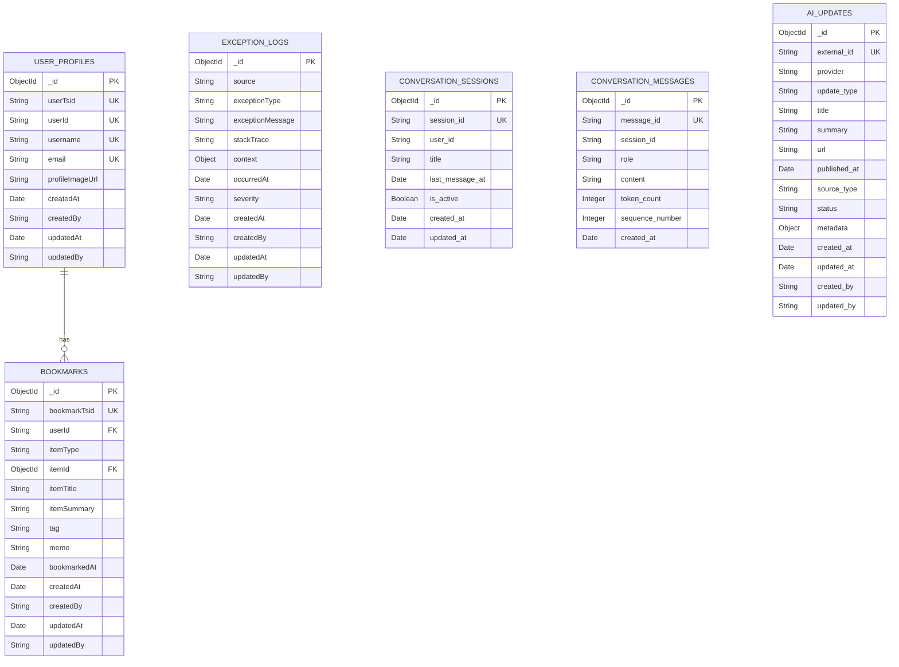

# MongoDB Atlas 도큐먼트 설계서

**작성 일시**: 2026-01-07  
**대상**: CQRS 패턴의 Query Side (읽기 전용)  
**MongoDB 버전**: 7.0+  
**Atlas 버전**: latest

## 목차

1. [개요](#개요)
2. [도큐먼트 설계](#도큐먼트-설계)
   - [BookmarkDocument](#bookmarkdocument)
   - [UserProfileDocument](#userprofiledocument)
   - [ExceptionLogDocument](#exceptionlogdocument)
   - [ConversationSessionDocument](#conversationsessiondocument)
   - [ConversationMessageDocument](#conversationmessagedocument)
   - [AiUpdateDocument](#aiupdatedocument)
3. [인덱스 전략](#인덱스-전략)
4. [ERD 다이어그램](#erd-다이어그램)
5. [프로젝션 최적화](#프로젝션-최적화)
6. [샘플 데이터](#샘플-데이터)

---

## 개요

이 설계서는 CQRS 패턴의 Query Side(읽기 전용)를 위한 MongoDB Atlas 도큐먼트 설계를 다룹니다. 모든 도큐먼트는 읽기 성능 최적화를 위해 설계되었으며, ESR 규칙(Equality → Sort → Range)을 준수하여 인덱스를 설계합니다.

### CQRS 동기화 설계

이 설계서는 Command Side(Aurora MySQL)와 Query Side(MongoDB Atlas) 간의 데이터 동기화를 고려하여 설계되었습니다:

- **BookmarkDocument**: `bookmarkTsid` 필드를 통해 Aurora MySQL의 `Bookmark` 테이블 TSID 전략으로 체번된 PK 값(BIGINT UNSIGNED)을 저장합니다. 이를 통해 Aurora MySQL의 Bookmark 테이블 데이터 변경이 즉시 MongoDB 도큐먼트로 반영되도록 설계되었습니다.

- **UserProfileDocument**: `userTsid` 필드를 통해 Aurora MySQL의 `User` 테이블 TSID 전략으로 체번된 PK 값(BIGINT UNSIGNED)을 저장합니다. 이를 통해 Aurora MySQL의 User 테이블 데이터 변경이 즉시 MongoDB 도큐먼트로 반영되도록 설계되었습니다.

### 설계 원칙

1. **읽기 최적화**: 읽기 전용 워크로드에 최적화된 구조
2. **비정규화**: 자주 함께 조회되는 데이터를 하나의 도큐먼트에 포함
3. **프로젝션 활용**: 필요한 필드만 선택하여 네트워크 트래픽 최소화
4. **인덱스 전략**: ESR 규칙 준수 및 쿼리 패턴 기반 인덱스 설계
5. **도큐먼트 크기**: 16MB 제한 고려
6. **CQRS 동기화**: Aurora MySQL과 MongoDB Atlas 간의 데이터 동기화를 위한 TSID 필드 활용

---

## 도큐먼트 설계

> Contest/News 수집 기능 폐기로 SourcesDocument, ContestDocument, NewsArticleDocument 섹션 삭제됨

---

### BookmarkDocument

사용자가 북마크한 항목을 저장하는 도큐먼트입니다. 사용자별 인덱스 전략을 사용합니다.

**중요**: 이 도큐먼트는 Aurora MySQL의 `Bookmark` 테이블과 동기화되도록 설계되었습니다. `bookmarkTsid` 필드는 Aurora MySQL의 Bookmark 테이블에서 TSID 전략으로 체번된 PK 값(BIGINT UNSIGNED)을 저장하며, 이를 통해 Aurora MySQL의 Bookmark 테이블 데이터 변경이 즉시 MongoDB 도큐먼트로 반영됩니다.

#### 필드 구조

```javascript
{
  _id: ObjectId,                    // MongoDB 자동 생성
  bookmarkTsid: String,              // Aurora MySQL Bookmark 테이블 TSID PK 값 (BIGINT UNSIGNED)
  userId: String,                   // 사용자 ID (Command Side의 User 테이블 참조)
  itemType: String,                 // 항목 타입: "CONTEST", "NEWS_ARTICLE"
  itemId: ObjectId,                 // 항목 ID (ContestDocument 또는 NewsArticleDocument 참조)
  itemTitle: String,                // 항목 제목 (비정규화)
  itemSummary: String,              // 항목 요약 (비정규화)
  tag: String,                      // 태그 (nullable)
  memo: String,                     // 메모 (nullable)
  bookmarkedAt: Date,                 // 북마크 일시
  itemStartDate: Date,              // Contest의 startDate (정렬용, nullable)
  itemEndDate: Date,                // Contest의 endDate (정렬용, nullable)
  itemPublishedAt: Date,            // News의 publishedAt (정렬용, nullable)
  embeddingText: String,            // 임베딩 대상 텍스트 (Vector Search용)
  embeddingVector: [Float],         // 벡터 필드 (1536차원, Vector Search용)
  createdAt: Date,                  // 생성 일시
  createdBy: String,                // 생성자 ID (nullable)
  updatedAt: Date,                  // 수정 일시
  updatedBy: String                 // 수정자 ID (nullable)
}
```

#### 인덱스

```javascript
// 1. bookmarkTsid UNIQUE 인덱스 (Aurora MySQL 동기화용)
// Aurora MySQL의 Bookmark 테이블 PK와 1:1 매핑
db.bookmarks.createIndex({ bookmarkTsid: 1 }, { unique: true })

// 2. userId + createdAt 복합 인덱스 (ESR 규칙)
// Equality: userId, Sort: createdAt
db.bookmarks.createIndex({ userId: 1, createdAt: -1 })

// 3. userId + itemType + createdAt 복합 인덱스
// Equality: userId, itemType, Sort: createdAt
db.bookmarks.createIndex({ userId: 1, itemType: 1, createdAt: -1 })

// 4. userId + itemType + itemId 복합 인덱스 (중복 방지)
// Equality: userId, itemType, itemId
db.bookmarks.createIndex(
  { userId: 1, itemType: 1, itemId: 1 },
  { unique: true }
)

// 5. itemId 단일 인덱스 (항목 기반 조회)
db.bookmarks.createIndex({ itemId: 1 })

// 6. userId + itemStartDate 복합 인덱스 (ESR 규칙)
// Equality: userId, Sort: itemStartDate (Contest 정렬용)
db.bookmarks.createIndex({ userId: 1, itemStartDate: -1 })

// 7. userId + itemEndDate 복합 인덱스 (ESR 규칙)
// Equality: userId, Sort: itemEndDate (Contest 정렬용)
db.bookmarks.createIndex({ userId: 1, itemEndDate: -1 })

// 8. userId + itemPublishedAt 복합 인덱스 (ESR 규칙)
// Equality: userId, Sort: itemPublishedAt (News 정렬용)
db.bookmarks.createIndex({ userId: 1, itemPublishedAt: -1 })

// 9. userId + bookmarkedAt 복합 인덱스 (ESR 규칙)
// Equality: userId, Sort: bookmarkedAt
db.bookmarks.createIndex({ userId: 1, bookmarkedAt: -1 })
```

#### 쿼리 패턴

```javascript
// Aurora MySQL TSID로 도큐먼트 조회 (동기화 확인용)
db.bookmarks.findOne({ bookmarkTsid: "1234567890123456789" })

// 사용자의 최근 북마크 조회
db.bookmarks.find({ userId: "user123" }).sort({ createdAt: -1 })

// 사용자의 특정 타입 북마크 조회
db.bookmarks.find({ userId: "user123", itemType: "CONTEST" }).sort({ createdAt: -1 })

// 중복 북마크 방지
db.bookmarks.findOne({ userId: "user123", itemType: "CONTEST", itemId: ObjectId("...") })
```

---

### UserProfileDocument

사용자 프로필 정보를 저장하는 도큐먼트입니다.

**중요**: 이 도큐먼트는 Aurora MySQL의 `User` 테이블과 동기화되도록 설계되었습니다. `userTsid` 필드는 Aurora MySQL의 User 테이블에서 TSID 전략으로 체번된 PK 값(BIGINT UNSIGNED)을 저장하며, 이를 통해 Aurora MySQL의 User 테이블 데이터 변경이 즉시 MongoDB 도큐먼트로 반영됩니다.

#### 필드 구조

```javascript
{
  _id: ObjectId,                    // MongoDB 자동 생성
  userTsid: String,                 // Aurora MySQL User 테이블 TSID PK 값 (BIGINT UNSIGNED)
  userId: String,                   // 사용자 ID (UNIQUE, Command Side의 User 테이블 참조)
  username: String,                 // 사용자명 (UNIQUE)
  email: String,                    // 이메일 (UNIQUE)
  profileImageUrl: String,          // 프로필 이미지 URL (nullable)
  createdAt: Date,                  // 생성 일시
  createdBy: String,                // 생성자 ID (nullable)
  updatedAt: Date,                  // 수정 일시
  updatedBy: String                 // 수정자 ID (nullable)
}
```

#### 인덱스

```javascript
// 1. userTsid UNIQUE 인덱스 (Aurora MySQL 동기화용)
// Aurora MySQL의 User 테이블 PK와 1:1 매핑
db.user_profiles.createIndex({ userTsid: 1 }, { unique: true })

// 2. userId UNIQUE 인덱스
db.user_profiles.createIndex({ userId: 1 }, { unique: true })

// 3. username UNIQUE 인덱스
db.user_profiles.createIndex({ username: 1 }, { unique: true })

// 4. email UNIQUE 인덱스
db.user_profiles.createIndex({ email: 1 }, { unique: true })
```

#### 쿼리 패턴

```javascript
// Aurora MySQL TSID로 도큐먼트 조회 (동기화 확인용)
db.user_profiles.findOne({ userTsid: "9876543210987654321" })

// 사용자 ID로 프로필 조회
db.user_profiles.findOne({ userId: "user123" })

// 사용자명으로 프로필 조회
db.user_profiles.findOne({ username: "john_doe" })

// 이메일로 프로필 조회
db.user_profiles.findOne({ email: "user@example.com" })
```

---

### ConversationSessionDocument

대화 세션 정보를 저장하는 도큐먼트입니다. RAG 챗봇의 대화 세션을 관리합니다.

**중요**: 이 도큐먼트는 Aurora MySQL의 `ConversationSession` 테이블과 동기화되도록 설계되었습니다. `session_id` 필드는 Aurora MySQL의 ConversationSession 테이블에서 TSID 전략으로 체번된 PK 값(BIGINT UNSIGNED)을 저장하며, 이를 통해 Aurora MySQL의 ConversationSession 테이블 데이터 변경이 즉시 MongoDB 도큐먼트로 반영됩니다.

#### 필드 구조

```javascript
{
  _id: ObjectId,                    // MongoDB 자동 생성
  sessionId: String,                // Aurora MySQL ConversationSession 테이블 TSID PK 값 (UNIQUE)
  userId: String,                   // 사용자 ID
  title: String,                    // 세션 제목
  lastMessageAt: Date,              // 마지막 메시지 일시
  isActive: Boolean,                // 활성화 여부
  createdAt: Date,                  // 생성 일시
  updatedAt: Date                   // 수정 일시
}
```

#### 인덱스

```javascript
// 1. sessionId UNIQUE 인덱스 (Aurora MySQL 동기화용)
// Aurora MySQL의 ConversationSession 테이블 PK와 1:1 매핑
db.conversation_sessions.createIndex({ sessionId: 1 }, { unique: true })

// 2. userId + isActive + lastMessageAt 복합 인덱스 (ESR 규칙)
// Equality: userId, isActive, Sort: lastMessageAt
db.conversation_sessions.createIndex({ userId: 1, isActive: 1, lastMessageAt: -1 })

// 3. lastMessageAt TTL 인덱스 (90일 후 자동 삭제, 비활성 세션)
db.conversation_sessions.createIndex(
  { lastMessageAt: 1 },
  { expireAfterSeconds: 7776000, partialFilterExpression: { isActive: false } }  // 90일 = 90 * 24 * 60 * 60
)
```

#### 쿼리 패턴

```javascript
// Aurora MySQL TSID로 도큐먼트 조회 (동기화 확인용)
db.conversation_sessions.findOne({ sessionId: "1234567890123456789" })

// 사용자의 활성 세션 조회
db.conversation_sessions.find({ userId: "user123", isActive: true }).sort({ lastMessageAt: -1 })

// 사용자의 모든 세션 조회
db.conversation_sessions.find({ userId: "user123" }).sort({ lastMessageAt: -1 })
```

---

### ConversationMessageDocument

대화 메시지 정보를 저장하는 도큐먼트입니다. RAG 챗봇의 대화 메시지 히스토리를 저장합니다.

**중요**: 이 도큐먼트는 Aurora MySQL의 `ConversationMessage` 테이블과 동기화되도록 설계되었습니다. `messageId` 필드는 Aurora MySQL의 ConversationMessage 테이블에서 TSID 전략으로 체번된 PK 값(BIGINT UNSIGNED)을 저장하며, 이를 통해 Aurora MySQL의 ConversationMessage 테이블 데이터 변경이 즉시 MongoDB 도큐먼트로 반영됩니다.

#### 필드 구조

```javascript
{
  _id: ObjectId,                    // MongoDB 자동 생성
  messageId: String,                // Aurora MySQL ConversationMessage 테이블 TSID PK 값 (UNIQUE)
  sessionId: String,                // 세션 ID (ConversationSessionDocument 참조)
  role: String,                     // 역할: "USER", "ASSISTANT", "SYSTEM"
  content: String,                  // 메시지 내용
  tokenCount: Integer,               // 토큰 수 (nullable)
  sequenceNumber: Integer,           // 순서 번호
  createdAt: Date                   // 생성 일시
}
```

#### 인덱스

```javascript
// 1. messageId UNIQUE 인덱스 (Aurora MySQL 동기화용)
// Aurora MySQL의 ConversationMessage 테이블 PK와 1:1 매핑
db.conversation_messages.createIndex({ messageId: 1 }, { unique: true })

// 2. sessionId + sequenceNumber 복합 인덱스 (ESR 규칙)
// Equality: sessionId, Sort: sequenceNumber
db.conversation_messages.createIndex({ sessionId: 1, sequenceNumber: 1 })

// 3. createdAt TTL 인덱스 (1년 후 자동 삭제, 오래된 메시지)
db.conversation_messages.createIndex(
  { createdAt: 1 },
  { expireAfterSeconds: 31536000 }  // 1년 = 365 * 24 * 60 * 60
)
```

#### 쿼리 패턴

```javascript
// Aurora MySQL TSID로 도큐먼트 조회 (동기화 확인용)
db.conversation_messages.findOne({ messageId: "9876543210987654321" })

// 세션의 메시지 조회 (순서대로)
db.conversation_messages.find({ sessionId: "session123" }).sort({ sequenceNumber: 1 })

// 특정 역할의 메시지 조회
db.conversation_messages.find({ sessionId: "session123", role: "USER" }).sort({ sequenceNumber: 1 })
```

---

### AiUpdateDocument

AI 업데이트 정보를 저장하는 도큐먼트입니다. OpenAI, Anthropic, Google 등 AI 제공업체의 최신 업데이트(SDK 릴리즈, 모델 발표, API 변경 등)를 추적합니다.

**데이터 수집**: `batch-source` 모듈의 AI Update 배치 작업에서 GitHub Releases, 공식 블로그 RSS 등을 통해 수집된 업데이트 정보가 이 도큐먼트로 저장됩니다. `externalId` 필드를 통해 중복 데이터 삽입을 방지합니다.

#### 필드 구조

```javascript
{
  _id: ObjectId,                    // MongoDB 자동 생성
  provider: String,                 // AI 제공업체: "OPENAI", "ANTHROPIC", "GOOGLE", "META", "MISTRAL" 등
  updateType: String,               // 업데이트 타입: "SDK_RELEASE", "MODEL_RELEASE", "API_UPDATE", "BLOG_POST" 등
  title: String,                    // 업데이트 제목
  summary: String,                  // 요약
  url: String,                      // 원본 URL
  publishedAt: Date,                // 발행 일시
  sourceType: String,               // 소스 타입: "GITHUB_RELEASE", "BLOG", "CHANGELOG", "ANNOUNCEMENT" 등
  status: String,                   // 상태: "PUBLISHED", "DRAFT", "BOOKMARKD"
  metadata: {                       // 메타데이터
    version: String,                // SDK/API 버전 (nullable)
    tags: [String],                 // 태그 배열
    author: String,                 // 작성자 (nullable)
    githubRepo: String,             // GitHub 저장소 (nullable)
    additionalInfo: Object          // 추가 정보 (유연한 스키마)
  },
  externalId: String,               // 외부 ID (UNIQUE, 중복 체크용: GitHub release ID 등)
  createdAt: Date,                  // 생성 일시
  updatedAt: Date,                  // 수정 일시
  createdBy: String,                // 생성자 ID (nullable)
  updatedBy: String                 // 수정자 ID (nullable)
}
```

#### 인덱스

```javascript
// 1. externalId UNIQUE 인덱스 (중복 방지)
db.ai_updates.createIndex({ externalId: 1 }, { unique: true })

// 2. provider + publishedAt 복합 인덱스 (ESR 규칙)
// Equality: provider, Sort: publishedAt
db.ai_updates.createIndex({ provider: 1, publishedAt: -1 })

// 3. status + publishedAt 복합 인덱스 (ESR 규칙)
// Equality: status, Sort: publishedAt
db.ai_updates.createIndex({ status: 1, publishedAt: -1 })

// 4. url 단일 인덱스 (URL 기반 검색)
db.ai_updates.createIndex({ url: 1 })

// 5. publishedAt 단일 인덱스 (최신순 조회)
db.ai_updates.createIndex({ publishedAt: -1 })
```

#### 쿼리 패턴

```javascript
// 특정 제공업체의 최신 업데이트 조회
db.ai_updates.find({ provider: "ANTHROPIC" }).sort({ publishedAt: -1 }).limit(20)

// 발행된 업데이트만 최신순 조회
db.ai_updates.find({ status: "PUBLISHED" }).sort({ publishedAt: -1 })

// 외부 ID로 중복 체크
db.ai_updates.findOne({ externalId: "anthropic/anthropic-sdk-python/v0.40.0" })

// URL로 업데이트 조회
db.ai_updates.findOne({ url: "https://github.com/anthropics/anthropic-sdk-python/releases/tag/v0.40.0" })

// 특정 기간의 업데이트 조회
db.ai_updates.find({
  publishedAt: {
    $gte: new Date("2026-01-01"),
    $lt: new Date("2026-02-01")
  }
}).sort({ publishedAt: -1 })
```

---

### ExceptionLogDocument

예외 로그를 저장하는 도큐먼트입니다. 읽기/쓰기 예외를 모두 기록합니다.

#### 필드 구조

```javascript
{
  _id: ObjectId,                    // MongoDB 자동 생성
  source: String,                   // 예외 소스: "READ", "WRITE"
  exceptionType: String,            // 예외 타입 (예: "DataAccessException", "ValidationException")
  exceptionMessage: String,         // 예외 메시지
  stackTrace: String,               // 스택 트레이스 (전체)
  context: {                         // 컨텍스트 정보 (Object)
    module: String,                 // 모듈명
    method: String,                 // 메서드명
    parameters: Object,             // 파라미터 정보
    userId: String,                 // 사용자 ID (nullable)
    requestId: String               // 요청 ID (nullable)
  },
  occurredAt: Date,                  // 발생 일시
  severity: String,                  // 심각도: "LOW", "MEDIUM", "HIGH", "CRITICAL"
  createdAt: Date,                   // 생성 일시
  createdBy: String,                 // 생성자 ID (nullable)
  updatedAt: Date,                  // 수정 일시
  updatedBy: String                 // 수정자 ID (nullable)
}
```

#### 인덱스

```javascript
// 1. source + occurredAt 복합 인덱스 (ESR 규칙)
// Equality: source, Sort: occurredAt
db.exception_logs.createIndex({ source: 1, occurredAt: -1 })

// 2. exceptionType + occurredAt 복합 인덱스
// Equality: exceptionType, Sort: occurredAt
db.exception_logs.createIndex({ exceptionType: 1, occurredAt: -1 })

// 3. occurredAt TTL 인덱스 (90일 후 자동 삭제)
db.exception_logs.createIndex(
  { occurredAt: 1 },
  { expireAfterSeconds: 7776000 }  // 90일 = 90 * 24 * 60 * 60
)
```

#### 쿼리 패턴

```javascript
// 특정 소스의 최근 예외 조회
db.exception_logs.find({ source: "READ" }).sort({ occurredAt: -1 }).limit(100)

// 특정 예외 타입의 최근 예외 조회
db.exception_logs.find({ exceptionType: "DataAccessException" }).sort({ occurredAt: -1 })

// 최근 24시간 내 예외 조회
db.exception_logs.find({
  occurredAt: { $gte: new Date(Date.now() - 24 * 60 * 60 * 1000) }
}).sort({ occurredAt: -1 })
```

---

## 인덱스 전략

### ESR 규칙 준수

모든 복합 인덱스는 ESR 규칙을 준수하여 설계되었습니다:

1. **Equality (등가)**: 등가 조건에 사용되는 필드
2. **Sort (정렬)**: 정렬에 사용되는 필드
3. **Range (범위)**: 범위 쿼리에 사용되는 필드

### 인덱스 요약

| 컬렉션 | 인덱스 | 타입 | ESR 규칙 |
|--------|--------|------|----------|
| `bookmarks` | `bookmarkTsid` | UNIQUE | - |
| `bookmarks` | `userId, createdAt` | 복합 | E, S |
| `bookmarks` | `userId, itemType, createdAt` | 복합 | E, E, S |
| `bookmarks` | `userId, itemType, itemId` | UNIQUE | E, E, E |
| `bookmarks` | `itemId` | 단일 | - |
| `bookmarks` | `userId, itemStartDate` | 복합 | E, S |
| `bookmarks` | `userId, itemEndDate` | 복합 | E, S |
| `bookmarks` | `userId, itemPublishedAt` | 복합 | E, S |
| `bookmarks` | `userId, bookmarkedAt` | 복합 | E, S |
| `user_profiles` | `userTsid` | UNIQUE | - |
| `user_profiles` | `userId` | UNIQUE | - |
| `user_profiles` | `username` | UNIQUE | - |
| `user_profiles` | `email` | UNIQUE | - |
| `exception_logs` | `source, occurredAt` | 복합 | E, S |
| `exception_logs` | `exceptionType, occurredAt` | 복합 | E, S |
| `exception_logs` | `occurredAt` | TTL | - |
| `conversation_sessions` | `session_id` | UNIQUE | - |
| `conversation_sessions` | `user_id, is_active, last_message_at` | 복합 | E, E, S |
| `conversation_sessions` | `last_message_at` | TTL | - |
| `conversation_messages` | `message_id` | UNIQUE | - |
| `conversation_messages` | `session_id, sequence_number` | 복합 | E, S |
| `conversation_messages` | `created_at` | TTL | - |
| `ai_updates` | `externalId` | UNIQUE | - |
| `ai_updates` | `provider, publishedAt` | 복합 | E, S |
| `ai_updates` | `status, publishedAt` | 복합 | E, S |
| `ai_updates` | `url` | 단일 | - |
| `ai_updates` | `publishedAt` | 단일 | - |

---

## ERD 다이어그램

### Mermaid ERD



### 관계 설명

> Contest/News 수집 기능 폐기로 SOURCES, CONTESTS, NEWS_ARTICLES 관계 삭제됨

1. **USER_PROFILES → BOOKMARKS**: One-to-Many (한 사용자는 여러 항목을 북마크할 수 있음)
2. **USER_PROFILES → CONVERSATION_SESSIONS**: One-to-Many (한 사용자는 여러 대화 세션을 가질 수 있음)
3. **CONVERSATION_SESSIONS → CONVERSATION_MESSAGES**: One-to-Many (한 세션은 여러 메시지를 가질 수 있음)

---

## 프로젝션 최적화

### 프로젝션 예제

> Contest/News 수집 기능 폐기로 SourcesDocument, ContestDocument, NewsArticleDocument 프로젝션 예제 삭제됨

#### BookmarkDocument 프로젝션

```javascript
// 사용자 북마크 리스트 조회
db.bookmarks.find(
  { userId: "user123" },
  { _id: 1, itemType: 1, itemTitle: 1, itemSummary: 1, bookmarkedAt: 1, tag: 1 }
).sort({ createdAt: -1 })
```

---

## 샘플 데이터

> Contest/News 수집 기능 폐기로 SourcesDocument, ContestDocument, NewsArticleDocument 샘플 데이터 삭제됨

### BookmarkDocument 샘플

#### JavaScript 형식

```javascript
{
  _id: ObjectId("507f1f77bcf86cd799439015"),
  bookmarkTsid: "1234567890123456789",
  userId: "user123",
  itemType: "CONTEST",
  itemId: ObjectId("507f1f77bcf86cd799439012"),
  itemTitle: "Codeforces Round 900",
  itemSummary: "Regular Codeforces contest",
  tag: "algorithm",
  memo: "참가 예정",
  bookmarkedAt: ISODate("2026-01-07T10:00:00Z"),
  createdAt: ISODate("2026-01-07T10:00:00Z"),
  createdBy: "user123",
  updatedAt: ISODate("2026-01-07T10:00:00Z"),
  updatedBy: "user123"
}
```

#### JSON Document 형식

```json
{
  "_id": "507f1f77bcf86cd799439015",
  "bookmark_tsid": "1234567890123456789",
  "user_id": "user123",
  "item_type": "CONTEST",
  "item_id": "507f1f77bcf86cd799439012",
  "item_title": "Codeforces Round 900",
  "item_summary": "Regular Codeforces contest",
  "tag": "algorithm",
  "memo": "참가 예정",
  "bookmarkd_at": "2026-01-07T10:00:00Z",
  "item_start_date": "2026-01-15T10:00:00Z",
  "item_end_date": "2026-01-15T12:30:00Z",
  "item_published_at": null,
  "embedding_text": "Codeforces Round 900 Regular Codeforces contest algorithm 참가 예정",
  "embedding_vector": null,
  "created_at": "2026-01-07T10:00:00Z",
  "created_by": "user123",
  "updated_at": "2026-01-07T10:00:00Z",
  "updated_by": "user123"
}
```

### UserProfileDocument 샘플

#### JavaScript 형식

```javascript
{
  _id: ObjectId("507f1f77bcf86cd799439016"),
  userTsid: "9876543210987654321",
  userId: "user123",
  username: "john_doe",
  email: "john@example.com",
  profileImageUrl: "https://example.com/avatars/john.jpg",
  createdAt: ISODate("2026-01-01T00:00:00Z"),
  createdBy: "system",
  updatedAt: ISODate("2026-01-07T10:00:00Z"),
  updatedBy: "user123"
}
```

#### JSON Document 형식

```json
{
  "_id": "507f1f77bcf86cd799439016",
  "user_tsid": "9876543210987654321",
  "user_id": "user123",
  "username": "john_doe",
  "email": "john@example.com",
  "profile_image_url": "https://example.com/avatars/john.jpg",
  "created_at": "2026-01-01T00:00:00Z",
  "created_by": "system",
  "updated_at": "2026-01-07T10:00:00Z",
  "updated_by": "user123"
}
```

### ExceptionLogDocument 샘플

#### JavaScript 형식

```javascript
{
  _id: ObjectId("507f1f77bcf86cd799439017"),
  source: "READ",
  exceptionType: "DataAccessException",
  exceptionMessage: "Connection timeout",
  stackTrace: "java.sql.SQLException: Connection timeout...",
  context: {
    module: "domain-mongodb",
    method: "findBySourceId",
    parameters: {
      sourceId: "507f1f77bcf86cd799439011"
    },
    userId: null,
    requestId: "req-12345"
  },
  occurredAt: ISODate("2026-01-07T09:00:00Z"),
  severity: "MEDIUM",
  createdAt: ISODate("2026-01-07T09:00:00Z"),
  createdBy: "system",
  updatedAt: ISODate("2026-01-07T09:00:00Z"),
  updatedBy: "system"
}
```

#### JSON Document 형식

```json
{
  "_id": "507f1f77bcf86cd799439017",
  "source": "READ",
  "exception_type": "DataAccessException",
  "exception_message": "Connection timeout",
  "stack_trace": "java.sql.SQLException: Connection timeout...",
  "context": {
    "module": "domain-mongodb",
    "method": "findBySourceId",
    "parameters": {
      "source_id": "507f1f77bcf86cd799439011"
    },
    "user_id": null,
    "request_id": "req-12345"
  },
  "occurred_at": "2026-01-07T09:00:00Z",
  "severity": "MEDIUM",
  "created_at": "2026-01-07T09:00:00Z",
  "created_by": "system",
  "updated_at": "2026-01-07T09:00:00Z",
  "updated_by": "system"
}
```

### ConversationSessionDocument 샘플

#### JavaScript 형식

```javascript
{
  _id: ObjectId("507f1f77bcf86cd799439018"),
  sessionId: "1234567890123456789",
  userId: "user123",
  title: "Spring Boot 질문",
  lastMessageAt: ISODate("2026-01-16T14:30:00Z"),
  isActive: true,
  createdAt: ISODate("2026-01-16T14:00:00Z"),
  updatedAt: ISODate("2026-01-16T14:30:00Z")
}
```

#### JSON Document 형식

```json
{
  "_id": "507f1f77bcf86cd799439018",
  "session_id": "1234567890123456789",
  "user_id": "user123",
  "title": "Spring Boot 질문",
  "last_message_at": "2026-01-16T14:30:00Z",
  "is_active": true,
  "created_at": "2026-01-16T14:00:00Z",
  "updated_at": "2026-01-16T14:30:00Z"
}
```

### ConversationMessageDocument 샘플

#### JavaScript 형식

```javascript
{
  _id: ObjectId("507f1f77bcf86cd799439019"),
  messageId: "9876543210987654321",
  sessionId: "1234567890123456789",
  role: "USER",
  content: "Spring Boot 4.0의 새로운 기능은 무엇인가요?",
  tokenCount: 25,
  sequenceNumber: 1,
  createdAt: ISODate("2026-01-16T14:00:00Z")
}
```

#### JSON Document 형식

```json
{
  "_id": "507f1f77bcf86cd799439019",
  "message_id": "9876543210987654321",
  "session_id": "1234567890123456789",
  "role": "USER",
  "content": "Spring Boot 4.0의 새로운 기능은 무엇인가요?",
  "token_count": 25,
  "sequence_number": 1,
  "created_at": "2026-01-16T14:00:00Z"
}
```

### AiUpdateDocument 샘플

#### JavaScript 형식

```javascript
{
  _id: ObjectId("507f1f77bcf86cd799439020"),
  provider: "ANTHROPIC",
  updateType: "SDK_RELEASE",
  title: "anthropic-sdk-python v0.40.0",
  summary: "Added support for new Claude 3.5 Sonnet model with improved vision capabilities",
  url: "https://github.com/anthropics/anthropic-sdk-python/releases/tag/v0.40.0",
  publishedAt: ISODate("2026-01-25T10:00:00Z"),
  sourceType: "GITHUB_RELEASE",
  status: "PUBLISHED",
  metadata: {
    version: "0.40.0",
    tags: ["python", "sdk", "claude", "ai"],
    author: "anthropics",
    githubRepo: "anthropics/anthropic-sdk-python",
    additionalInfo: {
      prerelease: false,
      downloadCount: 15000
    }
  },
  externalId: "anthropic/anthropic-sdk-python/v0.40.0",
  createdAt: ISODate("2026-01-25T11:00:00Z"),
  updatedAt: ISODate("2026-01-25T11:00:00Z"),
  createdBy: "batch-source",
  updatedBy: "batch-source"
}
```

#### JSON Document 형식

```json
{
  "_id": "507f1f77bcf86cd799439020",
  "provider": "ANTHROPIC",
  "update_type": "SDK_RELEASE",
  "title": "anthropic-sdk-python v0.40.0",
  "summary": "Added support for new Claude 3.5 Sonnet model with improved vision capabilities",
  "url": "https://github.com/anthropics/anthropic-sdk-python/releases/tag/v0.40.0",
  "published_at": "2026-01-25T10:00:00Z",
  "source_type": "GITHUB_RELEASE",
  "status": "PUBLISHED",
  "metadata": {
    "version": "0.40.0",
    "tags": ["python", "sdk", "claude", "ai"],
    "author": "anthropics",
    "github_repo": "anthropics/anthropic-sdk-python",
    "additional_info": {
      "prerelease": false,
      "download_count": 15000
    }
  },
  "external_id": "anthropic/anthropic-sdk-python/v0.40.0",
  "created_at": "2026-01-25T11:00:00Z",
  "updated_at": "2026-01-25T11:00:00Z",
  "created_by": "batch-source",
  "updated_by": "batch-source"
}
```

---

## 도큐먼트 크기 예상치

### BookmarkDocument
- 예상 크기: 약 500 bytes ~ 1 KB (bookmarkTsid 필드 포함)
- 16MB 제한 내에서 약 16,000 ~ 32,000개 도큐먼트 저장 가능

### UserProfileDocument
- 예상 크기: 약 200 bytes ~ 400 bytes (userTsid 필드 포함)
- 16MB 제한 내에서 약 40,000 ~ 80,000개 도큐먼트 저장 가능

### ExceptionLogDocument
- 예상 크기: 약 2 KB ~ 5 KB (stackTrace 필드 포함)
- 16MB 제한 내에서 약 3,200 ~ 8,000개 도큐먼트 저장 가능
- TTL 인덱스로 90일 후 자동 삭제

### ConversationSessionDocument
- 예상 크기: 약 300 bytes ~ 500 bytes (session_id 필드 포함)
- 16MB 제한 내에서 약 32,000 ~ 53,000개 도큐먼트 저장 가능
- TTL 인덱스로 90일 후 자동 삭제 (비활성 세션)

### ConversationMessageDocument
- 예상 크기: 약 500 bytes ~ 2 KB (content 필드 크기에 따라 변동)
- 16MB 제한 내에서 약 8,000 ~ 32,000개 도큐먼트 저장 가능
- TTL 인덱스로 1년 후 자동 삭제 (오래된 메시지)

### AiUpdateDocument
- 예상 크기: 약 1 KB ~ 3 KB (summary, metadata.additionalInfo 필드 크기에 따라 변동)
- 16MB 제한 내에서 약 5,300 ~ 16,000개 도큐먼트 저장 가능
- externalId를 통한 중복 데이터 방지

---

## 결론

이 설계서는 CQRS 패턴의 Query Side를 위한 MongoDB Atlas 도큐먼트 설계를 제공합니다. 모든 도큐먼트는 읽기 성능 최적화를 위해 설계되었으며, ESR 규칙을 준수한 인덱스 전략을 사용합니다.

### 주요 특징

1. ✅ **읽기 최적화**: 읽기 전용 워크로드에 최적화된 구조
2. ✅ **비정규화**: 자주 함께 조회되는 데이터를 하나의 도큐먼트에 포함
3. ✅ **ESR 규칙 준수**: 모든 복합 인덱스가 ESR 규칙을 준수
4. ✅ **프로젝션 활용**: 필요한 필드만 선택하여 네트워크 트래픽 최소화
5. ✅ **도큐먼트 크기 고려**: 16MB 제한을 고려한 설계
6. ✅ **TTL 인덱스**: 임시 데이터(예외 로그)에 TTL 인덱스 적용
7. ✅ **CQRS 동기화**: Aurora MySQL과 MongoDB Atlas 간의 데이터 동기화를 위한 TSID 필드 활용
   - `BookmarkDocument.bookmarkTsid`: Aurora MySQL Bookmark 테이블 PK와 1:1 매핑
   - `UserProfileDocument.userTsid`: Aurora MySQL User 테이블 PK와 1:1 매핑
   - `ConversationSessionDocument.session_id`: Aurora MySQL ConversationSession 테이블 PK와 1:1 매핑
   - `ConversationMessageDocument.message_id`: Aurora MySQL ConversationMessage 테이블 PK와 1:1 매핑

### 다음 단계

1. MongoDB Atlas 클러스터 생성 및 설정
2. 컬렉션 생성 및 인덱스 생성
3. 샘플 데이터 삽입 및 쿼리 테스트
4. 성능 모니터링 및 최적화

---

**문서 버전**: 1.6
**최종 업데이트**: 2026-01-27
**작성자**: MongoDB Database Architect

### 변경 이력

- **v1.6 (2026-01-27)**:
  - `AiUpdateDocument` 추가 (AI 제공업체 업데이트 추적)
    - provider, updateType, title, summary, url, publishedAt 등 기본 필드
    - AiUpdateMetadata 임베디드 도큐먼트 (version, tags, author, githubRepo, additionalInfo)
    - externalId UNIQUE 인덱스로 중복 방지
    - provider + publishedAt, status + publishedAt 복합 인덱스
  - 목차, 인덱스 요약 테이블, ERD 다이어그램 업데이트
  - 샘플 데이터 및 도큐먼트 크기 예상치 추가
- **v1.5 (2026-01-20)**:
  - `SourcesDocument`에 `url` 단일 인덱스 추가
  - URL 기반 검색 쿼리 패턴 추가
  - 인덱스 요약 테이블 업데이트
- **v1.4 (2026-01-20)**:
  - `SourcesDocument` 필드 순서를 `sources.json` 기준으로 정렬
  - `priority` 필드 위치 변경 (점수 필드들 다음으로 이동)
  - 샘플 데이터 (JavaScript, JSON) 필드 순서 업데이트
  - ERD 다이어그램 필드 순서 업데이트
- **v1.3 (2026-01-20)**: 
  - `SourcesDocument`에 8개 필드 추가:
    - `pros` (Array): 장점 목록
    - `cons` (Array): 단점 목록
    - `implementationDifficulty` (String): 구현 난이도
    - `cost` (String): 비용
    - `costDetails` (String): 비용 상세
    - `recommendedUseCase` (String): 권장 사용 사례
    - `integrationExample` (String): 통합 예제
    - `alternativeSources` (Array): 대체 출처 목록
  - 샘플 데이터 및 도큐먼트 크기 예상치 업데이트
  - ERD 다이어그램 업데이트
- **v1.2 (2026-01-16)**: 
  - `ConversationSessionDocument` 추가 (RAG 챗봇 대화 세션 관리)
  - `ConversationMessageDocument` 추가 (RAG 챗봇 대화 메시지 히스토리)
  - 관련 인덱스, ERD 다이어그램, 도큐먼트 크기 예상치 업데이트
- **v1.1 (2026-01-07)**: 
  - `BookmarkDocument`에 `bookmarkTsid` 필드 추가 (Aurora MySQL Bookmark 테이블 동기화용)
  - `UserProfileDocument`에 `userTsid` 필드 추가 (Aurora MySQL User 테이블 동기화용)
  - CQRS 동기화 설계 명시
  - 관련 인덱스 및 샘플 데이터 업데이트

