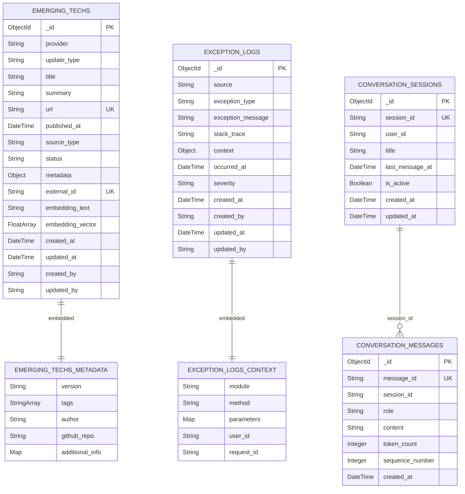

# MongoDB Atlas 도큐먼트 설계서

**작성 일시**: 2026-01-07
**대상**: CQRS 패턴의 Query Side (읽기 전용)
**MongoDB 버전**: 7.0+
**Atlas 버전**: latest

## 목차

1. [개요](#개요)
2. [도큐먼트 설계](#도큐먼트-설계)
   - [EmergingTechDocument](#emergingtechdocument)
   - [ConversationSessionDocument](#conversationsessiondocument)
   - [ConversationMessageDocument](#conversationmessagedocument)
   - [ExceptionLogDocument](#exceptionlogdocument)
3. [인덱스 전략](#인덱스-전략)
4. [ERD 다이어그램](#erd-다이어그램)
5. [프로젝션 최적화](#프로젝션-최적화)
6. [샘플 데이터](#샘플-데이터)

---

## 개요

이 설계서는 CQRS 패턴의 Query Side(읽기 전용)를 위한 MongoDB Atlas 도큐먼트 설계를 다룹니다. 모든 도큐먼트는 읽기 성능 최적화를 위해 설계되었으며, ESR 규칙(Equality → Sort → Range)을 준수하여 인덱스를 설계합니다.

### CQRS 동기화 설계

이 설계서는 Command Side(Aurora MySQL)와 Query Side(MongoDB Atlas) 간의 데이터 동기화를 고려하여 설계되었습니다:

- **ConversationSessionDocument**: `sessionId` 필드를 통해 Aurora MySQL의 `ConversationSession` 테이블 TSID 전략으로 체번된 PK 값(BIGINT UNSIGNED)을 저장합니다.

- **ConversationMessageDocument**: `messageId` 필드를 통해 Aurora MySQL의 `ConversationMessage` 테이블 TSID 전략으로 체번된 PK 값(BIGINT UNSIGNED)을 저장합니다.

### 설계 원칙

1. **읽기 최적화**: 읽기 전용 워크로드에 최적화된 구조
2. **비정규화**: 자주 함께 조회되는 데이터를 하나의 도큐먼트에 포함
3. **프로젝션 활용**: 필요한 필드만 선택하여 네트워크 트래픽 최소화
4. **인덱스 전략**: ESR 규칙 준수 및 쿼리 패턴 기반 인덱스 설계
5. **도큐먼트 크기**: 16MB 제한 고려
6. **CQRS 동기화**: Aurora MySQL과 MongoDB Atlas 간의 데이터 동기화를 위한 TSID 필드 활용
7. **벡터 검색**: MongoDB Atlas Vector Search를 통한 시맨틱 검색 지원 (OpenAI text-embedding-3-small, 1536차원)

---

## 도큐먼트 설계

> Contest/News 수집 기능 폐기로 SourcesDocument, ContestDocument, NewsArticleDocument 섹션 삭제됨
> BookmarkDocument, UserProfileDocument 폐기 (Aurora MySQL에서 직접 관리)

---

### EmergingTechDocument

AI 기술 업데이트 정보를 저장하는 도큐먼트입니다. OpenAI, Anthropic, Google, Meta, xAI 등 AI 제공업체의 최신 업데이트(모델 출시, API 변경, SDK 릴리즈, 제품 출시, 플랫폼 업데이트, 블로그 포스트 등)를 추적합니다.

**데이터 수집**: `batch-source` 모듈의 배치 작업에서 GitHub Releases, 공식 블로그 RSS, 웹 스크래핑 등을 통해 수집된 업데이트 정보가 이 도큐먼트로 저장됩니다. `externalId` 필드를 통해 중복 데이터 삽입을 방지합니다.

**벡터 검색**: `embeddingText`와 `embeddingVector` 필드를 통해 MongoDB Atlas Vector Search 기반의 시맨틱 검색을 지원합니다. OpenAI text-embedding-3-small 모델(1536차원)을 사용하여 벡터를 생성합니다.

#### 필드 구조

```javascript
{
  _id: ObjectId,                    // MongoDB 자동 생성
  provider: String,                 // AI 제공업체: "OPENAI", "ANTHROPIC", "GOOGLE", "META", "XAI"
  update_type: String,              // 업데이트 타입: "MODEL_RELEASE", "API_UPDATE", "SDK_RELEASE", "PRODUCT_LAUNCH", "PLATFORM_UPDATE", "BLOG_POST"
  title: String,                    // 업데이트 제목
  summary: String,                  // 요약
  url: String,                      // 원본 URL (UNIQUE)
  published_at: Date,               // 발행 일시
  source_type: String,              // 소스 타입: "GITHUB_RELEASE", "RSS", "WEB_SCRAPING"
  status: String,                   // 상태: "DRAFT", "PENDING", "PUBLISHED", "REJECTED"
  metadata: {                       // 메타데이터 (EmergingTechMetadata, 임베디드)
    version: String,                // SDK/API 버전 (nullable)
    tags: [String],                 // 태그 배열
    author: String,                 // 작성자 (nullable)
    github_repo: String,            // GitHub 저장소 (nullable)
    additional_info: Object         // 추가 정보 (유연한 스키마)
  },
  external_id: String,              // 외부 ID (UNIQUE, 중복 체크용: GitHub release ID 등)
  embedding_text: String,           // 임베딩 대상 텍스트 (Vector Search용)
  embedding_vector: [Float],        // 벡터 필드 (1536차원, text-embedding-3-small)
  created_at: Date,                 // 생성 일시
  updated_at: Date,                 // 수정 일시
  created_by: String,               // 생성자 ID (nullable)
  updated_by: String                // 수정자 ID (nullable)
}
```

#### 인덱스

```javascript
// 1. external_id UNIQUE 인덱스 (중복 방지, @Indexed(unique = true) 어노테이션)
db.emerging_techs.createIndex({ external_id: 1 }, { unique: true })

// 2. url UNIQUE 인덱스 (URL 중복 방지, MongoIndexConfig에서 생성)
db.emerging_techs.createIndex({ url: 1 }, { unique: true })

// 3. provider + published_at 복합 인덱스 (ESR 규칙, MongoIndexConfig에서 생성)
// Equality: provider, Sort: published_at
db.emerging_techs.createIndex({ provider: 1, published_at: -1 })

// 4. status + published_at 복합 인덱스 (ESR 규칙, MongoIndexConfig에서 생성)
// Equality: status, Sort: published_at
db.emerging_techs.createIndex({ status: 1, published_at: -1 })

// 5. provider 단일 인덱스 (@Indexed 어노테이션)
db.emerging_techs.createIndex({ provider: 1 })

// 6. published_at 단일 인덱스 (@Indexed 어노테이션)
db.emerging_techs.createIndex({ published_at: 1 })

// 7. status 단일 인덱스 (@Indexed 어노테이션)
db.emerging_techs.createIndex({ status: 1 })

// 8. url 단일 인덱스 (@Indexed 어노테이션)
db.emerging_techs.createIndex({ url: 1 })

// 9. Atlas Vector Search 인덱스 (시맨틱 검색용)
// 인덱스 이름: vector_index_emerging_techs
// MongoDB Atlas UI 또는 Atlas CLI를 통해 수동 생성 필요
// {
//   "fields": [
//     {
//       "type": "vector",
//       "path": "embedding_vector",
//       "numDimensions": 1536,
//       "similarity": "cosine"
//     },
//     {
//       "type": "filter",
//       "path": "provider"
//     },
//     {
//       "type": "filter",
//       "path": "status"
//     }
//   ]
// }
```

#### 쿼리 패턴

```javascript
// 특정 제공업체의 최신 업데이트 조회
db.emerging_techs.find({ provider: "ANTHROPIC" }).sort({ published_at: -1 }).limit(20)

// 발행된 업데이트만 최신순 조회
db.emerging_techs.find({ status: "PUBLISHED" }).sort({ published_at: -1 })

// 외부 ID로 중복 체크
db.emerging_techs.findOne({ external_id: "anthropic/anthropic-sdk-python/v0.40.0" })

// URL로 업데이트 조회
db.emerging_techs.findOne({ url: "https://github.com/anthropics/anthropic-sdk-python/releases/tag/v0.40.0" })

// 특정 기간의 업데이트 조회
db.emerging_techs.find({
  published_at: {
    $gte: new Date("2026-01-01"),
    $lt: new Date("2026-02-01")
  }
}).sort({ published_at: -1 })

// 제목 텍스트 검색 (대소문자 무시)
db.emerging_techs.find({ title: { $regex: "claude", $options: "i" } })

// Atlas Vector Search (시맨틱 검색)
db.emerging_techs.aggregate([{
  $vectorSearch: {
    index: "vector_index_emerging_techs",
    path: "embedding_vector",
    queryVector: [/* 1536-dim vector */],
    numCandidates: 100,
    limit: 10,
    filter: { provider: "ANTHROPIC", status: "PUBLISHED" }
  }
}])
```

---

### ConversationSessionDocument

대화 세션 정보를 저장하는 도큐먼트입니다. RAG 챗봇의 대화 세션을 관리합니다.

**중요**: 이 도큐먼트는 Aurora MySQL의 `ConversationSession` 테이블과 동기화되도록 설계되었습니다. `session_id` 필드는 Aurora MySQL의 ConversationSession 테이블에서 TSID 전략으로 체번된 PK 값(BIGINT UNSIGNED)을 저장하며, 이를 통해 Aurora MySQL의 ConversationSession 테이블 데이터 변경이 즉시 MongoDB 도큐먼트로 반영됩니다.

#### 필드 구조

```javascript
{
  _id: ObjectId,                    // MongoDB 자동 생성
  session_id: String,               // Aurora MySQL ConversationSession 테이블 TSID PK 값 (UNIQUE)
  user_id: String,                  // 사용자 ID
  title: String,                    // 세션 제목
  last_message_at: Date,            // 마지막 메시지 일시
  is_active: Boolean,               // 활성화 여부
  created_at: Date,                 // 생성 일시
  updated_at: Date                  // 수정 일시
}
```

#### 인덱스

```javascript
// 1. session_id UNIQUE 인덱스 (Aurora MySQL 동기화용, @Indexed(unique = true) 어노테이션)
db.conversation_sessions.createIndex({ session_id: 1 }, { unique: true })

// 2. user_id + is_active + last_message_at 복합 인덱스 (ESR 규칙, MongoIndexConfig에서 생성)
// Equality: user_id, is_active, Sort: last_message_at
db.conversation_sessions.createIndex({ user_id: 1, is_active: 1, last_message_at: -1 })

// 3. last_message_at TTL 인덱스 (90일 후 자동 삭제, MongoIndexConfig에서 생성)
db.conversation_sessions.createIndex(
  { last_message_at: 1 },
  { expireAfterSeconds: 7776000 }  // 90일 = 90 * 24 * 60 * 60
)

// 4. user_id 단일 인덱스 (@Indexed 어노테이션)
db.conversation_sessions.createIndex({ user_id: 1 })

// 5. is_active 단일 인덱스 (@Indexed 어노테이션)
db.conversation_sessions.createIndex({ is_active: 1 })

// 6. last_message_at 단일 인덱스 (@Indexed 어노테이션)
db.conversation_sessions.createIndex({ last_message_at: 1 })
```

#### 쿼리 패턴

```javascript
// Aurora MySQL TSID로 도큐먼트 조회 (동기화 확인용)
db.conversation_sessions.findOne({ session_id: "1234567890123456789" })

// 사용자의 활성 세션 조회 (최신순)
db.conversation_sessions.find({ user_id: "user123", is_active: true }).sort({ last_message_at: -1 })

// 사용자의 모든 세션 조회 (최신순)
db.conversation_sessions.find({ user_id: "user123" }).sort({ last_message_at: -1 })
```

---

### ConversationMessageDocument

대화 메시지 정보를 저장하는 도큐먼트입니다. RAG 챗봇의 대화 메시지 히스토리를 저장합니다.

**중요**: 이 도큐먼트는 Aurora MySQL의 `ConversationMessage` 테이블과 동기화되도록 설계되었습니다. `message_id` 필드는 Aurora MySQL의 ConversationMessage 테이블에서 TSID 전략으로 체번된 PK 값(BIGINT UNSIGNED)을 저장하며, 이를 통해 Aurora MySQL의 ConversationMessage 테이블 데이터 변경이 즉시 MongoDB 도큐먼트로 반영됩니다.

#### 필드 구조

```javascript
{
  _id: ObjectId,                    // MongoDB 자동 생성
  message_id: String,               // Aurora MySQL ConversationMessage 테이블 TSID PK 값 (UNIQUE)
  session_id: String,               // 세션 ID (ConversationSessionDocument 참조)
  role: String,                     // 역할: "USER", "ASSISTANT", "SYSTEM"
  content: String,                  // 메시지 내용
  token_count: Integer,             // 토큰 수 (nullable)
  sequence_number: Integer,         // 순서 번호
  created_at: Date                  // 생성 일시
}
```

#### 인덱스

```javascript
// 1. message_id UNIQUE 인덱스 (Aurora MySQL 동기화용, @Indexed(unique = true) 어노테이션)
db.conversation_messages.createIndex({ message_id: 1 }, { unique: true })

// 2. session_id + sequence_number 복합 인덱스 (ESR 규칙, MongoIndexConfig에서 생성)
// Equality: session_id, Sort: sequence_number
db.conversation_messages.createIndex({ session_id: 1, sequence_number: 1 })

// 3. created_at TTL 인덱스 (1년 후 자동 삭제, MongoIndexConfig에서 생성)
db.conversation_messages.createIndex(
  { created_at: 1 },
  { expireAfterSeconds: 31536000 }  // 1년 = 365 * 24 * 60 * 60
)

// 4. session_id 단일 인덱스 (@Indexed 어노테이션)
db.conversation_messages.createIndex({ session_id: 1 })

// 5. role 단일 인덱스 (@Indexed 어노테이션)
db.conversation_messages.createIndex({ role: 1 })

// 6. sequence_number 단일 인덱스 (@Indexed 어노테이션)
db.conversation_messages.createIndex({ sequence_number: 1 })

// 7. created_at 단일 인덱스 (@Indexed 어노테이션)
db.conversation_messages.createIndex({ created_at: 1 })
```

#### 쿼리 패턴

```javascript
// Aurora MySQL TSID로 도큐먼트 조회 (동기화 확인용)
db.conversation_messages.findOne({ message_id: "9876543210987654321" })

// 세션의 메시지 조회 (순서대로)
db.conversation_messages.find({ session_id: "session123" }).sort({ sequence_number: 1 })

// 특정 역할의 메시지 조회
db.conversation_messages.find({ session_id: "session123", role: "USER" }).sort({ sequence_number: 1 })
```

---

### ExceptionLogDocument

예외 로그를 저장하는 도큐먼트입니다. 읽기/쓰기 예외를 모두 기록합니다.

#### 필드 구조

```javascript
{
  _id: ObjectId,                    // MongoDB 자동 생성
  source: String,                   // 예외 소스: "READ", "WRITE"
  exception_type: String,           // 예외 타입 (예: "DataAccessException", "ValidationException")
  exception_message: String,        // 예외 메시지
  stack_trace: String,              // 스택 트레이스 (전체)
  context: {                        // 컨텍스트 정보 (ExceptionContext, 임베디드)
    module: String,                 // 모듈명
    method: String,                 // 메서드명
    parameters: Object,             // 파라미터 정보
    user_id: String,                // 사용자 ID (nullable)
    request_id: String              // 요청 ID (nullable)
  },
  occurred_at: Date,                // 발생 일시
  severity: String,                 // 심각도: "LOW", "MEDIUM", "HIGH", "CRITICAL"
  created_at: Date,                 // 생성 일시
  created_by: String,               // 생성자 ID (nullable)
  updated_at: Date,                 // 수정 일시
  updated_by: String                // 수정자 ID (nullable)
}
```

#### 인덱스

```javascript
// 1. source + occurred_at 복합 인덱스 (ESR 규칙, MongoIndexConfig에서 생성)
// Equality: source, Sort: occurred_at
db.exception_logs.createIndex({ source: 1, occurred_at: -1 })

// 2. exception_type + occurred_at 복합 인덱스 (ESR 규칙, MongoIndexConfig에서 생성)
// Equality: exception_type, Sort: occurred_at
db.exception_logs.createIndex({ exception_type: 1, occurred_at: -1 })

// 3. occurred_at TTL 인덱스 (90일 후 자동 삭제, MongoIndexConfig에서 생성)
db.exception_logs.createIndex(
  { occurred_at: 1 },
  { expireAfterSeconds: 7776000 }  // 90일 = 90 * 24 * 60 * 60
)
```

#### 쿼리 패턴

```javascript
// 특정 소스의 최근 예외 조회
db.exception_logs.find({ source: "READ" }).sort({ occurred_at: -1 }).limit(100)

// 특정 예외 타입의 최근 예외 조회
db.exception_logs.find({ exception_type: "DataAccessException" }).sort({ occurred_at: -1 })

// 최근 24시간 내 예외 조회
db.exception_logs.find({
  occurred_at: { $gte: new Date(Date.now() - 24 * 60 * 60 * 1000) }
}).sort({ occurred_at: -1 })
```

---

## 인덱스 전략

### ESR 규칙 준수

모든 복합 인덱스는 ESR 규칙을 준수하여 설계되었습니다:

1. **Equality (등가)**: 등가 조건에 사용되는 필드
2. **Sort (정렬)**: 정렬에 사용되는 필드
3. **Range (범위)**: 범위 쿼리에 사용되는 필드

### 인덱스 생성 방식

인덱스는 두 가지 방식으로 생성됩니다:

1. **`@Indexed` 어노테이션**: Document 클래스 필드에 선언, Spring Data MongoDB가 자동 생성
2. **`MongoIndexConfig`**: `@PostConstruct`에서 MongoDB Driver API로 직접 생성 (복합 인덱스, TTL 인덱스)

### 인덱스 요약

| 컬렉션 | 인덱스 | 타입 | ESR 규칙 | 생성 방식 |
|--------|--------|------|----------|-----------|
| `emerging_techs` | `external_id` | UNIQUE | - | @Indexed |
| `emerging_techs` | `url` | UNIQUE | - | MongoIndexConfig |
| `emerging_techs` | `provider, published_at` | 복합 | E, S | MongoIndexConfig |
| `emerging_techs` | `status, published_at` | 복합 | E, S | MongoIndexConfig |
| `emerging_techs` | `embedding_vector` | Vector Search | - | Atlas UI/CLI |
| `conversation_sessions` | `session_id` | UNIQUE | - | @Indexed |
| `conversation_sessions` | `user_id, is_active, last_message_at` | 복합 | E, E, S | MongoIndexConfig |
| `conversation_sessions` | `last_message_at` | TTL (90일) | - | MongoIndexConfig |
| `conversation_messages` | `message_id` | UNIQUE | - | @Indexed |
| `conversation_messages` | `session_id, sequence_number` | 복합 | E, S | MongoIndexConfig |
| `conversation_messages` | `created_at` | TTL (365일) | - | MongoIndexConfig |
| `exception_logs` | `source, occurred_at` | 복합 | E, S | MongoIndexConfig |
| `exception_logs` | `exception_type, occurred_at` | 복합 | E, S | MongoIndexConfig |
| `exception_logs` | `occurred_at` | TTL (90일) | - | MongoIndexConfig |

---

## ERD 다이어그램

### Mermaid ERD



### 관계 설명

1. **EMERGING_TECHS → EMERGING_TECHS_METADATA**: Embedded (메타데이터가 도큐먼트 내부에 임베디드)
2. **EXCEPTION_LOGS → EXCEPTION_LOGS_CONTEXT**: Embedded (컨텍스트 정보가 도큐먼트 내부에 임베디드)
3. **CONVERSATION_SESSIONS → CONVERSATION_MESSAGES**: One-to-Many (한 세션은 여러 메시지를 가질 수 있음)

---

## 프로젝션 최적화

### 프로젝션 예제

#### EmergingTechDocument 프로젝션

```javascript
// 업데이트 리스트 조회 (embedding_vector 제외하여 네트워크 트래픽 최소화)
db.emerging_techs.find(
  { status: "PUBLISHED" },
  { _id: 1, provider: 1, update_type: 1, title: 1, summary: 1, url: 1, published_at: 1, source_type: 1, status: 1, metadata: 1 }
).sort({ published_at: -1 })

// 벡터 검색 결과에서 필요한 필드만 프로젝션
db.emerging_techs.aggregate([
  { $vectorSearch: { index: "vector_index_emerging_techs", path: "embedding_vector", queryVector: [/* ... */], numCandidates: 100, limit: 10 } },
  { $project: { title: 1, summary: 1, url: 1, provider: 1, published_at: 1, score: { $meta: "vectorSearchScore" } } }
])
```

---

## 샘플 데이터

### EmergingTechDocument 샘플

#### JavaScript 형식

```javascript
{
  _id: ObjectId("507f1f77bcf86cd799439020"),
  provider: "ANTHROPIC",
  update_type: "SDK_RELEASE",
  title: "anthropic-sdk-python v0.40.0",
  summary: "Added support for new Claude 3.5 Sonnet model with improved vision capabilities",
  url: "https://github.com/anthropics/anthropic-sdk-python/releases/tag/v0.40.0",
  published_at: ISODate("2026-01-25T10:00:00Z"),
  source_type: "GITHUB_RELEASE",
  status: "PUBLISHED",
  metadata: {
    version: "0.40.0",
    tags: ["python", "sdk", "claude", "ai"],
    author: "anthropics",
    github_repo: "anthropics/anthropic-sdk-python",
    additional_info: {
      prerelease: false,
      download_count: 15000
    }
  },
  external_id: "anthropic/anthropic-sdk-python/v0.40.0",
  embedding_text: "anthropic-sdk-python v0.40.0 Added support for new Claude 3.5 Sonnet model with improved vision capabilities python sdk claude ai",
  embedding_vector: [0.0123, -0.0456, 0.0789, /* ... 1536 dimensions ... */],
  created_at: ISODate("2026-01-25T11:00:00Z"),
  updated_at: ISODate("2026-01-25T11:00:00Z"),
  created_by: "batch-source",
  updated_by: "batch-source"
}
```

#### JSON Document 형식

```json
{
  "_id": "507f1f77bcf86cd799439020",
  "provider": "ANTHROPIC",
  "update_type": "SDK_RELEASE",
  "title": "anthropic-sdk-python v0.40.0",
  "summary": "Added support for new Claude 3.5 Sonnet model with improved vision capabilities",
  "url": "https://github.com/anthropics/anthropic-sdk-python/releases/tag/v0.40.0",
  "published_at": "2026-01-25T10:00:00Z",
  "source_type": "GITHUB_RELEASE",
  "status": "PUBLISHED",
  "metadata": {
    "version": "0.40.0",
    "tags": ["python", "sdk", "claude", "ai"],
    "author": "anthropics",
    "github_repo": "anthropics/anthropic-sdk-python",
    "additional_info": {
      "prerelease": false,
      "download_count": 15000
    }
  },
  "external_id": "anthropic/anthropic-sdk-python/v0.40.0",
  "embedding_text": "anthropic-sdk-python v0.40.0 Added support for new Claude 3.5 Sonnet model with improved vision capabilities python sdk claude ai",
  "embedding_vector": [0.0123, -0.0456, 0.0789],
  "created_at": "2026-01-25T11:00:00Z",
  "updated_at": "2026-01-25T11:00:00Z",
  "created_by": "batch-source",
  "updated_by": "batch-source"
}
```

### ConversationSessionDocument 샘플

#### JavaScript 형식

```javascript
{
  _id: ObjectId("507f1f77bcf86cd799439018"),
  session_id: "1234567890123456789",
  user_id: "user123",
  title: "Spring Boot 질문",
  last_message_at: ISODate("2026-01-16T14:30:00Z"),
  is_active: true,
  created_at: ISODate("2026-01-16T14:00:00Z"),
  updated_at: ISODate("2026-01-16T14:30:00Z")
}
```

#### JSON Document 형식

```json
{
  "_id": "507f1f77bcf86cd799439018",
  "session_id": "1234567890123456789",
  "user_id": "user123",
  "title": "Spring Boot 질문",
  "last_message_at": "2026-01-16T14:30:00Z",
  "is_active": true,
  "created_at": "2026-01-16T14:00:00Z",
  "updated_at": "2026-01-16T14:30:00Z"
}
```

### ConversationMessageDocument 샘플

#### JavaScript 형식

```javascript
{
  _id: ObjectId("507f1f77bcf86cd799439019"),
  message_id: "9876543210987654321",
  session_id: "1234567890123456789",
  role: "USER",
  content: "Spring Boot 4.0의 새로운 기능은 무엇인가요?",
  token_count: 25,
  sequence_number: 1,
  created_at: ISODate("2026-01-16T14:00:00Z")
}
```

#### JSON Document 형식

```json
{
  "_id": "507f1f77bcf86cd799439019",
  "message_id": "9876543210987654321",
  "session_id": "1234567890123456789",
  "role": "USER",
  "content": "Spring Boot 4.0의 새로운 기능은 무엇인가요?",
  "token_count": 25,
  "sequence_number": 1,
  "created_at": "2026-01-16T14:00:00Z"
}
```

### ExceptionLogDocument 샘플

#### JavaScript 형식

```javascript
{
  _id: ObjectId("507f1f77bcf86cd799439017"),
  source: "READ",
  exception_type: "DataAccessException",
  exception_message: "Connection timeout",
  stack_trace: "java.sql.SQLException: Connection timeout...",
  context: {
    module: "domain-mongodb",
    method: "findBySourceId",
    parameters: {
      source_id: "507f1f77bcf86cd799439011"
    },
    user_id: null,
    request_id: "req-12345"
  },
  occurred_at: ISODate("2026-01-07T09:00:00Z"),
  severity: "MEDIUM",
  created_at: ISODate("2026-01-07T09:00:00Z"),
  created_by: "system",
  updated_at: ISODate("2026-01-07T09:00:00Z"),
  updated_by: "system"
}
```

#### JSON Document 형식

```json
{
  "_id": "507f1f77bcf86cd799439017",
  "source": "READ",
  "exception_type": "DataAccessException",
  "exception_message": "Connection timeout",
  "stack_trace": "java.sql.SQLException: Connection timeout...",
  "context": {
    "module": "domain-mongodb",
    "method": "findBySourceId",
    "parameters": {
      "source_id": "507f1f77bcf86cd799439011"
    },
    "user_id": null,
    "request_id": "req-12345"
  },
  "occurred_at": "2026-01-07T09:00:00Z",
  "severity": "MEDIUM",
  "created_at": "2026-01-07T09:00:00Z",
  "created_by": "system",
  "updated_at": "2026-01-07T09:00:00Z",
  "updated_by": "system"
}
```

---

## 도큐먼트 크기 예상치

### EmergingTechDocument
- 예상 크기: 약 7 KB ~ 15 KB (embedding_vector 1536차원 포함 시)
- embedding_vector 미포함 시: 약 1 KB ~ 3 KB
- 16MB 제한 내에서 약 1,000 ~ 2,200개 도큐먼트 저장 가능 (벡터 포함)
- external_id 및 url을 통한 중복 데이터 방지

### ConversationSessionDocument
- 예상 크기: 약 300 bytes ~ 500 bytes
- 16MB 제한 내에서 약 32,000 ~ 53,000개 도큐먼트 저장 가능
- TTL 인덱스로 90일 후 자동 삭제

### ConversationMessageDocument
- 예상 크기: 약 500 bytes ~ 2 KB (content 필드 크기에 따라 변동)
- 16MB 제한 내에서 약 8,000 ~ 32,000개 도큐먼트 저장 가능
- TTL 인덱스로 1년 후 자동 삭제 (오래된 메시지)

### ExceptionLogDocument
- 예상 크기: 약 2 KB ~ 5 KB (stack_trace 필드 포함)
- 16MB 제한 내에서 약 3,200 ~ 8,000개 도큐먼트 저장 가능
- TTL 인덱스로 90일 후 자동 삭제

---

## 결론

이 설계서는 CQRS 패턴의 Query Side를 위한 MongoDB Atlas 도큐먼트 설계를 제공합니다. 모든 도큐먼트는 읽기 성능 최적화를 위해 설계되었으며, ESR 규칙을 준수한 인덱스 전략을 사용합니다.

### 주요 특징

1. **읽기 최적화**: 읽기 전용 워크로드에 최적화된 구조
2. **비정규화**: 자주 함께 조회되는 데이터를 하나의 도큐먼트에 포함
3. **ESR 규칙 준수**: 모든 복합 인덱스가 ESR 규칙을 준수
4. **프로젝션 활용**: 필요한 필드만 선택하여 네트워크 트래픽 최소화
5. **도큐먼트 크기 고려**: 16MB 제한을 고려한 설계
6. **TTL 인덱스**: 임시 데이터(예외 로그, 대화 세션/메시지)에 TTL 인덱스 적용
7. **CQRS 동기화**: Aurora MySQL과 MongoDB Atlas 간의 데이터 동기화를 위한 TSID 필드 활용
   - `ConversationSessionDocument.session_id`: Aurora MySQL ConversationSession 테이블 PK와 1:1 매핑
   - `ConversationMessageDocument.message_id`: Aurora MySQL ConversationMessage 테이블 PK와 1:1 매핑
8. **벡터 검색**: MongoDB Atlas Vector Search를 통한 시맨틱 검색 지원
   - `EmergingTechDocument.embedding_vector`: 1536차원 벡터 (OpenAI text-embedding-3-small)
   - Vector Search 인덱스: `vector_index_emerging_techs` (cosine 유사도, provider/status 필터 지원)

### 다음 단계

1. MongoDB Atlas 클러스터 생성 및 설정
2. 컬렉션 생성 및 인덱스 생성
3. Atlas Vector Search 인덱스 수동 생성 (`vector_index_emerging_techs`)
4. 샘플 데이터 삽입 및 쿼리 테스트
5. 성능 모니터링 및 최적화

---

**문서 버전**: 2.0
**최종 업데이트**: 2026-02-02
**작성자**: MongoDB Database Architect

### 변경 이력

- **v2.0 (2026-02-02)**:
  - 전체 설계서를 현재 `datasource-mongodb` 코드 기준으로 재정비
  - `AiUpdateDocument` → `EmergingTechDocument`로 명칭 변경 (컬렉션: `emerging_techs`)
  - `BookmarkDocument`, `UserProfileDocument` 섹션 삭제 (Aurora MySQL에서 직접 관리)
  - 모든 필드명을 실제 `@Field` 어노테이션 값(snake_case)으로 통일
  - `EmergingTechDocument`에 `embedding_text`, `embedding_vector` 필드 문서화
  - provider 목록에 `XAI` 추가, updateType에 `PRODUCT_LAUNCH`, `PLATFORM_UPDATE` 추가
  - Vector Search 인덱스 정의를 `VectorSearchIndexConfig` 코드 기준으로 업데이트 (provider, status 필터 포함)
  - 인덱스 요약 테이블에 생성 방식 컬럼 추가 (@Indexed vs MongoIndexConfig vs Atlas UI/CLI)
  - ERD 다이어그램을 `contents/mongodb-erd-diagram.mmd`과 동일하게 정비
  - 샘플 데이터에 EmergingTechDocument 추가, embedding 관련 필드 포함
  - 도큐먼트 크기 예상치를 벡터 필드 포함 기준으로 재계산
- **v1.6 (2026-01-27)**:
  - `AiUpdateDocument` 추가 (AI 제공업체 업데이트 추적)
    - provider, updateType, title, summary, url, publishedAt 등 기본 필드
    - AiUpdateMetadata 임베디드 도큐먼트 (version, tags, author, githubRepo, additionalInfo)
    - externalId UNIQUE 인덱스로 중복 방지
    - provider + publishedAt, status + publishedAt 복합 인덱스
  - 목차, 인덱스 요약 테이블, ERD 다이어그램 업데이트
  - 샘플 데이터 및 도큐먼트 크기 예상치 추가
- **v1.5 (2026-01-20)**:
  - `SourcesDocument`에 `url` 단일 인덱스 추가
  - URL 기반 검색 쿼리 패턴 추가
  - 인덱스 요약 테이블 업데이트
- **v1.4 (2026-01-20)**:
  - `SourcesDocument` 필드 순서를 `sources.json` 기준으로 정렬
  - `priority` 필드 위치 변경 (점수 필드들 다음으로 이동)
  - 샘플 데이터 (JavaScript, JSON) 필드 순서 업데이트
  - ERD 다이어그램 필드 순서 업데이트
- **v1.3 (2026-01-20)**:
  - `SourcesDocument`에 8개 필드 추가
  - 샘플 데이터 및 도큐먼트 크기 예상치 업데이트
  - ERD 다이어그램 업데이트
- **v1.2 (2026-01-16)**:
  - `ConversationSessionDocument` 추가 (RAG 챗봇 대화 세션 관리)
  - `ConversationMessageDocument` 추가 (RAG 챗봇 대화 메시지 히스토리)
  - 관련 인덱스, ERD 다이어그램, 도큐먼트 크기 예상치 업데이트
- **v1.1 (2026-01-07)**:
  - `BookmarkDocument`에 `bookmarkTsid` 필드 추가 (Aurora MySQL Bookmark 테이블 동기화용)
  - `UserProfileDocument`에 `userTsid` 필드 추가 (Aurora MySQL User 테이블 동기화용)
  - CQRS 동기화 설계 명시
  - 관련 인덱스 및 샘플 데이터 업데이트
