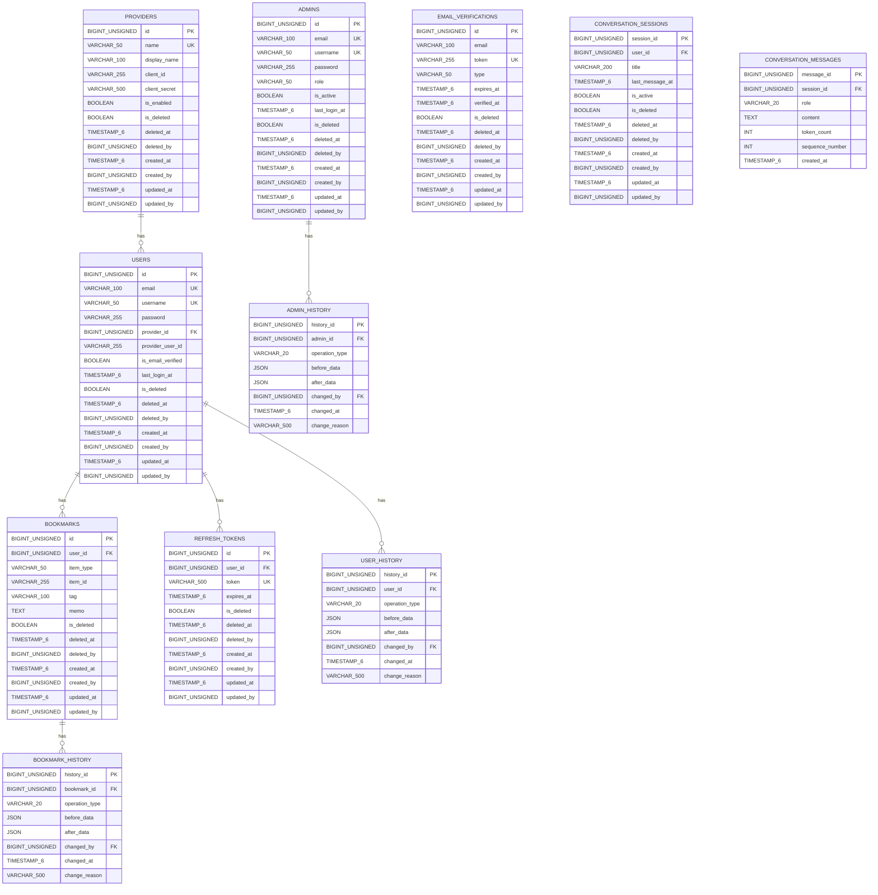

# Amazon Aurora MySQL 테이블 설계서 

**작성 일시**: 2026-01-07 
**대상**: CQRS 패턴의 Command Side (쓰기 전용) 
**Aurora MySQL 버전**: 3.x 
**MySQL 버전**: 8.0+ 

## 목차 

1. [개요](#개요)
2. [데이터베이스 연결 및 환경변수 관리](#데이터베이스-연결-및-환경변수-관리)
3. [API 모듈별 스키마 매핑](#api-모듈별-스키마-매핑)
4. [테이블 설계](#테이블-설계)
   - [Provider 테이블](#provider-테이블)
   - [User 테이블](#user-테이블)
   - [Admin 테이블](#admin-테이블)
   - [Bookmark 테이블](#bookmark-테이블)
   - [RefreshToken 테이블](#refreshtoken-테이블)
   - [EmailVerification 테이블](#emailverification-테이블)
   - [히스토리 테이블](#히스토리-테이블)
   - [Spring Batch 메타데이터 테이블](#spring-batch-메타데이터-테이블)
5. [인덱스 전략](#인덱스-전략)
6. [ERD 다이어그램](#erd-다이어그램)
7. [DDL 예제](#ddl-예제)

---

## 개요

이 설계서는 CQRS 패턴의 Command Side(쓰기 전용)를 위한 Amazon Aurora MySQL 테이블 설계를 다룹니다. 모든 테이블은 TSID(Time-Sorted Unique Identifier)를 Primary Key로 사용하며, 높은 정규화 수준(최소 3NF)을 유지합니다.

### 설계 원칙

1. **TSID Primary Key**: 모든 테이블의 Primary Key는 TSID 방식(BIGINT UNSIGNED) 사용
2. **높은 정규화**: Command Side는 쓰기 최적화를 위해 높은 정규화 수준(최소 3NF) 유지
3. **Soft Delete**: 모든 메인 테이블에 Soft Delete(is_deleted, deleted_at, deleted_by) 포함
4. **인덱스 최소화**: Command Side는 쓰기 성능을 위해 필수 인덱스만 생성
5. **히스토리 추적**: 모든 쓰기 작업에 대한 히스토리 테이블 자동 저장

---

## 데이터베이스 연결 및 환경변수 관리

### 환경변수 관리 원칙

Aurora DB Cluster의 접속 정보와 옵션 정보는 환경변수로 관리합니다. 이는 보안성과 환경별 설정 분리를 위해 필수적입니다.

#### 필수 환경변수

| 환경변수명 | 설명 | 예시 |
|-----------|------|------|
| `AURORA_WRITER_ENDPOINT` | Aurora Writer 엔드포인트 | `aurora-cluster.cluster-xxxxx.ap-northeast-2.rds.amazonaws.com` |
| `AURORA_READER_ENDPOINT` | Aurora Reader 엔드포인트 | `aurora-cluster.cluster-ro-xxxxx.ap-northeast-2.rds.amazonaws.com` |
| `AURORA_USERNAME` | 데이터베이스 사용자명 | `admin` |
| `AURORA_PASSWORD` | 데이터베이스 비밀번호 | `********` |
| `AURORA_OPTIONS` | JDBC 연결 옵션 | `useSSL=true&serverTimezone=Asia/Seoul&characterEncoding=UTF-8` |

#### 로컬 환경 설정

로컬 환경에서는 `.env` 파일을 사용하여 환경변수를 관리합니다.

**`.env` 파일 예시:**

```bash
# Aurora DB Cluster 연결 정보
AURORA_WRITER_ENDPOINT=aurora-cluster.cluster-xxxxx.ap-northeast-2.rds.amazonaws.com
AURORA_READER_ENDPOINT=aurora-cluster.cluster-ro-xxxxx.ap-northeast-2.rds.amazonaws.com
AURORA_USERNAME=admin
AURORA_PASSWORD=your-password-here
AURORA_OPTIONS=useSSL=true&serverTimezone=Asia/Seoul&characterEncoding=UTF-8

# 기타 설정
DB_FETCH_CHUNKSIZE=250
DB_BATCH_SIZE=50
TZ=Asia/Seoul
```

**주의사항:**
- `.env` 파일은 `.gitignore`에 포함되어야 하며, 버전 관리에 포함되지 않아야 합니다.
- 프로덕션 환경에서는 환경변수를 직접 설정하거나, AWS Secrets Manager, Parameter Store 등을 활용합니다.

#### JDBC 연결 옵션

`AURORA_OPTIONS` 환경변수에 포함되는 주요 옵션:

- `useSSL=true`: SSL 연결 활성화
- `serverTimezone=Asia/Seoul`: 서버 타임존 설정
- `characterEncoding=UTF-8`: 문자 인코딩 설정
- `rewriteBatchedStatements=true`: 배치 문 재작성 (성능 향상)
- `cachePrepStmts=true`: Prepared Statement 캐싱
- 기타 필요한 옵션들

---

## API 모듈별 스키마 매핑

API 모듈별로 Aurora DB Cluster의 데이터베이스 스키마를 구분하여 사용합니다. 이를 통해 모듈 간 데이터 격리와 독립적인 스키마 관리가 가능합니다.

### 스키마 매핑 설정 방식

각 API 모듈은 자체 `application.yml` 파일에서 `module.aurora.schema` 속성을 설정하고, `datasource/aurora/src/main/resources/application-api-domain.yml`에서 `${module.aurora.schema}` 환경변수를 사용하여 동적으로 스키마를 참조합니다.

**설정 구조**:
1. 각 API 모듈의 `api-*-application.yml` 파일에서 `module.aurora.schema` 설정
2. `datasource/aurora/src/main/resources/application-api-domain.yml`에서 `${module.aurora.schema}` 사용

### 스키마 매핑 개요 

| API 모듈 | Aurora DB 사용 여부 | 스키마명 | 관리 테이블 | 
|---------|-------------------|---------|------------| 
| `api-auth` | ✅ 사용 | `auth` | providers, users, admins, refresh_tokens, email_verifications, user_history, admin_history | 
| `api-bookmark` | ✅ 사용 | `bookmark` | bookmarks, bookmark_history |
| `api-chatbot` | ✅ 사용 | `chatbot` | conversation_sessions, conversation_messages |
| `api-emerging-tech` | ❌ 미사용 | - | MongoDB Atlas만 사용 (emerging_techs 컬렉션) |
| `api-agent` | ❌ 미사용 | - | MongoDB Atlas만 사용 |

### api-auth 모듈 

**스키마명**: `auth` 

**관리 테이블**:
- `providers`: OAuth 제공자 정보
- `users`: 사용자 정보
- `admins`: 관리자 정보
- `refresh_tokens`: JWT Refresh Token
- `email_verifications`: 이메일 인증 정보
- `user_history`: 사용자 변경 이력
- `admin_history`: 관리자 변경 이력

**설정 방법**:

1. **api-auth 모듈의 `api-auth-application.yml` 파일**:
```yaml
module:
  aurora:
    schema: auth
```

2. **datasource/aurora/src/main/resources/application-api-domain.yml**에서 자동으로 사용:
```yaml
spring:
  datasource:
    writer:
      url: jdbc:mysql://${AURORA_WRITER_ENDPOINT}:3306/${module.aurora.schema}?${AURORA_OPTIONS}
      username: ${AURORA_USERNAME}
      password: ${AURORA_PASSWORD}
    reader:
      url: jdbc:mysql://${AURORA_READER_ENDPOINT}:3306/${module.aurora.schema}?${AURORA_OPTIONS}
      username: ${AURORA_USERNAME}
      password: ${AURORA_PASSWORD}
```

**설명**: `api-auth` 모듈은 `module.aurora.schema=auth`로 설정하면, `application-api-domain.yml`의 `${module.aurora.schema}`가 `auth`로 치환되어 `auth` 스키마에 연결됩니다.

> Contest/News 수집 기능 폐기로 api-contest, api-news 모듈 섹션 삭제됨

### api-bookmark 모듈

**스키마명**: `bookmark`

**관리 테이블**:
- `bookmarks`: 사용자 북마크 정보
- `bookmark_history`: 북마크 변경 이력

**설정 방법**:

1. **api-bookmark 모듈의 `api-bookmark-application.yml` 파일**:
```yaml
module:
  aurora:
    schema: bookmark
```

2. **datasource/aurora/src/main/resources/application-api-domain.yml**에서 자동으로 사용:
```yaml
spring:
  datasource:
    writer:
      url: jdbc:mysql://${AURORA_WRITER_ENDPOINT}:3306/${module.aurora.schema}?${AURORA_OPTIONS}
      username: ${AURORA_USERNAME}
      password: ${AURORA_PASSWORD}
    reader:
      url: jdbc:mysql://${AURORA_READER_ENDPOINT}:3306/${module.aurora.schema}?${AURORA_OPTIONS}
      username: ${AURORA_USERNAME}
      password: ${AURORA_PASSWORD}
```

**설명**: `api-bookmark` 모듈은 `module.aurora.schema=bookmark`로 설정하면, `application-api-domain.yml`의 `${module.aurora.schema}`가 `bookmark`로 치환되어 `bookmark` 스키마에 연결됩니다.

**주의사항**:
- `bookmarks` 테이블의 `user_id`는 `auth` 스키마의 `users` 테이블을 참조합니다.
- 스키마 간 Foreign Key 제약조건은 지원되지 않으므로, 애플리케이션 레벨에서 참조 무결성을 보장해야 합니다.

### api-chatbot 모듈

**스키마명**: `chatbot`

**관리 테이블**:
- `conversation_sessions`: 대화 세션 정보
- `conversation_messages`: 대화 메시지 히스토리

**설정 방법**:

1. **api-chatbot 모듈의 `api-chatbot-application.yml` 파일**:
```yaml
module:
  aurora:
    schema: chatbot
```

2. **datasource/aurora/src/main/resources/application-api-domain.yml**에서 자동으로 사용:
```yaml
spring:
  datasource:
    writer:
      url: jdbc:mysql://${AURORA_WRITER_ENDPOINT}:3306/${module.aurora.schema}?${AURORA_OPTIONS}
      username: ${AURORA_USERNAME}
      password: ${AURORA_PASSWORD}
    reader:
      url: jdbc:mysql://${AURORA_READER_ENDPOINT}:3306/${module.aurora.schema}?${AURORA_OPTIONS}
      username: ${AURORA_USERNAME}
      password: ${AURORA_PASSWORD}
```

**설명**: `api-chatbot` 모듈은 `module.aurora.schema=chatbot`로 설정하면, `application-api-domain.yml`의 `${module.aurora.schema}`가 `chatbot`로 치환되어 `chatbot` 스키마에 연결됩니다.

**주의사항**:
- `conversation_sessions` 테이블의 `user_id`는 `auth` 스키마의 `users` 테이블을 참조합니다.
- 스키마 간 Foreign Key 제약조건은 지원되지 않으므로, 애플리케이션 레벨에서 참조 무결성을 보장해야 합니다.

### 공통 설정 파일 구조

**datasource/aurora/src/main/resources/application-api-domain.yml** 파일은 모든 API 모듈에서 공통으로 사용되며, `${module.aurora.schema}` 환경변수를 통해 동적으로 스키마를 참조합니다:

```yaml
spring:
  datasource:
    writer:
      url: jdbc:mysql://${AURORA_WRITER_ENDPOINT}:3306/${module.aurora.schema}?${AURORA_OPTIONS}
      username: ${AURORA_USERNAME}
      password: ${AURORA_PASSWORD}
    reader:
      url: jdbc:mysql://${AURORA_READER_ENDPOINT}:3306/${module.aurora.schema}?${AURORA_OPTIONS}
      username: ${AURORA_USERNAME}
      password: ${AURORA_PASSWORD}
```

**설정 흐름**:
1. 각 API 모듈의 `api-*-application.yml`에서 `module.aurora.schema` 값 설정
2. Spring Boot가 설정 파일들을 로드할 때 `module.aurora.schema` 값을 읽음
3. `application-api-domain.yml`의 `${module.aurora.schema}`가 실제 스키마명으로 치환됨
4. 각 모듈은 자신이 설정한 스키마에 연결됨

### 스키마 생성 DDL

각 스키마는 다음 DDL로 생성합니다:

```sql
-- auth 스키마 생성
CREATE DATABASE IF NOT EXISTS auth
  DEFAULT CHARACTER SET utf8mb4
  DEFAULT COLLATE utf8mb4_unicode_ci;

-- bookmark 스키마 생성
CREATE DATABASE IF NOT EXISTS bookmark
  DEFAULT CHARACTER SET utf8mb4
  DEFAULT COLLATE utf8mb4_unicode_ci;
```

---

## 테이블 설계

### Provider 테이블

OAuth 제공자 정보를 저장하는 테이블입니다.

#### 컬럼 구조

| 컬럼명 | 타입 | 제약조건 | 설명 |
|--------|------|----------|------|
| id | BIGINT UNSIGNED | PRIMARY KEY | TSID Primary Key |
| name | VARCHAR(50) | UNIQUE, NOT NULL | 제공자 이름 (예: "GOOGLE", "GITHUB") |
| display_name | VARCHAR(100) | NOT NULL | 표시 이름 |
| client_id | VARCHAR(255) | NULL | OAuth Client ID |
| client_secret | VARCHAR(500) | NULL | OAuth Client Secret (암호화) |
| is_enabled | BOOLEAN | NOT NULL DEFAULT TRUE | 활성화 여부 |
| is_deleted | BOOLEAN | NOT NULL DEFAULT FALSE | 삭제 여부 |
| deleted_at | TIMESTAMP(6) | NULL | 삭제 일시 |
| deleted_by | BIGINT UNSIGNED | NULL | 삭제한 사용자 ID (nullable) |
| created_at | TIMESTAMP(6) | NOT NULL DEFAULT CURRENT_TIMESTAMP(6) | 생성 일시 |
| created_by | BIGINT UNSIGNED | NULL | 생성한 사용자 ID (nullable) |
| updated_at | TIMESTAMP(6) | NOT NULL DEFAULT CURRENT_TIMESTAMP(6) ON UPDATE CURRENT_TIMESTAMP(6) | 수정 일시 |
| updated_by | BIGINT UNSIGNED | NULL | 수정한 사용자 ID (nullable) |

#### 인덱스

```sql
-- name UNIQUE 인덱스
CREATE UNIQUE INDEX idx_provider_name ON providers (name);

-- is_enabled 인덱스
CREATE INDEX idx_provider_is_enabled ON providers (is_enabled);

-- is_deleted 인덱스
CREATE INDEX idx_provider_is_deleted ON providers (is_deleted);
```

---

### User 테이블

사용자 정보를 저장하는 테이블입니다.

#### 컬럼 구조

| 컬럼명 | 타입 | 제약조건 | 설명 |
|--------|------|----------|------|
| id | BIGINT UNSIGNED | PRIMARY KEY | TSID Primary Key |
| email | VARCHAR(100) | UNIQUE, NOT NULL | 이메일 |
| username | VARCHAR(50) | UNIQUE, NOT NULL | 사용자명 |
| password | VARCHAR(255) | NULL | 비밀번호 해시 (OAuth 사용자 제외) |
| provider_id | BIGINT UNSIGNED | FOREIGN KEY, NULL | Provider 테이블 참조 |
| provider_user_id | VARCHAR(255) | NULL | OAuth 제공자의 사용자 ID |
| is_email_verified | BOOLEAN | NOT NULL DEFAULT FALSE | 이메일 인증 완료 여부 |
| last_login_at | TIMESTAMP(6) | NULL | 마지막 로그인 일시 |
| is_deleted | BOOLEAN | NOT NULL DEFAULT FALSE | 삭제 여부 |
| deleted_at | TIMESTAMP(6) | NULL | 삭제 일시 |
| deleted_by | BIGINT UNSIGNED | NULL | 삭제한 사용자 ID (nullable) |
| created_at | TIMESTAMP(6) | NOT NULL DEFAULT CURRENT_TIMESTAMP(6) | 생성 일시 |
| created_by | BIGINT UNSIGNED | NULL | 생성한 사용자 ID (nullable) |
| updated_at | TIMESTAMP(6) | NOT NULL DEFAULT CURRENT_TIMESTAMP(6) ON UPDATE CURRENT_TIMESTAMP(6) | 수정 일시 |
| updated_by | BIGINT UNSIGNED | NULL | 수정한 사용자 ID (nullable) |

#### 인덱스

```sql
-- email UNIQUE 인덱스
CREATE UNIQUE INDEX idx_user_email ON users (email);

-- username UNIQUE 인덱스
CREATE UNIQUE INDEX idx_user_username ON users (username);

-- provider_id 외래 키 인덱스
CREATE INDEX idx_user_provider_id ON users (provider_id);

-- provider_id + provider_user_id 복합 인덱스 (OAuth 사용자 조회)
CREATE INDEX idx_user_provider ON users (provider_id, provider_user_id);

-- is_deleted 인덱스
CREATE INDEX idx_user_is_deleted ON users (is_deleted);
```

#### Foreign Key

```sql
ALTER TABLE users
ADD CONSTRAINT fk_user_provider
FOREIGN KEY (provider_id) REFERENCES providers(id)
ON DELETE SET NULL;
```

---

### Admin 테이블

관리자 정보를 저장하는 테이블입니다.

#### 컬럼 구조

| 컬럼명 | 타입 | 제약조건 | 설명 |
|--------|------|----------|------|
| id | BIGINT UNSIGNED | PRIMARY KEY | TSID Primary Key |
| email | VARCHAR(100) | UNIQUE, NOT NULL | 이메일 |
| username | VARCHAR(50) | UNIQUE, NOT NULL | 사용자명 |
| password | VARCHAR(255) | NOT NULL | 비밀번호 해시 |
| role | VARCHAR(50) | NOT NULL | 역할 (예: "SUPER_ADMIN", "ADMIN") |
| is_active | BOOLEAN | NOT NULL DEFAULT TRUE | 활성화 여부 |
| last_login_at | TIMESTAMP(6) | NULL | 마지막 로그인 일시 |
| is_deleted | BOOLEAN | NOT NULL DEFAULT FALSE | 삭제 여부 |
| deleted_at | TIMESTAMP(6) | NULL | 삭제 일시 |
| deleted_by | BIGINT UNSIGNED | NULL | 삭제한 사용자 ID (nullable) |
| created_at | TIMESTAMP(6) | NOT NULL DEFAULT CURRENT_TIMESTAMP(6) | 생성 일시 |
| created_by | BIGINT UNSIGNED | NULL | 생성한 사용자 ID (nullable) |
| updated_at | TIMESTAMP(6) | NOT NULL DEFAULT CURRENT_TIMESTAMP(6) ON UPDATE CURRENT_TIMESTAMP(6) | 수정 일시 |
| updated_by | BIGINT UNSIGNED | NULL | 수정한 사용자 ID (nullable) |

#### 인덱스

```sql
-- email UNIQUE 인덱스
CREATE UNIQUE INDEX idx_admin_email ON admins (email);

-- username UNIQUE 인덱스
CREATE UNIQUE INDEX idx_admin_username ON admins (username);

-- role 인덱스
CREATE INDEX idx_admin_role ON admins (role);

-- is_active 인덱스
CREATE INDEX idx_admin_is_active ON admins (is_active);

-- is_deleted 인덱스
CREATE INDEX idx_admin_is_deleted ON admins (is_deleted);
```

---

### Bookmark 테이블

사용자가 북마크한 항목을 저장하는 테이블입니다.

#### 컬럼 구조

| 컬럼명 | 타입 | 제약조건 | 설명 |
|--------|------|----------|------|
| id | BIGINT UNSIGNED | PRIMARY KEY | TSID Primary Key |
| user_id | BIGINT UNSIGNED | FOREIGN KEY, NOT NULL | User 테이블 참조 |
| item_type | VARCHAR(50) | NOT NULL | 항목 타입 (예: "EMERGING_TECH") |
| item_id | VARCHAR(255) | NOT NULL | 항목 ID (MongoDB Atlas ObjectId 문자열) |
| tag | VARCHAR(100) | NULL | 태그 |
| memo | TEXT | NULL | 메모 |
| is_deleted | BOOLEAN | NOT NULL DEFAULT FALSE | 삭제 여부 |
| deleted_at | TIMESTAMP(6) | NULL | 삭제 일시 |
| deleted_by | BIGINT UNSIGNED | NULL | 삭제한 사용자 ID (nullable) |
| created_at | TIMESTAMP(6) | NOT NULL DEFAULT CURRENT_TIMESTAMP(6) | 생성 일시 |
| created_by | BIGINT UNSIGNED | NULL | 생성한 사용자 ID (nullable) |
| updated_at | TIMESTAMP(6) | NOT NULL DEFAULT CURRENT_TIMESTAMP(6) ON UPDATE CURRENT_TIMESTAMP(6) | 수정 일시 |
| updated_by | BIGINT UNSIGNED | NULL | 수정한 사용자 ID (nullable) |

#### 인덱스

```sql
-- user_id 외래 키 인덱스
CREATE INDEX idx_bookmark_user_id ON bookmarks (user_id);

-- user_id + is_deleted 복합 인덱스
CREATE INDEX idx_bookmark_user_is_deleted ON bookmarks (user_id, is_deleted);

-- user_id + item_type + item_id UNIQUE 복합 인덱스 (중복 방지)
CREATE UNIQUE INDEX idx_bookmark_user_item ON bookmarks (user_id, item_type, item_id);
```

#### Foreign Key

**주의사항**: `bookmarks` 테이블은 `bookmark` 스키마에 있으며, `users` 테이블은 `auth` 스키마에 있습니다. MySQL은 스키마 간 Foreign Key 제약조건을 지원하지 않으므로, 다음 Foreign Key 제약조건은 실제로는 생성되지 않습니다. 대신 애플리케이션 레벨에서 참조 무결성을 보장해야 합니다.

```sql
-- 참고: 스키마 간 Foreign Key는 지원되지 않으므로 실제로는 생성되지 않음
-- ALTER TABLE bookmarks
-- ADD CONSTRAINT fk_bookmark_user
-- FOREIGN KEY (user_id) REFERENCES auth.users(id)
-- ON DELETE CASCADE;
```

**애플리케이션 레벨 처리**:
- `user_id` 값의 유효성 검증은 애플리케이션 레벨에서 수행해야 합니다.
- `users` 테이블의 레코드 삭제 시 관련 `bookmarks` 레코드 처리도 애플리케이션 레벨에서 관리해야 합니다.

#### 제약조건

```sql
-- 중복 북마크 방지 (Soft Delete 제외)
-- UNIQUE 제약조건은 is_deleted = FALSE인 경우에만 적용
-- 애플리케이션 레벨에서 처리하거나, 부분 인덱스 사용 고려
```

---

### RefreshToken 테이블

JWT Refresh Token을 저장하는 테이블입니다.

#### 컬럼 구조

| 컬럼명 | 타입 | 제약조건 | 설명 |
|--------|------|----------|------|
| id | BIGINT UNSIGNED | PRIMARY KEY | TSID Primary Key |
| user_id | BIGINT UNSIGNED | FOREIGN KEY, NOT NULL | User 테이블 참조 |
| token | VARCHAR(500) | UNIQUE, NOT NULL | Refresh Token |
| expires_at | TIMESTAMP(6) | NOT NULL | 만료 일시 |
| is_deleted | BOOLEAN | NOT NULL DEFAULT FALSE | 삭제 여부 |
| deleted_at | TIMESTAMP(6) | NULL | 삭제 일시 |
| deleted_by | BIGINT UNSIGNED | NULL | 삭제한 사용자 ID (nullable) |
| created_at | TIMESTAMP(6) | NOT NULL DEFAULT CURRENT_TIMESTAMP(6) | 생성 일시 |
| created_by | BIGINT UNSIGNED | NULL | 생성한 사용자 ID (nullable) |
| updated_at | TIMESTAMP(6) | NULL | 수정 일시 (nullable) |
| updated_by | BIGINT UNSIGNED | NULL | 수정한 사용자 ID (nullable) |

#### 인덱스

```sql
-- token UNIQUE 인덱스
CREATE UNIQUE INDEX idx_refresh_token_token ON refresh_tokens (token);

-- user_id 외래 키 인덱스
CREATE INDEX idx_refresh_token_user_id ON refresh_tokens (user_id);

-- expires_at 인덱스 (만료된 토큰 정리)
CREATE INDEX idx_refresh_token_expires_at ON refresh_tokens (expires_at);

-- is_deleted 인덱스
CREATE INDEX idx_refresh_token_is_deleted ON refresh_tokens (is_deleted);
```

#### Foreign Key

```sql
ALTER TABLE refresh_tokens
ADD CONSTRAINT fk_refresh_token_user
FOREIGN KEY (user_id) REFERENCES users(id)
ON DELETE CASCADE;
```

---

### EmailVerification 테이블

이메일 인증 정보를 저장하는 테이블입니다.

#### 컬럼 구조

| 컬럼명 | 타입 | 제약조건 | 설명 |
|--------|------|----------|------|
| id | BIGINT UNSIGNED | PRIMARY KEY | TSID Primary Key |
| email | VARCHAR(100) | NOT NULL | 인증 대상 이메일 |
| token | VARCHAR(255) | UNIQUE, NOT NULL | 인증 토큰 |
| type | VARCHAR(50) | NOT NULL | 토큰 타입 (예: "EMAIL_VERIFICATION", "PASSWORD_RESET") |
| expires_at | TIMESTAMP(6) | NOT NULL | 만료 일시 |
| verified_at | TIMESTAMP(6) | NULL | 인증 완료 일시 |
| is_deleted | BOOLEAN | NOT NULL DEFAULT FALSE | 삭제 여부 |
| deleted_at | TIMESTAMP(6) | NULL | 삭제 일시 |
| deleted_by | BIGINT UNSIGNED | NULL | 삭제한 사용자 ID (nullable) |
| created_at | TIMESTAMP(6) | NOT NULL DEFAULT CURRENT_TIMESTAMP(6) | 생성 일시 |
| created_by | BIGINT UNSIGNED | NULL | 생성한 사용자 ID (nullable) |
| updated_at | TIMESTAMP(6) | NULL | 수정 일시 (nullable) |
| updated_by | BIGINT UNSIGNED | NULL | 수정한 사용자 ID (nullable) |

#### 인덱스

```sql
-- token UNIQUE 인덱스
CREATE UNIQUE INDEX idx_email_verification_token ON email_verifications (token);

-- email 인덱스
CREATE INDEX idx_email_verification_email ON email_verifications (email);

-- email + type 복합 인덱스 (동일 이메일의 여러 타입 토큰 구분용)
CREATE INDEX idx_email_verification_email_type ON email_verifications (email, type);

-- expires_at 인덱스 (만료된 인증 토큰 정리)
CREATE INDEX idx_email_verification_expires_at ON email_verifications (expires_at);

-- is_deleted 인덱스
CREATE INDEX idx_email_verification_is_deleted ON email_verifications (is_deleted);
```

---

## 히스토리 테이블

모든 쓰기 작업에 대한 변경 이력을 추적하는 테이블입니다.

### operation_type 설명

히스토리 테이블의 `operation_type` 필드는 다음 값을 가질 수 있습니다:

- **INSERT**: 새로운 레코드 생성
- **UPDATE**: 기존 레코드 수정
- **DELETE**: Soft Delete 처리 (실제 DELETE 쿼리 실행이 아닌 `is_deleted = TRUE`로 변경하는 것을 의미)

**중요**: `operation_type = 'DELETE'`는 실제 SQL DELETE 쿼리를 의미하는 것이 아니라, Soft Delete 처리를 의미합니다. 즉, `is_deleted` 필드를 `TRUE`로 변경하고 `deleted_at` 필드에 삭제 일시를 기록하는 작업을 의미합니다.

### UserHistory 테이블

User 테이블의 변경 이력을 저장하는 테이블입니다.

#### 컬럼 구조

| 컬럼명 | 타입 | 제약조건 | 설명 |
|--------|------|----------|------|
| history_id | BIGINT UNSIGNED | PRIMARY KEY | TSID Primary Key |
| user_id | BIGINT UNSIGNED | FOREIGN KEY, NOT NULL | User 테이블 참조 |
| operation_type | VARCHAR(20) | NOT NULL | 작업 타입 (INSERT, UPDATE, DELETE) - DELETE는 Soft Delete를 의미 |
| before_data | JSON | NULL | 변경 전 데이터 |
| after_data | JSON | NULL | 변경 후 데이터 |
| changed_by | BIGINT UNSIGNED | FOREIGN KEY, NULL | 변경한 사용자 ID (Admin 또는 User) |
| changed_at | TIMESTAMP(6) | NOT NULL DEFAULT CURRENT_TIMESTAMP(6) | 변경 일시 |
| change_reason | VARCHAR(500) | NULL | 변경 사유 |

#### 인덱스

```sql
-- user_id 외래 키 인덱스
CREATE INDEX idx_user_history_user_id ON user_history (user_id);

-- changed_at 인덱스
CREATE INDEX idx_user_history_changed_at ON user_history (changed_at);

-- operation_type + changed_at 복합 인덱스
CREATE INDEX idx_user_history_operation ON user_history (operation_type, changed_at);
```

#### Foreign Key

```sql
ALTER TABLE user_history
ADD CONSTRAINT fk_user_history_user
FOREIGN KEY (user_id) REFERENCES users(id)
ON DELETE CASCADE;
```

### AdminHistory 테이블

Admin 테이블의 변경 이력을 저장하는 테이블입니다.

#### 컬럼 구조

| 컬럼명 | 타입 | 제약조건 | 설명 |
|--------|------|----------|------|
| history_id | BIGINT UNSIGNED | PRIMARY KEY | TSID Primary Key |
| admin_id | BIGINT UNSIGNED | FOREIGN KEY, NOT NULL | Admin 테이블 참조 |
| operation_type | VARCHAR(20) | NOT NULL | 작업 타입 (INSERT, UPDATE, DELETE) - DELETE는 Soft Delete를 의미 |
| before_data | JSON | NULL | 변경 전 데이터 |
| after_data | JSON | NULL | 변경 후 데이터 |
| changed_by | BIGINT UNSIGNED | FOREIGN KEY, NULL | 변경한 관리자 ID |
| changed_at | TIMESTAMP(6) | NOT NULL DEFAULT CURRENT_TIMESTAMP(6) | 변경 일시 |
| change_reason | VARCHAR(500) | NULL | 변경 사유 |

#### 인덱스

```sql
-- admin_id 외래 키 인덱스
CREATE INDEX idx_admin_history_admin_id ON admin_history (admin_id);

-- changed_at 인덱스
CREATE INDEX idx_admin_history_changed_at ON admin_history (changed_at);

-- operation_type + changed_at 복합 인덱스
CREATE INDEX idx_admin_history_operation ON admin_history (operation_type, changed_at);
```

#### Foreign Key

```sql
ALTER TABLE admin_history
ADD CONSTRAINT fk_admin_history_admin
FOREIGN KEY (admin_id) REFERENCES admins(id)
ON DELETE CASCADE;
```

### BookmarkHistory 테이블

Bookmark 테이블의 변경 이력을 저장하는 테이블입니다.

#### 컬럼 구조

| 컬럼명 | 타입 | 제약조건 | 설명 |
|--------|------|----------|------|
| history_id | BIGINT UNSIGNED | PRIMARY KEY | TSID Primary Key |
| bookmark_id | BIGINT UNSIGNED | FOREIGN KEY, NOT NULL | Bookmark 테이블 참조 |
| operation_type | VARCHAR(20) | NOT NULL | 작업 타입 (INSERT, UPDATE, DELETE) - DELETE는 Soft Delete를 의미 |
| before_data | JSON | NULL | 변경 전 데이터 |
| after_data | JSON | NULL | 변경 후 데이터 |
| changed_by | BIGINT UNSIGNED | FOREIGN KEY, NULL | 변경한 사용자 ID |
| changed_at | TIMESTAMP(6) | NOT NULL DEFAULT CURRENT_TIMESTAMP(6) | 변경 일시 |
| change_reason | VARCHAR(500) | NULL | 변경 사유 |

#### 인덱스

```sql
-- bookmark_id 외래 키 인덱스
CREATE INDEX idx_bookmark_history_bookmark_id ON bookmark_history (bookmark_id);

-- changed_at 인덱스
CREATE INDEX idx_bookmark_history_changed_at ON bookmark_history (changed_at);

-- operation_type + changed_at 복합 인덱스
CREATE INDEX idx_bookmark_history_operation ON bookmark_history (operation_type, changed_at);
```

#### Foreign Key

```sql
ALTER TABLE bookmark_history
ADD CONSTRAINT fk_bookmark_history_bookmark
FOREIGN KEY (bookmark_id) REFERENCES bookmarks(id)
ON DELETE CASCADE;
```

---

## Spring Batch 메타데이터 테이블

Spring Batch는 자체 메타데이터 테이블을 사용합니다. 이 테이블들은 `batch` 스키마에 별도로 생성됩니다.

### Spring Batch 메타데이터 테이블 목록

Spring Batch는 다음 테이블들을 자동으로 생성합니다:

1. `BATCH_JOB_INSTANCE`
2. `BATCH_JOB_EXECUTION`
3. `BATCH_JOB_EXECUTION_PARAMS`
4. `BATCH_JOB_EXECUTION_CONTEXT`
5. `BATCH_STEP_EXECUTION`
6. `BATCH_STEP_EXECUTION_CONTEXT`

### Spring Batch 메타데이터 테이블 생성

Spring Batch는 애플리케이션 시작 시 자동으로 메타데이터 테이블을 생성합니다. 수동으로 생성하려면 Spring Batch 공식 DDL 스크립트를 사용합니다.

**참고**: Spring Batch 메타데이터 테이블은 Spring Boot 4.0.1과 호환되는 버전의 DDL을 사용해야 합니다.

---

## 인덱스 전략

### Command Side 인덱스 최소화 원칙

Command Side는 쓰기 작업에 최적화되어야 하므로, 인덱스를 최소화합니다:

1. **필수 인덱스만 생성**:
   - UNIQUE 제약조건 인덱스 (데이터 무결성)
   - 외래 키 인덱스 (참조 무결성)
   - Soft Delete 인덱스 (delete_yn)

2. **인덱스 제외**:
   - 읽기 최적화 인덱스는 Query Side(MongoDB Atlas)에서 처리
   - 복잡한 복합 인덱스는 최소화

### 인덱스 요약

| 테이블 | 인덱스 | 타입 | 목적 |
|--------|--------|------|------|
| `providers` | `name` | UNIQUE | 제공자 이름 고유성 |
| `providers` | `is_enabled` | 단일 | 활성화된 제공자 조회 |
| `providers` | `is_deleted` | 단일 | Soft Delete 필터링 |
| `users` | `email` | UNIQUE | 이메일 고유성 |
| `users` | `username` | UNIQUE | 사용자명 고유성 |
| `users` | `provider_id` | 외래 키 | Provider 참조 |
| `users` | `provider_id, provider_user_id` | 복합 | OAuth 사용자 조회 |
| `users` | `is_deleted` | 단일 | Soft Delete 필터링 |
| `admins` | `email` | UNIQUE | 이메일 고유성 |
| `admins` | `username` | UNIQUE | 사용자명 고유성 |
| `admins` | `role` | 단일 | 역할별 조회 |
| `admins` | `is_active` | 단일 | 활성화된 관리자 조회 |
| `admins` | `is_deleted` | 단일 | Soft Delete 필터링 |
| `bookmarks` | `user_id` | 외래 키 | User 참조 |
| `bookmarks` | `user_id, is_deleted` | 복합 | 사용자별 활성 북마크 조회 |
| `bookmarks` | `user_id, item_type, item_id` | UNIQUE | 중복 북마크 방지 |
| `refresh_tokens` | `token` | UNIQUE | 토큰 고유성 |
| `refresh_tokens` | `user_id` | 외래 키 | User 참조 |
| `refresh_tokens` | `expires_at` | 단일 | 만료된 토큰 정리 |
| `refresh_tokens` | `is_deleted` | 단일 | Soft Delete 필터링 |
| `email_verifications` | `token` | UNIQUE | 토큰 고유성 |
| `email_verifications` | `email` | 단일 | 이메일별 조회 |
| `email_verifications` | `email, type` | 복합 | 동일 이메일의 여러 타입 토큰 구분 |
| `email_verifications` | `expires_at` | 단일 | 만료된 토큰 정리 |
| `email_verifications` | `is_deleted` | 단일 | Soft Delete 필터링 |
| `user_history` | `user_id` | 외래 키 | User 참조 |
| `user_history` | `changed_at` | 단일 | 변경 일시 정렬 |
| `user_history` | `operation_type, changed_at` | 복합 | 작업 타입별 변경 이력 조회 |
| `admin_history` | `admin_id` | 외래 키 | Admin 참조 |
| `admin_history` | `changed_at` | 단일 | 변경 일시 정렬 |
| `admin_history` | `operation_type, changed_at` | 복합 | 작업 타입별 변경 이력 조회 |
| `bookmark_history` | `bookmark_id` | 외래 키 | Bookmark 참조 |
| `bookmark_history` | `changed_at` | 단일 | 변경 일시 정렬 |
| `bookmark_history` | `operation_type, changed_at` | 복합 | 작업 타입별 변경 이력 조회 |
| `conversation_sessions` | `session_id` | PRIMARY KEY | 세션 ID |
| `conversation_sessions` | `user_id, is_active, last_message_at` | 복합 | 사용자별 활성 세션 조회 |
| `conversation_messages` | `message_id` | PRIMARY KEY | 메시지 ID |
| `conversation_messages` | `session_id` | 외래 키 | ConversationSession 참조 |
| `conversation_messages` | `session_id, sequence_number` | 복합 | 세션별 메시지 순서 조회 |

---

## ERD 다이어그램

### Mermaid ERD



### 관계 설명

1. **PROVIDERS → USERS**: One-to-Many (한 제공자는 여러 사용자를 가질 수 있음)
2. **USERS → BOOKMARKS**: One-to-Many (한 사용자는 여러 북마크를 가질 수 있음)
3. **USERS → REFRESH_TOKENS**: One-to-Many (한 사용자는 여러 Refresh Token을 가질 수 있음)
4. **USERS → USER_HISTORY**: One-to-Many (한 사용자는 여러 변경 이력을 가질 수 있음)
5. **USERS → CONVERSATION_SESSIONS**: One-to-Many (한 사용자는 여러 대화 세션을 가질 수 있음)
6. **ADMINS → ADMIN_HISTORY**: One-to-Many (한 관리자는 여러 변경 이력을 가질 수 있음)
7. **BOOKMARKS → BOOKMARK_HISTORY**: One-to-Many (한 북마크는 여러 변경 이력을 가질 수 있음)
8. **CONVERSATION_SESSIONS → CONVERSATION_MESSAGES**: One-to-Many (한 세션은 여러 메시지를 가질 수 있음)

---

## DDL 예제

### 스키마 생성

```sql
-- auth 스키마 생성
CREATE DATABASE IF NOT EXISTS auth
  DEFAULT CHARACTER SET utf8mb4
  DEFAULT COLLATE utf8mb4_unicode_ci;

-- bookmark 스키마 생성
CREATE DATABASE IF NOT EXISTS bookmark
  DEFAULT CHARACTER SET utf8mb4
  DEFAULT COLLATE utf8mb4_unicode_ci;
```

### auth 스키마 테이블 DDL

#### Provider 테이블 DDL

```sql
USE auth;

CREATE TABLE providers (
    id BIGINT UNSIGNED NOT NULL PRIMARY KEY COMMENT 'TSID',
    name VARCHAR(50) NOT NULL COMMENT '제공자 이름',
    display_name VARCHAR(100) NOT NULL COMMENT '표시 이름',
    client_id VARCHAR(255) NULL COMMENT 'OAuth Client ID',
    client_secret VARCHAR(500) NULL COMMENT 'OAuth Client Secret',
    is_enabled BOOLEAN NOT NULL DEFAULT TRUE COMMENT '활성화 여부',
    is_deleted BOOLEAN NOT NULL DEFAULT FALSE COMMENT '삭제 여부',
    deleted_at TIMESTAMP(6) NULL COMMENT '삭제 일시',
    deleted_by BIGINT UNSIGNED NULL COMMENT '삭제한 사용자 ID',
    created_at TIMESTAMP(6) NOT NULL DEFAULT CURRENT_TIMESTAMP(6) COMMENT '생성 일시',
    created_by BIGINT UNSIGNED NULL COMMENT '생성한 사용자 ID',
    updated_at TIMESTAMP(6) NOT NULL DEFAULT CURRENT_TIMESTAMP(6) ON UPDATE CURRENT_TIMESTAMP(6) COMMENT '수정 일시',
    updated_by BIGINT UNSIGNED NULL COMMENT '수정한 사용자 ID',
    UNIQUE KEY uk_provider_name (name),
    INDEX idx_provider_is_enabled (is_enabled),
    INDEX idx_provider_is_deleted (is_deleted)
) ENGINE=InnoDB
DEFAULT CHARSET=utf8mb4
COLLATE=utf8mb4_unicode_ci
COMMENT='OAuth 제공자 테이블';
```

#### User 테이블 DDL

```sql
USE auth;

CREATE TABLE users (
    id BIGINT UNSIGNED NOT NULL PRIMARY KEY COMMENT 'TSID',
    email VARCHAR(100) NOT NULL COMMENT '이메일',
    username VARCHAR(50) NOT NULL COMMENT '사용자명',
    password VARCHAR(255) NULL COMMENT '비밀번호 해시',
    provider_id BIGINT UNSIGNED NULL COMMENT 'Provider ID',
    provider_user_id VARCHAR(255) NULL COMMENT 'OAuth 제공자의 사용자 ID',
    is_email_verified BOOLEAN NOT NULL DEFAULT FALSE COMMENT '이메일 인증 완료 여부',
    last_login_at TIMESTAMP(6) NULL COMMENT '마지막 로그인 일시',
    is_deleted BOOLEAN NOT NULL DEFAULT FALSE COMMENT '삭제 여부',
    deleted_at TIMESTAMP(6) NULL COMMENT '삭제 일시',
    deleted_by BIGINT UNSIGNED NULL COMMENT '삭제한 사용자 ID',
    created_at TIMESTAMP(6) NOT NULL DEFAULT CURRENT_TIMESTAMP(6) COMMENT '생성 일시',
    created_by BIGINT UNSIGNED NULL COMMENT '생성한 사용자 ID',
    updated_at TIMESTAMP(6) NOT NULL DEFAULT CURRENT_TIMESTAMP(6) ON UPDATE CURRENT_TIMESTAMP(6) COMMENT '수정 일시',
    updated_by BIGINT UNSIGNED NULL COMMENT '수정한 사용자 ID',
    UNIQUE KEY uk_user_email (email),
    UNIQUE KEY uk_user_username (username),
    INDEX idx_user_provider_id (provider_id),
    INDEX idx_user_provider (provider_id, provider_user_id),
    INDEX idx_user_is_deleted (is_deleted),
    CONSTRAINT fk_user_provider FOREIGN KEY (provider_id) REFERENCES providers(id) ON DELETE SET NULL
) ENGINE=InnoDB
DEFAULT CHARSET=utf8mb4
COLLATE=utf8mb4_unicode_ci
COMMENT='사용자 테이블';
```

#### Admin 테이블 DDL

```sql
USE auth;

CREATE TABLE admins (
    id BIGINT UNSIGNED NOT NULL PRIMARY KEY COMMENT 'TSID',
    email VARCHAR(100) NOT NULL COMMENT '이메일',
    username VARCHAR(50) NOT NULL COMMENT '사용자명',
    password VARCHAR(255) NOT NULL COMMENT '비밀번호 해시',
    role VARCHAR(50) NOT NULL COMMENT '역할',
    is_active BOOLEAN NOT NULL DEFAULT TRUE COMMENT '활성화 여부',
    last_login_at TIMESTAMP(6) NULL COMMENT '마지막 로그인 일시',
    is_deleted BOOLEAN NOT NULL DEFAULT FALSE COMMENT '삭제 여부',
    deleted_at TIMESTAMP(6) NULL COMMENT '삭제 일시',
    deleted_by BIGINT UNSIGNED NULL COMMENT '삭제한 사용자 ID',
    created_at TIMESTAMP(6) NOT NULL DEFAULT CURRENT_TIMESTAMP(6) COMMENT '생성 일시',
    created_by BIGINT UNSIGNED NULL COMMENT '생성한 사용자 ID',
    updated_at TIMESTAMP(6) NOT NULL DEFAULT CURRENT_TIMESTAMP(6) ON UPDATE CURRENT_TIMESTAMP(6) COMMENT '수정 일시',
    updated_by BIGINT UNSIGNED NULL COMMENT '수정한 사용자 ID',
    UNIQUE KEY uk_admin_email (email),
    UNIQUE KEY uk_admin_username (username),
    INDEX idx_admin_role (role),
    INDEX idx_admin_is_active (is_active),
    INDEX idx_admin_is_deleted (is_deleted)
) ENGINE=InnoDB
DEFAULT CHARSET=utf8mb4
COLLATE=utf8mb4_unicode_ci
COMMENT='관리자 테이블';
```

### bookmark 스키마 테이블 DDL

#### Bookmark 테이블 DDL

```sql
USE bookmark;

CREATE TABLE bookmarks (
    id BIGINT UNSIGNED NOT NULL PRIMARY KEY COMMENT 'TSID',
    user_id BIGINT UNSIGNED NOT NULL COMMENT '사용자 ID',
    item_type VARCHAR(50) NOT NULL COMMENT '항목 타입',
    item_id VARCHAR(255) NOT NULL COMMENT '항목 ID (MongoDB Atlas ObjectId)',
    tag VARCHAR(100) NULL COMMENT '태그',
    memo TEXT NULL COMMENT '메모',
    is_deleted BOOLEAN NOT NULL DEFAULT FALSE COMMENT '삭제 여부',
    deleted_at TIMESTAMP(6) NULL COMMENT '삭제 일시',
    deleted_by BIGINT UNSIGNED NULL COMMENT '삭제한 사용자 ID',
    created_at TIMESTAMP(6) NOT NULL DEFAULT CURRENT_TIMESTAMP(6) COMMENT '생성 일시',
    created_by BIGINT UNSIGNED NULL COMMENT '생성한 사용자 ID',
    updated_at TIMESTAMP(6) NOT NULL DEFAULT CURRENT_TIMESTAMP(6) ON UPDATE CURRENT_TIMESTAMP(6) COMMENT '수정 일시',
    updated_by BIGINT UNSIGNED NULL COMMENT '수정한 사용자 ID',
    INDEX idx_bookmark_user_id (user_id),
    INDEX idx_bookmark_user_is_deleted (user_id, is_deleted),
    UNIQUE KEY uk_bookmark_user_item (user_id, item_type, item_id),
    CONSTRAINT fk_bookmark_user FOREIGN KEY (user_id) REFERENCES users(id) ON DELETE CASCADE
) ENGINE=InnoDB
DEFAULT CHARSET=utf8mb4
COLLATE=utf8mb4_unicode_ci
COMMENT='북마크 테이블';
```

#### RefreshToken 테이블 DDL

```sql
USE auth;

CREATE TABLE refresh_tokens (
    id BIGINT UNSIGNED NOT NULL PRIMARY KEY COMMENT 'TSID',
    user_id BIGINT UNSIGNED NOT NULL COMMENT '사용자 ID',
    token VARCHAR(500) NOT NULL COMMENT 'Refresh Token',
    expires_at TIMESTAMP(6) NOT NULL COMMENT '만료 일시',
    is_deleted BOOLEAN NOT NULL DEFAULT FALSE COMMENT '삭제 여부',
    deleted_at TIMESTAMP(6) NULL COMMENT '삭제 일시',
    deleted_by BIGINT UNSIGNED NULL COMMENT '삭제한 사용자 ID',
    created_at TIMESTAMP(6) NOT NULL DEFAULT CURRENT_TIMESTAMP(6) COMMENT '생성 일시',
    created_by BIGINT UNSIGNED NULL COMMENT '생성한 사용자 ID',
    updated_at TIMESTAMP(6) NULL COMMENT '수정 일시',
    updated_by BIGINT UNSIGNED NULL COMMENT '수정한 사용자 ID',
    UNIQUE KEY uk_refresh_token_token (token),
    INDEX idx_refresh_token_user_id (user_id),
    INDEX idx_refresh_token_expires_at (expires_at),
    INDEX idx_refresh_token_is_deleted (is_deleted),
    CONSTRAINT fk_refresh_token_user FOREIGN KEY (user_id) REFERENCES users(id) ON DELETE CASCADE
) ENGINE=InnoDB
DEFAULT CHARSET=utf8mb4
COLLATE=utf8mb4_unicode_ci
COMMENT='Refresh Token 테이블';
```

#### EmailVerification 테이블 DDL

```sql
USE auth;

CREATE TABLE email_verifications (
    id BIGINT UNSIGNED NOT NULL PRIMARY KEY COMMENT 'TSID',
    email VARCHAR(100) NOT NULL COMMENT '인증 대상 이메일',
    token VARCHAR(255) NOT NULL COMMENT '인증 토큰',
    type VARCHAR(50) NOT NULL COMMENT '토큰 타입 (EMAIL_VERIFICATION, PASSWORD_RESET)',
    expires_at TIMESTAMP(6) NOT NULL COMMENT '만료 일시',
    verified_at TIMESTAMP(6) NULL COMMENT '인증 완료 일시',
    is_deleted BOOLEAN NOT NULL DEFAULT FALSE COMMENT '삭제 여부',
    deleted_at TIMESTAMP(6) NULL COMMENT '삭제 일시',
    deleted_by BIGINT UNSIGNED NULL COMMENT '삭제한 사용자 ID',
    created_at TIMESTAMP(6) NOT NULL DEFAULT CURRENT_TIMESTAMP(6) COMMENT '생성 일시',
    created_by BIGINT UNSIGNED NULL COMMENT '생성한 사용자 ID',
    updated_at TIMESTAMP(6) NULL COMMENT '수정 일시',
    updated_by BIGINT UNSIGNED NULL COMMENT '수정한 사용자 ID',
    UNIQUE KEY uk_email_verification_token (token),
    INDEX idx_email_verification_email (email),
    INDEX idx_email_verification_email_type (email, type),
    INDEX idx_email_verification_expires_at (expires_at),
    INDEX idx_email_verification_is_deleted (is_deleted)
) ENGINE=InnoDB
DEFAULT CHARSET=utf8mb4
COLLATE=utf8mb4_unicode_ci
COMMENT='이메일 인증 테이블';
```

#### UserHistory 테이블 DDL

```sql
USE auth;

CREATE TABLE user_history (
    history_id BIGINT UNSIGNED NOT NULL PRIMARY KEY COMMENT 'TSID',
    user_id BIGINT UNSIGNED NOT NULL COMMENT '사용자 ID',
    operation_type VARCHAR(20) NOT NULL COMMENT '작업 타입 (INSERT, UPDATE, DELETE - DELETE는 Soft Delete를 의미)',
    before_data JSON NULL COMMENT '변경 전 데이터',
    after_data JSON NULL COMMENT '변경 후 데이터',
    changed_by BIGINT UNSIGNED NULL COMMENT '변경한 사용자 ID',
    changed_at TIMESTAMP(6) NOT NULL DEFAULT CURRENT_TIMESTAMP(6) COMMENT '변경 일시',
    change_reason VARCHAR(500) NULL COMMENT '변경 사유',
    INDEX idx_user_history_user_id (user_id),
    INDEX idx_user_history_changed_at (changed_at),
    INDEX idx_user_history_operation (operation_type, changed_at),
    CONSTRAINT fk_user_history_user FOREIGN KEY (user_id) REFERENCES users(id) ON DELETE CASCADE
) ENGINE=InnoDB
DEFAULT CHARSET=utf8mb4
COLLATE=utf8mb4_unicode_ci
COMMENT='사용자 변경 이력 테이블';
```

#### AdminHistory 테이블 DDL

```sql
USE auth;

CREATE TABLE admin_history (
    history_id BIGINT UNSIGNED NOT NULL PRIMARY KEY COMMENT 'TSID',
    admin_id BIGINT UNSIGNED NOT NULL COMMENT '관리자 ID',
    operation_type VARCHAR(20) NOT NULL COMMENT '작업 타입 (INSERT, UPDATE, DELETE - DELETE는 Soft Delete를 의미)',
    before_data JSON NULL COMMENT '변경 전 데이터',
    after_data JSON NULL COMMENT '변경 후 데이터',
    changed_by BIGINT UNSIGNED NULL COMMENT '변경한 관리자 ID',
    changed_at TIMESTAMP(6) NOT NULL DEFAULT CURRENT_TIMESTAMP(6) COMMENT '변경 일시',
    change_reason VARCHAR(500) NULL COMMENT '변경 사유',
    INDEX idx_admin_history_admin_id (admin_id),
    INDEX idx_admin_history_changed_at (changed_at),
    INDEX idx_admin_history_operation (operation_type, changed_at),
    CONSTRAINT fk_admin_history_admin FOREIGN KEY (admin_id) REFERENCES admins(id) ON DELETE CASCADE
) ENGINE=InnoDB
DEFAULT CHARSET=utf8mb4
COLLATE=utf8mb4_unicode_ci
COMMENT='관리자 변경 이력 테이블';
```

#### BookmarkHistory 테이블 DDL

```sql
USE bookmark;

CREATE TABLE bookmark_history (
    history_id BIGINT UNSIGNED NOT NULL PRIMARY KEY COMMENT 'TSID',
    bookmark_id BIGINT UNSIGNED NOT NULL COMMENT '북마크 ID',
    operation_type VARCHAR(20) NOT NULL COMMENT '작업 타입 (INSERT, UPDATE, DELETE - DELETE는 Soft Delete를 의미)',
    before_data JSON NULL COMMENT '변경 전 데이터',
    after_data JSON NULL COMMENT '변경 후 데이터',
    changed_by BIGINT UNSIGNED NULL COMMENT '변경한 사용자 ID',
    changed_at TIMESTAMP(6) NOT NULL DEFAULT CURRENT_TIMESTAMP(6) COMMENT '변경 일시',
    change_reason VARCHAR(500) NULL COMMENT '변경 사유',
    INDEX idx_bookmark_history_bookmark_id (bookmark_id),
    INDEX idx_bookmark_history_changed_at (changed_at),
    INDEX idx_bookmark_history_operation (operation_type, changed_at),
    CONSTRAINT fk_bookmark_history_bookmark FOREIGN KEY (bookmark_id) REFERENCES bookmarks(id) ON DELETE CASCADE
) ENGINE=InnoDB
DEFAULT CHARSET=utf8mb4
COLLATE=utf8mb4_unicode_ci
COMMENT='북마크 변경 이력 테이블';
```

### chatbot 스키마 테이블 DDL

#### ConversationSession 테이블 DDL

```sql
USE chatbot;

CREATE TABLE conversation_sessions (
    session_id BIGINT UNSIGNED NOT NULL PRIMARY KEY COMMENT 'TSID Primary Key',
    user_id BIGINT UNSIGNED NOT NULL COMMENT '사용자 ID',
    title VARCHAR(200) COMMENT '세션 제목',
    last_message_at TIMESTAMP(6) NOT NULL COMMENT '마지막 메시지 시간',
    is_active BOOLEAN NOT NULL DEFAULT TRUE COMMENT '활성 세션 여부',
    is_deleted BOOLEAN NOT NULL DEFAULT FALSE COMMENT '삭제 여부',
    deleted_at TIMESTAMP(6) COMMENT '삭제 일시',
    deleted_by BIGINT UNSIGNED COMMENT '삭제자 ID',
    created_at TIMESTAMP(6) NOT NULL DEFAULT CURRENT_TIMESTAMP(6) COMMENT '생성 일시',
    created_by BIGINT UNSIGNED COMMENT '생성자 ID',
    updated_at TIMESTAMP(6) NOT NULL DEFAULT CURRENT_TIMESTAMP(6) ON UPDATE CURRENT_TIMESTAMP(6) COMMENT '수정 일시',
    updated_by BIGINT UNSIGNED COMMENT '수정자 ID',
    INDEX idx_user_active_lastmsg (user_id, is_active, last_message_at)
) ENGINE=InnoDB
DEFAULT CHARSET=utf8mb4
COLLATE=utf8mb4_unicode_ci
COMMENT='대화 세션 테이블';
```

#### ConversationMessage 테이블 DDL

```sql
USE chatbot;

CREATE TABLE conversation_messages (
    message_id BIGINT UNSIGNED NOT NULL PRIMARY KEY COMMENT 'TSID Primary Key',
    session_id BIGINT UNSIGNED NOT NULL COMMENT '세션 ID',
    role VARCHAR(20) NOT NULL COMMENT '메시지 역할 (USER, ASSISTANT, SYSTEM)',
    content TEXT NOT NULL COMMENT '메시지 내용',
    token_count INT COMMENT '토큰 수',
    sequence_number INT NOT NULL COMMENT '대화 순서',
    created_at TIMESTAMP(6) NOT NULL DEFAULT CURRENT_TIMESTAMP(6) COMMENT '생성 일시',
    INDEX idx_session_sequence (session_id, sequence_number),
    CONSTRAINT fk_message_session FOREIGN KEY (session_id) REFERENCES conversation_sessions(session_id) ON DELETE CASCADE
) ENGINE=InnoDB
DEFAULT CHARSET=utf8mb4
COLLATE=utf8mb4_unicode_ci
COMMENT='대화 메시지 테이블';
```

---

## 결론

이 설계서는 CQRS 패턴의 Command Side를 위한 Amazon Aurora MySQL 테이블 설계를 제공합니다. 모든 테이블은 TSID Primary Key를 사용하며, 높은 정규화 수준을 유지하고, Soft Delete를 지원합니다.

### 주요 특징

1. ✅ **TSID Primary Key**: 모든 테이블의 Primary Key는 TSID 방식(BIGINT UNSIGNED) 사용
2. ✅ **높은 정규화**: Command Side는 쓰기 최적화를 위해 높은 정규화 수준(최소 3NF) 유지
3. ✅ **Soft Delete**: 모든 메인 테이블에 Soft Delete(is_deleted, deleted_at, deleted_by) 포함
4. ✅ **인덱스 최소화**: Command Side는 쓰기 성능을 위해 필수 인덱스만 생성
5. ✅ **히스토리 추적**: 모든 쓰기 작업에 대한 히스토리 테이블 자동 저장
6. ✅ **외래 키 제약조건**: 데이터 무결성을 보장하기 위한 Foreign Key 제약조건 포함
7. ✅ **환경변수 기반 연결 관리**: 보안성과 환경별 설정 분리를 위한 환경변수 관리
8. ✅ **모듈별 스키마 분리**: API 모듈별로 독립적인 스키마 사용으로 데이터 격리 및 관리 용이성 확보

### 다음 단계

1. Flyway 마이그레이션 스크립트 작성
2. JPA Entity 클래스 생성
3. Repository 인터페이스 생성
4. 히스토리 자동 저장 로직 구현
5. Soft Delete 로직 구현

---

**문서 버전**: 2.1  
**최종 업데이트**: 2026-01-16  
**작성자**: Aurora MySQL Database Architect

### 변경 이력

- **v2.1 (2026-01-16)**: 
  - `api-chatbot` 모듈 추가 (`chatbot` 스키마)
  - `conversation_sessions` 테이블 추가 (RAG 챗봇 대화 세션 관리)
  - `conversation_messages` 테이블 추가 (RAG 챗봇 대화 메시지 히스토리)
  - 관련 인덱스, ERD 다이어그램, DDL 예제 업데이트
- **v2.2 (2026-02-02)**:
  - domain/ 디렉토리 → datasource/ 디렉토리 경로 반영
  - api-emerging-tech, api-agent 모듈 추가 (MongoDB Atlas 전용)
  - bookmark item_type 예시를 EMERGING_TECH로 변경
  - api-contest, api-news 모듈 폐기 반영
- **v2.0 (2026-01-07)**:
  - 데이터베이스 연결 및 환경변수 관리 섹션 추가
  - API 모듈별 스키마 매핑 섹션 추가
  - DDL 예제에 스키마 지정 추가
  - api-auth, api-bookmark 모듈의 스키마 분리 명시
- **v1.0 (2026-01-07)**: 초기 버전  

