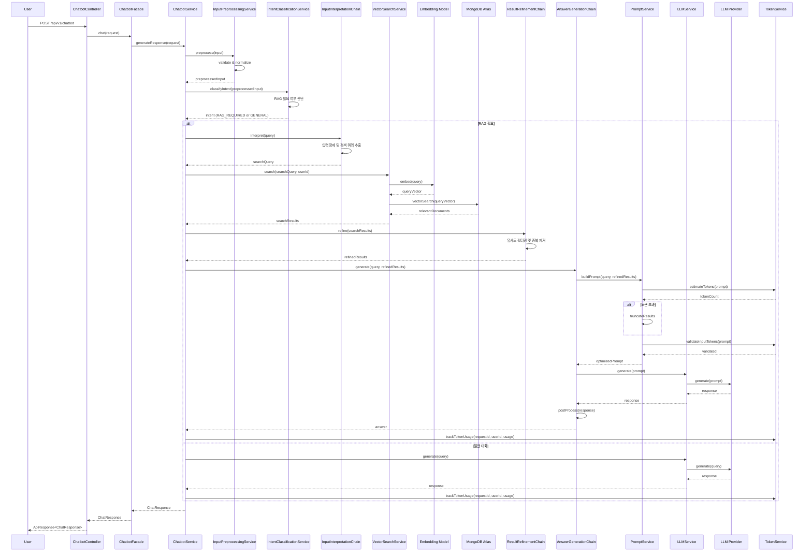
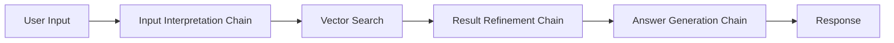
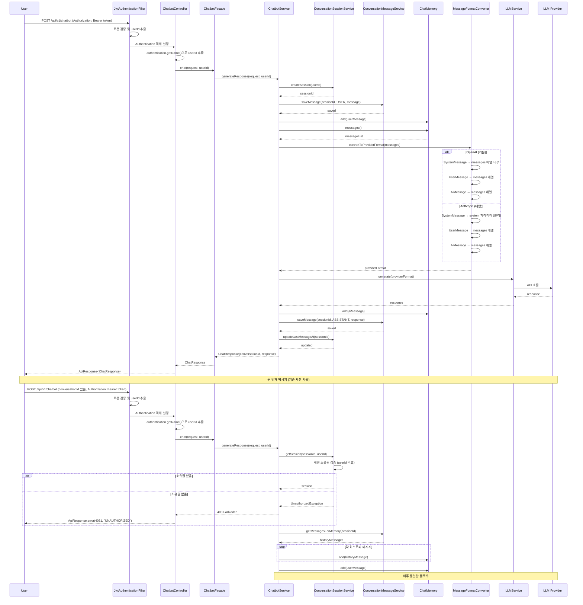
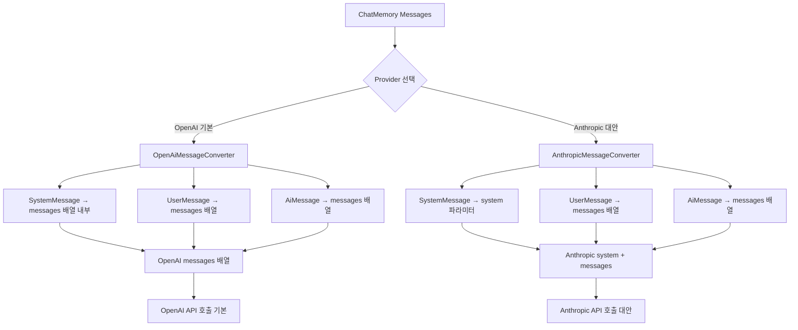

# langchain4j를 활용한 RAG 기반 챗봇 구축 최적화 전략 설계서

**작성 일시**: 2026-01-16  
**대상 모듈**: `api/chatbot`  
**목적**: langchain4j와 MongoDB Atlas Vector Search를 활용한 RAG 기반 챗봇 시스템 설계

## 목차

1. [개요](#개요)
2. [설계 원칙](#설계-원칙)
3. [현재 프로젝트 분석](#현재-프로젝트-분석)
4. [아키텍처 설계](#아키텍처-설계)
5. [상세 설계](#상세-설계)
   - [langchain4j 통합 설계](#langchain4j-통합-설계)
   - [MongoDB Atlas Vector Search 설계](#mongodb-atlas-vector-search-설계)
   - [유저 입력 전처리 설계](#유저-입력-전처리-설계)
   - [토큰 제어 설계](#토큰-제어-설계)
   - [프롬프트 체인 구축 설계](#프롬프트-체인-구축-설계)
   - [멀티턴 대화 히스토리 관리 설계](#멀티턴-대화-히스토리-관리-설계)
   - [비용 통제 전략 설계](#비용-통제-전략-설계)
   - [AI API Provider 비교 분석](#ai-api-provider-비교-분석)
   - [Chatbot API 엔드포인트 설계](#chatbot-api-엔드포인트-설계)
6. [JWT 토큰 기반 인증 통합 설계](#jwt-토큰-기반-인증-통합-설계)
7. [구현 가이드](#구현-가이드)
8. [검증 기준](#검증-기준)
9. [참고 자료](#참고-자료)

---

## 개요

이 설계서는 langchain4j 오픈소스를 활용하여 MongoDB Atlas Vector Search 기반의 RAG(Retrieval-Augmented Generation) 챗봇 시스템을 구축하는 최적화 전략을 제시합니다.

### 배경

현재 프로젝트는 CQRS 패턴을 적용하여 Command Side(Aurora MySQL)와 Query Side(MongoDB Atlas)를 분리하고 있으며, MongoDB Atlas에는 다음과 같은 컬렉션이 저장되어 있습니다:

- **ContestDocument**: 개발자 대회 정보
- **NewsArticleDocument**: IT 테크 뉴스 기사
- **BookmarkDocument**: 사용자 북마크 항목

이러한 도큐먼트들을 임베딩하여 벡터 검색 기반의 지식 검색 챗봇을 구축함으로써, 사용자가 자연어로 대회 정보, 뉴스 기사, 자신의 북마크를 검색하고 질문할 수 있도록 합니다. 본 설계서는 OpenAI GPT-4o-mini를 기본 LLM Provider로 선택하고, 동일 Provider인 OpenAI text-embedding-3-small을 Embedding Model로 사용하여, 비용 최적화($0.02 per 1M tokens), 빠른 응답 속도, 그리고 LLM과 Embedding Model 간의 완벽한 통합성을 제공합니다.

### 설계 범위

**포함 사항**:
- langchain4j 오픈소스 통합
- MongoDB Atlas Vector Search 설정 및 최적화
- 유저 입력 전처리 및 의도 분류
- 토큰 사용량 제어 및 최적화
- 프롬프트 체인 구축
- 비용 통제 전략
- AI API Provider 비교 및 선택
- RESTful API 엔드포인트 설계

**포함 사항 (추가)**:
- 멀티턴 대화 히스토리 관리 (세션 관리, 메시지 저장, ChatMemory 통합)

**제외 사항**:
- 실시간 스트리밍 응답 (향후 확장 가능)
- 복잡한 에이전트 시스템 (단순 RAG만 구현)

---

## 설계 원칙

### 1. 클린코드 원칙

1. **단일 책임 원칙 (SRP)**
   - 각 컴포넌트는 하나의 책임만 담당
   - 입력 전처리, 벡터 검색, LLM 호출을 명확히 분리

2. **의존성 역전 원칙 (DIP)**
   - 인터페이스 기반 설계
   - langchain4j의 추상화 레이어 활용

3. **개방-폐쇄 원칙 (OCP)**
   - 새로운 LLM Provider 추가 시 기존 코드 수정 없이 확장 가능
   - langchain4j의 Provider 추상화 활용

### 2. 최소 구현 원칙

1. **현재 필요한 기능만 구현**
   - 기본 RAG 기능만 구현
   - 복잡한 에이전트 시스템은 제외

2. **단순하고 명확한 구조**
   - 불필요한 추상화 레이어 지양
   - 직접적이고 이해하기 쉬운 코드

3. **단계적 확장 가능한 구조**
   - 향후 기능 추가 시 동일한 패턴 적용 가능

### 3. 운영 환경 고려

1. **비용 통제**
   - 토큰 사용량 추적 및 제한
   - 캐싱 전략으로 중복 호출 방지

2. **성능 최적화**
   - 검색 결과 수 제한
   - 프롬프트 최적화

3. **에러 처리**
   - 각 단계별 에러 핸들링
   - 사용자 친화적 에러 메시지

---

## 현재 프로젝트 분석

### 프로젝트 구조

- **프로젝트 타입**: Spring Boot 4.0.1 기반 멀티모듈 프로젝트
- **Java 버전**: Java 21
- **아키텍처 패턴**: CQRS 패턴 (Command Side: Aurora MySQL, Query Side: MongoDB Atlas)
- **동기화 메커니즘**: Kafka 기반 이벤트 동기화

### API 모듈 구조

현재 프로젝트의 API 모듈 구조:
- `api/auth`: 인증 및 사용자 관리
- `api/contest`: 대회 정보 조회 (MongoDB Atlas)
- `api/news`: 뉴스 정보 조회 (MongoDB Atlas)
- `api/bookmark`: 사용자 북마크 관리
- `api/gateway`: API 게이트웨이

### MongoDB Atlas 컬렉션 구조

#### ContestDocument (`contests`)
```java
{
  _id: ObjectId,
  sourceId: ObjectId,
  title: String,
  description: String,
  startDate: LocalDateTime,
  endDate: LocalDateTime,
  status: String,  // "UPCOMING", "ONGOING", "ENDED"
  url: String,
  metadata: {
    sourceName: String,
    tags: List<String>
  }
}
```

**임베딩 대상 필드**: `title + description + metadata.tags`

#### NewsArticleDocument (`news_articles`)
```java
{
  _id: ObjectId,
  sourceId: ObjectId,
  title: String,
  content: String,  // 전체 텍스트 (길이 제한 필요)
  summary: String,
  publishedAt: LocalDateTime,
  url: String,
  metadata: {
    sourceName: String,
    tags: List<String>
  }
}
```

**임베딩 대상 필드**: `title + summary + content` (content는 최대 2000자로 제한)

#### BookmarkDocument (`bookmarks`)
```java
{
  _id: ObjectId,
  bookmarkTsid: String,  // Aurora MySQL PK
  userId: String,
  itemType: String,  // "CONTEST", "NEWS_ARTICLE"
  itemId: ObjectId,
  itemTitle: String,
  itemSummary: String,
  tag: String,
  memo: String
}
```

**임베딩 대상 필드**: `itemTitle + itemSummary + tag + memo`  
**주의**: 사용자별 필터링 필요 (`userId` 필드 활용)

### 기존 API 패턴

현재 프로젝트의 API 패턴:
- **경로**: `/api/v1/{resource}`
- **응답 형식**: `ApiResponse<T>` 래퍼 사용
- **에러 처리**: `@ControllerAdvice` 기반 전역 예외 처리
- **인증**: JWT 토큰 기반 (Spring Security)
- **DTO**: Record 타입 사용

---

## 아키텍처 설계

### 전체 시스템 아키텍처

```mermaid
graph TB
    subgraph "Client"
        U[User]
    end
    
    subgraph "API Layer"
        C[ChatbotController]
        F[ChatbotFacade]
    end
    
    subgraph "Service Layer"
        CS[ChatbotService]
        IPS[InputPreprocessingService]
        ICS[IntentClassificationService]
        VSS[VectorSearchService]
        PS[PromptService]
        LS[LLMService]
        TS[TokenService]
        CS2[CacheService]
    end
    
    subgraph "Chain Layer"
        IC[InputInterpretationChain]
        RC[ResultRefinementChain]
        AC[AnswerGenerationChain]
    end
    
    subgraph "Data Layer"
        MDB[(MongoDB Atlas<br/>Vector Search)]
        RD[(Redis<br/>Cache)]
    end
    
    subgraph "External"
        LLM[LLM Provider<br/>OpenAI (기본)/Anthropic/Google]
        EMB[Embedding Model<br/>OpenAI (기본)/Voyage AI/Cohere]
    end
    
    U -->|POST /api/v1/chatbot| C
    C --> F
    F --> CS
    CS --> IPS
    IPS --> ICS
    ICS -->|RAG 필요| IC
    ICS -->|일반 대화| LS
    IC --> VSS
    VSS --> MDB
    VSS --> RD
    VSS --> EMB
    IC --> RC
    RC --> AC
    AC --> LS
    LS --> LLM
    CS --> TS
    CS --> CS2
    CS2 --> RD
```

### 데이터 흐름도



### 모듈 구조

```
api/chatbot/
├── src/main/java/com/tech/n/ai/api/chatbot/
│   ├── ChatbotApplication.java
│   ├── config/
│   │   ├── LangChain4jConfig.java
│   │   ├── MongoVectorStoreConfig.java
│   │   ├── ChatbotConfig.java
│   │   └── ServerConfig.java
│   ├── controller/
│   │   └── ChatbotController.java
│   ├── facade/
│   │   └── ChatbotFacade.java
│   ├── service/
│   │   ├── ChatbotService.java
│   │   ├── InputPreprocessingService.java
│   │   ├── IntentClassificationService.java
│   │   ├── VectorSearchService.java
│   │   ├── PromptService.java
│   │   ├── LLMService.java
│   │   ├── TokenService.java
│   │   └── CacheService.java
│   ├── chain/
│   │   ├── InputInterpretationChain.java
│   │   ├── ResultRefinementChain.java
│   │   └── AnswerGenerationChain.java
│   ├── dto/
│   │   ├── request/
│   │   │   ├── ChatRequest.java
│   │   │   └── ChatOptions.java
│   │   └── response/
│   │       ├── ChatResponse.java
│   │       ├── Source.java
│   │       └── TokenUsage.java
│   └── common/
│       └── exception/
│           ├── ChatbotExceptionHandler.java
│           ├── InvalidInputException.java
│           └── TokenLimitExceededException.java
└── src/main/resources/
    └── application-chatbot-api.yml
```

---

## 상세 설계

### langchain4j 통합 설계

#### 의존성 설정

**`api/chatbot/build.gradle`**:
```gradle
dependencies {
    // langchain4j Core
    implementation 'dev.langchain4j:langchain4j:0.35.0'
    
    // langchain4j MongoDB Atlas
    implementation 'dev.langchain4j:langchain4j-mongodb-atlas:0.35.0'
    
    // langchain4j OpenAI (LLM Provider - 기본 선택)
    implementation 'dev.langchain4j:langchain4j-open-ai:0.35.0'
    
    // langchain4j Anthropic (대안 LLM Provider)
    implementation 'dev.langchain4j:langchain4j-anthropic:0.35.0'
    
    // langchain4j Google Gemini (대안 LLM Provider)
    implementation 'dev.langchain4j:langchain4j-google-ai-gemini:0.35.0'
    
    // langchain4j OpenAI Embeddings (기본 선택 - LLM Provider와 동일)
    implementation 'dev.langchain4j:langchain4j-open-ai:0.35.0'
    
    // langchain4j Voyage AI Embeddings (대안)
    implementation 'dev.langchain4j:langchain4j-voyage-ai:0.35.0'
    
    // langchain4j Cohere Embeddings (대안)
    implementation 'dev.langchain4j:langchain4j-cohere:0.35.0'
    
    // 프로젝트 모듈 의존성
    implementation project(':common-core')
    implementation project(':common-security')
    implementation project(':domain-mongodb')
    
    // Spring Boot
    implementation 'org.springframework.boot:spring-boot-starter-web'
    implementation 'org.springframework.boot:spring-boot-starter-validation'
    
    compileOnly 'org.projectlombok:lombok'
    annotationProcessor 'org.projectlombok:lombok'
}
```

**참고**: langchain4j 버전은 공식 문서(https://docs.langchain4j.dev/)에서 최신 안정 버전 확인 필요.

#### LLM Provider 설정

**`application-chatbot-api.yml`**:
```yaml
langchain4j:
  open-ai:
    chat-model:
      api-key: ${OPENAI_API_KEY}
      model-name: gpt-4o-mini  # 기본 모델 (비용 최적화)
      temperature: 0.7
      max-tokens: 2000
      timeout: 60s
  
  # Embedding Model은 OpenAI 사용 (LLM Provider와 동일, 통합성 최적화)
  open-ai:
    embedding-model:
      api-key: ${OPENAI_API_KEY}  # LLM과 동일한 API Key 사용 가능
      model-name: text-embedding-3-small  # 기본 모델 (비용 최적화: $0.02 per 1M tokens)
      dimensions: 1536  # 기본 차원 (필요시 dimensions 파라미터로 조정 가능)
      timeout: 30s
  
  # 대안 Embedding Model 설정 (주석 처리)
  # voyage-ai:
  #   embedding-model:
  #     api-key: ${VOYAGE_AI_API_KEY}
  #     model-name: voyage-3-large
  #     dimensions: 1024
  #     timeout: 30s
  
  # 대안 LLM Provider 설정 (주석 처리)
  # anthropic:
  #   chat-model:
  #     api-key: ${ANTHROPIC_API_KEY}
  #     model-name: claude-3-5-sonnet-20241022
  #     temperature: 0.7
  #     max-tokens: 2000
  #     timeout: 60s

chatbot:
  # RAG 설정 (OpenAI GPT-4o-mini 기준: 128K 컨텍스트)
  rag:
    max-search-results: 5  # 검색 결과 최대 개수
    min-similarity-score: 0.7  # 최소 유사도 점수
    max-context-tokens: 3000  # 컨텍스트 최대 토큰 수
  
  # 입력 전처리 설정
  input:
    max-length: 500  # 최대 입력 길이
    min-length: 1  # 최소 입력 길이
  
  # 토큰 제어 설정 (OpenAI GPT-4o-mini 기준: 128K 컨텍스트)
  token:
    max-input-tokens: 4000  # 최대 입력 토큰
    max-output-tokens: 2000  # 최대 출력 토큰
    warning-threshold: 0.8  # 경고 임계값 (80%)
  
  # 캐싱 설정
  cache:
    enabled: true
    ttl-hours: 1  # TTL (시간 단위, 기본값: 1시간 = 3600초)
    max-size: 1000  # 최대 캐시 크기

  # 세션 생명주기 설정
  session:
    inactive-threshold-minutes: 30  # 비활성화 임계값 (마지막 메시지 후 N분 경과 시 비활성)
    expiration-days: 90  # 만료 기간 (마지막 메시지 후 N일 경과 시 만료)
    batch-enabled: true  # 배치 작업 활성화 여부 (세션 만료 처리용)

  # ChatMemory 설정 (토큰 수 기준 메시지 유지 방식 - 기본 전략)
  chat-memory:
    max-tokens: 2000  # 최대 토큰 수 (OpenAI GPT-4o-mini 컨텍스트 128K 고려)
    strategy: token-window  # 기본 전략: token-window (토큰 수 기준), 대안: message-window (메시지 개수 기준)
```

#### langchain4j Bean 설정

**`LangChain4jConfig.java`**:
```java
package com.tech.n.ai.api.chatbot.config;

import dev.langchain4j.model.chat.ChatLanguageModel;
import dev.langchain4j.model.embedding.EmbeddingModel;
import dev.langchain4j.model.openai.OpenAiChatModel;
import dev.langchain4j.model.openai.OpenAiEmbeddingModel;
import dev.langchain4j.model.openai.OpenAiTokenCountEstimator;
import dev.langchain4j.model.tokenizer.TokenCountEstimator;
import dev.langchain4j.store.embedding.EmbeddingStore;
import dev.langchain4j.store.embedding.mongodb.atlas.MongoDbAtlasEmbeddingStore;
import lombok.extern.slf4j.Slf4j;
import org.springframework.beans.factory.annotation.Value;
import org.springframework.context.annotation.Bean;
import org.springframework.context.annotation.Configuration;
import org.springframework.context.annotation.Primary;

@Slf4j
@Configuration
public class LangChain4jConfig {
    
    @Value("${langchain4j.open-ai.chat-model.api-key}")
    private String openAiApiKey;
    
    @Value("${langchain4j.open-ai.chat-model.model-name:gpt-4o-mini}")
    private String chatModelName;
    
    @Value("${langchain4j.open-ai.embedding-model.api-key}")
    private String embeddingApiKey;
    
    @Value("${langchain4j.open-ai.embedding-model.model-name:text-embedding-3-small}")
    private String embeddingModelName;
    
    @Value("${langchain4j.open-ai.embedding-model.dimensions:1536}")
    private Integer dimensions;
    
    @Value("${spring.data.mongodb.uri}")
    private String mongoUri;
    
    @Value("${spring.data.mongodb.database}")
    private String databaseName;
    
    /**
     * LLM Chat Model Bean (OpenAI GPT-4o-mini - 기본, 비용 최적화)
     */
    @Bean
    @Primary
    public ChatLanguageModel chatLanguageModel() {
        return OpenAiChatModel.builder()
            .apiKey(openAiApiKey)
            .modelName(chatModelName)
            .temperature(0.7)
            .maxTokens(2000)
            .timeout(java.time.Duration.ofSeconds(60))
            .logRequests(true)
            .logResponses(true)
            .build();
    }
    
    /**
     * Embedding Model Bean (OpenAI text-embedding-3-small - LLM Provider와 동일, 통합성 최적화)
     * 비용: $0.02 per 1M tokens, 기본 차원: 1536
     * 참고: OpenAI Embedding Model은 document/query 구분 없이 동일한 모델 사용
     */
    @Bean
    @Primary
    public EmbeddingModel embeddingModel() {
        return OpenAiEmbeddingModel.builder()
            .apiKey(embeddingApiKey)  // LLM과 동일한 API Key 사용 가능
            .modelName(embeddingModelName)
            .dimensions(dimensions)  // 기본값: 1536 (필요시 dimensions 파라미터로 조정 가능)
            .timeout(java.time.Duration.ofSeconds(30))
            .logRequests(true)
            .logResponses(true)
            .build();
    }
    
    /**
     * MongoDB Atlas Vector Store Bean
     */
    @Bean
    public EmbeddingStore<dev.langchain4j.data.segment.TextSegment> embeddingStore() {
        return MongoDbAtlasEmbeddingStore.builder()
            .connectionString(mongoUri)
            .databaseName(databaseName)
            .indexName("vector_index")
            .build();
    }
    
    /**
     * TokenCountEstimator Bean (TokenWindowChatMemory용)
     * OpenAI 모델의 토큰 수를 추정합니다.
     * 
     * 참고: OpenAiChatModel은 내부적으로 TokenCountEstimator를 포함하지만,
     * TokenWindowChatMemory는 별도의 TokenCountEstimator Bean이 필요합니다.
     */
    @Bean
    public TokenCountEstimator tokenCountEstimator() {
        // OpenAI 모델용 토큰 카운터 (GPT-4o-mini 기준)
        // OpenAiChatModel과 동일한 모델명을 사용하여 일관성 유지
        return new OpenAiTokenCountEstimator(chatModelName);
    }
}
```

**Redis 캐싱용 Bean 설정**:

챗봇 캐싱 전략은 프로젝트의 기존 Redis 패턴과 일관성을 유지하기 위해 별도의 `RedisTemplate<String, Object>` Bean이 필요합니다. 이는 `common/core` 모듈의 `RedisConfig`에 추가하거나, 챗봇 모듈에 별도로 추가할 수 있습니다.

**방법 1: common/core 모듈의 RedisConfig 확장 (권장)**:

`common/core/src/main/java/com/tech/n/ai/common/core/config/RedisConfig.java`에 추가:

```java
package com.tech.n.ai.common.core.config;

import org.springframework.context.annotation.Bean;
import org.springframework.context.annotation.Configuration;
import org.springframework.data.redis.connection.RedisConnectionFactory;
import org.springframework.data.redis.core.RedisTemplate;
import org.springframework.data.redis.serializer.GenericJackson2JsonRedisSerializer;
import org.springframework.data.redis.serializer.StringRedisSerializer;

/**
 * Redis 설정 (챗봇 캐싱용 확장)
 */
@Configuration
public class RedisConfig {
    
    // 기존 RedisTemplate<String, String> Bean 유지...
    
    /**
     * 복잡한 객체 저장용 RedisTemplate (챗봇 캐싱 등)
     * 
     * 프로젝트의 Redis 최적화 베스트 프랙티스에 따라 JSON 직렬화 사용
     * 참고: docs/step7/redis-optimization-best-practices.md
     */
    @Bean
    public RedisTemplate<String, Object> redisTemplateForObjects(RedisConnectionFactory connectionFactory) {
        RedisTemplate<String, Object> template = new RedisTemplate<>();
        template.setConnectionFactory(connectionFactory);
        
        // Key는 String 직렬화 (프로젝트 표준)
        template.setKeySerializer(new StringRedisSerializer());
        template.setHashKeySerializer(new StringRedisSerializer());
        
        // Value는 JSON 직렬화 (복잡한 객체 저장용)
        GenericJackson2JsonRedisSerializer jsonSerializer = new GenericJackson2JsonRedisSerializer();
        template.setValueSerializer(jsonSerializer);
        template.setHashValueSerializer(jsonSerializer);
        
        // 기본 직렬화 비활성화 (명시적 직렬화만 사용)
        template.setEnableDefaultSerializer(false);
        
        // 트랜잭션 지원 비활성화 (캐싱 사용 사례에서 불필요)
        template.setEnableTransactionSupport(false);
        
        // 초기화
        template.afterPropertiesSet();
        
        return template;
    }
}
```

**방법 2: 챗봇 모듈에 별도 Config 추가**:

`api/chatbot/src/main/java/com/tech/n/ai/api/chatbot/config/ChatbotRedisConfig.java` 생성:

```java
package com.tech.n.ai.api.chatbot.config;

import org.springframework.context.annotation.Bean;
import org.springframework.context.annotation.Configuration;
import org.springframework.data.redis.connection.RedisConnectionFactory;
import org.springframework.data.redis.core.RedisTemplate;
import org.springframework.data.redis.serializer.GenericJackson2JsonRedisSerializer;
import org.springframework.data.redis.serializer.StringRedisSerializer;

/**
 * 챗봇 모듈용 Redis 설정
 * 
 * ChatResponse 객체 캐싱을 위한 RedisTemplate<String, Object> Bean 제공
 * 프로젝트의 Redis 최적화 베스트 프랙티스 준수
 */
@Configuration
public class ChatbotRedisConfig {
    
    /**
     * 복잡한 객체 저장용 RedisTemplate (챗봇 캐싱용)
     * 
     * 프로젝트의 Redis 최적화 베스트 프랙티스에 따라 JSON 직렬화 사용
     * 참고: docs/step7/redis-optimization-best-practices.md
     */
    @Bean
    public RedisTemplate<String, Object> redisTemplateForObjects(RedisConnectionFactory connectionFactory) {
        RedisTemplate<String, Object> template = new RedisTemplate<>();
        template.setConnectionFactory(connectionFactory);
        
        // Key는 String 직렬화 (프로젝트 표준)
        template.setKeySerializer(new StringRedisSerializer());
        template.setHashKeySerializer(new StringRedisSerializer());
        
        // Value는 JSON 직렬화 (복잡한 객체 저장용)
        GenericJackson2JsonRedisSerializer jsonSerializer = new GenericJackson2JsonRedisSerializer();
        template.setValueSerializer(jsonSerializer);
        template.setHashValueSerializer(jsonSerializer);
        
        // 기본 직렬화 비활성화 (명시적 직렬화만 사용)
        template.setEnableDefaultSerializer(false);
        
        // 트랜잭션 지원 비활성화 (캐싱 사용 사례에서 불필요)
        template.setEnableTransactionSupport(false);
        
        // 초기화
        template.afterPropertiesSet();
        
        return template;
    }
}
```

### MongoDB Atlas Vector Search 설계

#### 벡터 필드 스키마 설계

각 컬렉션에 벡터 필드를 추가합니다:

**ContestDocument 벡터 필드 추가**:
```java
@Document(collection = "contests")
@Getter
@Setter
public class ContestDocument {
    // 기존 필드...
    
    @Field("embedding_text")
    private String embeddingText;  // 임베딩 대상 텍스트
    
    @Field("embedding_vector")
    private List<Float> embeddingVector;  // 벡터 필드 (1536차원 - OpenAI text-embedding-3-small 기본값)
}
```

**임베딩 텍스트 생성 로직**:
```java
public String generateEmbeddingText(ContestDocument document) {
    StringBuilder sb = new StringBuilder();
    sb.append(document.getTitle()).append(" ");
    sb.append(document.getDescription()).append(" ");
    if (document.getMetadata() != null && document.getMetadata().getTags() != null) {
        sb.append(String.join(" ", document.getMetadata().getTags()));
    }
    return sb.toString().trim();
}
```

**NewsArticleDocument 벡터 필드 추가**:
```java
@Document(collection = "news_articles")
@Getter
@Setter
public class NewsArticleDocument {
    // 기존 필드...
    
    @Field("embedding_text")
    private String embeddingText;
    
    @Field("embedding_vector")
    private List<Float> embeddingVector;
}

// 임베딩 텍스트 생성 (content는 최대 2000자로 제한)
public String generateEmbeddingText(NewsArticleDocument document) {
    StringBuilder sb = new StringBuilder();
    sb.append(document.getTitle()).append(" ");
    sb.append(document.getSummary()).append(" ");
    String content = document.getContent();
    if (content != null && content.length() > 2000) {
        content = content.substring(0, 2000) + "...";
    }
    sb.append(content != null ? content : "");
    return sb.toString().trim();
}
```

**BookmarkDocument 벡터 필드 추가**:
```java
@Document(collection = "bookmarks")
@Getter
@Setter
public class BookmarkDocument {
    // 기존 필드...
    
    @Field("embedding_text")
    private String embeddingText;
    
    @Field("embedding_vector")
    private List<Float> embeddingVector;
}

// 임베딩 텍스트 생성
public String generateEmbeddingText(BookmarkDocument document) {
    StringBuilder sb = new StringBuilder();
    sb.append(document.getItemTitle() != null ? document.getItemTitle() : "").append(" ");
    sb.append(document.getItemSummary() != null ? document.getItemSummary() : "").append(" ");
    sb.append(document.getTag() != null ? document.getTag() : "").append(" ");
    sb.append(document.getMemo() != null ? document.getMemo() : "");
    return sb.toString().trim();
}
```

#### Vector Index 설정

MongoDB Atlas에서 Vector Search Index를 생성합니다:

**ContestDocument Vector Index**:
```javascript
{
  "fields": [
    {
      "type": "vector",
      "path": "embedding_vector",
      "numDimensions": 1536,  // OpenAI text-embedding-3-small 기본 차원
      "similarity": "cosine"
    },
    {
      "type": "filter",
      "path": "status"
    }
  ]
}
```

**NewsArticleDocument Vector Index**:
```javascript
{
  "fields": [
    {
      "type": "vector",
      "path": "embedding_vector",
      "numDimensions": 1536,  // OpenAI text-embedding-3-small 기본 차원
      "similarity": "cosine"
    },
    {
      "type": "filter",
      "path": "publishedAt"
    }
  ]
}
```

**BookmarkDocument Vector Index**:
```javascript
{
  "fields": [
    {
      "type": "vector",
      "path": "embedding_vector",
      "numDimensions": 1536,  // OpenAI text-embedding-3-small 기본 차원
      "similarity": "cosine"
    },
    {
      "type": "filter",
      "path": "userId"
    }
  ]
}
```

**인덱스 파라미터 설명**:
- `numDimensions`: 1536 (OpenAI text-embedding-3-small 기본 차원, dimensions 파라미터로 조정 가능)
- `similarity`: `cosine` (코사인 유사도, 텍스트 검색에 적합)
- `filter`: 메타데이터 필터링을 위한 필드

**참고**: OpenAI text-embedding-3-small은 기본적으로 1536 dimensions를 사용하며, `dimensions` 파라미터를 통해 차원을 축소할 수 있습니다. 
차원 축소 시 성능 손실은 최소화되며, 저장 공간과 검색 속도를 개선할 수 있습니다.

#### 검색 쿼리 설계

**VectorSearchService.java** (의사코드):
```java
package com.tech.n.ai.api.chatbot.service;

import dev.langchain4j.model.embedding.EmbeddingModel;
import lombok.RequiredArgsConstructor;
import org.springframework.beans.factory.annotation.Qualifier;
import org.springframework.stereotype.Service;

@Service
@RequiredArgsConstructor
public class VectorSearchService {
    
    private final EmbeddingModel embeddingModel;  // OpenAI text-embedding-3-small (document/query 구분 없음)
    
    private final ContestRepository contestRepository;
    private final NewsArticleRepository newsArticleRepository;
    private final BookmarkRepository bookmarkRepository;
    
    /**
     * 벡터 검색 수행
     */
    /**
     * 벡터 검색 수행
     * 
     * @param query 검색 쿼리
     * @param userId JWT에서 추출한 사용자 ID (북마크 검색 필터링용)
     * @param options 검색 옵션
     * @return 검색 결과 목록
     */
    public List<SearchResult> search(String query, Long userId, SearchOptions options) {
        // 1. 쿼리 임베딩 생성 (OpenAI text-embedding-3-small은 document/query 구분 없음)
        float[] queryVector = embeddingModel.embed(query).contentAsFloatArray();
        
        // 2. 컬렉션별 검색
        List<SearchResult> results = new ArrayList<>();
        
        if (options.includeContests()) {
            results.addAll(searchContests(queryVector, options));
        }
        if (options.includeNews()) {
            results.addAll(searchNews(queryVector, options));
        }
        if (options.includeBookmarks() && userId != null) {
            results.addAll(searchBookmarks(queryVector, userId, options));
        }
        
        // 3. 유사도 점수로 정렬 및 필터링
        return results.stream()
            .filter(r -> r.getScore() >= options.getMinSimilarityScore())
            .sorted(Comparator.comparing(SearchResult::getScore).reversed())
            .limit(options.getMaxResults())
            .collect(Collectors.toList());
    }
    
    private List<SearchResult> searchContests(float[] queryVector, SearchOptions options) {
        // MongoDB Atlas Vector Search 쿼리
        // $vectorSearch aggregation pipeline 사용
        // 유사도 점수 계산 및 정렬
    }
    
    private List<SearchResult> searchNews(float[] queryVector, SearchOptions options) {
        // 동일한 방식으로 뉴스 검색
    }
    
    private List<SearchResult> searchBookmarks(float[] queryVector, String userId, SearchOptions options) {
        // userId 필터링 포함 벡터 검색
    }
}
```

**MongoDB Atlas Vector Search Aggregation 예제**:
```javascript
[
  {
    $vectorSearch: {
      index: "vector_index",
      path: "embedding_vector",
      queryVector: [/* 1536차원 벡터 */],
      numCandidates: 100,
      limit: 5,
      filter: {
        status: { $in: ["UPCOMING", "ONGOING"] }
      }
    }
  },
  {
    $project: {
      _id: 1,
      title: 1,
      description: 1,
      score: { $meta: "vectorSearchScore" }
    }
  },
  {
    $match: {
      score: { $gte: 0.7 }
    }
  }
]
```

#### 성능 최적화 전략

1. **검색 결과 수 제한**
   - 기본값: 5개
   - 최대값: 10개
   - 토큰 사용량과 성능 균형

2. **유사도 임계값**
   - 기본값: 0.7
   - 낮은 점수 결과 제외로 품질 향상

3. **인덱스 최적화**
   - HNSW 인덱스 사용 (MongoDB Atlas 기본)
   - `numCandidates` 파라미터 조정 (기본: 100)

4. **캐싱 전략**
   - 동일 쿼리 캐싱 (임베딩 유사도 기반)
   - 검색 결과 캐싱 (TTL: 1시간)

### 유저 입력 전처리 설계

#### 전처리 파이프라인

**InputPreprocessingService.java**:
```java
@Service
@Slf4j
public class InputPreprocessingService {
    
    @Value("${chatbot.input.max-length:500}")
    private int maxLength;
    
    @Value("${chatbot.input.min-length:1}")
    private int minLength;
    
    /**
     * 입력 전처리
     */
    public PreprocessedInput preprocess(String rawInput) {
        // 1. Null 및 빈 문자열 검증
        if (rawInput == null || rawInput.isBlank()) {
            throw new InvalidInputException("입력이 비어있습니다.");
        }
        
        // 2. 길이 검증
        if (rawInput.length() > maxLength) {
            throw new InvalidInputException(
                String.format("입력 길이는 %d자를 초과할 수 없습니다.", maxLength)
            );
        }
        if (rawInput.length() < minLength) {
            throw new InvalidInputException(
                String.format("입력 길이는 최소 %d자 이상이어야 합니다.", minLength)
            );
        }
        
        // 3. 정규화
        String normalized = normalize(rawInput);
        
        // 4. 특수 문자 필터링 (선택적)
        String cleaned = cleanSpecialCharacters(normalized);
        
        return PreprocessedInput.builder()
            .original(rawInput)
            .normalized(normalized)
            .cleaned(cleaned)
            .length(cleaned.length())
            .build();
    }
    
    /**
     * 입력 정규화
     */
    private String normalize(String input) {
        // 1. 앞뒤 공백 제거
        String trimmed = input.trim();
        
        // 2. 연속 공백을 단일 공백으로 변환
        trimmed = trimmed.replaceAll("\\s+", " ");
        
        // 3. 대소문자 정규화 (선택적, 한국어는 영향 없음)
        // 영어의 경우 첫 글자만 대문자로 변환 가능
        
        return trimmed;
    }
    
    /**
     * 특수 문자 필터링
     */
    private String cleanSpecialCharacters(String input) {
        // 제어 문자 제거 (탭, 개행 등은 공백으로 변환)
        String cleaned = input.replaceAll("[\\x00-\\x1F\\x7F]", " ");
        
        // 연속 공백 다시 정리
        cleaned = cleaned.replaceAll("\\s+", " ");
        
        return cleaned.trim();
    }
}
```

#### 의도 분류 로직

**IntentClassificationService.java**:
```java
@Service
@Slf4j
public class IntentClassificationService {
    
    private static final Set<String> GREETING_KEYWORDS = Set.of(
        "안녕", "안녕하세요", "하이", "hi", "hello", "헬로"
    );
    
    private static final Set<String> RAG_KEYWORDS = Set.of(
        "대회", "contest", "뉴스", "news", "기사", "북마크", "bookmark",
        "검색", "찾아", "알려", "정보", "어떤", "무엇"
    );
    
    /**
     * 의도 분류
     */
    public Intent classifyIntent(String preprocessedInput) {
        String lowerInput = preprocessedInput.toLowerCase();
        
        // 1. 인사말 체크
        if (isGreeting(lowerInput)) {
            return Intent.GENERAL_CONVERSATION;
        }
        
        // 2. RAG 키워드 체크
        if (containsRagKeywords(lowerInput)) {
            return Intent.RAG_REQUIRED;
        }
        
        // 3. 질문 형태 체크 (의문사, 물음표)
        if (isQuestion(lowerInput)) {
            return Intent.RAG_REQUIRED;
        }
        
        // 4. 기본값: 일반 대화
        return Intent.GENERAL_CONVERSATION;
    }
    
    private boolean isGreeting(String input) {
        return GREETING_KEYWORDS.stream()
            .anyMatch(input::contains);
    }
    
    private boolean containsRagKeywords(String input) {
        return RAG_KEYWORDS.stream()
            .anyMatch(input::contains);
    }
    
    private boolean isQuestion(String input) {
        // 의문사 체크
        boolean hasQuestionWords = input.matches(".*(무엇|어떤|어디|언제|누가|왜|어떻게).*");
        
        // 물음표 체크
        boolean hasQuestionMark = input.contains("?") || input.contains("？");
        
        return hasQuestionWords || hasQuestionMark;
    }
}

enum Intent {
    RAG_REQUIRED,           // RAG 필요
    GENERAL_CONVERSATION    // 일반 대화
}
```

### 토큰 제어 설계

#### 토큰 예측 로직

**TokenService.java**:
```java
@Service
@Slf4j
public class TokenService {
    
    @Value("${chatbot.token.max-input-tokens:4000}")
    private int maxInputTokens;
    
    @Value("${chatbot.token.max-output-tokens:2000}")
    private int maxOutputTokens;
    
    @Value("${chatbot.token.warning-threshold:0.8}")
    private double warningThreshold;
    
    /**
     * 토큰 수 예측 (대략적 계산)
     * 실제 토큰 수는 LLM Provider API 호출 시 확인 가능
     */
    public int estimateTokens(String text) {
        // 한국어와 영어 혼합 텍스트의 경우
        // 대략적으로: 1 토큰 ≈ 0.75 단어 (영어 기준)
        // 한국어는 더 많은 토큰 사용 (약 1.5배)
        
        int wordCount = text.split("\\s+").length;
        int koreanCharCount = (int) text.chars()
            .filter(c -> c >= 0xAC00 && c <= 0xD7A3)
            .count();
        
        // 한국어 문자는 약 2 토큰, 영어 단어는 약 1.3 토큰
        int estimatedTokens = (int) (koreanCharCount * 2 + (wordCount - koreanCharCount) * 1.3);
        
        return Math.max(estimatedTokens, text.length() / 4);  // 최소값 보장
    }
    
    /**
     * 프롬프트 토큰 수 검증
     */
    public void validateInputTokens(String prompt) {
        int tokenCount = estimateTokens(prompt);
        
        if (tokenCount > maxInputTokens) {
            throw new TokenLimitExceededException(
                String.format("입력 토큰 수(%d)가 최대 허용 토큰 수(%d)를 초과했습니다.", 
                    tokenCount, maxInputTokens)
            );
        }
        
        if (tokenCount > maxInputTokens * warningThreshold) {
            log.warn("입력 토큰 수가 경고 임계값을 초과했습니다: {}/{}", 
                tokenCount, maxInputTokens);
        }
    }
    
    /**
     * 검색 결과 토큰 제한
     */
    public List<SearchResult> truncateResults(
            List<SearchResult> results, 
            int maxTokens) {
        List<SearchResult> truncated = new ArrayList<>();
        int currentTokens = 0;
        
        for (SearchResult result : results) {
            int resultTokens = estimateTokens(result.getText());
            if (currentTokens + resultTokens > maxTokens) {
                break;
            }
            truncated.add(result);
            currentTokens += resultTokens;
        }
        
        return truncated;
    }
    
    /**
     * 토큰 사용량 추적
     */
    public TokenUsage trackUsage(String requestId, String userId, 
                                 int inputTokens, int outputTokens) {
        TokenUsage usage = TokenUsage.builder()
            .requestId(requestId)
            .userId(userId)
            .inputTokens(inputTokens)
            .outputTokens(outputTokens)
            .totalTokens(inputTokens + outputTokens)
            .timestamp(Instant.now())
            .build();
        
        // 로깅
        log.info("Token usage tracked: requestId={}, userId={}, inputTokens={}, outputTokens={}, totalTokens={}",
            requestId, userId, inputTokens, outputTokens, usage.getTotalTokens());
        
        // TODO: 데이터베이스 저장 (선택적)
        
        return usage;
    }
}
```

#### 검색 결과 토큰 제어

**PromptService.java** (일부):
```java
@Service
public class PromptService {
    
    private final TokenService tokenService;
    
    @Value("${chatbot.rag.max-context-tokens:3000}")
    private int maxContextTokens;
    
    /**
     * 프롬프트 생성 (검색 결과 포함)
     */
    public String buildPrompt(String query, List<SearchResult> searchResults) {
        // 1. 검색 결과 토큰 제한
        List<SearchResult> truncatedResults = tokenService.truncateResults(
            searchResults, 
            maxContextTokens
        );
        
        // 2. 프롬프트 템플릿 구성
        StringBuilder prompt = new StringBuilder();
        prompt.append("다음 문서들을 참고하여 질문에 답변해주세요.\n\n");
        prompt.append("질문: ").append(query).append("\n\n");
        prompt.append("참고 문서:\n");
        
        for (int i = 0; i < truncatedResults.size(); i++) {
            SearchResult result = truncatedResults.get(i);
            prompt.append(String.format("[문서 %d]\n", i + 1));
            prompt.append(result.getText()).append("\n\n");
        }
        
        prompt.append("위 문서들을 바탕으로 질문에 정확하고 간결하게 답변해주세요.");
        
        // 3. 토큰 수 검증
        tokenService.validateInputTokens(prompt.toString());
        
        return prompt.toString();
    }
}
```

### 프롬프트 체인 구축 설계

#### 체인 구조



#### 입력 해석 체인

**InputInterpretationChain.java**:
```java
@Component
@Slf4j
public class InputInterpretationChain {
    
    private final EmbeddingModel embeddingModel;
    
    /**
     * 입력을 검색 쿼리로 변환
     */
    public SearchQuery interpret(String userInput) {
        // 1. 입력 정제
        String cleanedInput = cleanInput(userInput);
        
        // 2. 검색 쿼리 추출
        // - 불필요한 단어 제거 (예: "알려줘", "찾아줘")
        String searchQuery = extractSearchQuery(cleanedInput);
        
        // 3. 컨텍스트 파악
        SearchContext context = analyzeContext(cleanedInput);
        
        return SearchQuery.builder()
            .query(searchQuery)
            .context(context)
            .build();
    }
    
    private String cleanInput(String input) {
        // 불필요한 단어 제거
        return input.replaceAll("(알려줘|찾아줘|검색해줘|보여줘)", "")
            .trim();
    }
    
    private String extractSearchQuery(String input) {
        // 질문 형태에서 핵심 키워드 추출
        // 예: "최근 대회 정보 알려줘" -> "최근 대회 정보"
        return input;
    }
    
    private SearchContext analyzeContext(String input) {
        // 컨텍스트 분석 (대회, 뉴스, 북마크 등)
        SearchContext context = new SearchContext();
        
        if (input.contains("대회") || input.contains("contest")) {
            context.addCollection("contests");
        }
        if (input.contains("뉴스") || input.contains("news") || input.contains("기사")) {
            context.addCollection("news_articles");
        }
        if (input.contains("북마크") || input.contains("bookmark")) {
            context.addCollection("bookmarks");
        }
        
        return context;
    }
}
```

#### 검색 결과 정제 체인

**ResultRefinementChain.java**:
```java
@Component
@Slf4j
public class ResultRefinementChain {
    
    @Value("${chatbot.rag.min-similarity-score:0.7}")
    private double minSimilarityScore;
    
    /**
     * 검색 결과 정제
     */
    public List<RefinedResult> refine(List<SearchResult> rawResults) {
        // 1. 유사도 점수 필터링
        List<SearchResult> filtered = rawResults.stream()
            .filter(r -> r.getScore() >= minSimilarityScore)
            .collect(Collectors.toList());
        
        // 2. 중복 제거 (동일 문서 ID)
        List<SearchResult> deduplicated = removeDuplicates(filtered);
        
        // 3. 관련성 순으로 정렬
        List<SearchResult> sorted = deduplicated.stream()
            .sorted(Comparator.comparing(SearchResult::getScore).reversed())
            .collect(Collectors.toList());
        
        // 4. RefinedResult로 변환
        return sorted.stream()
            .map(this::toRefinedResult)
            .collect(Collectors.toList());
    }
    
    private List<SearchResult> removeDuplicates(List<SearchResult> results) {
        Set<String> seenIds = new HashSet<>();
        return results.stream()
            .filter(r -> seenIds.add(r.getDocumentId()))
            .collect(Collectors.toList());
    }
    
    private RefinedResult toRefinedResult(SearchResult result) {
        return RefinedResult.builder()
            .documentId(result.getDocumentId())
            .text(result.getText())
            .score(result.getScore())
            .metadata(result.getMetadata())
            .build();
    }
}
```

#### 답변 생성 체인

**AnswerGenerationChain.java**:
```java
@Component
@Slf4j
public class AnswerGenerationChain {
    
    private final ChatLanguageModel chatModel;
    private final PromptService promptService;
    
    /**
     * 답변 생성
     */
    public String generate(String query, List<RefinedResult> refinedResults) {
        // 1. 프롬프트 생성
        String prompt = promptService.buildPrompt(query, refinedResults);
        
        // 2. LLM 호출
        String answer = chatModel.generate(prompt);
        
        // 3. 답변 후처리
        return postProcess(answer);
    }
    
    private String postProcess(String answer) {
        // 1. 앞뒤 공백 제거
        String cleaned = answer.trim();
        
        // 2. 불필요한 접두사 제거 (예: "답변:", "응답:")
        cleaned = cleaned.replaceAll("^(답변|응답|Answer|Response):\\s*", "");
        
        return cleaned.trim();
    }
}
```

#### 체인 통합

**ChatbotService.java** (체인 통합):
```java
@Service
@Slf4j
public class ChatbotService {
    
    private final InputInterpretationChain inputChain;
    private final VectorSearchService vectorSearchService;
    private final ResultRefinementChain refinementChain;
    private final AnswerGenerationChain answerChain;
    private final IntentClassificationService intentService;
    private final LLMService llmService;
    
    /**
     * 챗봇 응답 생성
     * 
     * @param request 챗봇 요청
     * @param userId JWT에서 추출한 사용자 ID
     * @return 챗봇 응답
     */
    public ChatResponse generateResponse(ChatRequest request, Long userId) {
        // 1. 의도 분류
        Intent intent = intentService.classifyIntent(request.message());
        
        if (intent == Intent.GENERAL_CONVERSATION) {
            // 일반 대화: RAG 없이 LLM 직접 호출
            String response = llmService.generate(request.message());
            return ChatResponse.builder()
                .response(response)
                .sources(Collections.emptyList())
                .build();
        }
        
        // 2. RAG 파이프라인
        // 2-1. 입력 해석
        SearchQuery searchQuery = inputChain.interpret(request.message());
        
        // 2-2. 벡터 검색 (userId는 JWT에서 추출한 값 사용)
        List<SearchResult> searchResults = vectorSearchService.search(
            searchQuery.getQuery(),
            userId,  // JWT에서 추출한 userId
            request.options()
        );
        
        // 2-3. 결과 정제
        List<RefinedResult> refinedResults = refinementChain.refine(searchResults);
        
        // 2-4. 답변 생성
        String answer = answerChain.generate(request.message(), refinedResults);
        
        // 3. 응답 구성
        return ChatResponse.builder()
            .response(answer)
            .sources(toSources(refinedResults))
            .build();
    }
}
```

### 멀티턴 대화 히스토리 관리 설계

#### 개요

멀티턴 대화 히스토리 관리는 사용자가 여러 번의 대화를 통해 컨텍스트를 유지하면서 챗봇과 상호작용할 수 있도록 하는 핵심 기능입니다. 이 섹션에서는 langchain4j의 ChatMemory를 활용하여 대화 히스토리를 관리하고, OpenAI(기본 Provider)와 Anthropic(대안 Provider) API의 차이점을 고려한 Provider별 메시지 포맷 변환 전략을 제시합니다.

##### 멀티턴 대화의 필요성

1. **컨텍스트 유지**: 사용자가 이전 대화 내용을 참조하여 질문할 수 있음
   - 예: "그 대회는 언제 시작하나요?" (이전 대화에서 언급한 대회에 대한 후속 질문)
2. **자연스러운 대화 흐름**: 단일 턴 대화의 제약을 극복
3. **사용자 경험 향상**: 대화 세션을 통해 연속적인 상호작용 지원

##### Memory vs History 구분

- **History (전체 대화 기록)**: 모든 메시지를 데이터베이스에 저장하는 완전한 기록
  - 목적: 감사, 분석, 복구
  - 저장 위치: `ConversationMessage` 테이블 (Aurora MySQL) 및 `ConversationMessageDocument` 컬렉션 (MongoDB Atlas)
  
- **Memory (LLM 컨텍스트)**: LLM에 전달되는 메시지 집합
  - 목적: LLM이 이전 대화를 이해할 수 있도록 컨텍스트 제공
  - 관리: langchain4j의 `ChatMemory` 인터페이스
  - 제약: 토큰 제한 및 컨텍스트 길이 제한으로 인해 일부 메시지만 포함

##### langchain4j ChatMemory 활용 전략

langchain4j는 `ChatMemory` 인터페이스를 통해 대화 메모리를 관리합니다:

- **ChatMemoryStore**: 영구 저장소 인터페이스 (MongoDB 또는 Aurora MySQL 구현)
- **TokenWindowChatMemory**: 토큰 수 기준으로 메시지 유지 (기본 선택, 권장)
- **MessageWindowChatMemory**: 최근 N개 메시지만 유지 (대안)
- **ChatMemoryProvider**: 사용자별/세션별 ChatMemory 인스턴스 제공

##### Provider별 메시지 포맷 차이점

**OpenAI API**:
- messages 배열 내부에 `system`(또는 `developer`), `user`, `assistant` 역할 모두 포함
- SystemMessage는 `{"role": "system", "content": "..."}` 형태로 messages 배열에 포함
  - **참고 (2025)**: GPT-4o-mini는 "system" 역할 지원, O1 모델 이상은 "developer" 역할 사용 필요
  - 공식 문서: https://platform.openai.com/docs/guides/chat-completions

**Anthropic Claude API**:
- `system` 파라미터가 messages 배열 밖에 별도로 존재 (최상위 레벨)
- messages 배열에는 `user`와 `assistant`만 포함
- SystemMessage는 messages 배열에 포함하지 않고 별도 `system` 파라미터로 전달

#### 대화 세션 관리 설계

##### 대화 세션 엔티티/Document 설계

**Command Side (Aurora MySQL) - ConversationSession 엔티티**:

```java
package com.tech.n.ai.domain.mariadb.entity.chatbot;

import com.tech.n.ai.domain.mariadb.entity.BaseEntity;
import jakarta.persistence.*;
import lombok.Getter;
import lombok.Setter;

/**
 * 대화 세션 엔티티
 */
@Entity
@Table(name = "conversation_sessions", schema = "chatbot")
@Getter
@Setter
public class ConversationSessionEntity extends BaseEntity {
    
    @Id
    @Column(name = "session_id", nullable = false, updatable = false)
    private Long sessionId;  // TSID Primary Key
    
    @Column(name = "user_id", nullable = false)
    private Long userId;
    
    @Column(name = "title", length = 200)
    private String title;  // 선택: 세션 제목
    
    @Column(name = "last_message_at", nullable = false)
    private LocalDateTime lastMessageAt;
    
    @Column(name = "is_active", nullable = false)
    private Boolean isActive;  // 활성 세션 여부
    
    // BaseEntity에서 상속: id (TSID), isDeleted, deletedAt, deletedBy, createdAt, createdBy, updatedAt, updatedBy
}
```

**인덱스 설계**:
- 복합 인덱스: `(user_id, is_active, last_message_at)` - 사용자별 활성 세션 조회 최적화
- 단일 인덱스: `session_id` (Primary Key)

**Query Side (MongoDB Atlas) - ConversationSessionDocument**:

```java
package com.tech.n.ai.domain.mongodb.document;

import lombok.Getter;
import lombok.Setter;
import org.bson.types.ObjectId;
import org.springframework.data.annotation.Id;
import org.springframework.data.mongodb.core.index.Indexed;
import org.springframework.data.mongodb.core.mapping.Document;
import org.springframework.data.mongodb.core.mapping.Field;

import java.time.LocalDateTime;

/**
 * 대화 세션 Document
 */
@Document(collection = "conversation_sessions")
@Getter
@Setter
public class ConversationSessionDocument {
    
    @Id
    private ObjectId id;
    
    @Field("session_id")
    @Indexed(unique = true)
    private String sessionId;  // TSID (String)
    
    @Field("user_id")
    @Indexed
    private String userId;
    
    @Field("title")
    private String title;
    
    @Field("last_message_at")
    @Indexed
    private LocalDateTime lastMessageAt;
    
    @Field("is_active")
    @Indexed
    private Boolean isActive;
    
    @Field("created_at")
    private LocalDateTime createdAt;
    
    @Field("updated_at")
    private LocalDateTime updatedAt;
}
```

**인덱스 설계**:
- 복합 인덱스: `(user_id, is_active, last_message_at)` - ESR 규칙 준수
- TTL 인덱스: `last_message_at` 기준 90일 후 자동 삭제 (비활성 세션)

##### 대화 메시지 히스토리 저장소 설계

**Command Side (Aurora MySQL) - ConversationMessage 엔티티**:

```java
package com.tech.n.ai.domain.mariadb.entity.chatbot;

import jakarta.persistence.*;
import lombok.Getter;
import lombok.Setter;

/**
 * 대화 메시지 엔티티
 */
@Entity
@Table(name = "conversation_messages", schema = "chatbot")
@Getter
@Setter
public class ConversationMessageEntity {
    
    @Id
    @Column(name = "message_id", nullable = false, updatable = false)
    private Long messageId;  // TSID Primary Key
    
    @ManyToOne(fetch = FetchType.LAZY)
    @JoinColumn(name = "session_id", nullable = false)
    private ConversationSessionEntity session;
    
    @Column(name = "session_id", insertable = false, updatable = false, nullable = false)
    private Long sessionId;
    
    @Column(name = "role", length = 20, nullable = false)
    @Enumerated(EnumType.STRING)
    private MessageRole role;  // USER, ASSISTANT, SYSTEM
    
    @Column(name = "content", columnDefinition = "TEXT", nullable = false)
    private String content;
    
    @Column(name = "token_count")
    private Integer tokenCount;  // 선택: 토큰 수 (비용 계산용)
    
    @Column(name = "sequence_number", nullable = false)
    private Integer sequenceNumber;  // 대화 순서 (1부터 시작)
    
    @Column(name = "created_at", nullable = false, precision = 6)
    private LocalDateTime createdAt;
    
    public enum MessageRole {
        USER, ASSISTANT, SYSTEM
    }
}
```

**인덱스 설계**:
- 복합 인덱스: `(session_id, sequence_number)` - 세션별 메시지 순서 조회 최적화
- 단일 인덱스: `message_id` (Primary Key)

**Query Side (MongoDB Atlas) - ConversationMessageDocument**:

```java
package com.tech.n.ai.domain.mongodb.document;

import lombok.Getter;
import lombok.Setter;
import org.bson.types.ObjectId;
import org.springframework.data.annotation.Id;
import org.springframework.data.mongodb.core.index.Indexed;
import org.springframework.data.mongodb.core.mapping.Document;
import org.springframework.data.mongodb.core.mapping.Field;

import java.time.LocalDateTime;

/**
 * 대화 메시지 Document
 */
@Document(collection = "conversation_messages")
@Getter
@Setter
public class ConversationMessageDocument {
    
    @Id
    private ObjectId id;
    
    @Field("message_id")
    @Indexed(unique = true)
    private String messageId;  // TSID (String)
    
    @Field("session_id")
    @Indexed
    private String sessionId;
    
    @Field("role")
    @Indexed
    private String role;  // USER, ASSISTANT, SYSTEM
    
    @Field("content")
    private String content;
    
    @Field("token_count")
    private Integer tokenCount;
    
    @Field("sequence_number")
    @Indexed
    private Integer sequenceNumber;
    
    @Field("created_at")
    @Indexed
    private LocalDateTime createdAt;
}
```

**인덱스 설계**:
- 복합 인덱스: `(session_id, sequence_number)` - ESR 규칙 준수
- TTL 인덱스: `created_at` 기준 1년 후 자동 삭제 (오래된 메시지)

##### 세션 생성 및 관리 전략

**세션 생성**:
- 사용자가 첫 메시지를 보낼 때 자동 생성
- `conversationId`가 없으면 새 세션 생성
- 세션 ID는 TSID로 생성 (UUID 대신 TSID 사용)

**세션 식별**:
- `conversationId` (UUID 또는 TSID)로 세션 식별
- API 요청의 `conversationId` 필드로 기존 세션 사용 또는 새 세션 생성

**세션 활성화**:
- 마지막 메시지 시간 기준으로 활성 세션 판단
- 예: 마지막 메시지 후 30분 이내면 활성 세션
- 활성 세션은 `isActive = true`로 설정
- **메시지 교환 시 자동 재활성화**: 비활성 세션이라도 메시지 교환 시 자동으로 `isActive = true`로 설정

**세션 자동 비활성화**:
- 마지막 메시지 시간 기준으로 비활성 세션 판단
- 설정: `chatbot.session.inactive-threshold-minutes` (기본값: 30분)
- 처리 방식: 
  - **방식 1 (권장)**: 메시지 교환 시 실시간 체크 (비활성 세션 재활성화)
  - **방식 2 (선택)**: 주기적 배치 작업으로 비활성 세션 일괄 처리 (예: 매시간)
- 비활성 세션은 `isActive = false`로 설정

**세션 만료 정책**:
- 비활성 세션은 일정 기간 후 자동 만료
- 설정: `chatbot.session.expiration-days` (기본값: 90일)
- 처리 방식: **배치 작업 필수** (Spring @Scheduled 또는 Spring Batch)
  - 주기: 매일 1회 (예: 새벽 2시)
  - 처리: 마지막 메시지 후 90일 경과한 비활성 세션을 `isActive = false`로 설정
- MongoDB TTL 인덱스: Query Side (MongoDB Atlas)에서 90일 후 자동 삭제 (물리적 삭제)
- Command Side (Aurora MySQL): Soft Delete만 사용, 물리적 삭제는 하지 않음

#### langchain4j ChatMemory 통합 설계

##### ChatMemoryStore 구현

langchain4j의 `ChatMemoryStore` 인터페이스를 구현하여 영구 저장소를 제공합니다:

```java
package com.tech.n.ai.api.chatbot.memory;

import dev.langchain4j.data.message.ChatMessage;
import dev.langchain4j.memory.ChatMemoryStore;
import lombok.RequiredArgsConstructor;
import org.springframework.stereotype.Component;

import java.util.List;
import java.util.Optional;

/**
 * MongoDB 기반 ChatMemoryStore 구현
 */
@Component
@RequiredArgsConstructor
public class MongoDbChatMemoryStore implements ChatMemoryStore {
    
    private final ConversationMessageService messageService;
    
    @Override
    public List<ChatMessage> getMessages(Object memoryId) {
        String sessionId = (String) memoryId;
        return messageService.getMessagesForMemory(sessionId, null)
            .stream()
            .map(this::toChatMessage)
            .collect(Collectors.toList());
    }
    
    @Override
    public void updateMessages(Object memoryId, List<ChatMessage> messages) {
        String sessionId = (String) memoryId;
        // ChatMemory가 관리하는 메시지 목록 업데이트
        // 실제 구현에서는 메시지 저장 로직 호출
    }
    
    @Override
    public void deleteMessages(Object memoryId) {
        String sessionId = (String) memoryId;
        // 세션 메시지 삭제 (Soft Delete)
    }
    
    private ChatMessage toChatMessage(ConversationMessageDocument doc) {
        // Document를 ChatMessage로 변환
        // role에 따라 SystemMessage, UserMessage, AiMessage 생성
    }
}
```

##### ChatMemory 전략 선택

langchain4j는 두 가지 ChatMemory 전략을 제공합니다. 본 설계서는 **토큰 수 기준 메시지 유지 방식(TokenWindowChatMemory)**을 기본 전략으로 선택합니다.

**TokenWindowChatMemory** (기본 선택, 권장):
- 토큰 수 기준으로 메시지 유지
- 설정: `maxTokens` (예: 2000 토큰, OpenAI GPT-4o-mini 컨텍스트 128K 고려)
- 장점: 
  - 토큰 제한 준수 보장 (비용 통제 및 API 제한 준수)
  - Provider별 컨텍스트 길이 제한에 맞춘 정확한 메시지 관리
  - 긴 메시지와 짧은 메시지의 균형 유지
- 단점: TokenCountEstimator 필요

```java
@Bean
public ChatMemory chatMemory(ChatMemoryStore memoryStore, TokenCountEstimator tokenCountEstimator) {
    return TokenWindowChatMemory.builder()
        .maxTokens(2000)  // OpenAI GPT-4o-mini 컨텍스트(128K) 고려하여 설정
        .chatMemoryStore(memoryStore)
        .tokenCountEstimator(tokenCountEstimator)
        .build();
}
```

**MessageWindowChatMemory** (대안):
- 최근 N개 메시지만 유지
- 설정: `maxMessages` (예: 10개)
- 장점: 단순하고 예측 가능, TokenCountEstimator 불필요
- 단점: 토큰 수 예측 어려움 (긴 메시지로 인한 토큰 초과 위험)

```java
@Bean
public ChatMemory chatMemory(ChatMemoryStore memoryStore) {
    return MessageWindowChatMemory.builder()
        .maxMessages(10)
        .chatMemoryStore(memoryStore)
        .build();
}
```

**전략 선택 가이드**:
- **기본 전략 (권장)**: `TokenWindowChatMemory` - 토큰 제어가 중요한 프로덕션 환경에 적합
- **대안 전략**: `MessageWindowChatMemory` - 단순한 구현이 필요한 경우 또는 토큰 제어가 덜 중요한 환경

##### ChatMemoryProvider 구현

사용자별/세션별 ChatMemory 인스턴스를 제공합니다:

```java
package com.tech.n.ai.api.chatbot.memory;

import dev.langchain4j.memory.ChatMemory;
import dev.langchain4j.memory.ChatMemoryProvider;
import dev.langchain4j.memory.ChatMemoryStore;
import dev.langchain4j.memory.chat.TokenWindowChatMemory;
import dev.langchain4j.model.tokenizer.TokenCountEstimator;
import lombok.RequiredArgsConstructor;
import org.springframework.beans.factory.annotation.Value;
import org.springframework.stereotype.Component;

/**
 * 대화별 ChatMemory 제공자
 * 
 * 토큰 수 기준 메시지 유지 방식(TokenWindowChatMemory)을 기본 전략으로 사용합니다.
 * 이는 토큰 제한 준수, 비용 통제, Provider별 컨텍스트 길이 제한 준수를 보장합니다.
 */
@Component
@RequiredArgsConstructor
public class ConversationChatMemoryProvider implements ChatMemoryProvider {
    
    private final ChatMemoryStore memoryStore;
    private final TokenCountEstimator tokenCountEstimator;
    
    @Value("${langchain4j.chat-memory.max-tokens:2000}")
    private Integer maxTokens;
    
    @Override
    public ChatMemory get(Object memoryId) {
        String sessionId = (String) memoryId;
        // 토큰 수 기준 메시지 유지 방식 사용 (기본 전략)
        // OpenAI GPT-4o-mini 컨텍스트(128K)를 고려하여 maxTokens 설정
        return TokenWindowChatMemory.builder()
            .id(sessionId)
            .maxTokens(maxTokens)  // 기본값: 2000 토큰 (설정 파일에서 조정 가능)
            .chatMemoryStore(memoryStore)
            .tokenCountEstimator(tokenCountEstimator)
            .build();
    }
}
```

##### Provider별 메시지 포맷 변환 설계

langchain4j의 `ChatMessage`를 각 Provider API 포맷으로 변환하는 인터페이스와 구현을 제공합니다:

**MessageFormatConverter 인터페이스**:

```java
package com.tech.n.ai.api.chatbot.converter;

import dev.langchain4j.data.message.ChatMessage;
import java.util.List;

/**
 * Provider별 메시지 포맷 변환 인터페이스
 */
public interface MessageFormatConverter {
    
    /**
     * ChatMessage 리스트를 Provider 포맷으로 변환
     * @param messages ChatMessage 리스트
     * @param systemPrompt 시스템 프롬프트 (선택)
     * @return Provider별 요청 객체
     */
    Object convertToProviderFormat(List<ChatMessage> messages, String systemPrompt);
    
    /**
     * Provider 응답을 ChatMessage 리스트로 변환
     * @param providerResponse Provider 응답 객체
     * @return ChatMessage 리스트
     */
    List<ChatMessage> convertFromProviderFormat(Object providerResponse);
}
```

**OpenAiMessageConverter 구현** (기본):

```java
package com.tech.n.ai.api.chatbot.converter;

import dev.langchain4j.data.message.ChatMessage;
import dev.langchain4j.data.message.SystemMessage;
import dev.langchain4j.data.message.UserMessage;
import dev.langchain4j.data.message.AiMessage;
import lombok.RequiredArgsConstructor;
import org.springframework.stereotype.Component;

import java.util.ArrayList;
import java.util.List;
import java.util.Map;

/**
 * OpenAI 메시지 포맷 변환기 (기본 선택)
 * 
 * 참고: OpenAI API 역할 변경사항 (2025)
 * - GPT-4o-mini: "system" 역할 지원 (현재 사용 중)
 * - O1 모델 이상: "developer" 역할 사용 필요 (향후 O1 모델 사용 시 수정 필요)
 * - 공식 문서: https://platform.openai.com/docs/guides/chat-completions
 */
@Component("openAiMessageConverter")
@RequiredArgsConstructor
public class OpenAiMessageConverter implements MessageFormatConverter {
    
    @Value("${langchain4j.open-ai.chat-model.model-name:gpt-4o-mini}")
    private String modelName;
    
    @Override
    public Object convertToProviderFormat(List<ChatMessage> messages, String systemPrompt) {
        List<Map<String, String>> openAiMessages = new ArrayList<>();
        
        // SystemMessage는 messages 배열에 포함
        // 참고: GPT-4o-mini는 "system" 역할 지원, O1 모델 이상은 "developer" 역할 사용 필요
        String systemRole = modelName.startsWith("o1") ? "developer" : "system";
        
        for (ChatMessage message : messages) {
            if (message instanceof SystemMessage) {
                openAiMessages.add(Map.of(
                    "role", systemRole,  // GPT-4o-mini: "system", O1: "developer"
                    "content", ((SystemMessage) message).text()
                ));
            } else if (message instanceof UserMessage) {
                openAiMessages.add(Map.of(
                    "role", "user",
                    "content", ((UserMessage) message).singleText()
                ));
            } else if (message instanceof AiMessage) {
                openAiMessages.add(Map.of(
                    "role", "assistant",
                    "content", ((AiMessage) message).text()
                ));
            }
        }
        
        return openAiMessages;
    }
    
    @Override
    public List<ChatMessage> convertFromProviderFormat(Object providerResponse) {
        // OpenAI 응답을 ChatMessage로 변환
        // 실제 구현에서는 OpenAI API 응답 구조에 맞게 변환
        return new ArrayList<>();
    }
}
```

**AnthropicMessageConverter 구현** (대안):

```java
package com.tech.n.ai.api.chatbot.converter;

import dev.langchain4j.data.message.ChatMessage;
import dev.langchain4j.data.message.SystemMessage;
import dev.langchain4j.data.message.UserMessage;
import dev.langchain4j.data.message.AiMessage;
import lombok.RequiredArgsConstructor;
import org.springframework.stereotype.Component;

import java.util.ArrayList;
import java.util.List;
import java.util.Map;
import java.util.stream.Collectors;

/**
 * Anthropic 메시지 포맷 변환기 (대안)
 */
@Component("anthropicMessageConverter")
@RequiredArgsConstructor
public class AnthropicMessageConverter implements MessageFormatConverter {
    
    @Override
    public Object convertToProviderFormat(List<ChatMessage> messages, String systemPrompt) {
        // SystemMessage를 system 파라미터로 추출
        String systemParam = messages.stream()
            .filter(m -> m instanceof SystemMessage)
            .map(m -> ((SystemMessage) m).text())
            .findFirst()
            .orElse(systemPrompt != null ? systemPrompt : "");
        
        // UserMessage와 AiMessage만 messages 배열에 포함
        List<Map<String, String>> anthropicMessages = messages.stream()
            .filter(m -> m instanceof UserMessage || m instanceof AiMessage)
            .map(m -> {
                if (m instanceof UserMessage) {
                    return Map.of(
                        "role", "user",
                        "content", ((UserMessage) m).singleText()
                    );
                } else {
                    return Map.of(
                        "role", "assistant",
                        "content", ((AiMessage) m).text()
                    );
                }
            })
            .collect(Collectors.toList());
        
        // system 파라미터와 messages 배열을 분리하여 반환
        return Map.of(
            "system", systemParam,
            "messages", anthropicMessages
        );
    }
    
    @Override
    public List<ChatMessage> convertFromProviderFormat(Object providerResponse) {
        // Anthropic 응답을 ChatMessage로 변환
        // 실제 구현에서는 Anthropic API 응답 구조에 맞게 변환
        return new ArrayList<>();
    }
}
```

#### 대화 히스토리 저장 및 조회 설계

##### 메시지 저장 전략

**저장 시점**:
- LLM 응답 생성 후 즉시 저장
- 사용자 메시지와 LLM 응답을 동일 트랜잭션으로 저장

**저장 위치**:
- Command Side (Aurora MySQL)에 먼저 저장
- Kafka 이벤트를 통한 Query Side (MongoDB Atlas) 동기화

**트랜잭션 처리**:
- 세션 생성/업데이트와 메시지 저장을 동일 트랜잭션으로 처리
- `@Transactional` 어노테이션 활용

##### 히스토리 조회 전략

**조회 위치**:
- Query Side (MongoDB Atlas) 우선 사용 (읽기 최적화)
- Command Side는 동기화 지연 시 Fallback으로 사용

**조회 범위**:
- 세션별 최근 N개 메시지 또는 전체 메시지
- ChatMemory용 조회: 토큰 제한을 고려한 메시지 선택

**정렬**:
- `sequenceNumber` 기준 오름차순 정렬
- 대화 순서 보장

**페이징**:
- 대화 히스토리가 긴 경우 페이징 지원
- Spring Data의 `Pageable` 활용

##### Memory vs History 구분

**History (전체 대화 기록)**:
- 모든 메시지를 `ConversationMessage` 테이블에 저장
- 목적: 감사, 분석, 복구
- 저장: Command Side (Aurora MySQL) → Query Side (MongoDB Atlas) 동기화

**Memory (LLM 컨텍스트)**:
- ChatMemory가 관리하는 메시지만 LLM에 전달
- 목적: LLM이 이전 대화를 이해할 수 있도록 컨텍스트 제공
- 제약: 토큰 제한 및 컨텍스트 길이 제한

**관계**:
- History에서 Memory로 메시지 선택
- 최근 메시지 우선, 토큰 제한 고려
- SystemMessage는 항상 포함

#### 토큰 관리 확장 설계

##### 히스토리 포함 토큰 계산

**계산 대상**:
1. 시스템 프롬프트 토큰
2. 대화 히스토리 토큰 (ChatMemory에서 관리하는 메시지)
3. 현재 사용자 입력 토큰
4. 검색 결과 컨텍스트 토큰 (RAG 사용 시)

**토큰 예측**:
- 각 메시지의 토큰 수를 저장하여 누적 계산
- `TokenService.estimateTokens()` 메서드 활용

**Provider별 토큰 제한**:
- **OpenAI** (기본 선택): 모델별 최대 컨텍스트 길이
  - GPT-4o-mini: 128K 토큰 (기본 모델)
  - GPT-4o: 128K 토큰
- **Anthropic**: 모델별 최대 컨텍스트 길이
  - Claude 3.5 Sonnet: 200K 토큰
  - Claude 3 Opus: 200K 토큰
- 기본 Provider(OpenAI)의 모델에 맞는 토큰 제한 적용 (128K 토큰)

##### 히스토리 압축 전략

**메시지 제거**:
- 오래된 메시지부터 제거 (FIFO)
- TokenWindowChatMemory가 자동 처리

**메시지 요약**:
- 오래된 메시지를 요약하여 토큰 수 절감 (향후 고려)
- 현재는 제외, 향후 확장 가능한 구조로 설계

**시스템 메시지 우선 유지**:
- SystemMessage는 항상 유지
- ChatMemory의 기본 동작

#### API 엔드포인트 확장 설계

##### ChatRequest 확장

기존 `ChatRequest`에 `conversationId` 필드가 이미 포함되어 있으나, 필수/선택 여부를 명확화합니다:

```java
public record ChatRequest(
    @NotBlank(message = "메시지는 필수입니다.")
    @Size(min = 1, max = 500, message = "메시지 길이는 1자 이상 500자 이하여야 합니다.")
    String message,
    
    String conversationId,  // 선택: 대화 세션 ID (없으면 새 세션 생성)
    
    String userId,  // 선택: 사용자 ID (북마크 검색용)
    
    ChatOptions options  // 선택: 검색 옵션
) {
}
```

**동작**:
- `conversationId`가 없으면 새 세션 생성
- `conversationId`가 있으면 해당 세션에 메시지 추가

##### ChatResponse 확장

```java
public record ChatResponse(
    String response,  // LLM 응답
    List<Source> sources,  // 검색 결과 출처
    String conversationId,  // 생성된 또는 사용된 세션 ID
    SessionInfo sessionInfo,  // 선택: 세션 메타데이터
    TokenUsage tokenUsage  // 토큰 사용량
) {
    public record SessionInfo(
        String title,  // 세션 제목
        LocalDateTime createdAt,  // 생성일
        Integer messageCount  // 메시지 수
    ) {
    }
}
```

##### 추가 API 엔드포인트

**GET /api/v1/chatbot/sessions**: 사용자의 대화 세션 목록 조회
- Query Parameters: `page`, `size`, `isActive`
- Response: `PageData<SessionResponse>`

**GET /api/v1/chatbot/sessions/{sessionId}**: 특정 세션 정보 조회
- Response: `SessionResponse`

**GET /api/v1/chatbot/sessions/{sessionId}/messages**: 세션의 메시지 히스토리 조회
- Query Parameters: `page`, `size`, `limit`
- Response: `PageData<MessageResponse>`

**DELETE /api/v1/chatbot/sessions/{sessionId}**: 세션 삭제 (Soft Delete)
- Response: `ApiResponse<Void>`

**PUT /api/v1/chatbot/sessions/{sessionId}/title**: 세션 제목 수정
- Request Body: `{"title": "새 제목"}`
- Response: `ApiResponse<SessionResponse>`

#### 서비스 레이어 확장 설계

##### ConversationSessionService

```java
package com.tech.n.ai.api.chatbot.service;

import com.tech.n.ai.api.chatbot.dto.response.SessionResponse;
import org.springframework.data.domain.Page;
import org.springframework.data.domain.Pageable;

/**
 * 대화 세션 서비스
 */
public interface ConversationSessionService {
    
    /**
     * 새 세션 생성
     */
    String createSession(Long userId, String title);
    
    /**
     * 세션 조회 (권한 검증 필수)
     * 
     * @param sessionId 세션 ID
     * @param userId JWT에서 추출한 사용자 ID (세션 소유권 검증용)
     * @return 세션 정보
     * @throws ConversationSessionNotFoundException 세션이 존재하지 않는 경우
     * @throws UnauthorizedException 세션 소유권이 없는 경우
     */
    SessionResponse getSession(String sessionId, Long userId);
    
    /**
     * 세션 제목 수정 (권한 검증 필수)
     * 
     * @param sessionId 세션 ID
     * @param userId JWT에서 추출한 사용자 ID (세션 소유권 검증용)
     * @param title 새 제목
     * @throws ConversationSessionNotFoundException 세션이 존재하지 않는 경우
     * @throws UnauthorizedException 세션 소유권이 없는 경우
     */
    void updateSession(String sessionId, Long userId, String title);
    
    /**
     * 세션 삭제 (Soft Delete, 권한 검증 필수)
     * 
     * @param sessionId 세션 ID
     * @param userId JWT에서 추출한 사용자 ID (세션 소유권 검증용)
     * @throws ConversationSessionNotFoundException 세션이 존재하지 않는 경우
     * @throws UnauthorizedException 세션 소유권이 없는 경우
     */
    void deleteSession(String sessionId, Long userId);
    
    /**
     * 세션의 마지막 메시지 시간 업데이트
     * 메시지 교환 시 자동으로 세션을 재활성화합니다.
     * 
     * @param sessionId 세션 ID
     */
    void updateLastMessageAt(String sessionId);
    
    /**
     * 비활성 세션 자동 비활성화 (배치 작업용)
     * 마지막 메시지 후 일정 시간 경과한 세션을 비활성화합니다.
     * 
     * @param inactiveThreshold 비활성화 임계값 (Duration)
     * @return 비활성화된 세션 수
     */
    int deactivateInactiveSessions(Duration inactiveThreshold);
    
    /**
     * 만료된 세션 처리 (배치 작업용)
     * 마지막 메시지 후 일정 기간 경과한 비활성 세션을 만료 처리합니다.
     * 
     * @param expirationDays 만료 기간 (일)
     * @return 만료 처리된 세션 수
     */
    int expireInactiveSessions(int expirationDays);
    
    /**
     * 사용자 세션 목록 조회
     */
    Page<SessionResponse> listSessions(Long userId, Pageable pageable);
    
    /**
     * 사용자의 활성 세션 조회
     */
    Optional<SessionResponse> getActiveSession(Long userId);
}
```

##### ConversationSessionService 구현 예시

```java
package com.tech.n.ai.api.chatbot.service.impl;

import com.tech.n.ai.api.chatbot.dto.response.SessionResponse;
import com.tech.n.ai.api.chatbot.service.ConversationSessionService;
import com.tech.n.ai.api.chatbot.common.exception.ConversationSessionNotFoundException;
import com.tech.n.ai.api.chatbot.common.exception.UnauthorizedException;
import com.tech.n.ai.domain.mariadb.entity.chatbot.ConversationSessionEntity;
import com.tech.n.ai.domain.mariadb.repository.writer.chatbot.ConversationSessionWriterRepository;
import lombok.RequiredArgsConstructor;
import lombok.extern.slf4j.Slf4j;
import org.springframework.data.domain.Page;
import org.springframework.data.domain.Pageable;
import org.springframework.stereotype.Service;
import org.springframework.transaction.annotation.Transactional;

import java.time.Duration;
import java.time.LocalDateTime;
import java.util.List;
import java.util.Optional;

@Slf4j
@Service
@RequiredArgsConstructor
public class ConversationSessionServiceImpl implements ConversationSessionService {
    
    private final ConversationSessionWriterRepository sessionRepository;
    
    @Override
    @Transactional
    public String createSession(Long userId, String title) {
        ConversationSessionEntity session = new ConversationSessionEntity();
        session.setUserId(userId);
        session.setTitle(title);
        session.setLastMessageAt(LocalDateTime.now());
        session.setIsActive(true);
        
        ConversationSessionEntity saved = sessionRepository.save(session);
        log.info("Created conversation session: sessionId={}, userId={}", saved.getSessionId(), userId);
        
        return saved.getSessionId().toString();
    }
    
    @Override
    @Transactional(readOnly = true)
    public SessionResponse getSession(String sessionId, Long userId) {
        Long sessionIdLong = Long.parseLong(sessionId);
        ConversationSessionEntity session = sessionRepository.findById(sessionIdLong)
            .orElseThrow(() -> new ConversationSessionNotFoundException(sessionId));
        
        // 세션 소유권 검증 (보안)
        if (!session.getUserId().equals(userId)) {
            log.warn("Unauthorized session access attempt: sessionId={}, requestedUserId={}, actualUserId={}", 
                sessionId, userId, session.getUserId());
            throw new UnauthorizedException("세션에 대한 접근 권한이 없습니다.");
        }
        
        return toResponse(session);
    }
    
    @Override
    @Transactional
    public void updateSession(String sessionId, Long userId, String title) {
        Long sessionIdLong = Long.parseLong(sessionId);
        ConversationSessionEntity session = sessionRepository.findById(sessionIdLong)
            .orElseThrow(() -> new ConversationSessionNotFoundException(sessionId));
        
        // 세션 소유권 검증 (보안)
        if (!session.getUserId().equals(userId)) {
            log.warn("Unauthorized session update attempt: sessionId={}, requestedUserId={}, actualUserId={}", 
                sessionId, userId, session.getUserId());
            throw new UnauthorizedException("세션에 대한 수정 권한이 없습니다.");
        }
        
        session.setTitle(title);
        sessionRepository.save(session);
        log.info("Updated session title: sessionId={}, userId={}", sessionId, userId);
    }
    
    @Override
    @Transactional
    public void deleteSession(String sessionId, Long userId) {
        Long sessionIdLong = Long.parseLong(sessionId);
        ConversationSessionEntity session = sessionRepository.findById(sessionIdLong)
            .orElseThrow(() -> new ConversationSessionNotFoundException(sessionId));
        
        // 세션 소유권 검증 (보안)
        if (!session.getUserId().equals(userId)) {
            log.warn("Unauthorized session delete attempt: sessionId={}, requestedUserId={}, actualUserId={}", 
                sessionId, userId, session.getUserId());
            throw new UnauthorizedException("세션에 대한 삭제 권한이 없습니다.");
        }
        
        // Soft Delete
        session.setIsDeleted(true);
        session.setDeletedAt(LocalDateTime.now());
        session.setDeletedBy(userId);
        session.setIsActive(false);
        sessionRepository.save(session);
        log.info("Deleted session: sessionId={}, userId={}", sessionId, userId);
    }
    
    @Override
    @Transactional
    public void updateLastMessageAt(String sessionId) {
        Long sessionIdLong = Long.parseLong(sessionId);
        sessionRepository.findById(sessionIdLong).ifPresent(session -> {
            LocalDateTime now = LocalDateTime.now();
            session.setLastMessageAt(now);
            // 메시지 교환 시 세션 자동 재활성화
            if (!session.getIsActive()) {
                session.setIsActive(true);
                log.info("Session reactivated: sessionId={}", sessionId);
            }
            sessionRepository.save(session);
        });
    }
    
    @Override
    @Transactional(readOnly = true)
    public Page<SessionResponse> listSessions(Long userId, Pageable pageable) {
        return sessionRepository.findByUserIdAndIsDeletedFalse(userId, pageable)
            .map(this::toResponse);
    }
    
    @Override
    @Transactional(readOnly = true)
    public Optional<SessionResponse> getActiveSession(Long userId) {
        return sessionRepository.findByUserIdAndIsActiveTrueAndIsDeletedFalse(userId)
            .map(this::toResponse);
    }
    
    @Override
    @Transactional
    public int deactivateInactiveSessions(Duration inactiveThreshold) {
        LocalDateTime thresholdTime = LocalDateTime.now().minus(inactiveThreshold);
        List<ConversationSessionEntity> inactiveSessions = sessionRepository
            .findByIsActiveTrueAndIsDeletedFalseAndLastMessageAtBefore(thresholdTime);
        
        inactiveSessions.forEach(session -> {
            session.setIsActive(false);
            sessionRepository.save(session);
        });
        
        log.info("Deactivated {} inactive sessions (threshold: {} minutes)", 
            inactiveSessions.size(), inactiveThreshold.toMinutes());
        
        return inactiveSessions.size();
    }
    
    @Override
    @Transactional
    public int expireInactiveSessions(int expirationDays) {
        LocalDateTime expirationTime = LocalDateTime.now().minusDays(expirationDays);
        List<ConversationSessionEntity> expiredSessions = sessionRepository
            .findByIsActiveFalseAndIsDeletedFalseAndLastMessageAtBefore(expirationTime);
        
        // 만료된 세션은 isActive = false 유지 (이미 비활성 상태)
        // 추가 처리 필요 시 여기에 구현 (예: 알림 발송, 통계 수집 등)
        // 참고: MongoDB TTL 인덱스가 Query Side에서 자동 삭제 처리
        
        log.info("Expired {} inactive sessions (expiration: {} days)", 
            expiredSessions.size(), expirationDays);
        
        return expiredSessions.size();
    }
    
    private SessionResponse toResponse(ConversationSessionEntity entity) {
        return SessionResponse.builder()
            .sessionId(entity.getSessionId().toString())
            .title(entity.getTitle())
            .createdAt(entity.getCreatedAt())
            .lastMessageAt(entity.getLastMessageAt())
            .isActive(entity.getIsActive())
            .build();
    }
}
```

##### ConversationSessionWriterRepository 확장

세션 생명주기 관리를 위한 Repository 메서드 추가:

```java
package com.tech.n.ai.domain.mariadb.repository.writer.chatbot;

import com.tech.n.ai.domain.mariadb.entity.chatbot.ConversationSessionEntity;
import org.springframework.data.jpa.repository.JpaRepository;
import org.springframework.data.jpa.repository.Query;
import org.springframework.data.repository.query.Param;
import org.springframework.stereotype.Repository;

import java.time.LocalDateTime;
import java.util.List;

/**
 * 대화 세션 Writer Repository
 */
@Repository
public interface ConversationSessionWriterRepository extends JpaRepository<ConversationSessionEntity, Long> {
    
    // 기존 메서드들...
    List<ConversationSessionEntity> findByUserIdAndIsDeletedFalse(Long userId);
    Optional<ConversationSessionEntity> findByUserIdAndIsActiveTrueAndIsDeletedFalse(Long userId);
    
    /**
     * 비활성화 대상 세션 조회 (배치 작업용)
     * 활성 상태이지만 마지막 메시지 시간이 임계값 이전인 세션
     */
    List<ConversationSessionEntity> findByIsActiveTrueAndIsDeletedFalseAndLastMessageAtBefore(LocalDateTime thresholdTime);
    
    /**
     * 만료 대상 세션 조회 (배치 작업용)
     * 비활성 상태이고 마지막 메시지 시간이 만료 기간 이전인 세션
     */
    List<ConversationSessionEntity> findByIsActiveFalseAndIsDeletedFalseAndLastMessageAtBefore(LocalDateTime expirationTime);
}
```

##### 세션 생명주기 배치 작업 설계

**배치 작업 필요 여부 검증**:

1. **세션 자동 비활성화**:
   - **실시간 처리 (권장)**: 메시지 교환 시 `updateLastMessageAt()`에서 자동 재활성화 처리
   - **배치 작업 (선택)**: 주기적으로 비활성 세션 일괄 처리 (예: 매시간)
   - **결론**: 실시간 처리로 충분하지만, 배치 작업도 선택적으로 구현 가능

2. **세션 만료 처리**:
   - **배치 작업 필수**: 90일 같은 긴 기간은 주기적 배치 작업이 적합
   - **처리 주기**: 매일 1회 (예: 새벽 2시)
   - **결론**: 배치 작업 필수

**배치 작업 구현 방식**:

- **방식 1 (권장)**: Spring @Scheduled 사용 (간단한 작업에 적합)
- **방식 2 (선택)**: Spring Batch 사용 (복잡한 작업, 모니터링 필요 시)

**세션 생명주기 스케줄러 구현**:

```java
package com.tech.n.ai.api.chatbot.scheduler;

import com.tech.n.ai.api.chatbot.service.ConversationSessionService;
import lombok.RequiredArgsConstructor;
import lombok.extern.slf4j.Slf4j;
import org.springframework.beans.factory.annotation.Value;
import org.springframework.boot.autoconfigure.condition.ConditionalOnProperty;
import org.springframework.scheduling.annotation.Scheduled;
import org.springframework.stereotype.Component;

import java.time.Duration;

/**
 * 세션 생명주기 관리 스케줄러
 * 
 * 세션 자동 비활성화 및 만료 처리를 주기적으로 실행합니다.
 */
@Slf4j
@Component
@RequiredArgsConstructor
@ConditionalOnProperty(name = "chatbot.session.batch-enabled", havingValue = "true", matchIfMissing = true)
public class ConversationSessionLifecycleScheduler {
    
    private final ConversationSessionService sessionService;
    
    @Value("${chatbot.session.inactive-threshold-minutes:30}")
    private int inactiveThresholdMinutes;
    
    @Value("${chatbot.session.expiration-days:90}")
    private int expirationDays;
    
    /**
     * 세션 자동 비활성화 (선택적)
     * 주기: 매시간 실행 (실시간 처리로 충분하지만, 백업용으로 구현)
     * 
     * 참고: 메시지 교환 시 실시간 재활성화가 주된 처리 방식이지만,
     * 배치 작업으로 주기적으로 정리하여 데이터 일관성 보장
     */
    @Scheduled(cron = "0 0 * * * ?")  // 매시간 정각 실행
    public void deactivateInactiveSessions() {
        try {
            Duration threshold = Duration.ofMinutes(inactiveThresholdMinutes);
            int count = sessionService.deactivateInactiveSessions(threshold);
            if (count > 0) {
                log.info("Batch deactivated {} inactive sessions", count);
            }
        } catch (Exception e) {
            log.error("Failed to deactivate inactive sessions", e);
        }
    }
    
    /**
     * 세션 만료 처리 (필수)
     * 주기: 매일 새벽 2시 실행
     * 
     * 마지막 메시지 후 90일 경과한 비활성 세션을 만료 처리합니다.
     * MongoDB TTL 인덱스가 Query Side에서 자동 삭제하지만,
     * Command Side (Aurora MySQL)에서는 만료 상태만 기록합니다.
     */
    @Scheduled(cron = "0 0 2 * * ?")  // 매일 새벽 2시 실행
    public void expireInactiveSessions() {
        try {
            int count = sessionService.expireInactiveSessions(expirationDays);
            if (count > 0) {
                log.info("Batch expired {} inactive sessions (expiration: {} days)", count, expirationDays);
            }
        } catch (Exception e) {
            log.error("Failed to expire inactive sessions", e);
        }
    }
}
```

**스케줄러 활성화 설정**:

```java
package com.tech.n.ai.api.chatbot.config;

import org.springframework.context.annotation.Configuration;
import org.springframework.scheduling.annotation.EnableScheduling;

/**
 * 스케줄러 활성화 설정
 */
@Configuration
@EnableScheduling
public class SchedulerConfig {
    // Spring @Scheduled 활성화
}
```

##### ConversationMessageService

```java
package com.tech.n.ai.api.chatbot.service;

import com.tech.n.ai.api.chatbot.dto.response.MessageResponse;
import dev.langchain4j.data.message.ChatMessage;
import org.springframework.data.domain.Page;
import org.springframework.data.domain.Pageable;

import java.util.List;

/**
 * 대화 메시지 서비스
 */
public interface ConversationMessageService {
    
    /**
     * 메시지 저장
     */
    void saveMessage(String sessionId, String role, String content, Integer tokenCount);
    
    /**
     * 세션의 메시지 목록 조회
     */
    Page<MessageResponse> getMessages(String sessionId, Pageable pageable);
    
    /**
     * ChatMemory용 메시지 조회 (토큰 제한 고려)
     */
    List<ChatMessage> getMessagesForMemory(String sessionId, Integer maxTokens);
}
```

##### ChatbotService 확장

기존 `generateResponse(ChatRequest)` 메서드에 히스토리 관리 로직을 추가합니다:

```java
package com.tech.n.ai.api.chatbot.service;

import com.tech.n.ai.api.chatbot.converter.MessageFormatConverter;
import com.tech.n.ai.api.chatbot.dto.request.ChatRequest;
import com.tech.n.ai.api.chatbot.dto.response.ChatResponse;
import com.tech.n.ai.api.chatbot.memory.ChatMemoryProvider;
import com.tech.n.ai.api.chatbot.service.ConversationMessageService;
import com.tech.n.ai.api.chatbot.service.ConversationSessionService;
import com.tech.n.ai.api.chatbot.service.LLMService;
import com.tech.n.ai.api.chatbot.service.TokenService;
import dev.langchain4j.data.message.ChatMessage;
import dev.langchain4j.data.message.AiMessage;
import dev.langchain4j.data.message.UserMessage;
import dev.langchain4j.memory.ChatMemory;
import lombok.RequiredArgsConstructor;
import lombok.extern.slf4j.Slf4j;
import org.springframework.beans.factory.annotation.Qualifier;
import org.springframework.stereotype.Service;

import java.util.List;

@Service
@Slf4j
@RequiredArgsConstructor
public class ChatbotService {
    
    private final ConversationSessionService sessionService;
    private final ConversationMessageService messageService;
    private final ChatMemoryProvider memoryProvider;
    
    @Qualifier("openAiMessageConverter")  // 기본 Provider: OpenAI
    private final MessageFormatConverter messageConverter;
    
    private final LLMService llmService;
    private final TokenService tokenService;
    
    /**
     * 챗봇 응답 생성
     * 
     * @param request 챗봇 요청
     * @param userId JWT에서 추출한 사용자 ID
     * @return 챗봇 응답
     */
    public ChatResponse generateResponse(ChatRequest request, Long userId) {
        // 1. 세션 확인 또는 생성
        String sessionId;
        if (request.conversationId() != null) {
            // 기존 세션 사용 시 소유권 검증 필수
            sessionService.getSession(request.conversationId(), userId);
            sessionId = request.conversationId();
        } else {
            // 새 세션 생성
            sessionId = sessionService.createSession(userId, null);
        }
        
        // 2. 히스토리 로드
        ChatMemory chatMemory = memoryProvider.get(sessionId);
        if (request.conversationId() != null) {
            List<ChatMessage> history = messageService.getMessagesForMemory(sessionId, null);
            history.forEach(chatMemory::add);
        }
        
        // 3. 현재 사용자 메시지 추가
        UserMessage userMessage = UserMessage.from(request.message());
        chatMemory.add(userMessage);
        
        // 4. 메시지 저장 (사용자 메시지)
        messageService.saveMessage(sessionId, "USER", request.message(), 
            tokenService.estimateTokens(request.message()));
        
        // 5. Provider별 메시지 변환 및 LLM 호출
        List<ChatMessage> messages = chatMemory.messages();
        Object providerFormat = messageConverter.convertToProviderFormat(messages, null);
        String response = llmService.generate(providerFormat);
        
        // 6. LLM 응답을 ChatMemory에 추가
        AiMessage aiMessage = AiMessage.from(response);
        chatMemory.add(aiMessage);
        
        // 7. 메시지 저장 (LLM 응답)
        messageService.saveMessage(sessionId, "ASSISTANT", response,
            tokenService.estimateTokens(response));
        
        // 8. 세션 업데이트 (lastMessageAt)
        sessionService.updateLastMessageAt(sessionId);
        
        return ChatResponse.builder()
            .response(response)
            .conversationId(sessionId)
            .build();
    }
}
```

##### Provider별 LLM 호출 전략

**OpenAI 호출** (기본 Provider):
- ChatMemory의 모든 메시지를 OpenAI messages 배열로 변환
- SystemMessage는 messages 배열 내부에 포함
  - **역할 선택**: GPT-4o-mini는 "system" 역할 사용, O1 모델 이상은 "developer" 역할 사용
  - **참고**: OpenAI API 변경사항 (2025) - O1 모델부터 "system" 역할이 "developer"로 변경됨
- 최대 컨텍스트 길이 확인 (GPT-4o-mini 128K)
- 메시지 순서대로 처리
  
**Anthropic 호출** (대안 Provider):
- ChatMemory의 SystemMessage를 system 파라미터로 추출
- UserMessage와 AiMessage만 messages 배열에 포함
- 최대 컨텍스트 길이 확인 (Claude 3.5 Sonnet 200K)
- 연속된 같은 role 메시지 병합 고려 (자동 처리되지만 인지 필요)

#### 데이터베이스 스키마 설계

##### Aurora MySQL 스키마

**스키마**: `chatbot` 스키마 생성

**테이블 1: conversation_sessions**

```sql
CREATE TABLE chatbot.conversation_sessions (
    session_id BIGINT UNSIGNED NOT NULL PRIMARY KEY COMMENT 'TSID Primary Key',
    user_id BIGINT UNSIGNED NOT NULL COMMENT '사용자 ID',
    title VARCHAR(200) COMMENT '세션 제목',
    last_message_at TIMESTAMP(6) NOT NULL COMMENT '마지막 메시지 시간',
    is_active BOOLEAN NOT NULL DEFAULT TRUE COMMENT '활성 세션 여부',
    is_deleted BOOLEAN NOT NULL DEFAULT FALSE COMMENT '삭제 여부',
    deleted_at TIMESTAMP(6) COMMENT '삭제 일시',
    deleted_by BIGINT UNSIGNED COMMENT '삭제자 ID',
    created_at TIMESTAMP(6) NOT NULL COMMENT '생성 일시',
    created_by BIGINT UNSIGNED COMMENT '생성자 ID',
    updated_at TIMESTAMP(6) NOT NULL COMMENT '수정 일시',
    updated_by BIGINT UNSIGNED COMMENT '수정자 ID',
    INDEX idx_user_active_lastmsg (user_id, is_active, last_message_at)
) ENGINE=InnoDB DEFAULT CHARSET=utf8mb4 COLLATE=utf8mb4_unicode_ci;
```

**테이블 2: conversation_messages**

```sql
CREATE TABLE chatbot.conversation_messages (
    message_id BIGINT UNSIGNED NOT NULL PRIMARY KEY COMMENT 'TSID Primary Key',
    session_id BIGINT UNSIGNED NOT NULL COMMENT '세션 ID',
    role VARCHAR(20) NOT NULL COMMENT '메시지 역할 (USER, ASSISTANT, SYSTEM)',
    content TEXT NOT NULL COMMENT '메시지 내용',
    token_count INT COMMENT '토큰 수',
    sequence_number INT NOT NULL COMMENT '대화 순서',
    created_at TIMESTAMP(6) NOT NULL COMMENT '생성 일시',
    FOREIGN KEY (session_id) REFERENCES chatbot.conversation_sessions(session_id),
    INDEX idx_session_sequence (session_id, sequence_number)
) ENGINE=InnoDB DEFAULT CHARSET=utf8mb4 COLLATE=utf8mb4_unicode_ci;
```

##### MongoDB Atlas 컬렉션

**컬렉션 1: conversation_sessions**

인덱스:
- 복합 인덱스: `{user_id: 1, is_active: 1, last_message_at: -1}` (ESR 규칙 준수)
- TTL 인덱스: `last_message_at` 기준 90일 후 자동 삭제

**컬렉션 2: conversation_messages**

인덱스:
- 복합 인덱스: `{session_id: 1, sequence_number: 1}` (ESR 규칙 준수)
- TTL 인덱스: `created_at` 기준 1년 후 자동 삭제

#### Kafka 이벤트 동기화 설계

##### 이벤트 모델

**ConversationSessionCreatedEvent**:
```java
public record ConversationSessionCreatedEvent(
    String sessionId,
    Long userId,
    String title,
    LocalDateTime createdAt
) implements Event {
}
```

**ConversationSessionUpdatedEvent**:
```java
public record ConversationSessionUpdatedEvent(
    String sessionId,
    Long userId,
    String title,
    LocalDateTime updatedAt
) implements Event {
}
```

**ConversationSessionDeletedEvent**:
```java
public record ConversationSessionDeletedEvent(
    String sessionId,
    Long userId,
    LocalDateTime deletedAt
) implements Event {
}
```

**ConversationMessageCreatedEvent**:
```java
public record ConversationMessageCreatedEvent(
    String messageId,
    String sessionId,
    String role,
    String content,
    Integer tokenCount,
    Integer sequenceNumber,
    LocalDateTime createdAt
) implements Event {
}
```

##### 동기화 서비스

기존 `BookmarkSyncService` 패턴을 참고하여 `ConversationSyncService`를 구현합니다:

```java
@Service
@RequiredArgsConstructor
public class ConversationSyncService {
    
    private final ConversationSessionDocumentRepository sessionRepository;
    private final ConversationMessageDocumentRepository messageRepository;
    
    @KafkaListener(topics = "conversation-session-created")
    public void syncSessionCreated(ConversationSessionCreatedEvent event) {
        // Command Side → Query Side 동기화
        ConversationSessionDocument doc = toDocument(event);
        sessionRepository.save(doc);
    }
    
    // 다른 이벤트 핸들러들...
}
```

#### Provider별 상세 설계

##### OpenAI GPT-4o-mini API 멀티턴 대화 설계 (기본 Provider)

**메시지 구조** (기본):
- messages 배열에 system, user, assistant 모두 포함
- SystemMessage는 `{"role": "system", "content": "..."}` 형태로 messages 배열에 포함
- UserMessage는 `{"role": "user", "content": "..."}` 형태
- AiMessage는 `{"role": "assistant", "content": "..."}` 형태
- 메시지는 순서대로 처리됨

**컨텍스트 길이**:
- GPT-4o-mini: 128K 토큰 (기본 모델)
- GPT-4o: 128K 토큰

**토큰 계산**:
- 모든 메시지의 토큰 수 합산하여 컨텍스트 길이 확인
- 시스템 프롬프트 + 히스토리 + 현재 입력 + 검색 결과

**구현 클래스** (기본):
- `OpenAiChatModel` 사용
- langchain4j의 `OpenAiChatModel` 활용

##### Anthropic Claude API 멀티턴 대화 설계 (대안 Provider)

**메시지 구조**:
- system 파라미터: messages 배열 밖에 별도 존재 (최상위 레벨)
- messages 배열: user와 assistant만 포함
- SystemMessage는 system 파라미터로 변환 (messages 배열에 포함하지 않음)
- UserMessage는 `{"role": "user", "content": "..."}` 형태
- AiMessage는 `{"role": "assistant", "content": "..."}` 형태

**메시지 병합**:
- 연속된 같은 role의 메시지는 Anthropic API가 자동 병합
- 인지 필요 (자동 처리되지만 동작 이해 필요)

**컨텍스트 길이**:
- Claude 3.5 Sonnet: 200K 토큰
- Claude 3 Opus: 200K 토큰

**토큰 계산**:
- system 파라미터 + messages 배열의 토큰 수 합산
- 시스템 프롬프트는 별도 계산

**Prefilling 지원**:
- 마지막 메시지가 assistant role이면 해당 메시지에서 이어서 생성 가능
- 현재는 사용하지 않지만 향후 고려 가능

**구현 클래스**:
- `AnthropicChatModel` 사용
- langchain4j의 `AnthropicChatModel` 활용

##### Provider 선택 및 전환 전략

**설정 기반 선택**:
- `application.yml`에서 `chatbot.provider` 설정으로 선택
- 기본값: `chatbot.provider: openai` (OpenAI GPT-4o-mini)
- 대안: `chatbot.provider: anthropic` (Anthropic Claude 3.5 Sonnet)

**런타임 전환**:
- 동일 세션 내에서 Provider 전환 시 메시지 포맷 변환 필요
- History는 role 기반으로 저장되어 변환 가능

**히스토리 호환성**:
- Provider 전환 시에도 기존 히스토리 유지
- 저장된 메시지는 role 기반으로 변환 가능 (USER, ASSISTANT, SYSTEM)

#### 멀티턴 대화 플로우 시퀀스 다이어그램



#### Provider별 메시지 변환 다이어그램



### 비용 통제 전략 설계

#### 요청 분류 및 라우팅

**ChatbotService.java** (요청 분류):
```java
@Service
public class ChatbotService {
    
    /**
     * 요청 분류 및 라우팅
     * 
     * @param request 챗봇 요청
     * @param userId JWT에서 추출한 사용자 ID
     * @return 챗봇 응답
     */
    public ChatResponse processRequest(ChatRequest request, Long userId) {
        // 1. 의도 분류
        Intent intent = intentService.classifyIntent(request.message());
        
        // 2. 라우팅
        if (intent == Intent.GENERAL_CONVERSATION) {
            // 일반 대화: RAG 없이 LLM만 호출 (비용 절감)
            return processGeneralConversation(request);
        } else {
            // RAG 필요: 임베딩 + 벡터 검색 + LLM 호출
            return processRagRequest(request, userId);
        }
    }
    
    private ChatResponse processGeneralConversation(ChatRequest request) {
        // 캐싱 확인 (프로젝트 패턴 준수)
        String cacheKey = cacheService.generateCacheKey(request.message());
        ChatResponse cached = cacheService.get(cacheKey);
        if (cached != null) {
            log.debug("Cache hit for general conversation: message={}", request.message());
            return cached;
        }
        
        // LLM 직접 호출
        String response = llmService.generate(request.message());
        
        ChatResponse result = ChatResponse.builder()
            .response(response)
            .build();
        
        // 캐싱 (Duration 기반 TTL 설정)
        cacheService.put(cacheKey, result);
        
        return result;
    }
    
    private ChatResponse processRagRequest(ChatRequest request, Long userId) {
        // RAG 파이프라인 (userId는 벡터 검색 시 북마크 필터링용)
        // ... 구현
    }
}
```

#### 토큰 사용량 추적

**TokenService.java** (추적 로직):
```java
@Service
public class TokenService {
    
    /**
     * 토큰 사용량 추적 및 로깅
     */
    public void trackTokenUsage(String requestId, String userId, 
                               TokenUsage usage) {
        // 1. 로깅
        log.info("Token usage: requestId={}, userId={}, inputTokens={}, outputTokens={}, totalTokens={}",
            requestId, userId, usage.getInputTokens(), usage.getOutputTokens(), usage.getTotalTokens());
        
        // 2. 메트릭 수집 (선택적)
        // metricsService.recordTokenUsage(userId, usage);
        
        // 3. 비용 계산 (선택적)
        double cost = calculateCost(usage);
        log.info("Estimated cost: ${}", cost);
    }
    
    private double calculateCost(TokenUsage usage) {
        // OpenAI GPT-4o-mini 가격 기준 (2026-01 기준)
        double inputCostPer1k = 0.15 / 1000;  // $0.15 per 1M tokens
        double outputCostPer1k = 0.60 / 1000;  // $0.60 per 1M tokens
        
        double inputCost = (usage.getInputTokens() / 1000.0) * inputCostPer1k;
        double outputCost = (usage.getOutputTokens() / 1000.0) * outputCostPer1k;
        
        return inputCost + outputCost;
    }
}
```

#### 캐싱 전략

**프로젝트 캐싱 패턴 준수**:

챗봇 캐싱 전략은 프로젝트의 기존 Redis 사용 패턴과 일관성을 유지합니다:
- **TTL 설정**: `Duration` 객체 직접 사용 (프로젝트 표준)
- **Key 네이밍**: 네임스페이스 구분 (`chatbot:cache:`)
- **직렬화**: JSON 직렬화 (`GenericJackson2JsonRedisSerializer`) - 복잡한 객체 저장용
- **RedisTemplate**: `RedisTemplate<String, Object>` 사용 (별도 Bean 필요)

**참고**: 프로젝트의 Redis 최적화 베스트 프랙티스는 `docs/step7/redis-optimization-best-practices.md`를 참고하세요.

**CacheService.java**:
```java
package com.tech.n.ai.api.chatbot.service;

import com.tech.n.ai.api.chatbot.dto.response.ChatResponse;
import lombok.RequiredArgsConstructor;
import lombok.extern.slf4j.Slf4j;
import org.apache.commons.codec.digest.DigestUtils;
import org.springframework.beans.factory.annotation.Qualifier;
import org.springframework.beans.factory.annotation.Value;
import org.springframework.data.redis.core.RedisTemplate;
import org.springframework.stereotype.Service;

import java.time.Duration;

/**
 * 챗봇 응답 캐싱 서비스
 * 
 * 프로젝트의 Redis 캐싱 패턴과 일관성 유지:
 * - Duration 객체 직접 사용 (프로젝트 표준)
 * - JSON 직렬화 (GenericJackson2JsonRedisSerializer)
 * - Key 네이밍: chatbot:cache:{hash}
 */
@Service
@Slf4j
@RequiredArgsConstructor
public class CacheService {
    
    /**
     * 복잡한 객체 저장용 RedisTemplate (JSON 직렬화)
     * 
     * 참고: common/core의 RedisConfig 또는 api/chatbot의 ChatbotRedisConfig에서 제공
     */
    @Qualifier("redisTemplateForObjects")
    private final RedisTemplate<String, Object> redisTemplateForObjects;
    
    @Value("${chatbot.cache.ttl-hours:1}")
    private int cacheTtlHours;
    
    /**
     * 캐시 키 생성 (입력 메시지 기반)
     * 
     * 프로젝트 Key 네이밍 패턴 준수: {namespace}:{identifier}
     * 
     * @param message 사용자 입력 메시지
     * @return 캐시 키
     */
    public String generateCacheKey(String message) {
        // 메시지 해시를 키로 사용
        return "chatbot:cache:" + DigestUtils.md5Hex(message);
    }
    
    /**
     * 캐시 조회
     * 
     * @param key 캐시 키
     * @return 캐시된 ChatResponse 또는 null
     */
    public ChatResponse get(String key) {
        try {
            Object cached = redisTemplateForObjects.opsForValue().get(key);
            if (cached instanceof ChatResponse) {
                log.debug("Cache hit: key={}", key);
                return (ChatResponse) cached;
            }
        } catch (Exception e) {
            log.warn("Cache get failed: key={}, error={}", key, e.getMessage());
        }
        return null;
    }
    
    /**
     * 캐시 저장
     * 
     * 프로젝트 표준: Duration 객체 직접 사용 (TimeUnit.SECONDS 대신)
     * 
     * @param key 캐시 키
     * @param response 저장할 ChatResponse 객체
     */
    public void put(String key, ChatResponse response) {
        try {
            // Duration 객체 직접 사용 (프로젝트 표준 패턴)
            Duration ttl = Duration.ofHours(cacheTtlHours);
            redisTemplateForObjects.opsForValue().set(key, response, ttl);
            log.debug("Cache put: key={}, ttl={}", key, ttl);
        } catch (Exception e) {
            log.warn("Cache put failed: key={}, error={}", key, e.getMessage());
        }
    }
    
    /**
     * 유사 질문 캐싱 (임베딩 유사도 기반)
     * 
     * 향후 확장 기능: 현재는 단순 키-값 캐싱만 사용
     * 
     * @param queryEmbedding 쿼리 임베딩 벡터
     * @param threshold 유사도 임계값
     * @return 유사한 캐시된 응답 또는 null
     */
    public ChatResponse getSimilar(String queryEmbedding, double threshold) {
        // Redis에서 유사한 임베딩 검색
        // 구현 복잡도가 높으므로 초기에는 단순 키-값 캐싱만 사용
        // 향후 확장 시 Redis Vector Search 또는 별도 임베딩 인덱스 활용 고려
        return null;
    }
}
```

#### Rate Limiting

**RateLimitingService.java**:

프로젝트의 Rate Limiting 패턴을 준수합니다 (예: `SlackRateLimiter`, `OAuthStateService`):
- **RedisTemplate**: `RedisTemplate<String, String>` 사용 (단순 값 저장)
- **TTL 설정**: `Duration` 객체 직접 사용
- **Key 네이밍**: `chatbot:ratelimit:{userId}` (네임스페이스 구분)

```java
package com.tech.n.ai.api.chatbot.service;

import lombok.RequiredArgsConstructor;
import lombok.extern.slf4j.Slf4j;
import org.springframework.beans.factory.annotation.Value;
import org.springframework.data.redis.core.RedisTemplate;
import org.springframework.stereotype.Service;

import java.time.Duration;

/**
 * Rate Limiting 서비스
 * 
 * 프로젝트의 Rate Limiting 패턴 준수:
 * - RedisTemplate<String, String> 사용 (단순 값 저장)
 * - Duration 객체 직접 사용 (프로젝트 표준)
 * - Key 네이밍: chatbot:ratelimit:{userId}
 */
@Service
@Slf4j
@RequiredArgsConstructor
public class RateLimitingService {
    
    /**
     * 단순 값 저장용 RedisTemplate (String 직렬화)
     * 
     * 참고: common/core의 RedisConfig에서 제공하는 기본 RedisTemplate<String, String> 사용
     */
    private final RedisTemplate<String, String> redisTemplate;
    
    @Value("${chatbot.rate-limit.requests-per-minute:10}")
    private int requestsPerMinute;
    
    private static final Duration RATE_LIMIT_WINDOW = Duration.ofMinutes(1);
    
    /**
     * Rate Limit 검증
     * 
     * 프로젝트 패턴: Duration 객체 직접 사용, 단순 카운터 방식
     * 
     * @param userId 사용자 ID
     * @return 허용 여부
     */
    public boolean isAllowed(String userId) {
        String key = "chatbot:ratelimit:" + userId;
        
        try {
            // Redis INCR 명령으로 카운터 증가
            Long count = redisTemplate.opsForValue().increment(key);
            
            // 첫 요청인 경우 TTL 설정 (Duration 직접 사용)
            if (count == 1) {
                redisTemplate.expire(key, RATE_LIMIT_WINDOW);
            }
            
            return count <= requestsPerMinute;
        } catch (Exception e) {
            log.warn("Rate limit check failed: userId={}, error={}", userId, e.getMessage());
            // 실패 시 허용 (장애 전파 방지)
            return true;
        }
    }
}
```

### AI API Provider 비교 분석

#### Provider 비교 표

| Provider | 모델 | 성능 | 비용 (입력/출력) | 컨텍스트 길이 | 함수 호출 | langchain4j 지원 | 운영 적합성 |
|----------|------|------|------------------|--------------|-----------|-------------------|-------------|
| **OpenAI** | GPT-4o-mini | ⭐⭐⭐⭐ | $0.15/$0.60 (1M tokens) | 128K | ✅ | ✅ 완벽 | ⭐⭐⭐⭐⭐ |
| **OpenAI** | GPT-4o | ⭐⭐⭐⭐⭐ | $2.50/$10.00 (1M tokens) | 128K | ✅ | ✅ 완벽 | ⭐⭐⭐⭐ |
| **Anthropic** | Claude 3.5 Sonnet | ⭐⭐⭐⭐⭐ | $3.00/$15.00 (1M tokens) | 200K | ✅ | ✅ 완벽 | ⭐⭐⭐⭐⭐ |
| **Anthropic** | Claude 3 Opus | ⭐⭐⭐⭐⭐ | $15.00/$75.00 (1M tokens) | 200K | ✅ | ✅ 완벽 | ⭐⭐⭐ |
| **Google** | Gemini Pro | ⭐⭐⭐⭐ | $0.50/$1.50 (1M tokens) | 32K | ✅ | ✅ 완벽 | ⭐⭐⭐⭐ |
| **Google** | Gemini Ultra | ⭐⭐⭐⭐⭐ | $7.00/$21.00 (1M tokens) | 32K | ✅ | ✅ 완벽 | ⭐⭐⭐ |
| **Azure OpenAI** | GPT-4o-mini | ⭐⭐⭐⭐ | $0.15/$0.60 (1M tokens) | 128K | ✅ | ✅ 완벽 | ⭐⭐⭐⭐⭐ |

**비용 기준**: 2026-01 기준 (실제 가격은 Provider 공식 문서 확인 필요)

#### 상세 비교

##### OpenAI (기본 선택)

**장점**:
- 비용 최적화 ($0.15/$0.60 per 1M tokens) - Anthropic 대비 입력 20배, 출력 25배 저렴
- 빠른 응답 속도 - 실시간 챗봇에 적합
- langchain4j 지원 완벽
- 안정적인 API 및 풍부한 생태계
- 충분한 컨텍스트 길이 (128K 토큰) - 대부분의 RAG 사용 사례에 적합
- 토큰화 효율이 좋아 실제 비용이 더 낮을 수 있음

**단점**:
- 컨텍스트 길이가 Anthropic(200K)보다 짧음
- 한국어 성능이 Anthropic보다 약간 낮을 수 있음

**운영 환경 적합성**: ⭐⭐⭐⭐⭐
- 가장 안정적이고 검증된 Provider
- langchain4j 통합이 완벽
- 비용 최적화가 중요한 프로젝트에 적합

##### Anthropic (대안)

**장점**:
- 우수한 한국어 성능 - 한국어 중심 프로젝트에 최적
- 긴 컨텍스트 길이 (200K 토큰) - 멀티턴 대화 히스토리 관리에 유리
- 안전한 응답 생성 - 내장 안전장치
- Claude 3.5 Sonnet: 성능과 비용의 좋은 균형
- Prompt Caching 지원 - 반복 컨텍스트 비용 절감

**단점**:
- 비용이 OpenAI보다 높음 ($3.00/$15.00 per 1M tokens)
- 응답 속도가 OpenAI보다 약간 느림
- 토큰화 효율이 낮아 실제 비용이 더 높을 수 있음

**운영 환경 적합성**: ⭐⭐⭐⭐⭐
- langchain4j 지원 완벽
- 한국어 성능과 긴 컨텍스트가 중요한 경우 적합

##### Google Gemini

**장점**:
- 합리적인 비용
- 빠른 응답 속도
- Google 생태계 통합 용이

**단점**:
- 컨텍스트 길이가 상대적으로 짧음 (32K)
- 한국어 성능이 OpenAI/Anthropic보다 약간 낮을 수 있음

**운영 환경 적합성**: ⭐⭐⭐⭐
- langchain4j 지원 완벽
- 비용 최적화가 중요한 경우 적합

##### Azure OpenAI

**장점**:
- OpenAI와 동일한 모델 사용
- 엔터프라이즈급 보안 및 규정 준수
- Azure 인프라 통합 용이

**단점**:
- 설정이 복잡할 수 있음
- 비용이 OpenAI와 유사

**운영 환경 적합성**: ⭐⭐⭐⭐⭐
- 엔터프라이즈 환경에 적합
- Azure 인프라 사용 시 최적

#### 권장 Provider 선택

**초기 구현**: **OpenAI GPT-4o-mini**
- **이유**:
  1. 비용 최적화 ($0.15/$0.60 per 1M tokens) - Anthropic 대비 입력 20배, 출력 25배 저렴
  2. 빠른 응답 속도 - 실시간 챗봇에 적합
  3. langchain4j 지원 완벽
  4. 충분한 컨텍스트 길이 (128K 토큰) - 대부분의 RAG 사용 사례에 적합
  5. 안정적인 API 및 풍부한 생태계

**향후 고려 사항**:
- 한국어 성능이 더 중요하고 긴 컨텍스트(200K)가 필요하면 **Anthropic Claude 3.5 Sonnet** 고려 ($3.00/$15.00 per 1M tokens)
- 비용이 더 중요하면 **Google Gemini Pro** 고려
- 엔터프라이즈 요구사항이 있으면 **Azure OpenAI** 고려

### Chatbot API 엔드포인트 설계

#### RESTful API 설계

**경로**: `/api/v1/chatbot`

#### 요청 DTO

**ChatRequest.java**:
```java
package com.tech.n.ai.api.chatbot.dto.request;

import jakarta.validation.constraints.NotBlank;
import jakarta.validation.constraints.Size;

/**
 * 챗봇 요청 DTO
 * 
 * 참고: userId는 JWT 토큰에서 자동으로 추출되므로 요청에 포함하지 않습니다.
 */
public record ChatRequest(
    @NotBlank(message = "메시지는 필수입니다.")
    @Size(min = 1, max = 500, message = "메시지 길이는 1자 이상 500자 이하여야 합니다.")
    String message,
    
    String conversationId,  // 선택: 대화 세션 ID (없으면 새 세션 생성)
    
    ChatOptions options  // 선택: 검색 옵션
) {
}

/**
 * 챗봇 옵션
 */
public record ChatOptions(
    Boolean includeContests,  // 대회 검색 포함 여부
    Boolean includeNews,      // 뉴스 검색 포함 여부
    Boolean includeBookmarks,  // 북마크 검색 포함 여부
    Integer maxResults,        // 최대 검색 결과 수
    Double minSimilarityScore // 최소 유사도 점수
) {
    public ChatOptions {
        if (includeContests == null) includeContests = true;
        if (includeNews == null) includeNews = true;
        if (includeBookmarks == null) includeBookmarks = false;
        if (maxResults == null) maxResults = 5;
        if (minSimilarityScore == null) minSimilarityScore = 0.7;
    }
}
```

#### 응답 DTO

**ChatResponse.java**:
```java
package com.tech.n.ai.api.chatbot.dto.response;

import java.time.LocalDateTime;
import java.util.List;

/**
 * 챗봇 응답 DTO
 */
public record ChatResponse(
    String response,              // 챗봇 응답
    List<Source> sources,        // 참조된 문서 정보 (선택)
    String conversationId,        // 대화 세션 ID
    SessionInfo sessionInfo,      // 선택: 세션 메타데이터
    TokenUsage tokenUsage        // 토큰 사용량 정보 (선택)
) {
    /**
     * 세션 정보
     */
    public record SessionInfo(
        String title,              // 세션 제목
        LocalDateTime createdAt,   // 생성일
        Integer messageCount       // 메시지 수
    ) {
    }
}

/**
 * 참조 문서 정보
 */
public record Source(
    String documentId,           // 문서 ID
    String title,                // 문서 제목
    String snippet,              // 문서 요약
    String url,                  // 문서 URL (선택)
    String collection,            // 컬렉션 이름
    Double score                 // 유사도 점수
) {
}

/**
 * 토큰 사용량 정보
 */
public record TokenUsage(
    Integer inputTokens,         // 입력 토큰 수
    Integer outputTokens,        // 출력 토큰 수
    Integer totalTokens,         // 총 토큰 수
    Double estimatedCost         // 예상 비용 (USD)
) {
}
```

#### Facade 구현

**ChatbotFacade.java**:
```java
package com.tech.n.ai.api.chatbot.facade;

import com.tech.n.ai.api.chatbot.dto.request.ChatRequest;
import com.tech.n.ai.api.chatbot.dto.response.ChatResponse;
import com.tech.n.ai.api.chatbot.dto.response.SessionListResponse;
import com.tech.n.ai.api.chatbot.dto.response.SessionResponse;
import com.tech.n.ai.api.chatbot.service.ChatbotService;
import com.tech.n.ai.api.chatbot.service.ConversationSessionService;
import lombok.RequiredArgsConstructor;
import lombok.extern.slf4j.Slf4j;
import org.springframework.data.domain.Page;
import org.springframework.data.domain.PageRequest;
import org.springframework.data.domain.Pageable;
import org.springframework.stereotype.Service;

/**
 * Chatbot Facade
 * Controller와 Service 사이의 중간 계층
 */
@Slf4j
@Service
@RequiredArgsConstructor
public class ChatbotFacade {
    
    private final ChatbotService chatbotService;
    private final ConversationSessionService sessionService;
    
    /**
     * 챗봇 메시지 처리
     * 
     * @param request 챗봇 요청
     * @param userId JWT에서 추출한 사용자 ID
     * @return 챗봇 응답
     */
    public ChatResponse chat(ChatRequest request, Long userId) {
        return chatbotService.generateResponse(request, userId);
    }
    
    /**
     * 세션 목록 조회
     * 
     * @param userId JWT에서 추출한 사용자 ID
     * @param page 페이지 번호 (0부터 시작)
     * @param size 페이지 크기
     * @return 세션 목록 응답
     */
    public SessionListResponse listSessions(Long userId, int page, int size) {
        Pageable pageable = PageRequest.of(page, size);
        Page<SessionResponse> sessionPage = sessionService.listSessions(userId, pageable);
        
        return SessionListResponse.builder()
            .sessions(sessionPage.getContent())
            .totalElements(sessionPage.getTotalElements())
            .totalPages(sessionPage.getTotalPages())
            .currentPage(page)
            .pageSize(size)
            .build();
    }
    
    /**
     * 세션 조회
     * 
     * @param sessionId 세션 ID
     * @param userId JWT에서 추출한 사용자 ID (소유권 검증용)
     * @return 세션 응답
     */
    public SessionResponse getSession(String sessionId, Long userId) {
        return sessionService.getSession(sessionId, userId);
    }
    
    /**
     * 세션 삭제
     * 
     * @param sessionId 세션 ID
     * @param userId JWT에서 추출한 사용자 ID (소유권 검증용)
     */
    public void deleteSession(String sessionId, Long userId) {
        sessionService.deleteSession(sessionId, userId);
    }
}
```

#### Controller 구현

**ChatbotController.java**:
```java
package com.tech.n.ai.api.chatbot.controller;

import com.tech.n.ai.api.chatbot.dto.request.ChatRequest;
import com.tech.n.ai.api.chatbot.dto.response.ChatResponse;
import com.tech.n.ai.api.chatbot.facade.ChatbotFacade;
import com.tech.n.ai.common.core.dto.ApiResponse;
import jakarta.validation.Valid;
import lombok.RequiredArgsConstructor;
import lombok.extern.slf4j.Slf4j;
import org.springframework.http.ResponseEntity;
import org.springframework.security.core.Authentication;
import org.springframework.web.bind.annotation.*;

/**
 * 챗봇 API 컨트롤러
 * 
 * 참고: 모든 엔드포인트는 JWT 토큰 인증이 필요합니다.
 * SecurityConfig에서 /api/v1/chatbot/** 경로는 authenticated()로 설정되어 있습니다.
 */
@Slf4j
@RestController
@RequestMapping("/api/v1/chatbot")
@RequiredArgsConstructor
public class ChatbotController {
    
    private final ChatbotFacade chatbotFacade;
    
    /**
     * 챗봇 메시지 전송
     * 
     * @param request 챗봇 요청 (userId는 포함하지 않음)
     * @param authentication JWT 인증 정보 (Spring Security가 자동 주입)
     * @return 챗봇 응답
     */
    @PostMapping
    public ResponseEntity<ApiResponse<ChatResponse>> chat(
            @Valid @RequestBody ChatRequest request,
            Authentication authentication) {
        
        // JWT에서 userId 추출 (authentication.getName()은 JWT의 subject, 즉 userId)
        Long userId = Long.parseLong(authentication.getName());
        
        ChatResponse response = chatbotFacade.chat(request, userId);
        
        return ResponseEntity.ok(ApiResponse.success(response));
    }
    
    /**
     * 세션 목록 조회
     */
    @GetMapping("/sessions")
    public ResponseEntity<ApiResponse<SessionListResponse>> listSessions(
            @RequestParam(defaultValue = "0") int page,
            @RequestParam(defaultValue = "20") int size,
            Authentication authentication) {
        
        Long userId = Long.parseLong(authentication.getName());
        SessionListResponse response = chatbotFacade.listSessions(userId, page, size);
        
        return ResponseEntity.ok(ApiResponse.success(response));
    }
    
    /**
     * 세션 조회
     */
    @GetMapping("/sessions/{sessionId}")
    public ResponseEntity<ApiResponse<SessionResponse>> getSession(
            @PathVariable String sessionId,
            Authentication authentication) {
        
        Long userId = Long.parseLong(authentication.getName());
        SessionResponse response = chatbotFacade.getSession(sessionId, userId);
        
        return ResponseEntity.ok(ApiResponse.success(response));
    }
    
    /**
     * 세션 삭제
     */
    @DeleteMapping("/sessions/{sessionId}")
    public ResponseEntity<ApiResponse<Void>> deleteSession(
            @PathVariable String sessionId,
            Authentication authentication) {
        
        Long userId = Long.parseLong(authentication.getName());
        chatbotFacade.deleteSession(sessionId, userId);
        
        return ResponseEntity.ok(ApiResponse.success());
    }
}
```

---

## JWT 토큰 기반 인증 통합 설계

### 개요

현재 프로젝트는 JWT 토큰 기반의 Stateless 인증 방식을 사용하고 있으며, 챗봇 API도 동일한 인증 방식을 따릅니다. 이 섹션에서는 JWT 인증과 챗봇 세션 관리의 통합 방법을 설명합니다.

### JWT 인증 구조

#### 현재 프로젝트의 JWT 인증 흐름

1. **JWT 토큰 검증**: `JwtAuthenticationFilter`에서 `Authorization` 헤더의 Bearer 토큰 검증 
2. **SecurityContext 설정**: 검증 성공 시 `SecurityContext`에 `Authentication` 객체 설정 
3. **userId 추출**: `Authentication.getName()`으로 JWT의 `subject` (userId) 추출 

#### SecurityConfig 설정

```java
@Configuration
@EnableWebSecurity
public class SecurityConfig {
    
    @Bean
    public SecurityFilterChain securityFilterChain(HttpSecurity http) throws Exception {
        http
            .sessionManagement(session -> session.sessionCreationPolicy(SessionCreationPolicy.STATELESS))
            .authorizeHttpRequests(auth -> auth
                .requestMatchers("/api/v1/auth/**").permitAll()
                .requestMatchers("/api/v1/chatbot/**").authenticated()  // 챗봇 API는 인증 필요
                .anyRequest().authenticated()
            )
            .addFilterBefore(jwtAuthenticationFilter, UsernamePasswordAuthenticationFilter.class);
        
        return http.build();
    }
}
```

### 챗봇 API와 JWT 통합

#### Controller 레이어

**ChatbotController**에서 `Authentication` 파라미터를 통해 JWT에서 `userId`를 추출합니다:

```java
@PostMapping
public ResponseEntity<ApiResponse<ChatResponse>> chat(
        @Valid @RequestBody ChatRequest request,
        Authentication authentication) {  // Spring Security가 자동 주입
    
    // JWT에서 userId 추출 (authentication.getName()은 JWT의 subject, 즉 userId)
    Long userId = Long.parseLong(authentication.getName());
    
    ChatResponse response = chatbotFacade.chat(request, userId);
    
    return ResponseEntity.ok(ApiResponse.success(response));
}
```

**참고**: `Authentication.getName()`은 JWT 토큰의 `subject` 필드 값을 반환하며, 현재 프로젝트에서는 `userId`가 저장됩니다.

#### Service 레이어

**ChatbotService**에서 `userId`를 파라미터로 받아 사용합니다:

```java
public ChatResponse generateResponse(ChatRequest request, Long userId) {
    // 1. 세션 확인 또는 생성
    String sessionId;
    if (request.conversationId() != null) {
        // 기존 세션 사용 시 소유권 검증 필수
        sessionService.getSession(request.conversationId(), userId);
        sessionId = request.conversationId();
    } else {
        // 새 세션 생성
        sessionId = sessionService.createSession(userId, null);
    }
    
    // 2. 벡터 검색 시 userId 사용 (북마크 필터링)
    List<SearchResult> searchResults = vectorSearchService.search(
        searchQuery.getQuery(),
        userId,  // JWT에서 추출한 userId
        request.options()
    );
    
    // ... 나머지 로직
}
```

### 세션 소유권 검증

#### 보안 원칙

모든 세션 조회/수정/삭제 작업은 반드시 세션 소유권을 검증해야 합니다.

#### ConversationSessionService 구현

```java
@Override
@Transactional(readOnly = true)
public SessionResponse getSession(String sessionId, Long userId) {
    Long sessionIdLong = Long.parseLong(sessionId);
    ConversationSessionEntity session = sessionRepository.findById(sessionIdLong)
        .orElseThrow(() -> new ConversationSessionNotFoundException(sessionId));
    
    // 세션 소유권 검증 (보안)
    if (!session.getUserId().equals(userId)) {
        log.warn("Unauthorized session access attempt: sessionId={}, requestedUserId={}, actualUserId={}", 
            sessionId, userId, session.getUserId());
        throw new UnauthorizedException("세션에 대한 접근 권한이 없습니다.");
    }
    
    return toResponse(session);
}
```

#### 검증이 필요한 모든 메서드

- `getSession(String sessionId, Long userId)`: 세션 조회
- `updateSession(String sessionId, Long userId, String title)`: 세션 수정
- `deleteSession(String sessionId, Long userId)`: 세션 삭제
- `getMessages(String sessionId, Pageable pageable)`: 메시지 조회 (세션 소유권 검증 필요)

### 보안 고려사항

#### 1. userId는 항상 JWT에서 추출

- **원칙**: 클라이언트가 전송한 `userId`는 신뢰하지 않음
- **구현**: `Authentication` 객체에서만 `userId` 추출
- **예외**: `ChatRequest`에 `userId` 필드 포함하지 않음

#### 2. 세션 소유권 검증 필수

- **원칙**: 모든 세션 관련 작업은 소유권 검증 필수
- **구현**: `ConversationSessionService`의 모든 메서드에서 `userId` 비교
- **예외 처리**: 소유권이 없으면 `UnauthorizedException` 발생

#### 3. 세션 ID 노출 최소화

- **원칙**: 세션 ID는 응답에 포함되지만, 직접 노출을 최소화
- **구현**: `conversationId`는 선택적 필드로 처리
- **보안**: 세션 ID만으로는 접근 불가 (반드시 JWT 인증 필요)

#### 4. 로깅 및 모니터링

- **권한 위반 시도 로깅**: `log.warn()`으로 기록
- **모니터링**: 비정상적인 세션 접근 시도 추적

### JWT와 챗봇 세션의 관계

#### 계층 구조

```
┌─────────────────────────────────────┐
│  JWT 토큰 인증 (인프라 레벨)        │
│  - 사용자 식별 (userId)              │
│  - 권한 확인 (role)                 │
│  - Stateless 인증                   │
└─────────────────────────────────────┘
           ↓
┌─────────────────────────────────────┐
│  챗봇 대화 세션 (비즈니스 로직)      │
│  - 대화 컨텍스트 관리                │
│  - 메시지 히스토리 저장              │
│  - Stateful 대화 관리                │
└─────────────────────────────────────┘
```

#### 통합 흐름

1. **JWT 토큰 검증** → `userId` 추출
2. **세션 조회/생성** → `userId`로 세션 식별
3. **세션 소유권 검증** → 보안 강화
4. **대화 히스토리 관리** → 세션별 메시지 저장

### 예외 처리

#### UnauthorizedException

```java
package com.tech.n.ai.api.chatbot.common.exception;

/**
 * 세션 소유권이 없을 때 발생하는 예외
 */
public class UnauthorizedException extends RuntimeException {
    public UnauthorizedException(String message) {
        super(message);
    }
}
```

#### ChatbotExceptionHandler에 추가

```java
@ExceptionHandler(UnauthorizedException.class)
public ResponseEntity<ApiResponse<Void>> handleUnauthorized(UnauthorizedException e) {
    log.warn("Unauthorized access: {}", e.getMessage());
    return ResponseEntity.status(HttpStatus.FORBIDDEN)
        .body(ApiResponse.error("4031", MessageCode.of("UNAUTHORIZED", e.getMessage())));
}
```

---

#### 에러 처리

**ChatbotExceptionHandler.java**:
```java
package com.tech.n.ai.api.chatbot.common.exception;

import com.tech.n.ai.common.core.dto.ApiResponse;
import com.tech.n.ai.common.core.dto.MessageCode;
import lombok.extern.slf4j.Slf4j;
import org.springframework.http.ResponseEntity;
import org.springframework.web.bind.annotation.ExceptionHandler;
import org.springframework.web.bind.annotation.RestControllerAdvice;

@Slf4j
@RestControllerAdvice(basePackages = "com.tech.n.ai.api.chatbot")
public class ChatbotExceptionHandler {
    
    @ExceptionHandler(InvalidInputException.class)
    public ResponseEntity<ApiResponse<Void>> handleInvalidInput(InvalidInputException e) {
        log.warn("Invalid input: {}", e.getMessage());
        return ResponseEntity.badRequest()
            .body(ApiResponse.error("4001", MessageCode.of("INVALID_INPUT", e.getMessage())));
    }
    
    @ExceptionHandler(TokenLimitExceededException.class)
    public ResponseEntity<ApiResponse<Void>> handleTokenLimitExceeded(TokenLimitExceededException e) {
        log.warn("Token limit exceeded: {}", e.getMessage());
        return ResponseEntity.badRequest()
            .body(ApiResponse.error("4002", MessageCode.of("TOKEN_LIMIT_EXCEEDED", e.getMessage())));
    }
    
    @ExceptionHandler(UnauthorizedException.class)
    public ResponseEntity<ApiResponse<Void>> handleUnauthorized(UnauthorizedException e) {
        log.warn("Unauthorized access: {}", e.getMessage());
        return ResponseEntity.status(HttpStatus.FORBIDDEN)
            .body(ApiResponse.error("4031", MessageCode.of("UNAUTHORIZED", e.getMessage())));
    }
    
    @ExceptionHandler(ConversationSessionNotFoundException.class)
    public ResponseEntity<ApiResponse<Void>> handleSessionNotFound(ConversationSessionNotFoundException e) {
        log.warn("Session not found: {}", e.getMessage());
        return ResponseEntity.status(HttpStatus.NOT_FOUND)
            .body(ApiResponse.error("4041", MessageCode.of("SESSION_NOT_FOUND", e.getMessage())));
    }
    
    @ExceptionHandler(Exception.class)
    public ResponseEntity<ApiResponse<Void>> handleGenericException(Exception e) {
        log.error("Unexpected error in chatbot", e);
        return ResponseEntity.internalServerError()
            .body(ApiResponse.error("5000", MessageCode.of("INTERNAL_SERVER_ERROR", "서버 오류가 발생했습니다.")));
    }
}
```

---

## 구현 가이드

### 단계별 구현 순서

#### 1단계: 모듈 생성 및 기본 설정

1. **모듈 생성**
   ```bash
   mkdir -p api/chatbot/src/main/java/com/tech/n/ai/api/chatbot
   mkdir -p api/chatbot/src/main/resources
   ```

2. **build.gradle 작성**
   - 위의 "의존성 설정" 섹션 참고

3. **application-chatbot-api.yml 작성**
   - 위의 "LLM Provider 설정" 섹션 참고
   - 기본 Provider: OpenAI GPT-4o-mini (비용 최적화)
   - Embedding Model: OpenAI text-embedding-3-small (LLM Provider와 동일, 통합성 최적화, $0.02 per 1M tokens)

#### 2단계: langchain4j 통합

1. **LangChain4jConfig.java 구현**
   - 위의 "langchain4j Bean 설정" 섹션 참고
   - OpenAiChatModel Bean 생성 (기본 LLM Provider)
   - OpenAiEmbeddingModel Bean 생성 (기본 Embedding Model)
     - `text-embedding-3-small` 사용 (비용: $0.02 per 1M tokens)
     - 기본 차원: 1536 (dimensions 파라미터로 조정 가능)
     - 참고: OpenAI Embedding Model은 document/query 구분 없이 동일한 모델 사용
   - TokenCountEstimator Bean 생성 (TokenWindowChatMemory용)

2. **Redis 캐싱용 Bean 설정** (프로젝트 패턴 준수)
   - 방법 1 (권장): `common/core` 모듈의 `RedisConfig`에 `RedisTemplate<String, Object>` Bean 추가
   - 방법 2: `api/chatbot` 모듈에 `ChatbotRedisConfig` 생성
   - 위의 "Redis 캐싱용 Bean 설정" 섹션 참고
   - JSON 직렬화 (`GenericJackson2JsonRedisSerializer`) 사용

3. **의존성 테스트**
   - Spring Boot 애플리케이션 실행 확인
   - Bean 생성 확인 (langchain4j Beans, RedisTemplate Beans)

#### 3단계: MongoDB Vector Search 설정

1. **벡터 필드 추가**
   - ContestDocument, NewsArticleDocument, BookmarkDocument에 벡터 필드 추가

2. **임베딩 생성 배치 작업** 
   - 기존 도큐먼트에 OpenAI text-embedding-3-small 임베딩 생성
   - 새로운 도큐먼트 저장 시 자동 임베딩 생성
   - OpenAI의 `embeddingModel` Bean 사용 (document/query 구분 없음)
   - 검색 쿼리 시 동일한 `embeddingModel` Bean 사용

3. **Vector Index 생성**
   - MongoDB Atlas 콘솔에서 Vector Search Index 생성
   - 위의 "Vector Index 설정" 섹션 참고
   - OpenAI text-embedding-3-small 기준: 1536 dimensions (기본값, dimensions 파라미터로 조정 가능)

#### 4단계: 서비스 레이어 구현

1. **InputPreprocessingService 구현**
2. **IntentClassificationService 구현**
3. **VectorSearchService 구현**
4. **PromptService 구현**
5. **LLMService 구현**
   - OpenAiChatModel 사용 (기본 Provider)
   - Provider별 메시지 포맷 변환 (OpenAiMessageConverter)
6. **TokenService 구현**
   - OpenAI GPT-4o-mini 기준 토큰 제한 (128K)
7. **CacheService 구현**
   - 프로젝트의 Redis 캐싱 패턴 준수
   - `RedisTemplate<String, Object>` 사용 (JSON 직렬화)
   - `Duration` 객체 직접 사용 (TTL 설정)
   - Key 네이밍: `chatbot:cache:{hash}`
8. **ConversationSessionService 구현**
   - 세션 생성, 조회, 수정, 삭제
   - **세션 소유권 검증 로직 필수 구현**
   - `updateLastMessageAt()`: 메시지 교환 시 세션 자동 재활성화 로직 포함
   - `deactivateInactiveSessions()`: 비활성 세션 자동 비활성화 (배치 작업용)
   - `expireInactiveSessions()`: 만료된 세션 처리 (배치 작업용)
9. **ConversationMessageService 구현**
   - 메시지 저장 및 조회
10. **ConversationSessionWriterRepository 확장**
   - `findByIsActiveTrueAndIsDeletedFalseAndLastMessageAtBefore()`: 비활성화 대상 세션 조회
   - `findByIsActiveFalseAndIsDeletedFalseAndLastMessageAtBefore()`: 만료 대상 세션 조회
11. **세션 생명주기 스케줄러 구현** (선택적, 권장)
   - `ConversationSessionLifecycleScheduler`: 세션 자동 비활성화 및 만료 처리
   - `SchedulerConfig`: @EnableScheduling 활성화

#### 5단계: 멀티턴 대화 히스토리 구현

1. **ConversationSessionService 구현**
   - 세션 생성, 조회, 수정, 삭제
   - `updateLastMessageAt()`: 메시지 교환 시 세션 자동 재활성화 로직 포함
   - `deactivateInactiveSessions()`: 비활성 세션 자동 비활성화 (배치 작업용)
   - `expireInactiveSessions()`: 만료된 세션 처리 (배치 작업용)
2. **ConversationMessageService 구현**
3. **ChatMemoryStore 구현** (MongoDbChatMemoryStore)
4. **ChatMemoryProvider 구현**
5. **MessageFormatConverter 구현**
   - OpenAiMessageConverter (기본, @Component("openAiMessageConverter"))
   - AnthropicMessageConverter (대안, @Component("anthropicMessageConverter"))
   - ChatbotService에서 @Qualifier("openAiMessageConverter")로 주입
6. **ConversationSessionWriterRepository 확장**
   - `findByIsActiveTrueAndIsDeletedFalseAndLastMessageAtBefore()`: 비활성화 대상 세션 조회
   - `findByIsActiveFalseAndIsDeletedFalseAndLastMessageAtBefore()`: 만료 대상 세션 조회
7. **세션 생명주기 스케줄러 구현** (선택적, 권장)
   - `ConversationSessionLifecycleScheduler`: 세션 자동 비활성화 및 만료 처리
   - `SchedulerConfig`: @EnableScheduling 활성화

#### 6단계: 체인 구현

1. **InputInterpretationChain 구현**
2. **ResultRefinementChain 구현**
3. **AnswerGenerationChain 구현**

#### 7단계: API 레이어 구현

1. **DTO 구현** (ChatRequest, ChatResponse 등)
   - `ChatRequest`에서 `userId` 필드 제거 (JWT에서 추출)
2. **ChatbotFacade 구현**
   - `userId`를 파라미터로 받아 서비스에 전달
3. **ChatbotController 구현**
   - `Authentication` 파라미터로 JWT에서 `userId` 추출
   - `Long userId = Long.parseLong(authentication.getName())`
4. **ExceptionHandler 구현**
   - `UnauthorizedException` 처리 추가
   - `ConversationSessionNotFoundException` 처리 추가

#### 8단계: 테스트

#### 8단계: 테스트

1. **단위 테스트**
   - OpenAI API 호출 테스트
   - 메시지 포맷 변환 테스트 (OpenAI)
2. **통합 테스트**
   - 멀티턴 대화 플로우 테스트
   - RAG 파이프라인 테스트
3. **성능 테스트**
   - Anthropic API 응답 시간 측정
   - 토큰 사용량 추적

### 설정 파일 예제

**application-chatbot-api.yml** (전체):
```yaml
spring:
  application:
    name: chatbot-api
  
  profiles:
    active: ${SPRING_PROFILES_ACTIVE:local}
  
  data:
    mongodb:
      uri: ${MONGODB_ATLAS_CONNECTION_STRING}
      database: ${MONGODB_ATLAS_DATABASE:shrimp_task_manager}

server:
  port: 8085

langchain4j:
  anthropic:
    chat-model:
      api-key: ${ANTHROPIC_API_KEY}
      model-name: claude-3-5-sonnet-20241022
      temperature: 0.7
      max-tokens: 2000
      timeout: 60s
  
  open-ai:
    embedding-model:
      api-key: ${OPENAI_API_KEY}  # LLM과 동일한 API Key 사용 가능
      model-name: text-embedding-3-small  # 기본 모델 (비용 최적화: $0.02 per 1M tokens)
      dimensions: 1536  # 기본 차원 (필요시 dimensions 파라미터로 조정 가능)
      timeout: 30s

chatbot:
  rag:
    max-search-results: 5
    min-similarity-score: 0.7
    max-context-tokens: 3000
  
  input:
    max-length: 500
    min-length: 1
  
  token:
    max-input-tokens: 4000  # OpenAI GPT-4o-mini 기준 (128K 컨텍스트)
    max-output-tokens: 2000
    warning-threshold: 0.8
  
  cache:
    enabled: true
    ttl: 3600
    max-size: 1000
  
  rate-limit:
    requests-per-minute: 10

logging:
  level:
    com.tech.n.ai.api.chatbot: DEBUG
    dev.langchain4j: INFO
```

---

## 검증 기준

### 기능 검증 기준

1. **JWT 인증 통합**
   - [ ] JWT 토큰 없이 접근 시 401 Unauthorized 반환
   - [ ] 유효하지 않은 JWT 토큰 시 401 Unauthorized 반환
   - [ ] Authentication 객체에서 userId 정확히 추출
   - [ ] ChatRequest에 userId 필드 없음 확인

2. **세션 소유권 검증**
   - [ ] 자신의 세션 조회 성공
   - [ ] 다른 사용자의 세션 조회 시 403 Forbidden 반환
   - [ ] 자신의 세션 수정/삭제 성공
   - [ ] 다른 사용자의 세션 수정/삭제 시 403 Forbidden 반환
   - [ ] 세션 소유권 검증 로그 기록 확인

3. **입력 전처리**
   - [ ] 빈 입력 검증
   - [ ] 길이 제한 검증
   - [ ] 정규화 동작 확인

4. **의도 분류**
   - [ ] RAG 필요 질문 정확히 분류
   - [ ] 일반 대화 정확히 분류

5. **벡터 검색** (OpenAI text-embedding-3-small Embeddings)
   - [ ] 검색 결과 반환
   - [ ] 유사도 점수 계산
   - [ ] 사용자별 북마크 필터링 (JWT에서 추출한 userId 사용)
   - [ ] OpenAI text-embedding-3-small embedding 품질 확인 (MTEB 벤치마크: 62.3%)

6. **LLM 응답 생성** (OpenAI GPT-4o-mini)
   - [ ] RAG 기반 응답 생성
   - [ ] 일반 대화 응답 생성
   - [ ] 참조 문서 정보 포함
   - [ ] 응답 속도 확인 (빠른 응답 시간)
   - [ ] 멀티턴 대화 컨텍스트 유지 확인

7. **세션 관리**
   - [ ] 새 세션 생성 시 userId 자동 설정 (JWT에서 추출)
   - [ ] 기존 세션 사용 시 소유권 검증
   - [ ] 세션 목록 조회 시 자신의 세션만 반환
   - [ ] 세션별 메시지 히스토리 저장 및 조회

### 성능 검증 기준

1. **응답 시간**
   - [ ] 평균 응답 시간 < 3초
   - [ ] 95 percentile < 5초

2. **벡터 검색 성능**
   - [ ] 검색 쿼리 실행 시간 < 500ms
   - [ ] MongoDB Atlas 리소스 사용량 모니터링

3. **토큰 사용량** (OpenAI GPT-4o-mini 기준: 128K 컨텍스트)
   - [ ] 평균 입력 토큰 < 2000
   - [ ] 평균 출력 토큰 < 1000
   - [ ] 최대 컨텍스트 길이 128K 토큰 준수

### 비용 검증 기준

1. **토큰 사용량 추적**
   - [ ] 요청별 토큰 사용량 로깅
   - [ ] 사용자별 일일 토큰 사용량 집계

2. **비용 예측** (OpenAI GPT-4o-mini 기준: $0.15/$0.60 per 1M tokens)
   - [ ] 일일 예상 비용 계산
   - [ ] 월간 예상 비용 계산
   - [ ] 세션별 비용 집계
   - [ ] 사용자별 비용 집계

3. **캐싱 효과**
   - [ ] 캐시 히트율 > 30%
   - [ ] 캐싱으로 인한 비용 절감 측정

### 품질 검증 기준

1. **응답 품질** (OpenAI GPT-4o-mini)
   - [ ] 답변 정확도 > 80%
   - [ ] 참조 문서 관련성 > 70%
   - [ ] 응답 속도 빠름 (OpenAI의 강점)
   - [ ] 멀티턴 대화에서 컨텍스트 유지 확인

2. **에러 처리**
   - [ ] 모든 예외 상황 처리
   - [ ] 사용자 친화적 에러 메시지

3. **로깅 및 모니터링**
   - [ ] 모든 주요 단계 로깅
   - [ ] 메트릭 수집 (선택적)

---

## 참고 자료

### 공식 문서

1. **langchain4j**
   - 공식 문서: https://docs.langchain4j.dev/
   - GitHub: https://github.com/langchain4j/langchain4j
   - MongoDB Atlas 통합: https://docs.langchain4j.dev/integrations/embedding-stores/mongodb-atlas

2. **MongoDB Atlas Vector Search**
   - 공식 문서: https://www.mongodb.com/docs/atlas/atlas-vector-search/
   - Vector Search Index 생성: https://www.mongodb.com/docs/atlas/atlas-vector-search/create-index/

3. **LLM Provider 공식 문서**
   - OpenAI (기본 선택): https://platform.openai.com/docs
     - Chat Completions API: https://platform.openai.com/docs/guides/chat-completions
     - GPT-4o-mini: https://platform.openai.com/docs/models/gpt-4o-mini
     - Pricing: https://openai.com/api/pricing/
   - Anthropic (대안): https://docs.anthropic.com/
     - Messages API: https://docs.anthropic.com/en/api/messages
     - Claude 3.5 Sonnet: https://docs.anthropic.com/claude/docs/models-overview
     - Embeddings: https://docs.anthropic.com/en/docs/build-with-claude/embeddings
   - Google Gemini: https://ai.google.dev/docs

4. **Embedding Model 공식 문서**
   - OpenAI (기본 선택, LLM Provider와 동일): https://platform.openai.com/docs/guides/embeddings
     - text-embedding-3-small: https://platform.openai.com/docs/models/text-embedding-3-small
     - text-embedding-3-large: https://platform.openai.com/docs/models/text-embedding-3-large
     - LangChain4j 통합: https://docs.langchain4j.dev/integrations/embedding-models/open-ai/
     - Pricing: $0.02 per 1M tokens (text-embedding-3-small)
   - Voyage AI (대안): https://www.voyageai.com/docs

5. **JWT 인증 및 Spring Security**
   - Spring Security 공식 문서: https://docs.spring.io/spring-security/reference/index.html
   - JWT 공식 스펙 (RFC 7519): https://tools.ietf.org/html/rfc7519
   - jjwt 라이브러리: https://github.com/jwtk/jjwt
   - 프로젝트 내 JWT 인증 설계: `docs/step6/spring-security-auth-design-guide.md`

### 프로젝트 내 참고 문서

1. MongoDB 스키마 설계: `docs/step1/2. mongodb-schema-design.md`
2. CQRS Kafka 동기화 설계: `docs/step11/cqrs-kafka-sync-design.md`
3. API 엔드포인트 설계: `docs/step2/1. api-endpoint-design.md`
4. AI 통합 분석: `docs/step11/ai-integration-analysis.md`

### 버전 정보

- **langchain4j**: 0.35.0 (최신 안정 버전 확인 필요)
- **Spring Boot**: 4.0.1
- **Java**: 21
- **MongoDB Atlas**: 최신 버전

---

**문서 버전**: 1.0  
**최종 업데이트**: 2026-01-16  
**작성자**: Backend Architect & LLM Integration Specialist
