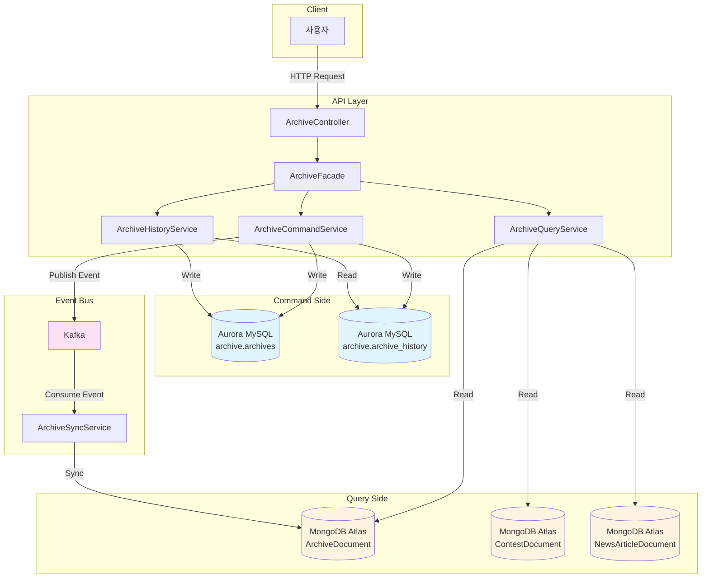
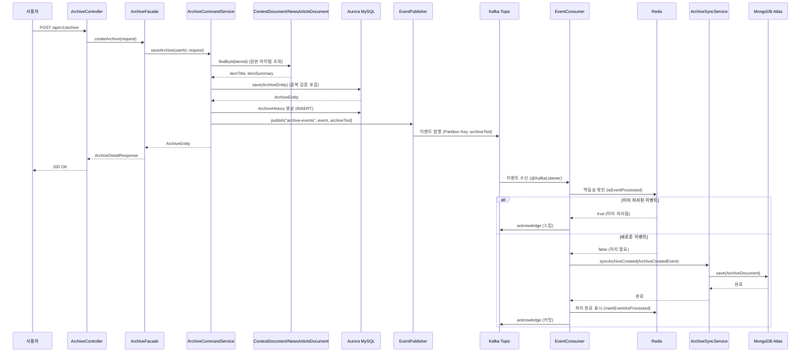
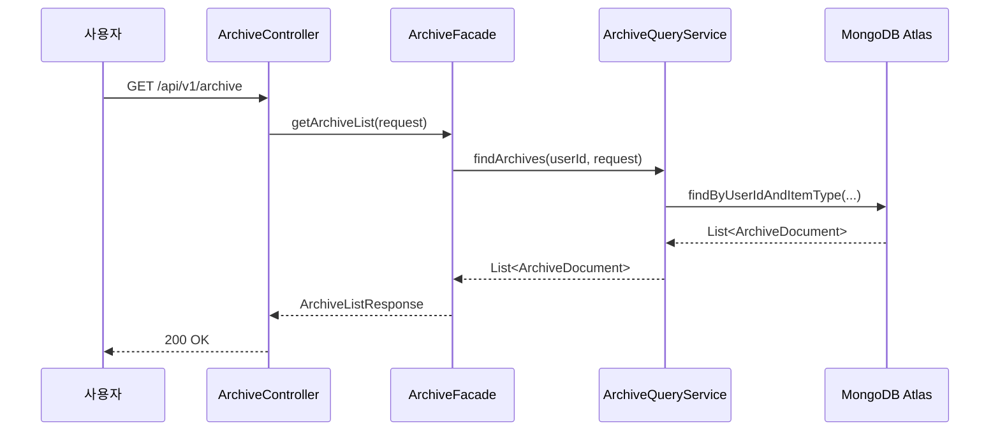
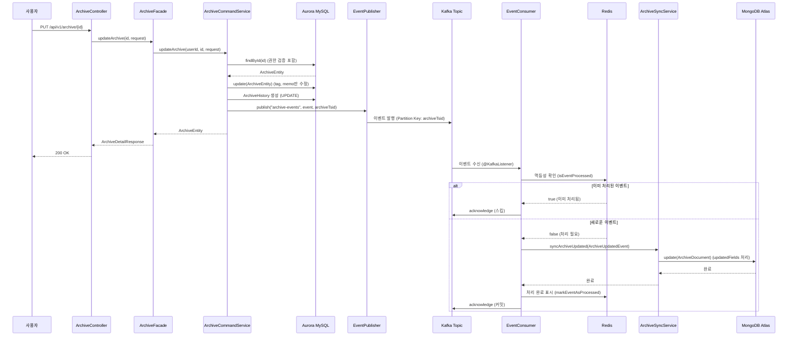

# 사용자 아카이브 기능 구현 설계서

**작성 일시**: 2026-01-08  
**대상 모듈**: `api-archive`  
**목적**: 사용자 아카이브 저장, 조회, 수정, 삭제, 복구, 검색, 정렬, 히스토리 관리 기능 구현 설계  
**아키텍처**: CQRS 패턴 기반 (Command Side: Aurora MySQL, Query Side: MongoDB Atlas)

## 목차

1. [개요](#개요)
2. [설계 원칙](#설계-원칙)
3. [현재 프로젝트 분석](#현재-프로젝트-분석)
4. [아키텍처 설계](#아키텍처-설계)
5. [상세 설계](#상세-설계)
   - [API 엔드포인트 설계](#api-엔드포인트-설계)
   - [아카이브 저장 기능 설계](#아카이브-저장-기능-설계)
   - [아카이브 수정 기능 설계](#아카이브-수정-기능-설계)
   - [아카이브 삭제 및 복구 기능 설계](#아카이브-삭제-및-복구-기능-설계)
   - [아카이브 검색 기능 설계](#아카이브-검색-기능-설계)
   - [아카이브 정렬 기능 설계](#아카이브-정렬-기능-설계)
   - [아카이브 조회 기능 설계](#아카이브-조회-기능-설계)
   - [권한 관리 설계](#권한-관리-설계)
   - [히스토리 관리 기능 설계](#히스토리-관리-기능-설계)
   - [프로젝트 구조 통합](#프로젝트-구조-통합)
6. [구현 가이드](#구현-가이드)
7. [검증 기준](#검증-기준)
8. [참고 자료](#참고-자료)

---

## 개요

이 설계서는 `api-archive` 모듈의 사용자 아카이브 기능 구현을 위한 종합 설계 문서입니다. 로그인한 사용자가 조회할 수 있는 모든 contest, news 정보를 개인 아카이브에 저장하고, 태그와 메모를 수정하며, 삭제 및 복구할 수 있는 기능을 제공합니다. 또한 태그와 메모를 기준으로 검색하고, 원본 아이템 정보를 기준으로 정렬할 수 있는 기능을 포함합니다.

### 주요 기능

1. **아카이브 저장**: ContestDocument, NewsArticleDocument를 개인 아카이브에 저장
2. **아카이브 수정**: 태그(`tag`), 메모(`memo`) 필드 수정
3. **아카이브 삭제**: Soft Delete 방식으로 삭제
4. **아카이브 복구**: 삭제된 아카이브 복구 (일정 기간 내)
5. **아카이브 검색**: 태그, 메모 기반 검색
6. **아카이브 정렬**: 원본 아이템 정보(날짜 등) 기준 정렬
7. **히스토리 관리**: 변경 이력 조회, 특정 시점 데이터 조회, 특정 버전으로 복구

### 설계 원칙

1. **프로젝트 구조 일관성**: `api-contest`, `api-news`, `api-auth` 모듈 구조를 참고하여 일관성 있는 패키지 구조 설계
2. **Facade 패턴**: Controller → Facade → Service → Repository 계층 구조 유지
3. **CQRS 패턴**: 읽기 작업은 MongoDB Atlas, 쓰기 작업은 Aurora MySQL (히스토리 조회는 예외)
4. **트랜잭션 관리**: 단건 처리와 다건 처리의 트랜잭션 전략 분리
5. **클린코드 원칙**: SOLID 원칙 준수, 단일 책임 원칙, 의존성 역전 원칙
6. **오버엔지니어링 방지**: 요구사항에 명시된 기능만 설계

### 참고 문서

- **CQRS Kafka 동기화 설계**: `docs/step11/cqrs-kafka-sync-design.md` ⭐ **핵심 참고 문서**
  - Kafka 이벤트 동기화 아키텍처 및 구현 가이드
  - `EventPublisher`, `EventConsumer` 사용 방법
  - `ArchiveSyncService` 인터페이스 및 구현 설계
  - `updatedFields` 처리 전략 및 제약사항
  - 멱등성 보장 메커니즘 (Redis 기반)
  - 동기화 지연 시간 목표 (1초 이내)
- **MongoDB 스키마 설계**: `docs/step1/2. mongodb-schema-design.md`
- **Aurora 스키마 설계**: `docs/step1/3. aurora-schema-design.md`
- **API 엔드포인트 설계**: `docs/step2/1. api-endpoint-design.md`
- **데이터 모델 설계**: `docs/step2/2. data-model-design.md`
- **Contest/News API 설계**: `docs/step9/contest-news-api-design.md`
- **API 응답 형식 설계**: `docs/step2/3. api-response-format-design.md`
- **에러 처리 전략 설계**: `docs/step2/4. error-handling-strategy-design.md`

---

## 설계 원칙

### 1. CQRS 패턴 적용

- **Command Side (쓰기)**: Aurora MySQL `archive` 스키마
  - `archives` 테이블: 아카이브 정보 저장
  - `archive_history` 테이블: 아카이브 변경 이력 저장
- **Query Side (읽기)**: MongoDB Atlas `ArchiveDocument`
  - 일반 조회, 검색, 정렬은 MongoDB Atlas 사용
  - 삭제된 아카이브 조회, 히스토리 조회는 CQRS 패턴 예외로 Aurora MySQL 사용

### 2. Kafka 이벤트 동기화

- 모든 쓰기 작업 후 Kafka 이벤트 발행
- `EventPublisher`를 통한 이벤트 발행 (토픽: `"archive-events"`, Partition Key: `archiveTsid`)
- `ArchiveSyncService`를 통한 MongoDB Atlas 자동 동기화
- 이벤트 종류:
  - `ArchiveCreatedEvent`: 아카이브 생성
  - `ArchiveUpdatedEvent`: 아카이브 수정
  - `ArchiveDeletedEvent`: 아카이브 삭제 (Soft Delete)
  - `ArchiveRestoredEvent`: 아카이브 복구
- **TSID 필드 기반 1:1 매핑**: `Archive.id(TSID)` → `ArchiveDocument.archiveTsid` (UNIQUE 인덱스로 정확성 보장)
- **이벤트 순서 보장**: Partition Key(`archiveTsid`)를 통한 동일 아카이브의 이벤트 순서 보장
- **멱등성 보장**: `EventConsumer`에서 Redis 기반 중복 처리 방지 (이벤트 ID 기반)
- **동기화 지연 시간**: 목표 1초 이내 (이벤트 발행 → MongoDB Atlas 저장 완료)
- **동기화 메커니즘**:
  - `EventConsumer`: Kafka 이벤트 수신 및 멱등성 보장 (Redis 기반)
  - `ArchiveSyncService`: 이벤트 타입별 MongoDB Atlas 동기화 처리
  - Upsert 패턴: `findByArchiveTsid().orElse(new ArchiveDocument())`로 생성/수정 통합
  - 부분 업데이트: `ArchiveUpdatedEvent`의 `updatedFields`를 Document 필드에 매핑

### 3. Soft Delete 지원

- Aurora MySQL에서 `is_deleted = true`, `deleted_at` 설정
- 삭제된 아카이브는 기본 조회에서 제외
- 복구 기간 제한 정책 (예: 30일, 90일)

### 4. 권한 관리

- JWT 토큰에서 `userId` 추출
- 사용자는 본인의 아카이브만 조회/수정/삭제 가능
- 히스토리 조회: 관리자 또는 본인만 가능
- 히스토리 복구: 관리자만 가능

### 5. 객체지향 설계 원칙

- **SOLID 원칙 준수**
- **클린코드 원칙**: 의미 있는 이름, 작은 함수/클래스, DRY 원칙
- **디자인 패턴**: Facade 패턴, Repository 패턴

---

## 현재 프로젝트 분석

### 1. 아카이브 관련 기존 구조

#### Aurora MySQL (Command Side)

**`archives` 테이블** (`archive` 스키마):
- `id` (BIGINT UNSIGNED, TSID Primary Key)
- `user_id` (BIGINT UNSIGNED, NOT NULL)
- `item_type` (VARCHAR(50), NOT NULL): "CONTEST", "NEWS_ARTICLE"
- `item_id` (VARCHAR(255), NOT NULL): MongoDB ObjectId 문자열
- `tag` (VARCHAR(100), NULL)
- `memo` (TEXT, NULL)
- `is_deleted` (BOOLEAN, NOT NULL, DEFAULT FALSE)
- `deleted_at` (TIMESTAMP(6), NULL)
- `deleted_by` (BIGINT UNSIGNED, NULL)
- `created_at`, `created_by`, `updated_at`, `updated_by`

**인덱스**:
- `user_id + is_deleted` 복합 인덱스
- `user_id + item_type + item_id` UNIQUE 복합 인덱스

**`archive_history` 테이블** (`archive` 스키마):
- `history_id` (BIGINT UNSIGNED, TSID Primary Key)
- `archive_id` (BIGINT UNSIGNED, FOREIGN KEY)
- `operation_type` (VARCHAR(20), NOT NULL): "INSERT", "UPDATE", "DELETE"
- `before_data` (JSON, NULL)
- `after_data` (JSON, NULL)
- `changed_by` (BIGINT UNSIGNED, NULL)
- `changed_at` (TIMESTAMP(6), NOT NULL)
- `change_reason` (VARCHAR(500), NULL)

**인덱스**:
- `archive_id` 외래 키 인덱스
- `changed_at` 인덱스
- `operation_type + changed_at` 복합 인덱스

#### MongoDB Atlas (Query Side)

**`ArchiveDocument` 컬렉션**:
- `_id` (ObjectId)
- `archiveTsid` (String, UNIQUE): Aurora MySQL TSID PK 값
- `userId` (String)
- `itemType` (String): "CONTEST", "NEWS_ARTICLE"
- `itemId` (ObjectId): ContestDocument 또는 NewsArticleDocument 참조
- `itemTitle` (String): 비정규화된 항목 제목
- `itemSummary` (String): 비정규화된 항목 요약
- `tag` (String, nullable)
- `memo` (String, nullable)
- `archivedAt` (Date)
- `createdAt`, `createdBy`, `updatedAt`, `updatedBy`

**인덱스**:
- `archiveTsid` UNIQUE 인덱스
- `userId + createdAt` 복합 인덱스
- `userId + itemType + createdAt` 복합 인덱스
- `userId + itemType + itemId` UNIQUE 복합 인덱스

#### Kafka 이벤트

- `ArchiveCreatedEvent`: Archive 엔티티 생성 시 발행
- `ArchiveUpdatedEvent`: Archive 엔티티 수정 시 발행
- `ArchiveDeletedEvent`: Archive 엔티티 Soft Delete 시 발행
- `ArchiveRestoredEvent`: Archive 엔티티 복원 시 발행

#### 동기화 서비스

**구현 상태**: ✅ `ArchiveSyncService` 및 `ArchiveSyncServiceImpl` 이미 구현 완료

- `ArchiveSyncService`: Kafka 이벤트를 수신하여 MongoDB Atlas 동기화 (인터페이스)
- `ArchiveSyncServiceImpl`: 동기화 로직 구현
  - `syncArchiveCreated()`: ArchiveCreatedEvent 처리 (Upsert 패턴)
  - `syncArchiveUpdated()`: ArchiveUpdatedEvent 처리 (부분 업데이트, `updatedFields` 처리)
  - `syncArchiveDeleted()`: ArchiveDeletedEvent 처리 (물리적 삭제)
  - `syncArchiveRestored()`: ArchiveRestoredEvent 처리 (Document 새로 생성)
- **동기화 전략** (step11 설계서와 일치): 
  - TSID 필드 기반 1:1 매핑 (`Archive.id(TSID)` → `ArchiveDocument.archiveTsid`, UNIQUE 인덱스)
  - Upsert 패턴 사용: `findByArchiveTsid().orElse(new ArchiveDocument())`로 생성/수정 통합
  - MongoDB Soft Delete 미지원: 삭제 시 물리적 삭제 (`deleteByArchiveTsid()`), 복구 시 새로 생성
  - 타입 변환: `Instant` → `LocalDateTime`, `String` → `ObjectId`
  - 에러 핸들링: 예외 발생 시 로깅 및 `RuntimeException` 전파

### 2. 기존 API 모듈 구조 분석

#### api-contest, api-news 모듈 패턴

**계층 구조**:
1. **Controller**: HTTP 요청/응답 처리, `ApiResponse<T>` 사용
2. **Facade**: Controller와 Service 사이의 중간 계층, 비즈니스 로직 조합
3. **Service**: 핵심 비즈니스 로직, Repository 호출
4. **Repository**: 데이터 접근 로직

**패키지 구조**:
```
api-{module}/
  controller/
  facade/
  service/
  dto/
    request/
    response/
  config/
  common/
    exception/
```

### 3. 히스토리 자동 저장 메커니즘

**`HistoryEntityListener`**:
- `@EntityListeners(HistoryEntityListener.class)` 어노테이션 활용
- `@PrePersist`: INSERT 작업 시 히스토리 저장 (operation_type: INSERT)
- `@PreUpdate`: UPDATE/DELETE 작업 시 히스토리 저장 (operation_type: UPDATE/DELETE)
- `before_data`, `after_data` JSON 필드에 전체 엔티티 데이터 저장

---

## 아키텍처 설계

### 전체 시스템 아키텍처



### 데이터 흐름도

#### 아카이브 저장 흐름



#### 아카이브 조회 흐름 (일반 조회)



#### 아카이브 수정 흐름



---

## 상세 설계

### API 엔드포인트 설계

#### 기본 정보

- **Base URL**: `/api/v1/archive`
- **인증**: 모든 엔드포인트는 JWT Access Token 필요
- **응답 형식**: `ApiResponse<T>` 사용 (표준 응답 형식)

#### 엔드포인트 목록

##### 1. 아카이브 저장

**엔드포인트**: `POST /api/v1/archive`

**설명**: 새로운 아카이브를 추가합니다.

**요청 Body**:
```json
{
  "itemType": "CONTEST",
  "itemId": "507f1f77bcf86cd799439012",
  "tag": "algorithm",
  "memo": "참가 예정"
}
```

**처리 로직**:
1. JWT 토큰에서 `userId` 추출
2. 원본 아이템 존재 여부 확인 (ContestDocument 또는 NewsArticleDocument)
3. 중복 검증 (`user_id + item_type + item_id` UNIQUE 제약조건)
4. 원본 아이템 정보 조회 (`itemTitle`, `itemSummary`)
5. Aurora MySQL에 `Archive` 엔티티 생성
6. `ArchiveHistory` 엔티티 생성 (operation_type: INSERT, `HistoryEntityListener` 자동 처리)
7. Kafka 이벤트 발행: `EventPublisher.publish("archive-events", ArchiveCreatedEvent, archiveTsid)`
   - Partition Key: `archiveTsid` (이벤트 순서 보장)
8. MongoDB Atlas 동기화 (자동, `ArchiveSyncService`를 통한 비동기 처리)
   - `EventConsumer`: Kafka 이벤트 수신 및 멱등성 확인 (Redis 기반)
   - `ArchiveSyncServiceImpl.syncArchiveCreated()`: Upsert 패턴으로 Document 생성/수정
   - TSID 필드 기반 1:1 매핑: `Archive.id(TSID)` → `ArchiveDocument.archiveTsid` (UNIQUE 인덱스)
   - 동기화 지연 시간: 목표 1초 이내
   - 멱등성 보장: `EventConsumer`에서 Redis 기반 중복 처리 방지 (이벤트 ID 기반, TTL: 7일)

**응답**: `ArchiveDetailResponse`

##### 2. 아카이브 목록 조회

**엔드포인트**: `GET /api/v1/archive`

**설명**: 사용자의 아카이브 목록을 조회합니다.

**쿼리 파라미터**:
- `page` (Integer, optional): 페이지 번호 (기본값: 1)
- `size` (Integer, optional): 페이지 크기 (기본값: 10, 최대: 100)
- `itemType` (String, optional): 항목 타입 필터 ("CONTEST", "NEWS_ARTICLE")
- `sort` (String, optional): 정렬 기준 (예: "archivedAt,desc", "itemTitle,asc")

**데이터 소스**: MongoDB Atlas (`ArchiveDocument`)

**응답**: `ArchiveListResponse` (페이징 정보 포함)

##### 3. 아카이브 상세 조회

**엔드포인트**: `GET /api/v1/archive/{id}`

**설명**: 특정 아카이브의 상세 정보를 조회합니다.

**경로 파라미터**:
- `id` (String, required): 아카이브 ID (archiveTsid 또는 ObjectId)

**데이터 소스**: MongoDB Atlas (`ArchiveDocument`)

**권한 검증**: 본인의 아카이브만 조회 가능

**응답**: `ArchiveDetailResponse`

##### 4. 아카이브 수정

**엔드포인트**: `PUT /api/v1/archive/{id}`

**설명**: 아카이브의 태그와 메모를 수정합니다.

**경로 파라미터**:
- `id` (String, required): 아카이브 ID (archiveTsid, TSID)

**요청 Body**:
```json
{
  "tag": "updated-algorithm",
  "memo": "수정된 메모"
}
```

**처리 로직**:
1. JWT 토큰에서 `userId` 추출
2. 권한 검증 (본인의 아카이브만 수정 가능)
3. Aurora MySQL에서 `Archive` 엔티티 조회
4. `tag`, `memo` 필드만 수정 (ArchiveEntity에 있는 필드만)
5. `ArchiveHistory` 엔티티 생성 (operation_type: UPDATE, `HistoryEntityListener` 자동 처리)
6. Kafka 이벤트 발행: `EventPublisher.publish("archive-events", ArchiveUpdatedEvent, archiveTsid)`
   - `updatedFields`: `tag`, `memo`만 포함 (ArchiveEntity에 있는 필드만)
   - `itemTitle`, `itemSummary`는 제외 (ArchiveEntity에 없는 필드)
   - Partition Key: `archiveTsid` (이벤트 순서 보장)
7. MongoDB Atlas 동기화 (자동, `ArchiveSyncService`를 통한 비동기 처리)
   - `EventConsumer`: Kafka 이벤트 수신 및 멱등성 확인 (Redis 기반)
   - `ArchiveSyncServiceImpl.syncArchiveUpdated()`: 이벤트 처리
   - `ArchiveSyncServiceImpl.updateDocumentFields()`: `updatedFields`를 Document 필드에 매핑
     - 지원 필드: `tag`, `memo` (ArchiveEntity에 있는 필드만)
     - 제외 필드: `itemTitle`, `itemSummary` (ArchiveEntity에 없는 필드, 경고 로그만 출력)
   - 동기화 지연 시간: 목표 1초 이내
   - 멱등성 보장: `EventConsumer`에서 Redis 기반 중복 처리 방지 (이벤트 ID 기반, TTL: 7일)

**응답**: `ArchiveDetailResponse`

##### 5. 아카이브 삭제

**엔드포인트**: `DELETE /api/v1/archive/{id}`

**설명**: 아카이브를 삭제합니다 (Soft Delete).

**경로 파라미터**:
- `id` (String, required): 아카이브 ID (archiveTsid, TSID)

**처리 로직**:
1. JWT 토큰에서 `userId` 추출
2. 권한 검증 (본인의 아카이브만 삭제 가능)
3. Aurora MySQL에서 `Archive` 엔티티 조회
4. Soft Delete: `is_deleted = true`, `deleted_at = 현재 시간`, `deleted_by = userId`
5. `ArchiveHistory` 엔티티 생성 (operation_type: DELETE, `HistoryEntityListener` 자동 처리)
6. Kafka 이벤트 발행: `EventPublisher.publish("archive-events", ArchiveDeletedEvent, archiveTsid)`
   - Partition Key: `archiveTsid` (이벤트 순서 보장)
7. MongoDB Atlas 동기화 (자동, `ArchiveSyncService`를 통한 비동기 처리)
   - `EventConsumer`: Kafka 이벤트 수신 및 멱등성 확인 (Redis 기반)
   - `ArchiveSyncServiceImpl.syncArchiveDeleted()`: Document 물리적 삭제
   - MongoDB는 Soft Delete를 지원하지 않으므로 `archiveRepository.deleteByArchiveTsid()` 호출
   - 동기화 지연 시간: 목표 1초 이내
   - 멱등성 보장: `EventConsumer`에서 Redis 기반 중복 처리 방지 (이벤트 ID 기반, TTL: 7일)

**응답**: 200 OK

##### 6. 삭제된 아카이브 목록 조회

**엔드포인트**: `GET /api/v1/archive/deleted`

**설명**: 삭제된 아카이브 목록을 조회합니다.

**쿼리 파라미터**:
- `page` (Integer, optional): 페이지 번호 (기본값: 1)
- `size` (Integer, optional): 페이지 크기 (기본값: 10, 최대: 100)
- `days` (Integer, optional): 복구 가능 기간 (일, 기본값: 30)

**데이터 소스**: Aurora MySQL (`Archive` 엔티티, CQRS 패턴 예외)

**처리 로직**:
1. JWT 토큰에서 `userId` 추출
2. Aurora MySQL에서 `is_deleted = true`인 아카이브 조회
3. `deleted_at` 기준으로 복구 가능 기간 필터링
4. 페이징 처리

**응답**: `ArchiveListResponse`

##### 7. 아카이브 복구

**엔드포인트**: `POST /api/v1/archive/{id}/restore`

**설명**: 삭제된 아카이브를 복구합니다.

**경로 파라미터**:
- `id` (String, required): 아카이브 ID (archiveTsid, TSID)

**처리 로직**:
1. JWT 토큰에서 `userId` 추출
2. 권한 검증 (본인의 아카이브만 복구 가능)
3. 복구 기간 검증 (예: 30일 이내)
4. Aurora MySQL에서 `Archive` 엔티티 조회
5. 원본 아이템 정보 재조회 (`itemTitle`, `itemSummary` - ArchiveEntity에 없는 필드)
6. 복구: `is_deleted = false`, `deleted_at = null`, `deleted_by = null`
7. `ArchiveHistory` 엔티티 생성 (operation_type: UPDATE, `HistoryEntityListener` 자동 처리)
8. Kafka 이벤트 발행: `EventPublisher.publish("archive-events", ArchiveRestoredEvent, archiveTsid)`
   - 원본 아이템 정보(`itemTitle`, `itemSummary`) 포함
   - Partition Key: `archiveTsid` (이벤트 순서 보장)
9. MongoDB Atlas 동기화 (자동, `ArchiveSyncService`를 통한 비동기 처리)
   - `EventConsumer`: Kafka 이벤트 수신 및 멱등성 확인 (Redis 기반)
   - `ArchiveSyncServiceImpl.syncArchiveRestored()`: Document 새로 생성
   - MongoDB는 Soft Delete를 지원하지 않으므로 복구 시 Document 새로 생성
   - TSID 필드 기반 1:1 매핑: `Archive.id(TSID)` → `ArchiveDocument.archiveTsid` (UNIQUE 인덱스)
   - 동기화 지연 시간: 목표 1초 이내
   - 멱등성 보장: `EventConsumer`에서 Redis 기반 중복 처리 방지 (이벤트 ID 기반, TTL: 7일)

**응답**: `ArchiveDetailResponse`

##### 8. 아카이브 검색

**엔드포인트**: `GET /api/v1/archive/search`

**설명**: 태그와 메모를 기준으로 아카이브를 검색합니다.

**쿼리 파라미터**:
- `q` (String, required): 검색어
- `page` (Integer, optional): 페이지 번호 (기본값: 1)
- `size` (Integer, optional): 페이지 크기 (기본값: 10, 최대: 100)
- `searchField` (String, optional): 검색 필드 ("tag", "memo", "all", 기본값: "all")

**데이터 소스**: MongoDB Atlas (`ArchiveDocument`)

**처리 로직**:
1. JWT 토큰에서 `userId` 추출
2. MongoDB Atlas에서 `userId` 필터링
3. `tag` 또는 `memo` 필드에서 키워드 검색 (정규식 또는 Full-text Search)
4. 페이징 처리

**응답**: `ArchiveSearchResponse`

##### 9. 변경 이력 조회

**엔드포인트**: `GET /api/v1/archive/history/{entityId}`

**설명**: 특정 아카이브 엔티티의 변경 이력을 조회합니다.

**경로 파라미터**:
- `entityId` (String, required): 아카이브 엔티티 ID (TSID)

**쿼리 파라미터**:
- `page` (Integer, optional): 페이지 번호 (기본값: 1)
- `size` (Integer, optional): 페이지 크기 (기본값: 10, 최대: 100)
- `operationType` (String, optional): 작업 타입 필터 ("INSERT", "UPDATE", "DELETE")
- `startDate` (String, optional): 시작 일시 (ISO 8601)
- `endDate` (String, optional): 종료 일시 (ISO 8601)

**데이터 소스**: Aurora MySQL (`ArchiveHistory` 엔티티, CQRS 패턴 예외)

**권한 검증**: 관리자 또는 본인만 조회 가능

**인덱스 활용**: `operation_type + changed_at` 복합 인덱스

**응답**: `ArchiveHistoryListResponse`

##### 10. 특정 시점 데이터 조회

**엔드포인트**: `GET /api/v1/archive/history/{entityId}/at`

**설명**: 특정 시점의 아카이브 엔티티 데이터를 조회합니다.

**경로 파라미터**:
- `entityId` (String, required): 아카이브 엔티티 ID (TSID)

**쿼리 파라미터**:
- `timestamp` (String, required): 시점 (ISO 8601)

**데이터 소스**: Aurora MySQL (히스토리 테이블의 `before_data`/`after_data` JSON 필드, CQRS 패턴 예외)

**처리 로직**:
1. JWT 토큰에서 `userId` 추출
2. 권한 검증 (관리자 또는 본인만 조회 가능)
3. 히스토리 테이블에서 해당 시점 이전의 가장 최근 이력 조회
4. `after_data` JSON 필드에서 데이터 추출

**응답**: `ArchiveHistoryDetailResponse`

##### 11. 특정 버전으로 복구

**엔드포인트**: `POST /api/v1/archive/history/{entityId}/restore`

**설명**: 특정 히스토리 버전으로 아카이브 엔티티를 복구합니다.

**경로 파라미터**:
- `entityId` (String, required): 아카이브 엔티티 ID (TSID)

**쿼리 파라미터**:
- `historyId` (String, required): 히스토리 ID (TSID)

**데이터 소스**: Aurora MySQL (히스토리 테이블 및 엔티티 테이블)

**권한 검증**: 관리자만 복구 가능

**처리 로직**:
1. JWT 토큰에서 `userId` 추출
2. 권한 검증 (관리자만 복구 가능)
3. 히스토리 엔티티 조회 (historyId)
4. `after_data` JSON 필드를 기반으로 엔티티 복구
5. Aurora MySQL에서 엔티티 업데이트
6. 히스토리 엔티티 생성 (operation_type: UPDATE, `HistoryEntityListener` 자동 처리)
7. Kafka 이벤트 발행: `EventPublisher.publish("archive-events", ArchiveUpdatedEvent, archiveTsid)`
   - `updatedFields`: 히스토리에서 복구한 필드만 포함
   - Partition Key: `archiveTsid` (이벤트 순서 보장)
8. MongoDB Atlas 동기화 (자동, `ArchiveSyncService`를 통한 비동기 처리)
   - `EventConsumer`: Kafka 이벤트 수신 및 멱등성 확인 (Redis 기반)
   - `ArchiveSyncServiceImpl.syncArchiveUpdated()`: 이벤트 처리
   - 동기화 지연 시간: 목표 1초 이내
   - 멱등성 보장: `EventConsumer`에서 Redis 기반 중복 처리 방지 (이벤트 ID 기반, TTL: 7일)

**응답**: `ArchiveDetailResponse`

### 아카이브 저장 기능 설계

#### 저장 대상 확인

- **ContestDocument**: MongoDB Atlas에서 `itemId`로 조회
- **NewsArticleDocument**: MongoDB Atlas에서 `itemId`로 조회
- 존재하지 않으면 예외 발생: `ArchiveItemNotFoundException`

#### 중복 검증

- **제약조건**: `user_id + item_type + item_id` UNIQUE 복합 인덱스
- **검증 로직**: Aurora MySQL에서 조회하여 중복 확인
- 중복이면 예외 발생: `ArchiveDuplicateException`

#### 원본 아이템 정보 조회

**ContestDocument**:
- `title` → `itemTitle`
- `description` → `itemSummary` (길이 제한 고려)

**NewsArticleDocument**:
- `title` → `itemTitle`
- `summary` → `itemSummary`

#### Aurora MySQL 저장

```java
ArchiveEntity archive = new ArchiveEntity();
archive.setUserId(userId);
archive.setItemType(itemType);
archive.setItemId(itemId);
archive.setTag(tag);
archive.setMemo(memo);
// BaseEntity의 created_at, created_by는 자동 설정

archiveRepository.save(archive);
```

#### 히스토리 자동 저장

- `@EntityListeners(HistoryEntityListener.class)` 어노테이션으로 자동 처리
- `@PrePersist` 시점에 `ArchiveHistory` 엔티티 생성
- `operation_type`: "INSERT"
- `after_data`: 전체 엔티티 데이터 (JSON)

#### Kafka 이벤트 발행

**중요**: `EventPublisher`를 사용하여 이벤트를 발행합니다. 토픽 이름은 `"archive-events"`이며, Partition Key로 `archiveTsid`를 사용합니다.

```java
ArchiveCreatedEvent.ArchiveCreatedPayload payload = new ArchiveCreatedEvent.ArchiveCreatedPayload(
    archive.getId().toString(),  // archiveTsid
    userId.toString(),           // userId
    itemType,
    itemId,
    itemTitle,
    itemSummary,
    tag,
    memo,
    Instant.now()                // archivedAt
);

ArchiveCreatedEvent event = new ArchiveCreatedEvent(payload);
eventPublisher.publish("archive-events", event, archive.getId().toString());  // Partition Key: archiveTsid
```

### 아카이브 수정 기능 설계

#### 수정 가능 필드

- **`tag`**: 태그 필드
- **`memo`**: 메모 필드
- **수정 불가**: `itemTitle`, `itemSummary` (원본 아이템 정보 참조)

#### 원본 아이템 정보 동기화 전략

**중요**: `itemTitle`, `itemSummary`는 `ArchiveEntity`에 없는 필드입니다. 이 필드들은 `ArchiveDocument`(MongoDB Atlas)에만 존재하며, 원본 아이템(ContestDocument/NewsArticleDocument) 정보를 비정규화하여 저장합니다.

**동기화 방식**:
- **아카이브 저장 시**: 원본 아이템 정보를 조회하여 `ArchiveCreatedEvent`에 포함하여 MongoDB Atlas에 저장
- **아카이브 수정 시**: `ArchiveEntity`에는 `itemTitle`, `itemSummary` 필드가 없으므로, `ArchiveUpdatedEvent`의 `updatedFields`에 포함하지 않음
- **원본 아이템 정보 업데이트**: 원본 아이템(ContestDocument/NewsArticleDocument) 변경 시 별도의 동기화 메커니즘이 필요 (향후 구현)

#### Aurora MySQL 업데이트

```java
ArchiveEntity archive = archiveRepository.findById(id)
    .orElseThrow(() -> new ArchiveNotFoundException(id));

// 권한 검증
if (!archive.getUserId().equals(userId)) {
    throw new UnauthorizedException("본인의 아카이브만 수정할 수 있습니다.");
}

// 주의: ArchiveEntity에는 itemTitle, itemSummary 필드가 없으므로
// 원본 아이템 정보는 ArchiveDocument(MongoDB Atlas)에만 저장됩니다.
// 원본 아이템 정보 업데이트는 별도의 동기화 메커니즘이 필요합니다.

// tag, memo만 수정
archive.setTag(request.getTag());
archive.setMemo(request.getMemo());

archiveRepository.save(archive);
```

#### 히스토리 자동 저장

- `@PreUpdate` 시점에 `ArchiveHistory` 엔티티 생성
- `operation_type`: "UPDATE"
- `before_data`: 변경 전 엔티티 데이터 (JSON)
- `after_data`: 변경 후 엔티티 데이터 (JSON)

#### Kafka 이벤트 발행

**중요**: `EventPublisher`를 사용하여 이벤트를 발행합니다. 토픽 이름은 `"archive-events"`이며, Partition Key로 `archiveTsid`를 사용합니다.

```java
// 주의: itemTitle, itemSummary는 ArchiveEntity에 없는 필드이므로
// updatedFields에 포함할 수 없습니다.
// 이 필드들은 원본 아이템(ContestDocument/NewsArticleDocument) 변경 시
// 별도의 동기화 메커니즘으로 업데이트되어야 합니다.
Map<String, Object> updatedFields = new HashMap<>();
updatedFields.put("tag", archive.getTag());
updatedFields.put("memo", archive.getMemo());
// itemTitle, itemSummary는 제외 (ArchiveEntity에 없는 필드)

ArchiveUpdatedEvent.ArchiveUpdatedPayload payload = new ArchiveUpdatedEvent.ArchiveUpdatedPayload(
    archive.getId().toString(),  // archiveTsid
    userId.toString(),            // userId
    updatedFields
);

ArchiveUpdatedEvent event = new ArchiveUpdatedEvent(payload);
eventPublisher.publish("archive-events", event, archive.getId().toString());  // Partition Key: archiveTsid
```

### 아카이브 삭제 및 복구 기능 설계

#### Soft Delete 구현

```java
ArchiveEntity archive = archiveRepository.findById(id)
    .orElseThrow(() -> new ArchiveNotFoundException(id));

// 권한 검증
if (!archive.getUserId().equals(userId)) {
    throw new UnauthorizedException("본인의 아카이브만 삭제할 수 있습니다.");
}

// Soft Delete
archive.setIsDeleted(true);
archive.setDeletedAt(LocalDateTime.now());
archive.setDeletedBy(userId);

archiveRepository.save(archive);
```

#### 삭제된 아카이브 조회

**CQRS 패턴 예외**: Aurora MySQL에서 조회

```java
// 복구 가능 기간 계산 (기본값: 30일)
LocalDateTime cutoffDate = LocalDateTime.now().minusDays(days);

List<ArchiveEntity> deletedArchives = archiveRepository
    .findByUserIdAndIsDeletedTrueAndDeletedAtAfter(userId, cutoffDate, pageable);
```

#### 아카이브 복구

```java
ArchiveEntity archive = archiveRepository.findById(id)
    .orElseThrow(() -> new ArchiveNotFoundException(id));

// 권한 검증
if (!archive.getUserId().equals(userId)) {
    throw new UnauthorizedException("본인의 아카이브만 복구할 수 있습니다.");
}

// 복구 기간 검증
if (archive.getDeletedAt() != null) {
    LocalDateTime cutoffDate = LocalDateTime.now().minusDays(30);
    if (archive.getDeletedAt().isBefore(cutoffDate)) {
        throw new ArchiveRestoreExpiredException("복구 기간이 만료되었습니다.");
    }
}

// 복구
archive.setIsDeleted(false);
archive.setDeletedAt(null);
archive.setDeletedBy(null);

archiveRepository.save(archive);
```

#### Kafka 이벤트 발행

**삭제 시**:
```java
ArchiveDeletedEvent.ArchiveDeletedPayload payload = new ArchiveDeletedEvent.ArchiveDeletedPayload(
    archive.getId().toString(),  // archiveTsid
    userId.toString(),            // userId
    Instant.now()                 // deletedAt
);

ArchiveDeletedEvent event = new ArchiveDeletedEvent(payload);
eventPublisher.publish("archive-events", event, archive.getId().toString());  // Partition Key: archiveTsid
```

**복구 시**:
```java
// 주의: ArchiveEntity에는 itemTitle, itemSummary 필드가 없으므로
// 복구 시 원본 아이템 정보를 다시 조회해야 합니다.
String itemTitle;
String itemSummary;

if ("CONTEST".equals(archive.getItemType())) {
    ContestDocument contest = contestRepository.findById(new ObjectId(archive.getItemId()))
        .orElseThrow(() -> new ArchiveItemNotFoundException("Contest not found"));
    itemTitle = contest.getTitle();
    itemSummary = contest.getDescription();
} else if ("NEWS_ARTICLE".equals(archive.getItemType())) {
    NewsArticleDocument news = newsArticleRepository.findById(new ObjectId(archive.getItemId()))
        .orElseThrow(() -> new ArchiveItemNotFoundException("News article not found"));
    itemTitle = news.getTitle();
    itemSummary = news.getSummary();
} else {
    throw new ArchiveValidationException("Invalid item type");
}

ArchiveRestoredEvent.ArchiveRestoredPayload payload = new ArchiveRestoredEvent.ArchiveRestoredPayload(
    archive.getId().toString(),      // archiveTsid
    userId.toString(),               // userId
    archive.getItemType(),
    archive.getItemId(),
    itemTitle,
    itemSummary,
    archive.getTag(),
    archive.getMemo(),
    archive.getCreatedAt()           // archivedAt은 ArchiveEntity에 없으므로 createdAt 사용
        .atZone(ZoneId.systemDefault())
        .toInstant()
);

ArchiveRestoredEvent event = new ArchiveRestoredEvent(payload);
eventPublisher.publish("archive-events", event, archive.getId().toString());  // Partition Key: archiveTsid
```

### 아카이브 검색 기능 설계

#### 검색 대상

- 사용자별 아카이브 (`userId` 필터링)
- MongoDB Atlas `ArchiveDocument` 컬렉션

#### 검색 필드

- **`tag`**: 태그 필드
- **`memo`**: 메모 필드

#### 검색 방식

**옵션 1: 정규식 검색 (권장)**
```java
Criteria criteria = Criteria.where("userId").is(userId);

if ("tag".equals(searchField) || "all".equals(searchField)) {
    criteria.and("tag").regex(q, "i");
}
if ("memo".equals(searchField) || "all".equals(searchField)) {
    criteria.and("memo").regex(q, "i");
}

Query query = new Query(criteria).with(pageable);
List<ArchiveDocument> archives = mongoTemplate.find(query, ArchiveDocument.class);
```

**옵션 2: Full-text Search**
- MongoDB Atlas Full-text Search 인덱스 생성
- `$text` 연산자 사용
- 더 복잡하지만 성능 향상 가능

**권장 방안**: 옵션 1 (정규식 검색) - 구현 단순, 요구사항 충족

#### 인덱스 최적화

- `userId + tag` 복합 인덱스 (태그 검색 시)
- `userId + memo` 복합 인덱스 (메모 검색 시)
- 또는 `userId + tag + memo` 복합 인덱스

### 아카이브 정렬 기능 설계

#### 정렬 대상

- 사용자별 아카이브 (`userId` 필터링)
- MongoDB Atlas `ArchiveDocument` 컬렉션

#### 정렬 기준

**원본 아이템 정보 기준 정렬**:

**Contest 정렬**:
- `startDate`: ContestDocument의 `startDate`
- `endDate`: ContestDocument의 `endDate`
- `createdAt`: ContestDocument의 `createdAt`

**News 정렬**:
- `publishedAt`: NewsArticleDocument의 `publishedAt`
- `createdAt`: NewsArticleDocument의 `createdAt`

**공통 정렬**:
- `itemTitle`: ArchiveDocument의 `itemTitle`
- `archivedAt`: ArchiveDocument의 `archivedAt`
- `createdAt`: ArchiveDocument의 `createdAt`

#### 원본 아이템 정보 조회 전략

**문제**: ArchiveDocument에는 원본 아이템의 날짜 정보가 없음

**옵션 1: ArchiveDocument에 원본 날짜 정보 비정규화 저장 (권장)**
- `itemStartDate`, `itemEndDate`, `itemPublishedAt` 필드 추가
- 아카이브 저장 시 원본 아이템 정보 조회하여 저장
- 정렬 시 ArchiveDocument만으로 처리 가능 (성능 우수)

**옵션 2: 정렬 시 원본 아이템 조회 후 정렬**
- 정렬 시 ContestDocument/NewsArticleDocument 조회
- 애플리케이션 레벨에서 정렬
- 성능 저하, 복잡도 증가

**권장 방안**: 옵션 1 (비정규화 저장)

#### ArchiveDocument 스키마 확장

```java
@Field("item_start_date")
private LocalDateTime itemStartDate;  // Contest의 startDate

@Field("item_end_date")
private LocalDateTime itemEndDate;    // Contest의 endDate

@Field("item_published_at")
private LocalDateTime itemPublishedAt; // News의 publishedAt
```

#### 인덱스 최적화

- `userId + itemStartDate` 복합 인덱스 (Contest 정렬 시)
- `userId + itemEndDate` 복합 인덱스 (Contest 정렬 시)
- `userId + itemPublishedAt` 복합 인덱스 (News 정렬 시)
- `userId + archivedAt` 복합 인덱스
- `userId + createdAt` 복합 인덱스

#### 정렬 구현

```java
Sort sort = parseSort(request.getSort());

// 정렬 필드 매핑
String sortField = mapSortField(request.getSort(), itemType);

Pageable pageable = PageRequest.of(
    request.getPage() - 1,
    request.getSize(),
    sort
);

Page<ArchiveDocument> page = archiveRepository
    .findByUserIdAndItemType(userId, itemType, pageable);
```

### 아카이브 조회 기능 설계

#### 기본 조회

- 사용자별 아카이브 목록 조회 (MongoDB Atlas)
- 페이징, 필터링, 정렬 지원

#### 필터링

- `itemType` 필터: "CONTEST", "NEWS_ARTICLE"
- `isDeleted` 필터: 기본적으로 삭제된 항목 제외

#### 페이징

- 페이지 번호, 페이지 크기 설정
- 기본값: page=1, size=10
- 최대값: size=100

#### 상세 조회

- `archiveTsid` 또는 `ObjectId`로 상세 조회
- 권한 검증: 본인의 아카이브만 조회 가능

### 권한 관리 설계

#### 사용자별 데이터 격리

- JWT 토큰에서 `userId` 추출
- 모든 조회/수정/삭제 작업에 `userId` 필터링 적용

#### 권한 검증

**Spring Security `@PreAuthorize` 활용**:
```java
@PreAuthorize("hasRole('USER') and #userId == authentication.principal.id")
public ArchiveDetailResponse getArchiveDetail(Long userId, String id) {
    // ...
}
```

**또는 Service 레이어에서 검증**:
```java
ArchiveEntity archive = archiveRepository.findById(id)
    .orElseThrow(() -> new ArchiveNotFoundException(id));

if (!archive.getUserId().equals(userId)) {
    throw new UnauthorizedException("본인의 아카이브만 조회할 수 있습니다.");
}
```

#### 인증 필수

- 모든 아카이브 API는 인증 필수
- JWT Access Token 검증

### 히스토리 관리 기능 설계

#### 자동 히스토리 저장

**`HistoryEntityListener` 활용**:
- `@EntityListeners(HistoryEntityListener.class)` 어노테이션
- `@PrePersist`: INSERT 작업 시 히스토리 저장
- `@PreUpdate`: UPDATE/DELETE 작업 시 히스토리 저장

**동작 방식**:
1. 엔티티 저장/수정 시 `HistoryEntityListener`가 자동 호출
2. `before_data`: 변경 전 엔티티 데이터 (JSON)
3. `after_data`: 변경 후 엔티티 데이터 (JSON)
4. `ArchiveHistory` 엔티티 생성 및 저장

#### 변경 이력 조회

**엔드포인트**: `GET /api/v1/archive/history/{entityId}`

**처리 로직**:
```java
// 권한 검증
if (!isAdmin(userId) && !archive.getUserId().equals(userId)) {
    throw new UnauthorizedException("권한이 없습니다.");
}

// 히스토리 조회
List<ArchiveHistoryEntity> historyList = archiveHistoryRepository
    .findByArchiveIdOrderByChangedAtDesc(archiveId, pageable);
```

**필터링**:
- `operationType`: "INSERT", "UPDATE", "DELETE"
- `startDate`, `endDate`: 기간 필터

**인덱스 활용**: `operation_type + changed_at` 복합 인덱스

#### 특정 시점 데이터 조회

**엔드포인트**: `GET /api/v1/archive/history/{entityId}/at?timestamp={timestamp}`

**처리 로직**:
```java
LocalDateTime timestamp = parseTimestamp(request.getTimestamp());

// 해당 시점 이전의 가장 최근 이력 조회
ArchiveHistoryEntity history = archiveHistoryRepository
    .findByArchiveIdAndChangedAtLessThanEqualOrderByChangedAtDesc(
        archiveId, timestamp)
    .stream()
    .findFirst()
    .orElseThrow(() -> new ArchiveHistoryNotFoundException());

// after_data JSON 필드에서 데이터 추출
ArchiveEntity archive = objectMapper.readValue(
    history.getAfterData(), ArchiveEntity.class);
```

#### 특정 버전으로 복구

**엔드포인트**: `POST /api/v1/archive/history/{entityId}/restore?historyId={historyId}`

**처리 로직**:
```java
// 권한 검증 (관리자만)
if (!isAdmin(userId)) {
    throw new UnauthorizedException("관리자만 복구할 수 있습니다.");
}

// 히스토리 엔티티 조회
ArchiveHistoryEntity history = archiveHistoryRepository
    .findById(historyId)
    .orElseThrow(() -> new ArchiveHistoryNotFoundException());

// after_data JSON 필드에서 엔티티 데이터 추출
ArchiveEntity archiveData = objectMapper.readValue(
    history.getAfterData(), ArchiveEntity.class);

// 엔티티 복구
ArchiveEntity archive = archiveRepository.findById(entityId)
    .orElseThrow(() -> new ArchiveNotFoundException(entityId));

archive.setTag(archiveData.getTag());
archive.setMemo(archiveData.getMemo());
// ... 기타 필드 복구

archiveRepository.save(archive);

// 히스토리 생성 (operation_type: UPDATE)
// Kafka 이벤트 발행
```

### 프로젝트 구조 통합

#### 모듈 구조

```
api-archive/
  src/main/java/com/ebson/shrimp/tm/demo/api/archive/
    ArchiveApplication.java
    controller/
      ArchiveController.java
    facade/
      ArchiveFacade.java
    service/
      ArchiveCommandService.java
      ArchiveCommandServiceImpl.java
      ArchiveQueryService.java
      ArchiveQueryServiceImpl.java
      ArchiveHistoryService.java
      ArchiveHistoryServiceImpl.java
    dto/
      request/
        ArchiveCreateRequest.java
        ArchiveUpdateRequest.java
        ArchiveListRequest.java
        ArchiveSearchRequest.java
        ArchiveHistoryListRequest.java
        ArchiveHistoryAtRequest.java
        ArchiveHistoryRestoreRequest.java
      response/
        ArchiveDetailResponse.java
        ArchiveListResponse.java
        ArchiveSearchResponse.java
        ArchiveHistoryDetailResponse.java
        ArchiveHistoryListResponse.java
    config/
      ArchiveConfig.java
    common/
      exception/
        ArchiveExceptionHandler.java
        ArchiveNotFoundException.java
        ArchiveDuplicateException.java
        ArchiveValidationException.java
        ArchiveItemNotFoundException.java
        ArchiveRestoreExpiredException.java
        ArchiveHistoryNotFoundException.java
```

#### 계층 구조

**1. Controller 계층**
- HTTP 요청/응답 처리
- `ApiResponse<T>` 사용
- Facade 호출

**2. Facade 계층**
- Controller와 Service 사이의 중간 계층
- 여러 Service 조합
- 트랜잭션 경계 설정

**3. Service 계층**
- **ArchiveCommandService**: Aurora MySQL 쓰기 작업
- **ArchiveQueryService**: MongoDB Atlas 읽기 작업
- **ArchiveHistoryService**: 히스토리 조회 및 복구 작업 (Aurora MySQL)

**4. Repository 계층**
- `domain-aurora`: Aurora MySQL Repository
- `domain-mongodb`: MongoDB Atlas Repository

#### 의존성 관리

**`build.gradle`**:
```gradle
dependencies {
    // Spring Boot
    implementation 'org.springframework.boot:spring-boot-starter-web'
    implementation 'org.springframework.boot:spring-boot-starter-data-jpa'
    implementation 'org.springframework.boot:spring-boot-starter-data-mongodb'
    implementation 'org.springframework.boot:spring-boot-starter-security'
    implementation 'org.springframework.boot:spring-boot-starter-validation'
    
    // Kafka
    implementation 'org.springframework.kafka:spring-kafka'
    
    // Common 모듈
    implementation project(':common:core')
    implementation project(':common:kafka')
    
    // Domain 모듈
    implementation project(':domain:aurora')
    implementation project(':domain:mongodb')
}
```

#### 설정 파일

**`application-archive-api.yml`**:
```yaml
spring:
  application:
    name: api-archive
  
  datasource:
    url: ${AURORA_URL}
    username: ${AURORA_USERNAME}
    password: ${AURORA_PASSWORD}
  
  jpa:
    hibernate:
      ddl-auto: none
    show-sql: false
  
  data:
    mongodb:
      uri: ${MONGODB_ATLAS_URI}
      database: ${MONGODB_DATABASE}

module:
  aurora:
    schema: archive

archive:
  restore:
    max-days: 30  # 복구 가능 최대 기간 (일)
```

---

## 구현 가이드

### 단계별 구현 순서

#### 1단계: Domain 모듈 확인 및 확장

1. `ArchiveEntity`, `ArchiveHistoryEntity` 확인
2. `ArchiveDocument` 확인 및 확장 (원본 아이템 날짜 정보 필드 추가)
3. Repository 인터페이스 확인 및 확장

#### 2단계: Service 레이어 구현

1. **ArchiveCommandService** 구현
   - `saveArchive()`: 아카이브 저장
   - `updateArchive()`: 아카이브 수정
   - `deleteArchive()`: 아카이브 삭제
   - `restoreArchive()`: 아카이브 복구

2. **ArchiveQueryService** 구현
   - `findArchives()`: 아카이브 목록 조회
   - `findArchiveById()`: 아카이브 상세 조회
   - `searchArchives()`: 아카이브 검색

3. **ArchiveHistoryService** 구현
   - `findHistoryList()`: 변경 이력 조회
   - `findHistoryAt()`: 특정 시점 데이터 조회
   - `restoreFromHistory()`: 특정 버전으로 복구

#### 3단계: Facade 레이어 구현

1. **ArchiveFacade** 구현
   - Controller와 Service 사이의 중간 계층
   - 여러 Service 조합
   - DTO 변환

#### 4단계: Controller 레이어 구현

1. **ArchiveController** 구현
   - REST API 엔드포인트
   - `ApiResponse<T>` 사용
   - Facade 호출

#### 5단계: DTO 구현

1. **Request DTO**
   - `ArchiveCreateRequest`
   - `ArchiveUpdateRequest`
   - `ArchiveListRequest`
   - `ArchiveSearchRequest`
   - `ArchiveHistoryListRequest`
   - `ArchiveHistoryAtRequest`
   - `ArchiveHistoryRestoreRequest`

2. **Response DTO**
   - `ArchiveDetailResponse`
   - `ArchiveListResponse`
   - `ArchiveSearchResponse`
   - `ArchiveHistoryDetailResponse`
   - `ArchiveHistoryListResponse`

#### 6단계: 예외 처리 구현

1. **커스텀 예외 클래스**
   - `ArchiveNotFoundException`
   - `ArchiveDuplicateException`
   - `ArchiveValidationException`
   - `ArchiveItemNotFoundException`
   - `ArchiveRestoreExpiredException`
   - `ArchiveHistoryNotFoundException`

2. **예외 핸들러**
   - `ArchiveExceptionHandler`

### 각 컴포넌트 구현 가이드

#### ArchiveCommandService 구현 예시

```java
@Service
@RequiredArgsConstructor
@Transactional
public class ArchiveCommandServiceImpl implements ArchiveCommandService {
    
    private static final String KAFKA_TOPIC_ARCHIVE_EVENTS = "archive-events";
    
    private final ArchiveRepository archiveRepository;
    private final ContestRepository contestRepository;
    private final NewsArticleRepository newsArticleRepository;
    private final EventPublisher eventPublisher;
    
    @Override
    public ArchiveEntity saveArchive(Long userId, ArchiveCreateRequest request) {
        // 1. 원본 아이템 존재 여부 확인
        String itemTitle;
        String itemSummary;
        
        if ("CONTEST".equals(request.getItemType())) {
            ContestDocument contest = contestRepository.findById(new ObjectId(request.getItemId()))
                .orElseThrow(() -> new ArchiveItemNotFoundException("Contest not found"));
            itemTitle = contest.getTitle();
            itemSummary = contest.getDescription();
        } else if ("NEWS_ARTICLE".equals(request.getItemType())) {
            NewsArticleDocument news = newsArticleRepository.findById(new ObjectId(request.getItemId()))
                .orElseThrow(() -> new ArchiveItemNotFoundException("News article not found"));
            itemTitle = news.getTitle();
            itemSummary = news.getSummary();
        } else {
            throw new ArchiveValidationException("Invalid item type");
        }
        
        // 2. 중복 검증
        Optional<ArchiveEntity> existing = archiveRepository
            .findByUserIdAndItemTypeAndItemId(userId, request.getItemType(), request.getItemId());
        if (existing.isPresent() && !existing.get().getIsDeleted()) {
            throw new ArchiveDuplicateException("Archive already exists");
        }
        
        // 3. Archive 엔티티 생성
        ArchiveEntity archive = new ArchiveEntity();
        archive.setUserId(userId);
        archive.setItemType(request.getItemType());
        archive.setItemId(request.getItemId());
        archive.setTag(request.getTag());
        archive.setMemo(request.getMemo());
        
        archive = archiveRepository.save(archive);
        
        // 4. Kafka 이벤트 발행
        ArchiveCreatedEvent.ArchiveCreatedPayload payload = new ArchiveCreatedEvent.ArchiveCreatedPayload(
            archive.getId().toString(),  // archiveTsid
            userId.toString(),           // userId
            request.getItemType(),
            request.getItemId(),
            itemTitle,
            itemSummary,
            request.getTag(),
            request.getMemo(),
            Instant.now()                // archivedAt
        );
        
        ArchiveCreatedEvent event = new ArchiveCreatedEvent(payload);
        eventPublisher.publish(KAFKA_TOPIC_ARCHIVE_EVENTS, event, archive.getId().toString());  // Partition Key: archiveTsid
        
        return archive;
    }
    
    // ... 기타 메서드 구현
}
```

#### ArchiveQueryService 구현 예시

```java
@Service
@RequiredArgsConstructor
@Transactional(readOnly = true)
public class ArchiveQueryServiceImpl implements ArchiveQueryService {
    
    private final ArchiveDocumentRepository archiveDocumentRepository;
    
    @Override
    public Page<ArchiveDocument> findArchives(Long userId, ArchiveListRequest request) {
        Pageable pageable = PageRequest.of(
            request.getPage() - 1,
            request.getSize(),
            parseSort(request.getSort())
        );
        
        if (request.getItemType() != null) {
            return archiveDocumentRepository.findByUserIdAndItemType(
                userId.toString(), request.getItemType(), pageable);
        } else {
            return archiveDocumentRepository.findByUserId(
                userId.toString(), pageable);
        }
    }
    
    @Override
    public Page<ArchiveDocument> searchArchives(Long userId, ArchiveSearchRequest request) {
        Pageable pageable = PageRequest.of(
            request.getPage() - 1,
            request.getSize()
        );
        
        Criteria criteria = Criteria.where("userId").is(userId.toString());
        
        if ("tag".equals(request.getSearchField()) || "all".equals(request.getSearchField())) {
            criteria.and("tag").regex(request.getQ(), "i");
        }
        if ("memo".equals(request.getSearchField()) || "all".equals(request.getSearchField())) {
            criteria.and("memo").regex(request.getQ(), "i");
        }
        
        Query query = new Query(criteria).with(pageable);
        long total = mongoTemplate.count(query, ArchiveDocument.class);
        List<ArchiveDocument> list = mongoTemplate.find(query, ArchiveDocument.class);
        
        return new PageImpl<>(list, pageable, total);
    }
    
    // ... 기타 메서드 구현
}
```

---

## 검증 기준

### 기능 검증 기준

#### 아카이브 저장 기능
- [ ] ContestDocument, NewsArticleDocument 존재 여부 확인
- [ ] 중복 검증 (`user_id + item_type + item_id` UNIQUE 제약조건)
- [ ] 원본 아이템 정보 조회 및 저장 (`itemTitle`, `itemSummary`)
- [ ] Aurora MySQL에 `Archive` 엔티티 생성
- [ ] `ArchiveHistory` 엔티티 자동 생성 (operation_type: INSERT, `HistoryEntityListener` 자동 처리)
- [ ] Kafka 이벤트 발행: `EventPublisher.publish("archive-events", ArchiveCreatedEvent, archiveTsid)`
  - Partition Key: `archiveTsid` 사용 확인
- [ ] MongoDB Atlas 동기화 확인
  - `EventConsumer`에서 이벤트 수신 확인
  - 멱등성 보장 확인 (Redis 기반)
  - `ArchiveSyncServiceImpl.syncArchiveCreated()` 호출 확인
  - Upsert 패턴으로 Document 생성 확인
  - TSID 필드 기반 1:1 매핑 확인 (`Archive.id` → `ArchiveDocument.archiveTsid`)
  - 동기화 지연 시간 측정 (목표: 1초 이내)

#### 아카이브 수정 기능
- [ ] 권한 검증 (본인의 아카이브만 수정 가능)
- [ ] `tag`, `memo` 필드만 수정 가능 (ArchiveEntity에 있는 필드만)
- [ ] 원본 아이템 정보 동기화 (향후 구현, 현재는 별도 동기화 메커니즘 필요)
- [ ] Aurora MySQL에 `Archive` 엔티티 업데이트
- [ ] `ArchiveHistory` 엔티티 자동 생성 (operation_type: UPDATE, `HistoryEntityListener` 자동 처리)
- [ ] Kafka 이벤트 발행: `EventPublisher.publish("archive-events", ArchiveUpdatedEvent, archiveTsid)`
  - `updatedFields`: `tag`, `memo`만 포함 확인
  - `itemTitle`, `itemSummary` 제외 확인
  - Partition Key: `archiveTsid` 사용 확인
- [ ] MongoDB Atlas 동기화 확인
  - `EventConsumer`에서 이벤트 수신 확인
  - 멱등성 보장 확인 (Redis 기반)
  - `ArchiveSyncServiceImpl.syncArchiveUpdated()` 호출 확인
  - `ArchiveSyncServiceImpl.updateDocumentFields()`에서 `updatedFields` 처리 확인
  - `itemTitle`, `itemSummary` 포함 시 경고 로그 출력 확인
  - 동기화 지연 시간 측정 (목표: 1초 이내)

#### 아카이브 삭제 기능
- [ ] 권한 검증 (본인의 아카이브만 삭제 가능)
- [ ] Soft Delete: `is_deleted = true`, `deleted_at` 설정
- [ ] `ArchiveHistory` 엔티티 자동 생성 (operation_type: DELETE, `HistoryEntityListener` 자동 처리)
- [ ] Kafka 이벤트 발행: `EventPublisher.publish("archive-events", ArchiveDeletedEvent, archiveTsid)`
  - Partition Key: `archiveTsid` 사용 확인
- [ ] MongoDB Atlas 동기화 확인
  - `EventConsumer`에서 이벤트 수신 확인
  - 멱등성 보장 확인 (Redis 기반)
  - `ArchiveSyncServiceImpl.syncArchiveDeleted()` 호출 확인
  - Document 물리적 삭제 확인 (`archiveRepository.deleteByArchiveTsid()`)
  - 동기화 지연 시간 측정 (목표: 1초 이내)
- [ ] 기본 조회에서 삭제된 항목 제외 확인 (MongoDB Atlas에서 제외)

#### 아카이브 복구 기능
- [ ] 권한 검증 (본인의 아카이브만 복구 가능)
- [ ] 복구 기간 검증 (예: 30일 이내)
- [ ] 원본 아이템 정보 재조회 (`itemTitle`, `itemSummary` - ArchiveEntity에 없는 필드)
- [ ] Soft Delete 해제: `is_deleted = false`, `deleted_at = null`
- [ ] `ArchiveHistory` 엔티티 자동 생성 (operation_type: UPDATE, `HistoryEntityListener` 자동 처리)
- [ ] Kafka 이벤트 발행: `EventPublisher.publish("archive-events", ArchiveRestoredEvent, archiveTsid)`
  - 원본 아이템 정보(`itemTitle`, `itemSummary`) 포함 확인
  - Partition Key: `archiveTsid` 사용 확인
- [ ] MongoDB Atlas 동기화 확인
  - `EventConsumer`에서 이벤트 수신 확인
  - 멱등성 보장 확인 (Redis 기반)
  - `ArchiveSyncServiceImpl.syncArchiveRestored()` 호출 확인
  - Document 새로 생성 확인 (MongoDB Soft Delete 미지원)
  - TSID 필드 기반 1:1 매핑 확인 (`Archive.id` → `ArchiveDocument.archiveTsid`)
  - 동기화 지연 시간 측정 (목표: 1초 이내)

#### 아카이브 검색 기능
- [ ] 태그 기반 검색 동작 확인
- [ ] 메모 기반 검색 동작 확인
- [ ] 통합 검색 (태그 + 메모) 동작 확인
- [ ] 사용자별 필터링 확인
- [ ] 페이징 처리 확인

#### 아카이브 정렬 기능
- [ ] 원본 아이템 정보 기준 정렬 동작 확인
  - Contest: `startDate`, `endDate`, `createdAt`
  - News: `publishedAt`, `createdAt`
- [ ] 공통 정렬 (`itemTitle`, `archivedAt`, `createdAt`) 동작 확인
- [ ] 복합 정렬 동작 확인
- [ ] 인덱스 활용 확인

#### 히스토리 관리 기능
- [ ] 변경 이력 조회 동작 확인
- [ ] 특정 시점 데이터 조회 동작 확인
- [ ] 특정 버전으로 복구 동작 확인
- [ ] 권한 검증 확인 (관리자 또는 본인)
- [ ] 히스토리 자동 저장 확인

### 성능 검증 기준

- [ ] 조회 성능: MongoDB Atlas 인덱스 활용 확인
- [ ] 검색 성능: 정규식 검색 또는 Full-text Search 성능 확인
- [ ] 정렬 성능: 인덱스 활용한 정렬 성능 확인
- [ ] 히스토리 조회 성능: `operation_type + changed_at` 복합 인덱스 활용 확인
- [ ] 동기화 지연 시간: 이벤트 발행 → MongoDB Atlas 저장 완료까지 1초 이내
- [ ] 동시성 처리: 동일한 `archiveTsid`로 여러 이벤트 동시 수신 시 Partition Key를 통한 순서 보장 확인

### 데이터 일관성 검증 기준

- [ ] CQRS 패턴 동기화 검증: Aurora MySQL → Kafka → MongoDB Atlas
  - 이벤트 발행: `EventPublisher.publish("archive-events", event, archiveTsid)` 확인
  - 이벤트 수신: `EventConsumer`에서 `@KafkaListener`를 통한 이벤트 수신 확인
  - 동기화 처리: `ArchiveSyncService`를 통한 MongoDB Atlas 동기화 확인
  - 동기화 지연 시간: 이벤트 발행 → MongoDB Atlas 저장 완료까지 1초 이내
- [ ] TSID 필드 기반 1:1 매핑 검증: `Archive.id(TSID)` → `ArchiveDocument.archiveTsid` 정확성
  - UNIQUE 인덱스로 중복 방지 확인
  - Upsert 패턴으로 생성/수정 통합 확인
- [ ] 멱등성 보장 검증: 동일한 `eventId`로 이벤트 2회 수신 시 중복 처리 방지 확인
  - Redis 기반 멱등성 확인 (`isEventProcessed`) 동작 확인
  - 처리 완료 표시 (`markEventAsProcessed`, TTL: 7일) 확인
  - 두 번째 수신 시 스킵 및 acknowledge 확인
- [ ] 이벤트 순서 보장 검증: 동일한 `archiveTsid`(Partition Key)로 여러 이벤트 발행 시 순서 보장 확인
  - 동일한 Partition Key로 여러 이벤트 발행
  - 이벤트 처리 순서 확인
  - 최종 Document 상태 확인
- [ ] 원본 아이템 정보 동기화 검증: 향후 구현 (현재는 별도 동기화 메커니즘 필요)
- [ ] 히스토리 데이터 일관성 검증: `before_data`, `after_data` JSON 필드 정확성
  - `HistoryEntityListener` 자동 저장 확인
  - JSON 필드 파싱 및 검증

### 권한 검증 기준

- [ ] 사용자별 데이터 격리 검증: 본인의 아카이브만 조회/수정/삭제 가능
- [ ] 인증/인가 검증: 모든 API 인증 필수
- [ ] 히스토리 조회 권한 검증: 관리자 또는 본인만 조회 가능
- [ ] 히스토리 복구 권한 검증: 관리자만 복구 가능

---

## 참고 자료

### 공식 문서

- **Spring Data JPA 공식 문서**: https://spring.io/projects/spring-data-jpa
- **Spring Data MongoDB 공식 문서**: https://spring.io/projects/spring-data-mongodb
- **MySQL 공식 문서**: https://dev.mysql.com/doc/
- **MongoDB Atlas 공식 문서**: https://www.mongodb.com/docs/atlas/
- **Apache Kafka 공식 문서**: https://kafka.apache.org/documentation/

### 프로젝트 내부 문서

- **MongoDB 스키마 설계**: `docs/step1/2. mongodb-schema-design.md`
- **Aurora 스키마 설계**: `docs/step1/3. aurora-schema-design.md`
- **API 엔드포인트 설계**: `docs/step2/1. api-endpoint-design.md`
- **데이터 모델 설계**: `docs/step2/2. data-model-design.md`
- **CQRS Kafka 동기화 설계**: `docs/step11/cqrs-kafka-sync-design.md`
- **Contest/News API 설계**: `docs/step9/contest-news-api-design.md`
- **API 응답 형식 설계**: `docs/step2/3. api-response-format-design.md`
- **에러 처리 전략 설계**: `docs/step2/4. error-handling-strategy-design.md`

---

**작성 완료**: 2026-01-08
