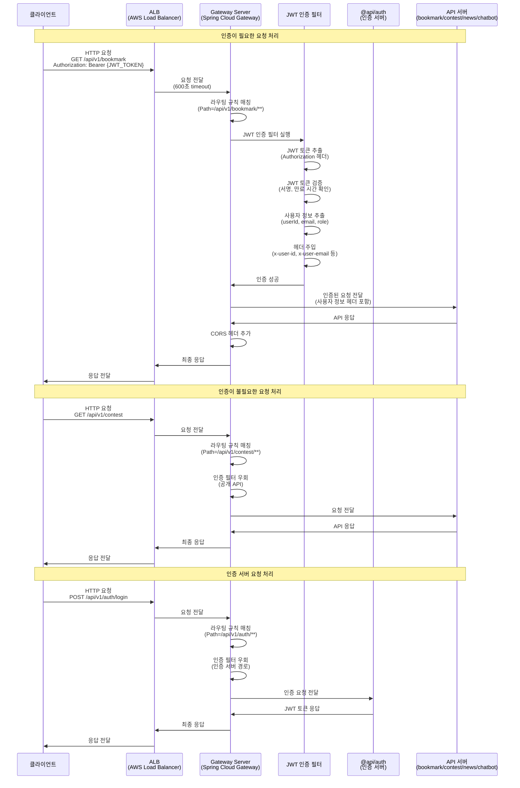
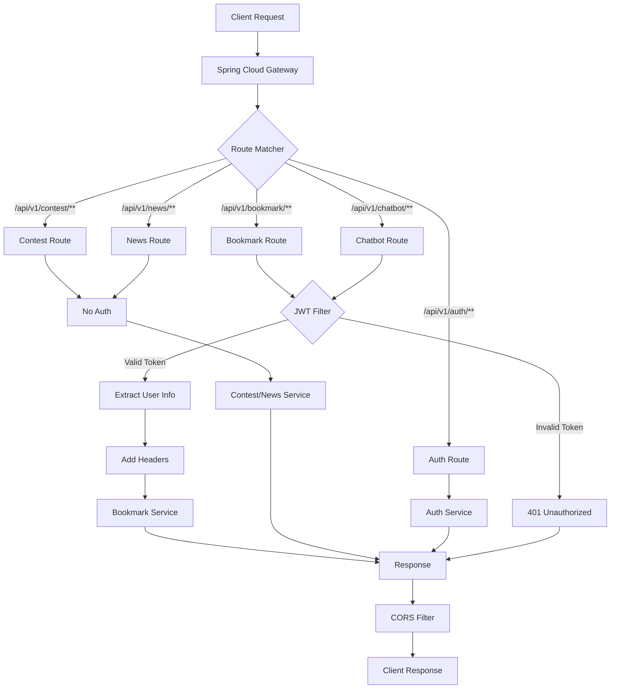
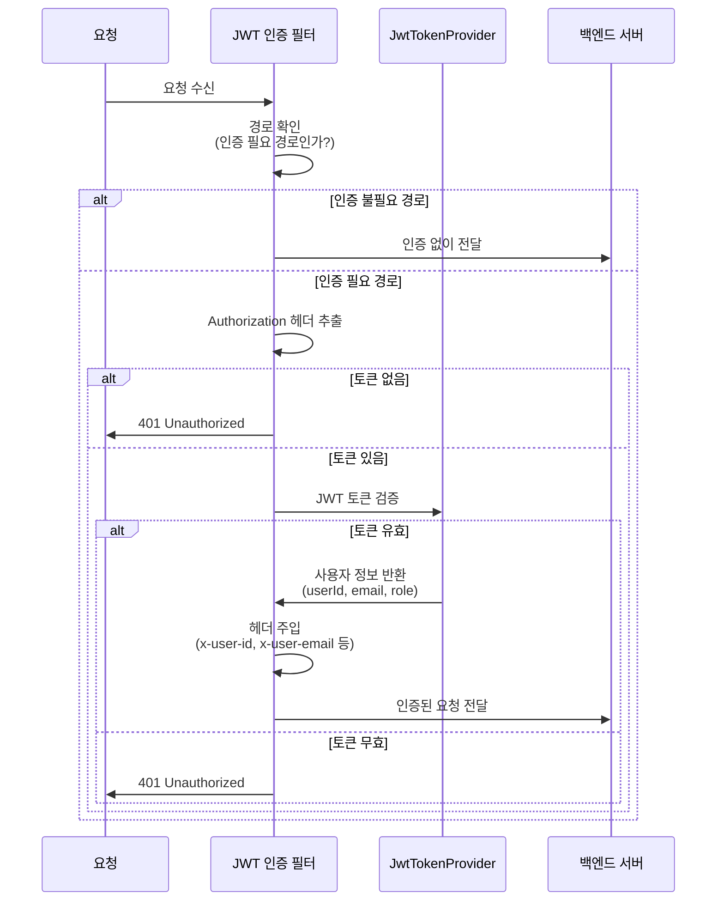
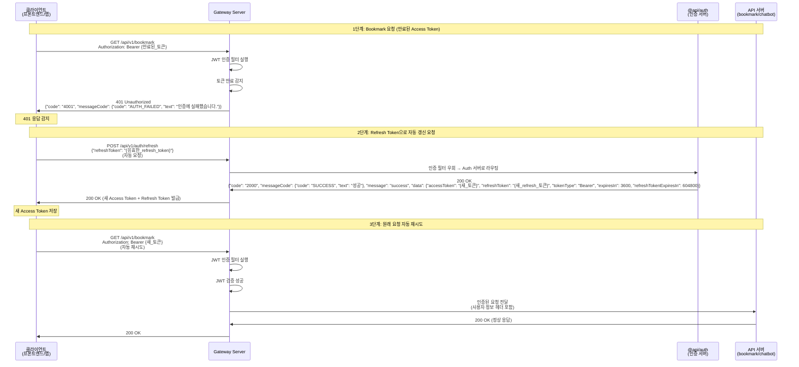
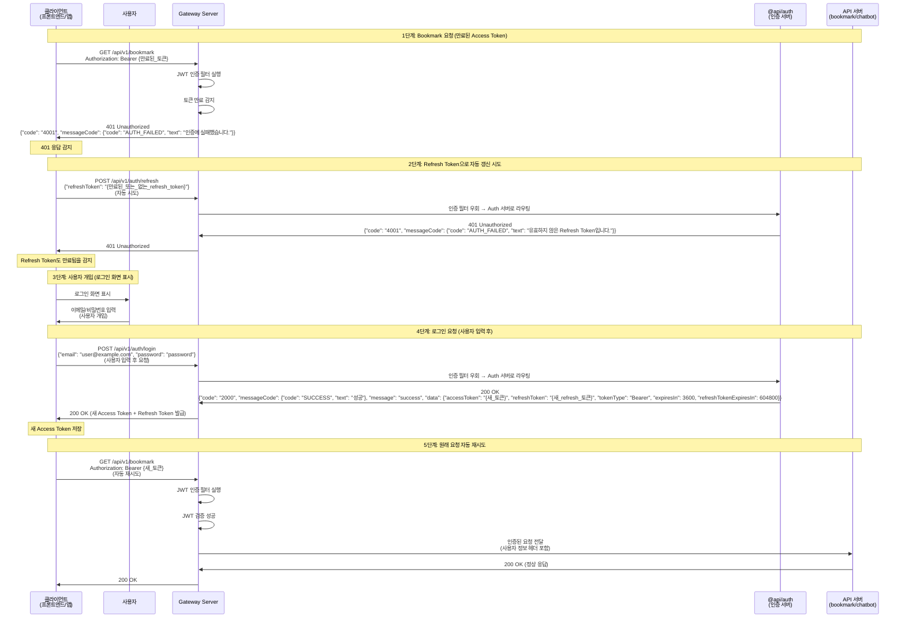
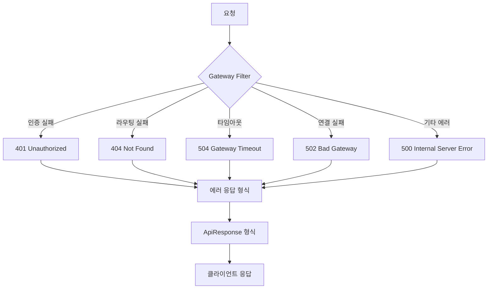

# API Gateway 설계서

**작성 일시**: 2026-01-XX  
**대상**: API Gateway 서버 설계  
**기술 스택**: Spring Cloud Gateway (Netty 기반), Java 21, Spring Boot 4.0.1

## 목차

1. [개요](#개요)
2. [아키텍처 설계](#아키텍처-설계)
3. [라우팅 설계](#라우팅-설계)
4. [인증 및 보안 설계](#인증-및-보안-설계)
5. [연결 풀 및 성능 최적화](#연결-풀-및-성능-최적화)
6. [CORS 설정](#cors-설정)
7. [에러 처리 및 모니터링](#에러-처리-및-모니터링)
8. [설정 파일 설계](#설정-파일-설계)
9. [구현 가이드](#구현-가이드)

---

## 개요

### Gateway 서버의 역할과 목적

API Gateway 서버는 모든 외부 요청을 중앙에서 관리하고, 적절한 백엔드 API 서버로 라우팅하는 역할을 수행합니다.

**주요 기능**:
- **라우팅**: 요청 URI 경로를 기준으로 적절한 API 서버로 요청 전달
- **인증**: JWT 토큰 기반 사용자 인증 및 검증
- **보안**: CORS 정책 관리, 요청 검증
- **성능 최적화**: 연결 풀 관리, 타임아웃 설정
- **에러 처리**: 공통 예외 처리 및 에러 응답 형식 통일

### 인프라 아키텍처

```
┌─────────┐
│ Client  │ (웹 브라우저, 모바일 앱)
└────┬────┘
     │ HTTP/HTTPS
     ▼
┌─────────┐
│   ALB    │ (AWS Application Load Balancer, 600초 timeout)
└────┬────┘
     │
     ▼
┌─────────────────────────────────────────┐
│      Gateway Server (@api/gateway)      │
│  ┌───────────────────────────────────┐  │
│  │  Spring Cloud Gateway (Netty)     │  │
│  │  - 라우팅                         │  │
│  │  - JWT 인증 필터                  │  │
│  │  - CORS 처리                      │  │
│  └───────────────────────────────────┘  │
└────┬─────────────────────────────────────┘
     │
     ├─────────────────────────────────────┐
     │                                     │
     ▼                                     ▼
┌──────────────┐                   ┌──────────────┐
│ @api/bookmark │                   │  @api/auth   │
│  (인증 필요)  │                   │ (인증 불필요) │
└──────────────┘                   └──────────────┘
     │                                     │
     ▼                                     ▼
┌──────────────┐                   ┌──────────────┐
│ @api/contest │                   │ @api/news    │
│  (공개 API)   │                   │ (공개 API)   │
└──────────────┘                   └──────────────┘
     │
     ▼
┌──────────────┐
│ @api/chatbot │
│  (인증 필요)  │
└──────────────┘
```

### 요청 처리 시퀀스



---

## 아키텍처 설계

### 전체 시스템 아키텍처

Gateway 서버는 다음 컴포넌트로 구성됩니다:

```
api/gateway/
├── src/main/java/com/ebson/shrimp/tm/demo/api/gateway/
│   ├── GatewayApplication.java                    # Spring Boot 메인 클래스
│   ├── config/
│   │   ├── GatewayConfig.java                     # Spring Cloud Gateway 라우팅 설정
│   │   ├── SecurityConfig.java                    # 보안 설정 (필요 시)
│   │   └── CorsConfig.java                        # CORS 설정
│   ├── filter/
│   │   ├── JwtAuthenticationGatewayFilter.java    # JWT 인증 Gateway Filter
│   │   └── RequestLoggingFilter.java              # 요청 로깅 필터 (선택)
│   ├── common/
│   │   └── exception/
│   │       └── ApiGatewayExceptionHandler.java    # 공통 예외 처리
│   └── util/
│       └── HeaderUtils.java                       # 헤더 유틸리티
└── src/main/resources/
    ├── application.yml                            # 기본 설정
    ├── application-local.yml                      # 로컬 환경 설정
    ├── application-dev.yml                        # 개발 환경 설정
    ├── application-beta.yml                       # 베타 환경 설정
    └── application-prod.yml                      # 운영 환경 설정
```

### Gateway 서버 내부 구조



### 모듈 의존성 관계

```
api/gateway
├── common-core          # 공통 유틸리티, ApiResponse 등
├── common-security      # JwtTokenProvider, JWT 검증 로직
├── common-exception     # 예외 처리 (선택)
└── (Spring Cloud Gateway 의존성)
    ├── spring-cloud-starter-gateway
    └── reactor-netty-http
```

**의존성 설정** (`build.gradle`):
```gradle
dependencies {
    implementation project(':common-core')
    implementation project(':common-security')
    
    // Spring Cloud Gateway
    implementation 'org.springframework.cloud:spring-cloud-starter-gateway'
    
    // Reactor Netty (Spring Cloud Gateway 기본)
    // Spring Boot 4.0.1에서 자동 포함됨
    
    compileOnly 'org.projectlombok:lombok'
    annotationProcessor 'org.projectlombok:lombok'
}
```

---

## 라우팅 설계

### URI 기반 라우팅 규칙

요청 URI 경로를 기준으로 적절한 API 서버로 라우팅합니다.

#### 서비스별 라우팅 매핑

| 경로 패턴 | 대상 서버 | 인증 필요 | 설명 |
|----------|---------|---------|------|
| `/api/v1/auth/**` | `@api/auth` | ❌ | 인증 서버 (회원가입, 로그인, 토큰 갱신 등) |
| `/api/v1/bookmark/**` | `@api/bookmark` | ✅ | 사용자 북마크 관리 API |
| `/api/v1/contest/**` | `@api/contest` | ❌ | 대회 정보 조회 API (공개) |
| `/api/v1/news/**` | `@api/news` | ❌ | 뉴스 정보 조회 API (공개) |
| `/api/v1/chatbot/**` | `@api/chatbot` | ✅ | RAG 기반 챗봇 API |

#### 라우팅 규칙 상세

**1. 인증 서버 라우팅**
- **경로**: `/api/v1/auth/**`
- **대상**: `@api/auth` 서버
- **인증**: 불필요 (인증 서버 자체이므로)
- **URL Rewrite**: 없음 (경로 그대로 전달)

**2. 북마크 서버 라우팅**
- **경로**: `/api/v1/bookmark/**`
- **대상**: `@api/bookmark` 서버
- **인증**: 필요 (JWT 토큰 검증 필수)
- **URL Rewrite**: 없음 (경로 그대로 전달)

**3. 대회 서버 라우팅**
- **경로**: `/api/v1/contest/**`
- **대상**: `@api/contest` 서버
- **인증**: 불필요 (공개 API)
- **URL Rewrite**: 없음 (경로 그대로 전달)

**4. 뉴스 서버 라우팅**
- **경로**: `/api/v1/news/**`
- **대상**: `@api/news` 서버
- **인증**: 불필요 (공개 API)
- **URL Rewrite**: 없음 (경로 그대로 전달)

**5. 챗봇 서버 라우팅**
- **경로**: `/api/v1/chatbot/**`
- **대상**: `@api/chatbot` 서버
- **인증**: 필요 (JWT 토큰 검증 필수)
- **URL Rewrite**: 없음 (경로 그대로 전달)

### 환경별 백엔드 서비스 URL 설정

백엔드 서비스 URL은 환경별로 다르게 설정됩니다.

#### Local 환경
```yaml
spring:
  cloud:
    gateway:
      routes:
        - id: auth-route
          uri: http://localhost:8082  # api-auth 서버 포트
        - id: bookmark-route
          uri: http://localhost:8083   # api-bookmark 서버 포트
        - id: contest-route
          uri: http://localhost:8084  # api-contest 서버 포트
        - id: news-route
          uri: http://localhost:8085   # api-news 서버 포트
        - id: chatbot-route
          uri: http://localhost:8086  # api-chatbot 서버 포트
```

#### Dev/Beta/Prod 환경
```yaml
spring:
  cloud:
    gateway:
      routes:
        - id: auth-route
          uri: http://api-auth-service:8080
        - id: bookmark-route
          uri: http://api-bookmark-service:8080
        - id: contest-route
          uri: http://api-contest-service:8080
        - id: news-route
          uri: http://api-news-service:8080
        - id: chatbot-route
          uri: http://api-chatbot-service:8080
```

**참고**: 실제 운영 환경에서는 Kubernetes Service 이름이나 로드밸런서 URL을 사용합니다.

---

## 인증 및 보안 설계

### JWT 토큰 기반 인증

Gateway 서버는 `common-security` 모듈의 `JwtTokenProvider`를 활용하여 JWT 토큰을 검증합니다.

#### 인증 통합 방안

**옵션 A: `@api/auth` 모듈을 Gateway 서버로 통합**
- Gateway 서버에 `@api/auth`의 인증 로직을 포함
- `/api/v1/auth/**` 요청은 Gateway 내부에서 처리
- **장점**: 단일 진입점, 인증 로직 중앙화
- **단점**: Gateway 서버 복잡도 증가, 서버 독립성 저하

**옵션 B: `@api/auth` 모듈을 별도 서버로 유지, Gateway에서 JWT 검증만 수행** ⭐ **권장**
- `/api/v1/auth/**` 요청은 `@api/auth` 서버로 라우팅
- 다른 API 요청은 Gateway에서 JWT 검증 후 라우팅
- **장점**: 관심사 분리, 서버 독립성, 확장성
- **단점**: 인증 서버 추가 호출 필요 (하지만 인증 서버는 별도 서버로 유지하는 것이 일반적)

**결정**: **옵션 B 채택**

**근거**:
1. 현재 `@api/auth` 모듈이 독립적으로 존재하며 완전한 기능을 제공
2. 마이크로서비스 아키텍처 원칙에 부합 (서비스 독립성)
3. Gateway는 라우팅과 인증 검증에 집중, 인증 서버는 인증 로직에 집중 (관심사 분리)
4. 향후 인증 서버 확장 시 유연성 확보

#### JWT 인증 필터 설계

Gateway Filter를 구현하여 JWT 토큰을 검증합니다.

**필터 동작 흐름**:



**인증 필요/불필요 경로 구분**:

| 경로 패턴 | 인증 필요 | 설명 |
|----------|---------|------|
| `/api/v1/auth/**` | ❌ | 인증 서버 자체 경로 |
| `/api/v1/bookmark/**` | ✅ | 사용자별 데이터 접근 필요 |
| `/api/v1/contest/**` | ❌ | 공개 API |
| `/api/v1/news/**` | ❌ | 공개 API |
| `/api/v1/chatbot/**` | ✅ | 사용자별 세션 관리 필요 |
| `/actuator/**` | ❌ | 헬스체크 엔드포인트 |

**JWT 토큰 추출**:
- 헤더: `Authorization: Bearer {JWT_TOKEN}`
- 토큰이 없는 경우: 401 Unauthorized 반환

**JWT 토큰 검증**:
- `JwtTokenProvider.validateToken(token)`: 토큰 유효성 검증
- `JwtTokenProvider.getPayloadFromToken(token)`: 사용자 정보 추출

**토큰 만료 시 처리**:
- 토큰이 없거나 만료/무효한 경우: Gateway는 401 Unauthorized를 반환하고, 인증 서버를 자동으로 호출하지 않음
- 응답 형식: `{"code": "4001", "messageCode": {"code": "AUTH_FAILED", "text": "인증에 실패했습니다."}}`
- 토큰 갱신은 클라이언트가 별도로 처리 (Gateway는 검증만 수행)

**토큰 갱신 흐름 (사용자 응답 기준)**:

Gateway는 토큰 검증만 수행하며, 토큰 갱신은 클라이언트가 처리합니다. 다음 두 가지 시나리오가 있습니다:

**시나리오 1: Access Token 만료 (사용자 개입 없음, 클라이언트 자동 처리)**

사용자 개입 없이 클라이언트(프론트엔드/앱)가 자동으로 처리합니다.



**시나리오 2: Refresh Token도 만료/없음 (사용자 개입 필요)**

클라이언트가 자동 처리하다가 Refresh Token 만료 시 사용자 개입이 필요합니다.



**핵심 포인트**:
1. **Gateway는 검증만 수행**: Gateway는 JWT 토큰 검증만 수행하며, 토큰 갱신은 클라이언트가 처리합니다.
2. **시나리오 1 (일반적인 경우)**: Access Token 만료 시 클라이언트가 Refresh Token으로 자동 갱신하여 사용자 개입 없이 처리됩니다.
3. **시나리오 2 (Refresh Token 만료)**: Refresh Token도 만료되었거나 없는 경우, 클라이언트가 사용자에게 로그인 화면을 표시하고 사용자가 이메일/비밀번호를 입력한 후 로그인 요청을 수행합니다.
4. **자동 재시도**: 토큰 갱신 후 클라이언트가 원래 요청을 자동으로 재시도합니다.

**사용자 정보 헤더 주입**:
검증 성공 시 다음 헤더를 추가하여 백엔드 서버로 전달:

```
x-user-id: {userId}
x-user-email: {email}
x-user-role: {role}
```

**참고**: 백엔드 서버에서 `x-user-id` 헤더를 통해 사용자 정보를 확인할 수 있습니다.

#### Gateway Filter 구현 예시

```java
@Component
@RequiredArgsConstructor
@Slf4j
public class JwtAuthenticationGatewayFilter implements GatewayFilter {
    
    private static final String AUTHORIZATION_HEADER = "Authorization";
    private static final String BEARER_PREFIX = "Bearer ";
    private static final String USER_ID_HEADER = "x-user-id";
    private static final String USER_EMAIL_HEADER = "x-user-email";
    private static final String USER_ROLE_HEADER = "x-user-role";
    
    private final JwtTokenProvider jwtTokenProvider;
    private final ObjectMapper objectMapper;
    
    @Override
    public Mono<Void> filter(ServerWebExchange exchange, GatewayFilterChain chain) {
        ServerHttpRequest request = exchange.getRequest();
        
        // 인증 불필요 경로 확인
        String path = request.getURI().getPath();
        if (isPublicPath(path)) {
            return chain.filter(exchange);
        }
        
        // JWT 토큰 추출
        String token = extractToken(request);
        if (token == null) {
            return handleUnauthorized(exchange);
        }
        
        // JWT 토큰 검증
        if (!jwtTokenProvider.validateToken(token)) {
            return handleUnauthorized(exchange);
        }
        
        // 사용자 정보 추출 및 헤더 주입
        try {
            JwtTokenPayload payload = jwtTokenProvider.getPayloadFromToken(token);
            ServerHttpRequest modifiedRequest = request.mutate()
                .header(USER_ID_HEADER, payload.userId())
                .header(USER_EMAIL_HEADER, payload.email())
                .header(USER_ROLE_HEADER, payload.role())
                .build();
            
            return chain.filter(exchange.mutate().request(modifiedRequest).build());
        } catch (Exception e) {
            return handleUnauthorized(exchange);
        }
    }
    
    private boolean isPublicPath(String path) {
        return path.startsWith("/api/v1/auth") ||
               path.startsWith("/api/v1/contest") ||
               path.startsWith("/api/v1/news") ||
               path.startsWith("/actuator");
    }
    
    private String extractToken(ServerHttpRequest request) {
        String bearerToken = request.getHeaders().getFirst(AUTHORIZATION_HEADER);
        if (bearerToken != null && bearerToken.startsWith(BEARER_PREFIX)) {
            return bearerToken.substring(BEARER_PREFIX.length());
        }
        return null;
    }
    
    private Mono<Void> handleUnauthorized(ServerWebExchange exchange) {
        ServerHttpResponse response = exchange.getResponse();
        response.setStatusCode(HttpStatus.UNAUTHORIZED);
        response.getHeaders().add(HttpHeaders.CONTENT_TYPE, MediaType.APPLICATION_JSON_VALUE);
        
        // ApiResponse 형식의 에러 응답 생성
        MessageCode messageCode = new MessageCode(
            ErrorCodeConstants.MESSAGE_CODE_AUTH_FAILED,
            "인증에 실패했습니다."
        );
        ApiResponse<Void> errorResponse = ApiResponse.error(
            ErrorCodeConstants.AUTH_FAILED,
            messageCode
        );
        
        // JSON 응답 작성 (Reactive 방식)
        DataBufferFactory bufferFactory = response.bufferFactory();
        try {
            String jsonResponse = objectMapper.writeValueAsString(errorResponse);
            DataBuffer buffer = bufferFactory.wrap(jsonResponse.getBytes(StandardCharsets.UTF_8));
            return response.writeWith(Mono.just(buffer));
        } catch (Exception e) {
            log.error("Error writing unauthorized response", e);
            return response.setComplete();
        }
    }
```

**필요한 import**:
```java
import com.ebson.shrimp.tm.demo.common.core.constants.ErrorCodeConstants;
import com.ebson.shrimp.tm.demo.common.core.dto.ApiResponse;
import com.ebson.shrimp.tm.demo.common.core.dto.MessageCode;
import com.fasterxml.jackson.databind.ObjectMapper;
import lombok.extern.slf4j.Slf4j;
import org.springframework.core.io.buffer.DataBuffer;
import org.springframework.core.io.buffer.DataBufferFactory;
import org.springframework.http.HttpHeaders;
import org.springframework.http.HttpStatus;
import org.springframework.http.MediaType;
import reactor.core.publisher.Mono;
import java.nio.charset.StandardCharsets;
```

**참고**: 
- Gateway는 Reactive 기반이므로 `@ControllerAdvice`를 사용할 수 없습니다.
- `handleUnauthorized` 메서드에서 직접 `ApiResponse` 형식의 JSON 응답을 작성합니다.
- `ObjectMapper`는 Spring Bean으로 주입받아 사용합니다.
}
```

---

## 연결 풀 및 성능 최적화

### Connection reset by peer 방지

Connection reset by peer 에러는 주로 다음과 같은 원인으로 발생합니다:
1. 백엔드 서비스 연결 타임아웃
2. 연결 풀 설정 부적절
3. Keep-alive 시간 불일치

### HTTP 클라이언트 연결 풀 설정

Spring Cloud Gateway는 Reactor Netty를 사용하므로, Reactor Netty의 연결 풀 설정을 최적화합니다.

#### 권장 설정 값

```yaml
spring:
  cloud:
    gateway:
      httpclient:
        pool:
          # 연결 풀 설정
          max-idle-time: 30000        # 30초 (백엔드 keep-alive 60초보다 짧게)
          max-life-time: 300000       # 5분 (300초)
          max-connections: 500        # 최대 연결 수
          acquire-timeout: 45000      # 연결 획득 타임아웃 (45초)
          pending-acquire-timeout: 60000  # 대기 타임아웃 (60초)
        # 연결 타임아웃
        connection-timeout: 30000     # 연결 타임아웃 (30초)
        # 소켓 타임아웃
        response-timeout: 60000       # 응답 타임아웃 (60초, 백엔드 타임아웃보다 길게)
```

#### 설정 근거

1. **max-idle-time: 30초**
   - 백엔드 서비스의 keep-alive 시간(60초)보다 짧게 설정
   - 유휴 연결을 미리 종료하여 Connection reset 에러 방지

2. **max-life-time: 300초 (5분)**
   - 연결의 최대 생명주기
   - 오래된 연결을 주기적으로 갱신하여 안정성 확보

3. **max-connections: 500**
   - 동시 처리 가능한 최대 연결 수
   - 서버 리소스에 따라 조정 가능

4. **connection-timeout: 30초**
   - 백엔드 서버와의 연결 시도 타임아웃
   - 적절한 타임아웃으로 빠른 실패 처리

5. **response-timeout: 60초**
   - 백엔드 서버의 응답 대기 타임아웃
   - 백엔드 서버의 타임아웃보다 길게 설정 (백엔드가 30초면 Gateway는 60초)

### Netty 서버 설정

```yaml
server:
  netty:
    connection-timeout: 3000  # 3초 (클라이언트 연결 타임아웃)
```

**참고**: Spring Boot 4.0.1에서는 Reactor Netty가 기본으로 사용되며, 별도의 설정이 필요 없습니다.

### 성능 튜닝 가이드

1. **연결 풀 모니터링**
   - 연결 풀 상태를 주기적으로 모니터링
   - 연결 수, 유휴 연결 수, 대기 중인 요청 수 확인

2. **타임아웃 조정**
   - 백엔드 서비스의 실제 응답 시간에 맞춰 조정
   - 너무 짧으면 타임아웃 에러, 너무 길면 리소스 낭비

3. **환경별 설정**
   - Local/Dev: 개발 편의성을 위해 타임아웃을 길게 설정
   - Beta/Prod: 실제 운영 환경에 맞게 최적화

---

## CORS 설정

### 환경별 CORS 정책

CORS 설정은 환경별로 다르게 적용됩니다.

#### Local 환경 (개발 편의성 우선)

```yaml
spring:
  cloud:
    gateway:
      globalcors:
        cors-configurations:
          '[/**]':
            allowCredentials: true
            allowedOriginPatterns:
              - "http://localhost:*"
              - "http://127.0.0.1:*"
            allowedHeaders: "*"
            allowedMethods: [GET, POST, PUT, PATCH, DELETE, OPTIONS, HEAD]
            maxAge: 3600
      default-filters:
        # 외부 API 연동 시 중복 헤더 제거
        - DedupeResponseHeader=Access-Control-Allow-Origin, RETAIN_LAST
```

#### Dev 환경 (개발 편의성 + 보안)

```yaml
spring:
  cloud:
    gateway:
      globalcors:
        cors-configurations:
          '[/**]':
            allowCredentials: true
            allowedOriginPatterns:
              - "https://dev.example.com"
              - "http://localhost:*"
              - "http://127.0.0.1:*"
            allowedHeaders: "*"
            allowedMethods: [GET, POST, PUT, PATCH, DELETE, OPTIONS, HEAD]
            maxAge: 3600
      default-filters:
        - DedupeResponseHeader=Access-Control-Allow-Origin, RETAIN_LAST
```

#### Beta/Prod 환경 (보안 우선)

```yaml
spring:
  cloud:
    gateway:
      globalcors:
        cors-configurations:
          '[/**]':
            allowCredentials: true
            allowedOriginPatterns:
              - "https://beta.example.com"
              - "https://example.com"
            allowedHeaders: "*"
            allowedMethods: [GET, POST, PUT, PATCH, DELETE, OPTIONS, HEAD]
            maxAge: 3600
```

### CORS 설정 가이드라인

1. **allowCredentials와 allowedOriginPatterns 조합**
   - `allowCredentials: true`일 때는 `allowedOrigins: "*"` 사용 불가
   - 구체적인 도메인 목록 또는 `allowedOriginPatterns` 사용 필요

2. **외부 API 연동 시 중복 헤더 처리**
   - Global CORS와 외부 API 응답 헤더가 충돌할 수 있음
   - `DedupeResponseHeader` 필터로 중복 헤더 제거

3. **환경별 차별화**
   - Local/Dev: 개발 편의성을 위해 넓은 범위 허용
   - Beta/Prod: 보안을 위해 제한적인 도메인만 허용

---

## 에러 처리 및 모니터링

### 공통 예외 처리 전략

Gateway 서버에서 발생하는 예외를 공통으로 처리합니다.

#### 예외 처리 흐름



#### 에러 응답 형식

모든 에러 응답은 `ApiResponse` 형식을 따릅니다:

```json
{
  "code": "4001",
  "messageCode": {
    "code": "UNAUTHORIZED",
    "text": "인증이 필요합니다"
  },
  "message": "JWT token is missing or invalid",
  "data": null
}
```

#### 주요 에러 코드

| HTTP 상태 | 에러 코드 | 설명 |
|----------|---------|------|
| 401 | `4001` | 인증 실패 (JWT 토큰 없음 또는 무효) |
| 404 | `4004` | 라우팅 실패 (경로를 찾을 수 없음) |
| 502 | `5002` | 백엔드 서버 연결 실패 |
| 504 | `5004` | 백엔드 서버 타임아웃 |
| 500 | `5000` | 내부 서버 오류 |

### 로깅 전략

#### 환경별 로그 레벨

- **Local/Dev**: DEBUG 레벨 상세 로깅
- **Beta**: INFO 레벨 일반 로깅
- **Prod**: WARN 레벨 에러 로깅

#### 로깅 항목

1. **요청 로깅**
   - 요청 URI, HTTP 메서드, 헤더 (민감 정보 제외)
   - 요청 시간

2. **인증 로깅**
   - 인증 성공/실패
   - JWT 토큰 검증 결과

3. **라우팅 로깅**
   - 라우팅 규칙 매칭 결과
   - 백엔드 서버 URL

4. **에러 로깅**
   - 에러 발생 시 상세 스택 트레이스
   - 에러 코드 및 메시지

### 모니터링 포인트

1. **성능 모니터링**
   - 요청 처리 시간
   - 연결 풀 상태
   - 타임아웃 발생 빈도

2. **에러 모니터링**
   - 에러 발생 빈도
   - 에러 유형별 통계
   - 백엔드 서버 상태

3. **인증 모니터링**
   - 인증 성공/실패 비율
   - JWT 토큰 검증 실패 원인

---

## 설정 파일 설계

### application.yml (기본 설정)

```yaml
spring:
  application:
    name: gateway-api
  profiles:
    include:
      - common-core
      - domain-api
      - mongodb-domain
  
  cloud:
    gateway:
      # 라우팅 설정
      routes:
        - id: auth-route
          uri: ${gateway.routes.auth.uri:http://localhost:8082}
          predicates:
            - Path=/api/v1/auth/**
          filters:
            - name: JwtAuthentication
              args:
                requireAuth: false
        
        - id: bookmark-route
          uri: ${gateway.routes.bookmark.uri:http://localhost:8083}
          predicates:
            - Path=/api/v1/bookmark/**
          filters:
            - name: JwtAuthentication
              args:
                requireAuth: true
        
        - id: contest-route
          uri: ${gateway.routes.contest.uri:http://localhost:8084}
          predicates:
            - Path=/api/v1/contest/**
          filters:
            - name: JwtAuthentication
              args:
                requireAuth: false
        
        - id: news-route
          uri: ${gateway.routes.news.uri:http://localhost:8085}
          predicates:
            - Path=/api/v1/news/**
          filters:
            - name: JwtAuthentication
              args:
                requireAuth: false
        
        - id: chatbot-route
          uri: ${gateway.routes.chatbot.uri:http://localhost:8086}
          predicates:
            - Path=/api/v1/chatbot/**
          filters:
            - name: JwtAuthentication
              args:
                requireAuth: true
      
      # HTTP 클라이언트 연결 풀 설정
      httpclient:
        pool:
          max-idle-time: 30000
          max-life-time: 300000
          max-connections: 500
          acquire-timeout: 45000
          pending-acquire-timeout: 60000
        connection-timeout: 30000
        response-timeout: 60000
      
      # Global CORS 설정
      globalcors:
        cors-configurations:
          '[/**]':
            allowCredentials: true
            allowedOriginPatterns:
              - "http://localhost:*"
              - "http://127.0.0.1:*"
            allowedHeaders: "*"
            allowedMethods: [GET, POST, PUT, PATCH, DELETE, OPTIONS, HEAD]
            maxAge: 3600
      
      # Global default-filters
      default-filters:
        - DedupeResponseHeader=Access-Control-Allow-Origin, RETAIN_LAST

server:
  port: 8081
  netty:
    connection-timeout: 3000

# JWT 설정 (common-security 모듈 사용)
jwt:
  secret-key: ${JWT_SECRET_KEY:default-secret-key-change-in-production-minimum-256-bits}
  access-token-validity-minutes: 60
  refresh-token-validity-days: 7

# 로깅 설정
logging:
  level:
    root: INFO
    com.ebson.shrimp.tm.demo.api.gateway: DEBUG
```

### application-local.yml

```yaml
spring:
  config:
    activate:
      on-profile: local

server:
  port: 8081

gateway:
  routes:
    auth:
      uri: http://localhost:8082
    bookmark:
      uri: http://localhost:8083
    contest:
      uri: http://localhost:8084
    news:
      uri: http://localhost:8085
    chatbot:
      uri: http://localhost:8086

logging:
  level:
    com.ebson.shrimp.tm.demo.api.gateway: DEBUG
```

### application-dev.yml

```yaml
spring:
  config:
    activate:
      on-profile: dev

gateway:
  routes:
    auth:
      uri: http://api-auth-service:8080
    bookmark:
      uri: http://api-bookmark-service:8080
    contest:
      uri: http://api-contest-service:8080
    news:
      uri: http://api-news-service:8080
    chatbot:
      uri: http://api-chatbot-service:8080

logging:
  level:
    com.ebson.shrimp.tm.demo.api.gateway: INFO
```

### application-beta.yml / application-prod.yml

```yaml
spring:
  config:
    activate:
      on-profile: beta  # 또는 prod

gateway:
  routes:
    auth:
      uri: http://api-auth-service:8080
    bookmark:
      uri: http://api-bookmark-service:8080
    contest:
      uri: http://api-contest-service:8080
    news:
      uri: http://api-news-service:8080
    chatbot:
      uri: http://api-chatbot-service:8080

logging:
  level:
    com.ebson.shrimp.tm.demo.api.gateway: WARN
```

---

## 구현 가이드

### 필수 컴포넌트 목록

1. **GatewayApplication.java**
   - Spring Boot 메인 클래스
   - `@SpringBootApplication` 어노테이션

2. **GatewayConfig.java**
   - Spring Cloud Gateway 라우팅 설정
   - 커스텀 필터 등록

3. **JwtAuthenticationGatewayFilter.java**
   - JWT 인증 Gateway Filter 구현
   - `common-security` 모듈의 `JwtTokenProvider` 활용

4. **ApiGatewayExceptionHandler.java**
   - 공통 예외 처리 핸들러
   - `common-exception` 모듈 활용 (선택)

### 구현 단계

#### 1단계: 기본 설정

1. `build.gradle`에 Spring Cloud Gateway 의존성 추가
2. `application.yml`에 기본 라우팅 설정 추가
3. Gateway 서버 실행 확인

#### 2단계: JWT 인증 필터 구현

1. `JwtAuthenticationGatewayFilter` 구현
2. `common-security` 모듈 의존성 확인
3. 인증 필요/불필요 경로 구분 로직 구현
4. 사용자 정보 헤더 주입 로직 구현

#### 3단계: 연결 풀 설정

1. `application.yml`에 연결 풀 설정 추가
2. 환경별 타임아웃 설정 조정
3. Connection reset by peer 에러 테스트

#### 4단계: CORS 설정

1. Global CORS 설정 추가
2. 환경별 CORS 정책 설정
3. 외부 API 연동 시 중복 헤더 제거 필터 추가

#### 5단계: 에러 처리

1. `ApiGatewayExceptionHandler` 구현
2. 공통 에러 응답 형식 적용
3. 에러 로깅 추가

### 테스트 방법

#### 1. 라우팅 테스트

```bash
# 인증 서버 라우팅 테스트
curl http://localhost:8081/api/v1/auth/login

# 북마크 서버 라우팅 테스트 (인증 필요)
curl -H "Authorization: Bearer {JWT_TOKEN}" http://localhost:8081/api/v1/bookmark

# 대회 서버 라우팅 테스트 (공개 API)
curl http://localhost:8081/api/v1/contest
```

#### 2. 인증 필터 테스트

```bash
# 인증 없이 인증 필요 경로 접근 (401 예상)
curl http://localhost:8081/api/v1/bookmark

# 유효한 JWT 토큰으로 접근 (200 예상)
curl -H "Authorization: Bearer {VALID_JWT_TOKEN}" http://localhost:8081/api/v1/bookmark

# 무효한 JWT 토큰으로 접근 (401 예상)
curl -H "Authorization: Bearer invalid_token" http://localhost:8081/api/v1/bookmark
```

#### 3. 연결 풀 테스트

- 백엔드 서버를 일시적으로 중단하여 연결 실패 테스트
- 타임아웃 설정 확인
- Connection reset by peer 에러 발생 여부 확인

#### 4. CORS 테스트

- 브라우저에서 CORS preflight 요청 테스트
- 다른 도메인에서 API 호출 테스트
- CORS 헤더 확인

### 구현 우선순위

1. **필수 구현 항목** (1단계)
   - 기본 라우팅 설정
   - JWT 인증 필터
   - 연결 풀 설정

2. **권장 구현 항목** (2단계)
   - CORS 설정
   - 에러 처리
   - 로깅

3. **선택적 구현 항목** (3단계)
   - 요청 로깅 필터
   - 성능 모니터링
   - 헬스체크 엔드포인트

---

## 참고 자료

### 공식 문서
- [Spring Cloud Gateway 공식 문서](https://docs.spring.io/spring-cloud-gateway/docs/current/reference/html/)
- [Reactor Netty 공식 문서](https://projectreactor.io/docs/netty/release/reference/index.html)
- [Spring Boot 공식 문서](https://docs.spring.io/spring-boot/docs/current/reference/html/)

### 프로젝트 내 참고 문서
- `api/gateway/REF.md`: Saturn Gateway Server 아키텍처 참고
- `docs/step2/1. api-endpoint-design.md`: API 엔드포인트 설계
- `docs/step6/spring-security-auth-design-guide.md`: Spring Security 설계 가이드
- `docs/step9/contest-news-api-design.md`: Contest/News API 설계
- `docs/step12/rag-chatbot-design.md`: Chatbot API 설계
- `docs/step13/user-bookmark-feature-design.md`: Bookmark API 설계

---

## 부록

### A. Gateway Filter vs Spring Security Filter

Spring Cloud Gateway는 Reactive 기반이므로, 기존 Spring Security의 Servlet 기반 필터를 직접 사용할 수 없습니다. 대신 Gateway Filter를 구현해야 합니다.

**차이점**:
- **Spring Security Filter**: Servlet 기반, 동기 처리
- **Gateway Filter**: Reactive 기반, 비동기 처리 (Mono/Flux)

**해결 방법**:
- `common-security` 모듈의 `JwtTokenProvider`는 동기 메서드이므로 Gateway Filter에서 직접 사용 가능
- Gateway Filter는 `GatewayFilter` 인터페이스를 구현

### B. URL Rewrite 고려사항

현재 설계에서는 URL Rewrite를 사용하지 않습니다. 모든 요청은 경로 그대로 백엔드 서버로 전달됩니다.

**URL Rewrite가 필요한 경우**:
- 백엔드 서버의 API 경로가 다른 경우
- API 버전 관리가 필요한 경우

**예시**:
```yaml
filters:
  - RewritePath=/api/v1/bookmark/(?<segment>.*), /bookmark/$\{segment}
```

### C. 서비스 디스커버리

현재 설계에서는 정적 라우팅을 사용합니다. 향후 서비스 디스커버리(Eureka, Consul 등)를 도입할 경우, `uri: lb://service-name` 형식으로 변경 가능합니다.

---

**작성 완료일**: 2026-01-XX  
**검토 필요**: 인증 통합 방안, 연결 풀 설정 값, CORS 정책
