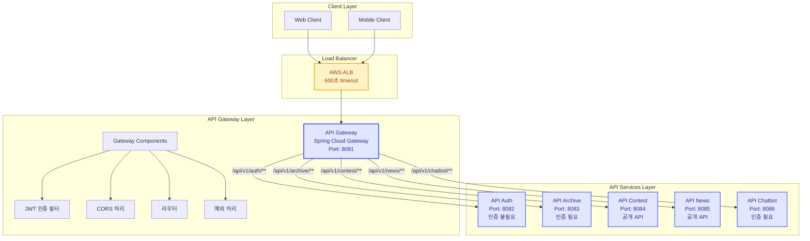
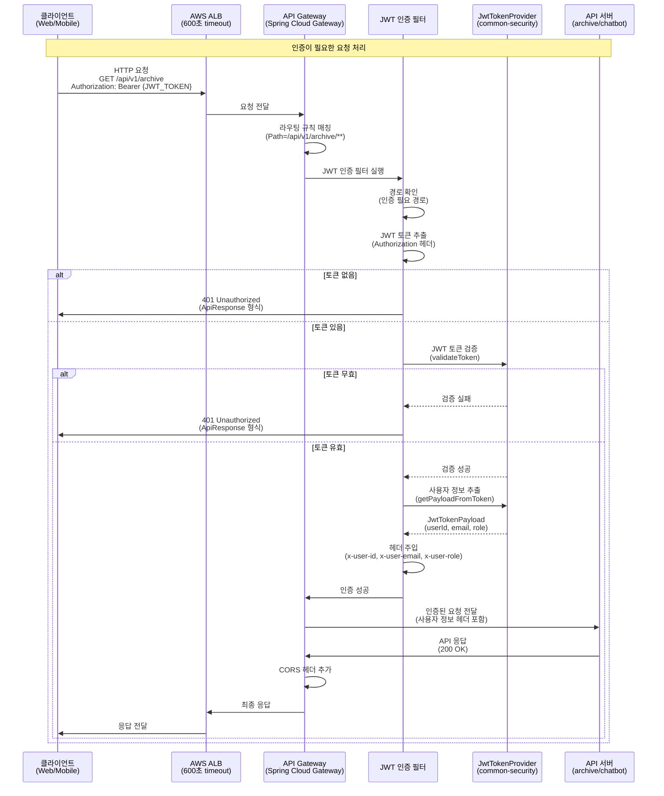
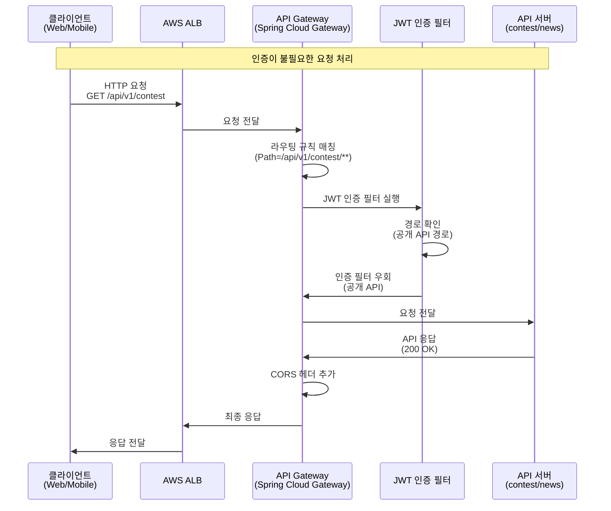
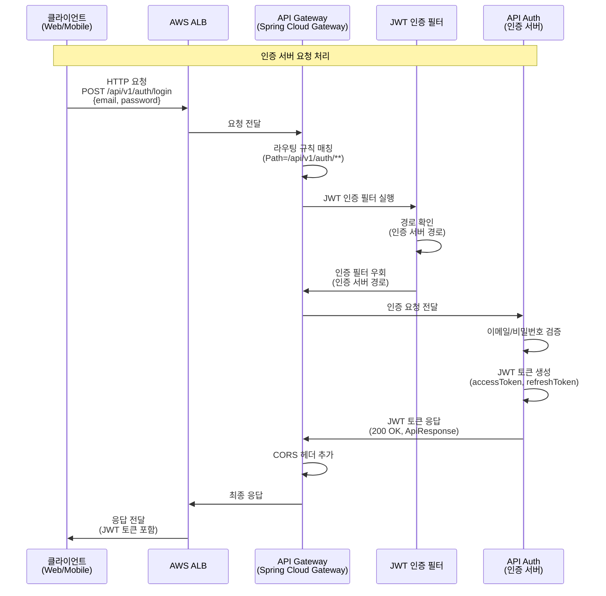
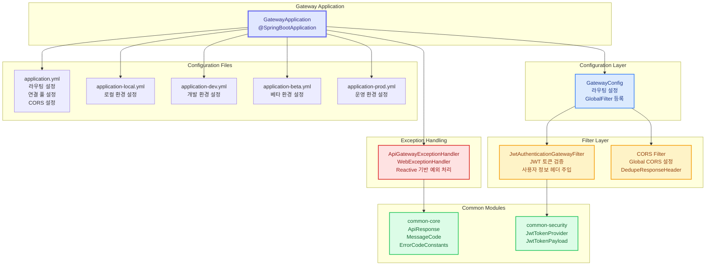
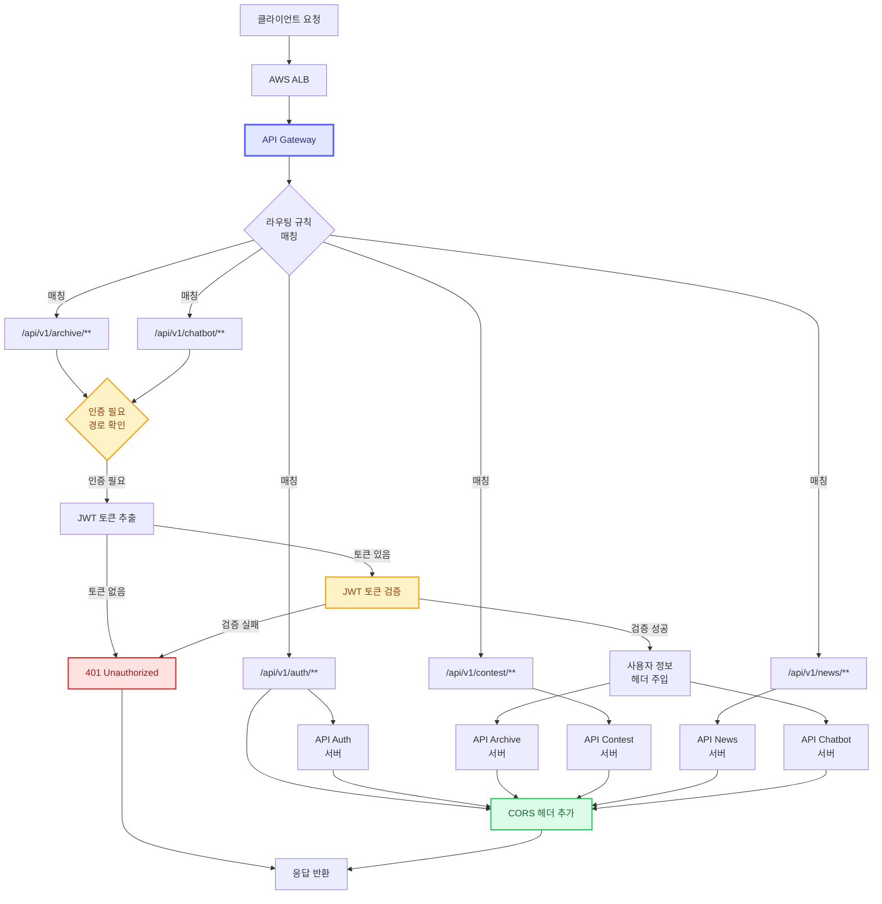
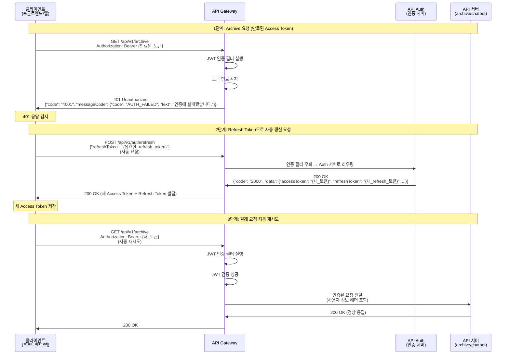
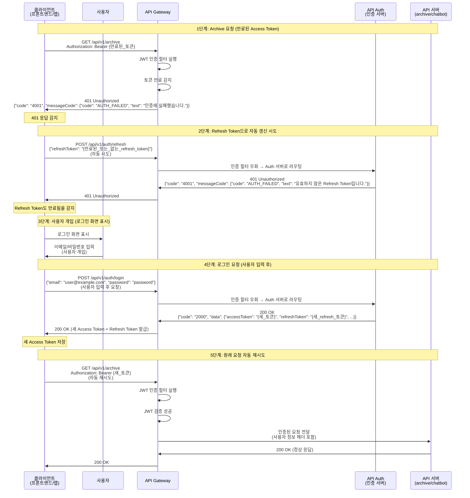
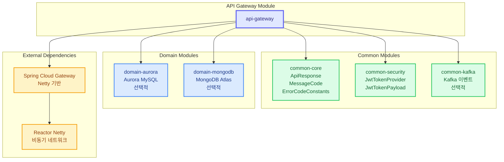

# API Gateway Mermaid 다이어그램

이 문서는 API Gateway의 아키텍처와 동작을 시각화한 Mermaid 다이어그램 모음입니다.

## 1. 전체 아키텍처 다이어그램

## 2. 요청 처리 시퀀스 다이어그램

### 2.1 인증이 필요한 요청 처리

### 2.2 인증이 불필요한 요청 처리

### 2.3 인증 서버 요청 처리

## 3. Gateway 내부 구조 다이어그램

## 4. 라우팅 규칙 플로우 다이어그램

## 5. 토큰 갱신 시나리오 다이어그램

### 5.1 Access Token 만료 (클라이언트 자동 처리)

### 5.2 Refresh Token도 만료 (사용자 개입 필요)

## 6. 모듈 의존성 다이어그램

## 사용 방법

1. **Mermaid Live Editor**: https://mermaid.live 에 접속
2. 위의 다이어그램 코드를 복사하여 붙여넣기
3. 다이어그램이 자동으로 렌더링됩니다
4. 필요시 PNG, SVG, 또는 다이어그램 코드를 다운로드할 수 있습니다

## 참고 문서

- [Gateway 설계서](gateway-design.md)
- [Gateway 구현 계획](gateway-implementation-plan.md)
- [Gateway API 모듈 README](../../api/gateway/README.md)

