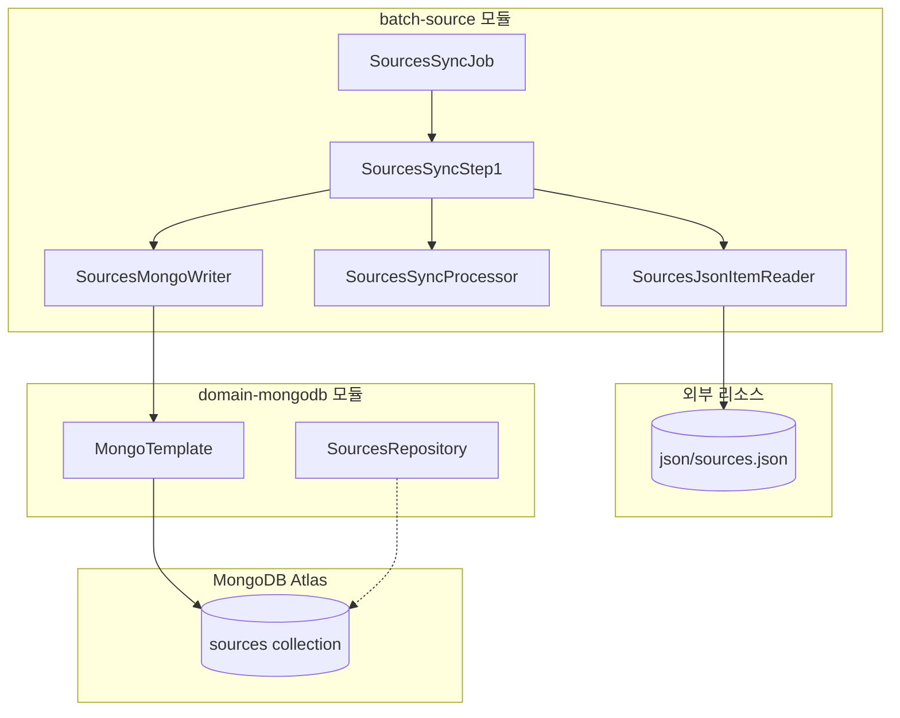
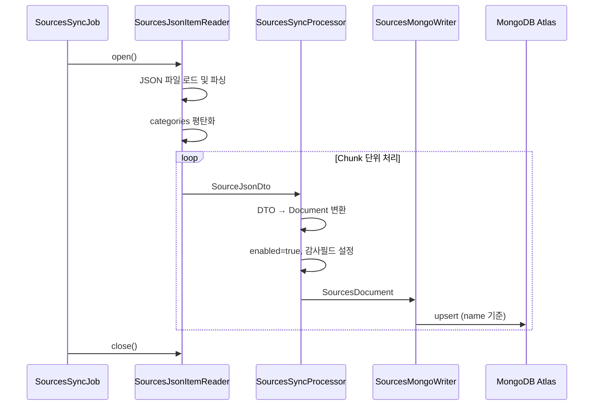
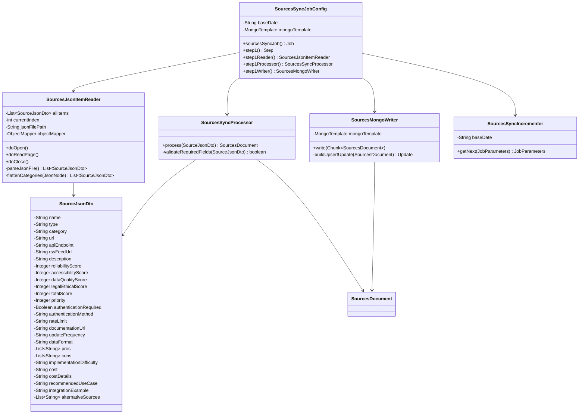

# Sources 동기화 Batch Job 기술 설계서

**작성 일시**: 2026-01-20  
**버전**: 1.2  
**작성자**: Backend Engineer

---

## 1. 개요

### 1.1 목적

`json/sources.json` 파일에 정의된 모든 Source 데이터를 MongoDB Atlas Cluster의 `sources` 컬렉션으로 동기화하는 Spring Batch Job을 설계합니다.

### 1.2 범위

- JSON 파일 읽기 및 파싱
- 데이터 변환 (JSON → SourcesDocument)
- MongoDB UPSERT (name 기준 중복 처리)
- 감사 필드 자동 설정

### 1.3 관련 문서

| 문서 | 경로 |
|------|------|
| MongoDB 스키마 설계 | `docs/step1/2. mongodb-schema-design.md` |
| SourcesDocument 클래스 | `domain/mongodb/.../document/SourcesDocument.java` |
| 기존 Batch Job 패턴 | `batch/source/.../googledevelopers/jobconfig/` |

---

## 2. 시스템 아키텍처

### 2.1 컴포넌트 다이어그램



### 2.2 데이터 흐름



---

## 3. 배치 Job 설계

### 3.1 Job 구성

| 항목 | 값 |
|------|-----|
| Job 이름 | `sources.sync.job` |
| Step 구성 | 단일 Step (SourcesSyncStep1) |
| Chunk Size | 10 |
| 동기화 전략 | UPSERT (name 필드 기준) |

### 3.2 Reader 설계

#### 3.2.1 입력 데이터 형식

```json
{
  "categories": [
    {
      "category": "개발자 대회 정보",
      "sources": [
        { "name": "Codeforces API", "type": "API", ... }
      ]
    },
    {
      "category": "최신 IT 테크 뉴스 정보",
      "sources": [...]
    }
  ]
}
```

#### 3.2.2 읽기 전략

1. Job 시작 시 `json/sources.json` 파일 1회 로드
2. `categories` 배열 순회하여 모든 `sources` 추출
3. 각 source에 상위 `category` 필드 매핑
4. 평탄화된 Source 리스트를 Chunk 단위로 반환

#### 3.2.3 SourceJsonDto 클래스

```java
// batch/source/.../domain/sources/dto/SourceJsonDto.java
@Getter
@Setter
@NoArgsConstructor
@AllArgsConstructor
@Builder
public class SourceJsonDto {
    private String name;
    private String type;
    private String category;              // 상위 카테고리에서 매핑
    private String url;
    private String apiEndpoint;           // JSON: api_endpoint
    private String rssFeedUrl;            // JSON: rss_feed_url
    private String description;
    private Integer reliabilityScore;     // JSON: reliability_score
    private Integer accessibilityScore;   // JSON: accessibility_score
    private Integer dataQualityScore;     // JSON: data_quality_score
    private Integer legalEthicalScore;    // JSON: legal_ethical_score
    private Integer totalScore;           // JSON: total_score
    private Integer priority;
    private Boolean authenticationRequired; // JSON: authentication_required
    private String authenticationMethod;  // JSON: authentication_method
    private String rateLimit;             // JSON: rate_limit
    private String documentationUrl;      // JSON: documentation_url
    private String updateFrequency;       // JSON: update_frequency
    private String dataFormat;            // JSON: data_format
    private List<String> pros;            // JSON: pros
    private List<String> cons;            // JSON: cons
    private String implementationDifficulty; // JSON: implementation_difficulty
    private String cost;                  // JSON: cost
    private String costDetails;           // JSON: cost_details
    private String recommendedUseCase;    // JSON: recommended_use_case
    private String integrationExample;    // JSON: integration_example
    private List<String> alternativeSources; // JSON: alternative_sources
}
```

### 3.3 Processor 설계

#### 3.3.1 변환 로직

| 소스 (SourceJsonDto) | 대상 (SourcesDocument) | 변환 규칙 |
|---------------------|------------------------|----------|
| name | name | 그대로 복사 |
| type | type | 그대로 복사 |
| category | category | 그대로 복사 |
| url | url | 그대로 복사 |
| apiEndpoint | apiEndpoint | 그대로 복사 |
| rssFeedUrl | rssFeedUrl | 그대로 복사 |
| description | description | 그대로 복사 |
| reliabilityScore | reliabilityScore | 그대로 복사 |
| accessibilityScore | accessibilityScore | 그대로 복사 |
| dataQualityScore | dataQualityScore | 그대로 복사 |
| legalEthicalScore | legalEthicalScore | 그대로 복사 |
| totalScore | totalScore | 그대로 복사 |
| priority | priority | 그대로 복사 |
| authenticationRequired | authenticationRequired | 그대로 복사 |
| authenticationMethod | authenticationMethod | 그대로 복사 |
| rateLimit | rateLimit | 그대로 복사 |
| documentationUrl | documentationUrl | 그대로 복사 |
| updateFrequency | updateFrequency | 그대로 복사 |
| dataFormat | dataFormat | 그대로 복사 |
| pros | pros | 그대로 복사 |
| cons | cons | 그대로 복사 |
| implementationDifficulty | implementationDifficulty | 그대로 복사 |
| cost | cost | 그대로 복사 |
| costDetails | costDetails | 그대로 복사 |
| recommendedUseCase | recommendedUseCase | 그대로 복사 |
| integrationExample | integrationExample | 그대로 복사 |
| alternativeSources | alternativeSources | 그대로 복사 |
| - | enabled | 기본값 `true` 설정 |
| - | createdAt | `LocalDateTime.now()` |
| - | createdBy | `"batch-system"` |
| - | updatedAt | `LocalDateTime.now()` |
| - | updatedBy | `"batch-system"` |

#### 3.3.2 필수 필드 검증

- `name`: null 또는 빈 문자열이면 Skip
- `type`: null 또는 빈 문자열이면 Skip
- `category`: null 또는 빈 문자열이면 Skip

### 3.4 Writer 설계

#### 3.4.1 UPSERT 전략

`MongoTemplate.upsert()` 메서드를 사용하여 `name` 필드 기준으로 UPSERT 수행:

```pseudocode
FOR each SourcesDocument in chunk:
    Query query = Query.query(Criteria.where("name").is(document.getName()))
    Update update = new Update()
        .set("type", document.getType())
        .set("category", document.getCategory())
        .set("url", document.getUrl())
        .set("api_endpoint", document.getApiEndpoint())
        .set("rss_feed_url", document.getRssFeedUrl())
        .set("description", document.getDescription())
        .set("reliability_score", document.getReliabilityScore())
        .set("accessibility_score", document.getAccessibilityScore())
        .set("data_quality_score", document.getDataQualityScore())
        .set("legal_ethical_score", document.getLegalEthicalScore())
        .set("total_score", document.getTotalScore())
        .set("priority", document.getPriority())
        .set("authentication_required", document.getAuthenticationRequired())
        .set("authentication_method", document.getAuthenticationMethod())
        .set("rate_limit", document.getRateLimit())
        .set("documentation_url", document.getDocumentationUrl())
        .set("update_frequency", document.getUpdateFrequency())
        .set("data_format", document.getDataFormat())
        .set("pros", document.getPros())
        .set("cons", document.getCons())
        .set("implementation_difficulty", document.getImplementationDifficulty())
        .set("cost", document.getCost())
        .set("cost_details", document.getCostDetails())
        .set("recommended_use_case", document.getRecommendedUseCase())
        .set("integration_example", document.getIntegrationExample())
        .set("alternative_sources", document.getAlternativeSources())
        .set("enabled", document.getEnabled())
        .set("updated_at", document.getUpdatedAt())
        .set("updated_by", document.getUpdatedBy())
        .setOnInsert("created_at", document.getCreatedAt())
        .setOnInsert("created_by", document.getCreatedBy())
    
    mongoTemplate.upsert(query, update, SourcesDocument.class)
END FOR
```

#### 3.4.2 MongoDB 연동 방식

- **MongoTemplate 직접 사용**: UPSERT를 위해 `MongoTemplate.upsert()` 활용
- **SourcesRepository 불필요**: 단순 CRUD가 아닌 UPSERT 로직이 필요하므로 Repository 대신 Template 사용

---

## 4. 클래스 설계

### 4.1 패키지 구조

```
batch/source/src/main/java/com/ebson/shrimp/tm/demo/batch/source/
├── common/
│   └── Constants.java                    # [수정] SOURCES_SYNC 상수 추가
└── domain/
    └── sources/
        └── sync/
            ├── dto/
            │   └── SourceJsonDto.java    # [신규] JSON 파싱용 DTO
            ├── incrementer/
            │   └── SourcesSyncIncrementer.java  # [신규] Job Incrementer
            ├── jobconfig/
            │   └── SourcesSyncJobConfig.java    # [신규] Job 설정
            ├── processor/
            │   └── SourcesSyncProcessor.java    # [신규] DTO→Document 변환
            ├── reader/
            │   └── SourcesJsonItemReader.java   # [신규] JSON 파일 읽기
            └── writer/
                └── SourcesMongoWriter.java      # [신규] MongoDB UPSERT
```

### 4.2 클래스 다이어그램



### 4.3 주요 클래스 명세

#### 4.3.1 Constants.java (수정)

```java
// 추가할 상수
public final static String SOURCES_SYNC = "sources.sync.job";
```

#### 4.3.2 SourcesSyncJobConfig.java

| 메서드 | 반환 타입 | 설명 |
|--------|----------|------|
| `sourcesSyncJob(JobRepository, Step)` | `Job` | Job 빈 생성 |
| `step1(JobRepository, PlatformTransactionManager, Reader, Processor, Writer)` | `Step` | Step 빈 생성, @JobScope |
| `step1Reader()` | `SourcesJsonItemReader` | Reader 빈 생성, @StepScope |
| `step1Processor()` | `SourcesSyncProcessor` | Processor 빈 생성, @StepScope |
| `step1Writer()` | `SourcesMongoWriter` | Writer 빈 생성, @StepScope |

#### 4.3.3 SourcesJsonItemReader.java

| 메서드 | 반환 타입 | 설명 |
|--------|----------|------|
| `doOpen()` | `void` | JSON 파일 로드 및 파싱 |
| `doReadPage()` | `void` | 페이지 단위로 아이템 반환 |
| `doClose()` | `void` | 리소스 정리 |
| `parseJsonFile()` | `List<SourceJsonDto>` | JSON 파일 파싱 (private) |
| `flattenCategories(JsonNode)` | `List<SourceJsonDto>` | 카테고리 평탄화 (private) |

#### 4.3.4 SourcesSyncProcessor.java

| 메서드 | 반환 타입 | 설명 |
|--------|----------|------|
| `process(SourceJsonDto)` | `SourcesDocument` | DTO → Document 변환 |
| `validateRequiredFields(SourceJsonDto)` | `boolean` | 필수 필드 검증 (private) |

#### 4.3.5 SourcesMongoWriter.java

| 메서드 | 반환 타입 | 설명 |
|--------|----------|------|
| `write(Chunk<? extends SourcesDocument>)` | `void` | MongoDB UPSERT 수행 |
| `buildUpsertUpdate(SourcesDocument)` | `Update` | Update 객체 생성 (private) |

---

## 5. 설정 및 실행

### 5.1 application.yml 설정

기존 설정 활용 (추가 설정 불필요):

```yaml
# batch/source/src/main/resources/application.yml
spring:
  data:
    mongodb:
      uri: ${MONGODB_URI}
      database: shrimp_task_manager

# JSON 파일 경로 (선택적 외부화)
sources:
  json:
    path: classpath:json/sources.json  # 또는 file:./json/sources.json
```

### 5.2 Job 실행 방법

#### 5.2.1 명령줄 실행

```bash
java -jar batch-source.jar \
  --spring.batch.job.names=sources.sync.job \
  --baseDate=2026-01-20
```

#### 5.2.2 Jenkins/CI 파이프라인

```bash
./gradlew :batch-source:bootRun \
  --args="--spring.batch.job.names=sources.sync.job --baseDate=${BUILD_DATE}"
```

---

## 6. 에러 핸들링

### 6.1 Skip 정책

| 예외 타입 | 처리 방식 | 설명 |
|----------|----------|------|
| `JsonProcessingException` | Skip | JSON 파싱 오류 시 해당 항목 Skip |
| `DuplicateKeyException` | Skip | 중복 키 오류 (정상적으로 발생하지 않아야 함) |
| 기타 예외 | Fail | Job 실패 처리 |

### 6.2 로깅 전략

| 로그 레벨 | 내용 |
|----------|------|
| INFO | Job/Step 시작/종료, 처리된 아이템 수 |
| WARN | 필수 필드 누락으로 Skip된 항목 |
| ERROR | 예외 발생, Stack trace |

```java
// 로깅 예시
log.info("SourcesSyncJob started with {} sources", allItems.size());
log.warn("Skipping source due to missing name: {}", sourceDto);
log.error("Failed to upsert source: {}", document.getName(), e);
```

---

## 7. 검증 기준

### 7.1 성공 기준

| 항목 | 기준 |
|------|------|
| Job 상태 | `COMPLETED` |
| 처리 건수 | `json/sources.json` 내 전체 source 수와 일치 |
| MongoDB 데이터 | `name` 기준 중복 없이 저장 |
| 감사 필드 | `createdAt`, `updatedAt`, `createdBy`, `updatedBy` 정상 설정 |
| enabled 필드 | 모든 문서에 `true` 설정 |

### 7.2 테스트 케이스 목록

| TC ID | 테스트 케이스 | 검증 포인트 |
|-------|--------------|-------------|
| TC-01 | 정상 동기화 | 전체 source가 MongoDB에 저장됨 |
| TC-02 | 중복 실행 | 기존 데이터 UPDATE, 신규 데이터 INSERT |
| TC-03 | 필수 필드 누락 | 해당 항목 Skip, 나머지 정상 처리 |
| TC-04 | 빈 JSON 파일 | Job 정상 완료, 0건 처리 |
| TC-05 | JSON 파일 없음 | Job 실패, 적절한 에러 메시지 |

---

## 8. 구현 체크리스트

- [ ] `Constants.java`에 `SOURCES_SYNC` 상수 추가
- [ ] `SourceJsonDto.java` 클래스 생성
- [ ] `SourcesSyncIncrementer.java` 클래스 생성
- [ ] `SourcesJsonItemReader.java` 클래스 생성
- [ ] `SourcesSyncProcessor.java` 클래스 생성
- [ ] `SourcesMongoWriter.java` 클래스 생성
- [ ] `SourcesSyncJobConfig.java` 클래스 생성
- [ ] 단위 테스트 작성
- [ ] 통합 테스트 실행

---

**문서 버전**: 1.2  
**최종 업데이트**: 2026-01-20

### 변경 이력

- **v1.2 (2026-01-20)**:
  - `sources.json` 필드 순서 기준으로 모든 항목 정렬
  - `priority` 필드 위치 변경 (점수 필드들 다음으로 이동)
  - SourceJsonDto, SourcesDocument, Processor, Writer 모두 동일한 순서로 정렬
  - 설계서 내 모든 예제 코드 및 다이어그램 업데이트
- **v1.1 (2026-01-20)**:
  - `SourceJsonDto`에 8개 필드 추가:
    - `pros` (List<String>): 장점 목록
    - `cons` (List<String>): 단점 목록
    - `implementationDifficulty` (String): 구현 난이도
    - `cost` (String): 비용
    - `costDetails` (String): 비용 상세
    - `recommendedUseCase` (String): 권장 사용 사례
    - `integrationExample` (String): 통합 예제
    - `alternativeSources` (List<String>): 대체 출처 목록
  - Processor 변환 로직에 새 필드 매핑 추가
  - Writer UPSERT 로직에 새 필드 업데이트 추가
  - 클래스 다이어그램 업데이트
- **v1.0 (2026-01-20)**:
  - 초기 설계서 작성
