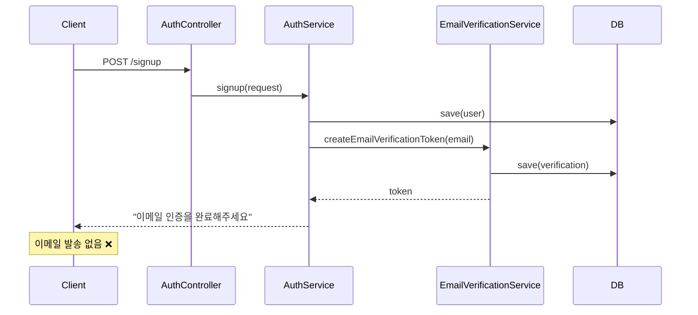
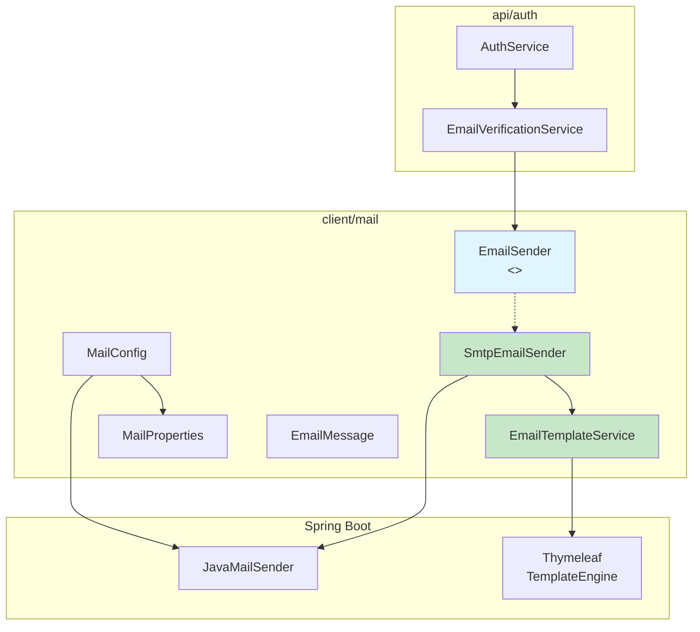
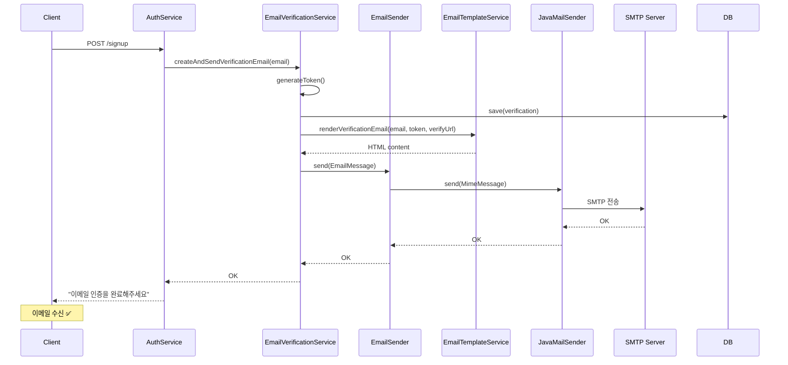
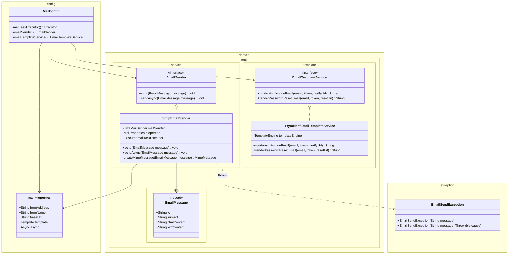
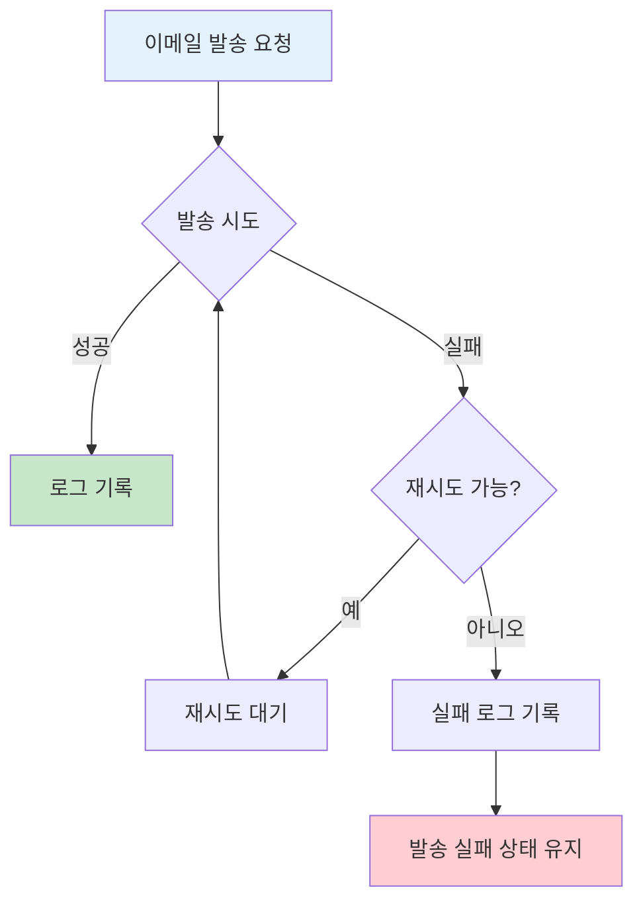

# api/auth 모듈 이메일 인증 기능 설계서

## 목차

1. [개요](#1-개요)
2. [Quick Start - 로컬 Gmail SMTP 설정](#2-quick-start---로컬-gmail-smtp-설정)
3. [아키텍처 설계](#3-아키텍처-설계)
4. [이메일 발송 방식 선택](#4-이메일-발송-방식-선택)
5. [인터페이스 설계](#5-인터페이스-설계)
6. [구현 가이드](#6-구현-가이드)
7. [이메일 템플릿 설계](#7-이메일-템플릿-설계)
8. [에러 처리 및 복원력](#8-에러-처리-및-복원력)
9. [테스트 전략](#9-테스트-전략)
10. [설정 가이드](#10-설정-가이드)
11. [참고 자료](#11-참고-자료)

---

## 1. 개요

### 1.1 배경 및 목적

현재 `api/auth` 모듈의 회원가입 플로우에서 이메일 인증 토큰이 생성되어 DB에 저장되지만, 실제 이메일 발송이 이루어지지 않는 문제가 있다. 본 설계서는 이메일 발송 기능을 구현하여 완전한 이메일 인증 플로우를 완성하는 것을 목적으로 한다.

### 1.2 범위

| 범위 | 상세 |
|------|------|
| **포함** | 회원가입 인증 이메일 발송, 비밀번호 재설정 이메일 발송, 이메일 클라이언트 모듈 구현 |
| **제외** | 마케팅 이메일, 대량 발송 기능, 이메일 수신 확인(read receipt) |

### 1.3 현재 상태 분석



---

## 2. Quick Start - 로컬 Gmail SMTP 설정

로컬 환경에서 Gmail SMTP를 사용하여 빠르게 이메일 발송 기능을 테스트할 수 있습니다.

### 2.1 사전 준비 완료

✅ Gmail 계정: **ebson024.v1@gmail.com**  
✅ 앱 비밀번호: **rdxz emha tprw llck** (공백 제거: `rdxzemhatprwllck`)  
✅ App Name: **Local-SMTP**

### 2.2 환경 변수 설정

**방법 A: IntelliJ IDEA 설정**

1. Run/Debug Configurations 열기
2. Environment variables 섹션에 추가:

```
MAIL_HOST=smtp.gmail.com
MAIL_PORT=587
MAIL_USERNAME=ebson024.v1@gmail.com
MAIL_PASSWORD=rdxzemhatprwllck
MAIL_SMTP_AUTH=true
MAIL_SMTP_STARTTLS=true
MAIL_FROM_ADDRESS=ebson024.v1@gmail.com
```

**방법 B: 터미널에서 환경 변수 설정**

```bash
export MAIL_HOST=smtp.gmail.com
export MAIL_PORT=587
export MAIL_USERNAME=ebson024.v1@gmail.com
export MAIL_PASSWORD=rdxzemhatprwllck
export MAIL_SMTP_AUTH=true
export MAIL_SMTP_STARTTLS=true
export MAIL_FROM_ADDRESS=ebson024.v1@gmail.com

./gradlew :api-auth:bootRun
```

**방법 C: .env 파일 생성 (Git 제외됨)**

```bash
# .env 파일 생성 (프로젝트 루트)
cat > .env << 'EOF'
MAIL_HOST=smtp.gmail.com
MAIL_PORT=587
MAIL_USERNAME=ebson024.v1@gmail.com
MAIL_PASSWORD=rdxzemhatprwllck
MAIL_SMTP_AUTH=true
MAIL_SMTP_STARTTLS=true
MAIL_FROM_ADDRESS=ebson024.v1@gmail.com
EOF

# .env 로드 후 실행
source .env && ./gradlew :api-auth:bootRun
```

### 2.3 application-local.yml 설정

```yaml
# api/auth/src/main/resources/application-local.yml
spring:
  mail:
    host: ${MAIL_HOST:smtp.gmail.com}
    port: ${MAIL_PORT:587}
    username: ${MAIL_USERNAME:ebson024.v1@gmail.com}
    password: ${MAIL_PASSWORD:rdxzemhatprwllck}
    properties:
      mail.smtp.auth: ${MAIL_SMTP_AUTH:true}
      mail.smtp.starttls.enable: ${MAIL_SMTP_STARTTLS:true}
      mail.smtp.starttls.required: true
      mail.smtp.connectiontimeout: 5000
      mail.smtp.timeout: 3000
      mail.smtp.writetimeout: 5000

mail:
  from-address: ${MAIL_FROM_ADDRESS:ebson024.v1@gmail.com}
  from-name: Shrimp TM (Local)
  base-url: http://localhost:8080
```

### 2.4 빠른 테스트

**1. 애플리케이션 실행**
```bash
./gradlew :api-auth:bootRun
```

**2. 회원가입 API 호출**
```bash
curl -X POST http://localhost:8080/api/v1/auth/signup \
  -H "Content-Type: application/json" \
  -d '{
    "email": "test@example.com",
    "username": "testuser",
    "password": "Test1234!@"
  }'
```

**3. Gmail 수신함 확인**
- ebson024.v1@gmail.com 로그인
- 받은편지함에서 "이메일 인증을 완료해주세요" 제목의 이메일 확인

### 2.5 대안: MailHog (가상 SMTP)

실제 이메일 발송 없이 테스트하려면:

```bash
# Docker로 MailHog 실행
docker run -d -p 1025:1025 -p 8025:8025 mailhog/mailhog

# 환경 변수 없이 실행 (기본값: MailHog)
./gradlew :api-auth:bootRun

# 웹 브라우저에서 확인
open http://localhost:8025
```

---

## 3. 아키텍처 설계

### 3.1 모듈 초기화 현황

**현재 상태** (2024년 기준):

| 항목 | 상태 | 설명 |
|------|------|------|
| `client/mail/build.gradle` | ⚠️ 수정 필요 | openfeign 의존성 제거, spring-mail/thymeleaf 추가 필요 |
| `client/mail/src/` | ❌ 생성 필요 | settings.gradle 자동 탐색 조건 |
| 모듈 인식 | ❓ 확인 필요 | `./gradlew projects \| grep client-mail` |

**build.gradle 현재 코드 (수정 전)**:
```gradle
dependencies {
    api project(':common-core')
    api 'org.springframework.cloud:spring-cloud-starter-openfeign'  // ← 삭제 필요
    // ... spring-boot-starter-mail 없음 ← 추가 필요
}
```

### 3.2 모듈 구조

기존 `client/slack` 모듈 패턴을 따라 `client/mail` 모듈을 구성한다.

**중요**: `settings.gradle`의 자동 모듈 탐색은 `src` 폴더가 존재해야 모듈로 인식한다.

```
shrimp-tm-demo/
├── api/
│   └── auth/                          # 기존 모듈 (EmailVerificationService 수정)
├── client/
│   ├── mail/                          # 신규 모듈
│   │   ├── build.gradle
│   │   └── src/main/
│   │       ├── java/com/tech/n/ai/client/mail/
│   │       │   ├── config/
│   │       │   │   ├── MailConfig.java
│   │       │   │   └── MailProperties.java
│   │       │   ├── domain/
│   │       │   │   └── mail/
│   │       │   │       ├── dto/
│   │       │   │       │   └── EmailMessage.java
│   │       │   │       ├── service/
│   │       │   │       │   ├── EmailSender.java           # 인터페이스
│   │       │   │       │   └── SmtpEmailSender.java       # 구현체
│   │       │   │       └── template/
│   │       │   │           ├── EmailTemplateService.java  # 인터페이스
│   │       │   │           └── ThymeleafEmailTemplateService.java
│   │       │   └── exception/
│   │       │       └── EmailSendException.java
│   │       └── resources/
│   │           └── templates/
│   │               └── email/
│   │                   ├── verification.html
│   │                   └── password-reset.html
│   └── slack/                         # 기존 모듈 (패턴 참조)
│       └── src/main/java/.../client/slack/
│           ├── config/                # SlackConfig.java, SlackProperties.java
│           ├── domain/slack/          # api/, client/, service/, contract/, builder/
│           ├── exception/             # SlackException.java
│           └── util/                  # SlackRateLimiter.java
└── common/
    └── ...
```

### 3.3 컴포넌트 의존성 다이어그램



### 3.4 목표 시퀀스 다이어그램



---

## 4. 이메일 발송 방식 선택

### 4.1 선택지 비교

| 항목 | Spring Mail (JavaMailSender) | AWS SES |
|------|------------------------------|---------|
| **초기 설정** | 간단 (SMTP 설정만 필요) | 복잡 (IAM, 도메인 인증, 샌드박스 해제) |
| **비용** | SMTP 제공업체에 따라 다름 | $0.10/1,000건 (저렴) |
| **확장성** | 중소규모 적합 | 대규모 적합 |
| **의존성** | spring-boot-starter-mail | AWS SDK + Spring Cloud AWS |
| **로컬 개발** | MailHog/Mailtrap으로 쉬움 | LocalStack 필요 또는 실제 SES 사용 |
| **학습 곡선** | 낮음 | 중간 |
| **AWS 인프라 통합** | 별도 | 기존 인프라와 통합 |

### 4.2 결정 및 근거

**결정: Spring Mail (JavaMailSender) 선택**

**근거:**

1. **현재 요구사항에 적합**: 회원가입/비밀번호 재설정 이메일은 소량 발송이며, AWS SES의 대규모 발송 기능이 불필요
2. **빠른 구현**: Spring Boot의 자동 설정으로 즉시 사용 가능
3. **로컬 개발 편의성**: MailHog로 손쉽게 이메일 테스트 가능
4. **YAGNI 원칙**: 대량 발송이 필요해지면 그때 AWS SES로 마이그레이션

**트레이드오프:**
- 포기: AWS 인프라 통합, 대규모 확장성
- 획득: 빠른 구현, 간단한 설정, 쉬운 로컬 테스트

### 4.3 공식 문서 참조

Spring Boot Mail 공식 문서: https://docs.spring.io/spring-boot/reference/io/email.html

> Spring Boot provides auto-configuration for sending email through Spring Framework's JavaMailSender interface. The auto-configuration creates a JavaMailSender bean when the spring-boot-starter-mail dependency is available and spring.mail.host property is configured.

---

## 5. 인터페이스 설계

### 5.1 EmailSender 인터페이스

```java
package com.tech.n.ai.client.mail.domain.mail.service;

import com.tech.n.ai.client.mail.domain.mail.dto.EmailMessage;

public interface EmailSender {
    
    /**
     * 이메일을 동기 방식으로 발송합니다.
     * 발송 실패 시 EmailSendException을 던집니다.
     *
     * @param message 발송할 이메일 메시지
     * @throws EmailSendException 이메일 발송 실패 시
     */
    void send(EmailMessage message);
    
    /**
     * 이메일을 비동기 방식으로 발송합니다.
     * 발송 실패 시 로그만 남기고 예외를 던지지 않습니다.
     *
     * @param message 발송할 이메일 메시지
     */
    void sendAsync(EmailMessage message);
}
```

### 5.2 EmailMessage DTO

```java
package com.tech.n.ai.client.mail.domain.mail.dto;

import lombok.Builder;

@Builder
public record EmailMessage(
    String to,
    String subject,
    String htmlContent,
    String textContent
) {
    public EmailMessage {
        if (to == null || to.isBlank()) {
            throw new IllegalArgumentException("수신자 이메일은 필수입니다.");
        }
        if (subject == null || subject.isBlank()) {
            throw new IllegalArgumentException("제목은 필수입니다.");
        }
        if (htmlContent == null && textContent == null) {
            throw new IllegalArgumentException("HTML 또는 텍스트 본문 중 하나는 필수입니다.");
        }
    }
}
```

### 5.3 EmailTemplateService 인터페이스

```java
package com.tech.n.ai.client.mail.domain.mail.template;

public interface EmailTemplateService {
    
    /**
     * 회원가입 인증 이메일 HTML을 렌더링합니다.
     *
     * @param email 수신자 이메일
     * @param token 인증 토큰
     * @param verifyUrl 인증 완료 URL
     * @return 렌더링된 HTML 문자열
     */
    String renderVerificationEmail(String email, String token, String verifyUrl);
    
    /**
     * 비밀번호 재설정 이메일 HTML을 렌더링합니다.
     *
     * @param email 수신자 이메일
     * @param token 재설정 토큰
     * @param resetUrl 비밀번호 재설정 URL
     * @return 렌더링된 HTML 문자열
     */
    String renderPasswordResetEmail(String email, String token, String resetUrl);
}
```

### 5.4 MailProperties 설정 클래스

```java
package com.tech.n.ai.client.mail.config;

import lombok.Data;
import org.springframework.boot.context.properties.ConfigurationProperties;

@ConfigurationProperties(prefix = "mail")
@Data
public class MailProperties {
    
    private String fromAddress;
    private String fromName = "Shrimp TM";
    private String baseUrl;
    private Template template = new Template();
    private Async async = new Async();
    
    @Data
    public static class Template {
        private String verificationSubject = "이메일 인증을 완료해주세요";
        private String passwordResetSubject = "비밀번호 재설정 안내";
    }
    
    @Data
    public static class Async {
        private boolean enabled = true;
        private int corePoolSize = 2;
        private int maxPoolSize = 5;
        private int queueCapacity = 100;
    }
}
```

### 5.5 클래스 다이어그램



---

## 6. 구현 가이드

### 6.1 구현 순서

| 순서 | 작업 | 예상 소요 |
|------|------|----------|
| 1 | `client/mail` 모듈 생성 및 build.gradle 작성 | 10분 |
| 2 | MailProperties, MailConfig 구현 | 20분 |
| 3 | EmailMessage DTO 구현 | 5분 |
| 4 | EmailSender 인터페이스 및 SmtpEmailSender 구현 | 30분 |
| 5 | Thymeleaf 템플릿 작성 | 30분 |
| 6 | EmailTemplateService 구현 | 20분 |
| 7 | EmailVerificationService 수정 (통합) | 20분 |
| 8 | application.yml 설정 추가 | 10분 |
| 9 | 테스트 작성 및 검증 | 30분 |

### 6.2 단계별 구현 상세

#### Step 1: build.gradle 작성

**주의**: 현재 `client/mail/build.gradle`에 `openfeign` 의존성이 있다면 삭제 필요

```gradle
// client/mail/build.gradle
group = 'com.tech.n.ai.client'
version = '0.0.1-SNAPSHOT'
description = 'client-mail'

bootJar.enabled = false
jar.enabled = true

dependencies {
    // 공통 모듈
    implementation project(':common-core')
    implementation project(':common-exception')
    
    // Spring Mail
    implementation 'org.springframework.boot:spring-boot-starter-mail'
    
    // Thymeleaf (템플릿 엔진)
    implementation 'org.springframework.boot:spring-boot-starter-thymeleaf'
    
    // Configuration Processor (application.yml 자동완성)
    annotationProcessor 'org.springframework.boot:spring-boot-configuration-processor'
    
    // 테스트
    testImplementation 'org.springframework.boot:spring-boot-starter-test'
    testRuntimeOnly 'org.junit.platform:junit-platform-launcher'
}

task prepareKotlinBuildScriptModel {
}

// Disable failure when no tests are discovered
tasks.named('test') {
    failOnNoDiscoveredTests = false
}
```

**검증 명령어**:
```bash
./gradlew :client-mail:dependencies --configuration compileClasspath | grep mail
# 출력: org.springframework.boot:spring-boot-starter-mail -> x.x.x
```

#### Step 2: MailConfig 구현

```java
package com.tech.n.ai.client.mail.config;

import com.tech.n.ai.client.mail.domain.mail.service.EmailSender;
import com.tech.n.ai.client.mail.domain.mail.service.SmtpEmailSender;
import com.tech.n.ai.client.mail.domain.mail.template.EmailTemplateService;
import com.tech.n.ai.client.mail.domain.mail.template.ThymeleafEmailTemplateService;
import org.springframework.boot.autoconfigure.condition.ConditionalOnMissingBean;
import org.springframework.boot.context.properties.EnableConfigurationProperties;
import org.springframework.context.annotation.Bean;
import org.springframework.context.annotation.Configuration;
import org.springframework.mail.javamail.JavaMailSender;
import org.springframework.scheduling.annotation.EnableAsync;
import org.springframework.scheduling.concurrent.ThreadPoolTaskExecutor;
import org.thymeleaf.TemplateEngine;

import java.util.concurrent.Executor;

/**
 * 이메일 발송 관련 Bean 설정.
 * client/slack 모듈의 SlackConfig 패턴을 참조.
 */
@Configuration
@EnableAsync
@EnableConfigurationProperties(MailProperties.class)
public class MailConfig {
    
    @Bean(name = "mailTaskExecutor")
    public Executor mailTaskExecutor(MailProperties properties) {
        ThreadPoolTaskExecutor executor = new ThreadPoolTaskExecutor();
        executor.setCorePoolSize(properties.getAsync().getCorePoolSize());
        executor.setMaxPoolSize(properties.getAsync().getMaxPoolSize());
        executor.setQueueCapacity(properties.getAsync().getQueueCapacity());
        executor.setThreadNamePrefix("mail-");
        executor.initialize();
        return executor;
    }
    
    @Bean
    @ConditionalOnMissingBean(EmailSender.class)
    public EmailSender emailSender(
            JavaMailSender mailSender,
            MailProperties properties,
            Executor mailTaskExecutor) {
        return new SmtpEmailSender(mailSender, properties, mailTaskExecutor);
    }
    
    @Bean
    @ConditionalOnMissingBean(EmailTemplateService.class)
    public EmailTemplateService emailTemplateService(TemplateEngine templateEngine) {
        return new ThymeleafEmailTemplateService(templateEngine);
    }
}
```

#### Step 3: SmtpEmailSender 구현

```java
package com.tech.n.ai.client.mail.domain.mail.service;

import com.tech.n.ai.client.mail.config.MailProperties;
import com.tech.n.ai.client.mail.domain.mail.dto.EmailMessage;
import com.tech.n.ai.client.mail.exception.EmailSendException;
import jakarta.mail.MessagingException;
import jakarta.mail.internet.MimeMessage;
import lombok.RequiredArgsConstructor;
import lombok.extern.slf4j.Slf4j;
import org.springframework.mail.MailException;
import org.springframework.mail.javamail.JavaMailSender;
import org.springframework.mail.javamail.MimeMessageHelper;

import java.io.UnsupportedEncodingException;
import java.util.concurrent.Executor;

@Slf4j
@RequiredArgsConstructor
public class SmtpEmailSender implements EmailSender {
    
    private final JavaMailSender mailSender;
    private final MailProperties properties;
    private final Executor mailTaskExecutor;
    
    @Override
    public void send(EmailMessage message) {
        try {
            MimeMessage mimeMessage = createMimeMessage(message);
            mailSender.send(mimeMessage);
            log.info("이메일 발송 완료: to={}, subject={}", message.to(), message.subject());
        } catch (MailException | MessagingException | UnsupportedEncodingException e) {
            log.error("이메일 발송 실패: to={}, error={}", message.to(), e.getMessage());
            throw new EmailSendException("이메일 발송에 실패했습니다.", e);
        }
    }
    
    @Override
    public void sendAsync(EmailMessage message) {
        mailTaskExecutor.execute(() -> {
            try {
                send(message);
            } catch (Exception e) {
                // Fail-Safe: 비동기 발송 실패 시 로그만 남기고 예외 전파하지 않음
                log.error("비동기 이메일 발송 실패: to={}", message.to(), e);
            }
        });
    }
    
    private MimeMessage createMimeMessage(EmailMessage message) 
            throws MessagingException, UnsupportedEncodingException {
        MimeMessage mimeMessage = mailSender.createMimeMessage();
        MimeMessageHelper helper = new MimeMessageHelper(mimeMessage, true, "UTF-8");
        
        helper.setFrom(properties.getFromAddress(), properties.getFromName());
        helper.setTo(message.to());
        helper.setSubject(message.subject());
        
        if (message.htmlContent() != null) {
            // multipart/alternative: HTML과 Plain Text 모두 제공
            helper.setText(
                message.textContent() != null ? message.textContent() : "",
                message.htmlContent()
            );
        } else {
            helper.setText(message.textContent());
        }
        
        return mimeMessage;
    }
}
```

#### Step 4: EmailSendException 정의

```java
package com.tech.n.ai.client.mail.exception;

/**
 * 이메일 발송 실패 시 발생하는 예외.
 * common-exception 모듈의 패턴을 참조하여 구현.
 */
public class EmailSendException extends RuntimeException {
    
    public EmailSendException(String message) {
        super(message);
    }
    
    public EmailSendException(String message, Throwable cause) {
        super(message, cause);
    }
}
```

#### Step 5: ThymeleafEmailTemplateService 구현

```java
package com.tech.n.ai.client.mail.domain.mail.template;

import lombok.RequiredArgsConstructor;
import org.thymeleaf.TemplateEngine;
import org.thymeleaf.context.Context;

@RequiredArgsConstructor
public class ThymeleafEmailTemplateService implements EmailTemplateService {
    
    private final TemplateEngine templateEngine;
    
    @Override
    public String renderVerificationEmail(String email, String token, String verifyUrl) {
        Context context = new Context();
        context.setVariable("email", email);
        context.setVariable("token", token);
        context.setVariable("verifyUrl", verifyUrl);
        return templateEngine.process("email/verification", context);
    }
    
    @Override
    public String renderPasswordResetEmail(String email, String token, String resetUrl) {
        Context context = new Context();
        context.setVariable("email", email);
        context.setVariable("token", token);
        context.setVariable("resetUrl", resetUrl);
        return templateEngine.process("email/password-reset", context);
    }
}
```

### 6.3 기존 코드 통합

#### EmailVerificationService 수정

```java
// 기존 코드
@Transactional
public String createEmailVerificationToken(String email) {
    String token = SecureTokenGenerator.generate();
    EmailVerificationEntity verification = EmailVerificationEntity.create(
        email, token, EMAIL_VERIFICATION_TYPE, 
        LocalDateTime.now().plusHours(TOKEN_EXPIRY_HOURS)
    );
    emailVerificationWriterRepository.save(verification);
    return token;  // 토큰만 반환
}

// 수정 후
@Transactional
public void createAndSendVerificationEmail(String email) {
    String token = SecureTokenGenerator.generate();
    EmailVerificationEntity verification = EmailVerificationEntity.create(
        email, token, EMAIL_VERIFICATION_TYPE, 
        LocalDateTime.now().plusHours(TOKEN_EXPIRY_HOURS)
    );
    emailVerificationWriterRepository.save(verification);
    
    sendVerificationEmail(email, token);
}

private void sendVerificationEmail(String email, String token) {
    String verifyUrl = mailProperties.getBaseUrl() + "/api/v1/auth/verify-email?token=" + token;
    String htmlContent = emailTemplateService.renderVerificationEmail(email, token, verifyUrl);
    
    EmailMessage message = EmailMessage.builder()
        .to(email)
        .subject(mailProperties.getTemplate().getVerificationSubject())
        .htmlContent(htmlContent)
        .build();
    
    emailSender.sendAsync(message);
}
```

#### EmailVerificationService 의존성 추가

```java
import com.tech.n.ai.client.mail.config.MailProperties;
import com.tech.n.ai.client.mail.domain.mail.dto.EmailMessage;
import com.tech.n.ai.client.mail.domain.mail.service.EmailSender;
import com.tech.n.ai.client.mail.domain.mail.template.EmailTemplateService;

@Slf4j
@Service
@RequiredArgsConstructor
public class EmailVerificationService {
    
    // 기존 의존성
    private final EmailVerificationReaderRepository emailVerificationReaderRepository;
    private final EmailVerificationWriterRepository emailVerificationWriterRepository;
    private final UserReaderRepository userReaderRepository;
    private final UserWriterRepository userWriterRepository;
    private final PasswordEncoder passwordEncoder;
    
    // 새로 추가 (client-mail 모듈)
    private final EmailSender emailSender;
    private final EmailTemplateService emailTemplateService;
    private final MailProperties mailProperties;
    
    // ... 기존 메서드들
}
```

#### api/auth/build.gradle 의존성 추가

```gradle
dependencies {
    implementation project(':domain-aurora')
    implementation project(':common-core')
    implementation project(':common-security')
    implementation project(':common-exception')
    implementation project(':client-feign')
    implementation project(':client-mail')  // 추가
    annotationProcessor 'org.springframework.boot:spring-boot-configuration-processor'
}
```

---

## 7. 이메일 템플릿 설계

### 7.1 템플릿 엔진 선택

**선택: Thymeleaf**

**근거:**
- Spring Boot의 기본 템플릿 엔진으로 추가 설정 최소화
- HTML 친화적 문법
- 프리뷰 모드에서 브라우저에서 직접 확인 가능

### 7.2 회원가입 인증 이메일 템플릿

파일 위치: `client/mail/src/main/resources/templates/email/verification.html`

```html
<!DOCTYPE html>
<html xmlns:th="http://www.thymeleaf.org" lang="ko">
<head>
    <meta charset="UTF-8">
    <meta name="viewport" content="width=device-width, initial-scale=1.0">
    <title>이메일 인증</title>
</head>
<body style="margin: 0; padding: 0; font-family: 'Apple SD Gothic Neo', 'Malgun Gothic', sans-serif; background-color: #f5f5f5;">
    <table role="presentation" style="width: 100%; border-collapse: collapse;">
        <tr>
            <td align="center" style="padding: 40px 0;">
                <table role="presentation" style="width: 600px; border-collapse: collapse; background-color: #ffffff; border-radius: 8px; box-shadow: 0 2px 8px rgba(0,0,0,0.1);">
                    <!-- Header -->
                    <tr>
                        <td style="padding: 40px 40px 20px; text-align: center; border-bottom: 1px solid #eee;">
                            <h1 style="margin: 0; color: #333; font-size: 24px;">이메일 인증</h1>
                        </td>
                    </tr>
                    
                    <!-- Body -->
                    <tr>
                        <td style="padding: 40px;">
                            <p style="margin: 0 0 20px; color: #333; font-size: 16px; line-height: 1.6;">
                                안녕하세요,
                            </p>
                            <p style="margin: 0 0 20px; color: #333; font-size: 16px; line-height: 1.6;">
                                <strong th:text="${email}">user@example.com</strong> 계정의 이메일 인증을 완료해주세요.
                            </p>
                            <p style="margin: 0 0 30px; color: #333; font-size: 16px; line-height: 1.6;">
                                아래 버튼을 클릭하면 인증이 완료됩니다.
                            </p>
                            
                            <!-- CTA Button -->
                            <table role="presentation" style="width: 100%; border-collapse: collapse;">
                                <tr>
                                    <td align="center">
                                        <a th:href="${verifyUrl}" 
                                           style="display: inline-block; padding: 16px 48px; background-color: #4A90D9; color: #ffffff; text-decoration: none; border-radius: 6px; font-size: 16px; font-weight: bold;">
                                            이메일 인증하기
                                        </a>
                                    </td>
                                </tr>
                            </table>
                            
                            <p style="margin: 30px 0 0; color: #666; font-size: 14px; line-height: 1.6;">
                                버튼이 작동하지 않으면 아래 링크를 복사하여 브라우저에 붙여넣기 해주세요:
                            </p>
                            <p style="margin: 10px 0 0; word-break: break-all;">
                                <a th:href="${verifyUrl}" th:text="${verifyUrl}" style="color: #4A90D9; font-size: 12px;">
                                    https://example.com/verify?token=xxx
                                </a>
                            </p>
                        </td>
                    </tr>
                    
                    <!-- Footer -->
                    <tr>
                        <td style="padding: 20px 40px; background-color: #f9f9f9; border-top: 1px solid #eee; border-radius: 0 0 8px 8px;">
                            <p style="margin: 0; color: #999; font-size: 12px; text-align: center;">
                                본 메일은 발신 전용입니다. 이 링크는 24시간 후 만료됩니다.
                            </p>
                            <p style="margin: 10px 0 0; color: #999; font-size: 12px; text-align: center;">
                                본인이 요청하지 않은 경우 이 메일을 무시해주세요.
                            </p>
                        </td>
                    </tr>
                </table>
            </td>
        </tr>
    </table>
</body>
</html>
```

### 7.3 비밀번호 재설정 이메일 템플릿

파일 위치: `client/mail/src/main/resources/templates/email/password-reset.html`

```html
<!DOCTYPE html>
<html xmlns:th="http://www.thymeleaf.org" lang="ko">
<head>
    <meta charset="UTF-8">
    <meta name="viewport" content="width=device-width, initial-scale=1.0">
    <title>비밀번호 재설정</title>
</head>
<body style="margin: 0; padding: 0; font-family: 'Apple SD Gothic Neo', 'Malgun Gothic', sans-serif; background-color: #f5f5f5;">
    <table role="presentation" style="width: 100%; border-collapse: collapse;">
        <tr>
            <td align="center" style="padding: 40px 0;">
                <table role="presentation" style="width: 600px; border-collapse: collapse; background-color: #ffffff; border-radius: 8px; box-shadow: 0 2px 8px rgba(0,0,0,0.1);">
                    <!-- Header -->
                    <tr>
                        <td style="padding: 40px 40px 20px; text-align: center; border-bottom: 1px solid #eee;">
                            <h1 style="margin: 0; color: #333; font-size: 24px;">비밀번호 재설정</h1>
                        </td>
                    </tr>
                    
                    <!-- Body -->
                    <tr>
                        <td style="padding: 40px;">
                            <p style="margin: 0 0 20px; color: #333; font-size: 16px; line-height: 1.6;">
                                안녕하세요,
                            </p>
                            <p style="margin: 0 0 20px; color: #333; font-size: 16px; line-height: 1.6;">
                                <strong th:text="${email}">user@example.com</strong> 계정의 비밀번호 재설정이 요청되었습니다.
                            </p>
                            <p style="margin: 0 0 30px; color: #333; font-size: 16px; line-height: 1.6;">
                                아래 버튼을 클릭하여 새 비밀번호를 설정해주세요.
                            </p>
                            
                            <!-- CTA Button -->
                            <table role="presentation" style="width: 100%; border-collapse: collapse;">
                                <tr>
                                    <td align="center">
                                        <a th:href="${resetUrl}" 
                                           style="display: inline-block; padding: 16px 48px; background-color: #E74C3C; color: #ffffff; text-decoration: none; border-radius: 6px; font-size: 16px; font-weight: bold;">
                                            비밀번호 재설정
                                        </a>
                                    </td>
                                </tr>
                            </table>
                            
                            <p style="margin: 30px 0 0; color: #666; font-size: 14px; line-height: 1.6;">
                                버튼이 작동하지 않으면 아래 링크를 복사하여 브라우저에 붙여넣기 해주세요:
                            </p>
                            <p style="margin: 10px 0 0; word-break: break-all;">
                                <a th:href="${resetUrl}" th:text="${resetUrl}" style="color: #E74C3C; font-size: 12px;">
                                    https://example.com/reset?token=xxx
                                </a>
                            </p>
                        </td>
                    </tr>
                    
                    <!-- Security Notice -->
                    <tr>
                        <td style="padding: 0 40px 20px;">
                            <div style="background-color: #fff3cd; border: 1px solid #ffc107; border-radius: 6px; padding: 15px;">
                                <p style="margin: 0; color: #856404; font-size: 14px;">
                                    ⚠️ 본인이 요청하지 않은 경우, 계정 보안을 위해 비밀번호를 즉시 변경해주세요.
                                </p>
                            </div>
                        </td>
                    </tr>
                    
                    <!-- Footer -->
                    <tr>
                        <td style="padding: 20px 40px; background-color: #f9f9f9; border-top: 1px solid #eee; border-radius: 0 0 8px 8px;">
                            <p style="margin: 0; color: #999; font-size: 12px; text-align: center;">
                                본 메일은 발신 전용입니다. 이 링크는 24시간 후 만료됩니다.
                            </p>
                        </td>
                    </tr>
                </table>
            </td>
        </tr>
    </table>
</body>
</html>
```

---

## 8. 에러 처리 및 복원력

### 8.1 이메일 발송 실패 처리 전략



**전략: Fail-Safe with Logging**

회원가입 트랜잭션과 이메일 발송을 분리하여 이메일 발송 실패가 회원가입을 막지 않도록 설계한다.

```java
@Override
public void sendAsync(EmailMessage message) {
    mailTaskExecutor.execute(() -> {
        try {
            send(message);
        } catch (Exception e) {
            // 발송 실패해도 회원가입은 유지
            // 관리자에게 알림 또는 재발송 큐에 추가 가능
            log.error("비동기 이메일 발송 실패: to={}", message.to(), e);
        }
    });
}
```

### 8.2 재시도 정책

현재 버전에서는 단순 비동기 발송만 구현하고, 필요시 Spring Retry를 추가한다.

```java
// 향후 필요시 추가
@Retryable(
    value = {MailException.class},
    maxAttempts = 3,
    backoff = @Backoff(delay = 1000, multiplier = 2)
)
public void sendWithRetry(EmailMessage message) {
    send(message);
}
```

### 8.3 모니터링/로깅

```java
// 발송 성공
log.info("이메일 발송 완료: to={}, subject={}", message.to(), message.subject());

// 발송 실패
log.error("이메일 발송 실패: to={}, subject={}, error={}", 
    message.to(), message.subject(), e.getMessage());
```

**향후 확장 가능:**
- Slack 알림 연동 (client/slack 모듈 활용)
- 이메일 발송 히스토리 테이블 추가

---

## 9. 테스트 전략

### 9.1 단위 테스트

```java
@ExtendWith(MockitoExtension.class)
class SmtpEmailSenderTest {
    
    @Mock
    private JavaMailSender mailSender;
    
    @Mock
    private MailProperties properties;
    
    @Mock
    private Executor taskExecutor;
    
    @InjectMocks
    private SmtpEmailSender emailSender;
    
    @Test
    void send_ValidMessage_ShouldSendEmail() throws Exception {
        // given
        EmailMessage message = EmailMessage.builder()
            .to("test@example.com")
            .subject("테스트")
            .htmlContent("<p>테스트</p>")
            .build();
        
        when(properties.getFromAddress()).thenReturn("noreply@example.com");
        when(properties.getFromName()).thenReturn("Shrimp TM");
        when(mailSender.createMimeMessage()).thenReturn(new MimeMessage((Session) null));
        
        // when & then
        assertDoesNotThrow(() -> emailSender.send(message));
        verify(mailSender).send(any(MimeMessage.class));
    }
}
```

### 9.2 통합 테스트

```java
@SpringBootTest
@ActiveProfiles("test")
class EmailIntegrationTest {
    
    @Autowired
    private EmailSender emailSender;
    
    @Autowired
    private EmailTemplateService templateService;
    
    @Test
    void sendVerificationEmail_ShouldRenderAndSend() {
        // given
        String email = "test@example.com";
        String token = "test-token";
        String verifyUrl = "http://localhost:8080/verify?token=" + token;
        
        String htmlContent = templateService.renderVerificationEmail(email, token, verifyUrl);
        
        EmailMessage message = EmailMessage.builder()
            .to(email)
            .subject("이메일 인증")
            .htmlContent(htmlContent)
            .build();
        
        // when & then
        assertDoesNotThrow(() -> emailSender.send(message));
    }
}
```

### 9.3 로컬 개발 환경 테스트

#### 옵션 A: MailHog (빠른 반복 테스트)

**MailHog**: 로컬 SMTP 서버로 발송된 이메일을 웹 UI에서 확인 가능

```yaml
# docker-compose.yml에 추가
services:
  mailhog:
    image: mailhog/mailhog
    ports:
      - "1025:1025"  # SMTP
      - "8025:8025"  # Web UI
```

**local 프로파일 설정:**
```yaml
spring:
  mail:
    host: localhost
    port: 1025
    properties:
      mail.smtp.auth: false
      mail.smtp.starttls.enable: false
```

**실행:**
```bash
docker-compose up -d mailhog
./gradlew :api-auth:bootRun
```

웹 UI 접속: http://localhost:8025

---

#### 옵션 B: Gmail SMTP (실제 이메일 테스트)

**실제 Gmail로 이메일 발송 테스트**

```yaml
# application-local.yml 또는 환경 변수
spring:
  mail:
    host: smtp.gmail.com
    port: 587
    username: ebson024.v1@gmail.com
    password: rdxzemhatprwllck
    properties:
      mail.smtp.auth: true
      mail.smtp.starttls.enable: true
```

**실행:**
```bash
export MAIL_HOST=smtp.gmail.com
export MAIL_PORT=587
export MAIL_USERNAME=ebson024.v1@gmail.com
export MAIL_PASSWORD=rdxzemhatprwllck
export MAIL_SMTP_AUTH=true
export MAIL_SMTP_STARTTLS=true
export MAIL_FROM_ADDRESS=ebson024.v1@gmail.com

./gradlew :api-auth:bootRun
```

**테스트 시나리오:**

1. **회원가입 이메일 발송 테스트**
```bash
curl -X POST http://localhost:8080/api/v1/auth/signup \
  -H "Content-Type: application/json" \
  -d '{
    "email": "test@example.com",
    "username": "testuser",
    "password": "Test1234!@"
  }'
```

2. **Gmail 수신함 확인**
   - ebson024.v1@gmail.com 로그인
   - 받은편지함에서 인증 이메일 확인
   - HTML 렌더링 및 버튼 동작 확인

3. **비밀번호 재설정 이메일 테스트**
```bash
curl -X POST http://localhost:8080/api/v1/auth/reset-password \
  -H "Content-Type: application/json" \
  -d '{
    "email": "test@example.com"
  }'
```

**사용 시나리오:**
- **일반 개발**: MailHog 사용 (빠르고 편함)
- **HTML 템플릿 검증**: Gmail SMTP 사용 (실제 렌더링 확인)
- **최종 테스트**: Gmail SMTP 사용 (프로덕션과 동일한 환경)

---

## 10. 설정 가이드

### 10.1 application.yml 설정

#### client/mail 모듈 기본 설정

```yaml
# client/mail/src/main/resources/application-mail.yml
mail:
  from-address: ${MAIL_FROM_ADDRESS:noreply@example.com}
  from-name: ${MAIL_FROM_NAME:Shrimp TM}
  base-url: ${MAIL_BASE_URL:http://localhost:8080}
  template:
    verification-subject: 이메일 인증을 완료해주세요
    password-reset-subject: 비밀번호 재설정 안내
  async:
    enabled: true
    core-pool-size: 2
    max-pool-size: 5
    queue-capacity: 100
```

### 10.2 환경별 설정

#### Local 환경

**옵션 A: MailHog (추천 - 빠른 개발)**

로컬 가상 SMTP 서버로 실제 이메일 발송 없이 웹 UI에서 확인

```yaml
# api/auth/src/main/resources/application-local.yml
spring:
  mail:
    host: localhost
    port: 1025
    properties:
      mail.smtp.auth: false
      mail.smtp.starttls.enable: false

mail:
  from-address: noreply@localhost
  base-url: http://localhost:8080
```

**Docker Compose 설정:**
```yaml
# docker-compose.yml
services:
  mailhog:
    image: mailhog/mailhog
    ports:
      - "1025:1025"  # SMTP
      - "8025:8025"  # Web UI
```

**접속:** http://localhost:8025

---

**옵션 B: Gmail SMTP (실제 이메일 발송)**

실제 Gmail로 이메일을 발송하여 최종 테스트 가능

```yaml
# api/auth/src/main/resources/application-local.yml
spring:
  mail:
    host: smtp.gmail.com
    port: 587
    username: ebson024.v1@gmail.com
    password: rdxzemhatprwllck  # Gmail 앱 비밀번호 (공백 제거)
    properties:
      mail.smtp.auth: true
      mail.smtp.starttls.enable: true
      mail.smtp.starttls.required: true
      mail.smtp.connectiontimeout: 5000
      mail.smtp.timeout: 3000
      mail.smtp.writetimeout: 5000

mail:
  from-address: ebson024.v1@gmail.com
  from-name: Shrimp TM (Local)
  base-url: http://localhost:8080
```

**환경 변수 사용 (더 안전):**
```yaml
# api/auth/src/main/resources/application-local.yml
spring:
  mail:
    host: ${MAIL_HOST:localhost}
    port: ${MAIL_PORT:1025}
    username: ${MAIL_USERNAME:}
    password: ${MAIL_PASSWORD:}
    properties:
      mail.smtp.auth: ${MAIL_SMTP_AUTH:false}
      mail.smtp.starttls.enable: ${MAIL_SMTP_STARTTLS:false}
      mail.smtp.connectiontimeout: 5000
      mail.smtp.timeout: 3000
      mail.smtp.writetimeout: 5000

mail:
  from-address: ${MAIL_FROM_ADDRESS:noreply@localhost}
  from-name: ${MAIL_FROM_NAME:Shrimp TM}
  base-url: http://localhost:8080
```

**MailHog 사용 (기본):**
```bash
docker-compose up -d mailhog
./gradlew :api-auth:bootRun
# → http://localhost:8025 에서 확인
```

**Gmail SMTP 사용:**
```bash
export MAIL_HOST=smtp.gmail.com
export MAIL_PORT=587
export MAIL_USERNAME=ebson024.v1@gmail.com
export MAIL_PASSWORD=rdxzemhatprwllck
export MAIL_SMTP_AUTH=true
export MAIL_SMTP_STARTTLS=true
export MAIL_FROM_ADDRESS=ebson024.v1@gmail.com

./gradlew :api-auth:bootRun
# → 실제 Gmail로 발송
```

**IntelliJ 환경 변수 설정:**
```
Run/Debug Configurations → Environment variables:
MAIL_HOST=smtp.gmail.com
MAIL_PORT=587
MAIL_USERNAME=ebson024.v1@gmail.com
MAIL_PASSWORD=rdxzemhatprwllck
MAIL_SMTP_AUTH=true
MAIL_SMTP_STARTTLS=true
MAIL_FROM_ADDRESS=ebson024.v1@gmail.com
```

**Gmail 앱 비밀번호 정보:**
- Gmail: ebson024.v1@gmail.com
- App Name: Local-SMTP
- Password: rdxz emha tprw llck (설정 시 공백 제거 필수)

---

#### Dev 환경

```yaml
# api/auth/src/main/resources/application-dev.yml
spring:
  mail:
    host: ${SMTP_HOST}
    port: ${SMTP_PORT:587}
    username: ${SMTP_USERNAME}
    password: ${SMTP_PASSWORD}
    properties:
      mail.smtp.auth: true
      mail.smtp.starttls.enable: true
      mail.smtp.connectiontimeout: 5000
      mail.smtp.timeout: 3000
      mail.smtp.writetimeout: 5000

mail:
  base-url: https://dev.example.com
```

#### Prod 환경 (AWS SES SMTP)

```yaml
# api/auth/src/main/resources/application-prod.yml
spring:
  mail:
    host: email-smtp.ap-northeast-2.amazonaws.com
    port: 587
    username: ${AWS_SES_SMTP_USERNAME}
    password: ${AWS_SES_SMTP_PASSWORD}
    properties:
      mail.smtp.auth: true
      mail.smtp.starttls.enable: true
      mail.smtp.starttls.required: true
      mail.smtp.connectiontimeout: 5000
      mail.smtp.timeout: 3000
      mail.smtp.writetimeout: 5000

mail:
  from-address: noreply@yourdomain.com
  base-url: https://www.example.com
```

### 10.3 민감 정보 관리

**환경 변수 목록:**

| 변수명 | 설명 | 예시 |
|--------|------|------|
| `MAIL_HOST` | SMTP 서버 호스트 | smtp.gmail.com |
| `MAIL_PORT` | SMTP 포트 | 587 |
| `MAIL_USERNAME` | SMTP 인증 사용자명 | ebson024.v1@gmail.com |
| `MAIL_PASSWORD` | SMTP 인증 비밀번호 (App Password) | rdxzemhatprwllck |
| `MAIL_SMTP_AUTH` | SMTP 인증 활성화 | true |
| `MAIL_SMTP_STARTTLS` | TLS 암호화 활성화 | true |
| `MAIL_FROM_ADDRESS` | 발신자 이메일 | ebson024.v1@gmail.com |
| `MAIL_FROM_NAME` | 발신자 이름 | Shrimp TM |
| `MAIL_BASE_URL` | 인증 링크 기본 URL | http://localhost:8080 |

**Gmail 앱 비밀번호 정보 (로컬 개발용):**
- Gmail 계정: ebson024.v1@gmail.com
- App Name: Local-SMTP
- App Password: rdxz emha tprw llck
- 설정 시 주의: 공백 제거 필수 → `rdxzemhatprwllck`

**보안 주의사항:**
1. **절대 Git에 커밋하지 않기**
   ```bash
   # .gitignore에 추가
   application-local.yml  # (비밀번호 포함 시)
   .env
   *.private.yml
   ```

2. **환경 변수 사용 권장**
   - 코드에 비밀번호 하드코딩 금지
   - `.env` 파일 또는 IDE 환경 변수 사용
   - 로컬 개발: 환경 변수 또는 IntelliJ 설정
   - Dev/Prod: AWS Secrets Manager 사용

3. **AWS Secrets Manager 연동 (Prod 환경)**
   - 모든 민감 정보를 Secrets Manager에 저장
   - Spring Cloud AWS Secrets Manager 사용
   - 자동 로테이션 설정

**Gmail 앱 비밀번호 생성 방법:**
1. Google 계정(ebson024.v1@gmail.com) 로그인
2. https://myaccount.google.com/security 접속
3. 2단계 인증 활성화 (필수)
4. "앱 비밀번호" 클릭
5. 앱: "메일", 기기: "기타(Local-SMTP)"
6. 생성된 16자리 비밀번호 복사
7. 환경 변수에 설정 (공백 제거)

### 10.4 settings.gradle (수정 불필요)

**중요**: 본 프로젝트의 `settings.gradle`은 자동 모듈 탐색 방식을 사용합니다.

```gradle
// settings.gradle - 기존 코드 (수정 불필요)
[
    "api", "batch", "common", "client", "domain"
].forEach(module -> {
    searchModules(file("${rootDir.absolutePath}/${module}") as File)
})

private void searchModules(final File moduleDir, final String parentStr = "") {
    if (moduleDir.list()?.contains("src")) {
        // src 폴더가 있으면 모듈로 인식
        def moduleName = ...
        include moduleName
        project(":${moduleName}").projectDir = moduleDir as File
    } else {
        // 하위 디렉토리 탐색
        for(File subModule in moduleDir.listFiles()) { ... }
    }
}
```

**모듈 인식 조건**:
- `client/mail/src` 폴더가 존재해야 함
- Gradle sync 시 자동으로 `:client-mail` 모듈로 등록됨

**확인 방법**:
```bash
./gradlew projects | grep client-mail
# 출력: +--- Project ':client-mail'
```

---

## 11. 참고 자료

### 11.1 공식 문서

| 자료 | URL |
|------|-----|
| Spring Boot Mail | https://docs.spring.io/spring-boot/reference/io/email.html |
| Thymeleaf | https://www.thymeleaf.org/doc/tutorials/3.1/usingthymeleaf.html |
| Jakarta Mail | https://jakarta.ee/specifications/mail/ |
| AWS SES SMTP | https://docs.aws.amazon.com/ses/latest/dg/send-email-smtp.html |

### 11.2 프로젝트 관련 문서

| 문서 | 위치 |
|------|------|
| Spring Security 설계 가이드 | `docs/step6/spring-security-auth-design-guide.md` |
| Slack 클라이언트 모듈 (패턴 참조) | `client/slack/` |

---

## 부록: 체크리스트

### 구현 완료 체크리스트

#### 1단계: 모듈 초기화
- [ ] `client/mail/src/main/java/.../client/mail/` 디렉토리 생성 (settings.gradle 인식 필수)
- [ ] `client/mail/build.gradle` 수정 (openfeign 제거, spring-mail/thymeleaf 추가)
- [ ] `./gradlew :client-mail:dependencies` 로 의존성 확인

#### 2단계: 설정 클래스
- [ ] `config/MailProperties.java` 구현
- [ ] `config/MailConfig.java` 구현
- [ ] `exception/EmailSendException.java` 정의

#### 3단계: 도메인 클래스 (domain/mail/)
- [ ] `domain/mail/dto/EmailMessage.java` 구현
- [ ] `domain/mail/service/EmailSender.java` 인터페이스 정의
- [ ] `domain/mail/service/SmtpEmailSender.java` 구현
- [ ] `domain/mail/template/EmailTemplateService.java` 인터페이스 정의
- [ ] `domain/mail/template/ThymeleafEmailTemplateService.java` 구현

#### 4단계: 템플릿
- [ ] `resources/templates/email/verification.html` 작성
- [ ] `resources/templates/email/password-reset.html` 작성

#### 5단계: 통합
- [ ] `api/auth/build.gradle`에 `client-mail` 의존성 추가
- [ ] `EmailVerificationService`에 이메일 발송 로직 추가
- [ ] `application-local.yml` 설정 추가

#### 6단계: 검증
- [ ] 단위 테스트 작성 및 통과
- [ ] 통합 테스트 작성 및 통과
- [ ] MailHog 또는 Gmail SMTP로 로컬 테스트 확인
- [ ] `./gradlew :client-mail:build` 성공
- [ ] `./gradlew :api-auth:build` 성공

### 파일 경로 요약

```
client/mail/
├── build.gradle
└── src/main/
    ├── java/com/tech/n/ai/client/mail/
    │   ├── config/
    │   │   ├── MailConfig.java
    │   │   └── MailProperties.java
    │   ├── domain/mail/
    │   │   ├── dto/EmailMessage.java
    │   │   ├── service/
    │   │   │   ├── EmailSender.java
    │   │   │   └── SmtpEmailSender.java
    │   │   └── template/
    │   │       ├── EmailTemplateService.java
    │   │       └── ThymeleafEmailTemplateService.java
    │   └── exception/EmailSendException.java
    └── resources/templates/email/
        ├── verification.html
        └── password-reset.html
```
