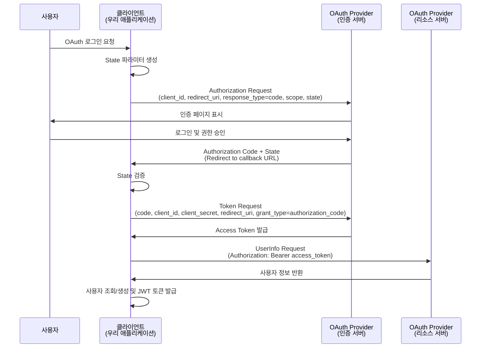
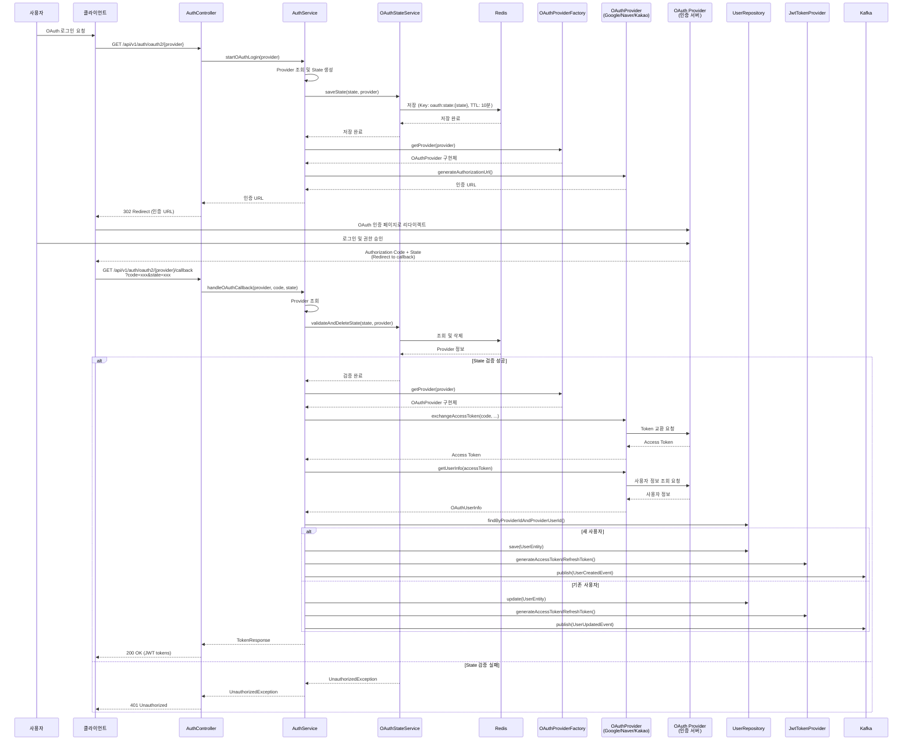

# OAuth Provider별 로그인 기능 구현 설계 가이드

## 목차

1. [개요](#1-개요)
2. [현재 구현 분석](#2-현재-구현-분석)
3. [OAuth 2.0 표준 및 각 Provider 분석](#3-oauth-20-표준-및-각-provider-분석)
4. [OAuth Provider별 구현 설계](#4-oauth-provider별-구현-설계)
5. [실제 구현 가이드](#5-실제-구현-가이드)
6. [보안 고려사항](#6-보안-고려사항)
7. [참고 자료](#7-참고-자료)

---

## 1. 개요

### 1.1 OAuth 2.0 개요

OAuth 2.0은 제3자 애플리케이션이 사용자의 리소스에 제한적으로 접근할 수 있도록 하는 인증 및 인가 프레임워크입니다. 이 프로젝트는 **Authorization Code Flow**를 사용하여 OAuth 로그인을 구현합니다.

**OAuth 2.0 Authorization Code Flow의 주요 단계:**

1. 사용자가 OAuth 로그인을 요청
2. OAuth Provider의 인증 페이지로 리다이렉트
3. 사용자가 인증 및 권한 승인
4. Authorization Code를 받아서 콜백 URL로 리다이렉트
5. Authorization Code를 Access Token으로 교환
6. Access Token으로 사용자 정보 조회
7. 사용자 정보를 기반으로 JWT 토큰 발급

### 1.2 지원 Provider 목록

이 프로젝트는 다음 OAuth Provider를 지원합니다:

- **Google OAuth 2.0**: Google 계정을 통한 로그인
- **Naver OAuth 2.0**: 네이버 계정을 통한 로그인
- **Kakao OAuth 2.0**: 카카오 계정을 통한 로그인

### 1.3 기존 인증 시스템과의 통합 전략

OAuth 로그인은 기존 JWT 토큰 기반 인증 시스템과 완전히 통합됩니다:

- **통일된 인증 방식**: OAuth 로그인 후에도 동일한 JWT 토큰 발급
- **기존 필터 재사용**: `JwtAuthenticationFilter`를 통해 OAuth 로그인 사용자도 동일하게 인증 처리
- **사용자 엔티티 통합**: OAuth 사용자와 일반 사용자가 동일한 `UserEntity` 사용
- **이벤트 발행**: OAuth 로그인 시에도 `UserCreatedEvent` 또는 `UserUpdatedEvent` 발행

---

## 2. 현재 구현 분석

### 2.1 기존 OAuth 관련 코드 분석

#### AuthController OAuth 엔드포인트

```94:113:api/auth/src/main/java/com/tech/n/ai/api/auth/controller/AuthController.java
    /**
     * OAuth 로그인 시작
     */
    @GetMapping("/oauth2/{provider}")
    public ResponseEntity<Void> startOAuthLogin(@PathVariable String provider) {
        String authUrl = authFacade.startOAuthLogin(provider);
        return ResponseEntity.status(302).header("Location", authUrl).build();
    }
    
    /**
     * OAuth 로그인 콜백
     */
    @GetMapping("/oauth2/{provider}/callback")
    public ResponseEntity<ApiResponse<TokenResponse>> handleOAuthCallback(
            @PathVariable String provider,
            @RequestParam String code,
            @RequestParam(required = false) String state) {
        TokenResponse response = authFacade.handleOAuthCallback(provider, code, state);
        return ResponseEntity.ok(ApiResponse.success(response));
    }
```

**엔드포인트 설명:**

1. **`GET /api/v1/auth/oauth2/{provider}`**: OAuth 로그인 시작
   - `provider`: OAuth Provider 이름 (예: "google", "naver", "kakao")
   - 응답: 302 Redirect로 OAuth Provider 인증 페이지로 리다이렉트

2. **`GET /api/v1/auth/oauth2/{provider}/callback`**: OAuth 로그인 콜백
   - `provider`: OAuth Provider 이름
   - `code`: Authorization Code (OAuth Provider에서 발급)
   - `state`: CSRF 방지를 위한 State 파라미터 (선택적)
   - 응답: JWT Access Token 및 Refresh Token

#### AuthService OAuth 메서드

```385:407:api/auth/src/main/java/com/tech/n/ai/api/auth/service/AuthService.java
    /**
     * OAuth 로그인 시작
     */
    public String startOAuthLogin(String providerName) {
        // Provider 조회
        ProviderEntity provider = providerReaderRepository.findByName(providerName.toUpperCase())
                .orElseThrow(() -> new ResourceNotFoundException("지원하지 않는 OAuth 제공자입니다."));
        
        // 활성화 여부 확인
        if (!Boolean.TRUE.equals(provider.getIsEnabled())) {
            throw new UnauthorizedException("비활성화된 OAuth 제공자입니다.");
        }
        
        // CSRF 방지를 위한 state 파라미터 생성
        String state = generateSecureToken();
        
        // OAuth 인증 URL 생성 (실제 구현은 OAuth 제공자별로 다름)
        // 여기서는 예시로만 구현
        String authUrl = String.format("https://oauth-provider.com/authorize?client_id=%s&state=%s", 
                provider.getClientId(), state);
        
        return authUrl;
    }
```

**현재 구현 상태:**

- Provider 조회 및 활성화 확인: ✅ 구현됨
- State 파라미터 생성: ✅ 구현됨
- OAuth 인증 URL 생성: ❌ 예시 코드만 존재 (Provider별 구현 필요)

```409:506:api/auth/src/main/java/com/tech/n/ai/api/auth/service/AuthService.java
    /**
     * OAuth 로그인 콜백
     */
    @Transactional
    public TokenResponse handleOAuthCallback(String providerName, String code, String state) {
        // Provider 조회
        ProviderEntity provider = providerReaderRepository.findByName(providerName.toUpperCase())
                .orElseThrow(() -> new ResourceNotFoundException("지원하지 않는 OAuth 제공자입니다."));
        
        // 활성화 여부 확인
        if (!Boolean.TRUE.equals(provider.getIsEnabled())) {
            throw new UnauthorizedException("비활성화된 OAuth 제공자입니다.");
        }
        
        // OAuth 인증 코드로 Access Token 교환 (실제 구현은 OAuth 제공자별로 다름)
        // 여기서는 예시로만 구현
        String oauthAccessToken = "oauth-access-token";
        
        // OAuth 제공자 API로 사용자 정보 조회 (실제 구현은 OAuth 제공자별로 다름)
        // 여기서는 예시로만 구현
        String providerUserId = "provider-user-id";
        String email = "oauth-user@example.com";
        String username = "oauth-user";
        
        // User 엔티티 조회/생성
        Optional<UserEntity> userOpt = userReaderRepository.findByProviderIdAndProviderUserId(
                provider.getId(), providerUserId);
        
        UserEntity user;
        boolean isNewUser = false;
        
        if (userOpt.isEmpty() || Boolean.TRUE.equals(userOpt.get().getIsDeleted())) {
            // 새 사용자 생성
            user = new UserEntity();
            user.setEmail(email);
            user.setUsername(username);
            user.setPassword(null);
            user.setProviderId(provider.getId());
            user.setProviderUserId(providerUserId);
            user.setIsEmailVerified(true);
            user = userWriterRepository.save(user);
            isNewUser = true;
        } else {
            // 기존 사용자 업데이트
            user = userOpt.get();
            user.setEmail(email);
            user.setUsername(username);
            user = userWriterRepository.save(user);
        }
        
        // JWT 토큰 생성
        JwtTokenPayload payload = new JwtTokenPayload(
            String.valueOf(user.getId()),
            user.getEmail(),
            USER_ROLE
        );
        String accessToken = jwtTokenProvider.generateAccessToken(payload);
        String refreshToken = jwtTokenProvider.generateRefreshToken(payload);
        
        // RefreshToken 저장
        refreshTokenService.saveRefreshToken(
            user.getId(),
            refreshToken,
            jwtTokenProvider.getRefreshTokenExpiresAt()
        );
        
        // Kafka 이벤트 발행
        if (isNewUser) {
            UserCreatedEvent.UserCreatedPayload createdPayload = new UserCreatedEvent.UserCreatedPayload(
                String.valueOf(user.getId()),
                String.valueOf(user.getId()),
                user.getUsername(),
                user.getEmail(),
                null
            );
            UserCreatedEvent event = new UserCreatedEvent(createdPayload);
            eventPublisher.publish(KAFKA_TOPIC_USER_EVENTS, event, String.valueOf(user.getId()));
        } else {
            Map<String, Object> updatedFields = new HashMap<>();
            updatedFields.put("email", user.getEmail());
            updatedFields.put("username", user.getUsername());
            UserUpdatedEvent.UserUpdatedPayload updatedPayload = new UserUpdatedEvent.UserUpdatedPayload(
                String.valueOf(user.getId()),
                String.valueOf(user.getId()),
                updatedFields
            );
            UserUpdatedEvent event = new UserUpdatedEvent(updatedPayload);
            eventPublisher.publish(KAFKA_TOPIC_USER_EVENTS, event, String.valueOf(user.getId()));
        }
        
        return new TokenResponse(
            accessToken,
            refreshToken,
            "Bearer",
            3600L,
            604800L
        );
    }
```

**현재 구현 상태:**

- Provider 조회 및 활성화 확인: ✅ 구현됨
- Access Token 교환: ❌ 예시 코드만 존재 (Provider별 구현 필요)
- 사용자 정보 조회: ❌ 예시 코드만 존재 (Provider별 구현 필요)
- 사용자 조회/생성: ✅ 구현됨
- JWT 토큰 발급: ✅ 구현됨
- Kafka 이벤트 발행: ✅ 구현됨

### 2.2 ProviderEntity 구조 분석

```8:28:domain/aurora/src/main/java/com/tech/n/ai/domain/mariadb/entity/auth/ProviderEntity.java
@Entity
@Table(name = "providers")
@Getter
@Setter
public class ProviderEntity extends BaseEntity {

    @Column(name = "name", length = 50, nullable = false, unique = true)
    private String name;

    @Column(name = "display_name", length = 100, nullable = false)
    private String displayName;

    @Column(name = "client_id", length = 255)
    private String clientId;

    @Column(name = "client_secret", length = 500)
    private String clientSecret;

    @Column(name = "is_enabled", nullable = false)
    private Boolean isEnabled = true;
}
```

**ProviderEntity 필드 설명:**

- **name**: Provider 이름 (예: "GOOGLE", "NAVER", "KAKAO") - UNIQUE 제약조건
- **displayName**: 표시 이름 (예: "Google", "네이버", "카카오")
- **clientId**: OAuth Client ID (각 Provider 개발자 콘솔에서 발급)
- **clientSecret**: OAuth Client Secret (각 Provider 개발자 콘솔에서 발급, 암호화 저장 권장)
- **isEnabled**: Provider 활성화 여부 (비활성화 시 로그인 불가)

### 2.3 UserEntity OAuth 관련 필드 분석

```27:35:domain/aurora/src/main/java/com/tech/n/ai/domain/mariadb/entity/auth/UserEntity.java
    @ManyToOne(fetch = FetchType.LAZY)
    @JoinColumn(name = "provider_id")
    private ProviderEntity provider;

    @Column(name = "provider_id", insertable = false, updatable = false)
    private Long providerId;

    @Column(name = "provider_user_id", length = 255)
    private String providerUserId;
```

**OAuth 관련 필드 설명:**

- **provider**: ProviderEntity와의 Many-to-One 관계
- **providerId**: Provider ID (외래키)
- **providerUserId**: OAuth Provider에서 발급한 사용자 고유 ID

**사용자 조회 메서드:**

```24:30:domain/aurora/src/main/java/com/tech/n/ai/domain/mariadb/repository/reader/auth/UserReaderRepository.java
    /**
     * Provider ID와 Provider User ID로 조회 (OAuth 사용자 조회)
     * 
     * @param providerId Provider ID
     * @param providerUserId Provider User ID
     * @return UserEntity (Optional)
     */
    Optional<UserEntity> findByProviderIdAndProviderUserId(Long providerId, String providerUserId);
```

### 2.4 기존 설계 가이드와의 정합성

**기존 설계 가이드 문서 참조:**

1. **`docs/spring-security-auth-design-guide.md`**
   - OAuth 로그인 플로우 다이어그램 포함
   - JWT 토큰 발급 로직 설명
   - 기존 인증 시스템 구조 설명

2. **`docs/phase1/3. aurora-schema-design.md`**
   - Provider 테이블 스키마 설계
   - User 테이블의 OAuth 관련 필드 설계

3. **`docs/phase2/2. data-model-design.md`**
   - Provider 엔티티 데이터 모델 설계
   - User 엔티티의 OAuth 관련 필드 설명

**정합성 확인:**

- ✅ ProviderEntity 구조는 기존 설계와 일치
- ✅ UserEntity의 OAuth 관련 필드는 기존 설계와 일치
- ✅ OAuth 로그인 플로우는 기존 설계 가이드와 일치
- ✅ JWT 토큰 발급 로직은 기존 인증 시스템과 통합됨

---

## 3. OAuth 2.0 표준 및 각 Provider 분석

### 3.1 OAuth 2.0 Authorization Code Flow

OAuth 2.0 Authorization Code Flow는 웹 서버 애플리케이션에 권장되는 인증 방식입니다.

**플로우 다이어그램:**



**주요 단계:**

1. **Authorization Request**: 클라이언트가 인증 서버로 인증 요청
2. **User Authorization**: 사용자가 인증 서버에서 로그인 및 권한 승인
3. **Authorization Code 발급**: 인증 서버가 Authorization Code를 클라이언트로 전달
4. **Access Token 교환**: 클라이언트가 Authorization Code를 Access Token으로 교환
5. **사용자 정보 조회**: Access Token으로 사용자 정보 API 호출

### 3.2 Google OAuth 2.0 분석

**공식 문서:**
- Google OAuth 2.0 for Web Server Applications: https://developers.google.com/identity/protocols/oauth2/web-server
- Google Identity Platform: https://developers.google.com/identity

**API 엔드포인트:**

- **Authorization Endpoint**: `https://accounts.google.com/o/oauth2/v2/auth`
- **Token Endpoint**: `https://oauth2.googleapis.com/token`
- **UserInfo Endpoint**: `https://www.googleapis.com/oauth2/v2/userinfo`

**인증 URL 파라미터:**

| 파라미터 | 필수 | 설명 |
|---------|------|------|
| `client_id` | ✅ | Google Cloud Console에서 발급한 Client ID |
| `redirect_uri` | ✅ | 콜백 URL (Google Cloud Console에 등록된 URL) |
| `response_type` | ✅ | `code` (Authorization Code Flow) |
| `scope` | ✅ | 요청 권한 범위 (예: `openid email profile`) |
| `state` | 권장 | CSRF 방지를 위한 랜덤 문자열 |
| `access_type` | 선택 | `online` (기본값) 또는 `offline` (Refresh Token 필요 시) |
| `prompt` | 선택 | `consent` (항상 권한 승인 요청), `select_account` (계정 선택) |

**Token 교환 요청:**

- **Method**: POST
- **Content-Type**: `application/x-www-form-urlencoded`
- **파라미터**:
  - `code`: Authorization Code
  - `client_id`: Client ID
  - `client_secret`: Client Secret
  - `redirect_uri`: 콜백 URL (Authorization Request와 동일)
  - `grant_type`: `authorization_code`

**사용자 정보 응답:**

```json
{
  "id": "123456789",
  "email": "user@example.com",
  "verified_email": true,
  "name": "John Doe",
  "given_name": "John",
  "family_name": "Doe",
  "picture": "https://lh3.googleusercontent.com/...",
  "locale": "ko"
}
```

**필드 매핑:**

- `id` → `providerUserId`
- `email` → `email`
- `name` → `username` (또는 `given_name` + `family_name` 조합)

### 3.3 Naver OAuth 2.0 분석

**공식 문서:**
- Naver 개발자 센터: https://developers.naver.com/
- Naver 로그인 API 가이드: https://developers.naver.com/docs/login/api/

**API 엔드포인트:**

- **Authorization Endpoint**: `https://nid.naver.com/oauth2.0/authorize`
- **Token Endpoint**: `https://nid.naver.com/oauth2.0/token`
- **UserInfo Endpoint**: `https://openapi.naver.com/v1/nid/me`

**인증 URL 파라미터:**

| 파라미터 | 필수 | 설명 |
|---------|------|------|
| `client_id` | ✅ | 네이버 개발자 센터에서 발급한 Client ID |
| `redirect_uri` | ✅ | 콜백 URL (네이버 개발자 센터에 등록된 URL) |
| `response_type` | ✅ | `code` (Authorization Code Flow) |
| `state` | 권장 | CSRF 방지를 위한 랜덤 문자열 |

**Token 교환 요청:**

- **Method**: GET 또는 POST
- **파라미터**:
  - `grant_type`: `authorization_code`
  - `client_id`: Client ID
  - `client_secret`: Client Secret
  - `code`: Authorization Code
  - `state`: State 파라미터 (선택적)

**사용자 정보 응답:**

```json
{
  "resultcode": "00",
  "message": "success",
  "response": {
    "id": "12345678",
    "email": "user@example.com",
    "name": "홍길동",
    "nickname": "홍길동",
    "profile_image": "https://ssl.pstatic.net/static/pwe/address/img_profile.png",
    "age": "20-29",
    "gender": "M",
    "birthday": "01-01",
    "birthyear": "1990"
  }
}
```

**필드 매핑:**

- `response.id` → `providerUserId`
- `response.email` → `email`
- `response.name` 또는 `response.nickname` → `username`

**특화 사항:**

- 응답이 `resultcode`와 `message`로 래핑됨
- 실제 사용자 정보는 `response` 객체 내부에 있음
- `resultcode`가 "00"이면 성공

### 3.4 Kakao OAuth 2.0 분석

**공식 문서:**
- Kakao Developers: https://developers.kakao.com/
- Kakao 로그인 REST API: https://developers.kakao.com/docs/latest/ko/kakaologin/rest-api

**API 엔드포인트:**

- **Authorization Endpoint**: `https://kauth.kakao.com/oauth/authorize`
- **Token Endpoint**: `https://kauth.kakao.com/oauth/token`
- **UserInfo Endpoint**: `https://kapi.kakao.com/v2/user/me`

**인증 URL 파라미터:**

| 파라미터 | 필수 | 설명 |
|---------|------|------|
| `client_id` | ✅ | Kakao Developers에서 발급한 REST API Key |
| `redirect_uri` | ✅ | 콜백 URL (Kakao Developers에 등록된 URL) |
| `response_type` | ✅ | `code` (Authorization Code Flow) |
| `state` | 권장 | CSRF 방지를 위한 랜덤 문자열 |

**Token 교환 요청:**

- **Method**: POST
- **Content-Type**: `application/x-www-form-urlencoded`
- **파라미터**:
  - `grant_type`: `authorization_code`
  - `client_id`: REST API Key
  - `redirect_uri`: 콜백 URL
  - `code`: Authorization Code

**사용자 정보 응답:**

```json
{
  "id": 123456789,
  "kakao_account": {
    "email": "user@example.com",
    "email_needs_agreement": false,
    "is_email_valid": true,
    "is_email_verified": true,
    "profile": {
      "nickname": "홍길동",
      "thumbnail_image_url": "https://...",
      "profile_image_url": "https://..."
    }
  }
}
```

**필드 매핑:**

- `id` → `providerUserId` (숫자 타입이므로 문자열로 변환 필요)
- `kakao_account.email` → `email`
- `kakao_account.profile.nickname` → `username`

**특화 사항:**

- 사용자 정보가 `kakao_account` 객체 내부에 중첩되어 있음
- 이메일은 사용자가 동의한 경우에만 제공됨 (`email_needs_agreement: false`)
- `id`는 숫자 타입이므로 문자열로 변환 필요

### 3.5 Provider별 차이점 비교

| 항목 | Google | Naver | Kakao |
|------|--------|-------|-------|
| **Authorization Endpoint** | `https://accounts.google.com/o/oauth2/v2/auth` | `https://nid.naver.com/oauth2.0/authorize` | `https://kauth.kakao.com/oauth/authorize` |
| **Token Endpoint** | `https://oauth2.googleapis.com/token` | `https://nid.naver.com/oauth2.0/token` | `https://kauth.kakao.com/oauth/token` |
| **UserInfo Endpoint** | `https://www.googleapis.com/oauth2/v2/userinfo` | `https://openapi.naver.com/v1/nid/me` | `https://kapi.kakao.com/v2/user/me` |
| **Token 교환 Method** | POST | GET/POST | POST |
| **사용자 정보 응답 구조** | 평면 구조 | `response` 객체로 래핑 | `kakao_account` 객체로 중첩 |
| **Provider User ID 타입** | 문자열 | 문자열 | 숫자 (문자열 변환 필요) |
| **이메일 필수 여부** | 선택적 | 선택적 | 동의 필요 |
| **Scope 파라미터** | 필수 | 불필요 | 불필요 |

---

## 4. OAuth Provider별 구현 설계

### 4.1 공통 인터페이스 설계

각 OAuth Provider의 공통 기능을 추상화한 인터페이스를 정의합니다.

**OAuthProvider 인터페이스:**

```java
package com.tech.n.ai.api.auth.oauth;

/**
 * OAuth Provider 공통 인터페이스
 * 
 * 각 OAuth Provider (Google, Naver, Kakao)는 이 인터페이스를 구현합니다.
 */
public interface OAuthProvider {
    /**
     * OAuth 인증 URL 생성
     * 
     * @param clientId Client ID
     * @param redirectUri Redirect URI
     * @param state State 파라미터 (CSRF 방지)
     * @return OAuth 인증 URL
     */
    String generateAuthorizationUrl(String clientId, String redirectUri, String state);
    
    /**
     * Authorization Code로 Access Token 교환
     * 
     * @param code Authorization Code
     * @param clientId Client ID
     * @param clientSecret Client Secret
     * @param redirectUri Redirect URI
     * @return Access Token
     */
    String exchangeAccessToken(String code, String clientId, String clientSecret, String redirectUri);
    
    /**
     * Access Token으로 사용자 정보 조회
     * 
     * @param accessToken Access Token
     * @return 사용자 정보 (email, username, providerUserId)
     */
    OAuthUserInfo getUserInfo(String accessToken);
}
```

**OAuthUserInfo 레코드 (client/feign 모듈):**

```java
package com.tech.n.ai.client.feign.domain.oauth.contract;

import lombok.Builder;

/**
 * OAuth 사용자 정보
 * 
 * @param providerUserId Provider에서 발급한 사용자 고유 ID
 * @param email 이메일 주소
 * @param username 사용자명
 */
@Builder
public record OAuthUserInfo(
    String providerUserId,
    String email,
    String username
) {
}
```

**참고**: `OAuthUserInfo`는 `client/feign` 모듈의 `OAuthDto.OAuthUserInfo`를 사용합니다. `api/auth` 모듈에서는 이 레코드를 import하여 사용합니다.

**OAuthProviderFactory (선택적):**

```java
package com.tech.n.ai.api.auth.oauth;

import lombok.RequiredArgsConstructor;
import org.springframework.stereotype.Component;

import java.util.Map;

/**
 * OAuth Provider Factory
 * 
 * Provider 이름으로 적절한 OAuthProvider 구현체를 반환합니다.
 */
@Component
@RequiredArgsConstructor
public class OAuthProviderFactory {
    
    private final Map<String, OAuthProvider> providers;
    
    /**
     * Provider 이름으로 OAuthProvider 조회
     * 
     * @param providerName Provider 이름 (예: "GOOGLE", "NAVER", "KAKAO")
     * @return OAuthProvider 구현체
     */
    public OAuthProvider getProvider(String providerName) {
        OAuthProvider provider = providers.get(providerName.toUpperCase());
        if (provider == null) {
            throw new ResourceNotFoundException("지원하지 않는 OAuth 제공자입니다: " + providerName);
        }
        return provider;
    }
}
```

**설계 원칙:**

- **인터페이스 기반 설계**: 각 Provider별 구현 클래스가 인터페이스를 구현
- **단순성 유지**: 필요한 기능만 포함, 오버엔지니어링 방지
- **확장성**: 새로운 Provider 추가 시 인터페이스 구현만으로 추가 가능
- **의존성 주입**: Spring의 `@Component`와 `Map<String, OAuthProvider>`를 활용한 자동 주입

### 4.2 Google OAuth 구현 설계

**GoogleOAuthProvider 구현:**

구현 코드는 Step 2에서 상세히 설명합니다.

**Google 특화 처리 사항:**

- **Scope 설정**: `openid email profile` 필수
- **Access Type**: `online` (기본값, Refresh Token 불필요)
- **사용자 정보 응답**: 평면 구조로 간단하게 파싱 가능
- **에러 처리**: Google API는 표준 OAuth 2.0 에러 응답 형식 사용

### 4.3 Naver OAuth 구현 설계

**NaverOAuthProvider 구현:**

구현 코드는 Step 3에서 상세히 설명합니다.

**Naver 특화 처리 사항:**

- **응답 구조**: `resultcode`와 `message`로 래핑, 실제 데이터는 `response` 객체 내부
- **에러 처리**: `resultcode`가 "00"이 아니면 에러 처리
- **Token 교환**: GET 또는 POST 모두 지원 (POST 권장)
- **State 파라미터**: 선택적이지만 빈 문자열로 전송 가능

### 4.4 Kakao OAuth 구현 설계

**KakaoOAuthProvider 구현:**

구현 코드는 Step 4에서 상세히 설명합니다.

**Kakao 특화 처리 사항:**

- **사용자 정보 구조**: `kakao_account` 객체 내부에 중첩
- **Provider User ID**: 숫자 타입이므로 문자열로 변환 필요 (`Long id` → `String.valueOf(id)`)
- **이메일 동의**: 사용자가 이메일 제공에 동의한 경우에만 제공
- **이메일 검증**: `is_email_verified` 필드로 이메일 검증 여부 확인 가능
- **Client Secret**: 선택적 (보안 강화용, 없어도 동작)
- **이메일 없음 처리**: 이메일이 없는 경우 임시 이메일 생성 고려

### 4.5 통합 전략

**OAuthProviderFactory 패턴:**

OAuthProviderFactory는 Step 1에서 상세히 설명합니다.

**AuthService 통합:**

기존 `AuthService.startOAuthLogin()` 및 `handleOAuthCallback()` 메서드를 수정하여 `OAuthProvider` 인터페이스를 사용하도록 통합합니다.

**통합 원칙:**

- 기존 코드 구조 유지
- Provider별 구현은 인터페이스로 추상화
- 기존 JWT 토큰 발급 로직 재사용
- 기존 Kafka 이벤트 발행 로직 재사용

**통합 플로우 다이어그램:**



---

## 5. 실제 구현 가이드

### 5.1 설정 및 준비

#### Google OAuth 설정

1. **Google Cloud Console 접속**: https://console.cloud.google.com/
2. **프로젝트 생성 또는 선택**
3. **OAuth 2.0 클라이언트 ID 생성**:
   - APIs & Services > Credentials
   - Create Credentials > OAuth client ID
   - Application type: Web application
   - Authorized redirect URIs: `https://your-domain.com/api/v1/auth/oauth2/google/callback`
4. **Client ID 및 Client Secret 발급**
5. **ProviderEntity 데이터 준비**:
   ```sql
   INSERT INTO providers (id, name, display_name, client_id, client_secret, is_enabled)
   VALUES (TSID 생성, 'GOOGLE', 'Google', 'your-client-id', 'your-client-secret', true);
   ```

#### Naver OAuth 설정

1. **Naver 개발자 센터 접속**: https://developers.naver.com/
2. **애플리케이션 등록**:
   - 애플리케이션 이름, 사용 API (네이버 로그인) 선택
   - 서비스 URL: `https://your-domain.com`
   - Callback URL: `https://your-domain.com/api/v1/auth/oauth2/naver/callback`
3. **Client ID 및 Client Secret 발급**
4. **ProviderEntity 데이터 준비**:
   ```sql
   INSERT INTO providers (id, name, display_name, client_id, client_secret, is_enabled)
   VALUES (TSID 생성, 'NAVER', '네이버', 'your-client-id', 'your-client-secret', true);
   ```

#### Kakao OAuth 설정

1. **Kakao Developers 접속**: https://developers.kakao.com/
2. **애플리케이션 등록**:
   - 앱 이름, 사업자명 입력
   - 플랫폼 추가 (Web 플랫폼)
   - 사이트 도메인: `https://your-domain.com`
3. **카카오 로그인 활성화**:
   - 제품 설정 > 카카오 로그인 > 활성화
   - Redirect URI: `https://your-domain.com/api/v1/auth/oauth2/kakao/callback`
4. **REST API Key 발급** (Client ID로 사용)
5. **Client Secret 발급** (선택적, 보안 강화용)
6. **ProviderEntity 데이터 준비**:
   ```sql
   INSERT INTO providers (id, name, display_name, client_id, client_secret, is_enabled)
   VALUES (TSID 생성, 'KAKAO', '카카오', 'your-rest-api-key', 'your-client-secret', true);
   ```

### 5.2 의존성 추가

**build.gradle (api/auth 모듈):**

```gradle
dependencies {
    // 기존 의존성...
    
    // OpenFeign 클라이언트 모듈
    implementation project(':client-feign')
}
```

**HTTP Client 선택:**

- **OpenFeign 클라이언트**: 외부 API 연동 전용 (권장)
  - 프로젝트의 `client/feign` 모듈 사용
  - Contract Pattern으로 일관된 구조 유지
  - Mock/Real 구현체 선택 가능 (`@ConditionalOnProperty`)
  - Profile별 설정 분리 (`application-feign-oauth.yml`)
  - 외부 API 연동은 `client/feign` 모듈 사용이 프로젝트 아키텍처와 일치
  - 모듈 의존성 방향 준수: `api/auth` → `client/feign` ✅

**참고**: 
- OAuth Provider API 요청은 외부 API이므로 `client/feign` 모듈 사용이 적합합니다.
- 자세한 선택 근거는 `docs/oauth-feign-client-migration-analysis.md` 문서를 참고하세요.

### 5.3 구현 단계별 가이드

#### Step 1: OAuth Provider 인터페이스 정의

**파일 위치**: `api/auth/src/main/java/com/tech/n/ai/api/auth/oauth/OAuthProvider.java`

```java
package com.tech.n.ai.api.auth.oauth;

/**
 * OAuth Provider 공통 인터페이스
 */
public interface OAuthProvider {
    /**
     * OAuth 인증 URL 생성
     */
    String generateAuthorizationUrl(String clientId, String redirectUri, String state);
    
    /**
     * Authorization Code로 Access Token 교환
     */
    String exchangeAccessToken(String code, String clientId, String clientSecret, String redirectUri);
    
    /**
     * Access Token으로 사용자 정보 조회
     */
    OAuthUserInfo getUserInfo(String accessToken);
}
```

**참고**: `OAuthUserInfo`는 `client/feign` 모듈의 `OAuthDto.OAuthUserInfo`를 사용합니다. `api/auth` 모듈에서는 이 레코드를 import하여 사용합니다.

#### Step 8: Google OAuth Provider 구현 (api/auth 모듈)

**파일 위치**: `api/auth/src/main/java/com/tech/n/ai/api/auth/oauth/GoogleOAuthProvider.java`

**구현 예시:**

```java
package com.tech.n.ai.api.auth.oauth;

import com.tech.n.ai.client.feign.domain.oauth.contract.OAuthDto.OAuthTokenRequest;
import com.tech.n.ai.client.feign.domain.oauth.contract.OAuthDto.OAuthUserInfo;
import com.tech.n.ai.client.feign.domain.oauth.contract.OAuthProviderContract;
import lombok.RequiredArgsConstructor;
import lombok.extern.slf4j.Slf4j;
import org.springframework.stereotype.Component;
import org.springframework.web.util.UriComponentsBuilder;

@Component
@RequiredArgsConstructor
@Slf4j
public class GoogleOAuthProvider implements OAuthProvider {
    
    private static final String AUTHORIZATION_ENDPOINT = "https://accounts.google.com/o/oauth2/v2/auth";
    private static final String SCOPE = "openid email profile";
    
    private final OAuthProviderContract oauthProviderContract;
    
    @Override
    public String generateAuthorizationUrl(String clientId, String redirectUri, String state) {
        return UriComponentsBuilder.fromHttpUrl(AUTHORIZATION_ENDPOINT)
            .queryParam("client_id", clientId)
            .queryParam("redirect_uri", redirectUri)
            .queryParam("response_type", "code")
            .queryParam("scope", SCOPE)
            .queryParam("state", state)
            .queryParam("access_type", "online")
            .build()
            .toUriString();
    }
    
    @Override
    public String exchangeAccessToken(String code, String clientId, String clientSecret, String redirectUri) {
        OAuthTokenRequest request = OAuthTokenRequest.builder()
            .code(code)
            .clientId(clientId)
            .clientSecret(clientSecret)
            .redirectUri(redirectUri)
            .grantType("authorization_code")
            .build();
        
        return oauthProviderContract.exchangeAccessToken("GOOGLE", request);
    }
    
    @Override
    public OAuthUserInfo getUserInfo(String accessToken) {
        return oauthProviderContract.getUserInfo("GOOGLE", accessToken);
    }
}
```

**주요 구현 포인트:**

1. **인증 URL 생성**: Google 공식 문서의 파라미터 형식 준수
   - `scope`: `openid email profile` 필수
   - `access_type`: `online` (Refresh Token 불필요)
   - 인증 URL 생성은 단순 URL 생성이므로 FeignClient 불필요

2. **Access Token 교환**: OpenFeign Contract 인터페이스 사용
   - `OAuthProviderContract.exchangeAccessToken()` 호출
   - 실제 HTTP 요청은 `client/feign` 모듈의 `GoogleOAuthApi`에서 처리

3. **사용자 정보 조회**: OpenFeign Contract 인터페이스 사용
   - `OAuthProviderContract.getUserInfo()` 호출
   - 실제 HTTP 요청은 `client/feign` 모듈의 `GoogleOAuthApi`에서 처리

#### Step 9: Naver OAuth Provider 구현 (api/auth 모듈)

**파일 위치**: `api/auth/src/main/java/com/tech/n/ai/api/auth/oauth/NaverOAuthProvider.java`

**구현 예시:**

```java
package com.tech.n.ai.api.auth.oauth;

import com.tech.n.ai.client.feign.domain.oauth.contract.OAuthDto.OAuthTokenRequest;
import com.tech.n.ai.client.feign.domain.oauth.contract.OAuthDto.OAuthUserInfo;
import com.tech.n.ai.client.feign.domain.oauth.contract.OAuthProviderContract;
import lombok.RequiredArgsConstructor;
import lombok.extern.slf4j.Slf4j;
import org.springframework.stereotype.Component;
import org.springframework.web.util.UriComponentsBuilder;

@Component
@RequiredArgsConstructor
@Slf4j
public class NaverOAuthProvider implements OAuthProvider {
    
    private static final String AUTHORIZATION_ENDPOINT = "https://nid.naver.com/oauth2.0/authorize";
    
    private final OAuthProviderContract oauthProviderContract;
    
    @Override
    public String generateAuthorizationUrl(String clientId, String redirectUri, String state) {
        return UriComponentsBuilder.fromHttpUrl(AUTHORIZATION_ENDPOINT)
            .queryParam("client_id", clientId)
            .queryParam("redirect_uri", redirectUri)
            .queryParam("response_type", "code")
            .queryParam("state", state)
            .build()
            .toUriString();
    }
    
    @Override
    public String exchangeAccessToken(String code, String clientId, String clientSecret, String redirectUri) {
        OAuthTokenRequest request = OAuthTokenRequest.builder()
            .code(code)
            .clientId(clientId)
            .clientSecret(clientSecret)
            .redirectUri(redirectUri)
            .grantType("authorization_code")
            .build();
        
        return oauthProviderContract.exchangeAccessToken("NAVER", request);
    }
    
    @Override
    public OAuthUserInfo getUserInfo(String accessToken) {
        return oauthProviderContract.getUserInfo("NAVER", accessToken);
    }
}
```

**주요 구현 포인트:**

1. **인증 URL 생성**: Naver 공식 문서의 파라미터 형식 준수
   - 공식 문서: https://developers.naver.com/docs/login/api/
   - 인증 URL 생성은 단순 URL 생성이므로 FeignClient 불필요

2. **Access Token 교환**: OpenFeign Contract 인터페이스 사용
   - `OAuthProviderContract.exchangeAccessToken()` 호출
   - 실제 HTTP 요청은 `client/feign` 모듈의 `NaverOAuthApi`에서 처리
   - Naver는 `state` 파라미터를 선택적으로 요구하므로 `NaverOAuthApi`에서 처리

3. **사용자 정보 조회**: OpenFeign Contract 인터페이스 사용
   - `OAuthProviderContract.getUserInfo()` 호출
   - 실제 HTTP 요청은 `client/feign` 모듈의 `NaverOAuthApi`에서 처리
   - 응답 파싱 (`resultcode` 확인 등)은 `NaverOAuthApi`에서 처리

#### Step 10: Kakao OAuth Provider 구현 (api/auth 모듈)

**파일 위치**: `api/auth/src/main/java/com/tech/n/ai/api/auth/oauth/KakaoOAuthProvider.java`

**구현 예시:**

```java
package com.tech.n.ai.api.auth.oauth;

import com.tech.n.ai.client.feign.domain.oauth.contract.OAuthDto.OAuthTokenRequest;
import com.tech.n.ai.client.feign.domain.oauth.contract.OAuthDto.OAuthUserInfo;
import com.tech.n.ai.client.feign.domain.oauth.contract.OAuthProviderContract;
import lombok.RequiredArgsConstructor;
import lombok.extern.slf4j.Slf4j;
import org.springframework.stereotype.Component;
import org.springframework.web.util.UriComponentsBuilder;

@Component
@RequiredArgsConstructor
@Slf4j
public class KakaoOAuthProvider implements OAuthProvider {
    
    private static final String AUTHORIZATION_ENDPOINT = "https://kauth.kakao.com/oauth/authorize";
    
    private final OAuthProviderContract oauthProviderContract;
    
    @Override
    public String generateAuthorizationUrl(String clientId, String redirectUri, String state) {
        return UriComponentsBuilder.fromHttpUrl(AUTHORIZATION_ENDPOINT)
            .queryParam("client_id", clientId)
            .queryParam("redirect_uri", redirectUri)
            .queryParam("response_type", "code")
            .queryParam("state", state)
            .build()
            .toUriString();
    }
    
    @Override
    public String exchangeAccessToken(String code, String clientId, String clientSecret, String redirectUri) {
        OAuthTokenRequest request = OAuthTokenRequest.builder()
            .code(code)
            .clientId(clientId)
            .clientSecret(clientSecret)
            .redirectUri(redirectUri)
            .grantType("authorization_code")
            .build();
        
        return oauthProviderContract.exchangeAccessToken("KAKAO", request);
    }
    
    @Override
    public OAuthUserInfo getUserInfo(String accessToken) {
        return oauthProviderContract.getUserInfo("KAKAO", accessToken);
    }
}
```

**주요 구현 포인트:**

1. **인증 URL 생성**: Kakao 공식 문서의 파라미터 형식 준수
   - 공식 문서: https://developers.kakao.com/docs/latest/ko/kakaologin/rest-api
   - 인증 URL 생성은 단순 URL 생성이므로 FeignClient 불필요

2. **Access Token 교환**: OpenFeign Contract 인터페이스 사용
   - `OAuthProviderContract.exchangeAccessToken()` 호출
   - 실제 HTTP 요청은 `client/feign` 모듈의 `KakaoOAuthApi`에서 처리
   - `client_secret` 선택적 처리도 `KakaoOAuthApi`에서 처리

3. **사용자 정보 조회**: OpenFeign Contract 인터페이스 사용
   - `OAuthProviderContract.getUserInfo()` 호출
   - 실제 HTTP 요청은 `client/feign` 모듈의 `KakaoOAuthApi`에서 처리
   - 응답 파싱 (`kakao_account` 추출, 이메일 처리, Provider User ID 변환 등)은 `KakaoOAuthApi`에서 처리

#### Step 11: AuthService 통합

**기존 `startOAuthLogin()` 메서드 수정:**

```java
public String startOAuthLogin(String providerName) {
    // Provider 조회
    ProviderEntity provider = providerReaderRepository.findByName(providerName.toUpperCase())
            .orElseThrow(() -> new ResourceNotFoundException("지원하지 않는 OAuth 제공자입니다."));
    
    // 활성화 여부 확인
    if (!Boolean.TRUE.equals(provider.getIsEnabled())) {
        throw new UnauthorizedException("비활성화된 OAuth 제공자입니다.");
    }
    
    // State 파라미터 생성
    String state = generateSecureToken();
    
    // OAuthProvider 인터페이스를 통해 인증 URL 생성
    OAuthProvider oauthProvider = oauthProviderFactory.getProvider(providerName);
    String redirectUri = buildRedirectUri(providerName);
    String authUrl = oauthProvider.generateAuthorizationUrl(
        provider.getClientId(),
        redirectUri,
        state
    );
    
    // State 저장 (Redis)
    oauthStateService.saveState(state, providerName.toUpperCase());
    
    return authUrl;
}

/**
 * Redirect URI 생성
 * 
 * @param providerName Provider 이름
 * @return Redirect URI
 */
private String buildRedirectUri(String providerName) {
    // 실제 구현 시 환경 변수나 설정에서 도메인 가져오기
    return String.format("https://your-domain.com/api/v1/auth/oauth2/%s/callback", providerName.toLowerCase());
}
```

**기존 `handleOAuthCallback()` 메서드 수정:**

```java
@Transactional
public TokenResponse handleOAuthCallback(String providerName, String code, String state) {
    // Provider 조회 및 활성화 확인
    ProviderEntity provider = providerReaderRepository.findByName(providerName.toUpperCase())
            .orElseThrow(() -> new ResourceNotFoundException("지원하지 않는 OAuth 제공자입니다."));
    
    if (!Boolean.TRUE.equals(provider.getIsEnabled())) {
        throw new UnauthorizedException("비활성화된 OAuth 제공자입니다.");
    }
    
    // State 검증 및 삭제
    oauthStateService.validateAndDeleteState(state, providerName.toUpperCase());
    
    // OAuthProvider 인터페이스를 통해 Access Token 교환
    // OAuthProvider 구현체는 내부적으로 OpenFeign Contract 인터페이스를 사용
    OAuthProvider oauthProvider = oauthProviderFactory.getProvider(providerName);
    String redirectUri = buildRedirectUri(providerName);
    String accessToken = oauthProvider.exchangeAccessToken(
        code,
        provider.getClientId(),
        provider.getClientSecret(),
        redirectUri
    );
    
    // 사용자 정보 조회
    // OAuthProvider 구현체는 내부적으로 OpenFeign Contract 인터페이스를 사용
    OAuthUserInfo userInfo = oauthProvider.getUserInfo(accessToken);
    
    // User 엔티티 조회/생성 (기존 로직 재사용)
    Optional<UserEntity> userOpt = userReaderRepository.findByProviderIdAndProviderUserId(
            provider.getId(), userInfo.providerUserId());
    
    UserEntity user;
    boolean isNewUser = false;
    
    if (userOpt.isEmpty() || Boolean.TRUE.equals(userOpt.get().getIsDeleted())) {
        // 새 사용자 생성
        user = new UserEntity();
        user.setEmail(userInfo.email());
        user.setUsername(userInfo.username());
        user.setPassword(null);
        user.setProviderId(provider.getId());
        user.setProviderUserId(userInfo.providerUserId());
        user.setIsEmailVerified(true);
        user = userWriterRepository.save(user);
        isNewUser = true;
    } else {
        // 기존 사용자 업데이트
        user = userOpt.get();
        user.setEmail(userInfo.email());
        user.setUsername(userInfo.username());
        user = userWriterRepository.save(user);
    }
    
    // JWT 토큰 생성 (기존 로직 재사용)
    JwtTokenPayload payload = new JwtTokenPayload(
        String.valueOf(user.getId()),
        user.getEmail(),
        USER_ROLE
    );
    String jwtAccessToken = jwtTokenProvider.generateAccessToken(payload);
    String jwtRefreshToken = jwtTokenProvider.generateRefreshToken(payload);
    
    // RefreshToken 저장 (기존 로직 재사용)
    refreshTokenService.saveRefreshToken(
        user.getId(),
        jwtRefreshToken,
        jwtTokenProvider.getRefreshTokenExpiresAt()
    );
    
    // Kafka 이벤트 발행 (기존 로직 재사용)
    if (isNewUser) {
        UserCreatedEvent.UserCreatedPayload createdPayload = new UserCreatedEvent.UserCreatedPayload(
            String.valueOf(user.getId()),
            String.valueOf(user.getId()),
            user.getUsername(),
            user.getEmail(),
            null
        );
        UserCreatedEvent event = new UserCreatedEvent(createdPayload);
        eventPublisher.publish(KAFKA_TOPIC_USER_EVENTS, event, String.valueOf(user.getId()));
    } else {
        Map<String, Object> updatedFields = new HashMap<>();
        updatedFields.put("email", user.getEmail());
        updatedFields.put("username", user.getUsername());
        UserUpdatedEvent.UserUpdatedPayload updatedPayload = new UserUpdatedEvent.UserUpdatedPayload(
            String.valueOf(user.getId()),
            String.valueOf(user.getId()),
            updatedFields
        );
        UserUpdatedEvent event = new UserUpdatedEvent(updatedPayload);
        eventPublisher.publish(KAFKA_TOPIC_USER_EVENTS, event, String.valueOf(user.getId()));
    }
    
    return new TokenResponse(
        jwtAccessToken,
        jwtRefreshToken,
        "Bearer",
        3600L,
        604800L
    );
}
```

**주요 변경 사항:**

1. **OpenFeign Contract 사용**: `OAuthProvider` 구현체가 내부적으로 `OAuthProviderContract` 인터페이스를 사용
2. **State 검증**: `oauthStateService.validateAndDeleteState()` 사용 (Redis 기반)
3. **코드 일관성**: `AuthService`는 변경 없음, `OAuthProvider` 인터페이스를 통해 OpenFeign Contract 사용

#### Step 6: 테스트 및 검증

**테스트 항목:**

1. **인증 URL 생성 테스트**: 각 Provider별 올바른 URL 생성 확인
2. **Access Token 교환 테스트**: 실제 OAuth Provider와 통신하여 토큰 교환 확인
3. **사용자 정보 조회 테스트**: 실제 사용자 정보 조회 확인
4. **통합 테스트**: 전체 OAuth 로그인 플로우 테스트

---

## 6. 보안 고려사항

### 6.1 Client Secret 관리

**보안 원칙:**

1. **환경 변수 사용**: Client Secret은 절대 코드에 하드코딩하지 않음
2. **암호화 저장**: 데이터베이스에 저장 시 암호화 (현재는 평문 저장, 향후 개선 필요)
3. **시크릿 관리 시스템**: 운영 환경에서는 AWS Secrets Manager, HashiCorp Vault 등 사용

**권장 사항:**

```java
// application.yml
oauth:
  google:
    client-secret: ${GOOGLE_CLIENT_SECRET}  # 환경 변수에서 읽기
  naver:
    client-secret: ${NAVER_CLIENT_SECRET}
  kakao:
    client-secret: ${KAKAO_CLIENT_SECRET}
```

### 6.2 State 파라미터 검증

#### State 파라미터의 용도

OAuth 2.0 인증 플로우에서 `state` 파라미터는 **CSRF(Cross-Site Request Forgery) 공격 방지**를 위한 필수 보안 메커니즘입니다. (RFC 6749 Section 10.12 참조)

**주요 용도:**

1. **CSRF 공격 방지 (가장 중요)**
   - 공격자가 사용자 모르게 OAuth 인증을 시작하고, 콜백을 자신의 서버로 리다이렉트하는 공격을 방지
   - 서버에서 생성한 `state` 값을 저장하고, 콜백 시 검증하여 요청의 유효성을 확인
   - 검증 실패 시 인증 프로세스 중단

2. **요청 상태 유지**
   - OAuth 인증 시작 시점과 콜백 시점 사이의 상태 정보 유지
   - 사용자가 어떤 페이지에서 OAuth 로그인을 시작했는지 등의 컨텍스트 정보 전달 가능

3. **일회성 검증 (Replay Attack 방지)**
   - 한 번 사용된 `state` 값은 재사용 불가하도록 처리
   - 동일한 `state` 값으로 여러 번 인증 시도하는 공격 방지

**구현 요구사항:**

1. **State 생성**: `startOAuthLogin()`에서 암호학적으로 안전한 랜덤 문자열 생성
   - `generateSecureToken()` 메서드 사용
   - 최소 32바이트 이상의 랜덤 값 권장
   - 예측 불가능한 값이어야 함

2. **State 저장**: 세션 또는 Redis에 State와 Provider 정보 저장 (만료 시간 설정)
   - 만료 시간: 10분 권장
   - Provider 정보와 함께 저장하여 검증 시 일치 여부 확인

3. **State 검증**: `handleOAuthCallback()`에서 State 파라미터 검증
   - 저장된 `state` 값과 비교하여 일치 여부 확인
   - Provider 정보도 함께 검증
   - 검증 완료 후 `state` 값 즉시 삭제 (일회성 사용)

**보안 고려사항:**

- `state` 값은 예측 불가능해야 하며, 최소 32바이트 이상의 랜덤 값 권장
- `state` 값은 HTTPS를 통해서만 전송되어야 함
- 만료 시간을 설정하여 오래된 `state` 값은 무효화
- 검증 실패 시 구체적인 에러 정보를 노출하지 않음

#### Redis를 활용한 State 파라미터 저장 설계

**권장 방법: Redis 저장**

현재 프로젝트는 Stateless 아키텍처(`SessionCreationPolicy.STATELESS`)를 사용하므로, Redis를 활용한 state 파라미터 저장이 가장 적합합니다.

**설계 근거:**
- RFC 6749 Section 10.12 요구사항 충족 (CSRF 보호)
- Stateless 아키텍처와 완벽 호환
- 분산 환경 지원 (여러 서버 인스턴스 간 state 공유)
- TTL 자동 만료로 관리 단순화
- 프로덕션 환경 검증된 방법

**구현 설계:**

1. **OAuthStateService 클래스 생성**
   - 위치: `api/auth/src/main/java/com/tech/n/ai/api/auth/oauth/OAuthStateService.java`
   - 역할: State 파라미터 저장/검증/삭제 담당
   - 의존성: `RedisTemplate<String, String>`

2. **Redis Key 설계**
   - Key 형식: `oauth:state:{state_value}`
   - Value: Provider 이름 (예: "GOOGLE", "NAVER", "KAKAO")
   - TTL: 10분 (600초)

3. **주요 메서드**
   - `saveState(String state, String providerName)`: State 저장
   - `validateAndDeleteState(String state, String providerName)`: State 검증 및 삭제

**구현 코드:**

```java
package com.tech.n.ai.api.auth.oauth;

import com.tech.n.ai.common.exception.exception.UnauthorizedException;
import lombok.RequiredArgsConstructor;
import lombok.extern.slf4j.Slf4j;
import org.springframework.data.redis.core.RedisTemplate;
import org.springframework.stereotype.Service;

import java.time.Duration;

@Service
@RequiredArgsConstructor
@Slf4j
public class OAuthStateService {
    
    private static final String STATE_KEY_PREFIX = "oauth:state:";
    private static final Duration STATE_TTL = Duration.ofMinutes(10);
    
    private final RedisTemplate<String, String> redisTemplate;
    
    /**
     * State 파라미터 저장
     * 
     * @param state State 값 (암호학적으로 안전한 랜덤 값)
     * @param providerName Provider 이름 (예: "GOOGLE", "NAVER", "KAKAO")
     */
    public void saveState(String state, String providerName) {
        String key = STATE_KEY_PREFIX + state;
        redisTemplate.opsForValue().set(key, providerName, STATE_TTL);
        log.debug("OAuth state saved: provider={}, state={}", providerName, state);
    }
    
    /**
     * State 파라미터 검증 및 삭제
     * 
     * @param state State 값
     * @param providerName Provider 이름
     * @throws UnauthorizedException State 검증 실패 시
     */
    public void validateAndDeleteState(String state, String providerName) {
        String key = STATE_KEY_PREFIX + state;
        String storedProvider = redisTemplate.opsForValue().get(key);
        
        if (storedProvider == null) {
            log.warn("OAuth state not found: state={}", state);
            throw new UnauthorizedException("유효하지 않은 State 파라미터입니다.");
        }
        
        if (!storedProvider.equals(providerName)) {
            log.warn("OAuth state provider mismatch: expected={}, actual={}, state={}", 
                    providerName, storedProvider, state);
            redisTemplate.delete(key); // 보안을 위해 삭제
            throw new UnauthorizedException("유효하지 않은 State 파라미터입니다.");
        }
        
        // 검증 성공 시 즉시 삭제 (일회성 사용)
        redisTemplate.delete(key);
        log.debug("OAuth state validated and deleted: provider={}, state={}", providerName, state);
    }
}
```

**AuthService 통합:**

```java
// startOAuthLogin() 메서드 수정
public String startOAuthLogin(String providerName) {
    // ... Provider 조회 및 활성화 확인 ...
    
    // State 파라미터 생성
    String state = generateSecureToken();
    
    // Redis에 State 저장
    oauthStateService.saveState(state, providerName.toUpperCase());
    
    // OAuth 인증 URL 생성
    OAuthProvider oauthProvider = oauthProviderFactory.getProvider(providerName);
    String redirectUri = buildRedirectUri(providerName);
    String authUrl = oauthProvider.generateAuthorizationUrl(
        provider.getClientId(),
        redirectUri,
        state
    );
    
    return authUrl;
}

// handleOAuthCallback() 메서드 수정
@Transactional
public TokenResponse handleOAuthCallback(String providerName, String code, String state) {
    // Provider 조회 및 활성화 확인
    // ...
    
    // State 검증 및 삭제
    oauthStateService.validateAndDeleteState(state, providerName.toUpperCase());
    
    // ... 나머지 로직 ...
}
```

**보안 고려사항:**

1. **Non-guessable Value 생성 (RFC 6749 Section 10.10 준수)**
   - `generateSecureToken()` 메서드 사용
   - 최소 32바이트 (256비트) 권장
   - 암호학적으로 안전한 랜덤 값

2. **HTTPS 전송 필수**
   - State 파라미터는 반드시 HTTPS를 통해 전송
   - 프로덕션 환경에서 HTTP 사용 금지

3. **Redis 보안 설정**
   - Redis 인증(AUTH) 설정 권장
   - Redis TLS 암호화 전송 권장
   - 네트워크 격리 및 접근 제어

4. **에러 처리**
   - 검증 실패 시 구체적인 에러 정보를 클라이언트에 노출하지 않음
   - 상세한 에러 정보는 서버 로그에만 기록

**Redis 설정:**

```yaml
# application.yml
spring:
  data:
    redis:
      host: ${REDIS_HOST:localhost}
      port: ${REDIS_PORT:6379}
      timeout: 2000ms
      password: ${REDIS_PASSWORD:}  # 프로덕션 환경에서는 필수
      ssl:
        enabled: ${REDIS_SSL_ENABLED:false}  # 프로덕션 환경에서는 true 권장
      lettuce:
        pool:
          max-active: 8
          max-idle: 8
          min-idle: 0
```

**참고 문서:**
- `docs/oauth-state-storage-research-result.md`: State 파라미터 저장 방법 연구 결과
- RFC 6749 Section 10.12: CSRF Protection
- RFC 6749 Section 10.10: Entropy of Secrets

### 6.3 토큰 관리

**OAuth Access Token:**

- **일회성 사용**: Access Token은 사용자 정보 조회 후 즉시 폐기
- **저장하지 않음**: OAuth Access Token은 데이터베이스에 저장하지 않음
- **JWT 토큰 발급**: OAuth Access Token으로 사용자 정보 조회 후, 우리 시스템의 JWT 토큰 발급

**JWT 토큰:**

- 기존 JWT 토큰 발급 로직 재사용
- OAuth 로그인 사용자도 동일한 JWT 토큰 사용

### 6.4 HTTPS 사용

**필수 사항:**

- **프로덕션 환경**: 반드시 HTTPS 사용
- **Redirect URI**: HTTPS URL만 사용
- **토큰 전송**: 모든 토큰은 HTTPS를 통해 전송

### 6.5 에러 처리

**에러 처리 원칙:**

1. **일반적인 에러 메시지**: 구체적인 에러 정보를 클라이언트에 노출하지 않음
2. **로깅**: 서버 로그에 상세한 에러 정보 기록
3. **재시도 전략**: 일시적인 네트워크 오류에 대한 재시도 로직 고려

---

## 7. 참고 자료

### 7.1 각 Provider 공식 문서

**Google OAuth 2.0:**
- Google OAuth 2.0 for Web Server Applications: https://developers.google.com/identity/protocols/oauth2/web-server
- Google Identity Platform: https://developers.google.com/identity
- Google OAuth 2.0 API Reference: https://developers.google.com/identity/protocols/oauth2

**Naver OAuth 2.0:**
- Naver 개발자 센터: https://developers.naver.com/
- Naver 로그인 API 가이드: https://developers.naver.com/docs/login/api/
- Naver 로그인 개요: https://developers.naver.com/docs/login/overview/

**Kakao OAuth 2.0:**
- Kakao Developers: https://developers.kakao.com/
- Kakao 로그인 REST API: https://developers.kakao.com/docs/latest/ko/kakaologin/rest-api
- Kakao 로그인 개요: https://developers.kakao.com/docs/latest/ko/kakaologin/common

### 7.2 OAuth 2.0 표준 문서

- RFC 6749 (OAuth 2.0 Authorization Framework): https://tools.ietf.org/html/rfc6749
- RFC 7636 (Proof Key for Code Exchange): https://tools.ietf.org/html/rfc7636

### 7.3 관련 라이브러리 문서

- Spring WebClient: https://docs.spring.io/spring-framework/reference/web/webflux/webclient.html
- Jackson (JSON 파싱): https://github.com/FasterXML/jackson

### 7.4 프로젝트 내 코드 참조

- `api/auth/src/main/java/com/tech/n/ai/api/auth/controller/AuthController.java`
- `api/auth/src/main/java/com/tech/n/ai/api/auth/service/AuthService.java`
- `api/auth/src/main/java/com/tech/n/ai/api/auth/facade/AuthFacade.java`
- `client/feign/src/main/java/.../domain/oauth/contract/OAuthProviderContract.java`
- `client/feign/src/main/java/.../domain/oauth/client/*OAuthFeignClient.java`
- `client/feign/src/main/java/.../domain/oauth/api/*OAuthApi.java`
- `domain/aurora/src/main/java/com/tech/n/ai/domain/mariadb/entity/auth/ProviderEntity.java`
- `domain/aurora/src/main/java/com/tech/n/ai/domain/mariadb/entity/auth/UserEntity.java`
- `docs/spring-security-auth-design-guide.md`
- `docs/oauth-feign-client-migration-analysis.md`: OpenFeign 클라이언트 전환 검토 및 구현 가이드

---

**작성일**: 2025-01-27  
**버전**: 1.0  
**작성자**: OAuth 2.0 인증 시스템 아키텍트
