# Spring Security 설계 및 사용자 인증/인가 로직 구현 활용방법

## 목차

1. [개요](#1-개요)
2. [아키텍처 개요](#2-아키텍처-개요)
3. [Spring Security 설정 분석](#3-spring-security-설정-분석)
4. [JWT 인증 필터 구현 분석](#4-jwt-인증-필터-구현-분석)
5. [인증/인가 로직 구현 패턴](#5-인증인가-로직-구현-패턴)
6. [실제 코드 활용 방법](#6-실제-코드-활용-방법)
7. [보안 고려사항](#7-보안-고려사항)
8. [참고 자료](#8-참고-자료)

---

## 1. 개요

### 1.1 프로젝트의 인증/인가 시스템 개요

이 프로젝트는 Spring Security 6.x 기반의 JWT 토큰 인증 방식을 사용하는 REST API 서버입니다. Stateless 인증 방식을 채택하여 서버 측 세션을 유지하지 않고, JWT 토큰을 통해 사용자 인증 및 인가를 처리합니다.

### 1.2 사용 기술 스택

- **Spring Security 6.x**: 웹 애플리케이션 보안 프레임워크
- **JWT (JSON Web Token)**: Stateless 인증 토큰
- **jjwt**: JWT 토큰 생성/검증 라이브러리
- **BCryptPasswordEncoder**: 비밀번호 해시 인코딩
- **Spring Boot**: 애플리케이션 프레임워크

### 1.3 주요 컴포넌트 소개

#### common/security 모듈

- **SecurityConfig**: Spring Security 필터 체인 설정
- **JwtAuthenticationFilter**: JWT 토큰 기반 인증 필터
- **JwtTokenProvider**: JWT 토큰 생성/검증/파싱
- **JwtTokenPayload**: JWT 토큰 페이로드 레코드
- **PasswordEncoderConfig**: BCryptPasswordEncoder 설정

#### api/auth 모듈

- **AuthController**: 인증 API 엔드포인트
- **AuthService**: 인증 비즈니스 로직
- **AuthFacade**: Controller-Service 중간 계층
- **RefreshTokenService**: Refresh Token 관리

#### AuthController API 엔드포인트 구조

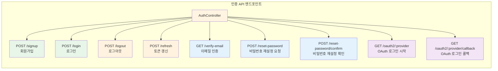

---

## 2. 아키텍처 개요

### 2.1 전체 인증/인가 플로우

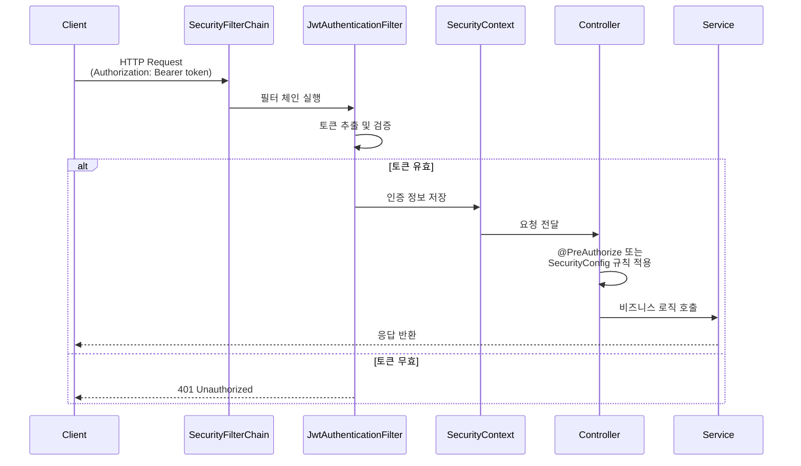

### 2.2 컴포넌트 간 의존성 관계

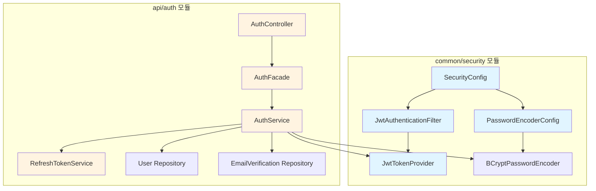

### 2.3 데이터 흐름

#### 로그인 플로우

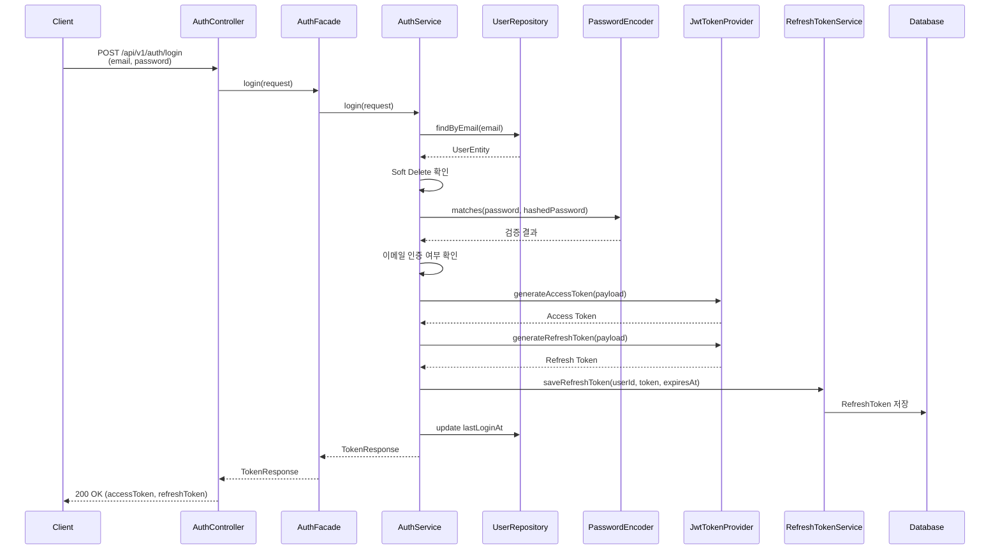

#### 인증된 요청 플로우

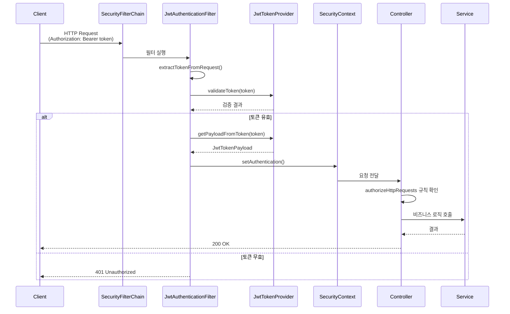

---

## 3. Spring Security 설정 분석

### 3.1 SecurityConfig 분석

```25:53:common/security/src/main/java/com/tech/n/ai/common/security/config/SecurityConfig.java
@Configuration
@EnableWebSecurity
@RequiredArgsConstructor
public class SecurityConfig {
    
    private final JwtAuthenticationFilter jwtAuthenticationFilter;
    
    /**
     * SecurityFilterChain 빈 등록
     * 
     * @param http HttpSecurity
     * @return SecurityFilterChain
     * @throws Exception 설정 오류
     */
    @Bean
    public SecurityFilterChain securityFilterChain(HttpSecurity http) throws Exception {
        http
            .csrf(csrf -> csrf.disable()) // REST API이므로 CSRF 비활성화
            .cors(cors -> cors.configurationSource(corsConfigurationSource()))
            .sessionManagement(session -> session.sessionCreationPolicy(SessionCreationPolicy.STATELESS))
            .authorizeHttpRequests(auth -> auth
                .requestMatchers("/api/v1/auth/**").permitAll()
                .requestMatchers("/actuator/health").permitAll()
                .anyRequest().authenticated()
            )
            .addFilterBefore(jwtAuthenticationFilter, UsernamePasswordAuthenticationFilter.class);
        
        return http.build();
    }
```

#### 주요 설정 설명

1. **@EnableWebSecurity**: Spring Security 웹 보안 기능 활성화
2. **CSRF 비활성화**: REST API는 Stateless이므로 CSRF 보호 불필요
3. **Session 정책 (STATELESS)**: 세션을 생성하지 않음 (JWT 토큰 사용)
4. **인증 규칙 설정**:
   - `/api/v1/auth/**`: 인증 없이 접근 가능 (회원가입, 로그인 등)
   - `/actuator/health`: 헬스 체크 엔드포인트 허용
   - 그 외 모든 요청: 인증 필요
5. **커스텀 필터 추가**: `JwtAuthenticationFilter`를 `UsernamePasswordAuthenticationFilter` 앞에 추가

### 3.2 PasswordEncoderConfig 분석

```14:27:common/security/src/main/java/com/tech/n/ai/common/security/config/PasswordEncoderConfig.java
@Configuration
public class PasswordEncoderConfig {
    
    /**
     * BCryptPasswordEncoder 빈 등록
     * salt rounds: 12
     * 
     * @return BCryptPasswordEncoder
     */
    @Bean
    public PasswordEncoder passwordEncoder() {
        return new BCryptPasswordEncoder(12);
    }
}
```

#### BCryptPasswordEncoder 선택 이유

- **안전성**: BCrypt는 비밀번호 해싱을 위한 안전한 알고리즘
- **자동 Salt 생성**: 매번 다른 Salt를 자동 생성하여 레인보우 테이블 공격 방지
- **Spring Security 권장**: Spring Security 공식 문서에서 권장하는 PasswordEncoder

#### Salt Rounds 설정 (12)

- **10-12 권장**: Spring Security 공식 문서에서 권장하는 값
- **성능과 보안의 균형**: 너무 높으면 성능 저하, 너무 낮으면 보안 취약
- **현재 설정 (12)**: 적절한 보안 수준과 성능을 제공

### 3.3 CORS 설정 분석

```63:81:common/security/src/main/java/com/tech/n/ai/common/security/config/SecurityConfig.java
    @Bean
    public CorsConfigurationSource corsConfigurationSource() {
        CorsConfiguration configuration = new CorsConfiguration();
        // 개발 환경: 모든 origin 허용 (credentials 비활성화)
        // 운영 환경: 특정 도메인 지정 필요 (예: List.of("https://example.com"))
        configuration.setAllowedOrigins(List.of("*"));
        configuration.setAllowedMethods(Arrays.asList("GET", "POST", "PUT", "DELETE", "PATCH", "OPTIONS"));
        configuration.setAllowedHeaders(List.of("*"));
        configuration.setExposedHeaders(List.of("Authorization", "X-Request-Id"));
        // allowCredentials(true)와 allowedOrigins("*")는 함께 사용할 수 없으므로 false로 설정
        // 실제 운영 환경에서는 특정 도메인을 지정하고 allowCredentials(true)로 설정
        configuration.setAllowCredentials(false);
        configuration.setMaxAge(3600L);
        
        UrlBasedCorsConfigurationSource source = new UrlBasedCorsConfigurationSource();
        source.registerCorsConfiguration("/**", configuration);
        
        return source;
    }
```

#### CORS 설정 베스트 프랙티스

1. **allowCredentials와 allowedOrigins 제약사항**
   - `allowCredentials(true)`와 `allowedOrigins("*")`는 함께 사용 불가
   - 현재 설정: `allowedOrigins("*")` + `allowCredentials(false)` (개발 환경)
   - 운영 환경: 특정 도메인 지정 + `allowCredentials(true)`

2. **개발/운영 환경별 설정 차이**
   - **개발 환경**: 모든 origin 허용 (현재 설정)
   - **운영 환경**: 특정 도메인만 허용 (보안 강화)

3. **보안 고려사항**
   - `exposedHeaders`: 클라이언트에서 접근 가능한 헤더 명시
   - `maxAge`: Preflight 요청 캐시 시간 설정

---

## 4. JWT 인증 필터 구현 분석

### 4.1 JwtAuthenticationFilter 동작 원리

```37:89:common/security/src/main/java/com/tech/n/ai/common/security/filter/JwtAuthenticationFilter.java
@Component
@RequiredArgsConstructor
public class JwtAuthenticationFilter extends OncePerRequestFilter {
    
    private static final String AUTHORIZATION_HEADER = "Authorization";
    private static final String BEARER_PREFIX = "Bearer ";
    
    private final JwtTokenProvider jwtTokenProvider;
    private final ObjectMapper objectMapper;
    
    @Override
    protected void doFilterInternal(
        HttpServletRequest request,
        HttpServletResponse response,
        FilterChain filterChain
    ) throws ServletException, IOException {
        String token = extractTokenFromRequest(request);
        
        // 토큰이 없는 경우 필터 체인 계속 진행 (SecurityConfig의 authorizeHttpRequests가 처리)
        if (!StringUtils.hasText(token)) {
            filterChain.doFilter(request, response);
            return;
        }
        
        // 토큰이 있는 경우 검증 수행
        try {
            if (jwtTokenProvider.validateToken(token)) {
                JwtTokenPayload payload = jwtTokenProvider.getPayloadFromToken(token);
                
                UsernamePasswordAuthenticationToken authentication = new UsernamePasswordAuthenticationToken(
                    payload.userId(),
                    null,
                    Collections.singletonList(new SimpleGrantedAuthority("ROLE_" + payload.role()))
                );
                authentication.setDetails(new WebAuthenticationDetailsSource().buildDetails(request));
                
                // SecurityContext 설정 (공식 문서 권장 방식: 빈 컨텍스트 생성 후 설정)
                SecurityContext context = SecurityContextHolder.createEmptyContext();
                context.setAuthentication(authentication);
                SecurityContextHolder.setContext(context);
            } else {
                // 토큰이 있지만 유효하지 않은 경우 에러 반환
                log.warn("Invalid JWT token detected");
                handleAuthenticationError(response);
                return;
            }
        } catch (Exception e) {
            // 토큰 파싱 오류 등 예외 발생 시 에러 반환
            log.error("JWT authentication failed", e);
            handleAuthenticationError(response);
            return;
        }
        
        filterChain.doFilter(request, response);
    }
```

#### OncePerRequestFilter 상속 이유

- **한 요청당 한 번만 실행**: `OncePerRequestFilter`는 동일한 요청에 대해 필터가 한 번만 실행되도록 보장
- **중복 실행 방지**: 필터 체인에서 여러 번 호출되는 것을 방지

#### 필터 동작 순서

1. **토큰 추출**: `Authorization` 헤더에서 `Bearer <token>` 형식으로 토큰 추출
2. **토큰 검증**: `JwtTokenProvider.validateToken()`으로 토큰 유효성 검증
3. **페이로드 추출**: 검증 성공 시 토큰에서 사용자 정보 추출
4. **SecurityContext 설정**: 인증 정보를 `SecurityContext`에 저장
5. **필터 체인 계속**: 다음 필터로 요청 전달

### 4.2 JwtTokenProvider 구현 분석

```24:127:common/security/src/main/java/com/tech/n/ai/common/security/jwt/JwtTokenProvider.java
@Component
public class JwtTokenProvider {
    
    private final SecretKey secretKey;
    private final long accessTokenValidityInMinutes;
    private final long refreshTokenValidityInDays;
    
    public JwtTokenProvider(
        @Value("${jwt.secret-key:default-secret-key-change-in-production-minimum-256-bits}") String secretKey,
        @Value("${jwt.access-token-validity-minutes:60}") long accessTokenValidityInMinutes,
        @Value("${jwt.refresh-token-validity-days:7}") long refreshTokenValidityInDays
    ) {
        this.secretKey = Keys.hmacShaKeyFor(secretKey.getBytes(StandardCharsets.UTF_8));
        this.accessTokenValidityInMinutes = accessTokenValidityInMinutes;
        this.refreshTokenValidityInDays = refreshTokenValidityInDays;
    }
    
    /**
     * Access Token 생성
     * 
     * @param payload 토큰 페이로드
     * @return Access Token
     */
    public String generateAccessToken(JwtTokenPayload payload) {
        Date now = new Date();
        Date expiryDate = new Date(now.getTime() + Duration.ofMinutes(accessTokenValidityInMinutes).toMillis());
        
        return Jwts.builder()
            .subject(payload.userId())
            .claim("email", payload.email())
            .claim("role", payload.role())
            .issuedAt(now)
            .expiration(expiryDate)
            .signWith(secretKey)
            .compact();
    }
    
    /**
     * Refresh Token 생성
     * 
     * @param payload 토큰 페이로드
     * @return Refresh Token
     */
    public String generateRefreshToken(JwtTokenPayload payload) {
        Date now = new Date();
        Date expiryDate = new Date(now.getTime() + Duration.ofDays(refreshTokenValidityInDays).toMillis());
        
        return Jwts.builder()
            .subject(payload.userId())
            .claim("email", payload.email())
            .claim("role", payload.role())
            .issuedAt(now)
            .expiration(expiryDate)
            .signWith(secretKey)
            .compact();
    }
    
    /**
     * 토큰에서 페이로드 추출
     * 
     * @param token JWT 토큰
     * @return 토큰 페이로드
     */
    public JwtTokenPayload getPayloadFromToken(String token) {
        Claims claims = Jwts.parser()
            .verifyWith(secretKey)
            .build()
            .parseSignedClaims(token)
            .getPayload();
        
        return new JwtTokenPayload(
            claims.getSubject(),
            claims.get("email", String.class),
            claims.get("role", String.class)
        );
    }
    
    /**
     * 토큰 검증
     * 
     * @param token JWT 토큰
     * @return 유효한 토큰이면 true
     */
    public boolean validateToken(String token) {
        try {
            Jwts.parser()
                .verifyWith(secretKey)
                .build()
                .parseSignedClaims(token);
            return true;
        } catch (Exception e) {
            log.debug("Invalid JWT token: {}", e.getMessage());
            return false;
        }
    }
    
    /**
     * Refresh Token 만료 일시 계산
     * 
     * @return 만료 일시 (LocalDateTime)
     */
    public java.time.LocalDateTime getRefreshTokenExpiresAt() {
        return java.time.LocalDateTime.now().plusDays(refreshTokenValidityInDays);
    }
}
```

#### 토큰 생성 메커니즘

1. **SecretKey 생성**: HMAC-SHA 알고리즘을 사용한 시크릿 키 생성
2. **토큰 구성 요소**:
   - `subject`: 사용자 ID
   - `claim("email")`: 이메일
   - `claim("role")`: 역할
   - `issuedAt`: 발급 시간
   - `expiration`: 만료 시간
3. **서명**: `signWith(secretKey)`로 토큰 서명

#### Access Token vs Refresh Token

- **Access Token**: 짧은 유효기간 (기본 60분), 자주 갱신
- **Refresh Token**: 긴 유효기간 (기본 7일), Access Token 갱신에 사용

### 4.3 SecurityContext 설정 방법

```71:74:common/security/src/main/java/com/tech/n/ai/common/security/filter/JwtAuthenticationFilter.java
                // SecurityContext 설정 (공식 문서 권장 방식: 빈 컨텍스트 생성 후 설정)
                SecurityContext context = SecurityContextHolder.createEmptyContext();
                context.setAuthentication(authentication);
                SecurityContextHolder.setContext(context);
```

#### 공식 문서 권장 방식

- **빈 컨텍스트 생성**: `SecurityContextHolder.createEmptyContext()`로 새로운 컨텍스트 생성
- **인증 정보 설정**: `UsernamePasswordAuthenticationToken` 생성 및 설정
- **컨텍스트 저장**: `SecurityContextHolder.setContext()`로 저장

이 방식은 스레드 안전성을 보장하고, 이전 컨텍스트의 잔여 데이터를 방지합니다.

---

## 5. 인증/인가 로직 구현 패턴

### 5.1 회원가입 플로우

```65:117:api/auth/src/main/java/com/tech/n/ai/api/auth/service/AuthService.java
    @Transactional
    public AuthResponse signup(SignupRequest request) {
        // 이메일 중복 검증
        if (userReaderRepository.findByEmail(request.email()).isPresent()) {
            throw new ConflictException("이미 사용 중인 이메일입니다.");
        }
        
        // 사용자명 중복 검증 (실제로는 findByUsername 메서드가 필요하지만, 현재는 findAll 사용)
        // TODO: UserReaderRepository에 findByUsername 메서드 추가 필요
        boolean usernameExists = userReaderRepository.findAll().stream()
                .anyMatch(user -> request.username().equals(user.getUsername()) && !Boolean.TRUE.equals(user.getIsDeleted()));
        if (usernameExists) {
            throw new ConflictException("이미 사용 중인 사용자명입니다.");
        }
        
        // 비밀번호 해시 생성
        String hashedPassword = passwordEncoder.encode(request.password());
        
        // User 엔티티 생성
        UserEntity user = new UserEntity();
        user.setEmail(request.email());
        user.setUsername(request.username());
        user.setPassword(hashedPassword);
        user.setIsEmailVerified(false);
        user = userWriterRepository.save(user);
        
        // EmailVerification 엔티티 생성
        String verificationToken = generateSecureToken();
        EmailVerificationEntity emailVerification = new EmailVerificationEntity();
        emailVerification.setEmail(request.email());
        emailVerification.setToken(verificationToken);
        emailVerification.setType(EMAIL_VERIFICATION_TYPE);
        emailVerification.setExpiresAt(LocalDateTime.now().plusHours(24));
        emailVerificationWriterRepository.save(emailVerification);
        
        // Kafka 이벤트 발행
        UserCreatedEvent.UserCreatedPayload payload = new UserCreatedEvent.UserCreatedPayload(
            String.valueOf(user.getId()),
            String.valueOf(user.getId()),
            user.getUsername(),
            user.getEmail(),
            null
        );
        UserCreatedEvent event = new UserCreatedEvent(payload);
        eventPublisher.publish(KAFKA_TOPIC_USER_EVENTS, event, String.valueOf(user.getId()));
        
        return new AuthResponse(
            user.getId(),
            user.getEmail(),
            user.getUsername(),
            "회원가입이 완료되었습니다. 이메일 인증을 완료해주세요."
        );
    }
```

#### 회원가입 플로우 단계

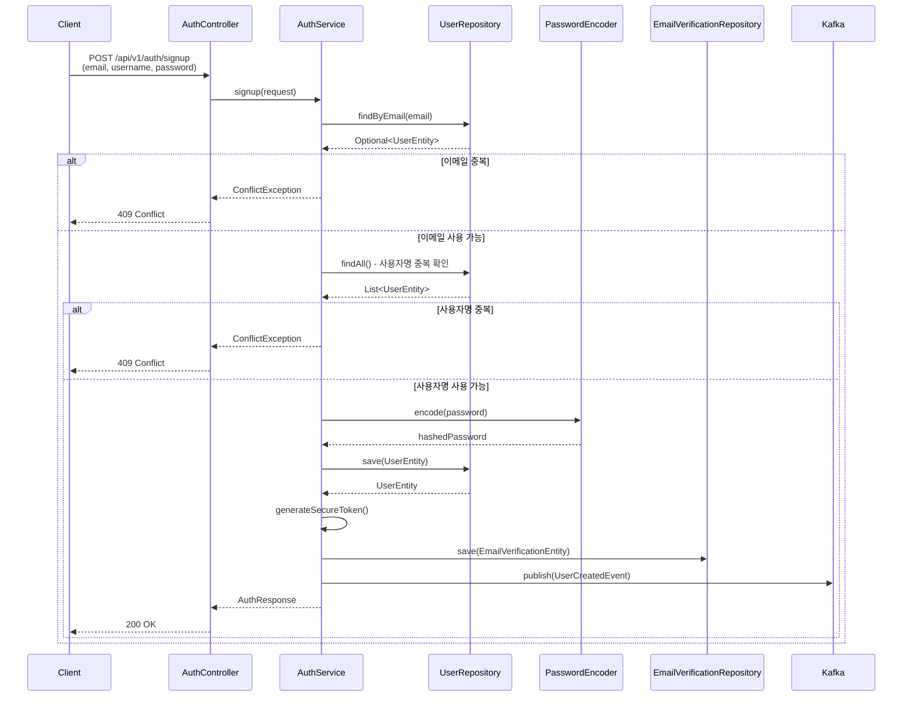

1. **중복 검증**: 이메일 및 사용자명 중복 확인
2. **비밀번호 해시**: `PasswordEncoder.encode()`로 비밀번호 해시 생성
3. **사용자 생성**: User 엔티티 생성 및 저장
4. **이메일 인증 토큰 생성**: 암호학적으로 안전한 토큰 생성
5. **Kafka 이벤트 발행**: 사용자 생성 이벤트 발행

### 5.2 로그인 플로우

```122:170:api/auth/src/main/java/com/tech/n/ai/api/auth/service/AuthService.java
    @Transactional
    public TokenResponse login(LoginRequest request) {
        // 이메일로 User 조회
        UserEntity user = userReaderRepository.findByEmail(request.email())
                .orElseThrow(() -> new UnauthorizedException("이메일 또는 비밀번호가 올바르지 않습니다."));
        
        // Soft Delete 확인
        if (Boolean.TRUE.equals(user.getIsDeleted())) {
            throw new UnauthorizedException("이메일 또는 비밀번호가 올바르지 않습니다.");
        }
        
        // 비밀번호 검증
        if (user.getPassword() == null || !passwordEncoder.matches(request.password(), user.getPassword())) {
            throw new UnauthorizedException("이메일 또는 비밀번호가 올바르지 않습니다.");
        }
        
        // 이메일 인증 여부 확인
        if (!Boolean.TRUE.equals(user.getIsEmailVerified())) {
            throw new UnauthorizedException("이메일 인증을 완료해주세요.");
        }
        
        // JWT 토큰 생성
        JwtTokenPayload payload = new JwtTokenPayload(
            String.valueOf(user.getId()),
            user.getEmail(),
            USER_ROLE
        );
        String accessToken = jwtTokenProvider.generateAccessToken(payload);
        String refreshToken = jwtTokenProvider.generateRefreshToken(payload);
        
        // RefreshToken 저장
        refreshTokenService.saveRefreshToken(
            user.getId(),
            refreshToken,
            jwtTokenProvider.getRefreshTokenExpiresAt()
        );
        
        // User 엔티티 업데이트 (last_login_at)
        user.setLastLoginAt(LocalDateTime.now());
        userWriterRepository.save(user);
        
        return new TokenResponse(
            accessToken,
            refreshToken,
            "Bearer",
            3600L,
            604800L
        );
    }
```

#### 로그인 플로우 단계

1. **사용자 조회**: 이메일로 사용자 조회
2. **Soft Delete 확인**: 삭제된 사용자 확인
3. **비밀번호 검증**: `PasswordEncoder.matches()`로 비밀번호 검증
4. **이메일 인증 확인**: 이메일 인증 완료 여부 확인
5. **JWT 토큰 생성**: Access Token 및 Refresh Token 생성
6. **Refresh Token 저장**: 데이터베이스에 Refresh Token 저장
7. **마지막 로그인 시간 업데이트**: `lastLoginAt` 필드 업데이트

### 5.2.1 로그아웃 플로우

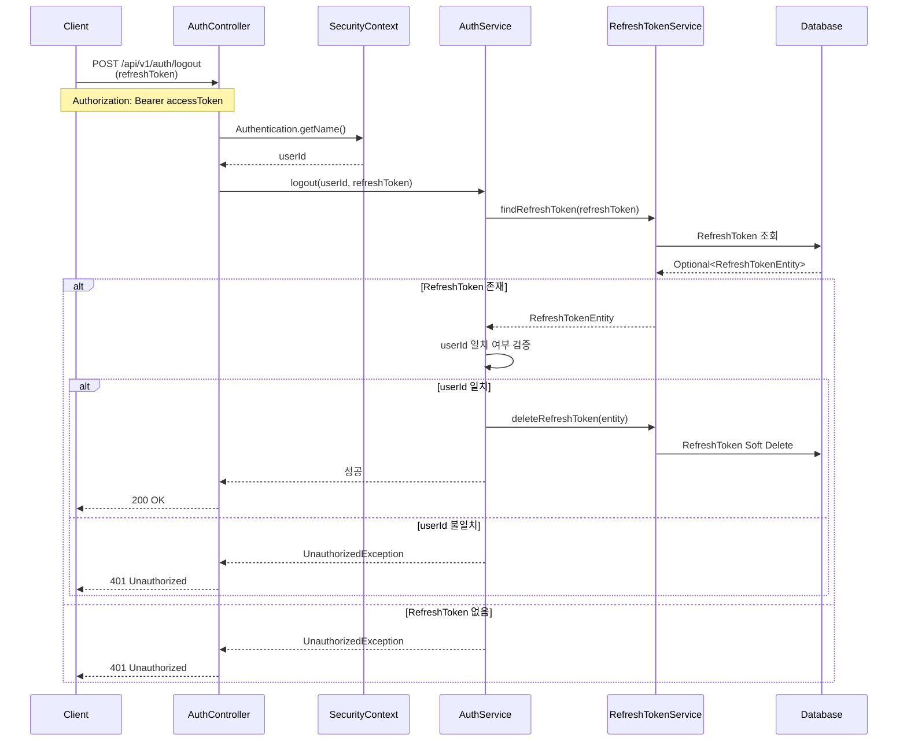

### 5.3 JWT 토큰 생성/검증/갱신 메커니즘

#### 토큰 생성

```46:58:common/security/src/main/java/com/tech/n/ai/common/security/jwt/JwtTokenProvider.java
    public String generateAccessToken(JwtTokenPayload payload) {
        Date now = new Date();
        Date expiryDate = new Date(now.getTime() + Duration.ofMinutes(accessTokenValidityInMinutes).toMillis());
        
        return Jwts.builder()
            .subject(payload.userId())
            .claim("email", payload.email())
            .claim("role", payload.role())
            .issuedAt(now)
            .expiration(expiryDate)
            .signWith(secretKey)
            .compact();
    }
```

#### 토큰 검증

```106:117:common/security/src/main/java/com/tech/n/ai/common/security/jwt/JwtTokenProvider.java
    public boolean validateToken(String token) {
        try {
            Jwts.parser()
                .verifyWith(secretKey)
                .build()
                .parseSignedClaims(token);
            return true;
        } catch (Exception e) {
            log.debug("Invalid JWT token: {}", e.getMessage());
            return false;
        }
    }
```

#### 토큰 갱신

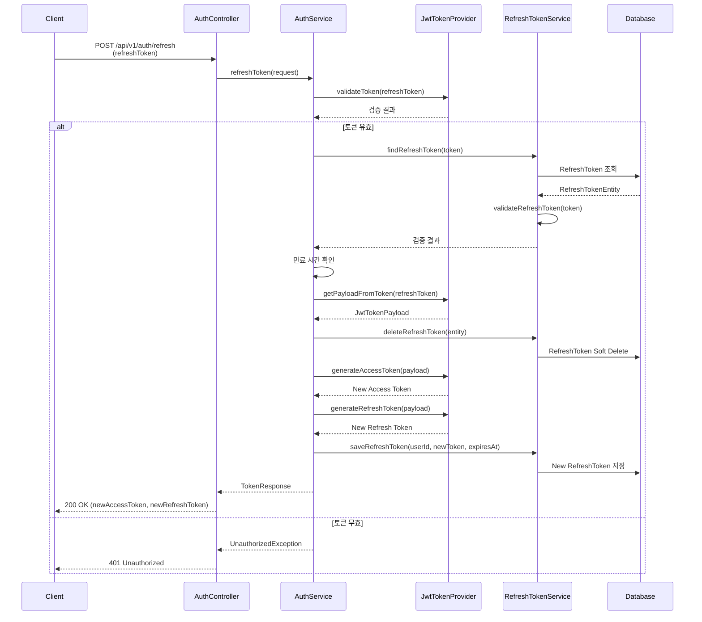

```198:243:api/auth/src/main/java/com/tech/n/ai/api/auth/service/AuthService.java
    @Transactional
    public TokenResponse refreshToken(RefreshTokenRequest request) {
        // Refresh Token 검증
        if (!jwtTokenProvider.validateToken(request.refreshToken())) {
            throw new UnauthorizedException("유효하지 않은 Refresh Token입니다.");
        }
        
        // RefreshToken 조회
        Optional<RefreshTokenEntity> refreshTokenEntity = refreshTokenService.findRefreshToken(request.refreshToken());
        
        if (refreshTokenEntity.isEmpty() || !refreshTokenService.validateRefreshToken(request.refreshToken())) {
            throw new UnauthorizedException("유효하지 않은 Refresh Token입니다.");
        }
        
        RefreshTokenEntity entity = refreshTokenEntity.get();
        
        // 만료 시간 확인
        if (entity.getExpiresAt().isBefore(LocalDateTime.now())) {
            throw new UnauthorizedException("만료된 Refresh Token입니다.");
        }
        
        // 페이로드 추출
        JwtTokenPayload payload = jwtTokenProvider.getPayloadFromToken(request.refreshToken());
        
        // 기존 RefreshToken Soft Delete
        refreshTokenService.deleteRefreshToken(entity);
        
        // 새로운 Access Token 생성
        String newAccessToken = jwtTokenProvider.generateAccessToken(payload);
        
        // 새로운 Refresh Token 생성 및 저장
        String newRefreshToken = jwtTokenProvider.generateRefreshToken(payload);
        refreshTokenService.saveRefreshToken(
            Long.parseLong(payload.userId()),
            newRefreshToken,
            jwtTokenProvider.getRefreshTokenExpiresAt()
        );
        
        return new TokenResponse(
            newAccessToken,
            newRefreshToken,
            "Bearer",
            3600L,
            604800L
        );
    }
```

### 5.4 Refresh Token 관리 전략

```36:103:api/auth/src/main/java/com/tech/n/ai/api/auth/service/RefreshTokenService.java
    @Transactional
    public RefreshTokenEntity saveRefreshToken(Long userId, String token, LocalDateTime expiresAt) {
        RefreshTokenEntity refreshTokenEntity = new RefreshTokenEntity();
        refreshTokenEntity.setUserId(userId);
        refreshTokenEntity.setToken(token);
        refreshTokenEntity.setExpiresAt(expiresAt);
        
        return refreshTokenWriterRepository.save(refreshTokenEntity);
    }
    
    /**
     * Refresh Token 조회
     * 
     * @param token Refresh Token
     * @return RefreshTokenEntity (Optional)
     */
    public Optional<RefreshTokenEntity> findRefreshToken(String token) {
        return refreshTokenReaderRepository.findByToken(token);
    }
    
    /**
     * Refresh Token 삭제 (Soft Delete)
     * 
     * @param refreshTokenEntity RefreshTokenEntity
     */
    @Transactional
    public void deleteRefreshToken(RefreshTokenEntity refreshTokenEntity) {
        refreshTokenWriterRepository.delete(refreshTokenEntity);
    }
    
    /**
     * Refresh Token 삭제 (Soft Delete) by ID
     * 
     * @param id RefreshToken ID
     */
    @Transactional
    public void deleteRefreshTokenById(Long id) {
        refreshTokenWriterRepository.deleteById(id);
    }
    
    /**
     * Refresh Token 검증
     * 
     * @param token Refresh Token
     * @return 유효한 Refresh Token이면 true
     */
    public boolean validateRefreshToken(String token) {
        Optional<RefreshTokenEntity> refreshTokenEntity = findRefreshToken(token);
        
        if (refreshTokenEntity.isEmpty()) {
            return false;
        }
        
        RefreshTokenEntity entity = refreshTokenEntity.get();
        
        // Soft Delete 확인
        if (Boolean.TRUE.equals(entity.getIsDeleted())) {
            return false;
        }
        
        // 만료 시간 확인
        if (entity.getExpiresAt().isBefore(LocalDateTime.now())) {
            return false;
        }
        
        return true;
    }
```

#### Refresh Token 관리 전략

1. **데이터베이스 저장**: Refresh Token을 데이터베이스에 저장하여 무효화 가능
2. **Soft Delete**: 토큰 갱신 시 기존 토큰을 Soft Delete하여 재사용 방지
3. **이중 검증**: JWT 토큰 검증 + 데이터베이스 검증
4. **만료 시간 확인**: 데이터베이스의 만료 시간도 확인

### 5.5 이메일 인증 및 비밀번호 재설정 플로우

#### 이메일 인증

##### 이메일 인증 메서드의 용도

`verifyEmail()` 메서드는 회원가입 시 생성된 이메일 인증 토큰을 검증하여 사용자의 이메일 주소 소유권을 확인하는 핵심 기능입니다.

**주요 용도:**

1. **이메일 주소 소유권 확인**
   - 회원가입 시 입력한 이메일 주소가 실제로 사용자가 소유한 주소인지 검증
   - 이메일로 발송된 인증 링크를 클릭하여 소유권 증명

2. **스팸 계정 및 가짜 계정 방지**
   - 무작위 이메일 주소로 계정 생성 방지
   - 실제 이메일 주소만 사용하도록 강제하여 서비스 품질 향상

3. **로그인 전 필수 인증 단계**
   - 회원가입 후 이메일 인증을 완료하지 않으면 로그인 불가
   - `AuthService.login()` 메서드에서 `isEmailVerified` 필드를 확인하여 인증 완료 여부 검증

4. **보안 강화**
   - 이메일 인증을 통해 계정의 신뢰성 확보
   - 비정상적인 계정 생성 패턴 감지 및 차단 가능

5. **사용자 데이터 정확성 보장**
   - 이메일 주소가 유효하고 접근 가능한 주소임을 보장
   - 향후 비밀번호 재설정, 알림 발송 등에 사용할 이메일의 신뢰성 확보

**동작 흐름:**

1. **회원가입 시**: `signup()` 메서드에서 이메일 인증 토큰 생성 및 저장
2. **이메일 발송**: 생성된 토큰을 포함한 인증 링크를 사용자 이메일로 발송
3. **인증 링크 클릭**: 사용자가 이메일의 인증 링크 클릭 (`GET /api/v1/auth/verify-email?token=xxx`)
4. **토큰 검증**: `verifyEmail()` 메서드에서 토큰 유효성 검증
5. **인증 완료**: 검증 성공 시 `User.isEmailVerified = true`로 업데이트

**보안 검증 항목:**

- **토큰 존재 여부**: 데이터베이스에 해당 토큰이 존재하는지 확인
- **Soft Delete 확인**: 삭제된 토큰은 사용 불가
- **만료 시간 확인**: 토큰은 24시간 후 만료 (회원가입 시 설정)
- **중복 인증 방지**: 이미 인증 완료된 토큰(`verifiedAt`이 null이 아님)은 재사용 불가

**관련 코드 참조:**

```248:290:api/auth/src/main/java/com/tech/n/ai/api/auth/service/AuthService.java
    @Transactional
    public void verifyEmail(String token) {
        // EmailVerification 조회
        EmailVerificationEntity emailVerification = emailVerificationReaderRepository
                .findByTokenAndType(token, EMAIL_VERIFICATION_TYPE)
                .orElseThrow(() -> new ResourceNotFoundException("유효하지 않은 인증 토큰입니다."));
        
        // Soft Delete 확인
        if (Boolean.TRUE.equals(emailVerification.getIsDeleted())) {
            throw new ResourceNotFoundException("유효하지 않은 인증 토큰입니다.");
        }
        
        // 만료 시간 확인
        if (emailVerification.getExpiresAt().isBefore(LocalDateTime.now())) {
            throw new UnauthorizedException("만료된 인증 토큰입니다.");
        }
        
        // 중복 인증 방지
        if (emailVerification.getVerifiedAt() != null) {
            throw new ConflictException("이미 인증이 완료된 토큰입니다.");
        }
        
        // EmailVerification 업데이트
        emailVerification.setVerifiedAt(LocalDateTime.now());
        emailVerificationWriterRepository.save(emailVerification);
        
        // User 엔티티 업데이트
        UserEntity user = userReaderRepository.findByEmail(emailVerification.getEmail())
                .orElseThrow(() -> new ResourceNotFoundException("사용자를 찾을 수 없습니다."));
        user.setIsEmailVerified(true);
        userWriterRepository.save(user);
        
        // Kafka 이벤트 발행
        Map<String, Object> updatedFields = new HashMap<>();
        updatedFields.put("isEmailVerified", true);
        UserUpdatedEvent.UserUpdatedPayload payload = new UserUpdatedEvent.UserUpdatedPayload(
            String.valueOf(user.getId()),
            String.valueOf(user.getId()),
            updatedFields
        );
        UserUpdatedEvent event = new UserUpdatedEvent(payload);
        eventPublisher.publish(KAFKA_TOPIC_USER_EVENTS, event, String.valueOf(user.getId()));
    }
```

**로그인 시 이메일 인증 확인:**

로그인 시 이메일 인증 완료 여부를 확인하는 로직:

```122:141:api/auth/src/main/java/com/tech/n/ai/api/auth/service/AuthService.java
    @Transactional
    public TokenResponse login(LoginRequest request) {
        // 이메일로 User 조회
        UserEntity user = userReaderRepository.findByEmail(request.email())
                .orElseThrow(() -> new UnauthorizedException("이메일 또는 비밀번호가 올바르지 않습니다."));
        
        // Soft Delete 확인
        if (Boolean.TRUE.equals(user.getIsDeleted())) {
            throw new UnauthorizedException("이메일 또는 비밀번호가 올바르지 않습니다.");
        }
        
        // 비밀번호 검증
        if (user.getPassword() == null || !passwordEncoder.matches(request.password(), user.getPassword())) {
            throw new UnauthorizedException("이메일 또는 비밀번호가 올바르지 않습니다.");
        }
        
        // 이메일 인증 여부 확인
        if (!Boolean.TRUE.equals(user.getIsEmailVerified())) {
            throw new UnauthorizedException("이메일 인증을 완료해주세요.");
        }
```

**이메일 인증 플로우 다이어그램:**

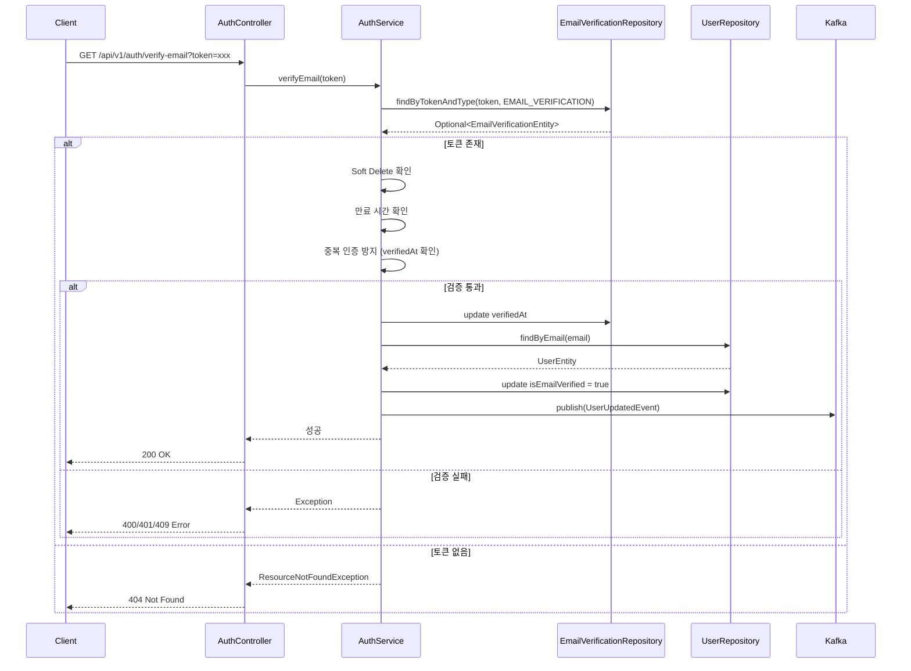

#### 비밀번호 재설정 전체 프로세스 시퀀스

##### 프로세스 개요

비밀번호 재설정은 **두 개의 독립적인 API 호출**로 구성되며, **사용자의 이메일 액션**을 통해 연결됩니다. 두 메서드는 자동으로 연속 호출되지 않으며, 사용자가 이메일을 확인하고 링크를 클릭하는 **수동 액션**을 통해 연결됩니다.

**핵심 설계 원칙:**

1. **requestPasswordReset**: 비밀번호 재설정 토큰 생성 및 이메일 발송
2. **사용자 액션**: 이메일 수신 → 이메일 링크 클릭
3. **confirmPasswordReset**: 토큰 검증 및 비밀번호 변경

**전체 시퀀스 다이어그램:**

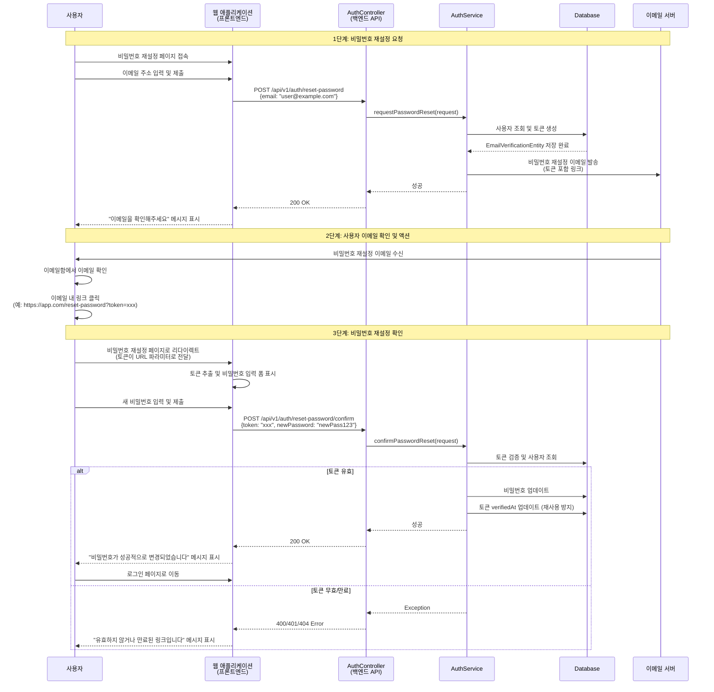

##### 설계 방식 설명

**질문: 두 메서드가 연속적으로 호출되는 설계인가요?**

**답변: 아니요. 두 메서드는 연속적으로 자동 호출되지 않습니다.**

**실제 동작 방식:**

1. **requestPasswordReset 호출**
   - 사용자가 웹 애플리케이션에서 이메일 주소를 입력하고 제출
   - 백엔드 API가 토큰을 생성하고 이메일을 발송
   - **여기서 프로세스가 일시 중단됨**

2. **사용자 이메일 확인 (수동 액션)**
   - 사용자가 이메일함을 확인
   - 이메일 내의 비밀번호 재설정 링크를 클릭
   - **이것은 사용자의 수동 액션이며, 시스템이 자동으로 수행하지 않음**

3. **confirmPasswordReset 호출**
   - 사용자가 링크를 클릭하면 프론트엔드 페이지로 이동
   - 프론트엔드에서 토큰을 추출하고 비밀번호 입력 폼을 표시
   - 사용자가 새 비밀번호를 입력하고 제출하면 `confirmPasswordReset` 호출

**이메일 링크 예시:**

이메일에는 다음과 같은 링크가 포함됩니다:

```
https://your-app.com/reset-password?token=eyJhbGciOiJIUzI1NiIsInR5cCI6IkpXVCJ9...
```

또는 프론트엔드 라우팅을 사용하는 경우:

```
https://your-app.com/reset-password/eyJhbGciOiJIUzI1NiIsInR5cCI6IkpXVCJ9...
```

**프론트엔드 구현 예시:**

```javascript
// 1. 사용자가 이메일 링크 클릭
// URL: https://app.com/reset-password?token=xxx

// 2. 프론트엔드에서 토큰 추출
const urlParams = new URLSearchParams(window.location.search);
const token = urlParams.get('token');

// 3. 비밀번호 입력 폼 표시
// 사용자가 새 비밀번호 입력

// 4. 사용자가 제출 버튼 클릭
async function handlePasswordReset(newPassword) {
    const response = await fetch('/api/v1/auth/reset-password/confirm', {
        method: 'POST',
        headers: { 'Content-Type': 'application/json' },
        body: JSON.stringify({
            token: token,  // URL에서 추출한 토큰
            newPassword: newPassword
        })
    });
    
    if (response.ok) {
        // 비밀번호 변경 성공
        // 로그인 페이지로 리다이렉트
    }
}
```

**시간적 분리:**

- **requestPasswordReset**: 사용자가 요청한 시점에 즉시 실행
- **confirmPasswordReset**: 사용자가 이메일을 확인하고 링크를 클릭한 후 실행
- 두 호출 사이에는 **시간적 간격**이 있을 수 있음 (몇 분, 몇 시간, 최대 24시간)

**보안상 이점:**

1. **이메일 소유권 확인**: 이메일 계정에 접근할 수 있는 사용자만 비밀번호를 변경할 수 있음
2. **토큰 만료**: 24시간 후 토큰이 만료되어 보안 강화
3. **일회성 토큰**: 한 번 사용된 토큰은 재사용 불가
4. **사용자 알림**: 비밀번호 재설정 요청이 발생했음을 사용자에게 알림

#### 비밀번호 재설정 요청

##### 비밀번호 재설정 요청 메서드의 용도

`requestPasswordReset()` 메서드는 사용자가 비밀번호를 잊어버렸거나 변경하고 싶을 때, 이메일 주소를 통해 안전하게 비밀번호를 재설정할 수 있도록 하는 기능입니다.

**주요 용도:**

1. **비밀번호 분실 시 복구**
   - 사용자가 비밀번호를 잊어버렸을 때 계정 복구 가능
   - 로그인 없이도 비밀번호를 재설정할 수 있는 안전한 방법 제공

2. **이메일 주소 소유권 확인**
   - 비밀번호 재설정 토큰을 이메일로 발송하여 이메일 주소 소유권 확인
   - 무작위 이메일 주소로의 비밀번호 변경 시도 방지

3. **보안 강화**
   - 비밀번호 재설정은 반드시 이메일을 통해서만 가능하도록 제한
   - 이메일 계정이 해킹되지 않는 한 안전하게 비밀번호 재설정 가능
   - 토큰 기반 인증으로 일회성 링크 제공

4. **무작위 비밀번호 변경 시도 방지**
   - 이메일 주소를 모르는 공격자는 비밀번호를 변경할 수 없음
   - 이메일 발송을 통한 추가 보안 레이어 제공

5. **사용자 알림**
   - 비밀번호 재설정 요청이 발생했음을 사용자에게 알림
   - 본인이 요청하지 않은 경우 즉시 대응 가능

**이메일 발송의 용도:**

비밀번호 재설정 요청 시 이메일을 발송하는 주요 목적은 다음과 같습니다:

1. **비밀번호 재설정 토큰 전달**
   - 암호학적으로 안전한 토큰을 생성하여 이메일로 전달
   - 이 토큰은 24시간 동안 유효하며, 한 번만 사용 가능

2. **이메일 주소 소유권 증명**
   - 비밀번호 재설정 링크를 클릭할 수 있는 것은 해당 이메일 주소의 소유자임을 의미
   - 이메일 계정 접근 권한이 있는 사용자만 비밀번호를 변경할 수 있음

3. **보안 알림**
   - 비밀번호 재설정 요청이 발생했음을 사용자에게 즉시 알림
   - 본인이 요청하지 않은 경우 계정 보안에 문제가 있을 수 있음을 인지 가능

4. **안전한 재설정 프로세스**
   - 이메일을 통한 2단계 인증 방식
   - 로그인하지 않은 상태에서도 안전하게 비밀번호 변경 가능

**동작 흐름:**

1. **비밀번호 재설정 요청**: 사용자가 `POST /api/v1/auth/reset-password`에 이메일 주소 전송
2. **사용자 확인**: 시스템이 해당 이메일 주소로 등록된 사용자 존재 여부 확인
3. **기존 토큰 무효화**: 이전에 발급된 비밀번호 재설정 토큰이 있다면 Soft Delete 처리
4. **새 토큰 생성**: 암호학적으로 안전한 비밀번호 재설정 토큰 생성 (24시간 유효)
5. **토큰 저장**: 데이터베이스에 토큰 저장
6. **이메일 발송**: 비밀번호 재설정 링크를 포함한 이메일 발송
7. **사용자 응답**: 존재하지 않는 이메일이어도 보안상 성공 응답 반환 (이메일 열거 공격 방지)

**보안 고려사항:**

1. **이메일 열거 공격 방지**
   - 존재하지 않는 이메일 주소에 대해서도 성공 응답 반환
   - 공격자가 등록된 이메일 주소를 추측하는 것을 방지

2. **토큰 만료 시간**
   - 토큰은 24시간 후 자동 만료
   - 만료된 토큰으로는 비밀번호 재설정 불가

3. **토큰 재사용 방지**
   - 한 번 사용된 토큰은 `verifiedAt` 필드로 재사용 불가 처리
   - 토큰은 일회성으로만 사용 가능

4. **기존 토큰 무효화**
   - 새로운 비밀번호 재설정 요청 시 기존 토큰을 Soft Delete
   - 여러 개의 활성 토큰이 동시에 존재하는 것을 방지

**관련 코드 참조:**

```292:326:api/auth/src/main/java/com/tech/n/ai/api/auth/service/AuthService.java
    /**
     * 비밀번호 재설정 요청
     */
    @Transactional
    public void requestPasswordReset(ResetPasswordRequest request) {
        // 이메일로 User 조회
        Optional<UserEntity> userOpt = userReaderRepository.findByEmail(request.email());
        
        // 존재하지 않는 이메일인 경우에도 성공 응답 반환 (보안상 일반적)
        if (userOpt.isEmpty() || Boolean.TRUE.equals(userOpt.get().getIsDeleted())) {
            return;
        }
        
        UserEntity user = userOpt.get();
        
        // 기존 PASSWORD_RESET 타입 토큰 무효화 (Soft Delete)
        emailVerificationReaderRepository.findByEmailAndType(request.email(), PASSWORD_RESET_TYPE)
                .forEach(existing -> {
                    existing.setIsDeleted(true);
                    existing.setDeletedAt(LocalDateTime.now());
                    emailVerificationWriterRepository.save(existing);
                });
        
        // 비밀번호 재설정 토큰 생성
        String resetToken = generateSecureToken();
        EmailVerificationEntity emailVerification = new EmailVerificationEntity();
        emailVerification.setEmail(request.email());
        emailVerification.setToken(resetToken);
        emailVerification.setType(PASSWORD_RESET_TYPE);
        emailVerification.setExpiresAt(LocalDateTime.now().plusHours(24));
        emailVerificationWriterRepository.save(emailVerification);
        
        // 이메일 발송 (비동기 처리, 여기서는 로그만 출력)
        log.info("Password reset email sent to: {}", request.email());
    }
```

**비밀번호 재설정 요청 플로우 다이어그램:**

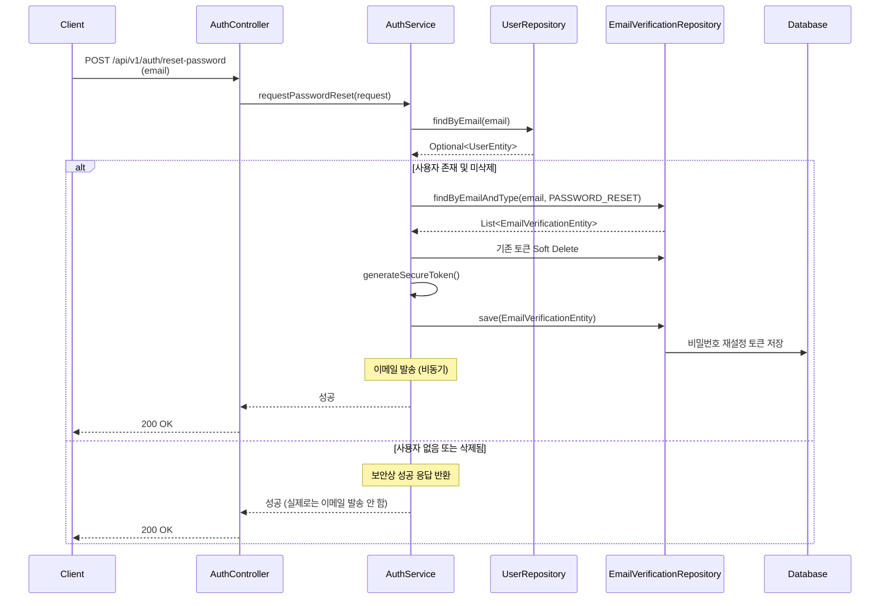

#### 비밀번호 재설정 확인

##### 비밀번호 재설정 확인 메서드의 용도

`confirmPasswordReset()` 메서드는 이메일로 받은 비밀번호 재설정 토큰을 검증하고, 새로운 비밀번호로 변경하는 기능입니다.

**주요 용도:**

1. **토큰 검증 및 비밀번호 변경**
   - 이메일로 받은 비밀번호 재설정 토큰의 유효성 검증
   - 검증 성공 시 새로운 비밀번호로 변경

2. **보안 검증**
   - 토큰 만료 시간 확인 (24시간 이내)
   - 토큰 재사용 방지 (일회성 토큰)
   - 이전 비밀번호와 동일한 비밀번호 사용 방지

3. **안전한 비밀번호 변경**
   - 비밀번호 해시 생성 및 저장
   - 비밀번호 변경 이벤트를 Kafka로 발행하여 다른 시스템에 알림

**보안 검증 항목:**

1. **토큰 존재 여부**: 데이터베이스에 해당 토큰이 존재하는지 확인
2. **Soft Delete 확인**: 삭제된 토큰은 사용 불가
3. **만료 시간 확인**: 토큰은 24시간 후 만료
4. **토큰 재사용 방지**: 이미 사용된 토큰(`verifiedAt`이 null이 아님)은 재사용 불가
5. **비밀번호 재사용 방지**: 이전 비밀번호와 동일한 비밀번호는 사용 불가

**비밀번호 재설정 확인 플로우 다이어그램:**

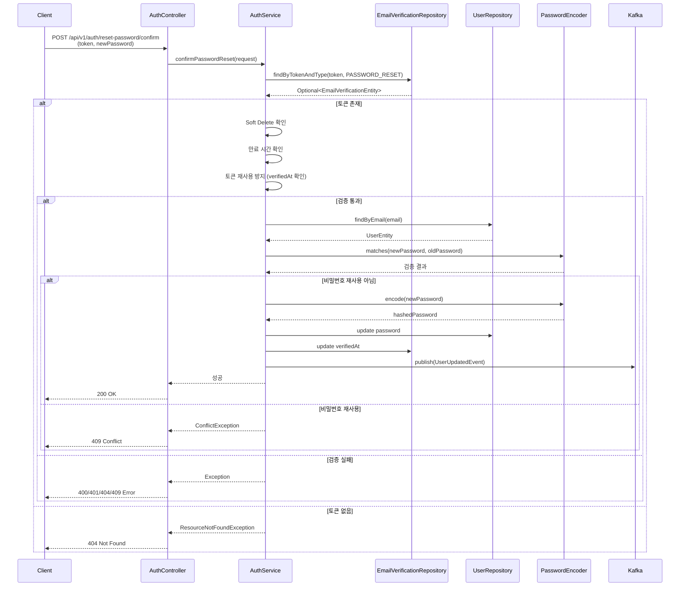

##### 비밀번호 재설정 전체 프로세스

비밀번호 재설정은 두 단계로 구성됩니다:

**1단계: 비밀번호 재설정 요청 (POST /api/v1/auth/reset-password)**
- 사용자가 이메일 주소를 입력하여 비밀번호 재설정 요청
- 시스템이 비밀번호 재설정 토큰 생성 및 이메일 발송
- 이메일에는 비밀번호 재설정 링크가 포함됨

**2단계: 비밀번호 재설정 확인 (POST /api/v1/auth/reset-password/confirm)**
- 사용자가 이메일의 링크를 클릭하여 비밀번호 재설정 페이지로 이동
- 토큰과 새로운 비밀번호를 함께 전송
- 시스템이 토큰 검증 후 비밀번호 변경

**이메일 발송의 핵심 역할:**

이메일 발송은 비밀번호 재설정 프로세스에서 다음과 같은 핵심 역할을 합니다:

1. **인증 수단**: 이메일 계정 접근 권한이 있는 사용자만 비밀번호를 변경할 수 있도록 함
2. **토큰 전달**: 안전한 비밀번호 재설정 토큰을 사용자에게 전달
3. **보안 알림**: 비밀번호 재설정 요청이 발생했음을 사용자에게 알림
4. **2단계 인증**: 이메일을 통한 추가 보안 레이어 제공

**비밀번호 재설정 확인 코드:**

```331:383:api/auth/src/main/java/com/tech/n/ai/api/auth/service/AuthService.java
    @Transactional
    public void confirmPasswordReset(ResetPasswordConfirmRequest request) {
        // EmailVerification 조회
        EmailVerificationEntity emailVerification = emailVerificationReaderRepository
                .findByTokenAndType(request.token(), PASSWORD_RESET_TYPE)
                .orElseThrow(() -> new ResourceNotFoundException("유효하지 않은 토큰입니다."));
        
        // Soft Delete 확인
        if (Boolean.TRUE.equals(emailVerification.getIsDeleted())) {
            throw new ResourceNotFoundException("유효하지 않은 토큰입니다.");
        }
        
        // 만료 시간 확인
        if (emailVerification.getExpiresAt().isBefore(LocalDateTime.now())) {
            throw new UnauthorizedException("만료된 토큰입니다.");
        }
        
        // 토큰 재사용 방지
        if (emailVerification.getVerifiedAt() != null) {
            throw new ConflictException("이미 사용된 토큰입니다.");
        }
        
        // User 조회
        UserEntity user = userReaderRepository.findByEmail(emailVerification.getEmail())
                .orElseThrow(() -> new ResourceNotFoundException("사용자를 찾을 수 없습니다."));
        
        // 비밀번호 재사용 방지 확인
        if (user.getPassword() != null && passwordEncoder.matches(request.newPassword(), user.getPassword())) {
            throw new ConflictException("이전 비밀번호와 동일한 비밀번호는 사용할 수 없습니다.");
        }
        
        // 새로운 비밀번호 해시 생성
        String hashedPassword = passwordEncoder.encode(request.newPassword());
        
        // User 엔티티 업데이트
        user.setPassword(hashedPassword);
        userWriterRepository.save(user);
        
        // EmailVerification 업데이트
        emailVerification.setVerifiedAt(LocalDateTime.now());
        emailVerificationWriterRepository.save(emailVerification);
        
        // Kafka 이벤트 발행
        Map<String, Object> updatedFields = new HashMap<>();
        updatedFields.put("password", "***");
        UserUpdatedEvent.UserUpdatedPayload payload = new UserUpdatedEvent.UserUpdatedPayload(
            String.valueOf(user.getId()),
            String.valueOf(user.getId()),
            updatedFields
        );
        UserUpdatedEvent event = new UserUpdatedEvent(payload);
        eventPublisher.publish(KAFKA_TOPIC_USER_EVENTS, event, String.valueOf(user.getId()));
    }
```

#### 토큰 재사용 방지 전략

- **verifiedAt 필드 활용**: 토큰 사용 여부를 `verifiedAt` 필드로 확인
- **기존 토큰 무효화**: 새 토큰 생성 시 기존 토큰을 Soft Delete
- **만료 시간 확인**: 토큰 만료 시간 확인

### 5.6 OAuth 로그인 플로우

#### OAuth 로그인 시작

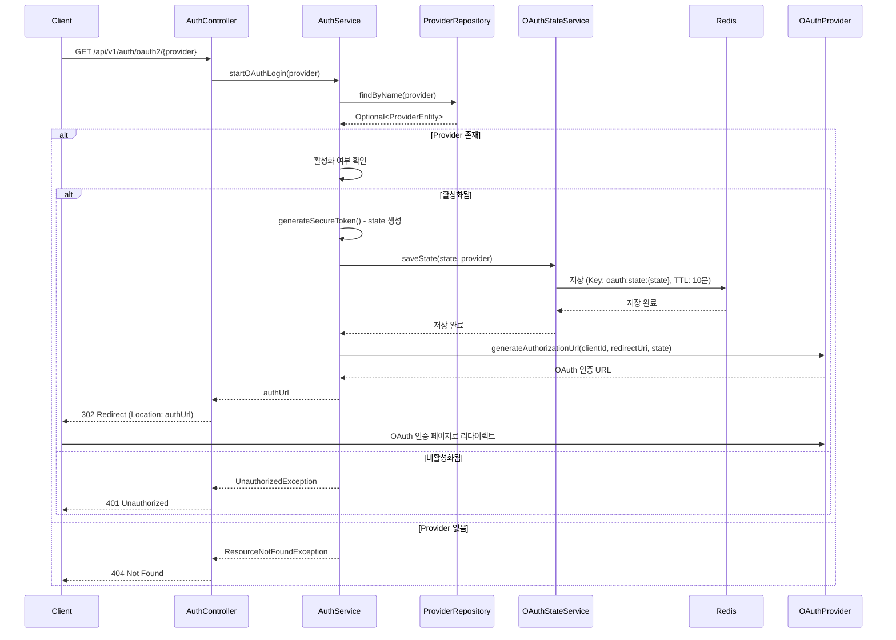

##### State 파라미터의 용도

OAuth 2.0 인증 플로우에서 `state` 파라미터는 **CSRF(Cross-Site Request Forgery) 공격 방지**를 위한 필수 보안 메커니즘입니다. (RFC 6749 Section 10.12 참조)

**주요 용도:**

1. **CSRF 공격 방지 (가장 중요)**
   - 공격자가 사용자 모르게 OAuth 인증을 시작하고, 콜백을 자신의 서버로 리다이렉트하는 공격을 방지
   - 서버에서 생성한 `state` 값을 저장하고, 콜백 시 검증하여 요청의 유효성을 확인
   - 검증 실패 시 인증 프로세스 중단

2. **요청 상태 유지**
   - OAuth 인증 시작 시점과 콜백 시점 사이의 상태 정보 유지
   - 사용자가 어떤 페이지에서 OAuth 로그인을 시작했는지 등의 컨텍스트 정보 전달 가능

3. **일회성 검증 (Replay Attack 방지)**
   - 한 번 사용된 `state` 값은 재사용 불가하도록 처리
   - 동일한 `state` 값으로 여러 번 인증 시도하는 공격 방지

**구현 요구사항:**

- **암호학적으로 안전한 랜덤 값 생성**: `generateSecureToken()` 메서드 사용
- **State 저장**: Redis에 `state` 값과 Provider 정보 저장 (만료 시간: 10분 권장)
- **State 검증**: 콜백 시 저장된 `state` 값과 비교하여 일치 여부 확인
- **일회성 사용**: 검증 완료 후 `state` 값 즉시 삭제

**Redis를 활용한 State 파라미터 저장 설계:**

현재 프로젝트는 Stateless 아키텍처(`SessionCreationPolicy.STATELESS`)를 사용하므로, **Redis를 활용한 state 파라미터 저장**이 권장됩니다.

**설계 개요:**

1. **OAuthStateService 구현**
   - 위치: `api/auth/src/main/java/com/tech/n/ai/api/auth/oauth/OAuthStateService.java`
   - Redis를 사용하여 state 파라미터 저장/검증/삭제

2. **Redis Key 설계**
   - Key 형식: `oauth:state:{state_value}`
   - Value: Provider 이름 (예: "GOOGLE", "NAVER", "KAKAO")
   - TTL: 10분 (600초) - 자동 만료

3. **주요 메서드**
   ```java
   // State 저장
   public void saveState(String state, String providerName)
   
   // State 검증 및 삭제 (일회성 사용)
   public void validateAndDeleteState(String state, String providerName)
   ```

4. **AuthService 통합**
   - `startOAuthLogin()`: State 생성 후 Redis에 저장
   - `handleOAuthCallback()`: State 검증 후 즉시 삭제

**Redis 저장 방식의 장점:**

- ✅ Stateless 아키텍처와 완벽 호환
- ✅ 분산 환경 지원 (여러 서버 인스턴스 간 state 공유)
- ✅ TTL 자동 만료로 관리 단순화
- ✅ 빠른 읽기/쓰기 성능
- ✅ RFC 6749 Section 10.12 요구사항 충족

**상세 구현 가이드:**
- `docs/oauth-provider-implementation-guide.md` Section 6.2 참조
- `docs/oauth-state-storage-research-result.md` 참조
- `docs/oauth-feign-client-migration-analysis.md`: OpenFeign 클라이언트를 통한 OAuth Provider API 호출 구현 가이드

**보안 고려사항:**

- **Non-guessable Value (RFC 6749 Section 10.10 준수)**: 
  - 암호학적으로 안전한 랜덤 값 생성 필수
  - 최소 32바이트 (256비트) 권장
  - 예측 불가능한 값이어야 함
- **HTTPS 필수**: State 파라미터는 반드시 HTTPS를 통해 전송
- **TTL 설정**: 10분 만료로 오래된 state 자동 무효화
- **일회성 사용**: 검증 완료 후 즉시 삭제하여 재사용 방지 (Replay Attack 방지)
- **Redis 보안**: 
  - Redis 인증(AUTH) 설정 권장
  - Redis TLS 암호화 전송 권장 (프로덕션 환경)

#### OAuth 로그인 콜백

```mermaid
sequenceDiagram
    participant Client
    participant AuthController
    participant AuthService
    participant ProviderRepository
    participant OAuthStateService
    participant Redis
    participant OAuthProvider
    participant OAuthProviderContract
    participant OAuthFeignClient
    participant OAuthServer
    participant UserRepository
    participant JwtTokenProvider
    participant RefreshTokenService
    participant Kafka

    Client->>AuthController: GET /api/v1/auth/oauth2/{provider}/callback<br/>?code=xxx&state=xxx
    AuthController->>AuthService: handleOAuthCallback(provider, code, state)
    AuthService->>ProviderRepository: findByName(provider)
    ProviderRepository-->>AuthService: Optional<ProviderEntity>
    alt Provider 존재 및 활성화
        AuthService->>OAuthStateService: validateAndDeleteState(state, provider)
        OAuthStateService->>Redis: 조회 및 삭제
        Redis-->>OAuthStateService: Provider 정보
        alt State 검증 성공
            OAuthStateService-->>AuthService: 검증 완료
            AuthService->>OAuthProvider: exchangeAccessToken(code, ...)
            OAuthProvider->>OAuthProviderContract: exchangeAccessToken(provider, request)
            OAuthProviderContract->>OAuthFeignClient: exchangeToken(params)
            OAuthFeignClient->>OAuthServer: Token 교환 요청 (POST)
            OAuthServer-->>OAuthFeignClient: Access Token
            OAuthFeignClient-->>OAuthProviderContract: Token Response
            OAuthProviderContract-->>OAuthProvider: Access Token
            OAuthProvider-->>AuthService: oauthAccessToken
            AuthService->>OAuthProvider: getUserInfo(accessToken)
            OAuthProvider->>OAuthProviderContract: getUserInfo(provider, accessToken)
            OAuthProviderContract->>OAuthFeignClient: getUserInfo(authorization)
            OAuthFeignClient->>OAuthServer: 사용자 정보 조회 요청 (GET)
            OAuthServer-->>OAuthFeignClient: 사용자 정보
            OAuthFeignClient-->>OAuthProviderContract: UserInfo Response
            OAuthProviderContract-->>OAuthProvider: OAuthUserInfo
            OAuthProvider-->>AuthService: 사용자 정보 (email, username, providerUserId)
        AuthService->>UserRepository: findByProviderIdAndProviderUserId()
        UserRepository-->>AuthService: Optional<UserEntity>
        alt 새 사용자
            AuthService->>UserRepository: save(UserEntity)
            UserRepository-->>AuthService: UserEntity
            AuthService->>JwtTokenProvider: generateAccessToken(payload)
            JwtTokenProvider-->>AuthService: Access Token
            AuthService->>JwtTokenProvider: generateRefreshToken(payload)
            JwtTokenProvider-->>AuthService: Refresh Token
            AuthService->>RefreshTokenService: saveRefreshToken()
            AuthService->>Kafka: publish(UserCreatedEvent)
            AuthService-->>AuthController: TokenResponse
            AuthController-->>Client: 200 OK (accessToken, refreshToken)
        else 기존 사용자
            AuthService->>UserRepository: update(UserEntity)
            AuthService->>JwtTokenProvider: generateAccessToken(payload)
            JwtTokenProvider-->>AuthService: Access Token
            AuthService->>JwtTokenProvider: generateRefreshToken(payload)
            JwtTokenProvider-->>AuthService: Refresh Token
            AuthService->>RefreshTokenService: saveRefreshToken()
            AuthService->>Kafka: publish(UserUpdatedEvent)
            AuthService-->>AuthController: TokenResponse
            AuthController-->>Client: 200 OK (accessToken, refreshToken)
        else State 검증 실패
            OAuthStateService-->>AuthService: UnauthorizedException
            AuthService-->>AuthController: UnauthorizedException
            AuthController-->>Client: 401 Unauthorized
        end
    else Provider 없음 또는 비활성화
        AuthService-->>AuthController: Exception
        AuthController-->>Client: 401/404 Error
    end
```

---

## 6. 실제 코드 활용 방법

### 6.1 새로운 엔드포인트에 인증 적용

#### 방법 1: SecurityConfig에서 경로별 인증 규칙 설정

```java
@Bean
public SecurityFilterChain securityFilterChain(HttpSecurity http) throws Exception {
    http
        .authorizeHttpRequests(auth -> auth
            .requestMatchers("/api/v1/auth/**").permitAll()
            .requestMatchers("/api/v1/admin/**").hasRole("ADMIN")  // ADMIN 역할만 접근 가능
            .requestMatchers("/api/v1/user/**").hasAnyRole("USER", "ADMIN")  // USER 또는 ADMIN 접근 가능
            .anyRequest().authenticated()  // 그 외 모든 요청은 인증 필요
        );
    return http.build();
}
```

#### 방법 2: @PreAuthorize 어노테이션 사용

```java
@RestController
@RequestMapping("/api/v1/user")
public class UserController {
    
    @GetMapping("/profile")
    @PreAuthorize("hasRole('USER')")
    public ResponseEntity<UserProfile> getProfile(Authentication authentication) {
        String userId = authentication.getName();  // JWT 토큰의 subject (userId)
        // 사용자 프로필 조회 로직
    }
    
    @DeleteMapping("/{id}")
    @PreAuthorize("hasRole('ADMIN')")
    public ResponseEntity<Void> deleteUser(@PathVariable Long id) {
        // 사용자 삭제 로직
    }
}
```

**주의사항**: `@PreAuthorize`를 사용하려면 `@EnableMethodSecurity` 어노테이션을 `SecurityConfig`에 추가해야 합니다.

```java
@Configuration
@EnableWebSecurity
@EnableMethodSecurity  // 추가 필요
public class SecurityConfig {
    // ...
}
```

#### 방법 3: Authentication 객체에서 사용자 정보 추출

```java
@RestController
@RequestMapping("/api/v1/user")
public class UserController {
    
    @GetMapping("/me")
    public ResponseEntity<UserInfo> getCurrentUser(Authentication authentication) {
        String userId = authentication.getName();  // JWT 토큰의 subject (userId)
        
        // 권한 정보 추출
        Collection<? extends GrantedAuthority> authorities = authentication.getAuthorities();
        
        // 사용자 정보 조회
        // ...
    }
}
```

### 6.2 권한 기반 접근 제어 구현

#### 역할(Role) 기반 접근 제어

```java
@Bean
public SecurityFilterChain securityFilterChain(HttpSecurity http) throws Exception {
    http
        .authorizeHttpRequests(auth -> auth
            .requestMatchers("/api/v1/admin/**").hasRole("ADMIN")
            .requestMatchers("/api/v1/user/**").hasAnyRole("USER", "ADMIN")
            .anyRequest().authenticated()
        );
    return http.build();
}
```

#### @PreAuthorize를 사용한 메서드 레벨 보안

```java
@RestController
@RequestMapping("/api/v1/admin")
public class AdminController {
    
    @GetMapping("/users")
    @PreAuthorize("hasRole('ADMIN')")
    public ResponseEntity<List<User>> getAllUsers() {
        // 관리자만 접근 가능
    }
    
    @PostMapping("/users/{id}/role")
    @PreAuthorize("hasRole('ADMIN')")
    public ResponseEntity<Void> updateUserRole(
            @PathVariable Long id,
            @RequestBody RoleUpdateRequest request) {
        // 관리자만 접근 가능
    }
}
```

### 6.3 보안 설정 커스터마이징

#### CORS 설정 변경

```java
@Bean
public CorsConfigurationSource corsConfigurationSource() {
    CorsConfiguration configuration = new CorsConfiguration();
    
    // 운영 환경: 특정 도메인만 허용
    configuration.setAllowedOrigins(List.of("https://example.com", "https://www.example.com"));
    configuration.setAllowedMethods(Arrays.asList("GET", "POST", "PUT", "DELETE", "PATCH", "OPTIONS"));
    configuration.setAllowedHeaders(List.of("Authorization", "Content-Type"));
    configuration.setExposedHeaders(List.of("Authorization", "X-Request-Id"));
    configuration.setAllowCredentials(true);  // 특정 도메인 지정 시 true 가능
    configuration.setMaxAge(3600L);
    
    UrlBasedCorsConfigurationSource source = new UrlBasedCorsConfigurationSource();
    source.registerCorsConfiguration("/**", configuration);
    
    return source;
}
```

#### 세션 정책 변경 (현재는 STATELESS이지만, 필요 시 변경)

```java
@Bean
public SecurityFilterChain securityFilterChain(HttpSecurity http) throws Exception {
    http
        .sessionManagement(session -> session
            .sessionCreationPolicy(SessionCreationPolicy.IF_REQUIRED)  // 필요 시에만 세션 생성
            .maximumSessions(1)  // 동시 세션 수 제한
            .maxSessionsPreventsLogin(false)  // 초과 시 기존 세션 만료
        );
    return http.build();
}
```

#### 추가 필터 추가

```java
@Bean
public SecurityFilterChain securityFilterChain(HttpSecurity http) throws Exception {
    http
        .addFilterBefore(jwtAuthenticationFilter, UsernamePasswordAuthenticationFilter.class)
        .addFilterAfter(customLoggingFilter, JwtAuthenticationFilter.class);  // 추가 필터
    return http.build();
}
```

#### 에러 핸들링 커스터마이징

```java
@Component
public class CustomAuthenticationEntryPoint implements AuthenticationEntryPoint {
    
    @Override
    public void commence(
            HttpServletRequest request,
            HttpServletResponse response,
            AuthenticationException authException) throws IOException {
        
        response.setStatus(HttpServletResponse.SC_UNAUTHORIZED);
        response.setContentType(MediaType.APPLICATION_JSON_VALUE);
        response.setCharacterEncoding("UTF-8");
        
        ApiResponse<Void> errorResponse = ApiResponse.error(
            ErrorCodeConstants.AUTH_FAILED,
            new MessageCode(ErrorCodeConstants.MESSAGE_CODE_AUTH_FAILED, "인증에 실패했습니다.")
        );
        
        objectMapper.writeValue(response.getWriter(), errorResponse);
    }
}
```

```java
@Bean
public SecurityFilterChain securityFilterChain(HttpSecurity http) throws Exception {
    http
        .exceptionHandling(exceptions -> exceptions
            .authenticationEntryPoint(customAuthenticationEntryPoint)  // 커스텀 인증 실패 핸들러
        );
    return http.build();
}
```

---

## 7. 보안 고려사항

### 7.1 토큰 보안 관리

1. **Secret Key 관리**
   - 운영 환경에서는 반드시 강력한 Secret Key 사용 (최소 256비트)
   - 환경 변수나 시크릿 관리 시스템 사용
   - Secret Key는 절대 코드에 하드코딩하지 않음

2. **토큰 만료 시간 설정**
   - Access Token: 짧은 유효기간 (1시간 이내 권장)
   - Refresh Token: 긴 유효기간 (7일 이내 권장)
   - 토큰 갱신 시 기존 토큰 무효화

3. **HTTPS 사용**
   - 프로덕션 환경에서는 반드시 HTTPS 사용
   - 토큰이 네트워크를 통해 전송될 때 암호화

### 7.2 비밀번호 보안

1. **BCryptPasswordEncoder 사용**
   - Salt rounds 10-12 권장 (현재 12 사용)
   - 비밀번호는 절대 평문으로 저장하지 않음

2. **비밀번호 정책**
   - 최소 길이 요구사항
   - 복잡도 요구사항 (대소문자, 숫자, 특수문자)
   - 비밀번호 재사용 방지

### 7.3 CORS 보안

1. **운영 환경 설정**
   - 특정 도메인만 허용
   - `allowCredentials(true)` 사용 시 특정 도메인 지정 필수

2. **개발 환경 설정**
   - 개발 환경에서만 `allowedOrigins("*")` 사용
   - 프로덕션 환경에서는 절대 사용하지 않음

### 7.4 추가 보안 권장사항

1. **Rate Limiting**
   - 로그인 시도 횟수 제한
   - API 호출 빈도 제한

2. **토큰 무효화**
   - 로그아웃 시 Refresh Token 무효화
   - 토큰 갱신 시 기존 토큰 무효화

3. **감사 로그**
   - 로그인/로그아웃 이벤트 기록
   - 보안 관련 이벤트 모니터링

4. **에러 메시지**
   - 보안 관련 에러 메시지는 구체적인 정보를 노출하지 않음
   - "이메일 또는 비밀번호가 올바르지 않습니다."와 같이 일반적인 메시지 사용

---

## 8. 참고 자료

### 8.1 Spring Security 공식 문서

- [Spring Security Reference Documentation](https://docs.spring.io/spring-security/reference/)
- [Spring Security Servlet Configuration](https://docs.spring.io/spring-security/reference/servlet/configuration/java.html)
- [Spring Security Authentication](https://docs.spring.io/spring-security/reference/servlet/authentication/passwords/basic.html)
- [Spring Security Password Storage](https://docs.spring.io/spring-security/reference/features/authentication/password-storage.html)

### 8.2 JWT 관련 문서

- [JWT 공식 스펙 (RFC 7519)](https://tools.ietf.org/html/rfc7519)
- [jjwt 라이브러리 공식 문서](https://github.com/jwtk/jjwt)

### 8.3 프로젝트 내 코드 참조

- `common/security/src/main/java/com/tech/n/ai/common/security/config/SecurityConfig.java`
- `common/security/src/main/java/com/tech/n/ai/common/security/filter/JwtAuthenticationFilter.java`
- `common/security/src/main/java/com/tech/n/ai/common/security/jwt/JwtTokenProvider.java`
- `api/auth/src/main/java/com/tech/n/ai/api/auth/service/AuthService.java`

---

**작성일**: 2025-01-27  
**버전**: 1.0  
**작성자**: Spring Security 아키텍트
