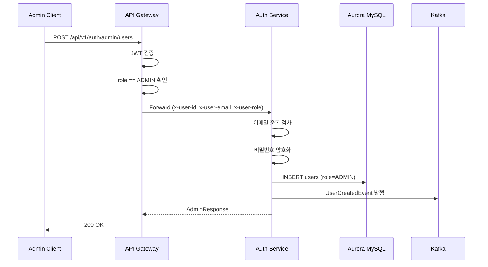
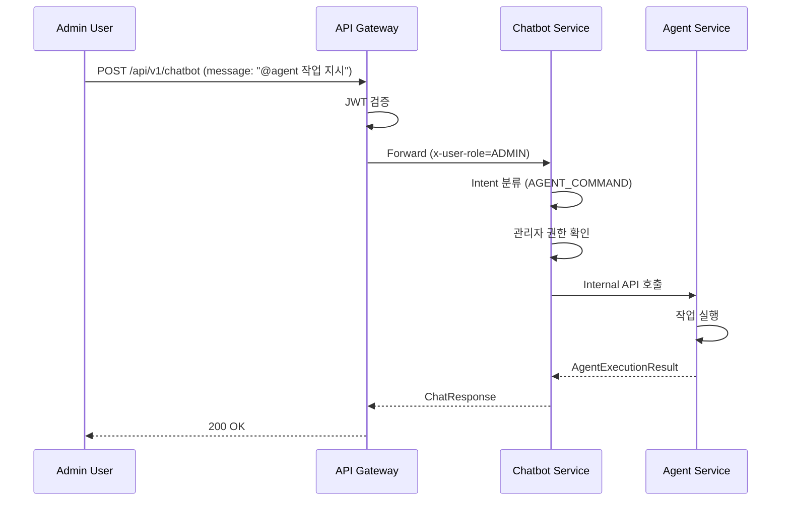

# 관리자 권한 기반 인증/인가 시스템 설계서 작성 프롬프트

## 프롬프트 목적

이 프롬프트는 `api/auth` 모듈에 **역할(Role) 기반 접근 제어**를 구현하기 위한 **상세 설계서** 작성을 지시합니다. 설계서는 기존 인증/인가 시스템과의 정합성을 유지하며, SOLID 원칙과 클린코드 원칙을 준수해야 합니다.

---

## 설계서 작성 목표

1. **users 테이블에 role 컬럼 추가 및 역할 기반 접근 제어 구현**
2. **관리자 계정 CRUD API 설계 및 구현 가이드 제공**
3. **api-gateway에서 사용자 정보(id, email, role) 전달 메커니즘 설계**
4. **chatbot/agent 모듈의 역할 기반 접근 제어 설계**
5. **일반 채팅과 AI Agent 작업 지시 구분 메커니즘 설계**

---

## 필수 참고 문서

설계서 작성 시 반드시 다음 문서 및 코드를 참고하고, 정합성을 유지해야 합니다.

### 1. 핵심 설계 문서

| 문서 경로 | 참고 내용 |
|-----------|-----------|
| `docs/step6/spring-security-auth-design-guide.md` | Spring Security 인증/인가 아키텍처, JWT 토큰 관리 전략 |
| `docs/step1/3. aurora-schema-design.md` | Aurora MySQL 테이블 설계, Soft Delete 원칙 |

### 2. 기존 구현 코드 참고

| 코드 경로 | 참고 내용 |
|-----------|-----------|
| `api/auth/src/main/java/com/tech/n/ai/api/auth/controller/AuthController.java` | 기존 API 엔드포인트 구조 및 패턴 |
| `api/auth/src/main/java/com/tech/n/ai/api/auth/service/AuthService.java` | 회원가입, 로그인 비즈니스 로직 |
| `domain/aurora/src/main/java/com/tech/n/ai/domain/mariadb/entity/auth/UserEntity.java` | User 엔티티 구조 |
| `common/security/src/main/java/com/tech/n/ai/common/security/jwt/JwtTokenProvider.java` | JWT 토큰 생성/검증 |
| `common/security/src/main/java/com/tech/n/ai/common/security/jwt/JwtTokenPayload.java` | JWT 페이로드 구조 (userId, email, role) |
| `api/gateway/src/main/java/com/tech/n/ai/api/gateway/filter/JwtAuthenticationGatewayFilter.java` | Gateway JWT 필터, x-user-id/email/role 헤더 주입 |
| `api/chatbot/src/main/java/com/tech/n/ai/api/chatbot/service/ChatbotServiceImpl.java` | Intent 분류 파이프라인 (LLM_DIRECT, WEB_SEARCH_REQUIRED, RAG_REQUIRED) |
| `api/agent/src/main/java/com/tech/n/ai/api/agent/controller/AgentController.java` | 현재 내부 API Key 인증 방식 |

### 3. 테스트 코드 패턴 참고

| 코드 경로 | 참고 내용 |
|-----------|-----------|
| `api/bookmark/src/test/http/*.http` | IntelliJ HTTP Client 테스트 패턴 |

---

## 설계서에 포함되어야 할 섹션

### 1. 개요 (Overview)

다음 내용을 포함:
- 역할 기반 접근 제어(RBAC) 도입 목적 및 범위
- 기존 인증 시스템과의 관계
- 주요 요구사항 요약

### 2. 역할(Role) 설계

#### 2.1 역할 정의

| 역할 | 설명 | 권한 범위 |
|------|------|-----------|
| `USER` | 일반 회원 | chatbot API 접근 가능 |
| `ADMIN` | 관리자 | chatbot, agent API 접근 가능 + 관리자 계정 관리 |

#### 2.2 데이터베이스 스키마 변경

```sql
-- users 테이블에 role 컬럼 추가
ALTER TABLE users ADD COLUMN role VARCHAR(20) NOT NULL DEFAULT 'USER';

-- role 값 제약조건
ALTER TABLE users ADD CONSTRAINT chk_users_role CHECK (role IN ('USER', 'ADMIN'));
```

#### 2.3 UserEntity 수정

```java
@Column(name = "role", length = 20, nullable = false)
@Enumerated(EnumType.STRING)
private Role role = Role.USER;
```

### 3. 관리자 계정 관리 API 설계

#### 3.1 엔드포인트 명세

| HTTP Method | URL | 설명 | 권한 |
|-------------|-----|------|------|
| POST | `/api/v1/auth/admin/users` | 관리자 계정 생성 | ADMIN |
| GET | `/api/v1/auth/admin/users` | 관리자 목록 조회 | ADMIN |
| GET | `/api/v1/auth/admin/users/{userId}` | 관리자 상세 조회 | ADMIN |
| PUT | `/api/v1/auth/admin/users/{userId}` | 관리자 정보 수정 | ADMIN |
| DELETE | `/api/v1/auth/admin/users/{userId}` | 관리자 계정 삭제 (Soft Delete) | ADMIN |

#### 3.2 요청/응답 DTO 설계

**AdminCreateRequest**
```java
public record AdminCreateRequest(
    @NotBlank String email,
    @NotBlank String username,
    @NotBlank @Size(min = 8) String password
) {}
```

**AdminUpdateRequest**
```java
public record AdminUpdateRequest(
    String username,
    String password
) {}
```

**AdminResponse**
```java
public record AdminResponse(
    Long id,
    String email,
    String username,
    String role,
    LocalDateTime createdAt,
    LocalDateTime lastLoginAt
) {}
```

#### 3.3 비즈니스 로직

1. **관리자 생성**
   - 이메일 중복 검사
   - 비밀번호 암호화 (BCrypt)
   - role = ADMIN 설정
   - Kafka 이벤트 발행 (UserCreatedEvent)

2. **관리자 수정**
   - 존재 여부 확인
   - 비밀번호 변경 시 암호화
   - 히스토리 자동 저장

3. **관리자 삭제**
   - Soft Delete 처리
   - 관련 RefreshToken 무효화
   - Kafka 이벤트 발행 (UserDeletedEvent)

### 4. API Gateway 역할 정보 전달 설계

#### 4.1 현재 구현 분석

현재 `JwtAuthenticationGatewayFilter`에서 다음 헤더를 주입:
- `x-user-id`: 사용자 ID
- `x-user-email`: 사용자 이메일
- `x-user-role`: 사용자 역할

#### 4.2 JWT 토큰 페이로드 확인

`JwtTokenPayload` record가 이미 `userId`, `email`, `role` 필드를 포함하고 있으므로 추가 수정 불필요.

#### 4.3 백엔드 서비스에서 역할 정보 활용

각 백엔드 서비스에서 `x-user-role` 헤더를 읽어 권한 검증:

```java
@GetMapping("/admin-only")
public ResponseEntity<?> adminOnly(
    @RequestHeader("x-user-role") String role
) {
    if (!"ADMIN".equals(role)) {
        throw new ForbiddenException("관리자 권한이 필요합니다.");
    }
    // ...
}
```

### 5. Chatbot 모듈 접근 제어 설계

#### 5.1 접근 권한

- `USER`: 접근 가능
- `ADMIN`: 접근 가능

#### 5.2 구현 방식

현재 `/api/v1/chatbot` 경로는 JWT 인증 필요. Gateway 필터에서 토큰 검증 후 통과하므로 별도 역할 검사 불필요.

### 6. Agent 모듈 접근 제어 설계

#### 6.1 현재 구현 분석

현재 `AgentController`는 내부 API Key (`X-Internal-Api-Key`) 인증 사용:
```java
@PostMapping("/run")
public ResponseEntity<ApiResponse<AgentExecutionResult>> runAgent(
    @Valid @RequestBody AgentRunRequest request,
    @RequestHeader("X-Internal-Api-Key") String requestApiKey
) {
    validateApiKey(requestApiKey);
    // ...
}
```

#### 6.2 역할 기반 인증으로 변경

**옵션 A: Gateway 레벨 역할 검증 (권장)**
```java
// JwtAuthenticationGatewayFilter 수정
private boolean isAdminOnlyPath(String path) {
    return path.startsWith("/api/v1/agent");
}

// 관리자 전용 경로 검증
if (isAdminOnlyPath(path) && !"ADMIN".equals(payload.role())) {
    return handleForbidden(exchange);
}
```

**옵션 B: Controller 레벨 역할 검증**
```java
@PostMapping("/run")
public ResponseEntity<ApiResponse<AgentExecutionResult>> runAgent(
    @Valid @RequestBody AgentRunRequest request,
    @RequestHeader("x-user-role") String role
) {
    if (!"ADMIN".equals(role)) {
        throw new ForbiddenException("관리자 권한이 필요합니다.");
    }
    // ...
}
```

#### 6.3 권장 방식

**옵션 A (Gateway 레벨)** 권장:
- 중앙 집중식 권한 관리
- 백엔드 서비스 코드 간소화
- 일관된 보안 정책 적용

### 7. 채팅 유형 구분 설계

#### 7.1 요구사항

일반 채팅과 AI Agent 작업 지시를 구분해야 함.

#### 7.2 현재 Intent 분류 시스템

`IntentClassificationService`에서 다음 Intent로 분류:
- `LLM_DIRECT`: 일반 대화
- `WEB_SEARCH_REQUIRED`: 웹 검색 필요
- `RAG_REQUIRED`: 지식 베이스 검색 필요

#### 7.3 새로운 Intent 추가

```java
public enum Intent {
    LLM_DIRECT,           // 일반 대화
    WEB_SEARCH_REQUIRED,  // 웹 검색 필요
    RAG_REQUIRED,         // 지식 베이스 검색
    AGENT_COMMAND         // AI Agent 작업 지시 (신규)
}
```

#### 7.4 Agent 명령 감지 로직

```java
// IntentClassificationService 수정
public Intent classifyIntent(String message) {
    // Agent 명령 패턴 감지
    if (isAgentCommand(message)) {
        return Intent.AGENT_COMMAND;
    }
    // 기존 로직...
}

private boolean isAgentCommand(String message) {
    String lowerMessage = message.toLowerCase();
    return lowerMessage.startsWith("@agent") ||
           lowerMessage.contains("작업 지시") ||
           lowerMessage.contains("에이전트") ||
           // LLM 기반 분류도 고려
           classifyWithLLM(message) == Intent.AGENT_COMMAND;
}
```

#### 7.5 ChatbotServiceImpl 수정

```java
switch (intent) {
    case LLM_DIRECT -> {
        response = handleGeneralConversation(request, sessionId, chatMemory);
        sources = Collections.emptyList();
    }
    case AGENT_COMMAND -> {
        // 관리자 권한 확인
        if (!isAdmin(userId)) {
            throw new ForbiddenException("Agent 명령은 관리자만 사용할 수 있습니다.");
        }
        response = delegateToAgent(request, userId);
        sources = Collections.emptyList();
    }
    // ...
}
```

### 8. 시퀀스 다이어그램

#### 8.1 관리자 계정 생성 흐름



#### 8.2 Agent 명령 처리 흐름



### 9. 에러 처리

#### 9.1 예외 시나리오

| 상황 | 예외 클래스 | HTTP 상태 | 에러 코드 |
|------|------------|-----------|-----------|
| 권한 없음 | `ForbiddenException` | 403 | 4003 |
| 이메일 중복 | `ConflictException` | 409 | 4005 |
| 사용자 미존재 | `ResourceNotFoundException` | 404 | 4004 |
| 인증 실패 | `UnauthorizedException` | 401 | 4001 |

### 10. 테스트 전략

#### 10.1 HTTP 테스트 파일

`api/bookmark/src/test/http/` 디렉토리에 다음 테스트 파일 추가:

**12-admin-create.http**
```http
### 1. 관리자 계정 생성 성공
POST {{gatewayUrl}}/api/v1/auth/admin/users
Content-Type: application/json
Authorization: Bearer {{adminAccessToken}}

{
  "email": "newadmin@example.com",
  "username": "newadmin",
  "password": "Admin123!"
}

> 

### 2. 실패 케이스 - 일반 사용자 권한으로 시도
POST {{gatewayUrl}}/api/v1/auth/admin/users
Content-Type: application/json
Authorization: Bearer {{userAccessToken}}

{
  "email": "test@example.com",
  "username": "test",
  "password": "Test123!"
}

> 
```

#### 10.2 단위 테스트

- `AdminServiceTest`: 관리자 CRUD 비즈니스 로직 테스트
- `IntentClassificationServiceTest`: Agent 명령 감지 테스트
- `JwtAuthenticationGatewayFilterTest`: 역할 기반 라우팅 테스트

### 11. 구현 순서

1. **Phase 1: 데이터베이스 스키마 변경**
   - users 테이블에 role 컬럼 추가
   - Flyway 마이그레이션 스크립트 작성

2. **Phase 2: 엔티티 및 DTO 수정**
   - UserEntity에 role 필드 추가
   - Role enum 생성
   - 관리자 관련 DTO 생성

3. **Phase 3: 관리자 관리 API 구현**
   - AdminController 생성
   - AdminService 구현
   - Repository 메서드 추가

4. **Phase 4: Gateway 역할 검증 구현**
   - JwtAuthenticationGatewayFilter 수정
   - 관리자 전용 경로 검증 추가

5. **Phase 5: Intent 분류 확장**
   - AGENT_COMMAND Intent 추가
   - IntentClassificationService 수정
   - ChatbotServiceImpl 수정

6. **Phase 6: 테스트 작성**
   - HTTP 테스트 파일 작성
   - 단위 테스트 작성

---

## 검증 기준

설계서가 다음 기준을 모두 만족해야 합니다:

### 1. 정합성 검증

- [ ] 기존 인증 시스템과의 정합성
- [ ] JWT 토큰 페이로드 구조 유지
- [ ] Gateway 필터 로직과의 일관성
- [ ] Soft Delete 원칙 준수

### 2. 완전성 검증

- [ ] 모든 API 엔드포인트 명세 포함
- [ ] 시퀀스 다이어그램 포함
- [ ] 에러 처리 시나리오 명시
- [ ] 테스트 전략 포함

### 3. 설계 원칙 준수

- [ ] SOLID 원칙 적용
- [ ] 객체지향 설계 기법 적용
- [ ] 클린코드 원칙 준수
- [ ] 최소한의 한글 주석

### 4. 보안 검증

- [ ] 역할 기반 접근 제어 구현
- [ ] 권한 검증 로직 포함
- [ ] 관리자 전용 API 보호

---

## 제한 사항

1. **외부 자료 참고 시 공식 문서만 사용**
   - Spring Security: https://docs.spring.io/spring-security/reference/
   - Spring Cloud Gateway: https://docs.spring.io/spring-cloud-gateway/docs/current/reference/html/
   - JWT (RFC 7519): https://tools.ietf.org/html/rfc7519

2. **오버엔지니어링 금지**
   - 불필요한 추상화 계층 추가 금지
   - 요구사항에 명시되지 않은 기능 추가 금지
   - 복잡한 디자인 패턴 남용 금지

3. **기존 코드 패턴 준수**
   - Facade 패턴 유지
   - Reader/Writer Repository 분리 유지
   - ApiResponse 형식 유지

---

## 설계서 출력 위치

```
api/auth/docs/admin-role-based-auth-design.md
```

---

## 실행 지시

다음 명령어로 설계서 작성을 시작하세요:

```
위의 모든 요구사항과 검증 기준을 충족하는 관리자 권한 기반 인증/인가 시스템 상세 설계서를 작성하세요.
```

---

**작성일**: 2026-02-03
**버전**: 1.0
**대상 모듈**: api/auth
